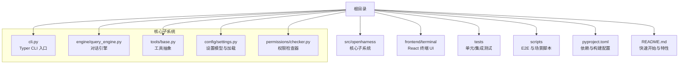
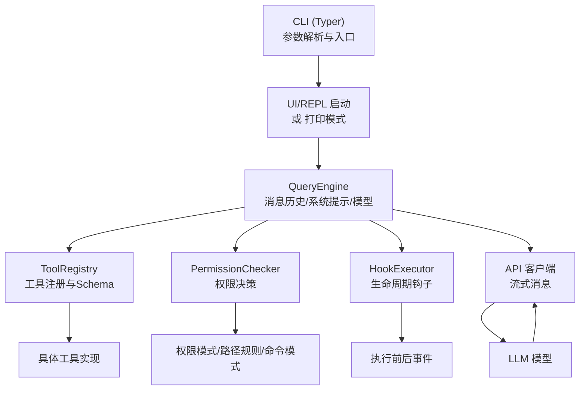
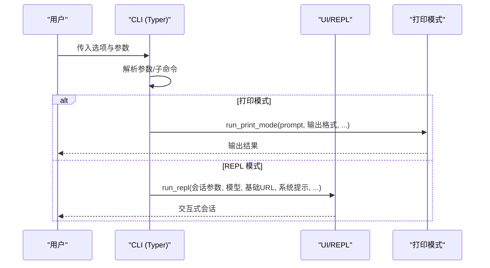
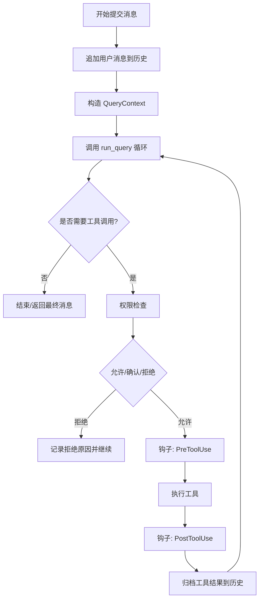
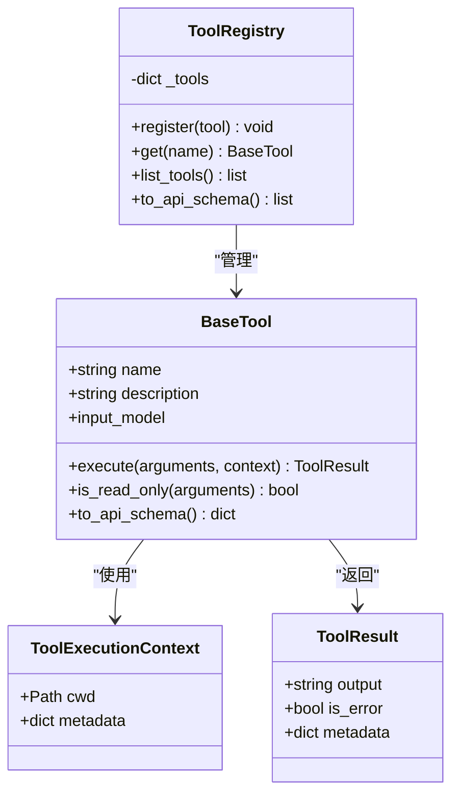
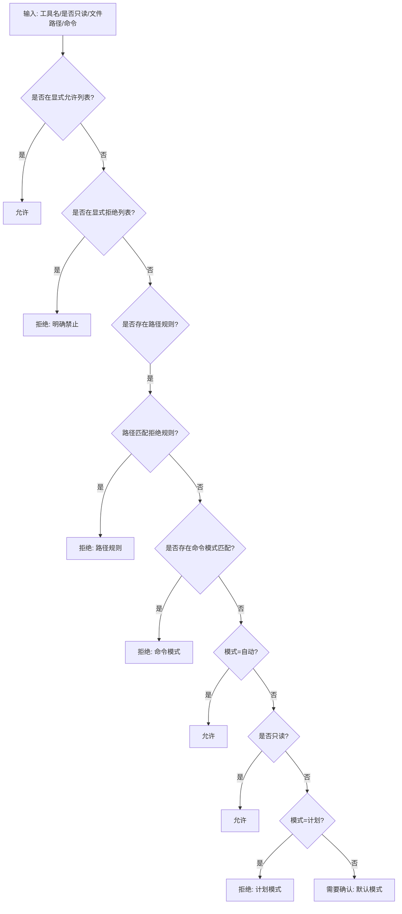
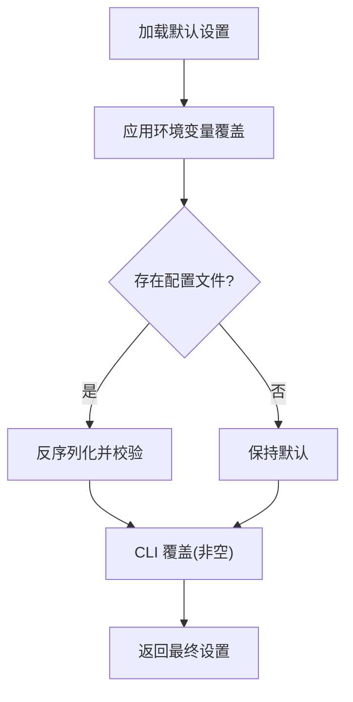
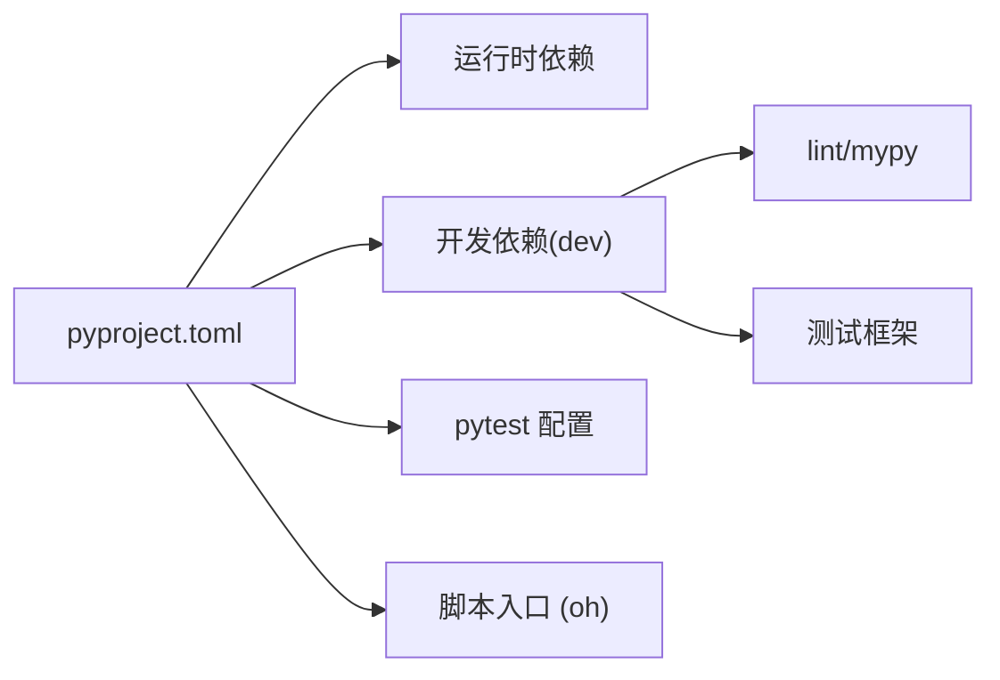

# 开发者指南

<cite>
**本文引用的文件**
- [README.md](file://README.md)
- [pyproject.toml](file://pyproject.toml)
- [src/openharness/__main__.py](file://src/openharness/__main__.py)
- [src/openharness/cli.py](file://src/openharness/cli.py)
- [src/openharness/tools/base.py](file://src/openharness/tools/base.py)
- [src/openharness/config/settings.py](file://src/openharness/config/settings.py)
- [src/openharness/permissions/checker.py](file://src/openharness/permissions/checker.py)
- [src/openharness/engine/query_engine.py](file://src/openharness/engine/query_engine.py)
- [scripts/e2e_smoke.py](file://scripts/e2e_smoke.py)
- [scripts/test_harness_features.py](file://scripts/test_harness_features.py)
- [frontend/terminal/package.json](file://frontend/terminal/package.json)
- [tests/conftest.py](file://tests/conftest.py)
- [LICENSE](file://LICENSE)
</cite>

## 目录
1. [简介](#简介)
2. [项目结构](#项目结构)
3. [核心组件](#核心组件)
4. [架构总览](#架构总览)
5. [详细组件分析](#详细组件分析)
6. [依赖关系分析](#依赖关系分析)
7. [性能与可维护性建议](#性能与可维护性建议)
8. [调试与故障排查](#调试与故障排查)
9. [贡献流程与发布规范](#贡献流程与发布规范)
10. [结论](#结论)
11. [附录](#附录)

## 简介
本指南面向希望参与 OpenHarness 开发的工程师，覆盖开发环境搭建、依赖与工具链、代码规范与最佳实践、测试策略（单元/集成/E2E）、贡献流程、调试技巧与常见问题处理。OpenHarness 是一个以 Python 实现的轻量级智能体“ Harness”，围绕 LLM 提供工具、知识、权限、记忆、多代理协作等能力，并通过 CLI 与 React 终端 UI 提供交互体验。

## 项目结构
仓库采用按功能域分层的组织方式：核心引擎在 src/openharness 下，前端终端 UI 在 frontend/terminal，测试与脚本位于 tests 与 scripts，根目录提供项目元信息与构建配置。

图表来源
- [src/openharness/cli.py:1-378](file://src/openharness/cli.py#L1-L378)
- [src/openharness/engine/query_engine.py:1-101](file://src/openharness/engine/query_engine.py#L1-L101)
- [src/openharness/tools/base.py:1-76](file://src/openharness/tools/base.py#L1-L76)
- [src/openharness/config/settings.py:1-161](file://src/openharness/config/settings.py#L1-L161)
- [src/openharness/permissions/checker.py:1-100](file://src/openharness/permissions/checker.py#L1-L100)
- [pyproject.toml:1-58](file://pyproject.toml#L1-L58)
- [README.md:82-124](file://README.md#L82-L124)

章节来源
- [README.md:82-124](file://README.md#L82-L124)
- [pyproject.toml:1-58](file://pyproject.toml#L1-L58)

## 核心组件
- CLI 入口与命令体系：基于 Typer 构建，支持主会话、打印模式、MCP/插件/认证子命令，以及丰富的运行时参数（模型、输出格式、权限模式、系统提示等）。
- 对话引擎：封装消息历史、工具注册表、权限检查、钩子执行与成本统计，驱动“查询-工具调用-循环”的主回路。
- 工具抽象：统一的工具基类、执行上下文与结果模型，支持输入校验、只读判定与 API Schema 导出。
- 设置与配置：多源合并（CLI > 环境变量 > 配置文件 > 默认值），涵盖 API、行为、内存、UI、权限等。
- 权限系统：基于模式（默认/自动/计划）与路径规则、命令模式匹配的细粒度控制。

章节来源
- [src/openharness/cli.py:1-378](file://src/openharness/cli.py#L1-L378)
- [src/openharness/engine/query_engine.py:1-101](file://src/openharness/engine/query_engine.py#L1-L101)
- [src/openharness/tools/base.py:1-76](file://src/openharness/tools/base.py#L1-L76)
- [src/openharness/config/settings.py:1-161](file://src/openharness/config/settings.py#L1-L161)
- [src/openharness/permissions/checker.py:1-100](file://src/openharness/permissions/checker.py#L1-L100)

## 架构总览
OpenHarness 的核心是“查询引擎 + 工具注册表 + 权限检查 + 钩子执行”的闭环。CLI 负责解析参数与启动 UI 或非交互模式；引擎负责将用户提示转为模型消息，根据工具调用结果迭代，直到停止条件。

图表来源
- [src/openharness/cli.py:179-378](file://src/openharness/cli.py#L179-L378)
- [src/openharness/engine/query_engine.py:18-101](file://src/openharness/engine/query_engine.py#L18-L101)
- [src/openharness/tools/base.py:30-76](file://src/openharness/tools/base.py#L30-L76)
- [src/openharness/permissions/checker.py:30-100](file://src/openharness/permissions/checker.py#L30-L100)

## 详细组件分析

### CLI 与运行模式
- 主命令：支持会话续聊、恢复、命名、模型/努力级别、最大轮次、输出格式（文本/JSON/stream-json）、权限模式、系统提示拼接、设置文件、基础地址、API Key、后端仅模式等。
- 子命令：mcp 列表/添加/移除、plugin 列表/安装/卸载、auth 状态/登录/登出。
- 运行模式：非交互打印模式与 REPL 模式，分别调用对应的 UI 启动函数。

图表来源
- [src/openharness/cli.py:179-378](file://src/openharness/cli.py#L179-L378)

章节来源
- [src/openharness/cli.py:1-378](file://src/openharness/cli.py#L1-L378)

### 查询引擎与工具执行回路
- QueryEngine 维护消息历史与成本统计，接收用户提示后构造 QueryContext 并驱动 run_query。
- 回路中根据模型响应决定是否继续，遇到工具调用则进行权限检查、钩子执行、工具执行与结果归档，再将结果注入消息历史继续下一轮。

图表来源
- [src/openharness/engine/query_engine.py:81-101](file://src/openharness/engine/query_engine.py#L81-L101)
- [src/openharness/tools/base.py:30-76](file://src/openharness/tools/base.py#L30-L76)
- [src/openharness/permissions/checker.py:43-100](file://src/openharness/permissions/checker.py#L43-L100)

章节来源
- [src/openharness/engine/query_engine.py:1-101](file://src/openharness/engine/query_engine.py#L1-L101)
- [src/openharness/tools/base.py:1-76](file://src/openharness/tools/base.py#L1-L76)
- [src/openharness/permissions/checker.py:1-100](file://src/openharness/permissions/checker.py#L1-L100)

### 工具抽象与注册
- BaseTool 定义工具名称、描述、输入模型与异步执行接口；提供只读判定与 API Schema 导出。
- ToolRegistry 提供注册、查找、枚举与 API Schema 序列化能力。

图表来源
- [src/openharness/tools/base.py:13-76](file://src/openharness/tools/base.py#L13-L76)

章节来源
- [src/openharness/tools/base.py:1-76](file://src/openharness/tools/base.py#L1-L76)

### 权限检查与模式
- 支持三种模式：默认（写操作需确认）、自动（全部放行）、计划（阻止所有写操作）。
- 支持显式允许/拒绝工具列表、路径规则（通配符匹配）、命令模式匹配。
- 决策过程优先级：显式允许 > 显式拒绝 > 路径规则 > 命令模式 > 模式规则 > 只读豁免。

图表来源
- [src/openharness/permissions/checker.py:43-100](file://src/openharness/permissions/checker.py#L43-L100)

章节来源
- [src/openharness/permissions/checker.py:1-100](file://src/openharness/permissions/checker.py#L1-L100)

### 设置与配置加载
- 多源合并优先级：CLI 参数 > 环境变量 > 配置文件（~/.openharness/settings.json）> 默认值。
- 支持 API Key、模型、最大 Token、系统提示、权限、钩子、内存、插件启用、MCP 服务器等配置项。

图表来源
- [src/openharness/config/settings.py:123-161](file://src/openharness/config/settings.py#L123-L161)

章节来源
- [src/openharness/config/settings.py:1-161](file://src/openharness/config/settings.py#L1-L161)

## 依赖关系分析
- 构建与打包：使用 hatchling，包路径为 src/openharness。
- 运行时依赖：anthropic、rich、prompt-toolkit、textual、typer、pydantic、httpx、websockets、mcp、pyyaml、watchfiles、pyperclip 等。
- 开发依赖：pytest、pytest-asyncio、pytest-cov、ruff、mypy 等。
- 脚本与测试：scripts 目录提供多种 E2E 场景与特性验证脚本；tests 目录提供单元/集成测试，pytest 配置在 pyproject 中声明。

图表来源
- [pyproject.toml:1-58](file://pyproject.toml#L1-L58)

章节来源
- [pyproject.toml:1-58](file://pyproject.toml#L1-L58)

## 性能与可维护性建议
- 异步与并发：工具执行支持并行路径（如查询循环中的 gather 使用），在工具间无状态依赖时可显著提升吞吐。
- 成本与令牌：QueryEngine 内置成本追踪，建议在高负载场景关注 max_tokens 与模型计费。
- 代码质量：遵循 ruff 行长与目标版本约束；严格类型检查（mypy strict）有助于减少运行期错误。
- 配置优先级：尽量通过环境变量与配置文件集中管理，避免在代码中硬编码敏感信息。

## 调试与故障排查
- 调试开关：CLI 提供 --debug/-d 选项，便于开启详细日志。
- 权限相关：若工具被拒绝，优先检查权限模式、路径规则与命令模式；必要时临时切换到自动模式定位问题。
- API 重试：E2E 脚本验证了重试配置与真实调用路径，可参考其断言逻辑定位服务端异常。
- 终端 UI：前端使用 React/Ink，开发时可通过 package.json 的脚本启动本地调试。

章节来源
- [src/openharness/cli.py:309-315](file://src/openharness/cli.py#L309-L315)
- [src/openharness/permissions/checker.py:43-100](file://src/openharness/permissions/checker.py#L43-L100)
- [scripts/test_harness_features.py:44-73](file://scripts/test_harness_features.py#L44-L73)
- [frontend/terminal/package.json:5-7](file://frontend/terminal/package.json#L5-L7)

## 贡献流程与发布规范
- 开发环境
  - 使用 uv 与 Python 3.11+，安装开发依赖：uv sync --extra dev。
  - 运行 pytest 验证测试通过。
- 分支与提交
  - 建议采用功能分支，提交信息清晰描述变更目的与影响范围。
- 代码审查
  - 提交 PR 前确保通过 lint（ruff）、类型检查（mypy）与测试（pytest）。
- 测试要求
  - 单元/集成测试：tests 目录，pytest 自动发现。
  - E2E 测试：scripts 目录下的场景脚本，README 提供运行方式。
- 发布
  - 版本号与打包由 pyproject.toml 管理，遵循 MIT 许可证。

章节来源
- [README.md:373-379](file://README.md#L373-L379)
- [pyproject.toml:47-58](file://pyproject.toml#L47-L58)
- [tests/conftest.py:1-2](file://tests/conftest.py#L1-L2)
- [LICENSE:1-22](file://LICENSE#L1-L22)

## 结论
OpenHarness 以清晰的子系统划分与强一致的工具抽象，提供了可扩展、可观测且安全的智能体基础设施。遵循本文的开发与测试规范，可高效地扩展工具、技能与插件，同时保证系统的稳定性与安全性。

## 附录

### 开发环境搭建步骤
- 安装依赖与工具
  - Python 3.11+ 与 uv。
  - Node.js 18+（用于 React 终端 UI）。
- 初始化项目
  - 克隆仓库并安装开发依赖：uv sync --extra dev。
  - 配置 LLM API Key 与模型（支持环境变量或配置文件）。
- 运行与验证
  - 使用 oh 启动交互式会话或非交互打印模式。
  - 运行 pytest 验证单元/集成测试通过。
  - 运行 scripts 目录下的 E2E 脚本验证端到端场景。

章节来源
- [README.md:82-124](file://README.md#L82-L124)
- [pyproject.toml:30-38](file://pyproject.toml#L30-L38)

### 代码规范与最佳实践
- 编码风格
  - 使用 ruff 控制行宽与目标版本，遵循项目配置。
- 类型与校验
  - 使用 pydantic 模型进行输入校验与序列化。
- 注释与文档
  - 关键模块与公共 API 应有清晰注释；复杂流程建议补充图示说明。
- 测试
  - 单元/集成测试：pytest，支持异步用例与覆盖率。
  - E2E：通过脚本模拟真实模型调用与 UI 交互。

章节来源
- [pyproject.toml:51-58](file://pyproject.toml#L51-L58)
- [src/openharness/tools/base.py:10-11](file://src/openharness/tools/base.py#L10-L11)
- [tests/conftest.py:1-2](file://tests/conftest.py#L1-L2)

### 测试策略与方法
- 单元/集成测试
  - 位置：tests 目录，pytest 自动发现。
  - 运行：uv run pytest -q。
- E2E 测试
  - Harness 特性：scripts/test_harness_features.py，验证重试、技能、并行工具、路径权限等。
  - 真实场景：scripts/e2e_smoke.py，覆盖文件 IO、搜索编辑、任务流、技能流、MCP、插件组合、LSP、Cron、工作树、上下文等。
  - CLI 标志：scripts/test_cli_flags.py。
  - React TUI：scripts/react_tui_e2e.py。
  - TUI 交互：scripts/test_tui_interactions.py。
  - 真实技能与插件：scripts/test_real_skills_plugins.py。

章节来源
- [README.md:282-298](file://README.md#L282-L298)
- [scripts/test_harness_features.py:1-241](file://scripts/test_harness_features.py#L1-L241)
- [scripts/e2e_smoke.py:1-808](file://scripts/e2e_smoke.py#L1-L808)

### 调试技巧与工具
- CLI 调试：使用 --debug/-d 打开详细日志。
- 权限问题：逐步缩小范围，先检查模式与路径规则，再核对命令模式。
- API 重试：参考 E2E 脚本中的断言与延迟计算逻辑。
- 前端调试：frontend/terminal 使用 Ink/React，通过 package.json 脚本启动本地开发。

章节来源
- [src/openharness/cli.py:309-315](file://src/openharness/cli.py#L309-L315)
- [src/openharness/permissions/checker.py:43-100](file://src/openharness/permissions/checker.py#L43-L100)
- [scripts/test_harness_features.py:44-73](file://scripts/test_harness_features.py#L44-L73)
- [frontend/terminal/package.json:5-7](file://frontend/terminal/package.json#L5-L7)