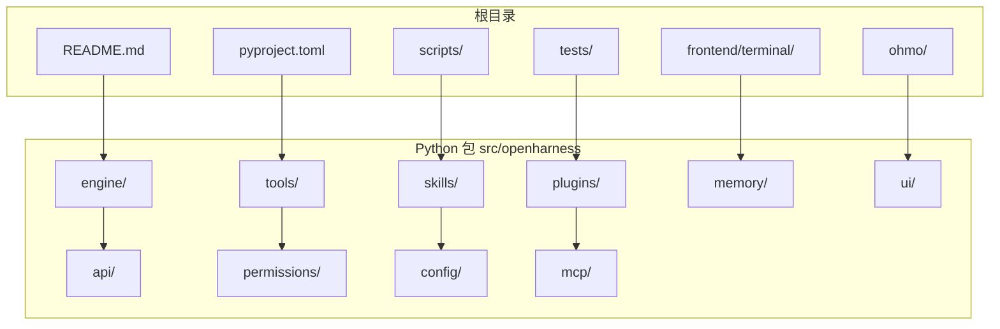
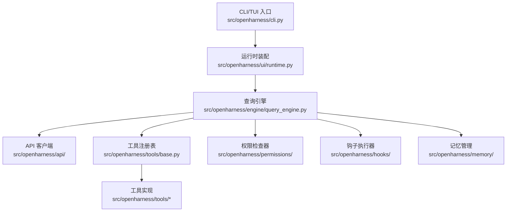
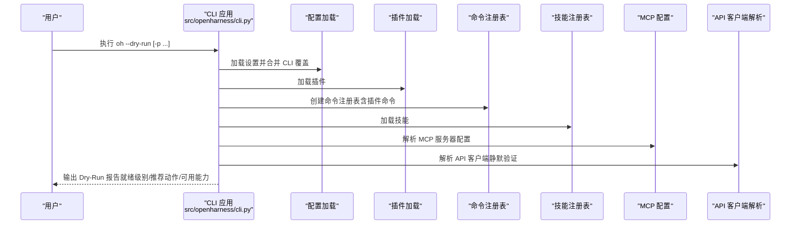
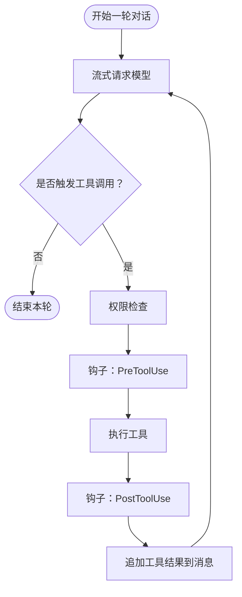
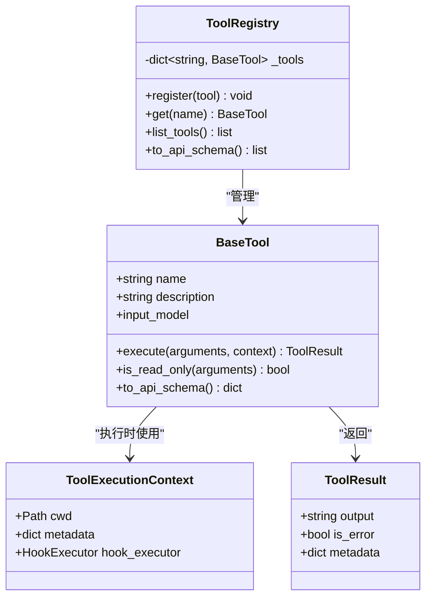
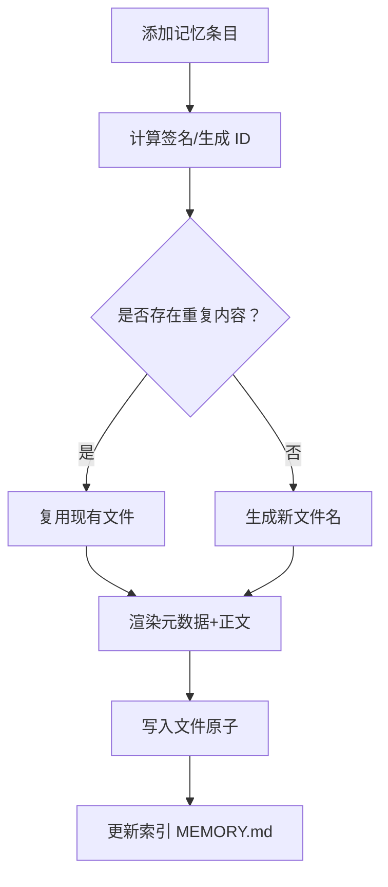
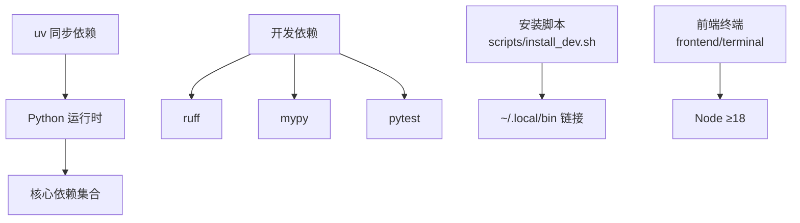

# 开发者指南

<cite>
**本文引用的文件**
- [README.md](file://README.md)
- [CONTRIBUTING.md](file://CONTRIBUTING.md)
- [pyproject.toml](file://pyproject.toml)
- [src/openharness/cli.py](file://src/openharness/cli.py)
- [src/openharness/engine/query_engine.py](file://src/openharness/engine/query_engine.py)
- [src/openharness/tools/base.py](file://src/openharness/tools/base.py)
- [src/openharness/memory/manager.py](file://src/openharness/memory/manager.py)
- [src/openharness/ui/runtime.py](file://src/openharness/ui/runtime.py)
- [scripts/install_dev.sh](file://scripts/install_dev.sh)
- [scripts/test_harness_features.py](file://scripts/test_harness_features.py)
- [tests/conftest.py](file://tests/conftest.py)
- [.github/PULL_REQUEST_TEMPLATE.md](file://.github/PULL_REQUEST_TEMPLATE.md)
- [RELEASE_NOTES_v0.1.9.md](file://RELEASE_NOTES_v0.1.9.md)
</cite>

## 目录
1. [简介](#简介)
2. [项目结构](#项目结构)
3. [核心组件](#核心组件)
4. [架构总览](#架构总览)
5. [详细组件分析](#详细组件分析)
6. [依赖分析](#依赖分析)
7. [性能考虑](#性能考虑)
8. [故障排查指南](#故障排查指南)
9. [结论](#结论)
10. [附录](#附录)

## 简介
本指南面向 OpenHarness 开发者，系统性阐述代码结构与模块组织、开发环境搭建、贡献流程、测试策略、调试与性能分析、代码质量标准以及发布与版本管理。目标是帮助新老贡献者快速上手并在高质量轨道持续迭代。

## 项目结构
仓库采用“分层 + 功能域”混合组织方式：
- 根目录包含顶层文档、脚本、前端终端应用、ohmo 个人代理、以及 Python 包源码 src/openharness 和 ohmo 子包。
- 源码按功能域划分子包：api、auth、autopilot、bridge、channels、commands、config、coordinator、engine、hooks、keybindings、mcp、memory、output_styles、permissions、personalization、plugins、prompts、sandbox、services、skills、state、swarm、tasks、themes、tools、ui、utils、vim、voice 等。
- tests 覆盖各子系统单元与集成测试；scripts 提供安装与端到端测试脚本；frontend/terminal 为 React/TUI 前端；ohmo 为独立可执行应用。

图示来源
- [README.md](file://README.md)
- [pyproject.toml](file://pyproject.toml)

章节来源
- [README.md](file://README.md)
- [pyproject.toml](file://pyproject.toml)

## 核心组件
- 引擎与会话循环：QueryEngine 驱动模型流式对话、工具调用、权限检查与钩子生命周期，支持最大轮次、成本统计与自动压缩。
- 工具体系：统一的 BaseTool 抽象与 ToolRegistry，内置 40+ 工具（文件、Shell、搜索、Web、MCP、任务、模式切换、计划工作流等）。
- 记忆系统：基于 Markdown 的项目级/团队级记忆文件管理，支持签名去重、软删除、索引与原子写入。
- UI 运行时：统一 RuntimeBundle 组装 API 客户端、工具注册表、命令、钩子、MCP 管理器与查询引擎，支撑 TUI 与无头运行。
- CLI：Typer 驱动的命令入口，支持 dry-run 预览、插件与 MCP 管理、认证与提供商配置等子命令。

章节来源
- [src/openharness/engine/query_engine.py](file://src/openharness/engine/query_engine.py)
- [src/openharness/tools/base.py](file://src/openharness/tools/base.py)
- [src/openharness/memory/manager.py](file://src/openharness/memory/manager.py)
- [src/openharness/ui/runtime.py](file://src/openharness/ui/runtime.py)
- [src/openharness/cli.py](file://src/openharness/cli.py)

## 架构总览
OpenHarness 将“提示词工程 + 工具调用 + 权限与钩子 + 多代理编排 + 记忆持久化”整合为可组合的 Agent Harness。核心数据流从 CLI/TUI 到 RuntimeBundle，再到 QueryEngine，最终驱动 API 客户端与工具执行，并通过钩子与权限系统贯穿安全与可观测性。

图示来源
- [src/openharness/cli.py](file://src/openharness/cli.py)
- [src/openharness/ui/runtime.py](file://src/openharness/ui/runtime.py)
- [src/openharness/engine/query_engine.py](file://src/openharness/engine/query_engine.py)
- [src/openharness/tools/base.py](file://src/openharness/tools/base.py)
- [src/openharness/memory/manager.py](file://src/openharness/memory/manager.py)

## 详细组件分析

### CLI 与 Dry-Run 预览
- CLI 使用 Typer 定义主命令与子命令组（mcp、plugin、auth、provider、cron、autopilot），默认启动交互会话。
- Dry-Run 预览在不实际调用模型/工具/子代理的前提下，解析设置、鉴权状态、技能/工具/命令发现、MCP 配置校验，并给出“就绪级别”与后续建议。

图示来源
- [src/openharness/cli.py](file://src/openharness/cli.py)

章节来源
- [src/openharness/cli.py](file://src/openharness/cli.py)

### 查询引擎与工具执行循环
- QueryEngine 维护对话历史、系统提示、最大轮次、成本追踪，并在每次迭代中：
  - 通过 API 客户端流式获取响应；
  - 若返回工具调用，则进行权限检查、钩子前置事件、工具执行、钩子后置事件、结果注入；
  - 支持自动压缩、会话记忆与自动梦（AutoDream）调度。

图示来源
- [src/openharness/engine/query_engine.py](file://src/openharness/engine/query_engine.py)

章节来源
- [src/openharness/engine/query_engine.py](file://src/openharness/engine/query_engine.py)

### 工具抽象与注册
- BaseTool 定义工具名称、描述、输入模型与异步执行接口；ToolRegistry 提供注册、查找与 API Schema 导出。
- 工具具备只读判定、标准化结果封装与 JSON Schema 描述，便于模型自动选择与类型安全。

图示来源
- [src/openharness/tools/base.py](file://src/openharness/tools/base.py)

章节来源
- [src/openharness/tools/base.py](file://src/openharness/tools/base.py)

### 记忆系统与索引
- 基于 Markdown 的记忆条目，支持项目级与团队级存储、签名去重、软删除与索引更新；提供原子写入与互斥锁保障一致性。
- 支持 TTL、标签、重要度、来源等元数据，便于检索与治理。

图示来源
- [src/openharness/memory/manager.py](file://src/openharness/memory/manager.py)

章节来源
- [src/openharness/memory/manager.py](file://src/openharness/memory/manager.py)

### UI 运行时装配
- RuntimeBundle 聚合 API 客户端、工具注册表、命令、钩子、MCP 管理器与查询引擎，支持会话后端、额外技能目录、插件根路径与记忆后端等扩展点。
- 提供当前设置覆盖、插件摘要、MCP 状态摘要等诊断信息。

章节来源
- [src/openharness/ui/runtime.py](file://src/openharness/ui/runtime.py)

## 依赖分析
- 语言与工具链：Python ≥3.10，uv（同步依赖与运行）、pytest（测试）、ruff/mypy（静态检查与类型检查）。
- 关键运行时依赖：anthropic、openai、rich、prompt-toolkit、textual、typer、pydantic、httpx、websockets、mcp、slack-sdk、python-telegram-bot、discord.py、lark-oapi 等。
- 可选开发依赖：pytest、pytest-asyncio、pytest-cov、ruff、mypy。
- 脚本与前端：scripts/install_dev.sh 提供本地可编辑安装与全局命令链接；前端终端需 Node ≥18 以安装依赖。

图示来源
- [pyproject.toml](file://pyproject.toml)
- [scripts/install_dev.sh](file://scripts/install_dev.sh)

章节来源
- [pyproject.toml](file://pyproject.toml)
- [scripts/install_dev.sh](file://scripts/install_dev.sh)

## 性能考虑
- 并行工具执行：查询循环支持并发执行多个工具调用，同时保留单工具快速路径，降低延迟。
- 上下文压缩与自动压缩：启用后可在长会话中保持任务状态与通道日志，减少上下文膨胀。
- 成本追踪：QueryEngine 内置成本统计，便于控制与审计。
- I/O 与锁：记忆写入采用原子写与互斥锁，避免竞态与损坏。
- 建议
  - 在高并发工具场景下，优先使用并发执行路径。
  - 对大文件/长文本操作，结合上下文压缩与分段处理。
  - 使用成本阈值与最大轮次限制，防止资源滥用。

章节来源
- [scripts/test_harness_features.py](file://scripts/test_harness_features.py)
- [src/openharness/engine/query_engine.py](file://src/openharness/engine/query_engine.py)
- [src/openharness/memory/manager.py](file://src/openharness/memory/manager.py)

## 故障排查指南
- Dry-Run 就绪级别
  - ready：配置可用，可直接运行提示或进入交互。
  - warning：存在可修复问题（如鉴权缺失、MCP 配置错误），建议先修复再执行。
  - blocked：路径不可行（如未知斜杠命令），需修正命令或参数。
- 常见问题定位
  - 鉴权：确认 active profile 与凭据；必要时使用 oh auth login 或 provider edit。
  - MCP：检查传输类型与目标（stdio/http/ws），确保命令存在且 URL 合法。
  - 权限：核对路径规则与命令黑名单，必要时调整权限模式。
- 测试辅助
  - 单元与集成测试：pytest -q。
  - 前端类型检查：cd frontend/terminal && npx tsc --noEmit。
  - E2E 特性测试：scripts/test_harness_features.py（需要真实模型调用）。
- 会话与后台任务
  - 测试夹具会在每个测试后重置后台任务管理器，避免状态泄漏。

章节来源
- [src/openharness/cli.py](file://src/openharness/cli.py)
- [tests/conftest.py](file://tests/conftest.py)
- [scripts/test_harness_features.py](file://scripts/test_harness_features.py)

## 结论
OpenHarness 以清晰的模块边界与可组合的子系统，提供了从工具、技能、权限、钩子到多代理编排与记忆持久化的完整 Agent Harness 能力。遵循本文档的开发与测试流程，可高效迭代并保证质量。

## 附录

### 开发环境搭建
- 克隆与依赖
  - uv sync --extra dev
  - 如需前端开发：cd frontend/terminal && npm ci
- 本地安装（可编辑）
  - 使用 scripts/install_dev.sh 完成虚拟环境、可选前端依赖与全局命令链接，并将 ~/.local/bin 加入 PATH。
- 运行与验证
  - uv run pytest -q
  - uv run ruff check src tests scripts
  - cd frontend/terminal && npx tsc --noEmit

章节来源
- [CONTRIBUTING.md](file://CONTRIBUTING.md)
- [scripts/install_dev.sh](file://scripts/install_dev.sh)
- [.github/PULL_REQUEST_TEMPLATE.md](file://.github/PULL_REQUEST_TEMPLATE.md)

### 代码贡献流程
- 分支与提交
  - 保持 PR 范围小而可审查；问题、变更与验证三要素齐全。
  - 行为变更需配套测试；CLI/工作流/兼容性变更需更新文档。
- 代码审查
  - 遵循 PR 模板中的验证清单（ruff、pytest、前端类型检查）。
- 文档与维护
  - 优先文档型需求明确标注为 docs PR；展示案例以真实用例为主。

章节来源
- [CONTRIBUTING.md](file://CONTRIBUTING.md)
- [.github/PULL_REQUEST_TEMPLATE.md](file://.github/PULL_REQUEST_TEMPLATE.md)

### 测试策略与套件
- 单元与集成：pytest -q，覆盖 API、认证、通道、命令、配置、协调器、引擎、钩子、内存、MCP、权限、个人化、插件、提示、沙箱、服务、技能、任务、工具、UI、实用工具等。
- CLI 标志端到端：scripts/test_cli_flags.py
- Harness 特性端到端：scripts/test_harness_features.py（真实模型调用，覆盖重试、技能、并行工具、路径权限）
- React TUI 端到端：scripts/react_tui_e2e.py
- TUI 交互端到端：scripts/test_tui_interactions.py
- 真实技能与插件：scripts/test_real_skills_plugins.py

章节来源
- [README.md](file://README.md)
- [scripts/test_harness_features.py](file://scripts/test_harness_features.py)

### 调试技巧与性能分析
- Dry-Run：oh --dry-run 预览设置、鉴权、技能/工具/命令发现、MCP 配置与就绪级别。
- 日志与调试：使用 --debug 输出更详细的运行轨迹。
- 前端调试：确保 Node ≥18，类型检查通过后再打包。
- 性能观测：关注工具执行耗时、并发工具数量、上下文长度与成本统计。

章节来源
- [src/openharness/cli.py](file://src/openharness/cli.py)
- [README.md](file://README.md)

### 代码质量标准与最佳实践
- 静态检查：ruff（行宽、目标版本等配置见 pyproject.toml）。
- 类型检查：mypy（严格模式），建议逐步提升覆盖率。
- 测试覆盖率：pytest-cov（可选），确保关键路径有测试。
- 最佳实践
  - 工具输入使用 Pydantic 模型，输出统一为 ToolResult。
  - 权限检查前置，钩子前后置事件清晰分离。
  - 长会话启用自动压缩与会话记忆，减少上下文开销。
  - MCP 服务器配置显式校验，避免运行期连接失败。

章节来源
- [pyproject.toml](file://pyproject.toml)
- [src/openharness/tools/base.py](file://src/openharness/tools/base.py)
- [src/openharness/engine/query_engine.py](file://src/openharness/engine/query_engine.py)

### 发布流程与版本管理
- 版本号：项目版本在 pyproject.toml 中定义。
- 发布说明：参考 RELEASE_NOTES_v0.1.9.md 的格式与要点，记录特性、修复与升级指引。
- 发布步骤建议
  - 更新版本号与发布说明；
  - 运行全量测试与静态检查；
  - 打包并上传至包仓库；
  - 推送标签与发布说明。

章节来源
- [pyproject.toml](file://pyproject.toml)
- [RELEASE_NOTES_v0.1.9.md](file://RELEASE_NOTES_v0.1.9.md)