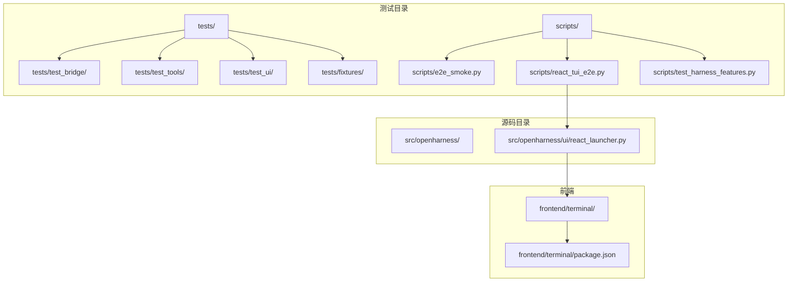
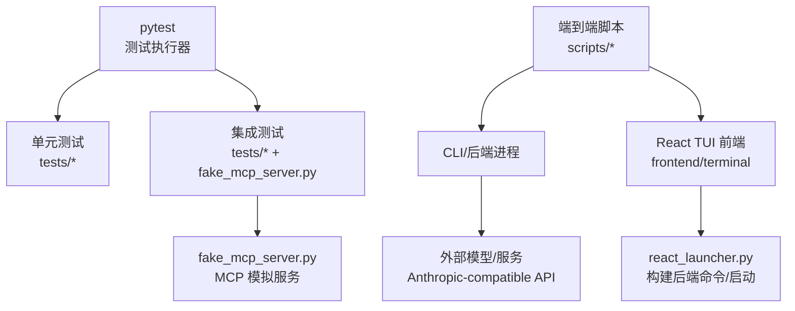
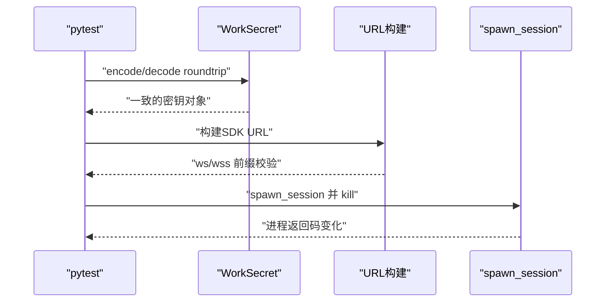
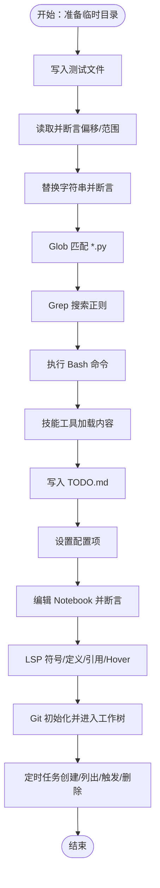
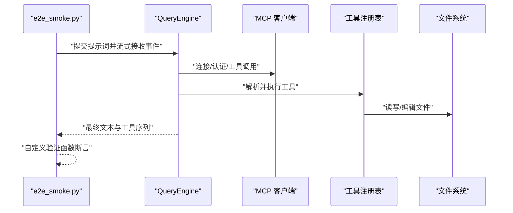
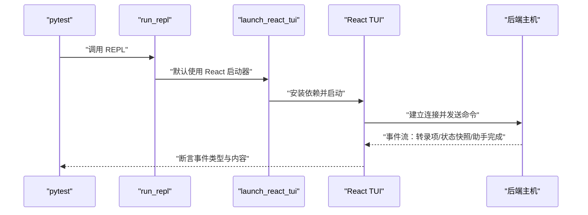
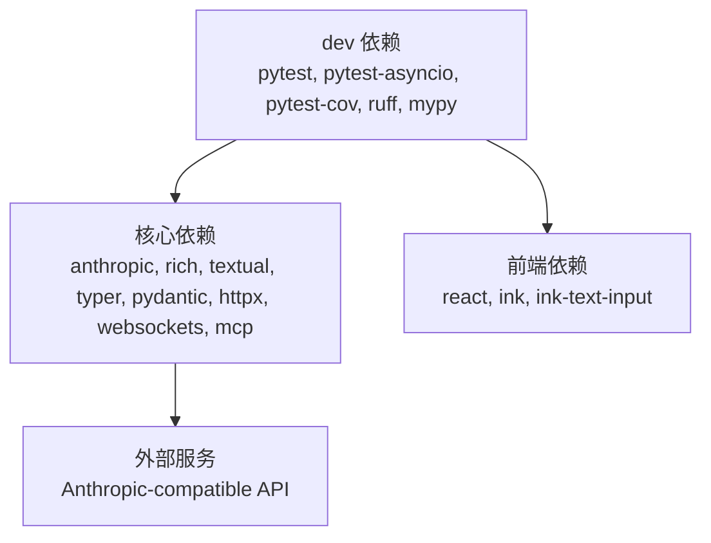

# 测试指南

<cite>
**本文引用的文件**
- [pyproject.toml](file://pyproject.toml)
- [tests/conftest.py](file://tests/conftest.py)
- [tests/fixtures/fake_mcp_server.py](file://tests/fixtures/fake_mcp_server.py)
- [tests/test_api/__init__.py](file://tests/test_api/__init__.py)
- [tests/test_bridge/test_core.py](file://tests/test_bridge/test_core.py)
- [tests/test_bridge/test_session_flow.py](file://tests/test_bridge/test_session_flow.py)
- [tests/test_tools/test_core_tools.py](file://tests/test_tools/test_core_tools.py)
- [tests/test_ui/test_react_launcher.py](file://tests/test_ui/test_react_launcher.py)
- [tests/test_ui/test_react_backend.py](file://tests/test_ui/test_react_backend.py)
- [scripts/e2e_smoke.py](file://scripts/e2e_smoke.py)
- [scripts/react_tui_e2e.py](file://scripts/react_tui_e2e.py)
- [scripts/test_harness_features.py](file://scripts/test_harness_features.py)
- [frontend/terminal/package.json](file://frontend/terminal/package.json)
- [src/openharness/ui/react_launcher.py](file://src/openharness/ui/react_launcher.py)
</cite>

## 目录
1. [简介](#简介)
2. [项目结构](#项目结构)
3. [核心组件](#核心组件)
4. [架构总览](#架构总览)
5. [详细组件分析](#详细组件分析)
6. [依赖分析](#依赖分析)
7. [性能考量](#性能考量)
8. [故障排查指南](#故障排查指南)
9. [结论](#结论)
10. [附录](#附录)

## 简介
本指南面向 OpenHarness 的测试体系，系统阐述测试策略与分类（单元测试、集成测试、端到端测试）、pytest 配置与使用方法（测试组织、fixture、参数化）、前端测试要点（React 组件与交互模拟）、覆盖率要求与报告生成、测试脚本编写（自动化与手动场景）、测试套件运行与失败用例调试，以及性能与压力测试的实施建议。内容以仓库现有实现为依据，结合代码级图示帮助不同技术背景的读者理解与实践。

## 项目结构
OpenHarness 的测试体系由三部分组成：
- 单元测试：位于 tests/ 下按功能模块划分，如 test_bridge、test_tools、test_ui 等，使用 pytest 进行组织与执行。
- 集成测试：通过内置的 fake MCP 服务器与真实外部服务交互，验证跨模块协作。
- 端到端测试：scripts/ 中的独立脚本，覆盖真实模型调用、React TUI 交互、命令行行为等。

图表来源
- [pyproject.toml:47-49](file://pyproject.toml#L47-L49)
- [tests/test_bridge/test_core.py:1-31](file://tests/test_bridge/test_core.py#L1-L31)
- [tests/test_tools/test_core_tools.py:1-248](file://tests/test_tools/test_core_tools.py#L1-L248)
- [tests/test_ui/test_react_launcher.py:1-42](file://tests/test_ui/test_react_launcher.py#L1-L42)
- [scripts/e2e_smoke.py:1-808](file://scripts/e2e_smoke.py#L1-L808)
- [scripts/react_tui_e2e.py:1-171](file://scripts/react_tui_e2e.py#L1-L171)
- [scripts/test_harness_features.py:1-241](file://scripts/test_harness_features.py#L1-L241)
- [frontend/terminal/package.json:1-20](file://frontend/terminal/package.json#L1-L20)
- [src/openharness/ui/react_launcher.py:1-107](file://src/openharness/ui/react_launcher.py#L1-L107)

章节来源
- [pyproject.toml:47-49](file://pyproject.toml#L47-L49)
- [tests/test_bridge/test_core.py:1-31](file://tests/test_bridge/test_core.py#L1-L31)
- [tests/test_tools/test_core_tools.py:1-248](file://tests/test_tools/test_core_tools.py#L1-L248)
- [tests/test_ui/test_react_launcher.py:1-42](file://tests/test_ui/test_react_launcher.py#L1-L42)
- [scripts/e2e_smoke.py:1-808](file://scripts/e2e_smoke.py#L1-L808)
- [scripts/react_tui_e2e.py:1-171](file://scripts/react_tui_e2e.py#L1-L171)
- [scripts/test_harness_features.py:1-241](file://scripts/test_harness_features.py#L1-L241)
- [frontend/terminal/package.json:1-20](file://frontend/terminal/package.json#L1-L20)
- [src/openharness/ui/react_launcher.py:1-107](file://src/openharness/ui/react_launcher.py#L1-L107)

## 核心组件
- pytest 配置与运行
  - 测试路径与异步模式在工具配置中定义，确保自动发现与 asyncio 支持。
- 共享 fixture
  - tests/conftest.py 提供共享测试夹具入口，便于跨模块复用。
- 集成测试夹具
  - tests/fixtures/fake_mcp_server.py 提供轻量 MCP 服务，用于工具链与 MCP 客户端的集成验证。
- 前端启动与协议
  - src/openharness/ui/react_launcher.py 负责 React TUI 的启动与后端命令构建；scripts/react_tui_e2e.py 通过进程控制进行端到端交互。

章节来源
- [pyproject.toml:47-49](file://pyproject.toml#L47-L49)
- [tests/conftest.py:1-2](file://tests/conftest.py#L1-L2)
- [tests/fixtures/fake_mcp_server.py:1-22](file://tests/fixtures/fake_mcp_server.py#L1-L22)
- [src/openharness/ui/react_launcher.py:1-107](file://src/openharness/ui/react_launcher.py#L1-L107)

## 架构总览
下图展示测试体系的总体交互：pytest 执行单元/集成测试；scripts 中的端到端脚本直接调用 CLI 或前端，连接真实或模拟的外部服务，验证完整业务流程。

图表来源
- [pyproject.toml:47-49](file://pyproject.toml#L47-L49)
- [scripts/e2e_smoke.py:1-808](file://scripts/e2e_smoke.py#L1-L808)
- [scripts/react_tui_e2e.py:1-171](file://scripts/react_tui_e2e.py#L1-L171)
- [tests/fixtures/fake_mcp_server.py:1-22](file://tests/fixtures/fake_mcp_server.py#L1-L22)
- [src/openharness/ui/react_launcher.py:1-107](file://src/openharness/ui/react_launcher.py#L1-L107)

## 详细组件分析

### 单元测试：桥接与会话管理
- 覆盖点
  - 工作密钥编解码与 SDK URL 构建
  - 会话进程的 spawn 与 kill
- 设计原则
  - 使用临时目录隔离文件系统状态
  - 异步测试标记确保事件循环正确运行
- 关键断言
  - 编解码一致性
  - URL 协议前缀与基地址匹配
  - 进程返回码在终止后非空

图表来源
- [tests/test_bridge/test_core.py:13-31](file://tests/test_bridge/test_core.py#L13-L31)

章节来源
- [tests/test_bridge/test_core.py:1-31](file://tests/test_bridge/test_core.py#L1-L31)

### 单元测试：核心工具集
- 覆盖点
  - 文件读写/编辑/Glob/Grep
  - Bash 工具执行
  - 技能工具、Todo 写入、配置工具
  - Jupyter Notebook 编辑
  - LSP 符号/定义/引用/Hover
  - Git 工作树进入/退出
  - 定时任务与远程触发
- 设计原则
  - 使用临时目录与环境变量隔离
  - 通过工具注册表与上下文传递依赖
  - 子进程初始化（如 git）在测试前完成
- 关键断言
  - 输出包含预期片段
  - 文件存在且内容符合修改
  - LSP 返回符号/位置信息

图表来源
- [tests/test_tools/test_core_tools.py:34-248](file://tests/test_tools/test_core_tools.py#L34-L248)

章节来源
- [tests/test_tools/test_core_tools.py:1-248](file://tests/test_tools/test_core_tools.py#L1-L248)

### 集成测试：MCP 与工具链
- 覆盖点
  - MCP 服务配置与连接
  - 工具调用序列与事件流
- 设计原则
  - 使用 fake_mcp_server.py 提供稳定可预测的 MCP 服务
  - 通过工具注册表与权限检查器组合验证工具链
- 关键断言
  - 工具名称与事件顺序符合预期
  - 最终文本包含期望标记

章节来源
- [tests/fixtures/fake_mcp_server.py:1-22](file://tests/fixtures/fake_mcp_server.py#L1-L22)
- [scripts/e2e_smoke.py:415-691](file://scripts/e2e_smoke.py#L415-L691)

### 端到端测试：真实场景与 React TUI
- 场景驱动
  - e2e_smoke.py：多场景冒烟测试，覆盖文件 IO、搜索编辑、任务流、插件组合、MCP 认证等
  - react_tui_e2e.py：通过 pexpect 控制 CLI 启动的 React TUI，模拟权限文件 IO、问答流程、命令流
- 设计原则
  - 隔离配置与数据目录，避免污染用户环境
  - 使用 expect 匹配界面输出，模拟用户输入
  - 对最终标记进行断言
- 关键断言
  - 文件内容与最终标记
  - 问答结果写入文件并验证
  - 命令执行后的状态输出

图表来源
- [scripts/e2e_smoke.py:694-757](file://scripts/e2e_smoke.py#L694-L757)

章节来源
- [scripts/e2e_smoke.py:1-808](file://scripts/e2e_smoke.py#L1-L808)
- [scripts/react_tui_e2e.py:1-171](file://scripts/react_tui_e2e.py#L1-L171)

### 前端测试：React TUI 启动与协议
- 覆盖点
  - 后端命令构建（含标志位）
  - REPL 默认使用 React 启动器
  - 后端主机处理命令与模型回合
- 设计原则
  - 通过 monkeypatch 注入 mock 启动器，验证参数透传
  - 使用静态 API 客户端模拟流式响应
  - 断言事件类型与消息角色
- 关键断言
  - 命令包含所有必要标志
  - 用户/系统/助手事件被正确发出
  - 状态快照存在

图表来源
- [tests/test_ui/test_react_launcher.py:11-42](file://tests/test_ui/test_react_launcher.py#L11-L42)
- [tests/test_ui/test_react_backend.py:29-93](file://tests/test_ui/test_react_backend.py#L29-L93)
- [src/openharness/ui/react_launcher.py:50-107](file://src/openharness/ui/react_launcher.py#L50-L107)

章节来源
- [tests/test_ui/test_react_launcher.py:1-42](file://tests/test_ui/test_react_launcher.py#L1-L42)
- [tests/test_ui/test_react_backend.py:1-93](file://tests/test_ui/test_react_backend.py#L1-L93)
- [src/openharness/ui/react_launcher.py:1-107](file://src/openharness/ui/react_launcher.py#L1-L107)
- [frontend/terminal/package.json:1-20](file://frontend/terminal/package.json#L1-L20)

## 依赖分析
- 测试框架与工具
  - pytest、pytest-asyncio、pytest-cov 在 dev 依赖中声明
  - ruff、mypy 作为质量工具
- 运行时依赖
  - 项目核心依赖与前端依赖分离，前端测试需确保 node/npm 可用
- 外部服务
  - e2e 场景依赖外部模型服务（可通过 base-url 覆盖）

图表来源
- [pyproject.toml:30-38](file://pyproject.toml#L30-L38)
- [pyproject.toml:15-28](file://pyproject.toml#L15-L28)
- [frontend/terminal/package.json:8-18](file://frontend/terminal/package.json#L8-L18)

章节来源
- [pyproject.toml:30-38](file://pyproject.toml#L30-L38)
- [pyproject.toml:15-28](file://pyproject.toml#L15-L28)
- [frontend/terminal/package.json:1-20](file://frontend/terminal/package.json#L1-L20)

## 性能考量
- 单元测试
  - 优先使用内存型断言与最小化 I/O，减少测试时间
  - 对异步工具使用 asyncio.gather 的路径应保持单工具快速路径，避免不必要的并发开销
- 集成测试
  - fake_mcp_server.py 应尽量轻量化，避免阻塞事件循环
- 端到端测试
  - 控制超时与延迟，合理设置 expect 超时
  - 将昂贵场景拆分为多个小步骤，便于定位瓶颈
- 覆盖率
  - 使用 pytest-cov 生成覆盖率报告，关注关键路径（工具执行、权限检查、错误分支）

## 故障排查指南
- pytest 运行问题
  - 确认 testpaths 与 asyncio_mode 正确配置
  - 使用 -v 查看详细输出，使用 --tb=short 快速定位异常
- 前端启动失败
  - 检查 npm 可用性与 node_modules 安装
  - 确认 OPENHARNESS_FRONTEND_CONFIG 正确注入后端命令
- MCP 服务未响应
  - 验证 fake_mcp_server.py 是否正常启动
  - 检查服务器配置合并逻辑与连接顺序
- E2E 场景失败
  - 开启调试日志（如 OPENHARNESS_E2E_DEBUG），观察 expect 匹配点
  - 校验最终标记与工具序列是否符合预期

章节来源
- [pyproject.toml:47-49](file://pyproject.toml#L47-L49)
- [scripts/react_tui_e2e.py:34-36](file://scripts/react_tui_e2e.py#L34-L36)
- [tests/fixtures/fake_mcp_server.py:20-22](file://tests/fixtures/fake_mcp_server.py#L20-L22)

## 结论
OpenHarness 的测试体系以 pytest 为核心，结合单元、集成与端到端三层测试，覆盖工具链、UI 启动与真实模型交互。通过共享 fixture、稳定 MCP 模拟与脚本化 E2E，既能保证开发效率，又能保障关键路径的可靠性。建议持续完善覆盖率与性能指标，并将关键场景纳入 CI。

## 附录

### 测试策略与分类设计原则
- 单元测试
  - 面向函数/类的边界与不变量，使用最小依赖与隔离
- 集成测试
  - 验证模块间接口与数据流，引入稳定模拟服务
- 端到端测试
  - 从用户视角验证完整流程，关注关键输出与最终标记

### pytest 配置与使用方法
- 配置
  - testpaths 指定测试目录，asyncio_mode 自动模式支持异步测试
- 测试组织
  - tests/ 下按功能模块分层，每个模块内按特性命名文件
- fixture
  - tests/conftest.py 提供共享 fixture，如临时目录、环境变量
- 参数化
  - 使用 pytest.mark.parametrize 对场景/参数进行扩展
- 断言
  - 针对事件流与最终文本进行断言，确保工具序列与输出一致

章节来源
- [pyproject.toml:47-49](file://pyproject.toml#L47-L49)
- [tests/conftest.py:1-2](file://tests/conftest.py#L1-L2)

### 前端测试特殊考虑
- React 组件测试
  - 通过 react_launcher.py 启动前端，使用 pexpect 控制输入与输出
  - 断言事件类型与消息角色，避免直接渲染 DOM
- 用户交互模拟
  - 使用 expect 匹配界面输出，模拟键盘输入与确认
  - 通过环境变量注入初始配置与脚本

章节来源
- [src/openharness/ui/react_launcher.py:50-107](file://src/openharness/ui/react_launcher.py#L50-L107)
- [scripts/react_tui_e2e.py:21-62](file://scripts/react_tui_e2e.py#L21-L62)

### 测试覆盖率与报告
- 覆盖率工具
  - pytest-cov 在 dev 依赖中声明，可用于生成覆盖率报告
- 报告生成
  - 建议在 CI 中生成 HTML 报告并上传，关注关键路径覆盖率

章节来源
- [pyproject.toml:35](file://pyproject.toml#L35)

### 测试脚本编写指南
- 自动化测试
  - 使用 scripts/ 下的脚本作为模板，遵循场景驱动与断言分离
- 手动测试场景
  - 提供简短说明与预期输出，便于人工核验

章节来源
- [scripts/e2e_smoke.py:1-808](file://scripts/e2e_smoke.py#L1-L808)
- [scripts/react_tui_e2e.py:1-171](file://scripts/react_tui_e2e.py#L1-L171)

### 运行测试套件与调试
- 运行
  - 使用 pytest 发现并执行 tests/ 下的测试
  - 使用 scripts/ 下的脚本执行端到端场景
- 调试
  - 开启详细日志与断点，逐步缩小问题范围
  - 对 E2E 使用 expect 日志与最终标记辅助定位

章节来源
- [pyproject.toml:47-49](file://pyproject.toml#L47-L49)
- [scripts/e2e_smoke.py:759-800](file://scripts/e2e_smoke.py#L759-L800)
- [scripts/react_tui_e2e.py:77-87](file://scripts/react_tui_e2e.py#L77-L87)

### 性能测试与压力测试
- 实施建议
  - 在集成测试中引入批量工具调用与并发场景
  - 使用基准测试库测量关键路径耗时
  - 在 CI 中定期运行压力测试，监控回归

[本节为通用指导，无需特定文件来源]