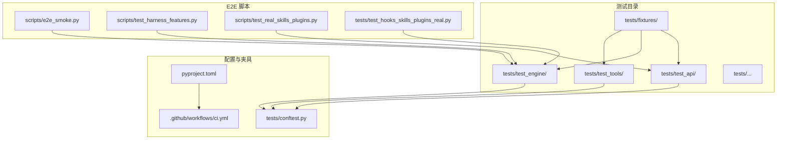
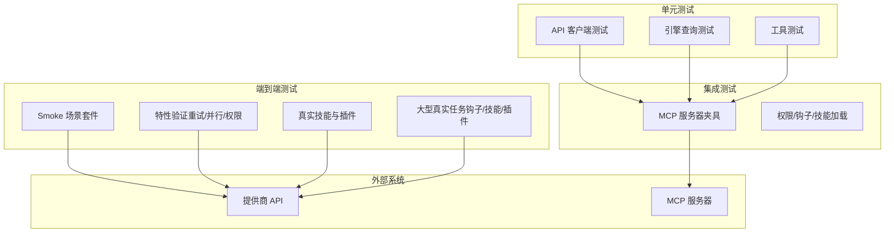
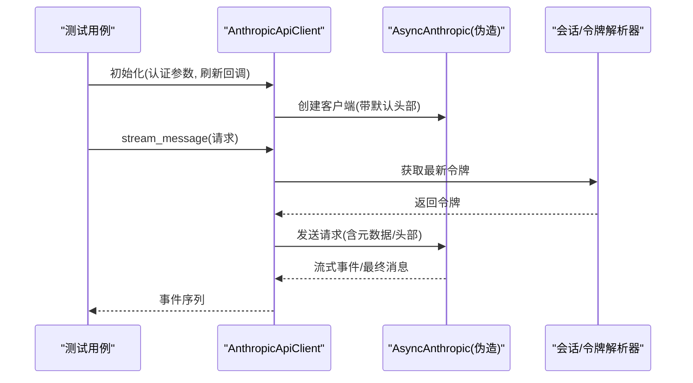
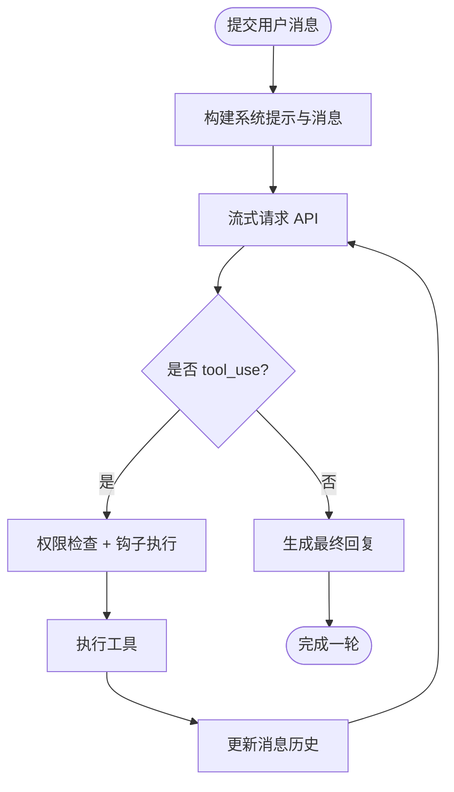
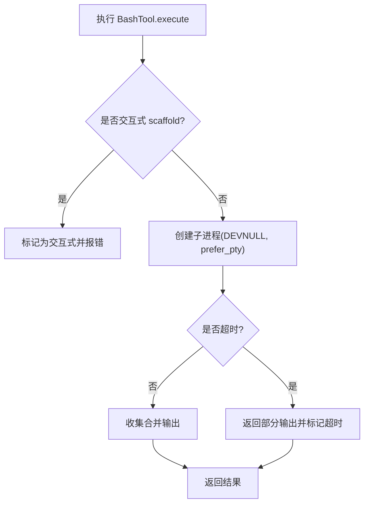
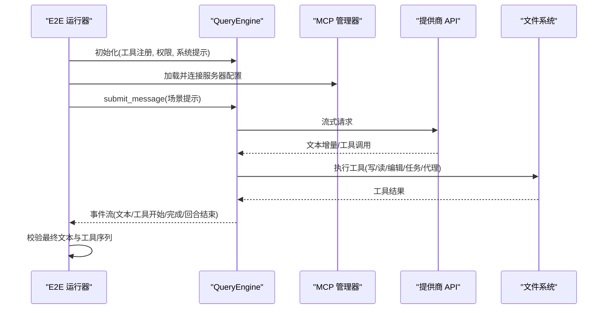
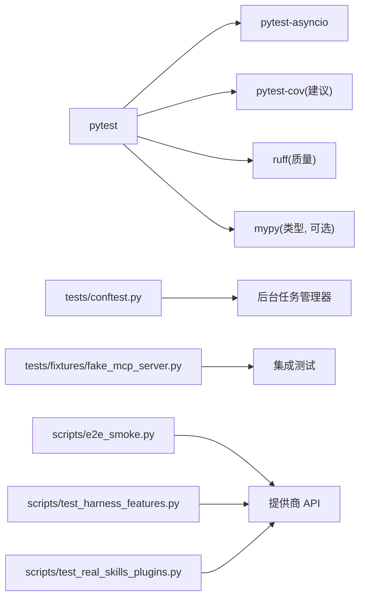

# 测试策略和实践

<cite>
**本文引用的文件**
- [pyproject.toml](file://pyproject.toml)
- [.github/workflows/ci.yml](file://.github/workflows/ci.yml)
- [tests/conftest.py](file://tests/conftest.py)
- [tests/fixtures/fake_mcp_server.py](file://tests/fixtures/fake_mcp_server.py)
- [tests/test_api/test_client.py](file://tests/test_api/test_client.py)
- [tests/test_engine/test_query_engine.py](file://tests/test_engine/test_query_engine.py)
- [tests/test_tools/test_bash_tool.py](file://tests/test_tools/test_bash_tool.py)
- [scripts/e2e_smoke.py](file://scripts/e2e_smoke.py)
- [scripts/test_harness_features.py](file://scripts/test_harness_features.py)
- [scripts/test_real_skills_plugins.py](file://scripts/test_real_skills_plugins.py)
- [tests/test_hooks_skills_plugins_real.py](file://tests/test_hooks_skills_plugins_real.py)
- [README.md](file://README.md)
- [CONTRIBUTING.md](file://CONTRIBUTING.md)
</cite>

## 目录
1. [引言](#引言)
2. [项目结构](#项目结构)
3. [核心组件](#核心组件)
4. [架构总览](#架构总览)
5. [详细组件分析](#详细组件分析)
6. [依赖关系分析](#依赖关系分析)
7. [性能考量](#性能考量)
8. [故障排查指南](#故障排查指南)
9. [结论](#结论)
10. [附录](#附录)

## 引言
本指南系统梳理 OpenHarness 的测试策略与实践，覆盖单元测试、集成测试与端到端测试（E2E）的组织方式，测试框架选择与配置（pytest 及其插件），测试夹具（fixtures）设计、测试数据管理，以及异步测试、Mock 使用、持续集成中的测试执行与覆盖率要求。同时提供调试技巧与性能测试方法，帮助贡献者高效编写与维护高质量测试。

## 项目结构
OpenHarness 的测试体系由以下部分组成：
- 单元测试：位于 tests/ 下按功能模块划分的子目录，如 test_api、test_engine、test_tools 等，覆盖核心运行时逻辑、工具、权限、内存、MCP、UI 等。
- 集成测试：通过 fixtures 提供轻量级外部依赖（如 MCP 服务器）进行交互验证。
- 端到端测试：scripts/ 下的独立脚本，直接调用真实模型或外部服务，验证完整工作流。
- 共享夹具：tests/conftest.py 中定义自动重置的全局夹具，确保并发任务管理器状态一致。
- 质量与 CI：.github/workflows/ci.yml 定义 Python 版本矩阵、质量检查与前端类型检查；pyproject.toml 指定 pytest 配置与开发依赖。

图表来源
- [pyproject.toml:75-77](file://pyproject.toml#L75-L77)
- [tests/conftest.py:10-14](file://tests/conftest.py#L10-L14)
- [scripts/e2e_smoke.py:1-50](file://scripts/e2e_smoke.py#L1-L50)
- [.github/workflows/ci.yml:36-37](file://.github/workflows/ci.yml#L36-L37)

章节来源
- [pyproject.toml:75-77](file://pyproject.toml#L75-L77)
- [tests/conftest.py:10-14](file://tests/conftest.py#L10-L14)
- [.github/workflows/ci.yml:36-37](file://.github/workflows/ci.yml#L36-L37)

## 核心组件
- 测试框架与配置
  - pytest：作为主测试运行器，支持标记、夹具、参数化与异步测试。
  - pytest-asyncio：启用 asyncio_mode=auto，简化异步测试。
  - pytest-cov：用于覆盖率统计（在 CI 中可扩展）。
  - ruff/mypy：质量门禁，CI 中强制检查。
- 共享夹具
  - 自动重置后台任务管理器，避免跨用例状态污染。
- 测试数据与外部依赖
  - tests/fixtures/fake_mcp_server.py：提供轻量 MCP 服务器，便于集成测试。
  - 外部真实模型调用：E2E 脚本通过环境变量注入 API Key 与模型名，直接与提供商 API 交互。

章节来源
- [pyproject.toml:39-46](file://pyproject.toml#L39-L46)
- [pyproject.toml:75-77](file://pyproject.toml#L75-L77)
- [tests/conftest.py:10-14](file://tests/conftest.py#L10-L14)
- [tests/fixtures/fake_mcp_server.py:1-22](file://tests/fixtures/fake_mcp_server.py#L1-L22)

## 架构总览
下图展示测试架构中各层之间的交互关系：单元测试覆盖核心模块，集成测试通过夹具连接外部依赖，E2E 脚本直接对接真实模型与外部服务。

图表来源
- [tests/test_api/test_client.py:1-50](file://tests/test_api/test_client.py#L1-L50)
- [tests/test_engine/test_query_engine.py:1-50](file://tests/test_engine/test_query_engine.py#L1-L50)
- [tests/test_tools/test_bash_tool.py:1-50](file://tests/test_tools/test_bash_tool.py#L1-L50)
- [tests/fixtures/fake_mcp_server.py:1-22](file://tests/fixtures/fake_mcp_server.py#L1-L22)
- [scripts/e2e_smoke.py:1-80](file://scripts/e2e_smoke.py#L1-L80)
- [scripts/test_harness_features.py:1-60](file://scripts/test_harness_features.py#L1-L60)
- [scripts/test_real_skills_plugins.py:1-60](file://scripts/test_real_skills_plugins.py#L1-L60)
- [tests/test_hooks_skills_plugins_real.py:1-60](file://tests/test_hooks_skills_plugins_real.py#L1-L60)

## 详细组件分析

### 单元测试：API 客户端与消息序列
- 目标：验证客户端初始化、请求头注入、OAuth 与 Claude Code 关联头、图像块序列化、令牌刷新与请求元数据。
- 关键点：
  - 使用 monkeypatch 替换外部依赖（如 AsyncAnthropic、会话 ID 获取器），确保测试可控且可重复。
  - 验证不同认证模式下的默认头部设置与行为差异。
  - 图像块到 API 参数的转换符合提供商格式。
  - 令牌刷新在每次请求前触发，确保会话一致性。
- 测试用例路径
  - [tests/test_api/test_client.py:7-194](file://tests/test_api/test_client.py#L7-L194)

图表来源
- [tests/test_api/test_client.py:98-194](file://tests/test_api/test_client.py#L98-L194)

章节来源
- [tests/test_api/test_client.py:7-194](file://tests/test_api/test_client.py#L7-L194)

### 单元测试：查询引擎与工具执行
- 目标：验证查询循环的文本回复、工具调用、重试机制、上下文压缩、权限钩子、并发工具执行等。
- 关键点：
  - 使用自定义客户端模拟“确定性流式响应”“重试后成功”“提示过长自动压缩”等场景。
  - 钩子注册与执行：PRE_TOOL_USE 可以阻断工具调用，验证模型在被阻断后的行为调整。
  - 并发工具路径：单工具快速路径与多工具并发路径均需覆盖。
- 测试用例路径
  - [tests/test_engine/test_query_engine.py:216-800](file://tests/test_engine/test_query_engine.py#L216-L800)

图表来源
- [tests/test_engine/test_query_engine.py:216-372](file://tests/test_engine/test_query_engine.py#L216-L372)

章节来源
- [tests/test_engine/test_query_engine.py:216-800](file://tests/test_engine/test_query_engine.py#L216-L800)

### 单元测试：Bash 工具与超时/交互检测
- 目标：验证 Bash 工具的预检交互检测、超时处理、输出收集、非交互 shell 的 stdin 设置。
- 关键点：
  - 通过伪造进程与 stdout 读取器，模拟长时间运行命令与“需要交互”的安装器场景。
  - 超时后返回部分输出，并标记 timed_out 与 interactive_required。
  - 非交互 shell 使用 DEVNULL 作为 stdin，优先使用 pty。
- 测试用例路径
  - [tests/test_tools/test_bash_tool.py:75-216](file://tests/test_tools/test_bash_tool.py#L75-L216)

图表来源
- [tests/test_tools/test_bash_tool.py:75-216](file://tests/test_tools/test_bash_tool.py#L75-L216)

章节来源
- [tests/test_tools/test_bash_tool.py:75-216](file://tests/test_tools/test_bash_tool.py#L75-L216)

### 集成测试：MCP 服务器夹具
- 目标：通过 tests/fixtures/fake_mcp_server.py 提供 stdio MCP 服务器，验证工具发现、资源读取与认证更新。
- 关键点：
  - 快速启动本地 MCP 服务器，暴露工具与资源。
  - 在 E2E 套件中动态注入服务器配置，验证工具调用与资源访问。
- 测试用例路径
  - [tests/fixtures/fake_mcp_server.py:1-22](file://tests/fixtures/fake_mcp_server.py#L1-L22)
  - [scripts/e2e_smoke.py:142-158](file://scripts/e2e_smoke.py#L142-L158)

章节来源
- [tests/fixtures/fake_mcp_server.py:1-22](file://tests/fixtures/fake_mcp_server.py#L1-L22)
- [scripts/e2e_smoke.py:142-158](file://scripts/e2e_smoke.py#L142-L158)

### 端到端测试：Smoke 场景套件
- 目标：覆盖文件 IO、搜索编辑、任务流、技能流、MCP 模型/资源、上下文注入、代理委托、插件组合、询问用户、定时任务、工作树、问题与 PR 上下文、MCP 认证更新等真实场景。
- 关键点：
  - 每个场景定义明确的期望最终文本与工具序列，校验文件内容与工具使用顺序。
  - 支持动态设置 MCP 服务器、项目技能与插件，模拟真实工作流。
- 测试用例路径
  - [scripts/e2e_smoke.py:415-691](file://scripts/e2e_smoke.py#L415-L691)

图表来源
- [scripts/e2e_smoke.py:694-757](file://scripts/e2e_smoke.py#L694-L757)

章节来源
- [scripts/e2e_smoke.py:415-691](file://scripts/e2e_smoke.py#L415-L691)
- [scripts/e2e_smoke.py:694-757](file://scripts/e2e_smoke.py#L694-L757)

### 端到端测试：特性验证（重试、技能、并行、权限）
- 目标：验证 API 重试配置与真实调用、技能系统加载与注入、并行工具执行路径、路径级权限规则。
- 关键点：
  - 通过 subprocess 直接调用 openharness 模块，传入模型与提示，断言输出包含预期关键词。
  - 检查 run_query 源码中是否存在 asyncio.gather 与单工具快速路径。
- 测试用例路径
  - [scripts/test_harness_features.py:41-216](file://scripts/test_harness_features.py#L41-L216)

章节来源
- [scripts/test_harness_features.py:41-216](file://scripts/test_harness_features.py#L41-L216)

### 端到端测试：真实技能与插件
- 目标：从官方仓库复制真实技能与插件，验证加载、内容质量、系统提示注入、模型使用效果。
- 关键点：
  - 安装后检查技能数量、内容长度与描述完整性。
  - 插件命令与钩子结构验证，确保无崩溃。
- 测试用例路径
  - [scripts/test_real_skills_plugins.py:49-323](file://scripts/test_real_skills_plugins.py#L49-L323)

章节来源
- [scripts/test_real_skills_plugins.py:49-323](file://scripts/test_real_skills_plugins.py#L49-L323)

### 端到端测试：大型真实任务（钩子/技能/插件）
- 目标：在真实 API 与真实工作空间上，验证钩子阻止工具、模型调用技能工具、插件技能在代理循环中使用、并发队友分别使用不同技能等复杂场景。
- 关键点：
  - 使用临时目录与临时技能/插件目录，避免污染环境。
  - 并发执行多个 in-process 队友，验证技能工具并发访问与输出文件生成。
- 测试用例路径
  - [tests/test_hooks_skills_plugins_real.py:60-637](file://tests/test_hooks_skills_plugins_real.py#L60-L637)

章节来源
- [tests/test_hooks_skills_plugins_real.py:60-637](file://tests/test_hooks_skills_plugins_real.py#L60-L637)

## 依赖关系分析
- 测试运行器与插件
  - pytest + pytest-asyncio + pytest-cov（建议在 CI 中启用）。
  - ruff 与 mypy 作为质量门禁，CI 中强制执行。
- 夹具与共享状态
  - tests/conftest.py 提供全局自动夹具，确保后台任务管理器在每个用例后正确关闭，避免状态泄漏。
- 外部依赖
  - tests/fixtures/fake_mcp_server.py 为集成测试提供轻量 MCP 服务器。
  - E2E 脚本依赖真实提供商 API，通过环境变量注入凭据与模型。

图表来源
- [pyproject.toml:39-46](file://pyproject.toml#L39-L46)
- [pyproject.toml:79-86](file://pyproject.toml#L79-L86)
- [tests/conftest.py:10-14](file://tests/conftest.py#L10-L14)
- [tests/fixtures/fake_mcp_server.py:1-22](file://tests/fixtures/fake_mcp_server.py#L1-L22)
- [scripts/e2e_smoke.py:1-80](file://scripts/e2e_smoke.py#L1-L80)

章节来源
- [pyproject.toml:39-46](file://pyproject.toml#L39-L46)
- [pyproject.toml:79-86](file://pyproject.toml#L79-L86)
- [tests/conftest.py:10-14](file://tests/conftest.py#L10-L14)
- [tests/fixtures/fake_mcp_server.py:1-22](file://tests/fixtures/fake_mcp_server.py#L1-L22)
- [scripts/e2e_smoke.py:1-80](file://scripts/e2e_smoke.py#L1-L80)

## 性能考量
- 异步测试与并发
  - 使用 asyncio_mode=auto 与 pytest.mark.asyncio，确保异步用例正确调度。
  - 对于工具执行（如 BashTool），应关注超时与输出截断，避免长时间阻塞。
- 覆盖率与质量
  - 建议在 CI 中启用 pytest-cov，设定阈值（如函数/分支/行覆盖率），保证关键路径被覆盖。
  - 结合 ruff 与 mypy，提前发现潜在问题，减少回归风险。
- E2E 成本控制
  - 将真实模型调用限制在必要场景，优先使用夹具与模拟对象。
  - 合理拆分 E2E 脚本，按功能域独立运行，缩短反馈周期。

## 故障排查指南
- 常见问题定位
  - API 请求失败：检查环境变量（API Key、Base URL、模型名）与网络代理设置。
  - MCP 工具不可用：确认服务器配置已注入，连接成功，工具/资源名称正确。
  - 权限拒绝：核对路径规则与命令拒绝列表，确认 PermissionChecker 行为符合预期。
  - 超时与交互检测：Bash 工具对交互式命令有预检，必要时添加非交互标志或改用自动化命令。
- 调试技巧
  - 使用 pytest -s 输出中间结果，结合事件收集器（如 QueryEngine 的事件流）定位问题阶段。
  - 在 E2E 脚本中打印工具开始/完成与最终文本，快速判断是模型未调用工具还是工具执行失败。
  - 通过 monkeypatch 注入日志或最小化替身，隔离外部依赖影响。
- 资源清理
  - 确保 tests/conftest.py 中的后台任务管理器在用例结束后关闭，避免残留进程影响后续测试。

章节来源
- [tests/test_tools/test_bash_tool.py:75-216](file://tests/test_tools/test_bash_tool.py#L75-L216)
- [tests/test_engine/test_query_engine.py:216-800](file://tests/test_engine/test_query_engine.py#L216-L800)
- [scripts/e2e_smoke.py:694-757](file://scripts/e2e_smoke.py#L694-L757)

## 结论
OpenHarness 的测试策略以“单元测试为核心、集成测试为桥梁、端到端测试为验证”的三层架构组织，配合 pytest 生态与共享夹具，确保核心运行时、工具链、权限与多代理协作在真实与模拟环境中得到充分覆盖。通过 CI 中的质量门禁与可扩展的覆盖率策略，项目能够在演进过程中保持稳定性与可维护性。

## 附录
- 持续集成与覆盖率
  - CI 工作流包含 Python 版本矩阵、pytest 运行与质量检查（ruff）。建议在 CI 中增加 pytest-cov 步骤并设定覆盖率阈值。
  - 参考路径：[.github/workflows/ci.yml:36-37](file://.github/workflows/ci.yml#L36-L37)，[pyproject.toml:39-46](file://pyproject.toml#L39-L46)
- 开发与贡献
  - 本地开发建议先运行 ruff 与 pytest，再运行前端类型检查，确保变更通过所有质量门禁。
  - 参考路径：[CONTRIBUTING.md:31-43](file://CONTRIBUTING.md#L31-L43)
- 测试结果概览
  - README 中展示了当前测试结果与套件规模，便于快速评估整体健康度。
  - 参考路径：[README.md:721-737](file://README.md#L721-L737)