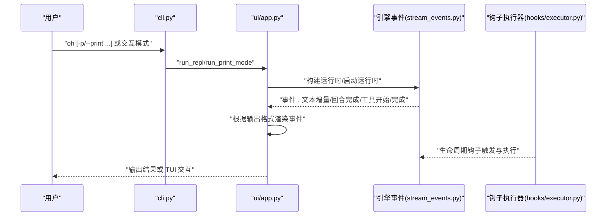
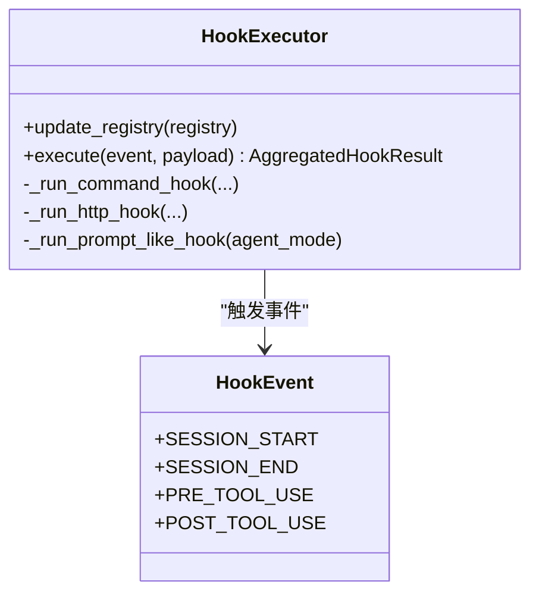
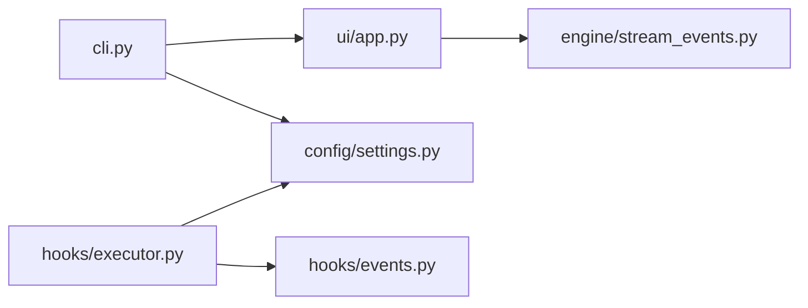
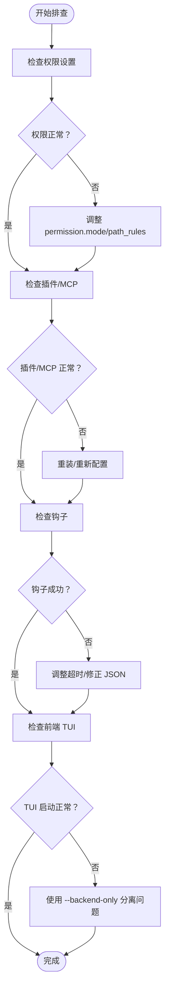

# 调试与开发工具

<cite>
**本文引用的文件**   
- [README.md](file://README.md)
- [pyproject.toml](file://pyproject.toml)
- [src/openharness/__main__.py](file://src/openharness/__main__.py)
- [src/openharness/cli.py](file://src/openharness/cli.py)
- [src/openharness/config/settings.py](file://src/openharness/config/settings.py)
- [src/openharness/ui/app.py](file://src/openharness/ui/app.py)
- [src/openharness/engine/stream_events.py](file://src/openharness/engine/stream_events.py)
- [src/openharness/hooks/events.py](file://src/openharness/hooks/events.py)
- [src/openharness/hooks/executor.py](file://src/openharness/hooks/executor.py)
- [src/openharness/skills/bundled/content/debug.md](file://src/openharness/skills/bundled/content/debug.md)
- [scripts/e2e_smoke.py](file://scripts/e2e_smoke.py)
</cite>

## 目录
1. [简介](#简介)
2. [项目结构](#项目结构)
3. [核心组件](#核心组件)
4. [架构总览](#架构总览)
5. [详细组件分析](#详细组件分析)
6. [依赖分析](#依赖分析)
7. [性能考虑](#性能考虑)
8. [故障排查指南](#故障排查指南)
9. [结论](#结论)
10. [附录](#附录)

## 简介
本指南面向 OpenHarness 的调试与开发场景，覆盖以下主题：
- 调试技巧：断点设置、变量检查、调用栈分析、事件流观察
- 日志系统：日志级别、输出格式、日志分析与定位
- 性能分析：内存与 CPU 监控、事件流与工具执行耗时观测
- 开发工具：IDE 插件、调试器设置、测试运行与覆盖率
- 常见问题诊断：权限、插件、MCP、前端 TUI 启动失败等
- Python 内置与第三方工具：pdb、pytest、pytest-asyncio、ruff、mypy
- 前端开发调试：React TUI 的启动与交互调试要点

## 项目结构
OpenHarness 采用模块化分层设计，核心子系统包括引擎、工具、技能、插件、权限、钩子、命令、MCP、记忆、任务、协调器、提示词、配置、UI 等。CLI 提供统一入口，支持交互会话与非交互打印模式；UI 层负责 React TUI 与后端协议桥接。

```mermaid
graph TB
subgraph "命令行与入口"
MAIN["__main__.py<br/>入口"]
CLI["cli.py<br/>Typer CLI"]
end
subgraph "配置与设置"
CFG["config/settings.py<br/>Settings 模型与加载"]
end
subgraph "UI 与运行时"
UIAPP["ui/app.py<br/>REPL/打印模式"]
end
subgraph "引擎与事件"
STREAM["engine/stream_events.py<br/>事件类型"]
end
subgraph "钩子系统"
HEVENTS["hooks/events.py<br/>HookEvent 枚举"]
HEXEC["hooks/executor.py<br/>Hook 执行器"]
end
MAIN --> CLI
CLI --> UIAPP
UIAPP --> STREAM
CLI --> CFG
HEXEC --> HEVENTS
HEXEC --> CFG
```

**图表来源**
- [src/openharness/__main__.py:1-7](file://src/openharness/__main__.py#L1-L7)
- [src/openharness/cli.py:1-378](file://src/openharness/cli.py#L1-L378)
- [src/openharness/config/settings.py:1-161](file://src/openharness/config/settings.py#L1-L161)
- [src/openharness/ui/app.py:1-149](file://src/openharness/ui/app.py#L1-L149)
- [src/openharness/engine/stream_events.py:1-50](file://src/openharness/engine/stream_events.py#L1-L50)
- [src/openharness/hooks/events.py:1-15](file://src/openharness/hooks/events.py#L1-L15)
- [src/openharness/hooks/executor.py:1-217](file://src/openharness/hooks/executor.py#L1-L217)

**章节来源**
- [README.md:127-170](file://README.md#L127-L170)
- [src/openharness/cli.py:179-378](file://src/openharness/cli.py#L179-L378)
- [src/openharness/ui/app.py:15-149](file://src/openharness/ui/app.py#L15-L149)
- [src/openharness/config/settings.py:1-161](file://src/openharness/config/settings.py#L1-L161)

## 核心组件
- CLI 与入口：统一命令入口，支持交互 REPL、非交互打印、子命令（mcp、plugin、auth）与调试开关
- 配置系统：Settings 模型与加载逻辑，支持环境变量与配置文件合并
- UI 运行时：React TUI 启动与后端协议桥接，打印模式下的事件渲染
- 引擎事件：定义助手文本增量、回合完成、工具执行开始/完成等事件类型
- 钩子系统：生命周期钩子（会话开始/结束、工具前后）的执行器与匹配规则

**章节来源**
- [src/openharness/cli.py:179-378](file://src/openharness/cli.py#L179-L378)
- [src/openharness/config/settings.py:49-161](file://src/openharness/config/settings.py#L49-L161)
- [src/openharness/ui/app.py:15-149](file://src/openharness/ui/app.py#L15-L149)
- [src/openharness/engine/stream_events.py:12-50](file://src/openharness/engine/stream_events.py#L12-L50)
- [src/openharness/hooks/events.py:8-15](file://src/openharness/hooks/events.py#L8-L15)
- [src/openharness/hooks/executor.py:38-217](file://src/openharness/hooks/executor.py#L38-L217)

## 架构总览
下图展示从 CLI 到 UI、再到引擎与钩子的关键调用链，以及事件流在打印模式中的处理路径。

**图表来源**
- [src/openharness/cli.py:334-378](file://src/openharness/cli.py#L334-L378)
- [src/openharness/ui/app.py:15-149](file://src/openharness/ui/app.py#L15-L149)
- [src/openharness/engine/stream_events.py:12-50](file://src/openharness/engine/stream_events.py#L12-L50)
- [src/openharness/hooks/executor.py:49-191](file://src/openharness/hooks/executor.py#L49-L191)

## 详细组件分析

### 组件一：CLI 与调试开关
- 关键选项
  - --debug/-d：启用调试日志（通过配置与运行时行为体现）
  - --print/-p 与 --output-format：非交互模式与输出格式（text/json/stream-json）
  - --verbose：覆盖配置中的 verbose 设置
  - --bare：最小模式，跳过钩子、插件、MCP 自发现
- 调试建议
  - 使用 --debug 触发更详细的日志输出
  - 在非交互模式下结合 --output-format stream-json，便于抓取事件流进行分析
  - 使用 --verbose 获取更详尽的行为日志

**章节来源**
- [src/openharness/cli.py:179-378](file://src/openharness/cli.py#L179-L378)

### 组件二：配置与设置（Settings）
- 加载顺序（高优先级到低）
  1) CLI 参数
  2) 环境变量（ANTHROPIC_API_KEY、OPENHARNESS_MODEL 等）
  3) 配置文件（~/.openharness/settings.json）
  4) 默认值
- 关键字段
  - API：api_key、model、base_url、max_tokens
  - 行为：system_prompt、permission、hooks、memory、enabled_plugins、mcp_servers
  - UI：theme、output_style、vim_mode、voice_mode、fast_mode、effort、passes、verbose
- 调试建议
  - 通过环境变量快速覆盖模型与密钥，避免频繁修改配置文件
  - 使用 --verbose 与配置中的 verbose 字段联动，提升可观测性

**章节来源**
- [src/openharness/config/settings.py:3-161](file://src/openharness/config/settings.py#L3-L161)

### 组件三：UI 运行时与事件渲染
- run_repl：默认交互模式，可选择仅运行后端主机（--backend-only）
- run_print_mode：非交互模式，支持 text、json、stream-json 输出
- 事件渲染：根据事件类型输出增量文本、回合完成、工具开始/完成等
- 调试建议
  - 在复杂工具链路中，使用 stream-json 观察工具执行序列与错误标记
  - 在权限或插件异常时，结合 print_mode 的系统消息输出定位问题

**章节来源**
- [src/openharness/ui/app.py:15-149](file://src/openharness/ui/app.py#L15-L149)
- [src/openharness/engine/stream_events.py:12-50](file://src/openharness/engine/stream_events.py#L12-L50)

### 组件四：钩子系统（生命周期与条件钩子）
- 支持事件：session_start、session_end、pre_tool_use、post_tool_use
- 执行器能力
  - 命令钩子：以 bash 执行外部脚本，注入 OPENHARNESS_HOOK_EVENT 与 OPENHARNESS_HOOK_PAYLOAD
  - HTTP 钩子：POST 请求到指定 URL，携带事件与负载
  - 提示类钩子：通过模型判断是否满足条件，返回严格 JSON
- 调试建议
  - 使用命令钩子输出 payload 与事件名，验证匹配器与超时设置
  - 对 HTTP 钩子增加重试与超时参数，确保稳定性
  - 条件钩子需保证返回严格 JSON，否则解析失败

**图表来源**
- [src/openharness/hooks/events.py:8-15](file://src/openharness/hooks/events.py#L8-L15)
- [src/openharness/hooks/executor.py:38-217](file://src/openharness/hooks/executor.py#L38-L217)

**章节来源**
- [src/openharness/hooks/events.py:1-15](file://src/openharness/hooks/events.py#L1-L15)
- [src/openharness/hooks/executor.py:49-191](file://src/openharness/hooks/executor.py#L49-L191)

### 组件五：事件数据模型与流式事件
- 数据模型：AssistantTextDelta、AssistantTurnComplete、ToolExecutionStarted、ToolExecutionCompleted
- 流式事件：用于非交互模式下的实时输出与分析
- 调试建议
  - 在工具执行前/后分别记录 ToolExecutionStarted/Completed，结合 is_error 字段定位失败原因
  - 使用 AssistantTextDelta 观察模型输出增量，辅助理解推理过程

**章节来源**
- [src/openharness/engine/stream_events.py:12-50](file://src/openharness/engine/stream_events.py#L12-L50)

### 组件六：调试技能与工作流
- debug 技能提供系统化调试流程：重现、读取错误、定位、假设、验证、修复、测试
- 调试建议
  - 遇到问题先复现，再读取错误与日志，最后通过工具（Grep/Read）定位代码路径
  - 固定根因而非症状，必要时寻求帮助

**章节来源**
- [src/openharness/skills/bundled/content/debug.md:1-26](file://src/openharness/skills/bundled/content/debug.md#L1-L26)

## 依赖分析
- CLI 依赖 Typer，作为统一入口组织子命令与选项
- 配置系统依赖 Pydantic，提供强类型校验与序列化
- UI 与运行时依赖异步事件流与渲染逻辑
- 钩子系统依赖 httpx（HTTP 钩子）、进程管理（命令钩子）

**图表来源**
- [src/openharness/cli.py:1-378](file://src/openharness/cli.py#L1-L378)
- [src/openharness/config/settings.py:1-161](file://src/openharness/config/settings.py#L1-L161)
- [src/openharness/ui/app.py:1-149](file://src/openharness/ui/app.py#L1-L149)
- [src/openharness/engine/stream_events.py:1-50](file://src/openharness/engine/stream_events.py#L1-L50)
- [src/openharness/hooks/events.py:1-15](file://src/openharness/hooks/events.py#L1-L15)
- [src/openharness/hooks/executor.py:1-217](file://src/openharness/hooks/executor.py#L1-L217)

**章节来源**
- [pyproject.toml:15-28](file://pyproject.toml#L15-L28)
- [src/openharness/cli.py:1-378](file://src/openharness/cli.py#L1-L378)

## 性能考虑
- 事件流与工具执行
  - 使用 stream-json 输出格式，便于在非交互模式下捕获工具执行序列与错误标记，从而定位瓶颈
  - 结合 AssistantTextDelta 与 ToolExecutionCompleted，统计工具调用耗时与错误率
- 内存与 IO
  - 配置中 memory.max_files 与 max_entrypoint_lines 控制持久化开销
  - 文件工具链路（read/write/edit/glob/grep）应避免重复扫描与大文件读写
- 并发与超时
  - 钩子命令与 HTTP 钩子设置合理超时，防止阻塞主循环
  - MCP 客户端连接与认证变更需及时关闭，避免资源泄漏

**章节来源**
- [src/openharness/ui/app.py:50-149](file://src/openharness/ui/app.py#L50-L149)
- [src/openharness/engine/stream_events.py:12-50](file://src/openharness/engine/stream_events.py#L12-L50)
- [src/openharness/config/settings.py:41-47](file://src/openharness/config/settings.py#L41-L47)
- [src/openharness/hooks/executor.py:65-146](file://src/openharness/hooks/executor.py#L65-L146)

## 故障排查指南
- 权限与安全
  - 症状：工具执行被拒绝或弹出确认对话
  - 排查：检查 permission.mode、path_rules、denied_commands；必要时使用 --dangerously-skip-permissions（沙箱环境）
- 插件与 MCP
  - 症状：插件未生效或 MCP 工具不可用
  - 排查：使用子命令列出插件与 MCP 服务器；检查配置文件与 mcp_servers；对 MCP 认证变更后重新授权
- 钩子失败
  - 症状：命令/HTTP/提示类钩子不生效或报错
  - 排查：查看 OPENHARNESS_HOOK_EVENT 与 OPENHARNESS_HOOK_PAYLOAD 注入；确认超时与返回 JSON 格式
- 前端 TUI 启动失败
  - 症状：React TUI 无法启动或退出码非零
  - 排查：使用 --backend-only 仅运行后端主机，分离前端问题；检查 Node.js 与依赖安装
- 非交互模式输出异常
  - 症状：输出格式不符合预期或事件缺失
  - 排查：切换 --output-format 为 stream-json，抓取事件流；核对 print_mode 的参数传递

**图表来源**
- [src/openharness/cli.py:179-378](file://src/openharness/cli.py#L179-L378)
- [src/openharness/config/settings.py:31-39](file://src/openharness/config/settings.py#L31-L39)
- [src/openharness/hooks/executor.py:65-146](file://src/openharness/hooks/executor.py#L65-L146)
- [src/openharness/ui/app.py:27-47](file://src/openharness/ui/app.py#L27-L47)

**章节来源**
- [src/openharness/config/settings.py:31-39](file://src/openharness/config/settings.py#L31-L39)
- [src/openharness/hooks/executor.py:65-146](file://src/openharness/hooks/executor.py#L65-L146)
- [src/openharness/ui/app.py:27-47](file://src/openharness/ui/app.py#L27-L47)

## 结论
通过 CLI 调试开关、配置系统、UI 事件流与钩子系统，OpenHarness 提供了完整的可观测性与可调试性。建议在日常开发中：
- 使用 stream-json 事件流进行非交互调试
- 合理配置权限与插件，减少运行时阻塞
- 利用钩子系统扩展条件与副作用逻辑，并严格控制超时与输出格式
- 将前端 TUI 与后端运行时分离排查，提高定位效率

## 附录

### 调试技巧与方法
- 断点设置
  - 在工具执行前后插入日志或事件输出，结合 ToolExecutionStarted/Completed 事件定位问题
  - 在钩子执行器中使用命令钩子输出 payload，验证匹配器与上下文
- 变量检查
  - 使用环境变量覆盖 API 密钥与模型，避免频繁修改配置文件
  - 在 print_mode 中观察 AssistantTextDelta 与最终回合完成事件，理解模型决策过程
- 调用栈分析
  - 在钩子条件判断处记录事件与负载，结合日志定位失败原因
  - 使用 --verbose 与配置中的 verbose 字段增强日志粒度

**章节来源**
- [src/openharness/ui/app.py:50-149](file://src/openharness/ui/app.py#L50-L149)
- [src/openharness/hooks/executor.py:65-191](file://src/openharness/hooks/executor.py#L65-L191)
- [src/openharness/config/settings.py:99-120](file://src/openharness/config/settings.py#L99-L120)

### 日志系统使用与配置
- 日志级别与输出
  - --debug/-d：启用调试日志（与配置中的 verbose 协同）
  - --output-format：text/json/stream-json，stream-json 适合事件流分析
- 日志分析
  - 使用 stream-json 抓取工具执行序列与 is_error 标记，定位失败工具
  - 在 print_mode 中将系统消息输出到标准错误，区分用户输出与系统提示

**章节来源**
- [src/openharness/cli.py:309-315](file://src/openharness/cli.py#L309-L315)
- [src/openharness/ui/app.py:94-146](file://src/openharness/ui/app.py#L94-L146)

### 性能分析工具使用
- 内存分析
  - 关注 memory.max_files 与 max_entrypoint_lines，避免过多持久化
  - 大文件读写与频繁 glob/grep 会增加内存占用
- CPU 使用率监控
  - 在工具密集型场景下，使用 stream-json 观察工具执行耗时与并发情况
  - 对 MCP 与钩子设置合理超时，避免阻塞主线程
- 事件流与工具执行耗时观测
  - 结合 ToolExecutionStarted/Completed 与 AssistantTurnComplete，统计整体耗时与错误率

**章节来源**
- [src/openharness/config/settings.py:41-47](file://src/openharness/config/settings.py#L41-L47)
- [src/openharness/engine/stream_events.py:27-42](file://src/openharness/engine/stream_events.py#L27-L42)
- [src/openharness/hooks/executor.py:65-146](file://src/openharness/hooks/executor.py#L65-L146)

### 开发工具配置与使用
- IDE 插件与调试器
  - 使用 pytest 与 pytest-asyncio 运行单元与集成测试
  - 使用 ruff 进行代码风格检查，mypy 进行类型检查
  - 在 VS Code 中配置 Python 解释器与调试器，配合 uv 环境运行 oh
- 测试运行
  - 使用 pytest 运行 tests 目录下的全部用例
  - 使用 e2e 脚本运行真实场景，结合 --scenario 选择特定场景

**章节来源**
- [pyproject.toml:30-58](file://pyproject.toml#L30-L58)
- [README.md:293-298](file://README.md#L293-L298)
- [scripts/e2e_smoke.py:54-90](file://scripts/e2e_smoke.py#L54-L90)

### Python 内置与第三方工具
- 内置调试工具
  - pdb：在关键函数入口设置断点，检查输入参数与中间状态
  - traceback：在钩子执行器中捕获异常，输出详细堆栈
- 第三方工具
  - pytest：运行测试套件，支持并发与覆盖率
  - ruff/mypy：静态检查与风格规范
  - uv：包与虚拟环境管理，简化开发环境搭建

**章节来源**
- [pyproject.toml:31-38](file://pyproject.toml#L31-L38)
- [src/openharness/hooks/executor.py:140-146](file://src/openharness/hooks/executor.py#L140-L146)

### 前端开发调试特殊技巧
- React TUI 启动
  - 使用 --backend-only 仅运行后端主机，隔离前端问题
  - 检查 Node.js 版本与依赖安装，确保 React Ink 与 TUI 正常
- 交互调试
  - 在 print_mode 下使用 stream-json 观察前端需要的数据结构
  - 通过命令选择器与权限对话框验证 UI 交互逻辑

**章节来源**
- [src/openharness/ui/app.py:27-47](file://src/openharness/ui/app.py#L27-L47)
- [README.md:254-264](file://README.md#L254-L264)