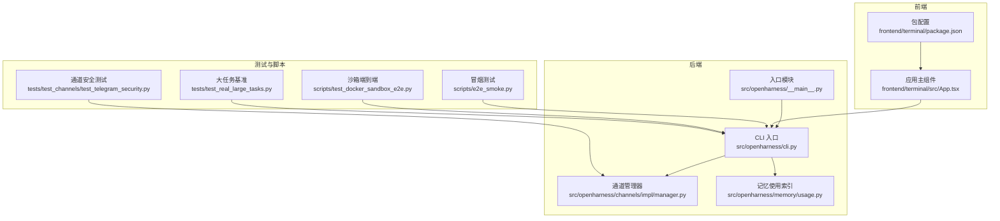
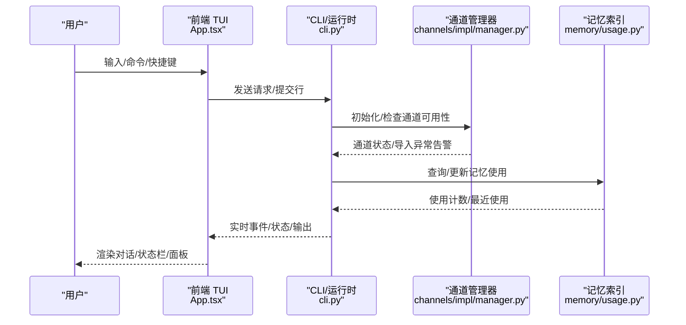
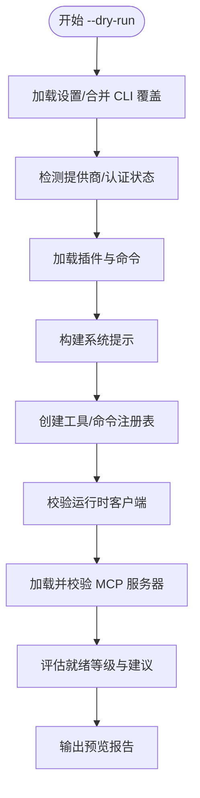
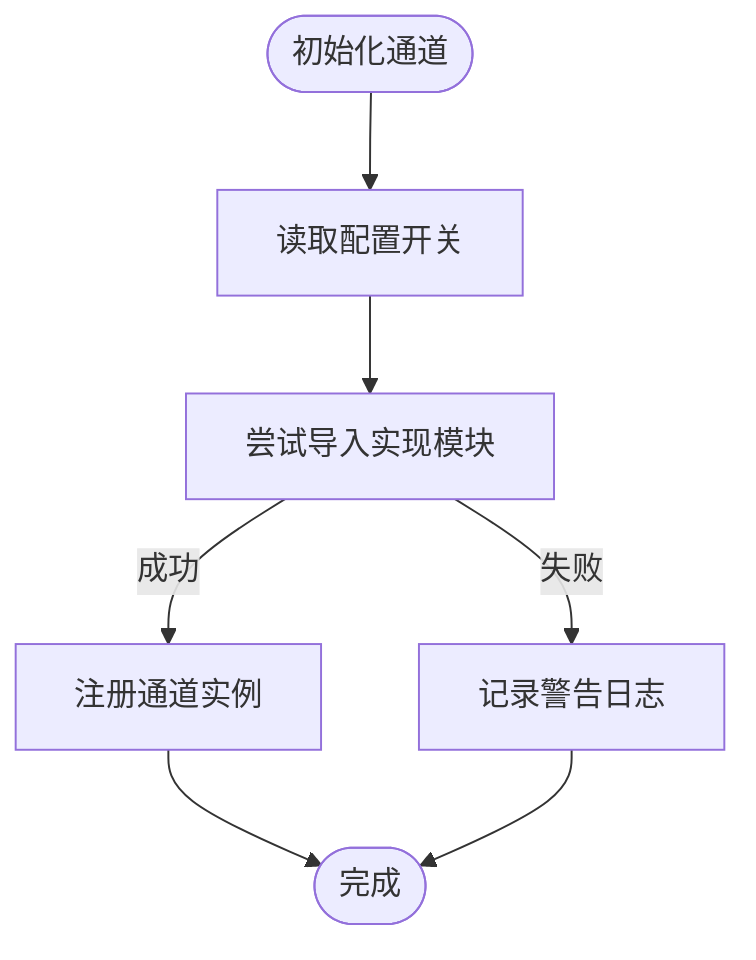
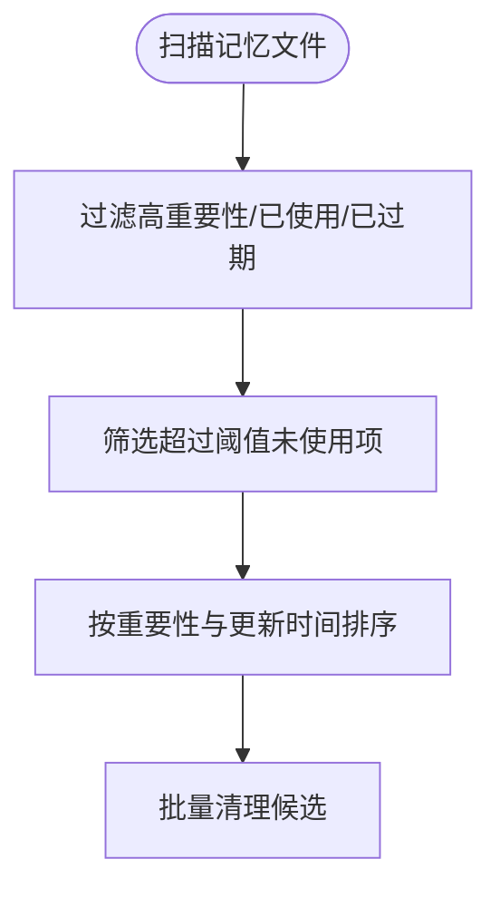
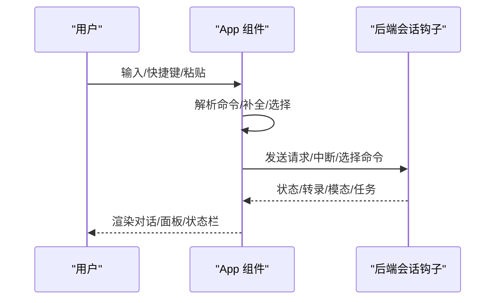
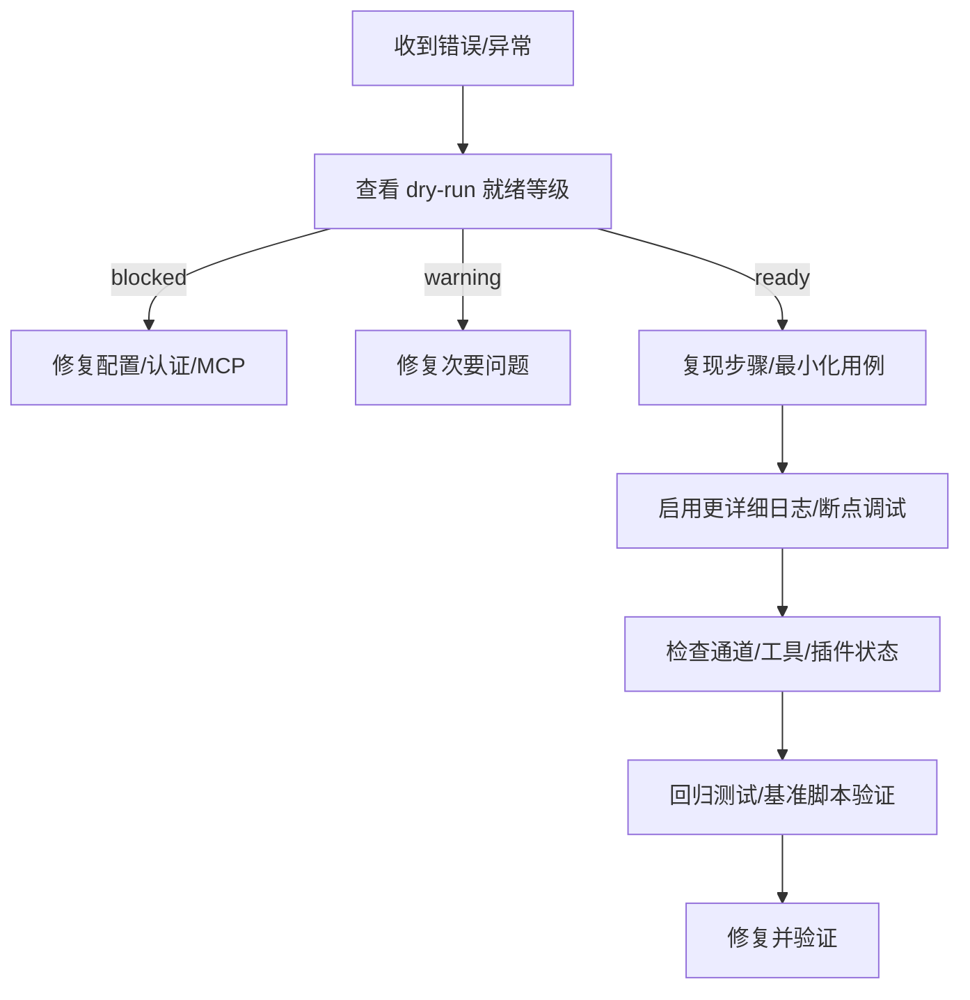

# 调试和性能分析

<cite>
**本文引用的文件**
- [README.md](file://README.md)
- [CONTRIBUTING.md](file://CONTRIBUTING.md)
- [src/openharness/cli.py](file://src/openharness/cli.py)
- [src/openharness/__main__.py](file://src/openharness/__main__.py)
- [src/openharness/channels/impl/manager.py](file://src/openharness/channels/impl/manager.py)
- [src/openharness/memory/usage.py](file://src/openharness/memory/usage.py)
- [frontend/terminal/package.json](file://frontend/terminal/package.json)
- [frontend/terminal/src/App.tsx](file://frontend/terminal/src/App.tsx)
- [tests/test_channels/test_telegram_security.py](file://tests/test_channels/test_telegram_security.py)
- [tests/test_real_large_tasks.py](file://tests/test_real_large_tasks.py)
- [scripts/e2e_smoke.py](file://scripts/e2e_smoke.py)
- [scripts/test_docker_sandbox_e2e.py](file://scripts/test_docker_sandbox_e2e.py)
- [src/openharness/skills/bundled/content/debug.md](file://src/openharness/skills/bundled/content/debug.md)
- [src/openharness/skills/bundled/content/diagnose.md](file://src/openharness/skills/bundled/content/diagnose.md)
</cite>

## 目录
1. [简介](#简介)
2. [项目结构](#项目结构)
3. [核心组件](#核心组件)
4. [架构总览](#架构总览)
5. [详细组件分析](#详细组件分析)
6. [依赖分析](#依赖分析)
7. [性能考虑](#性能考虑)
8. [故障排查指南](#故障排查指南)
9. [结论](#结论)
10. [附录](#附录)

## 简介
本指南聚焦于 OpenHarness 的调试与性能分析实践，覆盖后端 Python 运行时调试、IDE 配置、日志与错误处理、前端 TUI 调试、以及性能分析（内存、CPU、I/O）方法。同时提供常见问题诊断流程、基准测试思路与生产环境调试监控最佳实践，帮助开发者快速定位问题、优化性能并稳定交付。

## 项目结构
OpenHarness 采用“Python 后端 + React Ink 前端”的双层架构：后端通过 CLI 提供交互式会话与命令执行；前端以终端 UI 展示对话、状态与操作面板，并与后端通过协议通信。测试脚本与示例贯穿全栈，便于端到端验证与性能回归。

**图示来源**
- [src/openharness/cli.py:1-800](file://src/openharness/cli.py#L1-L800)
- [src/openharness/__main__.py:1-7](file://src/openharness/__main__.py#L1-L7)
- [src/openharness/channels/impl/manager.py:74-138](file://src/openharness/channels/impl/manager.py#L74-L138)
- [src/openharness/memory/usage.py:1-153](file://src/openharness/memory/usage.py#L1-L153)
- [frontend/terminal/package.json:1-22](file://frontend/terminal/package.json#L1-L22)
- [frontend/terminal/src/App.tsx:1-590](file://frontend/terminal/src/App.tsx#L1-L590)
- [scripts/e2e_smoke.py:416-448](file://scripts/e2e_smoke.py#L416-L448)
- [scripts/test_docker_sandbox_e2e.py:575-620](file://scripts/test_docker_sandbox_e2e.py#L575-L620)
- [tests/test_channels/test_telegram_security.py:1-36](file://tests/test_channels/test_telegram_security.py#L1-L36)
- [tests/test_real_large_tasks.py:779-797](file://tests/test_real_large_tasks.py#L779-L797)

**章节来源**
- [README.md:446-502](file://README.md#L446-L502)
- [src/openharness/cli.py:1-800](file://src/openharness/cli.py#L1-L800)
- [frontend/terminal/package.json:1-22](file://frontend/terminal/package.json#L1-L22)

## 核心组件
- CLI 与运行时：提供交互会话、命令解析、干运行预览、权限与插件加载、工具注册与系统提示构建等能力。
- 通道管理器：按配置动态启用各聊天通道（如飞书、钉钉、Slack、QQ、邮件等），导入失败时记录警告日志。
- 记忆使用索引：维护记忆条目的使用计数与最近使用时间，支持过期未用记忆的清理策略。
- 前端 TUI：基于 React Ink 的终端界面，负责输入、命令选择、权限弹窗、任务与群组状态展示、剪贴板图片附件等。
- 测试与脚本：涵盖端到端冒烟、Docker 沙箱隔离、通道安全、大任务性能等场景。

**章节来源**
- [src/openharness/cli.py:396-597](file://src/openharness/cli.py#L396-L597)
- [src/openharness/channels/impl/manager.py:74-138](file://src/openharness/channels/impl/manager.py#L74-L138)
- [src/openharness/memory/usage.py:1-153](file://src/openharness/memory/usage.py#L1-L153)
- [frontend/terminal/src/App.tsx:1-590](file://frontend/terminal/src/App.tsx#L1-L590)
- [scripts/e2e_smoke.py:416-448](file://scripts/e2e_smoke.py#L416-L448)
- [scripts/test_docker_sandbox_e2e.py:575-620](file://scripts/test_docker_sandbox_e2e.py#L575-L620)

## 架构总览
下图展示从用户输入到后端处理与前端渲染的关键路径，以及干运行预览与通道初始化等调试相关环节。

**图示来源**
- [frontend/terminal/src/App.tsx:451-485](file://frontend/terminal/src/App.tsx#L451-L485)
- [src/openharness/cli.py:396-597](file://src/openharness/cli.py#L396-L597)
- [src/openharness/channels/impl/manager.py:74-138](file://src/openharness/channels/impl/manager.py#L74-L138)
- [src/openharness/memory/usage.py:30-136](file://src/openharness/memory/usage.py#L30-L136)

## 详细组件分析

### 干运行预览与调试入口
- 干运行（--dry-run）在不执行模型、工具或子代理的前提下，解析设置、认证状态、技能、命令、工具与 MCP 配置，给出“就绪/警告/阻塞”级别与下一步建议。
- 预览内容包含：活动配置文件、提供商、模型、权限模式、最大轮次、努力度/轮次、系统提示长度、已配置 MCP 服务器及其问题、可用工具与技能列表、推荐匹配项等。

**图示来源**
- [src/openharness/cli.py:396-597](file://src/openharness/cli.py#L396-L597)
- [src/openharness/cli.py:600-742](file://src/openharness/cli.py#L600-L742)

**章节来源**
- [README.md:268-304](file://README.md#L268-L304)
- [src/openharness/cli.py:333-393](file://src/openharness/cli.py#L333-L393)

### 通道初始化与日志告警
- 通道管理器按配置尝试导入各通道实现，若缺失依赖则记录警告日志，避免中断启动流程。
- 安全测试中对第三方依赖的日志级别进行抑制，降低噪声并聚焦关键问题。

**图示来源**
- [src/openharness/channels/impl/manager.py:74-138](file://src/openharness/channels/impl/manager.py#L74-L138)

**章节来源**
- [tests/test_channels/test_telegram_security.py:15-23](file://tests/test_channels/test_telegram_security.py#L15-L23)
- [src/openharness/channels/impl/manager.py:104-138](file://src/openharness/channels/impl/manager.py#L104-L138)

### 记忆使用索引与过期清理
- 使用索引记录每个记忆条目的使用次数与最近使用时间，定期扫描未使用且超过阈值的条目，按重要性与更新时间排序后清理，减少存储与检索开销。

**图示来源**
- [src/openharness/memory/usage.py:114-136](file://src/openharness/memory/usage.py#L114-L136)

**章节来源**
- [src/openharness/memory/usage.py:1-153](file://src/openharness/memory/usage.py#L1-L153)

### 前端 TUI 交互与调试要点
- 支持命令补全、历史导航、权限弹窗、编辑差异确认、问题问答弹窗、群组/待办面板、状态栏与键盘提示。
- 可通过环境变量控制回车提交行为、脚本化自动输入等，便于自动化测试与复现。

**图示来源**
- [frontend/terminal/src/App.tsx:223-449](file://frontend/terminal/src/App.tsx#L223-L449)
- [frontend/terminal/src/App.tsx:451-485](file://frontend/terminal/src/App.tsx#L451-L485)

**章节来源**
- [frontend/terminal/src/App.tsx:1-590](file://frontend/terminal/src/App.tsx#L1-L590)
- [frontend/terminal/package.json:1-22](file://frontend/terminal/package.json#L1-L22)

### 调试工具与 IDE 配置
- Python 调试：可使用标准 pdb 或 IDE 断点在 CLI、通道、工具与命令处理处设置断点；结合干运行预览先定位配置与认证问题。
- 日志分析：通道导入失败会记录警告；安全测试中对第三方日志器降噪；可在本地运行时增加日志级别以捕获更细粒度信息。
- 前端调试：通过环境变量开启脚本化输入与原始回车提交，便于复现与回归；React DevTools 可用于检查组件树与状态变化。

**章节来源**
- [src/openharness/channels/impl/manager.py:104-138](file://src/openharness/channels/impl/manager.py#L104-L138)
- [tests/test_channels/test_telegram_security.py:15-23](file://tests/test_channels/test_telegram_security.py#L15-L23)
- [frontend/terminal/src/App.tsx:17-29](file://frontend/terminal/src/App.tsx#L17-L29)

## 依赖分析
- CLI 作为统一入口，依赖配置加载、提供商检测、插件与命令注册、工具注册、系统提示构建、MCP 配置加载与校验。
- 前端 TUI 依赖后端会话钩子与主题上下文，通过请求/响应与后端保持同步。
- 测试脚本覆盖端到端流程、容器沙箱隔离、通道安全与大任务性能，形成闭环验证。

```mermaid
graph LR
CLI["cli.py"] --> CFG["配置/设置"]
CLI --> PLG["插件/命令注册"]
CLI --> TOOL["工具注册"]
CLI --> MCP["MCP 配置/校验"]
CLI --> CH["通道管理器"]
FE["App.tsx"] --> CLI
TEST["测试脚本"] --> CLI
DOCK["Docker 沙箱"] --> CLI
```

**图示来源**
- [src/openharness/cli.py:410-447](file://src/openharness/cli.py#L410-L447)
- [frontend/terminal/src/App.tsx:75-82](file://frontend/terminal/src/App.tsx#L75-L82)
- [scripts/test_docker_sandbox_e2e.py:594-620](file://scripts/test_docker_sandbox_e2e.py#L594-L620)

**章节来源**
- [src/openharness/cli.py:410-447](file://src/openharness/cli.py#L410-L447)
- [frontend/terminal/src/App.tsx:75-82](file://frontend/terminal/src/App.tsx#L75-L82)

## 性能考虑
- 内存使用
  - 记忆索引定期清理长期未使用的低重要性条目，降低存储与检索成本。
  - 建议：限制单次检索返回数量、启用自动压缩与过期策略，避免上下文膨胀。
- CPU 性能
  - 干运行预览避免实际模型调用与工具执行，显著降低 CPU 占用。
  - 建议：在开发阶段优先使用干运行进行路径验证，仅在必要时进行真实调用。
- I/O 性能
  - 文件/网络类工具应尽量批量化与缓存结果；通道初始化失败不影响整体启动，但需关注日志中的警告。
  - 建议：为外部服务配置连接池与超时重试；对磁盘写入使用原子写入与最小化刷新频率。
- 前端渲染
  - 使用延迟值（useDeferredValue）分摊渲染压力，避免阻塞输入响应。
  - 建议：减少不必要的重渲染，合理拆分组件，利用 memo 化与选择性更新。

**章节来源**
- [src/openharness/memory/usage.py:114-136](file://src/openharness/memory/usage.py#L114-L136)
- [src/openharness/cli.py:396-597](file://src/openharness/cli.py#L396-L597)
- [frontend/terminal/src/App.tsx:76-82](file://frontend/terminal/src/App.tsx#L76-L82)

## 故障排查指南
- 干运行就绪等级
  - ready：配置可用，可直接运行；建议提供具体提示或进入交互 UI。
  - warning：存在可修复问题（如认证缺失、MCP 配置错误），建议先修复再执行。
  - blocked：无法继续（如未知命令），需修正输入或配置。
- 常见问题定位
  - 认证缺失：在 dry-run 中会提示需要登录或修复配置。
  - MCP 配置错误：dry-run 会统计错误数量并列出问题清单。
  - 通道不可用：导入失败会记录警告，检查依赖安装与配置。
- 大任务与端到端回归
  - 使用大任务基准脚本统计耗时与通过率，定位性能瓶颈。
  - 冒烟测试覆盖文件读写、搜索编辑等关键路径，确保基础功能稳定。

**图示来源**
- [src/openharness/cli.py:333-393](file://src/openharness/cli.py#L333-L393)
- [tests/test_real_large_tasks.py:779-797](file://tests/test_real_large_tasks.py#L779-L797)
- [scripts/e2e_smoke.py:416-448](file://scripts/e2e_smoke.py#L416-L448)

**章节来源**
- [src/openharness/cli.py:333-393](file://src/openharness/cli.py#L333-L393)
- [tests/test_real_large_tasks.py:779-797](file://tests/test_real_large_tasks.py#L779-L797)
- [scripts/e2e_smoke.py:416-448](file://scripts/e2e_smoke.py#L416-L448)

## 结论
通过干运行预览、通道日志告警、记忆索引清理、前端延迟渲染与测试脚本验证，OpenHarness 在开发与生产环境中均可实现高效调试与稳健性能。建议在日常开发中优先使用 dry-run 与最小化用例，配合断点与日志定位问题，并以端到端与基准测试持续验证性能与稳定性。

## 附录
- 生产环境调试与监控最佳实践
  - 保留干运行作为“安全预览”，在变更配置或插件前先预览。
  - 对第三方通道与依赖进行降噪与告警分级，避免日志污染。
  - 使用基准脚本与冒烟测试建立回归基线，持续监控关键路径性能。
  - 在前端引入性能指标埋点（渲染耗时、事件延迟、内存占用），并与后端日志关联分析。

**章节来源**
- [README.md:268-304](file://README.md#L268-L304)
- [tests/test_channels/test_telegram_security.py:15-23](file://tests/test_channels/test_telegram_security.py#L15-L23)
- [scripts/test_docker_sandbox_e2e.py:575-620](file://scripts/test_docker_sandbox_e2e.py#L575-L620)