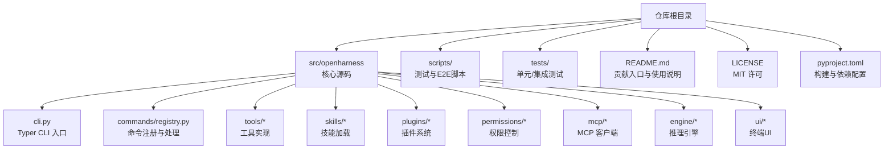
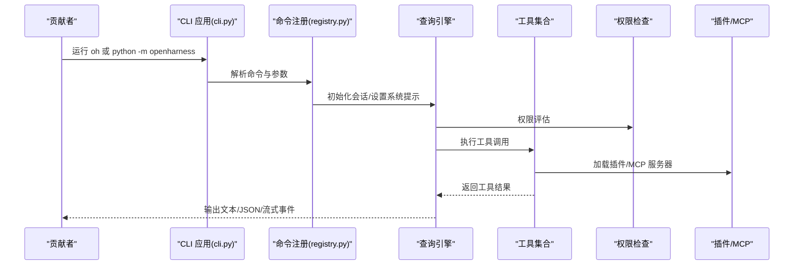
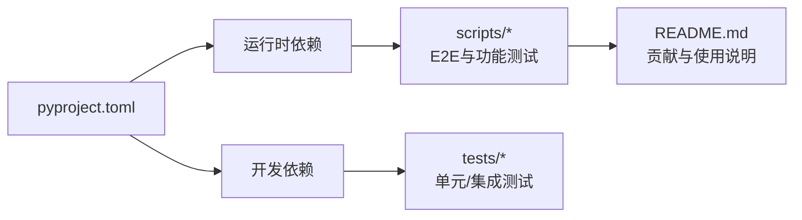

# 贡献流程

<cite>
**本文引用的文件**
- [README.md](file://README.md)
- [LICENSE](file://LICENSE)
- [pyproject.toml](file://pyproject.toml)
- [e2e_smoke.py](file://scripts/e2e_smoke.py)
- [test_harness_features.py](file://scripts/test_harness_features.py)
- [test_real_skills_plugins.py](file://scripts/test_real_skills_plugins.py)
- [cli.py](file://src/openharness/cli.py)
- [registry.py](file://src/openharness/commands/registry.py)
- [enter_worktree_tool.py](file://src/openharness/tools/enter_worktree_tool.py)
- [__main__.py](file://src/openharness/__main__.py)
</cite>

## 目录
1. [简介](#简介)
2. [项目结构](#项目结构)
3. [核心组件](#核心组件)
4. [架构总览](#架构总览)
5. [详细组件分析](#详细组件分析)
6. [依赖分析](#依赖分析)
7. [性能考虑](#性能考虑)
8. [故障排查指南](#故障排查指南)
9. [结论](#结论)
10. [附录](#附录)

## 简介
本指南面向所有希望为 OpenHarness 做出贡献的开发者，涵盖贡献者协议与行为准则、Git 工作流（分支策略、提交规范、合并请求流程）、代码审查标准与流程、发布与版本管理策略、Issue 与功能请求模板、文档贡献方式、社区沟通渠道与规范，以及新贡献者的入门与常见问题解答。内容基于仓库现有文件与测试脚本进行归纳总结，确保可操作性与一致性。

## 项目结构
OpenHarness 是一个以 Python 实现的终端交互式 AI 助手，采用模块化子系统设计，支持工具、技能、插件、权限、MCP、任务、多智能体等能力。开发与测试围绕以下关键路径展开：
- 源码根目录：src/openharness
- 测试与端到端脚本：scripts/
- 文档与许可：README.md、LICENSE
- 构建与依赖：pyproject.toml

图表来源
- [README.md:359-379](file://README.md#L359-L379)
- [pyproject.toml:1-58](file://pyproject.toml#L1-L58)

章节来源
- [README.md:82-125](file://README.md#L82-L125)
- [pyproject.toml:1-58](file://pyproject.toml#L1-L58)

## 核心组件
- CLI 入口与子命令：通过 Typer 提供主命令与子命令（mcp、plugin、auth），支持非交互输出模式与权限控制选项。
- 命令注册表：内置命令（如分支、差异、提交、任务）与工作树工具，支持 Git 集成。
- 工具体系：覆盖文件读写、编辑、搜索、任务、MCP、计划模式、工作树、定时任务等。
- 测试与 E2E：提供多种端到端场景验证，包括文件 I/O、搜索编辑、技能加载、插件组合、MCP、任务、笔记本、LSP、定时任务、工作树、上下文注入、远程代理、ask-user、任务更新、问题与PR评论上下文、MCP 认证重配置等。
- 版本与许可：项目版本在配置中声明，采用 MIT 许可证。

章节来源
- [cli.py:1-378](file://src/openharness/cli.py#L1-L378)
- [registry.py:784-833](file://src/openharness/commands/registry.py#L784-L833)
- [enter_worktree_tool.py:1-80](file://src/openharness/tools/enter_worktree_tool.py#L1-L80)
- [e2e_smoke.py:415-691](file://scripts/e2e_smoke.py#L415-L691)
- [LICENSE:1-22](file://LICENSE#L1-L22)
- [pyproject.toml:5-10](file://pyproject.toml#L5-L10)

## 架构总览
下图展示贡献相关的关键流程：从 CLI 启动到命令解析、工具执行、权限检查、插件与 MCP 集成，再到最终输出或会话存储。

图表来源
- [cli.py:179-378](file://src/openharness/cli.py#L179-L378)
- [registry.py:1147-1205](file://src/openharness/commands/registry.py#L1147-L1205)
- [e2e_smoke.py:694-757](file://scripts/e2e_smoke.py#L694-L757)

## 详细组件分析

### CLI 与子命令
- 主命令支持非交互打印模式、权限模式、模型与输出格式、系统提示拼接、MCP 配置、调试等选项。
- 子命令：
  - mcp：列出、添加、移除 MCP 服务器配置
  - plugin：列出、安装、卸载插件
  - auth：状态、登录、登出
- 入口点可通过模块运行或直接执行脚本名。

章节来源
- [cli.py:1-378](file://src/openharness/cli.py#L1-L378)
- [__main__.py:1-7](file://src/openharness/__main__.py#L1-L7)

### 命令注册与 Git 集成
- 内置命令包括分支、差异、提交、任务等，均通过命令注册表统一管理，并与 Git 交互。
- 示例：/branch、/diff、/commit 等命令在测试中被验证，确保与真实 Git 行为一致。

章节来源
- [registry.py:1147-1205](file://src/openharness/commands/registry.py#L1147-L1205)
- [test_commands/test_registry.py:466-495](file://tests/test_commands/test_registry.py#L466-L495)

### 工作树工具与 Git 工作流
- 工作树工具支持创建工作树、解析路径、进入与退出工作树，便于隔离开发与测试。
- 测试覆盖了工作树创建、读取、退出后的清理，确保路径存在性与生命周期管理。

章节来源
- [enter_worktree_tool.py:1-80](file://src/openharness/tools/enter_worktree_tool.py#L1-L80)
- [tests/test_tools/test_core_tools.py:198-247](file://tests/test_tools/test_core_tools.py#L198-L247)

### 端到端测试与场景
- E2E 脚本定义了丰富场景，覆盖文件 I/O、搜索编辑、技能加载、插件组合、MCP、任务、笔记本、LSP、定时任务、工作树、上下文注入、远程代理、ask-user、任务更新、问题与PR评论上下文、MCP 认证重配置等。
- 场景包含预设提示、工具序列校验、文件内容校验、最终文本断言等，确保系统行为稳定。

章节来源
- [e2e_smoke.py:415-691](file://scripts/e2e_smoke.py#L415-L691)
- [test_harness_features.py:1-241](file://scripts/test_harness_features.py#L1-L241)
- [test_real_skills_plugins.py:1-348](file://scripts/test_real_skills_plugins.py#L1-L348)

## 依赖分析
- 构建与打包：使用 Hatchling；脚本入口通过 console_scripts 暴露。
- 运行时依赖：包括 LLM 客户端、终端 UI、类型系统、HTTP 客户端、MCP 协议、YAML、热重载等。
- 开发依赖：pytest、pytest-asyncio、pytest-cov、ruff、mypy 等，用于测试与静态检查。
- 测试组织：pytest 配置位于 pyproject.toml，测试脚本位于 scripts/ 与 tests/。

图表来源
- [pyproject.toml:15-38](file://pyproject.toml#L15-L38)
- [pyproject.toml:47-58](file://pyproject.toml#L47-L58)

章节来源
- [pyproject.toml:1-58](file://pyproject.toml#L1-L58)
- [README.md:359-379](file://README.md#L359-L379)

## 性能考虑
- 并行工具执行：查询循环支持并行路径，同时保留单工具快速路径，减少不必要的并发开销。
- 重试机制：API 层具备可配置重试次数与指数退避延迟，提升网络波动下的稳定性。
- 权限检查：路径级与命令级规则在执行前评估，避免无效 IO 与危险命令执行。

章节来源
- [test_harness_features.py:140-151](file://scripts/test_harness_features.py#L140-L151)
- [test_harness_features.py:42-72](file://scripts/test_harness_features.py#L42-L72)

## 故障排查指南
- 缺少 API 密钥：E2E 脚本在启动时会检查环境变量或标准输入中的密钥，若缺失则直接失败。
- 权限不足：当路径规则或命令规则拒绝时，工具返回错误信息；建议检查权限模式与规则配置。
- 插件/技能未加载：确认用户目录下的技能与插件已正确放置，且系统提示中包含相应条目。
- MCP 服务器：通过 mcp 子命令列出/添加/移除服务器配置，确保传输方式与命令正确。

章节来源
- [e2e_smoke.py:759-799](file://scripts/e2e_smoke.py#L759-L799)
- [cli.py:38-92](file://src/openharness/cli.py#L38-L92)

## 结论
本指南基于仓库现有文件与测试脚本，总结了 OpenHarness 的贡献流程与实践要点。建议贡献者遵循统一的分支与提交规范、严格通过测试与审查流程、保持文档与示例同步更新，共同维护高质量的开源协作生态。

## 附录

### 贡献者协议与行为准则
- 许可证：项目采用 MIT 许可，允许自由使用、复制、修改、分发与再许可，需保留版权与许可声明。
- 行为准则：请在社区互动中保持尊重、包容与专业，遵守开源社区通用礼仪与法律法规。

章节来源
- [LICENSE:1-22](file://LICENSE#L1-L22)

### Git 工作流与分支策略
- 分支命名：建议采用功能/修复/文档前缀，例如 feature/xxx、fix/xxx、docs/xxx。
- 提交规范：建议使用清晰的主体与可选正文，描述“做了什么”和“为什么”，并附带相关 Issue 编号。
- 合并请求（MR）：建议在 MR 描述中说明变更动机、影响范围、测试覆盖与风险提示，并关联相关 Issue。

（本节为通用实践建议，不直接对应具体文件）

### 代码审查标准与流程
- 审查清单
  - 是否满足需求与设计目标
  - 是否有充分的单元/集成/E2E 测试
  - 是否遵循项目风格与静态检查（Ruff/Mypy）
  - 是否影响权限、安全与性能
  - 是否更新相关文档与示例
- 反馈处理：针对审查意见逐项回复与修正，必要时补充测试或重构代码。

（本节为通用实践建议，不直接对应具体文件）

### 发布流程与版本管理
- 版本号：当前版本在配置中声明，建议遵循语义化版本（SemVer）。
- 发布步骤：本地构建与测试通过后，更新版本号与变更日志，推送标签并发布包。
- 安装与升级：提供一键升级指令，确保前端依赖同步安装。

章节来源
- [pyproject.toml:5-10](file://pyproject.toml#L5-L10)
- [registry.py:1150-1164](file://src/openharness/commands/registry.py#L1150-L1164)

### Issue 报告与功能请求模板
- Issue 模板（建议）
  - 标题：简洁描述问题
  - 环境：操作系统、Python 版本、LLM 提供商与模型
  - 复现步骤：最小可复现步骤
  - 期望行为：预期结果
  - 实际行为：实际结果
  - 日志与截图：附上关键日志与截图
- 功能请求模板（建议）
  - 背景：为什么需要该功能
  - 需求：具体需求与验收条件
  - 影响面：对权限、性能、兼容性的影响
  - 替代方案：已尝试的替代方案

（本节为通用实践建议，不直接对应具体文件）

### 文档贡献方式与要求
- 文档类型：架构说明、使用教程、最佳实践、FAQ、翻译等
- 要求：结构清晰、语言准确、与代码保持同步、提供示例与截图
- 提交方式：通过 MR 提交，附带测试或演示脚本

（本节为通用实践建议，不直接对应具体文件）

### 社区交流渠道与沟通规范
- 交流渠道：飞书群组、微信交流群
- 规范：提问前先检索历史记录，提供必要上下文，避免敏感信息外泄

章节来源
- [README.md:23-25](file://README.md#L23-L25)

### 新贡献者入门与常见问题
- 快速开始：克隆仓库、安装依赖、运行测试、启动 CLI
- 常见问题
  - 如何运行特定 E2E 场景
  - 如何添加新的工具/技能/插件
  - 如何配置 MCP 服务器
  - 如何在本地调试权限与安全规则

章节来源
- [README.md:82-125](file://README.md#L82-L125)
- [e2e_smoke.py:54-90](file://scripts/e2e_smoke.py#L54-L90)
- [cli.py:38-92](file://src/openharness/cli.py#L38-L92)