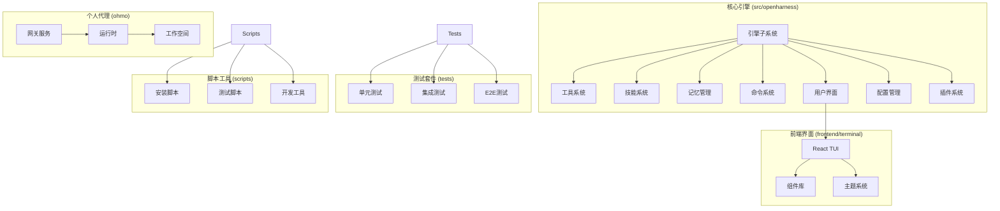
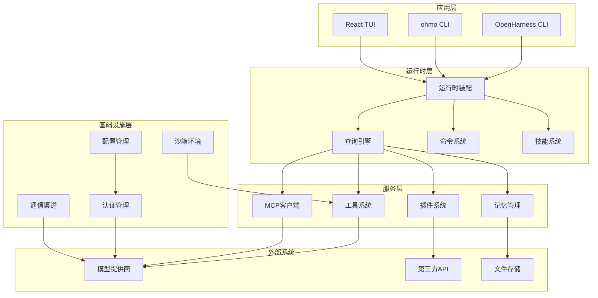
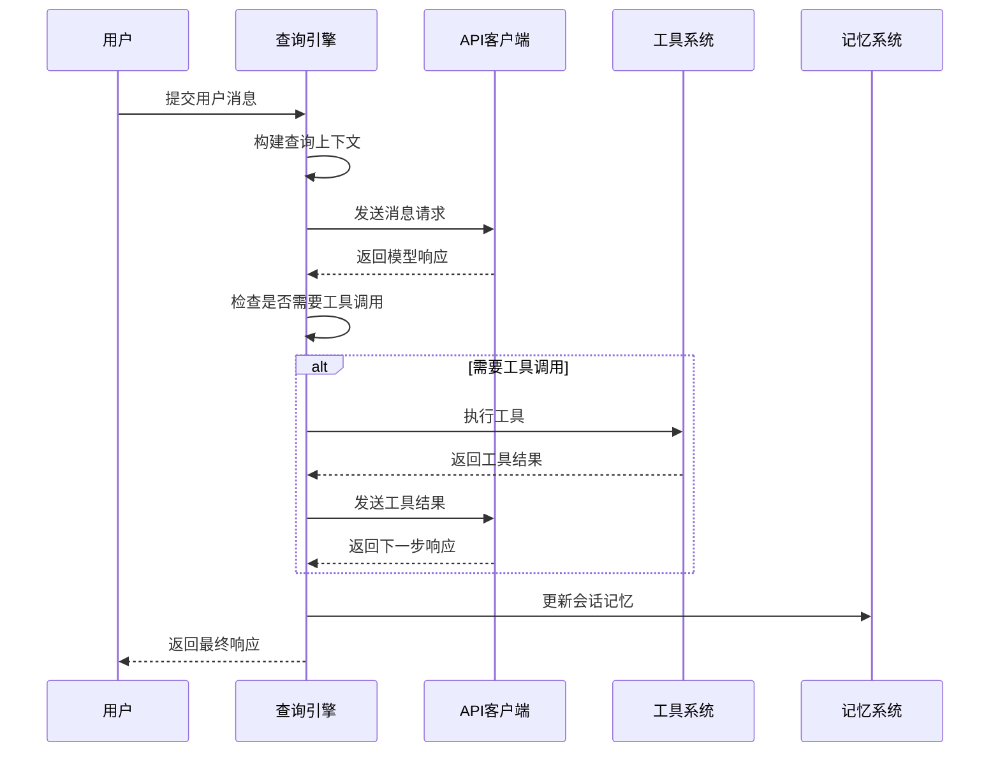
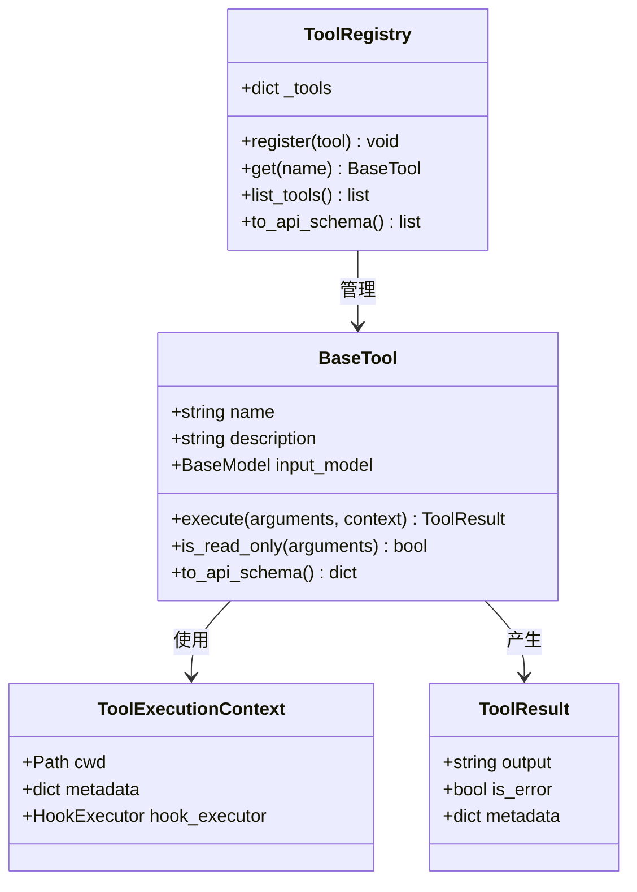
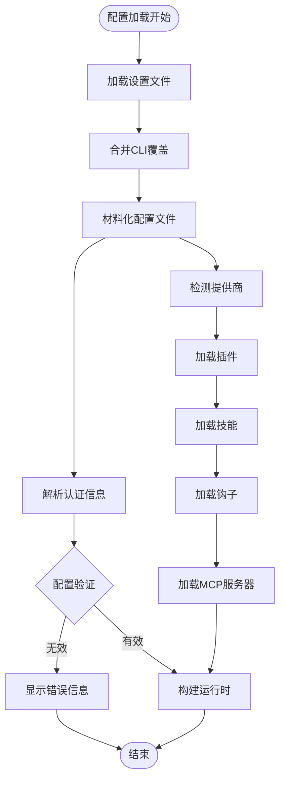
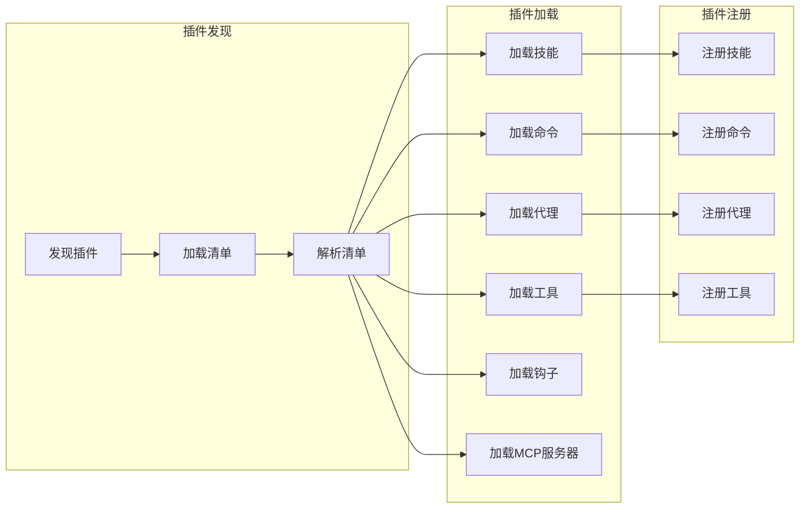
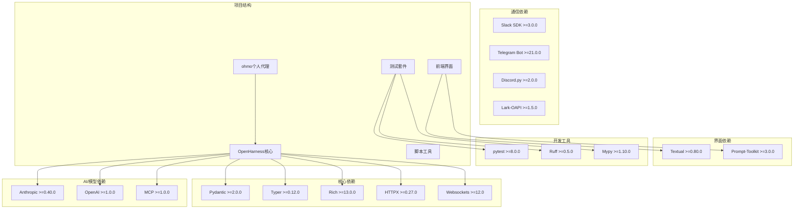

# 项目结构说明

<cite>
**本文档引用的文件**
- [README.md](file://README.md)
- [CONTRIBUTING.md](file://CONTRIBUTING.md)
- [pyproject.toml](file://pyproject.toml)
- [src/openharness/__main__.py](file://src/openharness/__main__.py)
- [ohmo/__main__.py](file://ohmo/__main__.py)
- [src/openharness/cli.py](file://src/openharness/cli.py)
- [ohmo/cli.py](file://ohmo/cli.py)
- [src/openharness/engine/query_engine.py](file://src/openharness/engine/query_engine.py)
- [src/openharness/tools/base.py](file://src/openharness/tools/base.py)
- [src/openharness/memory/manager.py](file://src/openharness/memory/manager.py)
- [src/openharness/config/settings.py](file://src/openharness/config/settings.py)
- [src/openharness/ui/runtime.py](file://src/openharness/ui/runtime.py)
- [src/openharness/skills/registry.py](file://src/openharness/skills/registry.py)
- [src/openharness/plugins/loader.py](file://src/openharness/plugins/loader.py)
- [src/openharness/commands/registry.py](file://src/openharness/commands/registry.py)
</cite>

## 目录
1. [简介](#简介)
2. [项目结构概览](#项目结构概览)
3. [核心组件详解](#核心组件详解)
4. [架构总览](#架构总览)
5. [详细组件分析](#详细组件分析)
6. [依赖关系分析](#依赖关系分析)
7. [性能考虑](#性能考虑)
8. [故障排除指南](#故障排除指南)
9. [结论](#结论)

## 简介

OpenHarness 是一个开源的智能体基础设施项目，提供轻量级的代理运行时环境，支持工具使用、技能系统、内存管理和多代理协调。该项目包含两个主要应用：`openharness`（核心代理引擎）和 `ohmo`（个人AI代理应用）。

项目采用模块化设计，通过清晰的分层架构实现了高度可扩展的智能体平台。核心功能包括：
- 智能体循环执行引擎
- 43+ 工具集（文件操作、搜索、Web访问、MCP集成等）
- 技能系统（基于Markdown的知识库）
- 权限控制系统
- 多代理协调机制
- 记忆管理系统
- React TUI终端界面

## 项目结构概览

项目采用清晰的目录组织结构，主要分为以下几个核心部分：

**图表来源**
- [pyproject.toml:54-74](file://pyproject.toml#L54-L74)
- [README.md:446-466](file://README.md#L446-L466)

**章节来源**
- [README.md:14-16](file://README.md#L14-L16)
- [pyproject.toml:1-86](file://pyproject.toml#L1-L86)

## 核心组件详解

### OpenHarness 核心引擎 (src/openharness)

OpenHarness 的核心引擎是整个系统的运行时基础，负责协调各个子系统的工作。主要子系统包括：

#### 引擎子系统 (engine/)
- **查询引擎 (query_engine.py)**: 实现智能体循环的核心逻辑，处理消息流式传输和工具调用
- **消息管理 (messages.py)**: 管理对话历史和消息格式化
- **查询处理 (query.py)**: 处理用户输入和模型交互
- **事件流 (stream_events.py)**: 管理实时事件流

#### 工具系统 (tools/)
- **基础工具 (base.py)**: 定义工具抽象接口和执行上下文
- **43+ 内置工具**: 文件操作、Shell命令、搜索、Web访问、MCP集成等
- **工具注册表**: 管理工具的注册和发现

#### 技能系统 (skills/)
- **技能注册表**: 管理技能的加载和查找
- **技能加载器**: 支持从多种来源加载技能
- **技能类型定义**: 规范化技能数据结构

#### 记忆系统 (memory/)
- **内存管理器**: 处理记忆文件的创建、更新和删除
- **内存扫描**: 发现和索引项目中的记忆文件
- **内存路径**: 管理内存文件的存储位置

#### 配置系统 (config/)
- **设置模型**: 定义配置参数的数据结构
- **路径管理**: 处理配置文件和数据文件的路径
- **模式验证**: 确保配置的有效性

#### 用户界面 (ui/)
- **运行时装配**: 组装UI所需的运行时组件
- **文本界面**: 提供命令行界面支持
- **React启动器**: 启动React TUI界面

**章节来源**
- [src/openharness/engine/query_engine.py:21-307](file://src/openharness/engine/query_engine.py#L21-L307)
- [src/openharness/tools/base.py:35-81](file://src/openharness/tools/base.py#L35-L81)
- [src/openharness/memory/manager.py:39-184](file://src/openharness/memory/manager.py#L39-L184)
- [src/openharness/config/settings.py:534-800](file://src/openharness/config/settings.py#L534-L800)
- [src/openharness/ui/runtime.py:120-758](file://src/openharness/ui/runtime.py#L120-L758)

### ohmo 个人代理 (ohmo/)

ohmo 是基于 OpenHarness 构建的个人AI代理应用，提供聊天机器人功能：

#### 网关服务 (gateway/)
- **桥接管理**: 管理与外部聊天平台的连接
- **路由服务**: 处理来自不同渠道的消息
- **会话管理**: 管理用户的会话状态

#### 运行时 (runtime/)
- **后端运行时**: 处理ohmo的核心逻辑
- **打印模式**: 支持非交互式输出
- **React启动器**: 启动ohmo的TUI界面

#### 工作空间 (workspace/)
- **初始化**: 设置ohmo的工作环境
- **配置管理**: 管理ohmo的配置文件
- **状态跟踪**: 跟踪ohmo的运行状态

**章节来源**
- [ohmo/cli.py:1-676](file://ohmo/cli.py#L1-L676)

### 前端终端界面 (frontend/terminal)

提供现代化的React TUI界面，支持丰富的交互功能：

#### 组件库 (components/)
- **命令选择器**: 提供命令自动完成功能
- **对话视图**: 显示聊天历史和响应
- **输入组件**: 处理用户输入和快捷键
- **状态显示**: 展示系统状态和进度

#### 主题系统 (theme/)
- **主题上下文**: 管理界面主题
- **内置主题**: 提供多种预设主题

**章节来源**
- [README.md:637-647](file://README.md#L637-L647)

### 测试套件 (tests/)

全面的测试覆盖，确保代码质量：

#### 测试分类
- **API测试**: 测试各种客户端实现
- **认证测试**: 验证身份验证流程
- **工具测试**: 测试各种工具的功能
- **插件测试**: 验证插件系统
- **权限测试**: 测试安全控制

#### 测试策略
- **单元测试**: 针对单个组件的功能测试
- **集成测试**: 测试组件间的协作
- **E2E测试**: 端到端场景测试

**章节来源**
- [README.md:721-731](file://README.md#L721-L731)

### 脚本工具 (scripts/)

提供开发和部署相关的自动化脚本：

#### 开发脚本
- **安装脚本**: 支持Windows和Unix系统的安装
- **测试脚本**: 运行各种测试套件
- **同步脚本**: 同步nanobot通道配置

#### 部署脚本
- **打包脚本**: 准备发布版本
- **迁移脚本**: 处理数据迁移

**章节来源**
- [CONTRIBUTING.md:13-27](file://CONTRIBUTING.md#L13-L27)

## 架构总览

OpenHarness 采用分层架构设计，各层职责明确，耦合度低：

**图表来源**
- [src/openharness/ui/runtime.py:246-443](file://src/openharness/ui/runtime.py#L246-L443)
- [src/openharness/cli.py:751-800](file://src/openharness/cli.py#L751-L800)

该架构的主要特点：
- **分层清晰**: 每层都有明确的职责边界
- **可扩展性**: 新功能通过插件和扩展点添加
- **解耦设计**: 组件间通过明确定义的接口交互
- **可测试性**: 每个组件都可以独立测试

**章节来源**
- [README.md:446-502](file://README.md#L446-L502)

## 详细组件分析

### 查询引擎 (QueryEngine)

查询引擎是OpenHarness的核心，实现了智能体循环的关键逻辑：

**图表来源**
- [src/openharness/engine/query_engine.py:227-307](file://src/openharness/engine/query_engine.py#L227-L307)

查询引擎的关键特性：
- **流式处理**: 支持实时消息流
- **工具集成**: 自动识别和执行工具调用
- **记忆管理**: 持久化会话状态
- **权限控制**: 在执行前进行权限检查

**章节来源**
- [src/openharness/engine/query_engine.py:21-307](file://src/openharness/engine/query_engine.py#L21-L307)

### 工具系统架构

工具系统提供了统一的抽象接口，支持43+种不同的工具：

**图表来源**
- [src/openharness/tools/base.py:17-81](file://src/openharness/tools/base.py#L17-L81)

工具系统的设计原则：
- **统一接口**: 所有工具遵循相同的抽象接口
- **类型安全**: 使用Pydantic模型进行输入验证
- **生命周期管理**: 支持钩子和生命周期事件
- **可扩展性**: 易于添加新的工具类型

**章节来源**
- [src/openharness/tools/base.py:35-81](file://src/openharness/tools/base.py#L35-L81)

### 配置管理系统

配置系统提供了灵活的配置管理机制：

**图表来源**
- [src/openharness/config/settings.py:534-800](file://src/openharness/config/settings.py#L534-L800)

配置系统的关键功能：
- **多层配置**: 支持文件、环境变量、CLI参数的优先级
- **动态加载**: 运行时可以重新加载配置
- **验证机制**: 确保配置的一致性和有效性
- **扩展性**: 支持自定义配置项

**章节来源**
- [src/openharness/config/settings.py:1-800](file://src/openharness/config/settings.py#L1-L800)

### 插件系统架构

插件系统支持动态扩展功能：

**图表来源**
- [src/openharness/plugins/loader.py:107-163](file://src/openharness/plugins/loader.py#L107-L163)

插件系统的特点：
- **标准化格式**: 使用plugin.json规范
- **多类型支持**: 技能、命令、代理、工具、钩子、MCP
- **动态加载**: 运行时动态发现和加载
- **安全隔离**: 支持插件启用/禁用控制

**章节来源**
- [src/openharness/plugins/loader.py:1-731](file://src/openharness/plugins/loader.py#L1-L731)

## 依赖关系分析

项目采用模块化的依赖管理策略：

**图表来源**
- [pyproject.toml:16-36](file://pyproject.toml#L16-L36)
- [pyproject.toml:38-46](file://pyproject.toml#L38-L46)

**章节来源**
- [pyproject.toml:1-86](file://pyproject.toml#L1-L86)

## 性能考虑

OpenHarness 在设计时充分考虑了性能优化：

### 内存管理
- **增量压缩**: 支持会话内容的增量压缩
- **缓存策略**: 工具结果和技能内容的缓存
- **内存限制**: 可配置的内存使用上限

### 并发处理
- **异步执行**: 工具调用和API请求的异步处理
- **并行工具**: 支持多个工具同时执行
- **资源池**: 数据库连接和网络连接的池化管理

### 网络优化
- **连接复用**: HTTP连接的持久化
- **超时控制**: 合理的请求超时设置
- **重试机制**: 指数退避的重试策略

### 缓存策略
- **技能缓存**: 加载的技能内容缓存
- **工具缓存**: 工具元数据的缓存
- **配置缓存**: 配置文件的缓存

## 故障排除指南

### 常见问题诊断

#### 认证问题
- **症状**: "未找到API密钥"或"认证状态缺失"
- **解决方案**: 检查环境变量设置或运行 `oh auth login`

#### 工具执行失败
- **症状**: 工具调用返回错误或无响应
- **解决方案**: 检查工具权限、网络连接和依赖服务

#### 内存相关问题
- **症状**: 内存使用过高或内存不足
- **解决方案**: 调整内存配置或清理过期数据

#### 插件加载失败
- **症状**: 插件无法加载或功能异常
- **解决方案**: 检查插件兼容性和依赖关系

### 调试技巧

#### 日志级别调整
- 使用 `--debug` 参数启用详细日志
- 检查系统日志文件获取更多信息

#### 状态检查
- 使用 `/status` 命令查看系统状态
- 使用 `/context` 命令检查当前上下文

#### 性能监控
- 监控内存使用情况
- 检查API调用频率限制

**章节来源**
- [src/openharness/ui/runtime.py:565-577](file://src/openharness/ui/runtime.py#L565-L577)

## 结论

OpenHarness 项目展现了优秀的软件工程实践，具有以下突出特点：

### 设计优势
- **模块化架构**: 清晰的分层设计和职责分离
- **可扩展性**: 通过插件系统和扩展点支持功能扩展
- **安全性**: 完善的权限控制和安全机制
- **可维护性**: 良好的代码组织和文档支持

### 技术特色
- **智能体循环**: 高效的工具调用和决策循环
- **多平台支持**: 支持多种模型提供商和聊天平台
- **丰富的工具集**: 43+ 内置工具满足多样化需求
- **现代化界面**: 提供直观的React TUI体验

### 发展前景
OpenHarness 为AI智能体开发提供了坚实的基础框架，适合研究人员、开发者和企业团队使用。其模块化设计和完善的扩展机制为未来的功能增强和技术演进奠定了良好基础。

通过本文档的详细说明，开发者可以快速理解项目结构、掌握核心概念，并有效地进行二次开发和功能扩展。