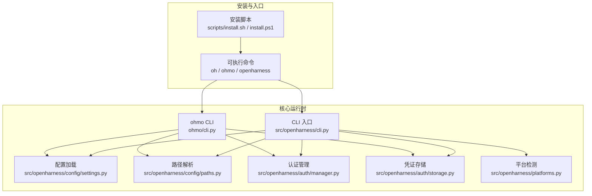
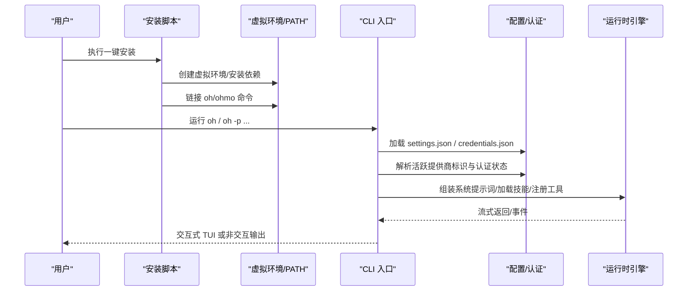
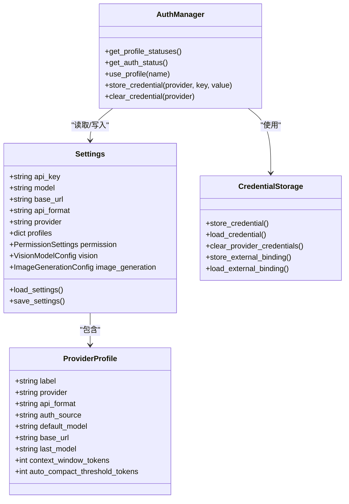
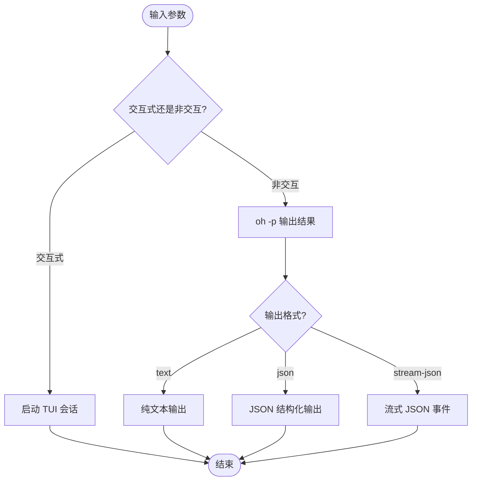
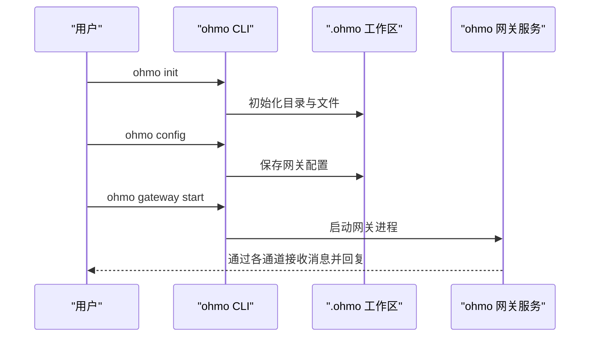
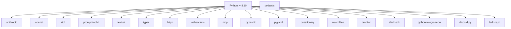

# 快速开始

<cite>
**本文引用的文件**
- [README.md](file://README.md)
- [pyproject.toml](file://pyproject.toml)
- [scripts/install.sh](file://scripts/install.sh)
- [scripts/install.ps1](file://scripts/install.ps1)
- [src/openharness/cli.py](file://src/openharness/cli.py)
- [src/openharness/config/settings.py](file://src/openharness/config/settings.py)
- [src/openharness/config/paths.py](file://src/openharness/config/paths.py)
- [src/openharness/auth/manager.py](file://src/openharness/auth/manager.py)
- [src/openharness/auth/storage.py](file://src/openharness/auth/storage.py)
- [src/openharness/platforms.py](file://src/openharness/platforms.py)
- [ohmo/cli.py](file://ohmo/cli.py)
- [ohmo/__main__.py](file://ohmo/__main__.py)
</cite>

## 目录
1. [简介](#简介)
2. [项目结构](#项目结构)
3. [核心组件](#核心组件)
4. [架构总览](#架构总览)
5. [详细组件分析](#详细组件分析)
6. [依赖分析](#依赖分析)
7. [性能考虑](#性能考虑)
8. [故障排查指南](#故障排查指南)
9. [结论](#结论)
10. [附录](#附录)

## 简介
OpenHarness 是一个开源的智能体基础设施，提供工具使用、技能系统、记忆与多智能体协调能力。配合 ohmo（个人代理），你可以在多种即时通讯平台中与 AI 协作，实现长期会话、分支管理、代码编写、测试执行与自动提交 PR。

本“快速开始”旨在帮助你在最短时间内完成安装、配置与首次体验，涵盖 Linux/macOS/WSL 与 Windows 平台的安装方式、AI 提供商选择与认证、ohmo 个人代理设置、非交互模式使用以及常见初始化问题的解决方案。

## 项目结构
- 核心 CLI：通过命令 oh 启动交互式会话或非交互输出；ohmo 子命令用于个人代理工作区与网关管理。
- 配置与认证：集中于配置目录 ~/.openharness，支持环境变量覆盖与文件持久化。
- 安装脚本：提供一键安装与虚拟环境隔离，自动链接可执行命令到 ~/.local/bin 或 Windows PATH。
- 平台检测：根据系统与内核标识区分 macOS、Linux、WSL、Windows，并据此启用相应能力矩阵。

图示来源
- [scripts/install.sh:1-388](file://scripts/install.sh#L1-L388)
- [scripts/install.ps1:1-330](file://scripts/install.ps1#L1-L330)
- [src/openharness/cli.py:751-780](file://src/openharness/cli.py#L751-L780)
- [ohmo/cli.py:37-51](file://ohmo/cli.py#L37-L51)
- [src/openharness/config/settings.py:972-1029](file://src/openharness/config/settings.py#L972-L1029)
- [src/openharness/config/paths.py:15-161](file://src/openharness/config/paths.py#L15-L161)
- [src/openharness/auth/manager.py:71-483](file://src/openharness/auth/manager.py#L71-L483)
- [src/openharness/auth/storage.py:54-270](file://src/openharness/auth/storage.py#L54-L270)
- [src/openharness/platforms.py:27-88](file://src/openharness/platforms.py#L27-L88)

章节来源
- [README.md:197-284](file://README.md#L197-L284)
- [pyproject.toml:48-52](file://pyproject.toml#L48-L52)

## 核心组件
- 安装与环境准备
  - Linux/macOS/WSL：推荐使用一键安装脚本，自动创建虚拟环境、安装依赖并链接命令到 ~/.local/bin。
  - Windows：推荐使用 PowerShell 一键安装脚本，自动创建虚拟环境、安装依赖并更新 PATH。
- 配置与认证
  - 配置目录：默认 ~/.openharness，包含 settings.json、credentials.json、数据与日志目录。
  - 认证：支持 API Key、订阅桥接（Claude/Codex）与 GitHub Copilot OAuth。
  - 环境变量：可通过 OPENHARNESS_CONFIG_DIR、OPENHARNESS_DATA_DIR 等覆盖默认路径。
- 运行与体验
  - 交互式会话：oh 启动后进入 TUI，支持命令面板、权限弹窗、模式切换与会话恢复。
  - 非交互模式：oh -p/--print 输出结果，支持 text/json/stream-json。
  - ohmo：ohmo init / config / gateway start 启动个人代理网关，支持 Telegram/Slack/Discord/Feishu。

章节来源
- [scripts/install.sh:1-388](file://scripts/install.sh#L1-L388)
- [scripts/install.ps1:1-330](file://scripts/install.ps1#L1-L330)
- [src/openharness/config/paths.py:15-161](file://src/openharness/config/paths.py#L15-L161)
- [src/openharness/config/settings.py:534-580](file://src/openharness/config/settings.py#L534-L580)
- [src/openharness/auth/manager.py:116-184](file://src/openharness/auth/manager.py#L116-L184)
- [src/openharness/auth/storage.py:122-191](file://src/openharness/auth/storage.py#L122-L191)
- [README.md:223-284](file://README.md#L223-L284)
- [ohmo/cli.py:493-534](file://ohmo/cli.py#L493-L534)

## 架构总览
下图展示了从安装到运行的关键路径：安装脚本创建虚拟环境并安装包；oh/ohmo 可执行命令调用 CLI 入口；CLI 读取配置、解析认证、构建系统提示词并驱动工具与技能执行；ohmo 在个人工作区中管理网关与通道。

图示来源
- [scripts/install.sh:184-313](file://scripts/install.sh#L184-L313)
- [scripts/install.ps1:127-305](file://scripts/install.ps1#L127-L305)
- [src/openharness/cli.py:396-597](file://src/openharness/cli.py#L396-L597)
- [src/openharness/config/settings.py:972-1029](file://src/openharness/config/settings.py#L972-L1029)
- [src/openharness/auth/manager.py:186-289](file://src/openharness/auth/manager.py#L186-L289)

## 详细组件分析

### 安装与平台适配
- Linux/macOS/WSL
  - 使用 curl 一键脚本安装，自动检测 Python 与 Node.js 版本，创建虚拟环境并链接 oh/ohmo 到 ~/.local/bin。
  - 支持 --from-source 以可编辑模式安装源码。
- Windows
  - 使用 PowerShell 一键脚本安装，自动检测 Python 与 Node.js，创建虚拟环境并更新用户 PATH。
  - 注意：在 PowerShell 中建议使用 openharness 或 openh.exe，避免与 Out-Host 冲突。

章节来源
- [scripts/install.sh:69-128](file://scripts/install.sh#L69-L128)
- [scripts/install.sh:150-179](file://scripts/install.sh#L150-L179)
- [scripts/install.sh:184-238](file://scripts/install.sh#L184-L238)
- [scripts/install.sh:270-290](file://scripts/install.sh#L270-L290)
- [scripts/install.sh:294-313](file://scripts/install.sh#L294-L313)
- [scripts/install.ps1:62-96](file://scripts/install.ps1#L62-L96)
- [scripts/install.ps1:100-122](file://scripts/install.ps1#L100-L122)
- [scripts/install.ps1:127-191](file://scripts/install.ps1#L127-L191)
- [scripts/install.ps1:240-254](file://scripts/install.ps1#L240-L254)
- [scripts/install.ps1:283-305](file://scripts/install.ps1#L283-L305)

### 配置与认证
- 配置文件与目录
  - 默认配置目录：~/.openharness，包含 settings.json、credentials.json、data、logs 等子目录。
  - 可通过 OPENHARNESS_CONFIG_DIR、OPENHARNESS_DATA_DIR 等环境变量覆盖。
- 提供商与认证
  - 内置提供商标识：anthropic、openai、copilot、dashscope、moonshot、gemini、minimax、modelscope 等。
  - 支持 API Key、订阅桥接（Claude/Codex）与 Copilot OAuth。
  - 认证状态查询与切换：AuthManager 提供 get_profile_statuses/get_auth_status 等接口。
- 模型与策略
  - 支持模型别名与规范化，按提供商标识解析最终模型 ID。
  - 权限模式：default/auto/plan 等，路径规则与命令黑名单可配置。

图示来源
- [src/openharness/config/settings.py:534-580](file://src/openharness/config/settings.py#L534-L580)
- [src/openharness/config/settings.py:116-140](file://src/openharness/config/settings.py#L116-L140)
- [src/openharness/auth/manager.py:116-184](file://src/openharness/auth/manager.py#L116-L184)
- [src/openharness/auth/storage.py:122-191](file://src/openharness/auth/storage.py#L122-L191)

章节来源
- [src/openharness/config/paths.py:15-161](file://src/openharness/config/paths.py#L15-L161)
- [src/openharness/config/settings.py:534-580](file://src/openharness/config/settings.py#L534-L580)
- [src/openharness/auth/manager.py:116-184](file://src/openharness/auth/manager.py#L116-L184)
- [src/openharness/auth/storage.py:122-191](file://src/openharness/auth/storage.py#L122-L191)

### 运行与体验（交互式与非交互）
- 交互式会话
  - 直接运行 oh 启动 TUI，支持命令面板、权限弹窗、模式切换与会话恢复。
- 非交互模式
  - oh -p/--print 输出单次提示结果。
  - --output-format 支持 text/json/stream-json，便于脚本化集成。
- Dry-run 预览
  - oh --dry-run 预览设置解析、认证状态、技能/工具/命令发现与 MCP 配置，不实际调用模型或执行工具。

图示来源
- [README.md:255-284](file://README.md#L255-L284)
- [src/openharness/cli.py:396-597](file://src/openharness/cli.py#L396-L597)

章节来源
- [README.md:255-284](file://README.md#L255-L284)
- [src/openharness/cli.py:396-597](file://src/openharness/cli.py#L396-L597)

### ohmo 个人代理设置
- 初始化工作区
  - ohmo init：初始化 ~/.ohmo 工作区，生成 soul.md、user.md、gateway.json 等文件。
- 配置网关与通道
  - ohmo config：交互式向导选择提供商标识、启用/配置通道（Telegram/Slack/Discord/Feishu）、远程管理员命令白名单等。
- 启动与管理
  - ohmo gateway start/run/status/restart/stop：前台运行、后台启动、状态查询与重启。

图示来源
- [ohmo/cli.py:493-534](file://ohmo/cli.py#L493-L534)
- [ohmo/cli.py:628-676](file://ohmo/cli.py#L628-L676)
- [ohmo/__main__.py:1-9](file://ohmo/__main__.py#L1-L9)

章节来源
- [ohmo/cli.py:493-534](file://ohmo/cli.py#L493-L534)
- [ohmo/cli.py:628-676](file://ohmo/cli.py#L628-L676)
- [ohmo/__main__.py:1-9](file://ohmo/__main__.py#L1-L9)

## 依赖分析
- Python 版本要求：>=3.10
- 关键依赖：anthropic、openai、rich、prompt-toolkit、textual、typer、pydantic、httpx、websockets、mcp、pyperclip、pyyaml、questionary、watchfiles、croniter、slack-sdk、python-telegram-bot、discord.py、lark-oapi
- 可选前端：React/TUI 依赖 Node.js>=18（安装脚本会检测并提示）

图示来源
- [pyproject.toml:16-36](file://pyproject.toml#L16-L36)

章节来源
- [pyproject.toml:1-86](file://pyproject.toml#L1-L86)

## 性能考虑
- 上下文压缩与自动紧凑：在长时间会话中保持任务状态与通道日志，减少上下文膨胀。
- 并行工具执行与重试：工具调用与模型请求具备并行与指数退避重试机制。
- 资源限制与沙箱：可配置网络与文件系统限制，Docker 沙箱镜像可自动构建与复用。
- TUI 动画与跨平台兼容：在 Windows 终端上降低闪烁与错误，提升交互稳定性。

## 故障排查指南
- 安装后命令不可用
  - Linux/macOS/WSL：确认 ~/.local/bin 已加入 PATH，或重新加载 shell 配置。
  - Windows：确认用户 PATH 包含虚拟环境 Scripts 目录，必要时重启终端或登录/注销。
- Node.js 缺失导致 TUI 不可用
  - 安装 Node.js>=18；若已安装但未被识别，请检查 PATH 或使用包管理器安装。
- 认证失败
  - 检查活跃提供商标识与认证状态：oh auth status。
  - API Key：设置 ANTHROPIC_API_KEY 或 OPENAI_API_KEY，或在配置文件中指定。
  - 订阅桥接：确保外部绑定存在且有效（Claude/Codex）。
  - Copilot：使用 oh auth copilot-login 完成 OAuth 登录。
- ohmo 无法启动网关
  - 使用 ohmo doctor 检查工作区健康状况与提供商配置。
  - 确认已配置至少一个通道的凭据与 allow_from 白名单。
  - 使用 ohmo gateway status 查看当前状态，必要时 restart。
- 平台相关问题
  - Windows 终端：建议使用 openharness 或 openh.exe，避免与 Out-Host 冲突。
  - WSL：注意与 Windows 文件系统共享与权限差异，优先使用 WSL 内部路径。

章节来源
- [scripts/install.sh:318-367](file://scripts/install.sh#L318-L367)
- [scripts/install.ps1:240-254](file://scripts/install.ps1#L240-L254)
- [src/openharness/auth/manager.py:186-289](file://src/openharness/auth/manager.py#L186-L289)
- [src/openharness/config/settings.py:691-728](file://src/openharness/config/settings.py#L691-L728)
- [ohmo/cli.py:536-560](file://ohmo/cli.py#L536-L560)

## 结论
通过一键安装脚本与交互式配置向导，你可以快速完成 OpenHarness 的安装与认证设置，并在交互式 TUI 或非交互模式下体验核心功能。ohmo 个人代理进一步将智能体部署到常用即时通讯平台，实现长期协作与自动化工作流。遇到问题时，可借助 dry-run、doctor 与状态查询工具进行定位与修复。

## 附录
- 常用命令速查
  - 安装：curl ... install.sh 或 PowerShell 一键脚本
  - 配置：oh setup / oh provider list/use / oh auth login
  - 运行：oh（交互式）/ oh -p/--print（非交互）
  - ohmo：ohmo init / config / gateway start
- 环境变量参考
  - OPENHARNESS_CONFIG_DIR：覆盖配置目录
  - OPENHARNESS_DATA_DIR：覆盖数据目录
  - OPENHARNESS_PROFILE：覆盖活跃提供商标识
  - ANTHROPIC_API_KEY / OPENAI_API_KEY：API Key
  - HTTPS_PROXY / http_proxy 等：网络代理（谨慎使用）

章节来源
- [README.md:197-284](file://README.md#L197-L284)
- [src/openharness/config/paths.py:15-161](file://src/openharness/config/paths.py#L15-L161)
- [src/openharness/config/settings.py:691-728](file://src/openharness/config/settings.py#L691-L728)
- [ohmo/cli.py:536-560](file://ohmo/cli.py#L536-L560)