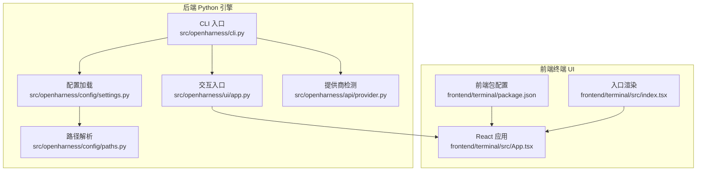
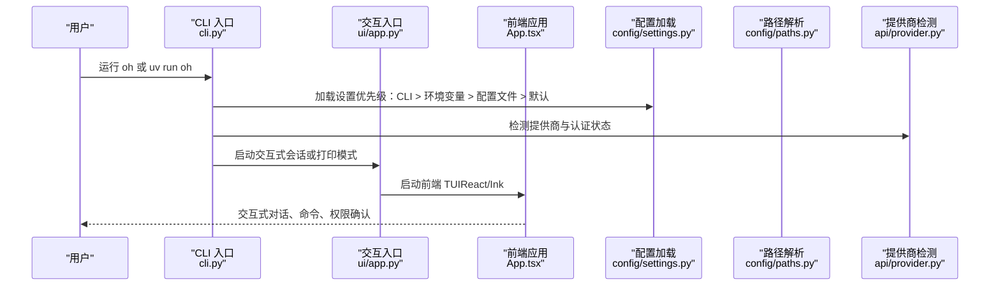
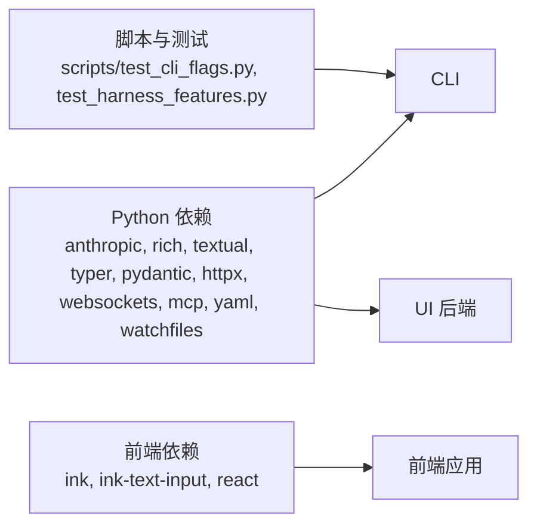

# 快速开始

<cite>
**本文引用的文件列表**
- [README.md](file://README.md)
- [pyproject.toml](file://pyproject.toml)
- [src/openharness/__main__.py](file://src/openharness/__main__.py)
- [src/openharness/cli.py](file://src/openharness/cli.py)
- [src/openharness/config/settings.py](file://src/openharness/config/settings.py)
- [src/openharness/config/paths.py](file://src/openharness/config/paths.py)
- [src/openharness/ui/app.py](file://src/openharness/ui/app.py)
- [src/openharness/api/provider.py](file://src/openharness/api/provider.py)
- [frontend/terminal/package.json](file://frontend/terminal/package.json)
- [frontend/terminal/src/App.tsx](file://frontend/terminal/src/App.tsx)
- [frontend/terminal/src/index.tsx](file://frontend/terminal/src/index.tsx)
- [scripts/test_cli_flags.py](file://scripts/test_cli_flags.py)
- [scripts/test_harness_features.py](file://scripts/test_harness_features.py)
</cite>

## 目录
1. [简介](#简介)
2. [项目结构](#项目结构)
3. [核心组件](#核心组件)
4. [架构总览](#架构总览)
5. [详细组件解析](#详细组件解析)
6. [依赖关系分析](#依赖关系分析)
7. [性能与可用性建议](#性能与可用性建议)
8. [故障排查指南](#故障排查指南)
9. [结论](#结论)
10. [附录](#附录)

## 简介
OpenHarness 是一个以纯 Python 实现的轻量级智能体“Harness”（代理基础设施），旨在提供接近 Claude Code 的核心能力，同时大幅减少代码规模与复杂度。它支持交互式终端界面（React/TUI）与非交互模式（管道/脚本），并内置工具、技能、插件、权限控制、多会话记忆与 MCP 集成等模块化能力。本指南面向新用户，帮助你在 5 分钟内完成系统要求、安装与环境配置，并成功运行第一个命令。

## 项目结构
OpenHarness 采用“后端 Python 引擎 + 前端 React 终端 UI”的分层架构：
- 后端引擎与 CLI：位于 src/openharness，负责会话管理、工具执行、权限校验、模型调用、事件流等。
- 前端终端 UI：位于 frontend/terminal，基于 React/Ink 提供交互式 TUI。
- 脚本与测试：位于 scripts，用于端到端验证与示例演示。
- 配置与路径：通过 XDG 风格的 ~/.openharness/ 存放配置与数据。

图表来源
- [src/openharness/cli.py:1-378](file://src/openharness/cli.py#L1-L378)
- [src/openharness/ui/app.py:1-149](file://src/openharness/ui/app.py#L1-L149)
- [src/openharness/config/settings.py:1-161](file://src/openharness/config/settings.py#L1-L161)
- [src/openharness/config/paths.py:1-117](file://src/openharness/config/paths.py#L1-L117)
- [src/openharness/api/provider.py:1-66](file://src/openharness/api/provider.py#L1-L66)
- [frontend/terminal/package.json:1-20](file://frontend/terminal/package.json#L1-L20)
- [frontend/terminal/src/App.tsx:1-400](file://frontend/terminal/src/App.tsx#L1-L400)
- [frontend/terminal/src/index.tsx:1-10](file://frontend/terminal/src/index.tsx#L1-L10)

章节来源
- [README.md:82-125](file://README.md#L82-L125)
- [pyproject.toml:1-58](file://pyproject.toml#L1-L58)

## 核心组件
- CLI 与命令行参数：提供交互式会话与非交互模式（-p/--print）、输出格式（text/json/stream-json）、权限模式、系统提示词、工作目录、MCP/插件开关等。
- 设置与环境变量：支持 ANTHROPIC_BASE_URL、ANTHROPIC_MODEL、ANTHROPIC_API_KEY 等环境变量覆盖默认配置；配置文件位于 ~/.openharness/settings.json。
- 交互式应用：启动 React/TUI 前端或仅后端服务，处理事件流与工具执行。
- 提供商检测：根据 base_url/model 推断提供商类型与认证方式，辅助 UI 展示与诊断。

章节来源
- [src/openharness/cli.py:179-378](file://src/openharness/cli.py#L179-L378)
- [src/openharness/config/settings.py:76-121](file://src/openharness/config/settings.py#L76-L121)
- [src/openharness/ui/app.py:15-149](file://src/openharness/ui/app.py#L15-L149)
- [src/openharness/api/provider.py:20-66](file://src/openharness/api/provider.py#L20-L66)

## 架构总览
下图展示了从命令行到前端 UI 的端到端调用链路，以及关键配置项如何在不同层级生效。

图表来源
- [src/openharness/cli.py:179-378](file://src/openharness/cli.py#L179-L378)
- [src/openharness/ui/app.py:15-149](file://src/openharness/ui/app.py#L15-L149)
- [src/openharness/config/settings.py:123-161](file://src/openharness/config/settings.py#L123-L161)
- [src/openharness/config/paths.py:15-117](file://src/openharness/config/paths.py#L15-L117)
- [src/openharness/api/provider.py:20-66](file://src/openharness/api/provider.py#L20-L66)

## 详细组件解析

### 系统要求与安装
- 系统要求
  - Python 3.11+（项目声明 Python>=3.10，但推荐 3.11+）
  - Node.js 18+（用于前端终端 UI）
  - LLM API 密钥（例如 Anthropic/Kimi 等兼容服务）
- 安装步骤
  - 克隆仓库并使用 uv 同步开发依赖
  - 配置 LLM 后端（示例：Kimi）
  - 启动 oh 或 uv run oh

章节来源
- [README.md:84-106](file://README.md#L84-L106)
- [pyproject.toml:10](file://pyproject.toml#L10)

### 环境配置与关键选项
- 环境变量
  - ANTHROPIC_BASE_URL：模型兼容 API 的基础地址（示例：Kimi）
  - ANTHROPIC_MODEL：模型别名或完整模型 ID（可选）
  - ANTHROPIC_API_KEY：API 密钥（必填）
  - OPENHARNESS_MAX_TOKENS：最大生成长度（可选）
- 配置文件
  - 默认位置：~/.openharness/settings.json
  - 支持字段：api_key、model、base_url、max_tokens、system_prompt、permission、memory、enabled_plugins、mcp_servers、theme、output_style、vim_mode、voice_mode、fast_mode、effort、passes、verbose
- CLI 覆盖
  - CLI 参数优先于环境变量，环境变量优先于配置文件，最后回退到默认值

章节来源
- [src/openharness/config/settings.py:52-96](file://src/openharness/config/settings.py#L52-L96)
- [src/openharness/config/settings.py:99-121](file://src/openharness/config/settings.py#L99-L121)
- [src/openharness/config/paths.py:15-68](file://src/openharness/config/paths.py#L15-L68)

### 交互式终端界面（TUI）
- 启动方式
  - 直接运行 oh 或 uv run oh 启动交互式会话
  - 前端通过 React/Ink 渲染，支持命令补全、权限弹窗、任务状态、键盘快捷键等
- 关键特性
  - 命令输入：/ 开头触发命令补全与交互
  - 权限模式：default/auto/plan
  - 会话历史与恢复
  - 工具执行时的实时反馈与动画

章节来源
- [frontend/terminal/src/App.tsx:1-400](file://frontend/terminal/src/App.tsx#L1-L400)
- [frontend/terminal/src/index.tsx:1-10](file://frontend/terminal/src/index.tsx#L1-L10)
- [frontend/terminal/package.json:1-20](file://frontend/terminal/package.json#L1-L20)

### 非交互模式（管道与脚本）
- 单次提示输出
  - 使用 -p/--print 传入提示词，直接输出结果并退出
- 输出格式
  - text：标准文本输出（默认）
  - json：一次性 JSON 结果对象
  - stream-json：逐事件流式 JSON（适合程序化消费）
- 示例
  - 单次提示：oh -p "解释这个代码库"
  - JSON 输出：oh -p "列出 main.py 中的所有函数" --output-format json
  - 流式 JSON：oh -p "修复这个 bug" --output-format stream-json

章节来源
- [README.md:112-123](file://README.md#L112-L123)
- [src/openharness/ui/app.py:50-149](file://src/openharness/ui/app.py#L50-L149)
- [scripts/test_cli_flags.py:71-98](file://scripts/test_cli_flags.py#L71-L98)

### 认证与提供商
- 认证
  - 通过 oh auth login 保存 API Key 到配置文件
  - 通过 oh auth status 查看当前提供商与认证状态
- 提供商检测
  - 根据 base_url/model 推断提供商名称与认证方式（如 moonshot-anthropic-compatible、bedrock-compatible、vertex-compatible、anthropic）
  - 语音模式支持因提供商而异

章节来源
- [src/openharness/cli.py:136-173](file://src/openharness/cli.py#L136-L173)
- [src/openharness/api/provider.py:20-66](file://src/openharness/api/provider.py#L20-L66)

### 端到端运行流程（从零到一）
- 步骤
  1) 克隆仓库并进入目录
  2) 使用 uv 同步开发依赖
  3) 设置 ANTHROPIC_BASE_URL、ANTHROPIC_API_KEY、ANTHROPIC_MODEL（示例：Kimi）
  4) 运行 oh 启动交互式会话
  5) 或使用 oh -p "你的提示词" --output-format json 获取 JSON 输出
- 参考示例
  - README 中的示例命令与输出格式
  - 脚本中对 -p 与 --output-format 的真实调用验证

章节来源
- [README.md:90-123](file://README.md#L90-L123)
- [scripts/test_cli_flags.py:27-98](file://scripts/test_cli_flags.py#L27-L98)

## 依赖关系分析
- Python 依赖
  - anthropic、rich、prompt-toolkit、textual、typer、pydantic、httpx、websockets、mcp、pyperclip、pyyaml、watchfiles
- 前端依赖
  - ink、ink-text-input、react
- 脚本与测试
  - 通过 subprocess 调用 -m openharness 执行真实模型调用，验证 -p、--output-format、子命令等功能

图表来源
- [pyproject.toml:15-28](file://pyproject.toml#L15-L28)
- [frontend/terminal/package.json:8-18](file://frontend/terminal/package.json#L8-L18)
- [scripts/test_cli_flags.py:27-37](file://scripts/test_cli_flags.py#L27-L37)
- [scripts/test_harness_features.py:34-39](file://scripts/test_harness_features.py#L34-L39)

章节来源
- [pyproject.toml:1-58](file://pyproject.toml#L1-L58)
- [scripts/test_cli_flags.py:1-159](file://scripts/test_cli_flags.py#L1-L159)
- [scripts/test_harness_features.py:1-241](file://scripts/test_harness_features.py#L1-L241)

## 性能与可用性建议
- 选择合适的模型与 base_url，确保网络稳定与低延迟。
- 在非交互模式下使用 --output-format stream-json 可获得实时事件流，便于日志与监控。
- 对于长会话，合理设置 --max-turns 限制轮次，避免资源占用过高。
- 使用 --bare 可跳过钩子、插件、MCP 自动发现，加速最小化运行。

章节来源
- [src/openharness/cli.py:218-333](file://src/openharness/cli.py#L218-L333)
- [src/openharness/ui/app.py:50-149](file://src/openharness/ui/app.py#L50-L149)

## 故障排查指南
- 缺少 API Key
  - 现象：报错提示未找到 API Key
  - 处理：设置 ANTHROPIC_API_KEY 或使用 oh auth login 保存
- 模型不可用或网络超时
  - 现象：请求失败、重试后仍失败
  - 处理：检查 ANTHROPIC_BASE_URL 与 ANTHROPIC_MODEL 是否正确；必要时调整为官方或兼容服务
- 输出格式异常
  - 现象：--output-format json 无法解析
  - 处理：确认 -p 传入了有效提示词；参考脚本中的 JSON 解析逻辑进行调试
- 权限拒绝
  - 现象：写操作被拒绝
  - 处理：切换 --permission-mode 或配置 path_rules/denied_commands
- 前端 TUI 启动失败
  - 现象：oh 启动后无界面或报错
  - 处理：确认 Node.js 18+ 已安装；检查前端依赖安装与 OPENHARNESS_FRONTEND_CONFIG 环境变量

章节来源
- [src/openharness/config/settings.py:76-96](file://src/openharness/config/settings.py#L76-L96)
- [src/openharness/cli.py:136-173](file://src/openharness/cli.py#L136-L173)
- [scripts/test_cli_flags.py:82-98](file://scripts/test_cli_flags.py#L82-L98)
- [frontend/terminal/src/App.tsx:1-400](file://frontend/terminal/src/App.tsx#L1-L400)

## 结论
通过本指南，你可以在 5 分钟内完成系统要求、安装与环境配置，并成功运行交互式会话或非交互模式命令。建议先用 -p 与 --output-format json 快速验证输出，再逐步探索 TUI 与更多功能。遇到问题时，优先检查 ANTHROPIC_* 环境变量与 oh auth status 的输出。

## 附录
- 常用命令速查
  - 交互式：oh
  - 非交互：oh -p "你的提示词"
  - JSON 输出：oh -p "你的提示词" --output-format json
  - 流式 JSON：oh -p "你的提示词" --output-format stream-json
  - 认证：oh auth login / oh auth status
  - 插件：oh plugin list / oh plugin install <source>
  - MCP：oh mcp list / oh mcp add <name> "<config_json>"
- 配置文件位置
  - 默认：~/.openharness/settings.json（可通过 OPENHARNESS_CONFIG_DIR 覆盖）

章节来源
- [README.md:112-123](file://README.md#L112-L123)
- [src/openharness/config/paths.py:15-68](file://src/openharness/config/paths.py#L15-L68)
- [src/openharness/cli.py:28-173](file://src/openharness/cli.py#L28-L173)