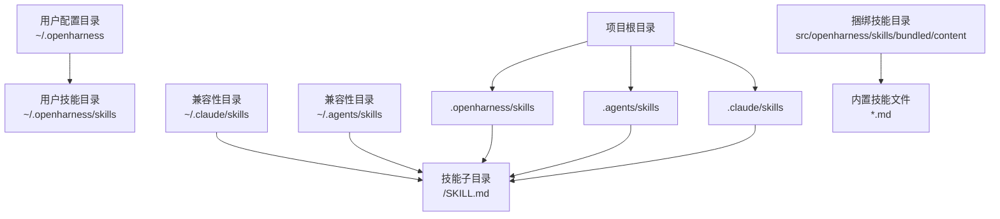
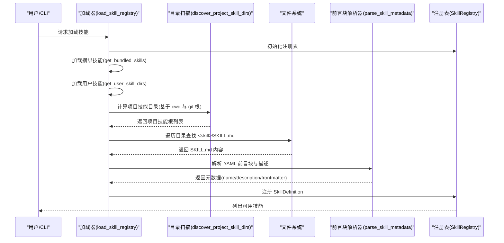
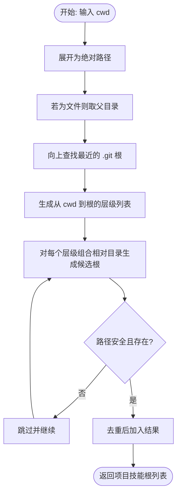
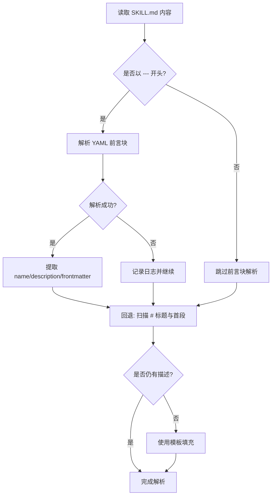
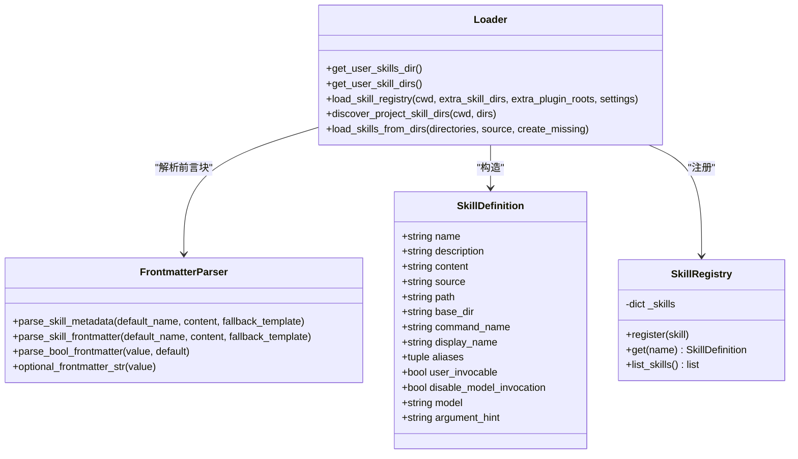
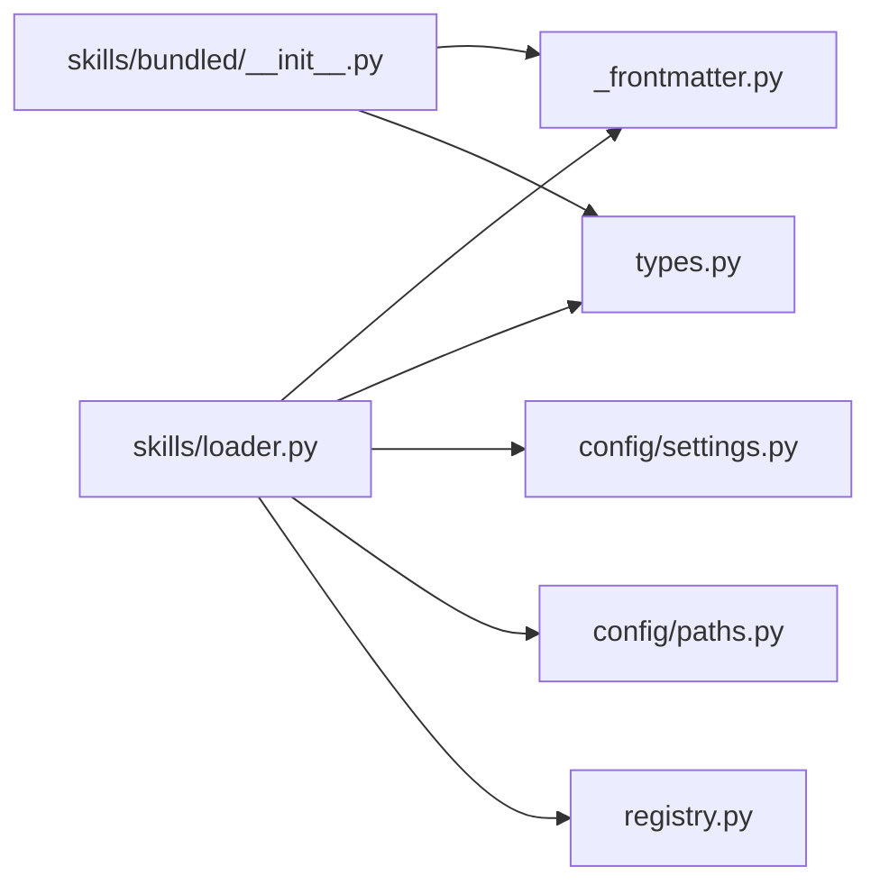

# Anthropic Skills 兼容性

<cite>
**本文档引用的文件**
- [src\openharness\skills\__init__.py](file://src/openharness/skills/__init__.py)
- [src\openharness\skills\loader.py](file://src/openharness/skills/loader.py)
- [src\openharness\skills\_frontmatter.py](file://src/openharness/skills/_frontmatter.py)
- [src\openharness\skills\types.py](file://src/openharness/skills/types.py)
- [src\openharness\skills\registry.py](file://src/openharness/skills/registry.py)
- [src\openharness\skills\bundled\__init__.py](file://src/openharness/skills/bundled/__init__.py)
- [src\openharness\config\settings.py](file://src/openharness/config/settings.py)
- [src\openharness\config\paths.py](file://src/openharness/config/paths.py)
- [tests\test_skills\test_loader.py](file://tests/test_skills/test_loader.py)
- [README.md](file://README.md)
- [.claude\skills\harness-eval\SKILL.md](file://.claude/skills/harness-eval/SKILL.md)
- [.claude\skills\pr-merge\SKILL.md](file://.claude/skills/pr-merge/SKILL.md)
- [src\openharness\skills\bundled\content\skill-creator.md](file://src/openharness/skills/bundled/content/skill-creator.md)
</cite>

## 目录
1. [简介](#简介)
2. [项目结构](#项目结构)
3. [核心组件](#核心组件)
4. [架构总览](#架构总览)
5. [详细组件分析](#详细组件分析)
6. [依赖关系分析](#依赖关系分析)
7. [性能考量](#性能考量)
8. [故障排查指南](#故障排查指南)
9. [结论](#结论)
10. [附录](#附录)

## 简介
本文件系统化阐述 OpenHarness 与 Anthropic 官方 Skills 项目的兼容性设计与实现，覆盖目录结构兼容性（.agents、.claude 目录支持）、文件格式兼容性（SKILL.md 前言块与正文解析）、兼容性迁移指南、兼容性层实现机制（目录扫描、文件解析、元数据转换），以及迁移示例、注意事项、测试与排错方法。目标是帮助用户将现有 Anthropic Skills 平滑移植到 OpenHarness 环境，并在新环境中稳定运行。

## 项目结构
OpenHarness 将“技能”作为可按需加载的知识单元，采用目录式组织与 Markdown 描述，兼容 Anthropic Skills 的 SKILL.md 格式。核心目录与文件布局如下：
- 用户级技能：~/.openharness/skills/<skill>/SKILL.md
- 兼容性目录：~/.claude/skills/<skill>/SKILL.md、~/.agents/skills/<skill>/SKILL.md
- 项目级技能：当前工作目录向上至 git 根目录扫描 .openharness/skills、.agents/skills、.claude/skills
- 捆绑技能：src/openharness/skills/bundled/content/*.md

**图表来源**
- [src\openharness\skills\loader.py:23-27](file://src/openharness/skills/loader.py#L23-L27)
- [src\openharness\config\paths.py:15-29](file://src/openharness/config/paths.py#L15-L29)
- [README.md:544-568](file://README.md#L544-L568)

**章节来源**
- [src\openharness\skills\loader.py:23-27](file://src/openharness/skills/loader.py#L23-L27)
- [src\openharness\config\paths.py:15-29](file://src/openharness/config/paths.py#L15-L29)
- [README.md:544-568](file://README.md#L544-L568)

## 核心组件
- 技能定义模型：SkillDefinition，承载名称、描述、内容、来源、路径、命令名、显示名、别名、用户可调用性、禁用模型调用、指定模型、参数提示等字段。
- 技能注册表：SkillRegistry，按名称/命令名/显示名/别名注册与查询技能，支持去重与排序。
- 技能加载器：统一从捆绑、用户、项目、插件等多源加载技能，支持兼容性目录扫描与安全路径校验。
- 前言块解析器：共享 YAML 解析逻辑，支持折叠块标量（>）、字面块标量（|）、引号值等，回退到标题+首段或模板。
- 设置与路径：Settings 提供 allow_project_skills、project_skill_dirs 等行为控制；paths 提供配置/数据目录解析。

**章节来源**
- [src\openharness\skills\types.py:8-25](file://src/openharness/skills/types.py#L8-L25)
- [src\openharness\skills\registry.py:8-30](file://src/openharness/skills/registry.py#L8-L30)
- [src\openharness\skills\loader.py:42-75](file://src/openharness/skills/loader.py#L42-L75)
- [src\openharness\skills\_frontmatter.py:34-82](file://src/openharness/skills/_frontmatter.py#L34-L82)
- [src\openharness\config\settings.py:559-562](file://src/openharness/config/settings.py#L559-L562)

## 架构总览
OpenHarness 的技能系统通过“加载器—解析器—注册表”的流水线实现 Anthropic Skills 兼容性：
- 加载器负责扫描多源目录，发现 <skill>/SKILL.md 文件；
- 解析器负责提取 YAML 前言块元数据与正文摘要；
- 注册表负责去重与索引，支持按名称/命令名/显示名/别名检索。

**图表来源**
- [src\openharness\skills\loader.py:42-75](file://src/openharness/skills/loader.py#L42-L75)
- [src\openharness\skills\loader.py:83-123](file://src/openharness/skills/loader.py#L83-L123)
- [src\openharness\skills\loader.py:153-206](file://src/openharness/skills/loader.py#L153-L206)
- [src\openharness\skills\_frontmatter.py:34-82](file://src/openharness/skills/_frontmatter.py#L34-L82)
- [src\openharness\skills\registry.py:14-18](file://src/openharness/skills/registry.py#L14-L18)

## 详细组件分析

### 目录扫描与项目技能发现
- 默认项目技能目录：.openharness/skills、.agents/skills、.claude/skills
- 从当前工作目录向上扫描至 git 根，确保“越近越优先”的覆盖顺序
- 安全路径校验：忽略绝对路径与包含 .. 的相对路径
- 可通过设置 allow_project_skills 与 project_skill_dirs 控制启用与扫描范围

**图表来源**
- [src\openharness\skills\loader.py:83-123](file://src/openharness/skills/loader.py#L83-L123)
- [src\openharness\skills\loader.py:126-138](file://src/openharness/skills/loader.py#L126-L138)
- [src\openharness\skills\loader.py:141-150](file://src/openharness/skills/loader.py#L141-L150)

**章节来源**
- [src\openharness\skills\loader.py:83-123](file://src/openharness/skills/loader.py#L83-L123)
- [src\openharness\skills\loader.py:126-138](file://src/openharness/skills/loader.py#L126-L138)
- [src\openharness\config\settings.py:559-562](file://src/openharness/config/settings.py#L559-L562)

### 文件解析与元数据转换
- 支持 YAML 前言块（--- 分隔）与多种块标量语法（>、|）
- 回退策略：无可用前言块时，解析 # 标题与首个非标题段落；仍无描述时使用模板
- 前言块键映射：user-invocable、disable-model-invocation、model、argument-hint 转换为布尔/字符串/None
- 捆绑技能与用户技能共享同一解析器，保证一致性

**图表来源**
- [src\openharness\skills\_frontmatter.py:34-82](file://src/openharness/skills/_frontmatter.py#L34-L82)
- [src\openharness\skills\loader.py:209-229](file://src/openharness/skills/loader.py#L209-L229)
- [src\openharness\skills\bundled\__init__.py:60-75](file://src/openharness/skills/bundled/__init__.py#L60-L75)

**章节来源**
- [src\openharness\skills\_frontmatter.py:34-82](file://src/openharness/skills/_frontmatter.py#L34-L82)
- [src\openharness\skills\loader.py:209-229](file://src/openharness/skills/loader.py#L209-L229)
- [src\openharness\skills\bundled\__init__.py:60-75](file://src/openharness/skills/bundled/__init__.py#L60-L75)

### 兼容性层实现机制
- 用户兼容目录：.claude/skills、.agents/skills 自动纳入用户技能搜索路径
- 用户技能目录：~/.openharness/skills 作为默认用户技能根
- 项目技能开关：allow_project_skills 控制是否启用项目级扫描
- 项目技能目录白名单：project_skill_dirs 支持自定义扫描目录
- 捆绑技能：src/openharness/skills/bundled/content/*.md 作为内置技能源

**图表来源**
- [src\openharness\skills\types.py:8-25](file://src/openharness/skills/types.py#L8-L25)
- [src\openharness\skills\registry.py:8-30](file://src/openharness/skills/registry.py#L8-L30)
- [src\openharness\skills\loader.py:30-75](file://src/openharness/skills/loader.py#L30-L75)
- [src\openharness\skills\_frontmatter.py:13-98](file://src/openharness/skills/_frontmatter.py#L13-L98)

**章节来源**
- [src\openharness\skills\__init__.py:21-44](file://src/openharness/skills/__init__.py#L21-L44)
- [src\openharness\skills\loader.py:23-27](file://src/openharness/skills/loader.py#L23-L27)
- [src\openharness\config\settings.py:559-562](file://src/openharness/config/settings.py#L559-L562)

### 迁移指南：从 Anthropic Skills 到 OpenHarness
- 目录结构迁移
  - 将原 .claude/skills 或 .agents/skills 下的 <skill>/SKILL.md 复制到 OpenHarness 用户目录：~/.openharness/skills/<skill>/SKILL.md
  - 若希望项目内共享，复制到项目根的 .claude/skills、.agents/skills 或 .openharness/skills 对应位置
- 前言块格式差异处理
  - OpenHarness 使用 YAML 前言块（--- 分隔），支持 > 与 | 块标量；若原 Skills 使用纯文本描述，请改写为 YAML 前言块
  - 关键字段映射：user-invocable、disable-model-invocation、model、argument-hint 在 OpenHarness 中生效
- 功能特性对应
  - user-invocable：控制技能是否可通过斜杠命令直接触发
  - disable-model-invocation：禁止模型自动调用该技能，仅允许用户手动触发
  - model：为该技能指定专用模型
  - argument-hint：为命令行参数提供提示
- 迁移步骤建议
  1) 备份原 Skills 目录
  2) 检查并标准化 SKILL.md 前言块为 YAML 格式
  3) 将目录迁移到 ~/.openharness/skills 或项目 .claude/.agents/.openharness/skills
  4) 启动 OpenHarness，使用 /skills 查看加载状态
  5) 编写最小化验证用例，确认触发与行为符合预期

**章节来源**
- [README.md:544-568](file://README.md#L544-L568)
- [src\openharness\skills\loader.py:209-229](file://src/openharness/skills/loader.py#L209-L229)
- [src\openharness\skills\_frontmatter.py:34-82](file://src/openharness/skills/_frontmatter.py#L34-L82)

### 迁移示例与注意事项
- 示例一：harness-eval 技能
  - 原始文件位于 .claude/skills/harness-eval/SKILL.md，包含完整的 YAML 前言块与正文
  - 迁移后可在 OpenHarness 中通过 /skills 列表查看并按需触发
- 示例二：pr-merge 技能
  - 原始文件位于 .claude/skills/pr-merge/SKILL.md，包含工作流与注意事项
  - 迁移后保持原有结构，OpenHarness 会正确解析前言块与描述
- 注意事项
  - 仅支持目录式 SKILL.md（<skill>/SKILL.md），不支持扁平 *.md 用户技能
  - 前言块中的布尔值接受 1/0、true/false、yes/no、on/off 等常见变体
  - 若前言块损坏，系统会回退到标题+首段解析，避免加载失败

**章节来源**
- [.claude\skills\harness-eval\SKILL.md:1-5](file://.claude/skills/harness-eval/SKILL.md#L1-L5)
- [.claude\skills\pr-merge\SKILL.md:1-5](file://.claude/skills/pr-merge/SKILL.md#L1-L5)
- [tests\test_skills\test_loader.py:198-302](file://tests/test_skills/test_loader.py#L198-L302)

## 依赖关系分析
- 加载器依赖前言块解析器与设置模块，确保路径解析与行为可控
- 注册表依赖技能定义模型，提供统一的查询接口
- 捆绑技能加载器复用用户侧解析器，保证一致的元数据语义

**图表来源**
- [src\openharness\skills\loader.py:9-19](file://src/openharness/skills/loader.py#L9-L19)
- [src\openharness\skills\bundled\__init__.py:7-13](file://src/openharness/skills/bundled/__init__.py#L7-L13)
- [src\openharness\config\settings.py:559-562](file://src/openharness/config/settings.py#L559-L562)
- [src\openharness\config\paths.py:15-29](file://src/openharness/config/paths.py#L15-L29)

**章节来源**
- [src\openharness\skills\loader.py:9-19](file://src/openharness/skills/loader.py#L9-L19)
- [src\openharness\skills\bundled\__init__.py:7-13](file://src/openharness/skills/bundled/__init__.py#L7-L13)

## 性能考量
- 目录扫描按层级自下而上进行，路径去重避免重复 I/O
- 前言块解析使用安全 YAML 解析，异常时快速回退，减少失败开销
- 注册表使用字典索引，查询为平均 O(1)，列表输出按来源与路径去重排序
- 项目技能默认启用，可通过设置关闭以降低扫描范围

## 故障排查指南
- 项目技能未加载
  - 检查 allow_project_skills 是否为 True
  - 确认 project_skill_dirs 包含所需相对路径，且不含 .. 或绝对路径
  - 验证当前目录是否在 git 根范围内
- 用户兼容目录未被识别
  - 确认 ~/.claude/skills 与 ~/.agents/skills 存在且包含 <skill>/SKILL.md
  - 使用 get_user_skill_dirs 验证路径是否包含上述目录
- 前言块解析失败
  - 检查 YAML 语法，避免不闭合的分隔符
  - 观察日志中关于 YAML 解析错误的记录
- 技能未出现在 /skills 列表
  - 确保目录结构为 <skill>/SKILL.md，而非扁平 *.md
  - 检查命令名与显示名是否冲突导致覆盖

**章节来源**
- [tests\test_skills\test_loader.py:132-141](file://tests/test_skills/test_loader.py#L132-L141)
- [tests\test_skills\test_loader.py:183-193](file://tests/test_skills/test_loader.py#L183-L193)
- [tests\test_skills\test_loader.py:53-67](file://tests/test_skills/test_loader.py#L53-L67)
- [src\openharness\skills\loader.py:126-138](file://src/openharness/skills/loader.py#L126-L138)
- [src\openharness\skills\_frontmatter.py:66-67](file://src/openharness/skills/_frontmatter.py#L66-L67)

## 结论
OpenHarness 通过统一的目录扫描、健壮的前言块解析与可配置的行为控制，实现了对 Anthropic Skills 的高兼容性。迁移过程主要涉及目录结构标准化与前言块 YAML 化，配合用户/项目/兼容性多源加载机制，即可在 OpenHarness 中无缝复用既有技能资产。

## 附录
- 测试参考
  - 单元测试覆盖了用户兼容目录、项目技能发现、前言块解析回退、布尔值解析等关键场景
- 最佳实践
  - 使用 YAML 前言块明确 user-invocable、disable-model-invocation、model、argument-hint
  - 将长文档拆分至 references/，保持 SKILL.md 精炼
  - 通过 /skills 与 dry-run 预览技能加载与触发效果

**章节来源**
- [tests\test_skills\test_loader.py:1-377](file://tests/test_skills/test_loader.py#L1-L377)
- [src\openharness\skills\bundled\content\skill-creator.md:37-73](file://src/openharness/skills/bundled/content/skill-creator.md#L37-L73)