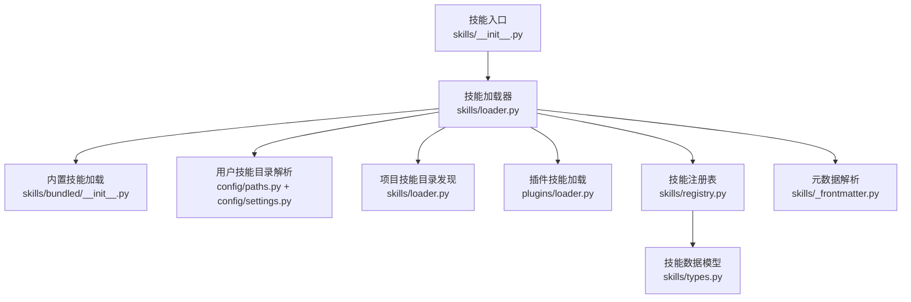
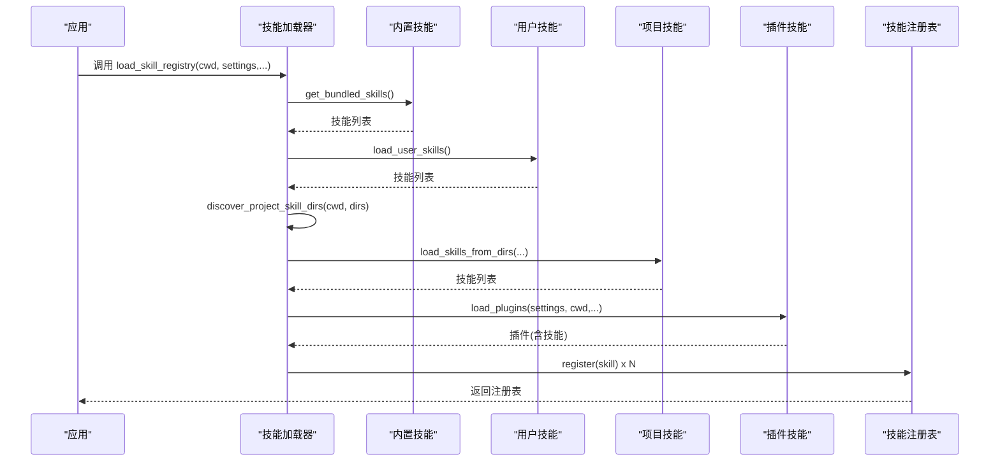
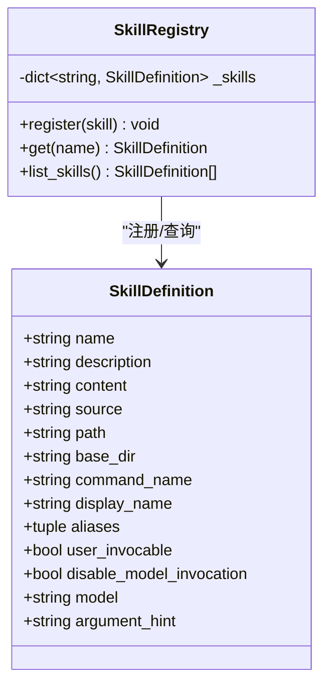
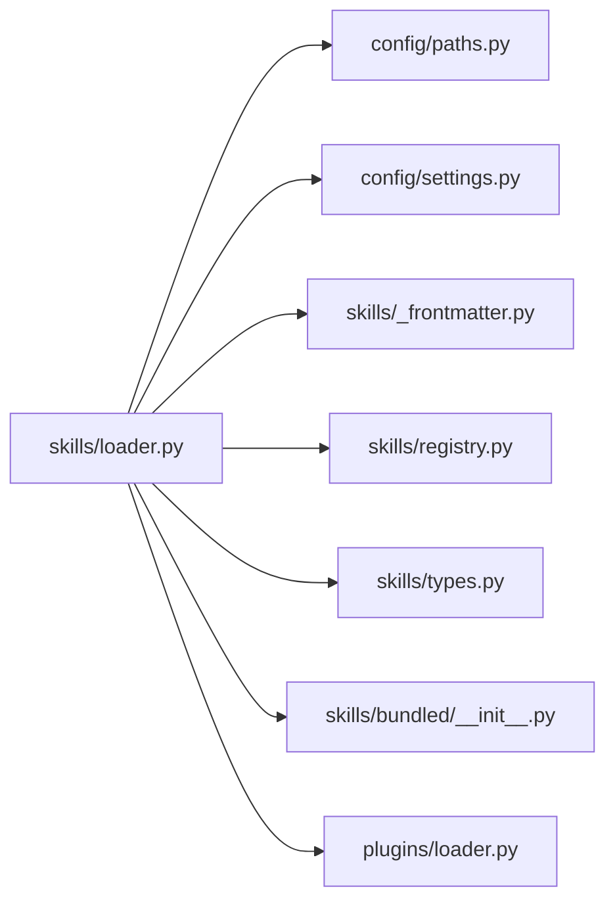
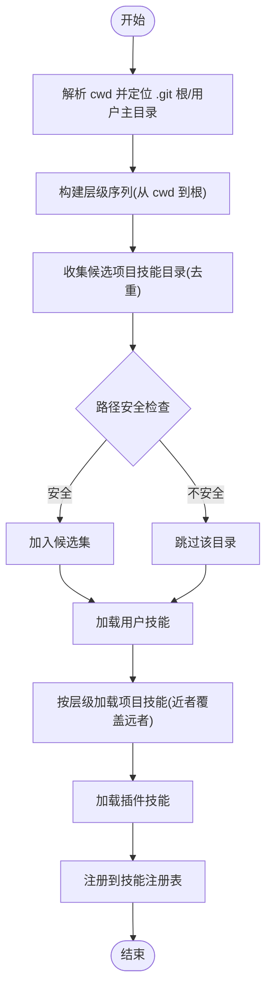

# 技能加载与发现机制

<cite>
**本文档引用的文件**
- [src\openharness\skills\__init__.py](file://src\openharness\skills\__init__.py)
- [src\openharness\skills\loader.py](file://src\openharness\skills\loader.py)
- [src\openharness\skills\registry.py](file://src\openharness\skills\registry.py)
- [src\openharness\skills\types.py](file://src\openharness\skills\types.py)
- [src\openharness\skills\bundled\__init__.py](file://src\openharness\skills\bundled\__init__.py)
- [src\openharness\skills\_frontmatter.py](file://src\openharness\skills\_frontmatter.py)
- [src\openharness\config\settings.py](file://src\openharness\config\settings.py)
- [src\openharness\config\paths.py](file://src\openharness\config\paths.py)
- [src\openharness\plugins\loader.py](file://src\openharness\plugins\loader.py)
- [tests\test_skills\test_loader.py](file://tests\test_skills\test_loader.py)
- [.claude\skills\harness-eval\SKILL.md](file://.claude\skills\harness-eval\SKILL.md)
- [.claude\skills\pr-merge\SKILL.md](file://.claude\skills\pr-merge\SKILL.md)
</cite>

## 目录
1. [简介](#简介)
2. [项目结构](#项目结构)
3. [核心组件](#核心组件)
4. [架构总览](#架构总览)
5. [详细组件分析](#详细组件分析)
6. [依赖关系分析](#依赖关系分析)
7. [性能考量](#性能考量)
8. [故障排查指南](#故障排查指南)
9. [结论](#结论)
10. [附录](#附录)

## 简介
本文件系统性阐述 OpenHarness 的“技能加载与发现机制”。内容涵盖：
- 技能发现算法：从用户目录、项目目录、插件目录自动发现技能
- 技能目录结构要求：每个技能一个独立目录，包含 SKILL.md 文件
- 目录遍历与优先级排序：按层级从上到下、从宽泛到具体，确保后注册覆盖更具体的技能
- 加载层次与覆盖规则：内置技能、用户技能、项目技能、插件技能的加载顺序与覆盖策略
- 关键技术实现：路径解析、安全检查、重复检测、元数据解析
- 配置选项与自定义技能目录方法

## 项目结构
围绕技能加载的关键模块与文件如下图所示：

**图表来源**
- [src\openharness\skills\__init__.py:1-45](file://src\openharness\skills\__init__.py#L1-L45)
- [src\openharness\skills\loader.py:1-230](file://src\openharness\skills\loader.py#L1-L230)
- [src\openharness\skills\bundled\__init__.py:1-76](file://src\openharness\skills\bundled\__init__.py#L1-L76)
- [src\openharness\config\paths.py:1-161](file://src\openharness\config\paths.py#L1-L161)
- [src\openharness\config\settings.py:534-580](file://src\openharness\config\settings.py#L534-L580)
- [src\openharness\plugins\loader.py:1-731](file://src\openharness\plugins\loader.py#L1-L731)
- [src\openharness\skills\registry.py:1-30](file://src\openharness\skills\registry.py#L1-L30)
- [src\openharness\skills\_frontmatter.py:1-98](file://src\openharness\skills\_frontmatter.py#L1-L98)
- [src\openharness\skills\types.py:1-25](file://src\openharness\skills\types.py#L1-L25)

**章节来源**
- [src\openharness\skills\__init__.py:1-45](file://src\openharness\skills\__init__.py#L1-L45)
- [src\openharness\skills\loader.py:1-230](file://src\openharness\skills\loader.py#L1-L230)
- [src\openharness\config\paths.py:1-161](file://src\openharness\config\paths.py#L1-L161)
- [src\openharness\config\settings.py:534-580](file://src\openharness\config\settings.py#L534-L580)

## 核心组件
- 技能加载器：负责从多源目录加载技能，解析元数据，构建技能注册表
- 内置技能：打包在框架内的技能集合，无需用户安装
- 用户技能：位于用户配置目录或兼容目录下的技能
- 项目技能：位于工作区根目录向上遍历的若干标准目录中的技能
- 插件技能：由插件提供的技能，随插件加载而加入
- 注册表：统一存储与查询技能，支持名称、命令名、显示名与别名索引
- 元数据解析：统一处理 YAML 前言块与回退逻辑，提取 name/description 等字段

**章节来源**
- [src\openharness\skills\loader.py:42-75](file://src\openharness\skills\loader.py#L42-L75)
- [src\openharness\skills\bundled\__init__.py:18-43](file://src\openharness\skills\bundled\__init__.py#L18-L43)
- [src\openharness\skills\registry.py:8-29](file://src\openharness\skills\registry.py#L8-L29)
- [src\openharness\skills\_frontmatter.py:34-82](file://src\openharness\skills\_frontmatter.py#L34-L82)

## 架构总览
技能加载的总体流程如下：

**图表来源**
- [src\openharness\skills\loader.py:42-75](file://src\openharness\skills\loader.py#L42-L75)
- [src\openharness\skills\bundled\__init__.py:18-43](file://src\openharness\skills\bundled\__init__.py#L18-L43)
- [src\openharness\plugins\loader.py:107-123](file://src\openharness\plugins\loader.py#L107-L123)

## 详细组件分析

### 技能发现与加载算法
- 用户技能
  - 默认用户技能目录：配置目录下的 skills 子目录
  - 兼容目录：用户主目录下的 .claude/skills 与 .agents/skills
  - 解析策略：遍历目录，每个子目录包含 SKILL.md 即视为有效技能
- 项目技能
  - 从当前工作目录向上遍历至 Git 根或用户主目录
  - 支持的相对目录列表可配置，默认包含 .openharness/skills、.agents/skills、.claude/skills
  - 安全过滤：忽略绝对路径与包含 .. 的路径
  - 优先级：越靠近当前工作目录的技能优先级越高，后注册覆盖先注册
- 插件技能
  - 插件目录通过插件加载器发现，插件 manifest 指定技能目录
  - 插件技能同样遵循 SKILL.md 规范，且 source 标记为 plugin
- 内置技能
  - 从 bundled/content 下的 .md 文件加载，source 标记为 bundled

关键实现要点：
- 路径解析：统一使用 expanduser + resolve，确保跨平台一致性
- 安全检查：仅接受相对且不包含 .. 的项目技能目录
- 重复检测：同一路径只解析一次，避免重复注册
- 元数据解析：统一使用 YAML 前言块解析，支持折叠/字面量块标量等复杂 YAML 结构

**章节来源**
- [src\openharness\skills\loader.py:30-34](file://src\openharness\skills\loader.py#L30-L34)
- [src\openharness\skills\loader.py:37-39](file://src\openharness\skills\loader.py#L37-L39)
- [src\openharness\skills\loader.py:83-123](file://src\openharness\skills\loader.py#L83-L123)
- [src\openharness\skills\loader.py:126-138](file://src\openharness\skills\loader.py#L126-L138)
- [src\openharness\skills\loader.py:141-151](file://src\openharness\skills\loader.py#L141-L151)
- [src\openharness\skills\loader.py:153-206](file://src\openharness\skills\loader.py#L153-L206)
- [src\openharness\skills\loader.py:209-229](file://src\openharness\skills\loader.py#L209-L229)
- [src\openharness\skills\bundled\__init__.py:18-43](file://src\openharness\skills\bundled\__init__.py#L18-L43)
- [src\openharness\plugins\loader.py:251-307](file://src\openharness\plugins\loader.py#L251-L307)

### 目录结构与元数据规范
- 目录结构
  - 每个技能位于独立子目录，目录名即默认命令名
  - 目录内必须包含 SKILL.md 文件
- 元数据规范
  - 使用 YAML 前言块（三横线分隔）定义 name、description 等
  - 若无前言块，回退到首行标题作为 name，第一个非空段落作为 description
  - 支持布尔字段 user-invocable、disable-model-invocation，字符串字段 model、argument-hint
  - 内置与用户技能共享同一解析逻辑，确保一致性

示例参考：
- [harness-eval SKILL.md:1-194](file://.claude\skills\harness-eval\SKILL.md#L1-L194)
- [pr-merge SKILL.md:1-100](file://.claude\skills\pr-merge\SKILL.md#L1-L100)

**章节来源**
- [src\openharness\skills\loader.py:153-206](file://src\openharness\skills\loader.py#L153-L206)
- [src\openharness\skills\_frontmatter.py:34-82](file://src\openharness\skills\_frontmatter.py#L34-L82)
- [src\openharness\skills\bundled\__init__.py:46-57](file://src\openharness\skills\bundled\__init__.py#L46-L57)

### 加载层次与覆盖规则
- 层次顺序（加载时序）
  1) 内置技能（bundled）
  2) 用户技能（user）
  3) 自定义用户技能目录（user）
  4) 项目技能（project）
  5) 插件技能（plugin）
- 覆盖规则
  - 后注册覆盖先注册；项目技能按目录层级从宽泛到具体，因此更具体的项目技能覆盖更通用的技能
  - 注册表以技能 name、command_name、display_name 及 aliases 为键，后者会覆盖前者
- 验证与测试
  - 测试覆盖了项目技能就近覆盖用户技能的行为，以及禁用项目技能开关

**章节来源**
- [src\openharness\skills\loader.py:42-75](file://src\openharness\skills\loader.py#L42-L75)
- [src\openharness\skills\registry.py:14-18](file://src\openharness\skills\registry.py#L14-L18)
- [tests\test_skills\test_loader.py:164-181](file://tests\test_skills\test_loader.py#L164-L181)

### 路径解析与安全检查
- 路径解析
  - 统一使用 expanduser + resolve，确保跨平台一致
  - 用户技能目录在不存在时自动创建
- 安全检查
  - 项目技能目录必须为相对路径且不包含 ..，否则记录警告并忽略
  - 插件发现受设置控制，未启用时会给出警告
- 重复检测
  - 使用集合记录已见路径，避免重复解析同一路径

**章节来源**
- [src\openharness\skills\loader.py:153-206](file://src\openharness\skills\loader.py#L153-L206)
- [src\openharness\skills\loader.py:126-138](file://src\openharness\skills\loader.py#L126-L138)
- [src\openharness\plugins\loader.py:107-117](file://src\openharness\plugins\loader.py#L107-L117)

### 配置选项与自定义技能目录
- 设置项
  - allow_project_skills：是否允许加载项目技能，默认开启
  - project_skill_dirs：项目技能目录列表，默认包含 .openharness/skills、.agents/skills、.claude/skills
- 用户自定义
  - 可通过 extra_skill_dirs 参数向 load_skill_registry 传入额外用户技能目录
  - 可通过 extra_plugin_roots 参数向插件加载传入额外插件根目录
- 路径解析
  - 用户配置目录可通过环境变量 OPENHARNESS_CONFIG_DIR 指定

**章节来源**
- [src\openharness\config\settings.py:558-562](file://src\openharness\config\settings.py#L558-L562)
- [src\openharness\config\paths.py:15-29](file://src\openharness\config\paths.py#L15-L29)
- [src\openharness\skills\loader.py:42-47](file://src\openharness\skills\loader.py#L42-L47)

### 类型与注册表
- 数据模型
  - SkillDefinition：包含 name、description、content、source、path、base_dir、command_name、display_name、aliases、user_invocable、disable_model_invocation、model、argument_hint 等字段
- 注册表
  - 以多种键索引技能，支持按名称、命令名、显示名与别名检索
  - 列表化输出时去重并按命令名或名称排序

**图表来源**
- [src\openharness\skills\types.py:8-25](file://src\openharness\skills\types.py#L8-L25)
- [src\openharness\skills\registry.py:8-29](file://src\openharness\skills\registry.py#L8-L29)

**章节来源**
- [src\openharness\skills\types.py:1-25](file://src\openharness\skills\types.py#L1-L25)
- [src\openharness\skills\registry.py:1-30](file://src\openharness\skills\registry.py#L1-L30)

## 依赖关系分析
- 模块耦合
  - skills/loader 依赖 config/paths 与 config/settings 获取用户目录与设置
  - plugins/loader 与 skills/loader 共享 _parse_skill_metadata 用于插件技能元数据解析
  - skills/registry 仅依赖 types，保持低耦合
- 外部依赖
  - YAML 解析依赖 PyYAML
  - 路径解析依赖 pathlib

**图表来源**
- [src\openharness\skills\loader.py:9-19](file://src\openharness\skills\loader.py#L9-L19)
- [src\openharness\plugins\loader.py:30-31](file://src\openharness\plugins\loader.py#L30-L31)

**章节来源**
- [src\openharness\skills\loader.py:1-230](file://src\openharness\skills\loader.py#L1-L230)
- [src\openharness\plugins\loader.py:1-731](file://src\openharness\plugins\loader.py#L1-L731)

## 性能考量
- 目录遍历
  - 采用迭代器逐层向上遍历，时间复杂度 O(D)（D 为层级数）
  - 对候选目录进行去重与存在性检查，避免无效 IO
- 元数据解析
  - 使用 YAML 安全加载，复杂度与内容大小线性相关
  - 回退逻辑仅在无前言块时触发，通常开销较小
- 注册与查询
  - 注册表使用字典索引，查询为平均 O(1)
  - 列表化输出时进行去重与排序，复杂度 O(N log N)

[本节为通用性能讨论，无需特定文件引用]

## 故障排查指南
- 项目技能未生效
  - 检查 allow_project_skills 是否为真
  - 确认项目技能目录位于 .git 根或用户主目录范围内
  - 排查 project_skill_dirs 是否包含所需相对路径
- 技能未被识别
  - 确保每个技能目录包含 SKILL.md
  - 检查 YAML 前言块语法是否正确
- 权限与安全告警
  - 出现“忽略不安全项目技能目录”警告时，检查路径是否为相对且不含 ..
- 插件技能未出现
  - 确认插件 manifest 中的 skills_dir 正确
  - 检查插件 enabled 字段与设置中的 enabled_plugins 映射

**章节来源**
- [src\openharness\skills\loader.py:126-138](file://src\openharness\skills\loader.py#L126-L138)
- [src\openharness\plugins\loader.py:107-117](file://src\openharness\plugins\loader.py#L107-L117)
- [tests\test_skills\test_loader.py:183-193](file://tests\test_skills\test_loader.py#L183-L193)

## 结论
OpenHarness 的技能加载机制通过清晰的层次划分与严格的路径安全策略，实现了从内置、用户、项目到插件的多源技能聚合。统一的元数据解析与注册表设计保证了技能检索的一致性与高效性。通过配置项与参数扩展，用户可以灵活定制技能目录与覆盖行为。

[本节为总结性内容，无需特定文件引用]

## 附录

### 目录遍历与优先级流程图

**图表来源**
- [src\openharness\skills\loader.py:83-123](file://src\openharness\skills\loader.py#L83-L123)
- [src\openharness\skills\loader.py:126-138](file://src\openharness\skills\loader.py#L126-L138)
- [src\openharness\skills\loader.py:153-206](file://src\openharness\skills\loader.py#L153-L206)