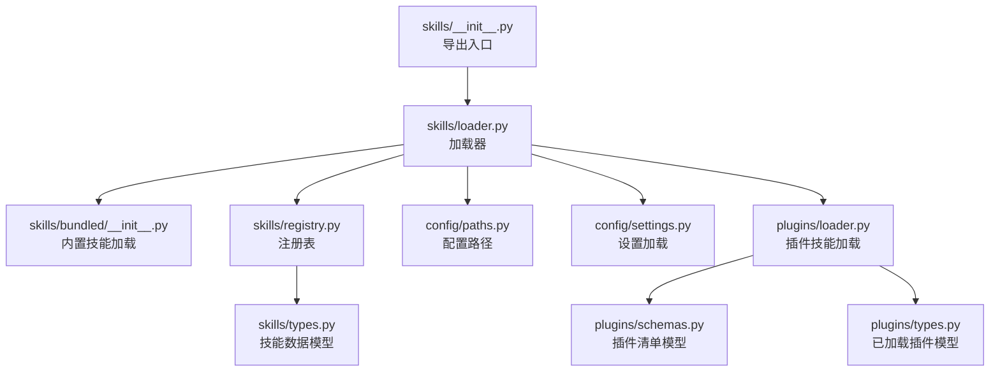
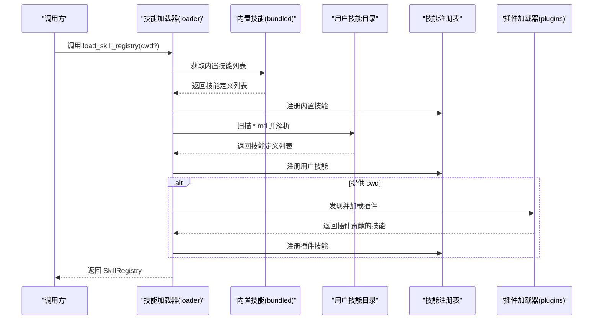
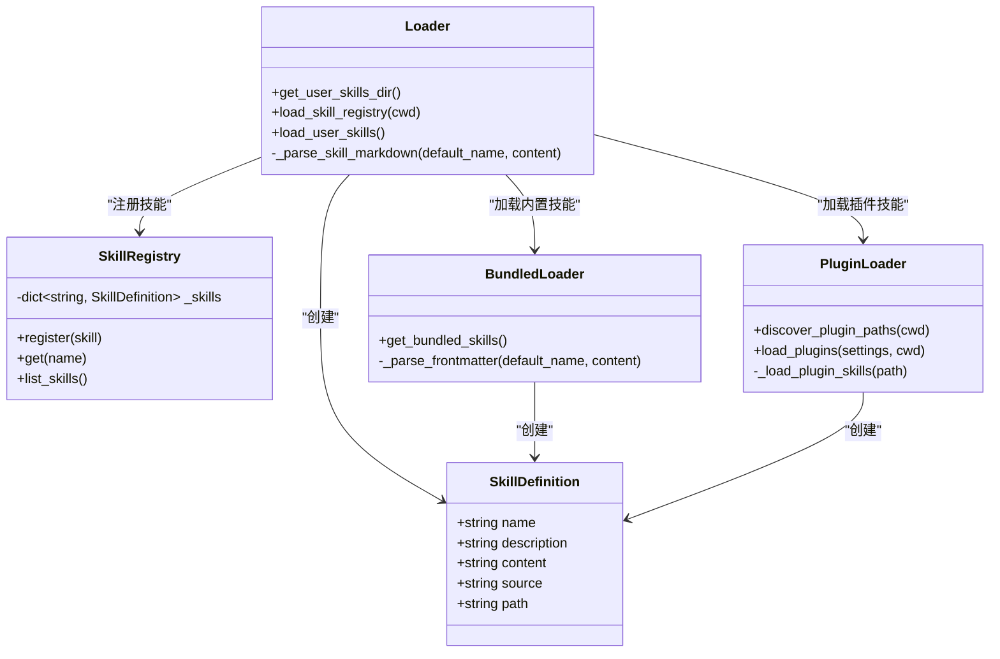
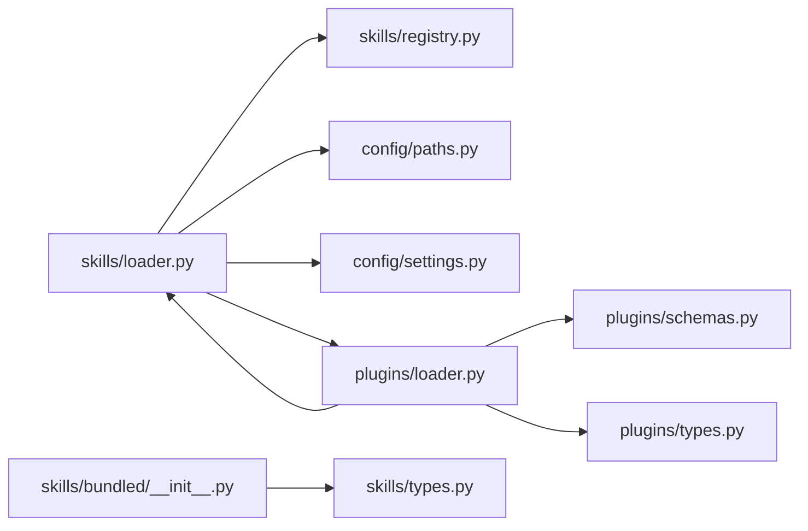
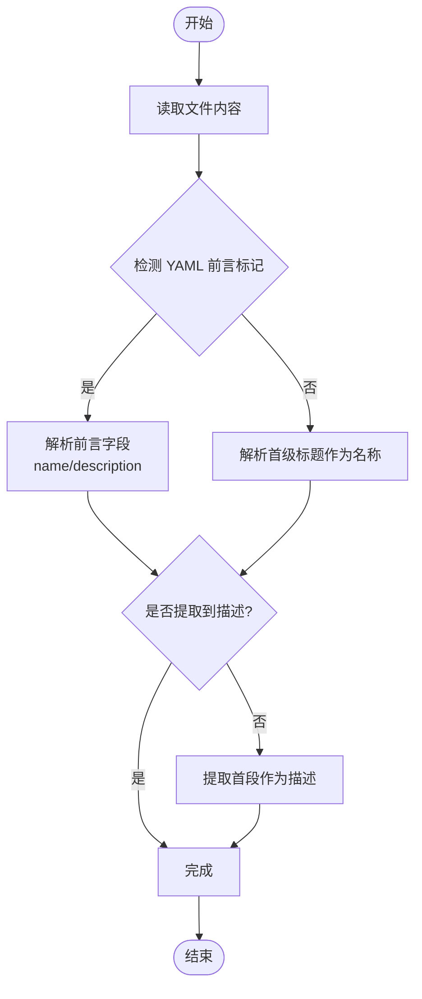

# 技能加载机制

<cite>
**本文引用的文件**
- [src/openharness/skills/__init__.py](file://src/openharness/skills/__init__.py)
- [src/openharness/skills/loader.py](file://src/openharness/skills/loader.py)
- [src/openharness/skills/registry.py](file://src/openharness/skills/registry.py)
- [src/openharness/skills/types.py](file://src/openharness/skills/types.py)
- [src/openharness/skills/bundled/__init__.py](file://src/openharness/skills/bundled/__init__.py)
- [src/openharness/skills/bundled/content/commit.md](file://src/openharness/skills/bundled/content/commit.md)
- [src/openharness/skills/bundled/content/debug.md](file://src/openharness/skills/bundled/content/debug.md)
- [src/openharness/plugins/loader.py](file://src/openharness/plugins/loader.py)
- [src/openharness/plugins/schemas.py](file://src/openharness/plugins/schemas.py)
- [src/openharness/plugins/types.py](file://src/openharness/plugins/types.py)
- [src/openharness/config/paths.py](file://src/openharness/config/paths.py)
- [src/openharness/config/settings.py](file://src/openharness/config/settings.py)
- [tests/test_skills/test_loader.py](file://tests/test_skills/test_loader.py)
</cite>

## 目录
1. [简介](#简介)
2. [项目结构](#项目结构)
3. [核心组件](#核心组件)
4. [架构总览](#架构总览)
5. [详细组件分析](#详细组件分析)
6. [依赖分析](#依赖分析)
7. [性能考虑](#性能考虑)
8. [故障排查指南](#故障排查指南)
9. [结论](#结论)
10. [附录](#附录)

## 简介
本操作文档聚焦于 OpenHarness 的“技能加载机制”，系统性阐述从内置技能到用户自定义技能与插件贡献技能的完整加载、解析与注册流程。重点覆盖以下主题：
- 用户技能目录的定位与组织结构（get_user_skills_dir）
- 技能注册表的构建与优先级合并（load_skill_registry）
- 技能文件的解析策略（YAML 前言与 Markdown 格式）
- 错误处理与调试方法
- 最佳实践与性能优化建议

## 项目结构
技能加载相关代码主要分布在以下模块：
- 技能导出与入口：skills/__init__.py
- 技能加载器：skills/loader.py
- 内置技能加载：skills/bundled/__init__.py
- 技能注册表：skills/registry.py
- 技能数据模型：skills/types.py
- 插件系统（含插件技能发现与加载）：plugins/loader.py
- 配置路径与设置：config/paths.py、config/settings.py
- 测试用例：tests/test_skills/test_loader.py

图表来源
- [src/openharness/skills/__init__.py:1-31](file://src/openharness/skills/__init__.py#L1-L31)
- [src/openharness/skills/loader.py:1-97](file://src/openharness/skills/loader.py#L1-L97)
- [src/openharness/skills/bundled/__init__.py:1-45](file://src/openharness/skills/bundled/__init__.py#L1-L45)
- [src/openharness/skills/registry.py:1-25](file://src/openharness/skills/registry.py#L1-L25)
- [src/openharness/skills/types.py:1-17](file://src/openharness/skills/types.py#L1-L17)
- [src/openharness/plugins/loader.py:1-195](file://src/openharness/plugins/loader.py#L1-L195)
- [src/openharness/plugins/schemas.py:1-24](file://src/openharness/plugins/schemas.py#L1-L24)
- [src/openharness/plugins/types.py:1-33](file://src/openharness/plugins/types.py#L1-L33)
- [src/openharness/config/paths.py:1-117](file://src/openharness/config/paths.py#L1-L117)
- [src/openharness/config/settings.py:1-161](file://src/openharness/config/settings.py#L1-L161)

章节来源
- [src/openharness/skills/__init__.py:1-31](file://src/openharness/skills/__init__.py#L1-L31)
- [src/openharness/skills/loader.py:1-97](file://src/openharness/skills/loader.py#L1-L97)
- [src/openharness/skills/bundled/__init__.py:1-45](file://src/openharness/skills/bundled/__init__.py#L1-L45)
- [src/openharness/skills/registry.py:1-25](file://src/openharness/skills/registry.py#L1-L25)
- [src/openharness/skills/types.py:1-17](file://src/openharness/skills/types.py#L1-L17)
- [src/openharness/plugins/loader.py:1-195](file://src/openharness/plugins/loader.py#L1-L195)
- [src/openharness/plugins/schemas.py:1-24](file://src/openharness/plugins/schemas.py#L1-L24)
- [src/openharness/plugins/types.py:1-33](file://src/openharness/plugins/types.py#L1-L33)
- [src/openharness/config/paths.py:1-117](file://src/openharness/config/paths.py#L1-L117)
- [src/openharness/config/settings.py:1-161](file://src/openharness/config/settings.py#L1-L161)

## 核心组件
- 技能定义模型（SkillDefinition）：封装技能名称、描述、内容、来源与路径等信息。
- 注册表（SkillRegistry）：以名称为键存储技能，提供注册、查询与列表化能力。
- 加载器（loader）：负责内置、用户与插件三类技能的发现、解析与注册。
- 内置技能加载（bundled）：从内置内容目录读取 Markdown 文件并解析。
- 插件系统：支持从插件目录发现并加载技能，统一走相同的解析流程。

章节来源
- [src/openharness/skills/types.py:8-17](file://src/openharness/skills/types.py#L8-L17)
- [src/openharness/skills/registry.py:8-25](file://src/openharness/skills/registry.py#L8-L25)
- [src/openharness/skills/loader.py:21-37](file://src/openharness/skills/loader.py#L21-L37)
- [src/openharness/skills/bundled/__init__.py:12-29](file://src/openharness/skills/bundled/__init__.py#L12-L29)
- [src/openharness/plugins/loader.py:53-106](file://src/openharness/plugins/loader.py#L53-L106)

## 架构总览
下图展示技能加载的总体流程：从配置路径解析用户技能目录，依次加载内置技能、用户技能，再根据上下文加载插件贡献的技能，最终汇总到注册表中。

图表来源
- [src/openharness/skills/loader.py:21-37](file://src/openharness/skills/loader.py#L21-L37)
- [src/openharness/skills/bundled/__init__.py:12-29](file://src/openharness/skills/bundled/__init__.py#L12-L29)
- [src/openharness/plugins/loader.py:53-106](file://src/openharness/plugins/loader.py#L53-L106)
- [src/openharness/skills/registry.py:14-24](file://src/openharness/skills/registry.py#L14-L24)

## 详细组件分析

### get_user_skills_dir()：用户技能目录定位与组织
- 功能职责
  - 基于配置目录（通过环境变量或默认路径）确定用户技能根目录，并确保其存在。
  - 返回 Path 对象，供上层扫描 *.md 文件使用。
- 目录结构建议
  - 每个技能对应一个独立的 Markdown 文件（例如 deploy.md），文件名作为默认技能名。
  - 建议在文件内使用 YAML 前言（可选）或首级标题与首段描述，便于自动提取名称与描述。
- 参考实现位置
  - [get_user_skills_dir 定义:14-18](file://src/openharness/skills/loader.py#L14-L18)
  - [配置路径解析（XDG 类约定）:15-29](file://src/openharness/config/paths.py#L15-L29)

章节来源
- [src/openharness/skills/loader.py:14-18](file://src/openharness/skills/loader.py#L14-L18)
- [src/openharness/config/paths.py:15-29](file://src/openharness/config/paths.py#L15-L29)

### load_skill_registry()：技能注册与优先级合并
- 加载顺序
  - 先加载内置技能（来自 bundled/content 目录）。
  - 再加载用户技能（来自用户技能目录）。
  - 若提供 cwd，则加载插件贡献的技能（按插件启用状态过滤）。
- 合并与覆盖
  - 注册表以技能名称为键进行存储；后加载的同名技能会覆盖先前注册项。
  - 因此，用户技能与插件技能可覆盖内置技能。
- 关联逻辑
  - 使用设置加载（settings）与插件加载（plugins.loader）来决定插件是否启用及贡献哪些技能。
- 参考实现位置
  - [load_skill_registry 主流程:21-37](file://src/openharness/skills/loader.py#L21-L37)
  - [设置加载（settings）:123-141](file://src/openharness/config/settings.py#L123-L141)
  - [插件加载（plugins.loader）:53-106](file://src/openharness/plugins/loader.py#L53-106)

章节来源
- [src/openharness/skills/loader.py:21-37](file://src/openharness/skills/loader.py#L21-L37)
- [src/openharness/config/settings.py:123-141](file://src/openharness/config/settings.py#L123-L141)
- [src/openharness/plugins/loader.py:53-106](file://src/openharness/plugins/loader.py#L53-L106)

### 技能文件解析：YAML 前言与 Markdown 格式
- 解析函数
  - 内置技能解析：_parse_frontmatter（仅解析首级标题与首段）
  - 用户与插件技能解析：_parse_skill_markdown（支持 YAML 前言与回退策略）
- 解析策略
  - YAML 前言（三短划线分隔）：优先提取 name 与 description 字段。
  - 回退策略：若未提供 description，则从首段文本截取；若仍无，则生成默认描述。
  - 名称回退：若前言未提供 name 或为空，则使用文件名作为默认名称。
- 参考实现位置
  - [内置技能解析 _parse_frontmatter:32-44](file://src/openharness/skills/bundled/__init__.py#L32-L44)
  - [用户/插件技能解析 _parse_skill_markdown:58-96](file://src/openharness/skills/loader.py#L58-L96)
  - [插件技能解析（复用 _parse_skill_markdown）:109-125](file://src/openharness/plugins/loader.py#L109-L125)

章节来源
- [src/openharness/skills/bundled/__init__.py:32-44](file://src/openharness/skills/bundled/__init__.py#L32-L44)
- [src/openharness/skills/loader.py:58-96](file://src/openharness/skills/loader.py#L58-L96)
- [src/openharness/plugins/loader.py:109-125](file://src/openharness/plugins/loader.py#L109-L125)

### 技能注册表：存储与检索
- 数据结构
  - 以技能名称为键，SkillDefinition 为值的字典。
- 能力
  - register：注册单个技能。
  - get：按名称检索技能。
  - list_skills：返回按名称排序的技能列表。
- 参考实现位置
  - [SkillRegistry 类:8-25](file://src/openharness/skills/registry.py#L8-L25)

章节来源
- [src/openharness/skills/registry.py:8-25](file://src/openharness/skills/registry.py#L8-L25)

### 内置技能：bundled 目录与内容
- 目录结构
  - bundled/content 下存放若干 Markdown 文件，每个文件代表一个内置技能。
- 加载流程
  - 遍历 *.md 文件，读取内容并解析名称与描述，构造 SkillDefinition 并标记 source 为 bundled。
- 示例文件
  - commit.md、debug.md 等。
- 参考实现位置
  - [get_bundled_skills:12-29](file://src/openharness/skills/bundled/__init__.py#L12-L29)
  - [示例：commit.md:1-26](file://src/openharness/skills/bundled/content/commit.md#L1-L26)
  - [示例：debug.md:1-26](file://src/openharness/skills/bundled/content/debug.md#L1-L26)

章节来源
- [src/openharness/skills/bundled/__init__.py:12-29](file://src/openharness/skills/bundled/__init__.py#L12-L29)
- [src/openharness/skills/bundled/content/commit.md:1-26](file://src/openharness/skills/bundled/content/commit.md#L1-L26)
- [src/openharness/skills/bundled/content/debug.md:1-26](file://src/openharness/skills/bundled/content/debug.md#L1-L26)

### 插件技能：发现与加载
- 插件目录
  - 用户插件目录：~/.openharness/plugins/
  - 项目插件目录：工作目录/.openharness/plugins/
- 清单与技能目录
  - 插件清单（plugin.json 或 .claude-plugin/plugin.json）决定技能目录、钩子与 MCP 配置等。
  - 默认技能目录由清单字段 skills_dir 指定（默认为 skills）。
- 加载流程
  - 发现插件目录 → 读取清单 → 判断启用状态 → 从指定目录加载 *.md 技能 → 解析并注册。
- 参考实现位置
  - [插件发现与加载主流程:40-106](file://src/openharness/plugins/loader.py#L40-L106)
  - [插件清单模型（PluginManifest）:8-24](file://src/openharness/plugins/schemas.py#L8-L24)
  - [已加载插件模型（LoadedPlugin）:14-33](file://src/openharness/plugins/types.py#L14-L33)

章节来源
- [src/openharness/plugins/loader.py:40-106](file://src/openharness/plugins/loader.py#L40-L106)
- [src/openharness/plugins/schemas.py:8-24](file://src/openharness/plugins/schemas.py#L8-L24)
- [src/openharness/plugins/types.py:14-33](file://src/openharness/plugins/types.py#L14-L33)

### 类关系图

图表来源
- [src/openharness/skills/types.py:8-17](file://src/openharness/skills/types.py#L8-L17)
- [src/openharness/skills/registry.py:8-25](file://src/openharness/skills/registry.py#L8-L25)
- [src/openharness/skills/loader.py:14-96](file://src/openharness/skills/loader.py#L14-L96)
- [src/openharness/skills/bundled/__init__.py:12-44](file://src/openharness/skills/bundled/__init__.py#L12-L44)
- [src/openharness/plugins/loader.py:40-125](file://src/openharness/plugins/loader.py#L40-L125)

## 依赖分析
- 组件耦合
  - loader 依赖 bundled、registry、paths、settings、plugins/loader。
  - bundled 依赖 types。
  - plugins/loader 依赖 schemas、types、loader 中的 _parse_skill_markdown。
- 依赖关系可视化

图表来源
- [src/openharness/skills/loader.py:1-12](file://src/openharness/skills/loader.py#L1-L12)
- [src/openharness/skills/bundled/__init__.py:1-8](file://src/openharness/skills/bundled/__init__.py#L1-L8)
- [src/openharness/plugins/loader.py:1-13](file://src/openharness/plugins/loader.py#L1-L13)

章节来源
- [src/openharness/skills/loader.py:1-12](file://src/openharness/skills/loader.py#L1-L12)
- [src/openharness/skills/bundled/__init__.py:1-8](file://src/openharness/skills/bundled/__init__.py#L1-L8)
- [src/openharness/plugins/loader.py:1-13](file://src/openharness/plugins/loader.py#L1-L13)

## 性能考虑
- I/O 优化
  - 尽量减少重复扫描与读取：在调用 load_skill_registry 前缓存 cwd 与配置路径。
  - 合理组织用户技能文件数量，避免一次性加载过多大文件导致内存压力。
- 解析效率
  - YAML 前言解析采用简单线性扫描，复杂度与文件大小线性相关；保持前言简洁有助于提升解析速度。
  - 插件技能解析共享同一解析函数，避免重复实现。
- 注册与查询
  - 注册表使用字典存储，注册与按名查询均为平均 O(1)。
- 并发与异步
  - 当前实现为同步加载；如需大规模技能加载，可考虑引入并发读取与解析（需注意注册表写入的线程安全）。

## 故障排查指南
- 常见问题与定位
  - 用户技能未生效：确认用户技能目录存在且包含 *.md 文件；检查文件是否包含有效的 YAML 前言或首级标题/首段描述。
  - 名称冲突：若用户或插件技能与内置技能同名，后加载者会覆盖前者；可通过调整命名避免意外覆盖。
  - 插件技能未加载：检查插件清单是否存在且有效；确认 enabled_plugins 设置与插件默认启用状态一致。
- 调试步骤
  - 在调用 load_skill_registry 前打印注册表初始状态与最终状态，观察技能数量与来源。
  - 分别验证内置、用户与插件技能的加载结果，定位具体来源。
  - 使用最小化示例文件（仅包含必要 YAML 前言与内容）进行回归测试。
- 单元测试参考
  - 测试用例展示了内置技能的存在性与用户技能的正确加载行为，可作为编写自测脚本的模板。
  - 参考：[测试用例:10-30](file://tests/test_skills/test_loader.py#L10-L30)

章节来源
- [tests/test_skills/test_loader.py:10-30](file://tests/test_skills/test_loader.py#L10-L30)

## 结论
OpenHarness 的技能加载机制以清晰的三层来源（内置、用户、插件）与统一的解析与注册流程为核心，具备良好的扩展性与可控的覆盖优先级。通过规范的 YAML 前言与 Markdown 结构，既能保证自动化解析的稳定性，也为用户提供了灵活的创作空间。结合本文提供的最佳实践与性能建议，可在实际使用中获得更高效、可靠的技能管理体验。

## 附录

### 技能文件解析流程（算法）

图表来源
- [src/openharness/skills/loader.py:58-96](file://src/openharness/skills/loader.py#L58-L96)
- [src/openharness/skills/bundled/__init__.py:32-44](file://src/openharness/skills/bundled/__init__.py#L32-L44)