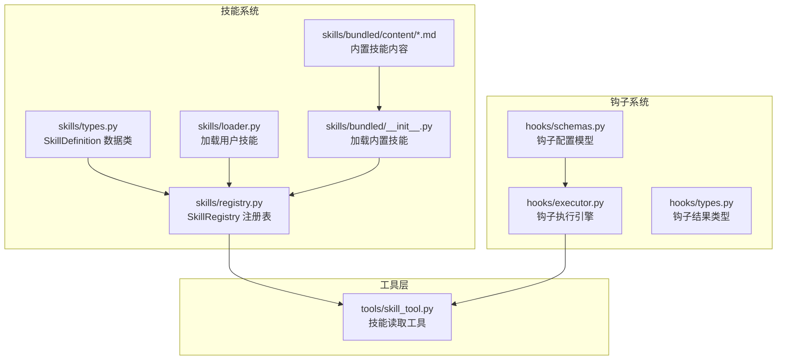
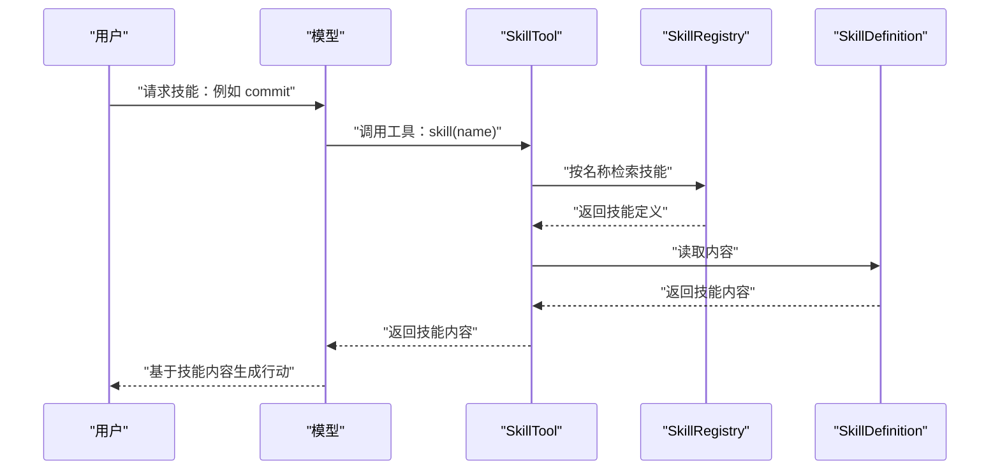
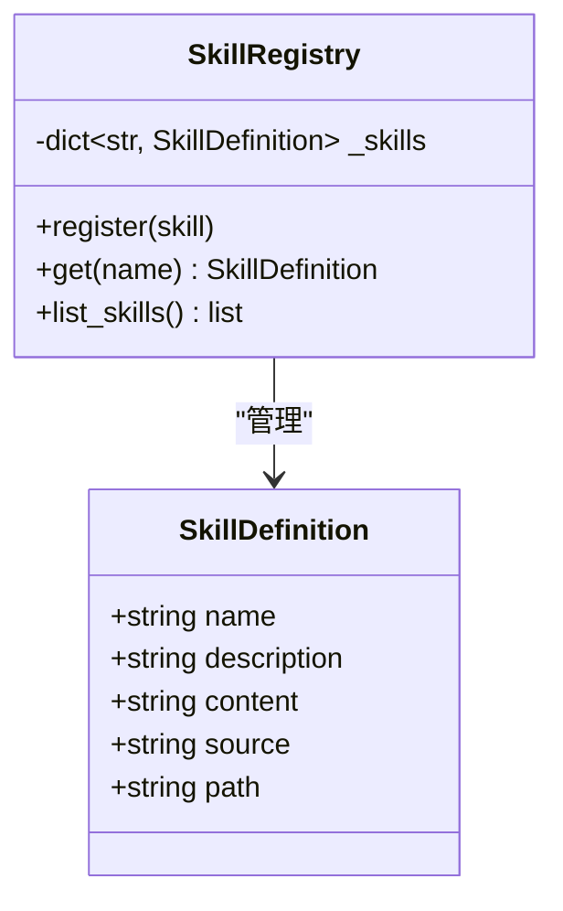
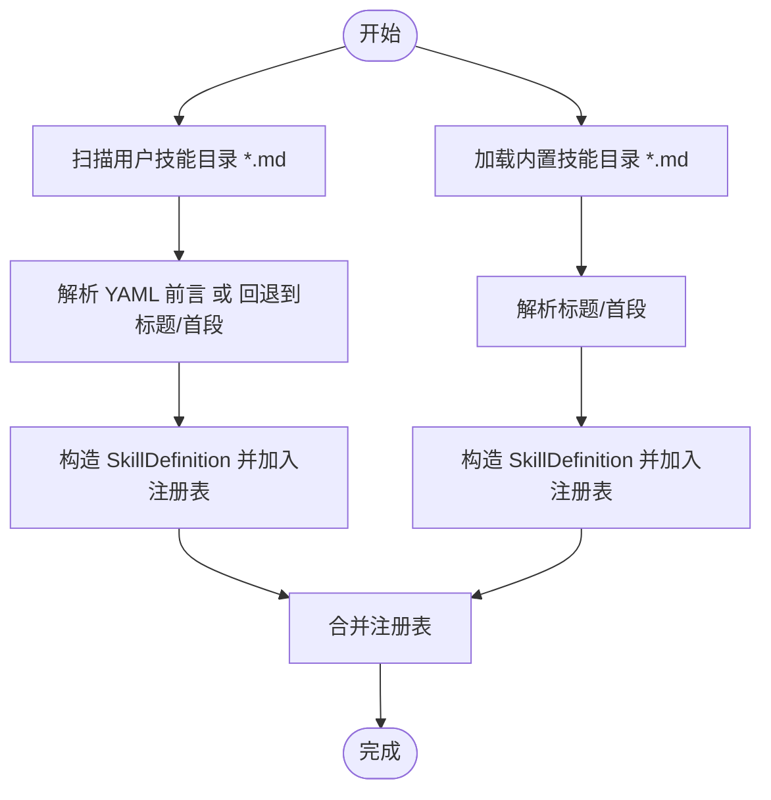
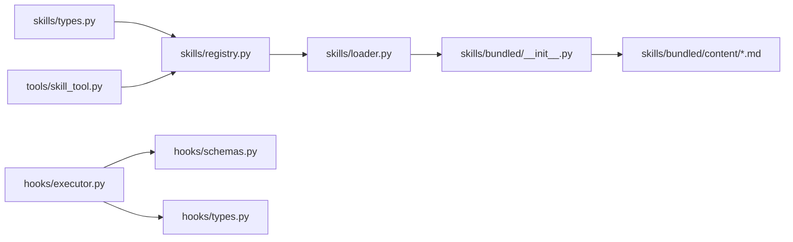

# 技能开发指南

<cite>
**本文引用的文件**
- [README.md](file://README.md)
- [skills/__init__.py](file://src/openharness/skills/__init__.py)
- [skills/loader.py](file://src/openharness/skills/loader.py)
- [skills/registry.py](file://src/openharness/skills/registry.py)
- [skills/types.py](file://src/openharness/skills/types.py)
- [skills/bundled/__init__.py](file://src/openharness/skills/bundled/__init__.py)
- [skills/bundled/content/commit.md](file://src/openharness/skills/bundled/content/commit.md)
- [skills/bundled/content/debug.md](file://src/openharness/skills/bundled/content/debug.md)
- [skills/bundled/content/plan.md](file://src/openharness/skills/bundled/content/plan.md)
- [skills/bundled/content/review.md](file://src/openharness/skills/bundled/content/review.md)
- [skills/bundled/content/simplify.md](file://src/openharness/skills/bundled/content/simplify.md)
- [skills/bundled/content/test.md](file://src/openharness/skills/bundled/content/test.md)
- [tools/skill_tool.py](file://src/openharness/tools/skill_tool.py)
- [hooks/executor.py](file://src/openharness/hooks/executor.py)
- [hooks/schemas.py](file://src/openharness/hooks/schemas.py)
- [hooks/types.py](file://src/openharness/hooks/types.py)
</cite>

## 目录
1. [简介](#简介)
2. [项目结构](#项目结构)
3. [核心组件](#核心组件)
4. [架构总览](#架构总览)
5. [详细组件分析](#详细组件分析)
6. [依赖关系分析](#依赖关系分析)
7. [性能考虑](#性能考虑)
8. [故障排查指南](#故障排查指南)
9. [结论](#结论)
10. [附录](#附录)

## 简介
本指南面向希望在 OpenHarness 中开发与扩展“技能”的开发者，目标是提供一套从需求分析、设计草图到实现与测试的完整工作流程，并结合内置技能（commit、debug、plan、review、simplify、test）的实现模式与最佳实践，帮助你快速上手并高质量交付技能。

OpenHarness 的“技能”以 Markdown 文件形式存在，支持 YAML 前言（可选），通过技能加载器解析为结构化定义，注册到技能注册表中，供模型在对话中按需调用。技能内容本身不直接执行，而是作为知识注入到系统提示中，指导工具调用与行为。

## 项目结构
围绕技能系统的关键目录与文件如下：
- 技能定义与加载：skills/bundled、skills/loader.py、skills/registry.py、skills/types.py
- 技能内容：skills/bundled/content/*.md（内置技能）
- 技能读取工具：tools/skill_tool.py
- 钩子系统（与技能协同）：hooks/executor.py、hooks/schemas.py、hooks/types.py
- 顶层文档与使用说明：README.md

图表来源
- [skills/types.py:1-17](file://src/openharness/skills/types.py#L1-L17)
- [skills/registry.py:1-25](file://src/openharness/skills/registry.py#L1-L25)
- [skills/loader.py:1-97](file://src/openharness/skills/loader.py#L1-L97)
- [skills/bundled/__init__.py:1-45](file://src/openharness/skills/bundled/__init__.py#L1-L45)
- [tools/skill_tool.py:1-34](file://src/openharness/tools/skill_tool.py#L1-L34)
- [hooks/schemas.py:1-59](file://src/openharness/hooks/schemas.py#L1-L59)
- [hooks/executor.py:1-217](file://src/openharness/hooks/executor.py#L1-L217)
- [hooks/types.py:1-39](file://src/openharness/hooks/types.py#L1-L39)

章节来源
- [README.md:127-170](file://README.md#L127-L170)
- [README.md:194-212](file://README.md#L194-L212)

## 核心组件
- 技能数据模型：SkillDefinition，包含名称、描述、内容、来源与路径等字段，用于统一表示技能。
- 技能注册表：SkillRegistry，负责按名称注册与检索技能。
- 技能加载器：负责加载内置技能与用户自定义技能，支持 YAML 前言解析与回退逻辑。
- 技能读取工具：SkillTool，允许按名称检索技能内容，供模型或前端展示使用。
- 钩子系统：与技能协同，可在工具调用前后执行条件判断与阻断逻辑，保障安全与一致性。

章节来源
- [skills/types.py:8-17](file://src/openharness/skills/types.py#L8-L17)
- [skills/registry.py:8-25](file://src/openharness/skills/registry.py#L8-L25)
- [skills/loader.py:21-56](file://src/openharness/skills/loader.py#L21-L56)
- [tools/skill_tool.py:17-34](file://src/openharness/tools/skill_tool.py#L17-L34)
- [hooks/schemas.py:10-58](file://src/openharness/hooks/schemas.py#L10-L58)

## 架构总览
技能系统在运行时的工作流：
- 启动时加载内置与用户技能，构建注册表
- 模型请求技能时，通过技能读取工具返回技能内容
- 工具调用前/后可触发钩子，进行条件校验与阻断
- 结果经由工具返回给模型，驱动下一步动作

图表来源
- [tools/skill_tool.py:28-34](file://src/openharness/tools/skill_tool.py#L28-L34)
- [skills/registry.py:18-20](file://src/openharness/skills/registry.py#L18-L20)
- [skills/types.py:12-17](file://src/openharness/skills/types.py#L12-L17)

## 详细组件分析

### 技能数据模型与注册表
- SkillDefinition：统一承载技能元信息与内容，便于序列化与跨模块传递。
- SkillRegistry：提供注册、查询与列表能力，支持大小写不敏感的名称查找策略（在工具中体现）。

图表来源
- [skills/types.py:8-17](file://src/openharness/skills/types.py#L8-L17)
- [skills/registry.py:8-25](file://src/openharness/skills/registry.py#L8-L25)

章节来源
- [skills/types.py:8-17](file://src/openharness/skills/types.py#L8-L17)
- [skills/registry.py:14-25](file://src/openharness/skills/registry.py#L14-L25)

### 技能加载器与 YAML 前言解析
- 用户技能：从用户配置目录扫描 *.md，解析 YAML 前言（name、description），若无则回退到标题与首段。
- 内置技能：从 bundled/content 目录读取，解析规则与用户技能类似但更简洁。
- 加载入口：load_skill_registry 将内置与用户技能合并注册。

图表来源
- [skills/loader.py:40-97](file://src/openharness/skills/loader.py#L40-L97)
- [skills/bundled/__init__.py:12-45](file://src/openharness/skills/bundled/__init__.py#L12-L45)

章节来源
- [skills/loader.py:21-56](file://src/openharness/skills/loader.py#L21-L56)
- [skills/bundled/__init__.py:12-45](file://src/openharness/skills/bundled/__init__.py#L12-L45)

### 技能读取工具
- 输入：技能名称
- 行为：从注册表按名称检索，支持大小写不敏感匹配；返回技能内容或错误信息
- 用途：在工具链中按需注入技能知识，辅助模型决策

章节来源
- [tools/skill_tool.py:17-34](file://src/openharness/tools/skill_tool.py#L17-L34)

### 钩子系统（与技能协同）
- 钩子类型：命令钩子、HTTP 钩子、提示钩子、代理钩子
- 执行器：根据事件与负载匹配钩子，执行并聚合结果，支持超时、阻断与元数据
- 与技能的关系：技能内容本身不执行，但工具调用可能受钩子阻断影响

章节来源
- [hooks/schemas.py:10-58](file://src/openharness/hooks/schemas.py#L10-L58)
- [hooks/executor.py:49-191](file://src/openharness/hooks/executor.py#L49-L191)
- [hooks/types.py:9-39](file://src/openharness/hooks/types.py#L9-L39)

## 依赖关系分析
- 技能系统内部：types → registry → loader → bundled/content
- 工具层：tools/skill_tool.py 依赖 skills/loader 与 registry
- 钩子系统：hooks/executor.py 依赖 hooks/schemas 与 hooks/types，并与工具层交互

图表来源
- [skills/types.py:1-17](file://src/openharness/skills/types.py#L1-L17)
- [skills/registry.py:1-25](file://src/openharness/skills/registry.py#L1-L25)
- [skills/loader.py:1-97](file://src/openharness/skills/loader.py#L1-L97)
- [skills/bundled/__init__.py:1-45](file://src/openharness/skills/bundled/__init__.py#L1-L45)
- [tools/skill_tool.py:1-34](file://src/openharness/tools/skill_tool.py#L1-L34)
- [hooks/executor.py:1-217](file://src/openharness/hooks/executor.py#L1-L217)
- [hooks/schemas.py:1-59](file://src/openharness/hooks/schemas.py#L1-L59)
- [hooks/types.py:1-39](file://src/openharness/hooks/types.py#L1-L39)

## 性能考虑
- 技能加载：仅在启动时加载一次，后续通过内存注册表查询，时间复杂度 O(1) 检索
- YAML 解析：仅在首次加载时解析，避免重复 IO
- 工具调用：技能读取为只读操作，开销极低
- 钩子执行：注意超时设置与阻断策略，避免长耗时钩子拖慢主流程

[本节为通用建议，无需特定文件分析]

## 故障排查指南
- 技能未找到
  - 确认技能名称大小写不敏感匹配是否符合预期
  - 检查技能是否位于用户技能目录且为 .md 文件
  - 参考工具实现中的查找逻辑
- YAML 前言无效
  - 确保前言以 --- 开始与结束
  - 字段名与值格式正确，必要时使用引号包裹
  - 若无前言，检查标题与首段是否满足回退规则
- 钩子阻断
  - 查看钩子执行结果与原因，确认阻断条件与超时设置
  - 调整匹配器或阻断策略以适配场景

章节来源
- [tools/skill_tool.py:30-33](file://src/openharness/tools/skill_tool.py#L30-L33)
- [skills/loader.py:58-97](file://src/openharness/skills/loader.py#L58-L97)
- [hooks/executor.py:91-115](file://src/openharness/hooks/executor.py#L91-L115)
- [hooks/executor.py:140-146](file://src/openharness/hooks/executor.py#L140-L146)
- [hooks/types.py:27-39](file://src/openharness/hooks/types.py#L27-L39)

## 结论
OpenHarness 的技能系统以轻量、可扩展为核心设计，通过 Markdown + YAML 前言的方式，将领域知识以“按需加载”的方式注入到模型决策中。开发者只需遵循标准格式与编写规范，即可快速贡献高质量技能，并通过钩子系统确保安全与可控。

[本节为总结性内容，无需特定文件分析]

## 附录

### 技能文件标准格式规范
- 文件命名：建议使用连字符分隔的英文小写名称（如 my-skill.md）
- 存放位置：
  - 内置技能：skills/bundled/content/*.md
  - 用户自定义：用户配置目录下的 skills/*.md
- YAML 前言（可选）
  - 支持字段：name、description
  - 作用：覆盖默认名称与描述解析
- 回退规则：
  - 若无前言，使用一级标题作为名称，使用首段文本作为描述
- 内容组织建议：
  - 使用清晰的标题层级与分点说明
  - 包含“何时使用”“工作流”“规则”等模块，便于模型理解上下文与约束

章节来源
- [skills/loader.py:58-97](file://src/openharness/skills/loader.py#L58-L97)
- [skills/bundled/__init__.py:32-45](file://src/openharness/skills/bundled/__init__.py#L32-L45)
- [README.md:322-342](file://README.md#L322-L342)

### 技能内容编写规范
- 目标明确：在“何时使用”中明确适用场景与边界
- 步骤清晰：在“工作流”中给出可执行的步骤清单
- 规则约束：在“规则”中列出不可逾越的限制与最佳实践
- 示例参考：内置技能文档提供了良好范式，可作为写作模板

章节来源
- [skills/bundled/content/commit.md:1-26](file://src/openharness/skills/bundled/content/commit.md#L1-L26)
- [skills/bundled/content/debug.md:1-26](file://src/openharness/skills/bundled/content/debug.md#L1-L26)
- [skills/bundled/content/plan.md:1-35](file://src/openharness/skills/bundled/content/plan.md#L1-L35)
- [skills/bundled/content/review.md:1-27](file://src/openharness/skills/bundled/content/review.md#L1-L27)
- [skills/bundled/content/simplify.md:1-27](file://src/openharness/skills/bundled/content/simplify.md#L1-L27)
- [skills/bundled/content/test.md:1-32](file://src/openharness/skills/bundled/content/test.md#L1-L32)

### 内置技能实现模式与最佳实践
- commit
  - 关注变更分类、消息规范、文件选择与合规性
  - 最佳实践：先 diff 再 add，避免 staged 不当
- debug
  - 强调系统化诊断流程：重现 → 读取错误 → 定位 → 假设 → 验证 → 修复 → 测试
  - 最佳实践：根因修复，避免症状处理
- plan
  - 设计阶段重在探索与复用，强调步骤拆解与验证
  - 最佳实践：先读再改，优先复用现有模式
- review
  - 多维度质量检查：缺陷、安全、性能、测试、风格
  - 最佳实践：具体反馈、分级优先、给出修复建议
- simplify
  - 以简化为目标，删除冗余与过度工程化
  - 最佳实践：保持行为不变，减少行数与复杂度
- test
  - 明确测试目标与范围，遵循项目既有模式
  - 最佳实践：独立、确定、快速，mock 边界

章节来源
- [skills/bundled/content/commit.md:9-26](file://src/openharness/skills/bundled/content/commit.md#L9-L26)
- [skills/bundled/content/debug.md:9-26](file://src/openharness/skills/bundled/content/debug.md#L9-L26)
- [skills/bundled/content/plan.md:9-35](file://src/openharness/skills/bundled/content/plan.md#L9-L35)
- [skills/bundled/content/review.md:9-27](file://src/openharness/skills/bundled/content/review.md#L9-L27)
- [skills/bundled/content/simplify.md:9-27](file://src/openharness/skills/bundled/content/simplify.md#L9-L27)
- [skills/bundled/content/test.md:9-32](file://src/openharness/skills/bundled/content/test.md#L9-L32)

### 技能开发工作流程
- 需求分析：明确“何时使用”，识别关键约束与风险点
- 设计草图：列出“工作流”步骤与“规则”约束
- 编写初稿：按标准格式撰写，必要时添加 YAML 前言
- 实现测试：将技能放入用户目录，使用工具读取验证；结合钩子进行安全与阻断测试
- 迭代优化：根据反馈调整步骤与规则，提升可操作性与鲁棒性

章节来源
- [README.md:322-342](file://README.md#L322-L342)
- [skills/loader.py:40-56](file://src/openharness/skills/loader.py#L40-L56)
- [tools/skill_tool.py:28-34](file://src/openharness/tools/skill_tool.py#L28-L34)
- [hooks/executor.py:49-191](file://src/openharness/hooks/executor.py#L49-L191)

### 技能调试技巧
- 使用工具读取技能内容进行核对，确保名称与描述解析正确
- 在不同大小写下尝试检索，验证工具的名称匹配策略
- 结合钩子输出与原因，定位阻断或失败的具体环节
- 对于 YAML 前言，逐步缩小字段范围，确认解析异常点

章节来源
- [tools/skill_tool.py:30-33](file://src/openharness/tools/skill_tool.py#L30-L33)
- [hooks/executor.py:91-115](file://src/openharness/hooks/executor.py#L91-L115)
- [hooks/executor.py:140-146](file://src/openharness/hooks/executor.py#L140-L146)

### 性能优化方法
- 减少不必要的技能数量，避免注册表过大
- 合理使用钩子，避免过长超时与频繁阻断
- 将复杂逻辑前置到技能内容中，降低工具执行成本

[本节为通用建议，无需特定文件分析]

### 常见问题解决方案
- 技能名称找不到：检查大小写与拼写；确认已放置在用户技能目录
- YAML 前言不生效：确认格式正确；必要时移除前言，依赖标题/首段回退
- 钩子导致阻断：查看阻断原因与超时设置；调整匹配器或阻断策略

章节来源
- [tools/skill_tool.py:30-33](file://src/openharness/tools/skill_tool.py#L30-L33)
- [hooks/executor.py:185-191](file://src/openharness/hooks/executor.py#L185-L191)

### 技能模板与示例
- 技能模板（Markdown + YAML 前言）
  - 参考路径：[README.md:326-342](file://README.md#L326-L342)
- 内置技能示例
  - commit：[skills/bundled/content/commit.md](file://src/openharness/skills/bundled/content/commit.md)
  - debug：[skills/bundled/content/debug.md](file://src/openharness/skills/bundled/content/debug.md)
  - plan：[skills/bundled/content/plan.md](file://src/openharness/skills/bundled/content/plan.md)
  - review：[skills/bundled/content/review.md](file://src/openharness/skills/bundled/content/review.md)
  - simplify：[skills/bundled/content/simplify.md](file://src/openharness/skills/bundled/content/simplify.md)
  - test：[skills/bundled/content/test.md](file://src/openharness/skills/bundled/content/test.md)

章节来源
- [README.md:322-342](file://README.md#L322-L342)
- [skills/bundled/content/commit.md:1-26](file://src/openharness/skills/bundled/content/commit.md#L1-L26)
- [skills/bundled/content/debug.md:1-26](file://src/openharness/skills/bundled/content/debug.md#L1-L26)
- [skills/bundled/content/plan.md:1-35](file://src/openharness/skills/bundled/content/plan.md#L1-L35)
- [skills/bundled/content/review.md:1-27](file://src/openharness/skills/bundled/content/review.md#L1-L27)
- [skills/bundled/content/simplify.md:1-27](file://src/openharness/skills/bundled/content/simplify.md#L1-L27)
- [skills/bundled/content/test.md:1-32](file://src/openharness/skills/bundled/content/test.md#L1-L32)