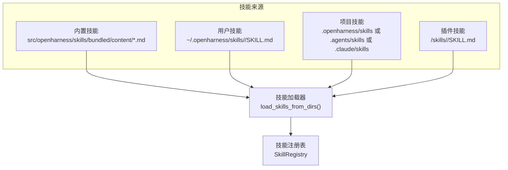
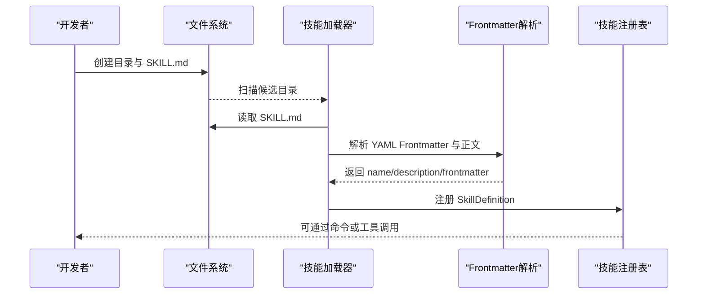
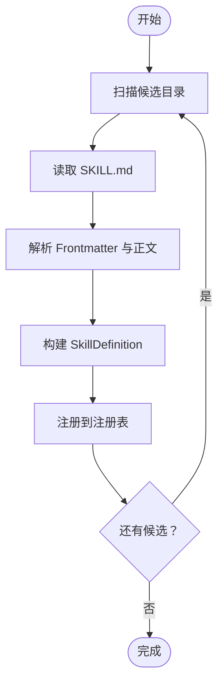
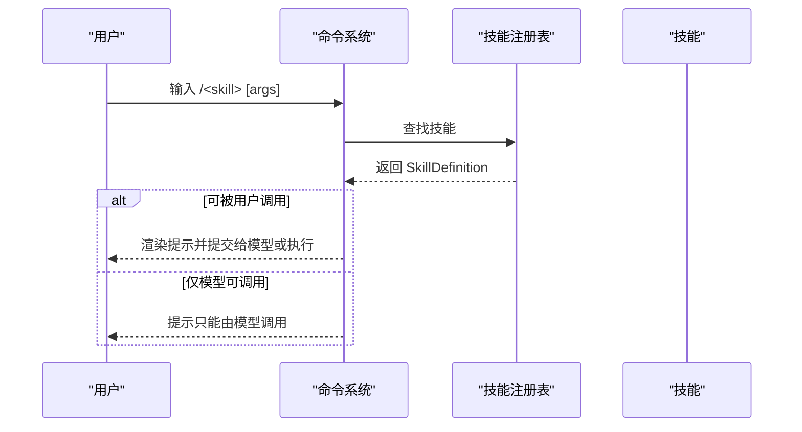
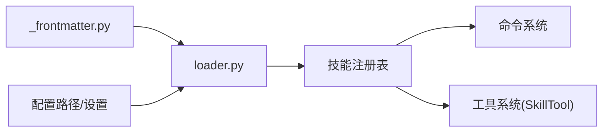

# 技能开发指南

<cite>
**本文引用的文件**
- [SKILL.md](file://.claude/skills/harness-eval/SKILL.md)
- [SKILL.md](file://.claude/skills/pr-merge/SKILL.md)
- [_frontmatter.py](file://src/openharness/skills/_frontmatter.py)
- [loader.py](file://src/openharness/skills/loader.py)
- [types.py](file://src/openharness/skills/types.py)
- [skill-creator.md](file://src/openharness/skills/bundled/content/skill-creator.md)
- [commit.md](file://src/openharness/skills/bundled/content/commit.md)
- [debug.md](file://src/openharness/skills/bundled/content/debug.md)
- [diagnose.md](file://src/openharness/skills/bundled/content/diagnose.md)
- [test_patterns.md](file://.claude/skills/harness-eval/references/test-patterns.md)
- [feature_matrix.md](file://.claude/skills/harness-eval/references/feature-matrix.md)
- [merge_scenarios.md](file://.claude/skills/pr-merge/references/merge-scenarios.md)
- [test_loader.py](file://tests/test_skills/test_loader.py)
- [registry.py](file://src/openharness/commands/registry.py)
- [test_harness_features.py](file://scripts/test_harness_features.py)
- [test_core_tools.py](file://tests/test_tools/test_core_tools.py)
- [test_hooks_skills_plugins_real.py](file://tests/test_hooks_skills_plugins_real.py)
</cite>

## 目录
1. [简介](#简介)
2. [项目结构](#项目结构)
3. [核心组件](#核心组件)
4. [架构总览](#架构总览)
5. [详细组件分析](#详细组件分析)
6. [依赖关系分析](#依赖关系分析)
7. [性能考量](#性能考量)
8. [故障排查指南](#故障排查指南)
9. [结论](#结论)
10. [附录](#附录)

## 简介
本指南面向希望在 OpenHarness 中创建、维护与使用“技能（Skill）”的开发者与使用者。技能以目录化的 SKILL.md 文件形式存在，通过 YAML Frontmatter 提供元数据（如名称、描述、是否允许用户直接调用、是否禁用模型直接调用、指定模型、参数提示等），并通过统一的加载器注册到系统中，供命令行、工具或模型在合适的上下文中调用。

本指南将系统讲解：
- SKILL.md 的 YAML Frontmatter 规范与解析逻辑
- 技能开发的完整流程：从文件结构设计到内容编写、测试与调试
- 技能工作流设计原则：输入参数处理、输出格式规范、错误处理机制
- 实战示例：覆盖代码生成、文件操作、分析诊断等类型
- 最佳实践与常见问题解决方案

## 项目结构
OpenHarness 将技能组织为目录化 Markdown 文档，每个技能目录下包含 SKILL.md，并可选包含 scripts/、references/、assets/ 等子目录用于存放脚本、参考材料与静态资源。系统支持多级来源：
- 内置技能：位于内置内容目录
- 用户技能：位于用户配置目录及兼容路径
- 项目技能：在仓库内按约定路径发现
- 插件技能：由插件提供并动态加载

图表来源
- [loader.py:153-206](file://src/openharness/skills/loader.py#L153-L206)
- [loader.py:42-75](file://src/openharness/skills/loader.py#L42-L75)

章节来源
- [loader.py:23-27](file://src/openharness/skills/loader.py#L23-L27)
- [loader.py:42-75](file://src/openharness/skills/loader.py#L42-L75)
- [loader.py:153-206](file://src/openharness/skills/loader.py#L153-L206)

## 核心组件
- YAML Frontmatter 解析：负责解析 SKILL.md 的 YAML 头部元数据，支持折叠块标量、字面量块标量、引号值等，并提供回退策略。
- 技能加载器：扫描多来源目录，读取 SKILL.md，解析元数据与正文，构建 SkillDefinition 并注册到注册表。
- 技能定义模型：标准化存储技能的名称、描述、来源、路径、命令名、显示名、以及 Frontmatter 控制字段。
- 命令与工具集成：命令系统支持用户直接调用可被用户触发的技能；工具系统支持模型通过 SkillTool 调用技能。

章节来源
- [_frontmatter.py:34-97](file://src/openharness/skills/_frontmatter.py#L34-L97)
- [loader.py:214-229](file://src/openharness/skills/loader.py#L214-L229)
- [types.py:8-25](file://src/openharness/skills/types.py#L8-L25)
- [registry.py:366-395](file://src/openharness/commands/registry.py#L366-L395)

## 架构总览
技能从文件到可用的端到端流程如下：

图表来源
- [loader.py:153-206](file://src/openharness/skills/loader.py#L153-L206)
- [_frontmatter.py:34-97](file://src/openharness/skills/_frontmatter.py#L34-L97)

## 详细组件分析

### YAML Frontmatter 元数据规范
SKILL.md 支持在文档顶部使用 YAML Frontmatter（以三横线分隔）声明元数据。系统解析时会优先使用 Frontmatter 的 name 与 description；若缺失，则回退到标题与首段落；若仍无，则使用模板生成默认描述。

支持的关键字段（来自加载器解析）：
- name：技能显示名称
- description：技能描述，作为触发提示与列表展示信息
- user-invocable：是否允许用户通过斜杠命令直接调用
- disable-model-invocation：是否禁止模型直接调用该技能（仅限用户调用）
- model：指定调用该技能时使用的模型
- argument-hint：参数提示字符串，辅助用户输入

解析行为要点：
- 支持折叠块标量（>）与字面量块标量（|），前者展开为单行文本，后者保留换行
- 对布尔值采用宽松解析（1/true/yes/on 视为真，0/false/no/off 视为假）
- 缺失或无效时采用默认值或回退策略

章节来源
- [_frontmatter.py:13-24](file://src/openharness/skills/_frontmatter.py#L13-L24)
- [_frontmatter.py:27-31](file://src/openharness/skills/_frontmatter.py#L27-L31)
- [_frontmatter.py:34-97](file://src/openharness/skills/_frontmatter.py#L34-L97)
- [loader.py:214-229](file://src/openharness/skills/loader.py#L214-L229)
- [test_loader.py:198-302](file://tests/test_skills/test_loader.py#L198-L302)

### 技能加载与注册流程
- 加载顺序：内置技能 → 用户技能 → 指定目录技能 → 项目技能（基于 cwd 与 .git 根目录向上遍历） → 插件技能
- 项目技能发现：从当前工作目录向上遍历至 .git 根或用户主目录，收集符合命名约定的技能目录
- 安全性：忽略绝对路径与包含相对路径逃逸的目录
- 冲突解决：后发现的技能可覆盖更广泛的技能定义，确保确定性覆盖

图表来源
- [loader.py:153-206](file://src/openharness/skills/loader.py#L153-L206)
- [loader.py:83-123](file://src/openharness/skills/loader.py#L83-L123)

章节来源
- [loader.py:42-75](file://src/openharness/skills/loader.py#L42-L75)
- [loader.py:83-123](file://src/openharness/skills/loader.py#L83-L123)
- [loader.py:153-206](file://src/openharness/skills/loader.py#L153-L206)
- [test_loader.py:116-181](file://tests/test_skills/test_loader.py#L116-L181)

### 技能定义模型与控制字段
SkillDefinition 数据类包含以下关键字段：
- name、description、content、source、path、base_dir、command_name、display_name、aliases
- user_invocable：是否允许用户直接调用
- disable_model_invocation：是否禁止模型调用
- model：指定调用模型
- argument_hint：参数提示

这些字段直接影响命令系统与工具系统的调用行为与可见性。

章节来源
- [types.py:8-25](file://src/openharness/skills/types.py#L8-L25)
- [loader.py:214-229](file://src/openharness/skills/loader.py#L214-L229)

### 命令系统中的技能调用
- 用户可通过斜杠命令（如 /deploy）直接调用 user-invocable 的技能
- 若技能被标记为仅用户可调用（disable-model-invocation 为真），则模型无法直接调用
- 调用时可按技能指定的 model 进行推理

图表来源
- [registry.py:366-395](file://src/openharness/commands/registry.py#L366-L395)
- [test_core_tools.py:231-252](file://tests/test_tools/test_core_tools.py#L231-L252)

章节来源
- [registry.py:366-395](file://src/openharness/commands/registry.py#L366-L395)
- [test_core_tools.py:231-252](file://tests/test_tools/test_core_tools.py#L231-L252)

### 工具系统中的技能调用（SkillTool）
- 模型可通过工具调用 SkillTool 加载并执行技能内容
- 测试脚本验证了 SkillTool 能正确返回技能内容长度与内容特征
- 在真实模型调用场景中，可验证模型对技能的使用效果

章节来源
- [test_harness_features.py:108-128](file://scripts/test_harness_features.py#L108-L128)
- [test_engine\test_query_engine.py:523-557](file://tests/test_engine/test_query_engine.py#L523-L557)

### 示例技能：Harness Eval（端到端功能验证）
- 设计原则：在不熟悉的项目上进行真实 API 调用、多轮对话、组合特性验证、检查工具执行轨迹
- 环境配置：导出真实 API 密钥、基础地址与模型
- 沙箱运行：安装并验证沙箱运行时依赖，再通过 OpenHarness 适配器进行验证
- 测试模式：提供 make_engine、collect 等模板，支持长时序、多工具链路验证
- 场景推荐：架构映射、钩子阻断与自适应、沙箱多轮等

章节来源
- [SKILL.md:1-194](file://.claude/skills/harness-eval/SKILL.md#L1-L194)
- [test_patterns.md:1-151](file://.claude/skills/harness-eval/references/test-patterns.md#L1-L151)
- [feature_matrix.md:1-48](file://.claude/skills/harness-eval/references/feature-matrix.md#L1-L48)

### 示例技能：PR Merge（贡献者优先合并）
- 核心原则：优先保留作者、先合并后修复冲突、选择性合并、避免重写贡献者工作
- 流程步骤：PR 分类、GitHub 操作、本地冲突处理、选择性合并、关闭重复 PR、合并后验证
- 归属清单：确保作者出现在日志、提交信息包含 PR 编号、排除说明、感谢评论、重复 PR 的备注

章节来源
- [SKILL.md:1-100](file://.claude/skills/pr-merge/SKILL.md#L1-L100)
- [merge_scenarios.md:1-132](file://.claude/skills/pr-merge/references/merge-scenarios.md#L1-L132)

### 内置技能参考：commit、debug、diagnose
- commit：提供清晰、结构化 Git 提交的步骤与规则
- debug：系统化地定位与修复问题
- diagnose：基于运行产物与执行轨迹进行结构化诊断

章节来源
- [commit.md:1-26](file://src/openharness/skills/bundled/content/commit.md#L1-L26)
- [debug.md:1-26](file://src/openharness/skills/bundled/content/debug.md#L1-L26)
- [diagnose.md:1-36](file://src/openharness/skills/bundled/content/diagnose.md#L1-L36)

## 依赖关系分析
- 加载器依赖 Frontmatter 解析模块与配置路径模块
- 注册表承载所有来源的技能定义，供命令与工具系统使用
- 命令系统与工具系统均依赖注册表提供的技能元数据进行调用决策

图表来源
- [loader.py:9-19](file://src/openharness/skills/loader.py#L9-L19)
- [registry.py:366-395](file://src/openharness/commands/registry.py#L366-L395)

章节来源
- [loader.py:9-19](file://src/openharness/skills/loader.py#L9-L19)
- [registry.py:366-395](file://src/openharness/commands/registry.py#L366-L395)

## 性能考量
- 长时序任务：保持合理的 max_turns 与超时设置，避免过早放弃导致误判
- 工具链路：在一次响应中并发/串行多个工具调用时，注意资源占用与权限检查
- 沙箱环境：提前验证依赖，减少运行期失败带来的重试成本
- 日志与追踪：利用执行轨迹与验证报告定位瓶颈，避免盲目优化

## 故障排查指南
- Frontmatter 解析失败：确认 YAML 语法正确，必要时使用引号包裹含特殊字符的值
- 技能未被加载：检查目录结构是否为目录/ SKILL.md，而非扁平 *.md；确认路径安全且未被忽略
- 项目技能未生效：确认 cwd 是否处于 .git 根内，项目技能目录是否在支持的相对路径范围内
- 用户/模型调用限制：若技能被标记为仅用户可调用，模型将无法直接调用；需通过命令或工具引导
- 沙箱依赖缺失：在真实适配器路径下进行最小化验证，区分环境问题与产品问题

章节来源
- [test_loader.py:183-193](file://tests/test_skills/test_loader.py#L183-L193)
- [test_loader.py:132-141](file://tests/test_skills/test_loader.py#L132-L141)
- [test_core_tools.py:231-252](file://tests/test_tools/test_core_tools.py#L231-L252)
- [SKILL.md:39-65](file://.claude/skills/harness-eval/SKILL.md#L39-L65)

## 结论
通过标准化的 SKILL.md 文件结构与 YAML Frontmatter 元数据，OpenHarness 将技能开发、加载与调用流程规范化。遵循本文档的文件结构、元数据规范、工作流设计原则与测试方法，可以高效地创建高质量、可复用、可验证的技能，并将其无缝集成到命令系统与工具系统中。

## 附录

### SKILL.md 文件结构与 Frontmatter 字段说明
- 目录结构建议
  - 目录名使用小写短横线分隔（便于命令名）
  - SKILL.md 为主文档
  - scripts/：可复用的脚本
  - references/：长文档与参考材料
  - assets/：模板或静态资源
- Frontmatter 字段
  - name：技能名称
  - description：触发提示与用途说明
  - user-invocable：是否允许用户直接调用
  - disable-model-invocation：是否禁止模型调用
  - model：指定模型
  - argument-hint：参数提示

章节来源
- [skill-creator.md:37-73](file://src/openharness/skills/bundled/content/skill-creator.md#L37-L73)
- [loader.py:222-228](file://src/openharness/skills/loader.py#L222-L228)

### 开发流程与最佳实践
- 明确意图：在写作前明确技能目标、触发条件、期望输出与成功标准
- 参考现有示例：阅读同类技能与加载器行为，选择合适布局
- 先写元数据：description 是主要触发提示，应具体且略带断言性
- 正文流程化：使用简洁祈使句，解释约束原因；长内容放入 references/
- 可靠资源：将重复使用的脚本、模板、清单放入 scripts/、assets/、references/
- 验证加载：使用内置加载器检查技能是否被正确识别与注册
- 行为测试：准备 2–3 个真实场景提示，验证触发与输出质量
- 迭代证据：根据触发不足、输出不佳或重复劳动，分别改进 Frontmatter、正文或引入资源

章节来源
- [skill-creator.md:75-136](file://src/openharness/skills/bundled/content/skill-creator.md#L75-L136)
- [test_loader.py:10-36](file://tests/test_skills/test_loader.py#L10-L36)

### 实际开发示例索引
- 端到端验证：Harness Eval
  - 设计原则、环境配置、沙箱验证、测试模板与场景矩阵
  - 参考：[SKILL.md:1-194](file://.claude/skills/harness-eval/SKILL.md#L1-L194)、[test-patterns.md:1-151](file://.claude/skills/harness-eval/references/test-patterns.md#L1-L151)、[feature-matrix.md:1-48](file://.claude/skills/harness-eval/references/feature-matrix.md#L1-L48)
- PR 合并：PR Merge
  - 原则、流程、归属清单与场景示例
  - 参考：[SKILL.md:1-100](file://.claude/skills/pr-merge/SKILL.md#L1-L100)、[merge-scenarios.md:1-132](file://.claude/skills/pr-merge/references/merge-scenarios.md#L1-L132)
- 内置技能参考
  - 提交：[commit.md:1-26](file://src/openharness/skills/bundled/content/commit.md#L1-L26)
  - 调试：[debug.md:1-26](file://src/openharness/skills/bundled/content/debug.md#L1-L26)
  - 诊断：[diagnose.md:1-36](file://src/openharness/skills/bundled/content/diagnose.md#L1-L36)