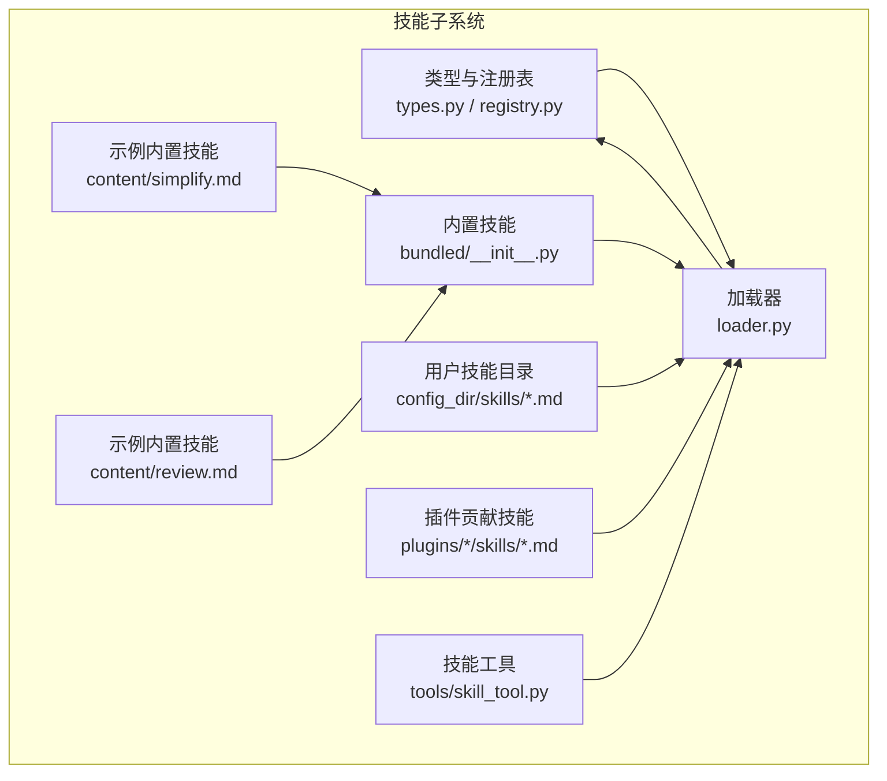
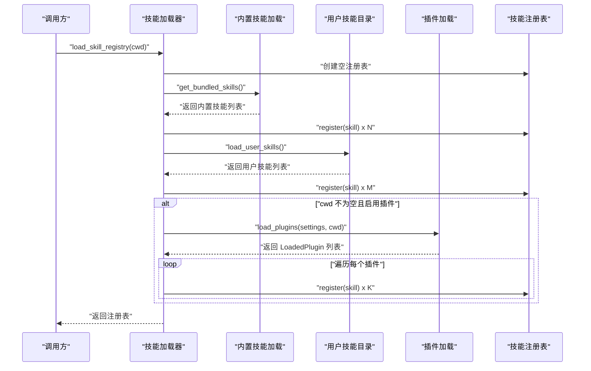
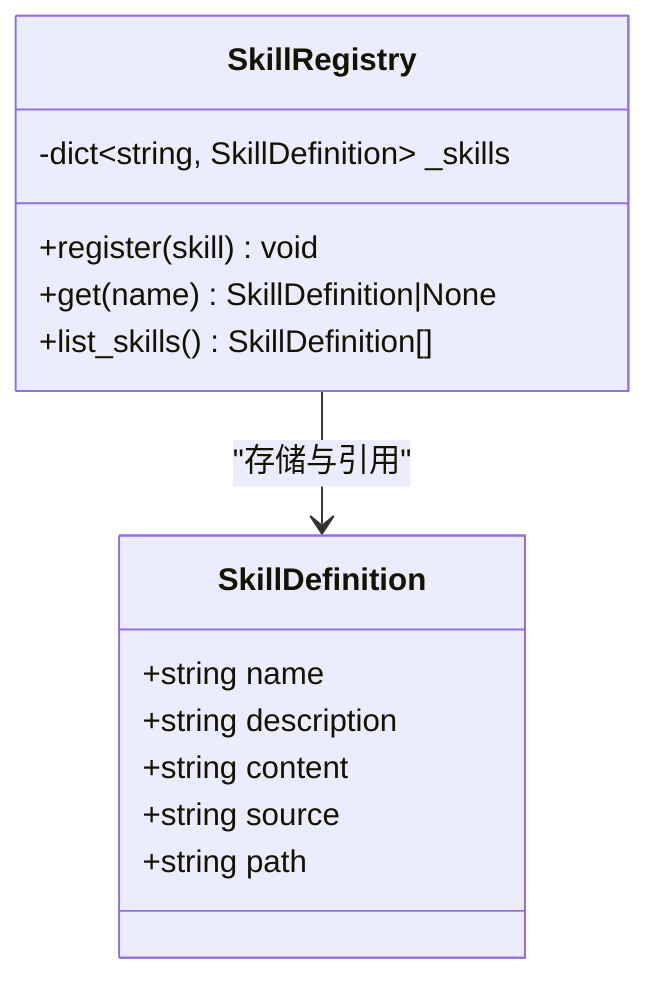
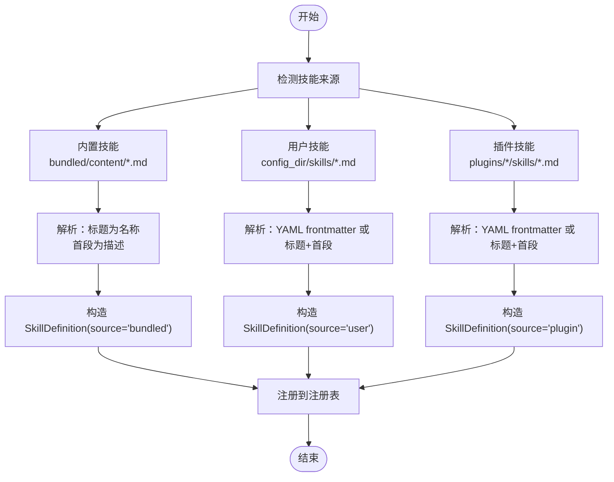
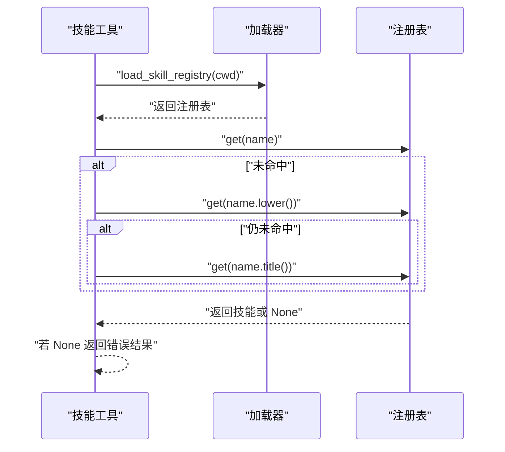
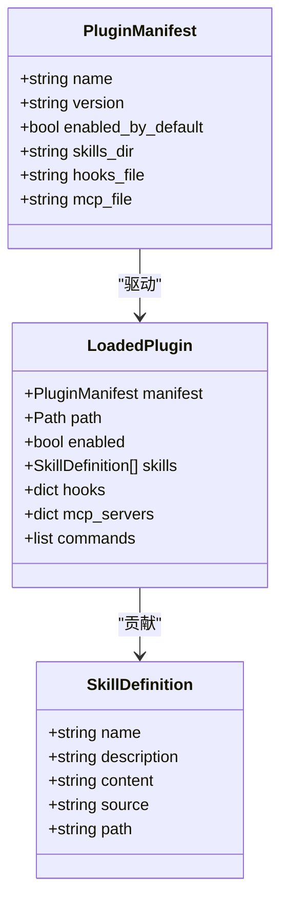
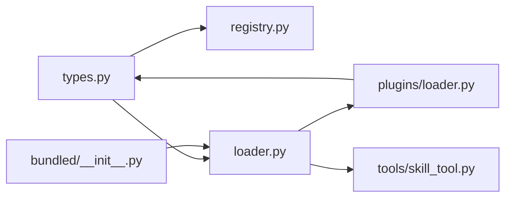

# 技能架构设计

<cite>
**本文引用的文件**
- [skills/__init__.py](file://src/openharness/skills/__init__.py)
- [skills/registry.py](file://src/openharness/skills/registry.py)
- [skills/types.py](file://src/openharness/skills/types.py)
- [skills/loader.py](file://src/openharness/skills/loader.py)
- [skills/bundled/__init__.py](file://src/openharness/skills/bundled/__init__.py)
- [skills/bundled/content/simplify.md](file://src/openharness/skills/bundled/content/simplify.md)
- [skills/bundled/content/review.md](file://src/openharness/skills/bundled/content/review.md)
- [tools/skill_tool.py](file://src/openharness/tools/skill_tool.py)
- [plugins/loader.py](file://src/openharness/plugins/loader.py)
- [plugins/types.py](file://src/openharness/plugins/types.py)
- [plugins/schemas.py](file://src/openharness/plugins/schemas.py)
- [tests/test_skills/test_loader.py](file://tests/test_skills/test_loader.py)
</cite>

## 目录
1. [引言](#引言)
2. [项目结构](#项目结构)
3. [核心组件](#核心组件)
4. [架构总览](#架构总览)
5. [详细组件分析](#详细组件分析)
6. [依赖关系分析](#依赖关系分析)
7. [性能考虑](#性能考虑)
8. [故障排查指南](#故障排查指南)
9. [结论](#结论)
10. [附录](#附录)

## 引言
本文件面向 OpenHarness 的“技能”子系统，系统化阐述其架构设计与实现细节，重点覆盖以下方面：
- 技能注册表（SkillRegistry）的设计原理与工作机制
- 技能数据模型（SkillDefinition）的字段定义与用途
- 技能分类体系：内置技能（bundled）与用户自定义技能（user）的差异及处理方式
- 技能生命周期：从加载、注册到使用的完整流程
- 与工具系统（Tools）、插件系统（Plugins）的集成关系与交互模式
- 架构决策的技术考量与可扩展性设计

## 项目结构
技能子系统位于 src/openharness/skills 下，主要由以下模块组成：
- 类型与注册表：types.py 定义数据模型，registry.py 提供注册表能力
- 加载器：loader.py 负责从多源加载技能并构建注册表
- 内置技能：bundled/__init__.py 提供内置技能集合
- 工具集成：tools/skill_tool.py 将技能读取能力暴露为工具
- 测试与示例：tests/test_skills/test_loader.py 验证加载行为；bundled/content 下包含示例 Markdown 技能

图表来源
- [skills/types.py:1-17](file://src/openharness/skills/types.py#L1-L17)
- [skills/registry.py:1-25](file://src/openharness/skills/registry.py#L1-L25)
- [skills/loader.py:1-97](file://src/openharness/skills/loader.py#L1-L97)
- [skills/bundled/__init__.py:1-45](file://src/openharness/skills/bundled/__init__.py#L1-L45)
- [skills/bundled/content/simplify.md:1-27](file://src/openharness/skills/bundled/content/simplify.md#L1-L27)
- [skills/bundled/content/review.md:1-27](file://src/openharness/skills/bundled/content/review.md#L1-L27)
- [tools/skill_tool.py:1-34](file://src/openharness/tools/skill_tool.py#L1-L34)

章节来源
- [skills/__init__.py:1-31](file://src/openharness/skills/__init__.py#L1-L31)
- [skills/registry.py:1-25](file://src/openharness/skills/registry.py#L1-L25)
- [skills/types.py:1-17](file://src/openharness/skills/types.py#L1-L17)
- [skills/loader.py:1-97](file://src/openharness/skills/loader.py#L1-L97)
- [skills/bundled/__init__.py:1-45](file://src/openharness/skills/bundled/__init__.py#L1-L45)
- [tools/skill_tool.py:1-34](file://src/openharness/tools/skill_tool.py#L1-L34)

## 核心组件
- SkillDefinition：技能的数据模型，包含名称、描述、内容、来源与路径等字段，用于统一表达不同来源的技能。
- SkillRegistry：内存中的技能注册表，提供按名称注册与查询的能力，并支持按名称排序列出所有技能。
- 加载器（loader）：负责从内置目录、用户配置目录以及插件贡献目录加载技能，解析 Markdown 前言元信息，构造 SkillDefinition 并注册到注册表。

章节来源
- [skills/types.py:8-17](file://src/openharness/skills/types.py#L8-L17)
- [skills/registry.py:8-25](file://src/openharness/skills/registry.py#L8-L25)
- [skills/loader.py:21-37](file://src/openharness/skills/loader.py#L21-L37)

## 架构总览
技能系统的整体工作流如下：
- 初始化阶段：调用加载函数，构建空注册表
- 加载阶段：依次从内置目录、用户目录、插件目录加载技能，解析前言元信息，构造 SkillDefinition 并注册
- 使用阶段：通过工具或业务逻辑从注册表按名称检索技能内容

图表来源
- [skills/loader.py:21-37](file://src/openharness/skills/loader.py#L21-L37)
- [skills/bundled/__init__.py:12-29](file://src/openharness/skills/bundled/__init__.py#L12-L29)
- [skills/loader.py:40-55](file://src/openharness/skills/loader.py#L40-L55)
- [plugins/loader.py:53-106](file://src/openharness/plugins/loader.py#L53-L106)

## 详细组件分析

### 组件一：SkillDefinition 数据模型
- 字段定义与用途
  - name：技能名称，作为注册表中的唯一键
  - description：技能描述，用于展示与检索
  - content：技能内容文本（Markdown），作为实际执行或提示的依据
  - source：技能来源标识，区分 bundled、user、plugin
  - path：技能文件的绝对路径字符串（可选），便于调试与定位
- 设计考量
  - 使用不可变数据类，确保注册表中技能对象稳定
  - source 字段用于区分不同来源，便于后续权限控制与审计
  - path 字段在需要定位原始文件时提供便利

章节来源
- [skills/types.py:8-17](file://src/openharness/skills/types.py#L8-L17)

### 组件二：SkillRegistry 注册表
- 能力概述
  - register(skill)：以技能名称为键注册技能
  - get(name)：按名称获取技能，大小写不敏感的回退策略由工具层实现
  - list_skills()：返回按名称排序的技能列表
- 设计考量
  - 键冲突处理：后注册者会覆盖同名技能，体现“用户/插件技能优先”的语义
  - 查询效率：基于字典的 O(1) 查找
  - 列表输出：排序输出便于 UI 展示与测试断言

图表来源
- [skills/types.py:8-17](file://src/openharness/skills/types.py#L8-L17)
- [skills/registry.py:8-25](file://src/openharness/skills/registry.py#L8-L25)

章节来源
- [skills/registry.py:8-25](file://src/openharness/skills/registry.py#L8-L25)

### 组件三：技能加载与来源分类
- 内置技能（bundled）
  - 来源：内置 Markdown 文件，位于 bundled/content 目录
  - 解析：从文件内容提取标题作为名称，第一段非标题文本作为描述
  - 标识：source = "bundled"
- 用户自定义技能（user）
  - 来源：用户配置目录下的 .md 文件
  - 解析：优先尝试 YAML frontmatter（三短横线分隔），支持 name 与 description 字段；若不存在则回退到首行标题与首段文本
  - 标识：source = "user"
- 插件贡献技能（plugin）
  - 来源：插件包内的 skills/ 目录（以及 commands/、agents/ 等扩展位置）
  - 解析：使用统一的 Markdown 解析方法，source = "plugin"
  - 标识：source = "plugin"

图表来源
- [skills/bundled/__init__.py:12-44](file://src/openharness/skills/bundled/__init__.py#L12-L44)
- [skills/loader.py:40-96](file://src/openharness/skills/loader.py#L40-L96)
- [plugins/loader.py:109-125](file://src/openharness/plugins/loader.py#L109-L125)

章节来源
- [skills/bundled/__init__.py:12-44](file://src/openharness/skills/bundled/__init__.py#L12-L44)
- [skills/loader.py:40-96](file://src/openharness/skills/loader.py#L40-L96)
- [plugins/loader.py:109-125](file://src/openharness/plugins/loader.py#L109-L125)

### 组件四：技能生命周期管理
- 生命周期阶段
  - 加载：从各来源读取 Markdown 文件，解析元信息，构造 SkillDefinition
  - 注册：将 SkillDefinition 注册到 SkillRegistry
  - 使用：通过工具或业务逻辑按名称检索技能内容
- 关键流程
  - 加载顺序：内置 → 用户 → 插件（插件仅在提供 cwd 时启用）
  - 名称匹配：工具层对大小写进行回退匹配，注册表层严格区分大小写
  - 覆盖规则：后加载的同名技能会覆盖先前注册的技能，体现“用户/插件优先”

图表来源
- [tools/skill_tool.py:28-33](file://src/openharness/tools/skill_tool.py#L28-L33)
- [skills/loader.py:21-37](file://src/openharness/skills/loader.py#L21-L37)

章节来源
- [tools/skill_tool.py:17-33](file://src/openharness/tools/skill_tool.py#L17-L33)
- [skills/loader.py:21-37](file://src/openharness/skills/loader.py#L21-L37)

### 组件五：与工具系统（Tools）的集成
- 技能工具（SkillTool）
  - 功能：根据名称读取已加载的技能内容
  - 行为：加载注册表 → 按名称检索 → 返回内容或错误
  - 权限：只读工具
- 与注册表的关系：通过加载器获取当前上下文下的注册表实例

章节来源
- [tools/skill_tool.py:17-33](file://src/openharness/tools/skill_tool.py#L17-L33)

### 组件六：与插件系统（Plugins）的集成
- 插件贡献技能
  - 插件 Manifest 支持指定 skills_dir、hooks_file、mcp_file 等路径
  - 插件加载器会从插件目录发现并加载技能，source 标记为 "plugin"
  - LoadedPlugin 数据结构包含 skills 字段，便于注册表统一注册
- 集成点
  - 当 cwd 非空时，加载器会加载插件并将其贡献的技能注册到注册表
  - 插件技能与用户技能共享同一注册表，遵循相同的覆盖规则

图表来源
- [plugins/schemas.py:8-24](file://src/openharness/plugins/schemas.py#L8-L24)
- [plugins/types.py:14-33](file://src/openharness/plugins/types.py#L14-L33)
- [plugins/loader.py:53-106](file://src/openharness/plugins/loader.py#L53-L106)
- [skills/types.py:8-17](file://src/openharness/skills/types.py#L8-L17)

章节来源
- [plugins/schemas.py:8-24](file://src/openharness/plugins/schemas.py#L8-L24)
- [plugins/types.py:14-33](file://src/openharness/plugins/types.py#L14-L33)
- [plugins/loader.py:53-106](file://src/openharness/plugins/loader.py#L53-L106)

## 依赖关系分析
- 内聚性
  - 技能子系统内部高度内聚：类型、注册表、加载器职责清晰，边界明确
- 耦合性
  - 与插件系统耦合：当启用插件时，加载器依赖插件加载器提供的技能列表
  - 与配置系统耦合：用户技能目录由配置路径决定
- 可能的循环依赖
  - 未发现直接循环依赖；加载器与插件加载器通过接口（返回技能列表）交互，避免了循环导入

图表来源
- [skills/types.py:1-17](file://src/openharness/skills/types.py#L1-L17)
- [skills/registry.py:1-25](file://src/openharness/skills/registry.py#L1-L25)
- [skills/loader.py:1-97](file://src/openharness/skills/loader.py#L1-L97)
- [skills/bundled/__init__.py:1-45](file://src/openharness/skills/bundled/__init__.py#L1-L45)
- [plugins/loader.py:1-195](file://src/openharness/plugins/loader.py#L1-L195)
- [tools/skill_tool.py:1-34](file://src/openharness/tools/skill_tool.py#L1-L34)

章节来源
- [skills/loader.py:1-97](file://src/openharness/skills/loader.py#L1-L97)
- [plugins/loader.py:1-195](file://src/openharness/plugins/loader.py#L1-L195)

## 性能考虑
- 时间复杂度
  - 注册：O(1) 基于字典插入
  - 查询：O(1) 基于字典查找
  - 列表输出：O(N log N)，主要由排序主导
- 空间复杂度
  - O(N) 存储所有技能定义
- I/O 优化
  - 批量读取文件并解析，避免重复扫描目录
  - 前言解析采用单次扫描策略，减少字符串操作开销
- 可扩展性
  - 新来源可通过扩展加载器的来源列表实现
  - 插件机制天然支持第三方扩展技能

## 故障排查指南
- 技能未被加载
  - 检查用户技能目录是否存在且包含 .md 文件
  - 检查插件是否启用且插件目录下存在有效的插件清单
- 技能名称无法匹配
  - 工具层会尝试大小写回退，确认名称是否正确
  - 确认技能名称是否与注册表中的键一致（区分大小写）
- 前言元信息缺失
  - 用户技能需确保 Markdown 包含 YAML frontmatter 或首行标题与首段文本
  - 内置技能应保证首行标题与首段描述存在

章节来源
- [tests/test_skills/test_loader.py:10-30](file://tests/test_skills/test_loader.py#L10-L30)
- [skills/loader.py:58-96](file://src/openharness/skills/loader.py#L58-L96)
- [skills/bundled/__init__.py:32-44](file://src/openharness/skills/bundled/__init__.py#L32-L44)

## 结论
OpenHarness 的技能系统以简洁的数据模型与注册表为核心，结合多源加载机制，实现了内置、用户与插件三方技能的统一管理。通过清晰的来源标识与覆盖规则，系统在可扩展性与一致性之间取得平衡。工具层与插件层的集成进一步增强了系统的生态能力，满足从基础使用到高级扩展的多样化需求。

## 附录
- 示例内置技能
  - [简化技能:1-27](file://src/openharness/skills/bundled/content/simplify.md#L1-L27)
  - [代码评审技能:1-27](file://src/openharness/skills/bundled/content/review.md#L1-L27)