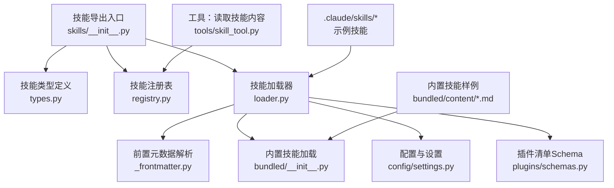
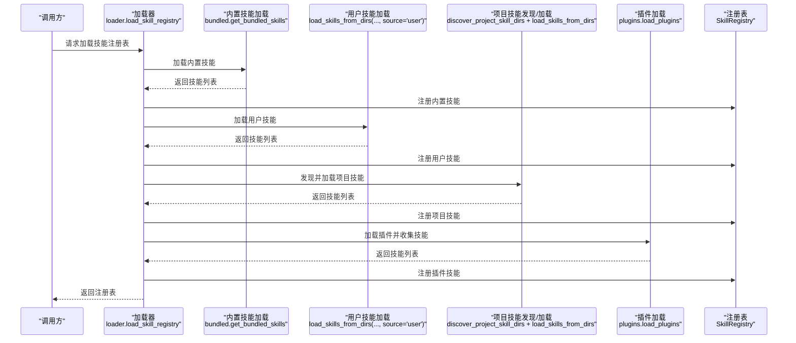
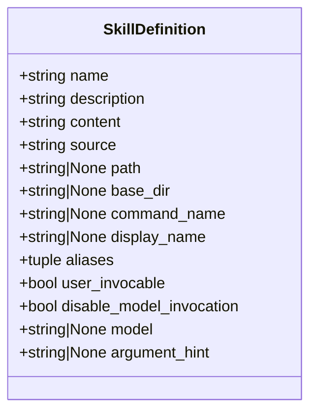
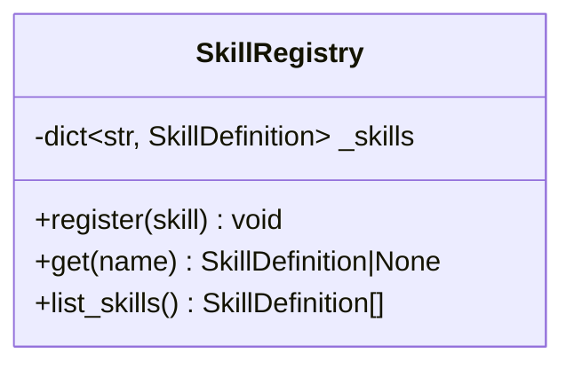
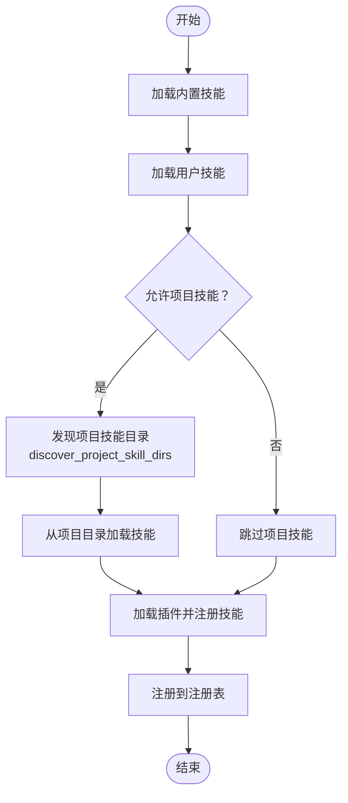
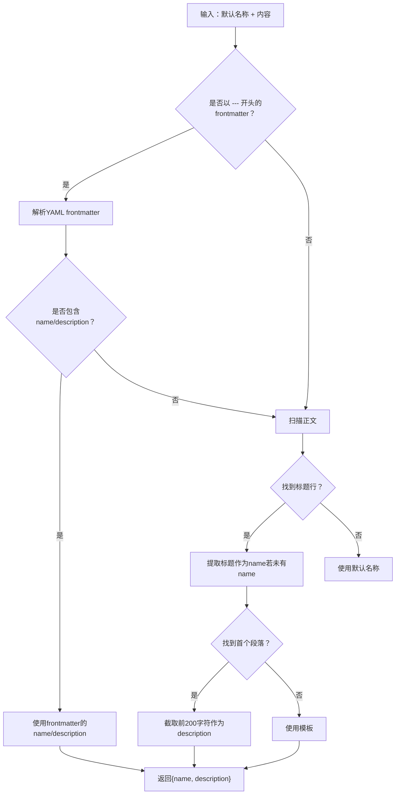
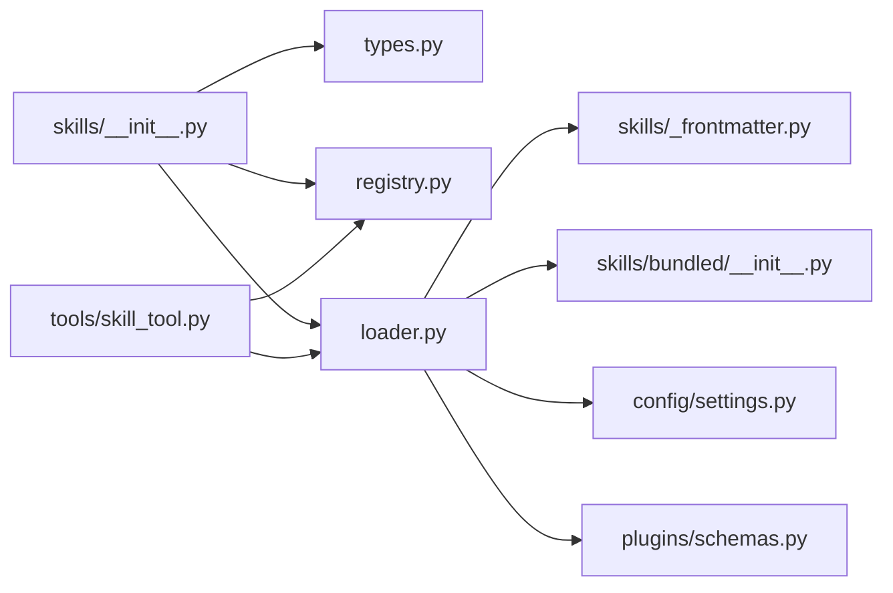
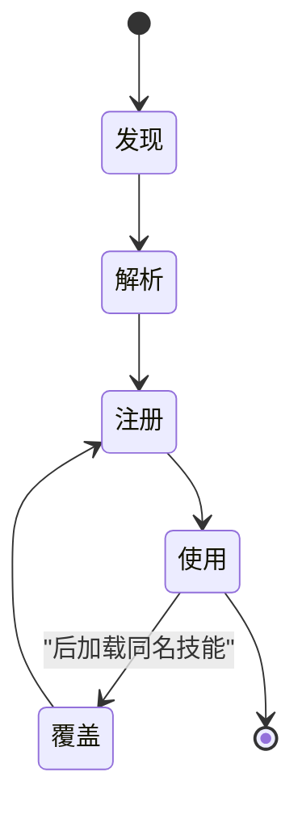

# 技能概念与架构

<cite>
**本文引用的文件**
- [src/openharness/skills/__init__.py](file://src/openharness/skills/__init__.py)
- [src/openharness/skills/types.py](file://src/openharness/skills/types.py)
- [src/openharness/skills/registry.py](file://src/openharness/skills/registry.py)
- [src/openharness/skills/loader.py](file://src/openharness/skills/loader.py)
- [src/openharness/skills/_frontmatter.py](file://src/openharness/skills/_frontmatter.py)
- [src/openharness/skills/bundled/__init__.py](file://src/openharness/skills/bundled/__init__.py)
- [src/openharness/tools/skill_tool.py](file://src/openharness/tools/skill_tool.py)
- [src/openharness/plugins/schemas.py](file://src/openharness/plugins/schemas.py)
- [src/openharness/config/settings.py](file://src/openharness/config/settings.py)
- [.claude/skills/harness-eval/SKILL.md](file://.claude/skills/harness-eval/SKILL.md)
- [.claude/skills/pr-merge/SKILL.md](file://.claude/skills/pr-merge/SKILL.md)
- [src/openharness/skills/bundled/content/skill-creator.md](file://src/openharness/skills/bundled/content/skill-creator.md)
- [tests/test_skills/test_loader.py](file://tests/test_skills/test_loader.py)
</cite>

## 目录
1. [引言](#引言)
2. [项目结构](#项目结构)
3. [核心组件](#核心组件)
4. [架构总览](#架构总览)
5. [详细组件分析](#详细组件分析)
6. [依赖关系分析](#依赖关系分析)
7. [性能考量](#性能考量)
8. [故障排查指南](#故障排查指南)
9. [结论](#结论)
10. [附录](#附录)

## 引言
本文件系统性阐述 OpenHarness 中“技能（Skill）”的概念、数据模型、生命周期、来源层次与优先级覆盖机制，以及技能注册表的工作原理与发现/加载流程。通过架构图与数据模型说明，帮助开发者快速理解技能系统的设计理念与实现方式。

## 项目结构
技能系统主要由以下模块构成：
- 数据模型：技能定义类型
- 注册表：按名称索引与查询技能
- 加载器：从多源目录加载技能，解析元数据
- 前置元数据解析：统一处理 YAML frontmatter 与回退策略
- 内置技能：打包在仓库内的默认技能集合
- 工具集成：通过工具读取技能内容
- 插件支持：插件可提供额外技能
- 配置与设置：控制项目技能启用、搜索路径等

图表来源
- [src/openharness/skills/__init__.py:1-45](file://src/openharness/skills/__init__.py#L1-L45)
- [src/openharness/skills/types.py:1-25](file://src/openharness/skills/types.py#L1-L25)
- [src/openharness/skills/registry.py:1-30](file://src/openharness/skills/registry.py#L1-L30)
- [src/openharness/skills/loader.py:1-230](file://src/openharness/skills/loader.py#L1-L230)
- [src/openharness/skills/_frontmatter.py:1-98](file://src/openharness/skills/_frontmatter.py#L1-L98)
- [src/openharness/skills/bundled/__init__.py:1-76](file://src/openharness/skills/bundled/__init__.py#L1-L76)
- [src/openharness/config/settings.py:1-200](file://src/openharness/config/settings.py#L1-L200)
- [src/openharness/plugins/schemas.py:1-25](file://src/openharness/plugins/schemas.py#L1-L25)
- [src/openharness/tools/skill_tool.py:1-44](file://src/openharness/tools/skill_tool.py#L1-L44)

章节来源
- [src/openharness/skills/__init__.py:1-45](file://src/openharness/skills/__init__.py#L1-L45)
- [src/openharness/skills/loader.py:1-230](file://src/openharness/skills/loader.py#L1-L230)

## 核心组件
- 技能定义类型：描述技能的元数据与内容来源
- 技能注册表：以名称为键存储技能，支持别名与命令名映射
- 技能加载器：聚合多源技能，解析元数据，构建注册表
- 前置元数据解析：统一处理 YAML frontmatter、回退标题/段落、折叠/字面量块标量
- 内置技能：打包在仓库内的默认技能集合
- 工具集成：通过工具读取技能内容，支持禁用模型调用的保护逻辑
- 插件支持：插件清单中声明 skills_dir，加载插件提供的技能
- 配置与设置：控制是否允许项目技能、项目技能目录列表等

章节来源
- [src/openharness/skills/types.py:8-25](file://src/openharness/skills/types.py#L8-L25)
- [src/openharness/skills/registry.py:8-30](file://src/openharness/skills/registry.py#L8-L30)
- [src/openharness/skills/loader.py:42-76](file://src/openharness/skills/loader.py#L42-L76)
- [src/openharness/skills/_frontmatter.py:34-98](file://src/openharness/skills/_frontmatter.py#L34-L98)
- [src/openharness/skills/bundled/__init__.py:18-76](file://src/openharness/skills/bundled/__init__.py#L18-L76)
- [src/openharness/tools/skill_tool.py:17-44](file://src/openharness/tools/skill_tool.py#L17-L44)
- [src/openharness/plugins/schemas.py:8-25](file://src/openharness/plugins/schemas.py#L8-L25)
- [src/openharness/config/settings.py:1-200](file://src/openharness/config/settings.py#L1-L200)

## 架构总览
技能系统采用“多源聚合 + 统一注册”的架构：
- 多源：内置、用户、项目、插件
- 聚合顺序：内置 → 用户 → 项目 → 插件；后加载项覆盖更具体的同名技能
- 元数据解析：统一使用前置解析器，确保 YAML frontmatter 的正确性与回退策略
- 查询接口：注册表以名称、命令名、显示名与别名为键进行映射，便于灵活检索

图表来源
- [src/openharness/skills/loader.py:42-76](file://src/openharness/skills/loader.py#L42-L76)
- [src/openharness/skills/bundled/__init__.py:18-43](file://src/openharness/skills/bundled/__init__.py#L18-L43)
- [src/openharness/skills/registry.py:14-29](file://src/openharness/skills/registry.py#L14-L29)

## 详细组件分析

### 技能定义与元数据
- 定义结构：包含名称、描述、内容、来源、路径、基础目录、命令名、显示名、别名、用户可调用标志、禁用模型调用标志、模型名、参数提示等字段
- 元数据来源：优先从 YAML frontmatter 解析；若无，则回退到首行标题与首个段落；最终回退到模板
- 布尔字段解析：支持多种 YAML 布尔值表示，如 1/true/yes/on、0/false/no/off
- 字符串字段：去除空白，空值返回 None

图表来源
- [src/openharness/skills/types.py:8-25](file://src/openharness/skills/types.py#L8-L25)

章节来源
- [src/openharness/skills/types.py:8-25](file://src/openharness/skills/types.py#L8-L25)
- [src/openharness/skills/_frontmatter.py:13-32](file://src/openharness/skills/_frontmatter.py#L13-L32)
- [src/openharness/skills/_frontmatter.py:34-98](file://src/openharness/skills/_frontmatter.py#L34-L98)

### 技能注册表
- 存储结构：以字符串为键，技能为值的字典
- 注册策略：对技能的 name、command_name、display_name 与 aliases 进行映射，支持多键访问
- 列表输出：去重并按命令名或名称排序，区分来源与路径

图表来源
- [src/openharness/skills/registry.py:8-30](file://src/openharness/skills/registry.py#L8-L30)

章节来源
- [src/openharness/skills/registry.py:8-30](file://src/openharness/skills/registry.py#L8-L30)

### 技能加载器与来源层次
- 用户技能：用户配置目录与兼容目录（.claude/skills、.agents/skills）
- 项目技能：从当前工作目录向上遍历至 Git 根或家目录，收集 .openharness/skills、.agents/skills、.claude/skills 等目录
- 插件技能：加载启用的插件，读取其清单中的 skills_dir 并注册
- 内置技能：打包在仓库内，作为默认技能集

图表来源
- [src/openharness/skills/loader.py:42-76](file://src/openharness/skills/loader.py#L42-L76)
- [src/openharness/skills/loader.py:83-123](file://src/openharness/skills/loader.py#L83-L123)
- [src/openharness/skills/loader.py:153-206](file://src/openharness/skills/loader.py#L153-L206)
- [src/openharness/skills/bundled/__init__.py:18-43](file://src/openharness/skills/bundled/__init__.py#L18-L43)

章节来源
- [src/openharness/skills/loader.py:30-76](file://src/openharness/skills/loader.py#L30-L76)
- [src/openharness/skills/loader.py:83-123](file://src/openharness/skills/loader.py#L83-L123)
- [src/openharness/skills/loader.py:153-206](file://src/openharness/skills/loader.py#L153-L206)
- [src/openharness/skills/bundled/__init__.py:18-43](file://src/openharness/skills/bundled/__init__.py#L18-L43)

### 元数据解析与回退策略
- YAML frontmatter：使用安全解析，支持折叠块标量（>）与字面量块标量（|），并正确处理缩进与换行
- 回退策略：若无可用 frontmatter，回退到首行标题与首个非标题/分隔线段落；若仍无描述，使用模板
- 布尔与字符串解析：提供宽松的布尔值识别与字符串清理

图表来源
- [src/openharness/skills/_frontmatter.py:34-82](file://src/openharness/skills/_frontmatter.py#L34-L82)

章节来源
- [src/openharness/skills/_frontmatter.py:13-32](file://src/openharness/skills/_frontmatter.py#L13-L32)
- [src/openharness/skills/_frontmatter.py:34-98](file://src/openharness/skills/_frontmatter.py#L34-L98)

### 技能来源与优先级覆盖机制
- 来源层次：内置（bundled）→ 用户（user）→ 项目（project）→ 插件（plugin）
- 覆盖规则：后加载者覆盖先加载者的同名技能；项目技能按目录层级从上层到下层递增，越具体越后加载，从而覆盖更广泛的范围
- 项目技能发现：从当前工作目录向上遍历至 Git 根或家目录，收集所有有效相对路径，且忽略绝对路径与包含 .. 的路径

章节来源
- [src/openharness/skills/loader.py:42-76](file://src/openharness/skills/loader.py#L42-L76)
- [src/openharness/skills/loader.py:83-123](file://src/openharness/skills/loader.py#L83-L123)
- [src/openharness/skills/loader.py:126-138](file://src/openharness/skills/loader.py#L126-L138)

### 工具集成与模型调用保护
- 工具：提供按名称读取技能内容的工具，支持大小写不敏感查找
- 模型调用保护：当技能标记禁用模型调用时，工具返回错误信息，提示仅可通过用户命令触发

章节来源
- [src/openharness/tools/skill_tool.py:17-44](file://src/openharness/tools/skill_tool.py#L17-L44)

### 示例技能与使用场景
- 示例技能：harness-eval 与 pr-merge 展示了完整的 YAML frontmatter、描述、工作流与参考材料组织
- 内置技能：skill-creator 提供技能创作规范与验证流程，强调目录结构与元数据的重要性

章节来源
- [.claude/skills/harness-eval/SKILL.md:1-194](file://.claude/skills/harness-eval/SKILL.md#L1-L194)
- [.claude/skills/pr-merge/SKILL.md:1-100](file://.claude/skills/pr-merge/SKILL.md#L1-L100)
- [src/openharness/skills/bundled/content/skill-creator.md:1-176](file://src/openharness/skills/bundled/content/skill-creator.md#L1-L176)

## 依赖关系分析
- 导出入口：skills/__init__.py 将类型、注册表与加载函数统一导出，简化外部导入
- 加载器依赖：前置元数据解析、内置技能加载、配置与设置、插件加载
- 注册表依赖：技能定义类型
- 工具依赖：加载器与注册表

图表来源
- [src/openharness/skills/__init__.py:11-44](file://src/openharness/skills/__init__.py#L11-L44)
- [src/openharness/skills/loader.py:9-19](file://src/openharness/skills/loader.py#L9-L19)
- [src/openharness/skills/bundled/__init__.py:7-13](file://src/openharness/skills/bundled/__init__.py#L7-L13)
- [src/openharness/plugins/schemas.py:8-25](file://src/openharness/plugins/schemas.py#L8-L25)
- [src/openharness/tools/skill_tool.py:7-8](file://src/openharness/tools/skill_tool.py#L7-L8)

章节来源
- [src/openharness/skills/__init__.py:11-44](file://src/openharness/skills/__init__.py#L11-L44)
- [src/openharness/skills/loader.py:9-19](file://src/openharness/skills/loader.py#L9-L19)

## 性能考量
- 目录扫描与文件读取：按需扫描与去重，避免重复加载同一路径
- YAML 解析：仅在存在 frontmatter 分隔符时解析，减少不必要的解析开销
- 注册表查询：字典查找 O(1)，支持多键映射，查询高效
- 项目技能发现：向上遍历至 Git 根或家目录，避免无效路径扫描

## 故障排查指南
- 技能未被加载
  - 检查是否位于正确的目录结构（每个技能需在独立目录下包含 SKILL.md）
  - 确认项目技能开关与项目技能目录配置
  - 使用内置工具验证加载结果
- YAML frontmatter 解析失败
  - 检查 frontmatter 是否使用正确的分隔符与合法的 YAML 结构
  - 若 frontmatter 不合法，系统会回退到正文解析，不会崩溃
- 技能被覆盖
  - 确认项目技能目录层级与覆盖顺序，越具体越后加载
  - 检查是否存在同名技能在更高层级被加载
- 模型调用被拒绝
  - 检查技能元数据中禁用模型调用标志，确认仅通过用户命令触发

章节来源
- [tests/test_skills/test_loader.py:15-28](file://tests/test_skills/test_loader.py#L15-L28)
- [tests/test_skills/test_loader.py:38-51](file://tests/test_skills/test_loader.py#L38-L51)
- [tests/test_skills/test_loader.py:116-130](file://tests/test_skills/test_loader.py#L116-L130)
- [tests/test_skills/test_loader.py:132-141](file://tests/test_skills/test_loader.py#L132-L141)
- [tests/test_skills/test_loader.py:164-181](file://tests/test_skills/test_loader.py#L164-L181)
- [src/openharness/tools/skill_tool.py:34-43](file://src/openharness/tools/skill_tool.py#L34-L43)

## 结论
OpenHarness 的技能系统通过“多源聚合 + 统一注册 + 明确覆盖规则”的设计，实现了从内置、用户、项目到插件的完整技能生态。统一的元数据解析与严格的来源层次保证了技能的一致性与可维护性。开发者可依据本文档快速理解并扩展技能系统，构建可复用、可验证的技能资产。

## 附录
- 技能生命周期（概念性）
  - 发现：扫描多源目录，定位 SKILL.md
  - 解析：提取元数据与内容，应用回退策略
  - 注册：登记到注册表，建立多键映射
  - 使用：通过工具或代理调用，遵循用户可调用与模型调用保护策略
  - 覆盖：后加载项覆盖更广泛的同名技能

[此图为概念性流程，无需图表来源]