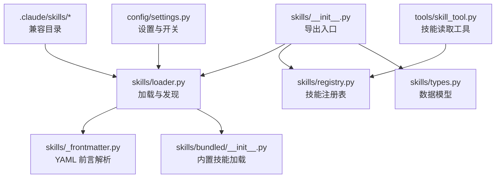
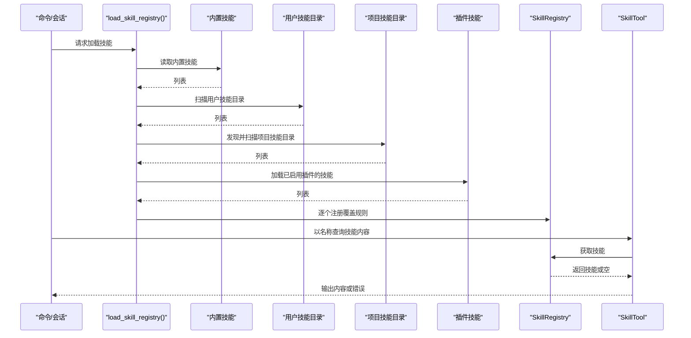
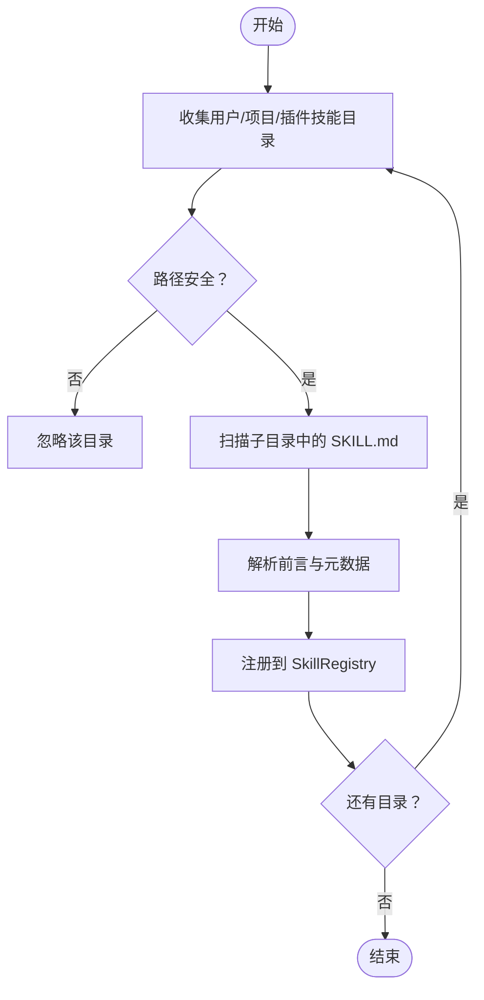
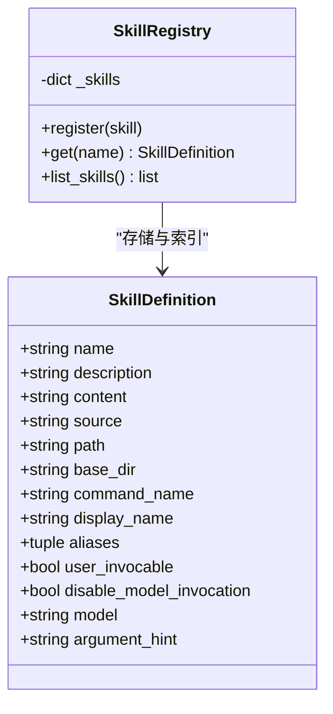
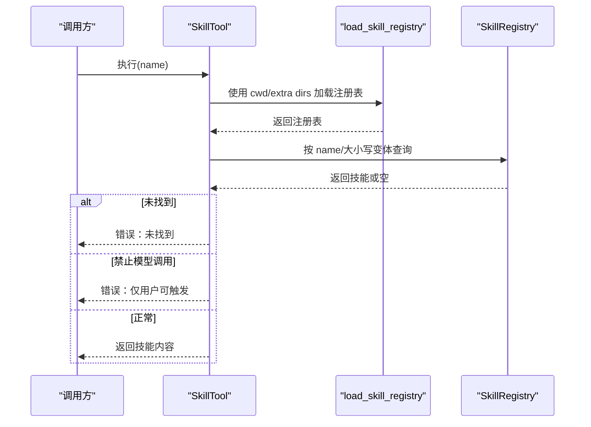
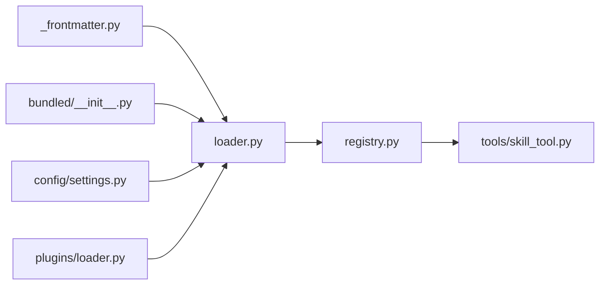

# 技能系统

<cite>
**本文引用的文件**
- [src/openharness/skills/__init__.py](file://src/openharness/skills/__init__.py)
- [src/openharness/skills/loader.py](file://src/openharness/skills/loader.py)
- [src/openharness/skills/registry.py](file://src/openharness/skills/registry.py)
- [src/openharness/skills/types.py](file://src/openharness/skills/types.py)
- [src/openharness/skills/_frontmatter.py](file://src/openharness/skills/_frontmatter.py)
- [src/openharness/skills/bundled/__init__.py](file://src/openharness/skills/bundled/__init__.py)
- [src/openharness/tools/skill_tool.py](file://src/openharness/tools/skill_tool.py)
- [.claude/skills/harness-eval/SKILL.md](file://.claude/skills/harness-eval/SKILL.md)
- [.claude/skills/pr-merge/SKILL.md](file://.claude/skills/pr-merge/SKILL.md)
- [src/openharness/skills/bundled/content/skill-creator.md](file://src/openharness/skills/bundled/content/skill-creator.md)
- [src/openharness/config/settings.py](file://src/openharness/config/settings.py)
- [tests/test_skills/test_loader.py](file://tests/test_skills/test_loader.py)
- [scripts/test_real_skills_plugins.py](file://scripts/test_real_skills_plugins.py)
</cite>

## 目录
1. [引言](#引言)
2. [项目结构](#项目结构)
3. [核心组件](#核心组件)
4. [架构总览](#架构总览)
5. [详细组件分析](#详细组件分析)
6. [依赖关系分析](#依赖关系分析)
7. [性能考量](#性能考量)
8. [故障排查指南](#故障排查指南)
9. [结论](#结论)
10. [附录](#附录)

## 引言
本文件系统化阐述 OpenHarness 的“技能（Skill）”体系：技能的概念与作用、与传统代理的区别、加载与发现机制、优先级管理、来源层次（内置、用户、项目、插件）、启用/禁用机制、与 anthropics/skills 的兼容性与迁移、开发规范与最佳实践，以及丰富的示例与排障建议。目标是帮助开发者与使用者在不同场景下高效地创建、组织、加载与调用技能。

## 项目结构
技能系统围绕“定义—解析—注册—查询—工具调用”的链路展开，核心位于 skills 子模块，并通过工具层与运行时集成。下图展示与技能系统直接相关的模块与文件：

图表来源
- [src/openharness/skills/__init__.py:1-45](file://src/openharness/skills/__init__.py#L1-L45)
- [src/openharness/skills/loader.py:1-230](file://src/openharness/skills/loader.py#L1-L230)
- [src/openharness/skills/registry.py:1-30](file://src/openharness/skills/registry.py#L1-L30)
- [src/openharness/skills/types.py:1-25](file://src/openharness/skills/types.py#L1-L25)
- [src/openharness/skills/_frontmatter.py:1-98](file://src/openharness/skills/_frontmatter.py#L1-L98)
- [src/openharness/skills/bundled/__init__.py:1-76](file://src/openharness/skills/bundled/__init__.py#L1-L76)
- [src/openharness/tools/skill_tool.py:1-44](file://src/openharness/tools/skill_tool.py#L1-L44)
- [src/openharness/config/settings.py:1-200](file://src/openharness/config/settings.py#L1-L200)

章节来源
- [src/openharness/skills/__init__.py:1-45](file://src/openharness/skills/__init__.py#L1-L45)
- [src/openharness/skills/loader.py:1-230](file://src/openharness/skills/loader.py#L1-L230)
- [src/openharness/skills/registry.py:1-30](file://src/openharness/skills/registry.py#L1-L30)
- [src/openharness/skills/types.py:1-25](file://src/openharness/skills/types.py#L1-L25)
- [src/openharness/skills/_frontmatter.py:1-98](file://src/openharness/skills/_frontmatter.py#L1-L98)
- [src/openharness/skills/bundled/__init__.py:1-76](file://src/openharness/skills/bundled/__init__.py#L1-L76)
- [src/openharness/tools/skill_tool.py:1-44](file://src/openharness/tools/skill_tool.py#L1-L44)
- [src/openharness/config/settings.py:1-200](file://src/openharness/config/settings.py#L1-L200)

## 核心组件
- 数据模型：SkillDefinition 描述技能的元信息与行为标志位，如名称、描述、来源、是否允许模型调用、参数提示等。
- 解析器：_frontmatter.py 提供统一的 YAML 前言解析与回退策略，确保 SKILL.md 的 name/description 等字段稳定可用。
- 加载器：loader.py 负责从多源加载技能，包括内置、用户、兼容目录、项目目录与插件提供的技能，并支持安全路径校验与覆盖顺序。
- 注册表：registry.py 将技能按 name/command_name/display_name/aliases 多键索引，便于快速查找与去重。
- 工具：skill_tool.py 提供“按名读取技能内容”的只读工具，结合权限与标志位控制模型调用。
- 内置技能：bundled 子模块加载 src 下的内置技能，作为系统默认能力的一部分。

章节来源
- [src/openharness/skills/types.py:8-25](file://src/openharness/skills/types.py#L8-L25)
- [src/openharness/skills/_frontmatter.py:34-98](file://src/openharness/skills/_frontmatter.py#L34-L98)
- [src/openharness/skills/loader.py:42-230](file://src/openharness/skills/loader.py#L42-L230)
- [src/openharness/skills/registry.py:8-30](file://src/openharness/skills/registry.py#L8-L30)
- [src/openharness/tools/skill_tool.py:17-44](file://src/openharness/tools/skill_tool.py#L17-L44)
- [src/openharness/skills/bundled/__init__.py:18-76](file://src/openharness/skills/bundled/__init__.py#L18-L76)

## 架构总览
技能加载与使用的端到端流程如下：

图表来源
- [src/openharness/skills/loader.py:42-76](file://src/openharness/skills/loader.py#L42-L76)
- [src/openharness/skills/registry.py:14-22](file://src/openharness/skills/registry.py#L14-L22)
- [src/openharness/tools/skill_tool.py:28-43](file://src/openharness/tools/skill_tool.py#L28-L43)

## 详细组件分析

### 组件一：加载与发现（loader.py）
- 用户技能目录：默认位于配置目录下的 skills；同时兼容 ~/.claude/skills 与 ~/.agents/skills。
- 项目技能目录：从当前工作目录向上遍历至 Git 根或用户主目录，收集相对路径中支持的技能目录（默认 .openharness/skills、.agents/skills、.claude/skills），并按层级从低到高排序，保证更近的 cwd 覆盖更远的父级与用户技能。
- 安全性：仅接受非绝对路径且不包含 “..” 的项目技能相对路径，避免越权访问。
- 插件技能：在加载插件后，若插件启用，则将其提供的技能加入注册表。
- 元数据解析：从 SKILL.md 中提取 YAML 前言（name/description），若无则回退到标题与首段；同时解析布尔标志位与可选字符串字段。

图表来源
- [src/openharness/skills/loader.py:83-123](file://src/openharness/skills/loader.py#L83-L123)
- [src/openharness/skills/loader.py:126-151](file://src/openharness/skills/loader.py#L126-L151)
- [src/openharness/skills/loader.py:153-206](file://src/openharness/skills/loader.py#L153-L206)
- [src/openharness/skills/_frontmatter.py:34-82](file://src/openharness/skills/_frontmatter.py#L34-L82)

章节来源
- [src/openharness/skills/loader.py:30-76](file://src/openharness/skills/loader.py#L30-L76)
- [src/openharness/skills/loader.py:83-123](file://src/openharness/skills/loader.py#L83-L123)
- [src/openharness/skills/loader.py:126-151](file://src/openharness/skills/loader.py#L126-L151)
- [src/openharness/skills/loader.py:153-206](file://src/openharness/skills/loader.py#L153-L206)
- [src/openharness/skills/_frontmatter.py:34-82](file://src/openharness/skills/_frontmatter.py#L34-L82)

### 组件二：注册表（registry.py）
- 多键索引：同一技能可按 name、command_name、display_name 及 aliases 查找，提升检索灵活性。
- 去重与排序：按来源与路径唯一化，最终按 command_name 或 name 排序输出。

图表来源
- [src/openharness/skills/types.py:8-25](file://src/openharness/skills/types.py#L8-L25)
- [src/openharness/skills/registry.py:8-30](file://src/openharness/skills/registry.py#L8-L30)

章节来源
- [src/openharness/skills/registry.py:8-30](file://src/openharness/skills/registry.py#L8-L30)
- [src/openharness/skills/types.py:8-25](file://src/openharness/skills/types.py#L8-L25)

### 组件三：工具调用（tools/skill_tool.py）
- 用途：根据名称从当前上下文加载的技能注册表中读取技能内容。
- 行为：若技能存在但禁止模型调用，则返回错误提示，强调只能由用户以命令形式触发；否则返回技能内容。
- 上下文：支持传入 cwd、额外技能目录与插件根目录，以便在不同工作空间中加载一致的技能集。

图表来源
- [src/openharness/tools/skill_tool.py:28-43](file://src/openharness/tools/skill_tool.py#L28-L43)
- [src/openharness/skills/loader.py:42-76](file://src/openharness/skills/loader.py#L42-L76)

章节来源
- [src/openharness/tools/skill_tool.py:17-44](file://src/openharness/tools/skill_tool.py#L17-L44)
- [src/openharness/skills/loader.py:42-76](file://src/openharness/skills/loader.py#L42-L76)

### 组件四：内置技能（bundled）
- 来源：src/openharness/skills/bundled/content/*.md。
- 特点：统一使用前言解析，标志位与用户技能一致，source 标记为 bundled。

章节来源
- [src/openharness/skills/bundled/__init__.py:18-76](file://src/openharness/skills/bundled/__init__.py#L18-L76)

### 组件五：兼容与迁移（anthropics/skills）
- 兼容性：用户可通过脚本将 anthropics/skills 仓库中的 SKILL.md 复制到 OpenHarness 用户技能目录，随后被正常加载。
- 迁移建议：保持 SKILL.md 的 YAML 前言与目录布局，确保 name/description 等字段清晰；必要时调整触发语句与工作流细节以适配 OpenHarness 的工具链与权限模型。

章节来源
- [scripts/test_real_skills_plugins.py:49-136](file://scripts/test_real_skills_plugins.py#L49-L136)

## 依赖关系分析
- 模块耦合
  - loader 依赖 _frontmatter 与 bundled，以及 config/settings 与 plugins/loader（在加载插件时）。
  - registry 依赖 types。
  - skill_tool 依赖 loader 与 registry。
- 关键依赖链
  - SKILL.md → _frontmatter → loader → registry → skill_tool。
  - 插件提供技能 → loader → registry。

图表来源
- [src/openharness/skills/loader.py:9-19](file://src/openharness/skills/loader.py#L9-L19)
- [src/openharness/skills/_frontmatter.py:1-10](file://src/openharness/skills/_frontmatter.py#L1-L10)
- [src/openharness/skills/bundled/__init__.py:7-13](file://src/openharness/skills/bundled/__init__.py#L7-L13)
- [src/openharness/config/settings.py:1-200](file://src/openharness/config/settings.py#L1-L200)
- [src/openharness/skills/registry.py:5](file://src/openharness/skills/registry.py#L5)
- [src/openharness/tools/skill_tool.py:7](file://src/openharness/tools/skill_tool.py#L7)

章节来源
- [src/openharness/skills/loader.py:9-19](file://src/openharness/skills/loader.py#L9-L19)
- [src/openharness/skills/_frontmatter.py:1-10](file://src/openharness/skills/_frontmatter.py#L1-L10)
- [src/openharness/skills/bundled/__init__.py:7-13](file://src/openharness/skills/bundled/__init__.py#L7-L13)
- [src/openharness/config/settings.py:1-200](file://src/openharness/config/settings.py#L1-L200)
- [src/openharness/skills/registry.py:5](file://src/openharness/skills/registry.py#L5)
- [src/openharness/tools/skill_tool.py:7](file://src/openharness/tools/skill_tool.py#L7)

## 性能考量
- I/O 与解析成本：扫描目录、读取 SKILL.md、解析 YAML 前言与正文，均属于轻量文本处理；在大型仓库中，项目技能目录的层级遍历可能带来额外开销。
- 缓存与复用：注册表按名称索引，查询为 O(1)；建议在会话内复用已加载的注册表实例，避免重复扫描。
- 并发与并发安全：当前加载逻辑为顺序扫描与注册，未见显式并发；若未来扩展为多线程/异步，需确保注册表写操作的原子性。
- 路径安全检查：在项目技能目录发现阶段进行严格的安全校验，避免不必要的 I/O 与潜在风险。

[本节为通用指导，无需列出具体文件来源]

## 故障排查指南
- 技能未被加载
  - 检查 SKILL.md 是否位于 <技能目录>/SKILL.md，且目录名为 kebab-case。
  - 确认前言字段 name/description 是否存在，或是否能回退到标题与首段。
  - 若为项目技能，确认路径安全（相对且不含 ..），并处于 Git 根或用户主目录范围内。
- 技能被覆盖
  - 项目技能按 cwd 层级从低到高发现，更近的 cwd 会覆盖父级与用户技能；如出现意外覆盖，请检查项目技能目录层级与命名。
- 禁止模型调用
  - 当 disable-model-invocation 为真时，SkillTool 会拒绝模型调用，仅允许用户以命令形式触发；请检查前言标志位。
- 与 anthropics/skills 的差异
  - 保持 SKILL.md 前言与目录结构；如遇内容过短或描述不充分，可参考内置 skill-creator 的写作规范进行改进。

章节来源
- [tests/test_skills/test_loader.py:116-183](file://tests/test_skills/test_loader.py#L116-L183)
- [src/openharness/skills/_frontmatter.py:34-82](file://src/openharness/skills/_frontmatter.py#L34-L82)
- [src/openharness/tools/skill_tool.py:37-42](file://src/openharness/tools/skill_tool.py#L37-L42)
- [scripts/test_real_skills_plugins.py:88-136](file://scripts/test_real_skills_plugins.py#L88-L136)

## 结论
OpenHarness 的技能系统以“目录 + SKILL.md + YAML 前言”的轻量范式实现跨来源（内置、用户、项目、插件）的统一加载与注册，具备明确的覆盖顺序与安全约束。通过 SkillTool，用户可在会话中按名称检索技能内容，并受标志位与权限控制模型调用。配合内置 skill-creator 的开发规范与 anthropics/skills 的兼容性，开发者可以快速构建高质量、可维护的技能资产。

[本节为总结，无需列出具体文件来源]

## 附录

### 技能来源层次与启用/禁用机制
- 来源层次
  - 内置：随包分发，source=bundled。
  - 用户：~/.openharness/skills 与兼容目录 ~/.claude/skills、~/.agents/skills。
  - 项目：在 Git 仓库中按层级发现，默认支持 .openharness/skills、.agents/skills、.claude/skills。
  - 插件：插件启用后，其提供的技能加入注册表。
- 启用/禁用
  - 项目技能默认开启，可通过设置 allow_project_skills 控制。
  - 插件启用状态由插件自身决定，仅启用的插件技能会被加载。

章节来源
- [src/openharness/skills/loader.py:42-76](file://src/openharness/skills/loader.py#L42-L76)
- [src/openharness/config/settings.py:1-200](file://src/openharness/config/settings.py#L1-L200)

### SKILL.md 开发规范与 Frontmatter 配置
- 文件布局
  - 目录式：每个技能一个目录，包含 SKILL.md，可选 scripts/references/assets。
- Frontmatter 字段
  - 必填：name、description（若无，将回退到标题与首段）。
  - 可选：user-invocable（默认 true）、disable-model-invocation（默认 false）、model、argument-hint。
- 内置参考
  - 可参考内置 skill-creator 的结构与写作规范，涵盖触发词、工作流、规则与验证建议。

章节来源
- [src/openharness/skills/_frontmatter.py:34-98](file://src/openharness/skills/_frontmatter.py#L34-L98)
- [src/openharness/skills/bundled/content/skill-creator.md:37-176](file://src/openharness/skills/bundled/content/skill-creator.md#L37-L176)

### 与 anthropics/skills 的兼容性与迁移
- 兼容性
  - 可将 SKILL.md 直接复制到用户技能目录，随后被正常加载。
- 迁移建议
  - 保持目录结构与前言字段；优化触发语句与工作流细节，使其更贴合 OpenHarness 的工具链与权限模型。
  - 使用内置 skill-creator 的测试步骤验证加载与行为。

章节来源
- [scripts/test_real_skills_plugins.py:49-136](file://scripts/test_real_skills_plugins.py#L49-L136)
- [src/openharness/skills/bundled/content/skill-creator.md:104-131](file://src/openharness/skills/bundled/content/skill-creator.md#L104-L131)

### 示例与最佳实践
- 示例
  - harness-eval：端到端验证工作流与长时任务建议。
  - pr-merge：贡献者优先的 PR 合并流程与注意事项。
- 最佳实践
  - 触发词应具体且略带断言性；工作流采用简洁祈使句；必要时将长材料放入 references。
  - 对外暴露的技能应经过质量检查（内容长度、描述完整性）。
  - 在会话中先通过 SkillTool 验证加载与内容，再进行集成测试。

章节来源
- [.claude/skills/harness-eval/SKILL.md:1-194](file://.claude/skills/harness-eval/SKILL.md#L1-L194)
- [.claude/skills/pr-merge/SKILL.md:1-100](file://.claude/skills/pr-merge/SKILL.md#L1-L100)
- [scripts/test_real_skills_plugins.py:88-136](file://scripts/test_real_skills_plugins.py#L88-L136)