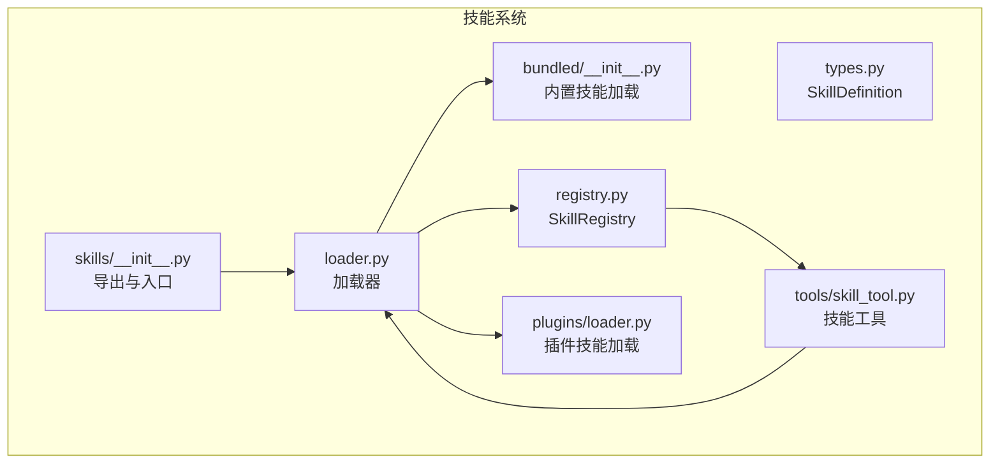
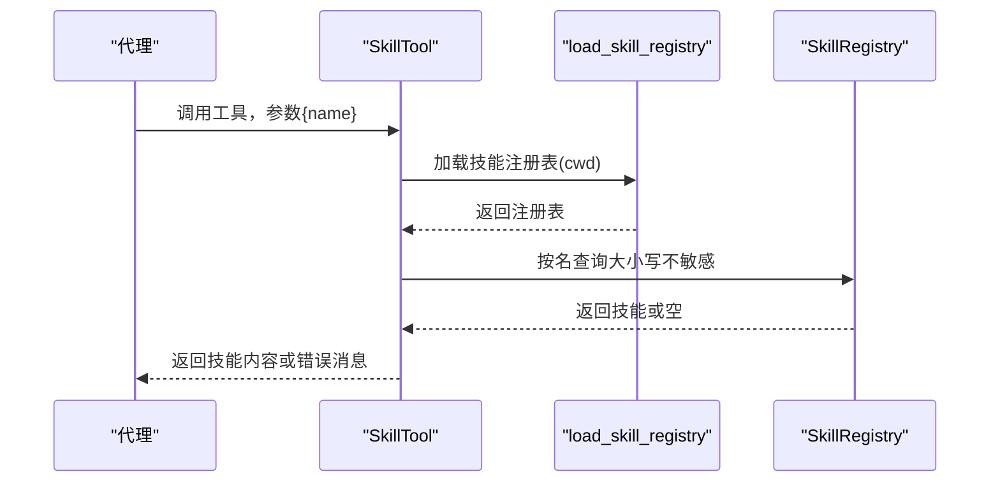
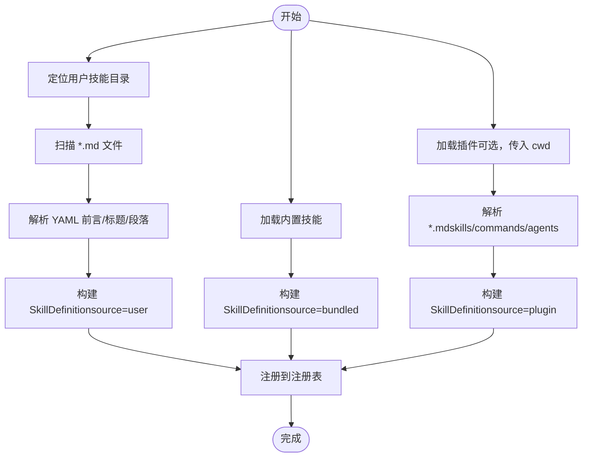
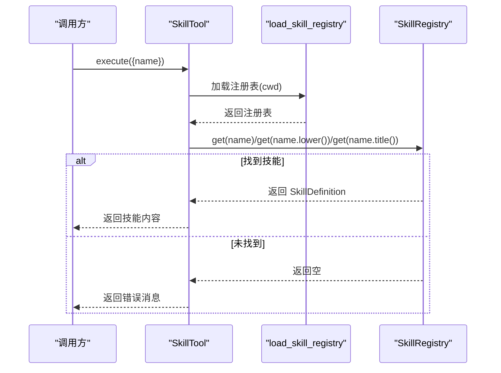
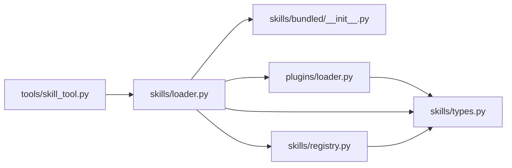

# 技能系统

<cite>
**本文引用的文件**
- [src/openharness/skills/__init__.py](file://src/openharness/skills/__init__.py)
- [src/openharness/skills/loader.py](file://src/openharness/skills/loader.py)
- [src/openharness/skills/registry.py](file://src/openharness/skills/registry.py)
- [src/openharness/skills/types.py](file://src/openharness/skills/types.py)
- [src/openharness/skills/bundled/__init__.py](file://src/openharness/skills/bundled/__init__.py)
- [src/openharness/skills/bundled/content/commit.md](file://src/openharness/skills/bundled/content/commit.md)
- [src/openharness/skills/bundled/content/debug.md](file://src/openharness/skills/bundled/content/debug.md)
- [src/openharness/skills/bundled/content/plan.md](file://src/openharness/skills/bundled/content/plan.md)
- [src/openharness/skills/bundled/content/review.md](file://src/openharness/skills/bundled/content/review.md)
- [src/openharness/skills/bundled/content/simplify.md](file://src/openharness/skills/bundled/content/simplify.md)
- [src/openharness/skills/bundled/content/test.md](file://src/openharness/skills/bundled/content/test.md)
- [src/openharness/tools/skill_tool.py](file://src/openharness/tools/skill_tool.py)
- [src/openharness/plugins/loader.py](file://src/openharness/plugins/loader.py)
- [src/openharness/plugins/schemas.py](file://src/openharness/plugins/schemas.py)
- [src/openharness/config/settings.py](file://src/openharness/config/settings.py)
- [tests/test_skills/test_loader.py](file://tests/test_skills/test_loader.py)
</cite>

## 目录
1. [简介](#简介)
2. [项目结构](#项目结构)
3. [核心组件](#核心组件)
4. [架构总览](#架构总览)
5. [详细组件分析](#详细组件分析)
6. [依赖分析](#依赖分析)
7. [性能考量](#性能考量)
8. [故障排查指南](#故障排查指南)
9. [结论](#结论)
10. [附录](#附录)

## 简介
本章节概述 OpenHarness 技能系统的目标与定位：以“可发现、可加载、可执行”的 Markdown 技能为核心，支持内置技能、用户自定义技能以及插件扩展技能三类来源；通过统一的注册表管理技能元数据与内容，并在代理执行流程中以工具形式按名称检索技能内容，从而实现“按需触发、即取即用”的能力。

技能系统与 anthropics/skills 的兼容性体现在：
- 文件格式与头部字段解析：支持 YAML 前言（YAML frontmatter）与 Markdown 标题/段落回退解析，命名与描述提取逻辑与常见约定一致。
- 加载路径与优先级：内置 > 用户目录 > 插件目录，与外部生态的“默认 + 扩展”思路一致。
- 工具化调用：通过工具接口按名称检索技能内容，便于在代理循环中统一调度。

## 项目结构
技能系统主要由以下模块组成：
- 数据模型：技能定义类型
- 注册表：集中存储与查询技能
- 加载器：负责从多源加载技能（内置、用户、插件）
- 工具：在代理执行时按名称读取技能内容
- 插件系统：扩展技能来源（commands/agents/hooks 下的技能）
- 测试：验证加载行为与来源标记

图表来源
- [src/openharness/skills/__init__.py:1-31](file://src/openharness/skills/__init__.py#L1-L31)
- [src/openharness/skills/loader.py:1-97](file://src/openharness/skills/loader.py#L1-L97)
- [src/openharness/skills/registry.py:1-25](file://src/openharness/skills/registry.py#L1-L25)
- [src/openharness/skills/types.py:1-17](file://src/openharness/skills/types.py#L1-L17)
- [src/openharness/skills/bundled/__init__.py:1-45](file://src/openharness/skills/bundled/__init__.py#L1-L45)
- [src/openharness/plugins/loader.py:1-195](file://src/openharness/plugins/loader.py#L1-L195)
- [src/openharness/tools/skill_tool.py:1-34](file://src/openharness/tools/skill_tool.py#L1-L34)

章节来源
- [src/openharness/skills/__init__.py:1-31](file://src/openharness/skills/__init__.py#L1-L31)
- [src/openharness/skills/loader.py:1-97](file://src/openharness/skills/loader.py#L1-L97)
- [src/openharness/skills/registry.py:1-25](file://src/openharness/skills/registry.py#L1-L25)
- [src/openharness/skills/types.py:1-17](file://src/openharness/skills/types.py#L1-L17)
- [src/openharness/skills/bundled/__init__.py:1-45](file://src/openharness/skills/bundled/__init__.py#L1-L45)
- [src/openharness/plugins/loader.py:1-195](file://src/openharness/plugins/loader.py#L1-L195)
- [src/openharness/tools/skill_tool.py:1-34](file://src/openharness/tools/skill_tool.py#L1-L34)

## 核心组件
- 技能定义（SkillDefinition）：包含名称、描述、内容、来源（bundled/user/plugin）、路径等字段，用于统一承载技能信息。
- 技能注册表（SkillRegistry）：提供注册、按名查询、列出全部技能的能力，内部以名称为键存储。
- 技能加载器（loader）：负责从内置目录、用户目录、插件目录加载技能，并构建注册表；同时提供用户技能目录定位与 Markdown 解析（含 YAML 前言与标题/段落回退）。
- 技能工具（SkillTool）：在代理执行上下文中，按名称查找技能内容并返回，支持大小写不敏感的名称匹配。
- 插件技能加载（plugins/loader）：从插件的 skills/、commands/、agents/ 等目录加载 Markdown 技能，统一纳入注册表。

章节来源
- [src/openharness/skills/types.py:1-17](file://src/openharness/skills/types.py#L1-L17)
- [src/openharness/skills/registry.py:1-25](file://src/openharness/skills/registry.py#L1-L25)
- [src/openharness/skills/loader.py:1-97](file://src/openharness/skills/loader.py#L1-L97)
- [src/openharness/tools/skill_tool.py:1-34](file://src/openharness/tools/skill_tool.py#L1-L34)
- [src/openharness/plugins/loader.py:1-195](file://src/openharness/plugins/loader.py#L1-L195)

## 架构总览
技能系统采用“多源加载 + 统一注册 + 工具调用”的架构：
- 多源加载：内置技能（随应用分发）、用户技能（用户配置目录）、插件技能（插件包内）。
- 注册中心：以名称为键的字典，支持大小写不敏感的查询。
- 工具接口：在代理循环中以工具形式调用，按名称返回技能内容。

图表来源
- [src/openharness/tools/skill_tool.py:28-33](file://src/openharness/tools/skill_tool.py#L28-L33)
- [src/openharness/skills/loader.py:21-37](file://src/openharness/skills/loader.py#L21-L37)
- [src/openharness/skills/registry.py:18-24](file://src/openharness/skills/registry.py#L18-L24)

## 详细组件分析

### 数据模型：SkillDefinition
- 字段含义：名称、描述、内容、来源（bundled/user/plugin）、路径（可选）。
- 设计要点：使用不可变数据类，确保注册表中的技能对象稳定；source 字段用于区分来源，便于调试与权限控制。

章节来源
- [src/openharness/skills/types.py:8-17](file://src/openharness/skills/types.py#L8-L17)

### 注册表：SkillRegistry
- 功能：注册技能、按名查询、列出全部技能（按名称排序）。
- 设计要点：以名称为键，保证 O(1) 查询；列表输出有序，便于 UI 展示与一致性。

章节来源
- [src/openharness/skills/registry.py:8-25](file://src/openharness/skills/registry.py#L8-L25)

### 加载器：多源加载与解析
- 用户技能目录：位于用户配置目录下的 skills 子目录，扫描 *.md 并解析 YAML 前言或标题/段落提取名称与描述。
- 内置技能：从 bundled/content 目录加载，按文件名作为默认名称，标题/首段提取描述。
- 插件技能：从插件的 skills/、commands/、agents/ 等目录加载，统一标记为 plugin 来源。
- 注册表构建：先注册内置技能，再注册用户技能，最后根据设置加载插件技能（若传入 cwd）。

图表来源
- [src/openharness/skills/loader.py:14-55](file://src/openharness/skills/loader.py#L14-L55)
- [src/openharness/skills/bundled/__init__.py:12-29](file://src/openharness/skills/bundled/__init__.py#L12-L29)
- [src/openharness/plugins/loader.py:109-125](file://src/openharness/plugins/loader.py#L109-L125)

章节来源
- [src/openharness/skills/loader.py:21-37](file://src/openharness/skills/loader.py#L21-L37)
- [src/openharness/skills/bundled/__init__.py:12-44](file://src/openharness/skills/bundled/__init__.py#L12-L44)
- [src/openharness/plugins/loader.py:53-106](file://src/openharness/plugins/loader.py#L53-L106)

### 技能工具：按名称读取技能内容
- 工具名称与描述：用于在代理工具链中识别该工具。
- 只读属性：技能读取不改变状态。
- 执行逻辑：加载注册表，按名称查询（大小写不敏感），返回内容或错误消息。

图表来源
- [src/openharness/tools/skill_tool.py:28-33](file://src/openharness/tools/skill_tool.py#L28-L33)

章节来源
- [src/openharness/tools/skill_tool.py:17-33](file://src/openharness/tools/skill_tool.py#L17-L33)

### 插件技能加载：与工具系统的集成
- 插件清单（manifest）：定义 skills_dir、hooks_file、mcp_file 等字段，决定技能目录与钩子/服务位置。
- 技能发现：从 skills/、commands/、agents/ 等目录加载 Markdown 技能，统一标记为 plugin 来源。
- 设置驱动：是否启用插件由设置中的 enabled_plugins 控制，仅启用的插件才会被加载。

章节来源
- [src/openharness/plugins/schemas.py:8-24](file://src/openharness/plugins/schemas.py#L8-L24)
- [src/openharness/plugins/loader.py:53-106](file://src/openharness/plugins/loader.py#L53-L106)
- [src/openharness/config/settings.py:63-63](file://src/openharness/config/settings.py#L63-L63)

### 内置技能：内容与使用场景
内置技能位于 bundled/content 目录，每份 Markdown 文件代表一个技能，包含：
- 标题：技能名称
- 描述：技能用途简述
- 使用场景：何时使用该技能
- 工作流：步骤化的操作指南
- 规则：最佳实践与注意事项

示例技能（文件路径）：
- 提交（commit）：[commit.md:1-26](file://src/openharness/skills/bundled/content/commit.md#L1-L26)
- 调试（debug）：[debug.md:1-26](file://src/openharness/skills/bundled/content/debug.md#L1-L26)
- 计划（plan）：[plan.md:1-35](file://src/openharness/skills/bundled/content/plan.md#L1-L35)
- 评审（review）：[review.md:1-27](file://src/openharness/skills/bundled/content/review.md#L1-L27)
- 简化（simplify）：[simplify.md:1-27](file://src/openharness/skills/bundled/content/simplify.md#L1-L27)
- 测试（test）：[test.md:1-32](file://src/openharness/skills/bundled/content/test.md#L1-L32)

章节来源
- [src/openharness/skills/bundled/content/commit.md:1-26](file://src/openharness/skills/bundled/content/commit.md#L1-L26)
- [src/openharness/skills/bundled/content/debug.md:1-26](file://src/openharness/skills/bundled/content/debug.md#L1-L26)
- [src/openharness/skills/bundled/content/plan.md:1-35](file://src/openharness/skills/bundled/content/plan.md#L1-L35)
- [src/openharness/skills/bundled/content/review.md:1-27](file://src/openharness/skills/bundled/content/review.md#L1-L27)
- [src/openharness/skills/bundled/content/simplify.md:1-27](file://src/openharness/skills/bundled/content/simplify.md#L1-L27)
- [src/openharness/skills/bundled/content/test.md:1-32](file://src/openharness/skills/bundled/content/test.md#L1-L32)

## 依赖分析
- 模块耦合
  - loader 依赖 bundled、registry、types，以及插件加载器（当传入 cwd 时）。
  - tools/skill_tool 依赖 loader 与 registry。
  - plugins/loader 依赖 _parse_skill_markdown 与 types。
- 关键依赖链
  - 加载器 → 注册表 → 工具
  - 插件加载器 → 注册表
  - 工具 → 加载器 → 注册表

图表来源
- [src/openharness/skills/loader.py:21-37](file://src/openharness/skills/loader.py#L21-L37)
- [src/openharness/skills/bundled/__init__.py:12-29](file://src/openharness/skills/bundled/__init__.py#L12-L29)
- [src/openharness/skills/registry.py:1-25](file://src/openharness/skills/registry.py#L1-L25)
- [src/openharness/plugins/loader.py:53-106](file://src/openharness/plugins/loader.py#L53-L106)
- [src/openharness/tools/skill_tool.py:28-33](file://src/openharness/tools/skill_tool.py#L28-L33)

章节来源
- [src/openharness/skills/loader.py:1-97](file://src/openharness/skills/loader.py#L1-L97)
- [src/openharness/plugins/loader.py:1-195](file://src/openharness/plugins/loader.py#L1-L195)
- [src/openharness/tools/skill_tool.py:1-34](file://src/openharness/tools/skill_tool.py#L1-L34)

## 性能考量
- 加载复杂度
  - 用户技能与插件技能：O(N) 遍历与解析（N 为 Markdown 文件数）。
  - 内置技能：固定数量，开销极低。
  - 查询复杂度：注册表按名查询为 O(1)，整体性能优异。
- I/O 优化建议
  - 将常用技能放置于用户目录或插件目录，避免频繁重载。
  - 合理组织插件目录，减少不必要的扫描层级。
- 缓存策略
  - 在代理会话期间复用已加载的注册表实例，避免重复构建。

## 故障排查指南
- 技能未显示
  - 检查用户技能目录是否存在且包含 *.md 文件。
  - 确认 YAML 前言或标题/段落是否正确，以便提取名称与描述。
- 名称不匹配
  - 工具查询支持大小写不敏感匹配，确认输入名称与技能实际名称一致。
- 插件技能未加载
  - 检查插件清单（plugin.json 或 .claude-plugin/plugin.json）是否存在。
  - 确认设置中 enabled_plugins 对应插件已启用。
- 单元测试参考
  - 验证内置技能是否被加载：[tests/test_skills/test_loader.py:10-17](file://tests/test_skills/test_loader.py#L10-L17)
  - 验证用户技能是否被加载并标记为 user：[tests/test_skills/test_loader.py:19-29](file://tests/test_skills/test_loader.py#L19-L29)

章节来源
- [tests/test_skills/test_loader.py:1-30](file://tests/test_skills/test_loader.py#L1-L30)
- [src/openharness/skills/loader.py:40-55](file://src/openharness/skills/loader.py#L40-L55)
- [src/openharness/plugins/loader.py:29-50](file://src/openharness/plugins/loader.py#L29-L50)
- [src/openharness/config/settings.py:63-63](file://src/openharness/config/settings.py#L63-L63)

## 结论
OpenHarness 技能系统以简洁的 Markdown 技能文件为载体，通过统一的数据模型与注册表实现多源加载与查询；配合工具接口，可在代理执行流程中灵活触发技能内容。内置技能覆盖常见开发任务，用户与插件可扩展更多场景，形成“默认 + 扩展”的开放生态。

## 附录

### 技能文件格式规范
- 文件类型：Markdown（*.md）
- 内容结构：标题（# 标题）用于名称；首段用于描述；正文包含使用场景、工作流、规则等。
- YAML 前言（可选）：使用 YAML frontmatter（--- ... ---）声明 name 与 description，将覆盖标题/段落提取结果。
- 来源标记：内置（bundled）、用户（user）、插件（plugin），用于区分与审计。

章节来源
- [src/openharness/skills/loader.py:58-96](file://src/openharness/skills/loader.py#L58-L96)
- [src/openharness/skills/bundled/__init__.py:32-44](file://src/openharness/skills/bundled/__init__.py#L32-L44)

### 技能开发指南
- 模板与结构
  - 使用标题作为技能名称，首段作为简要描述。
  - 正文分为“使用场景”、“工作流”、“规则”等部分，保持条理清晰。
- 最佳实践
  - 名称简洁明确，避免歧义；描述准确概括用途。
  - 工作流步骤具体可执行，规则提炼为可遵循的约束。
  - 与现有工具/插件协作，避免重复造轮子。
- 发布与分发
  - 内置技能：提交至 bundled/content 目录，随版本发布。
  - 用户技能：放置于用户配置目录的 skills 子目录。
  - 插件技能：在插件包内按约定目录存放 Markdown 技能文件。

章节来源
- [src/openharness/skills/bundled/content/commit.md:1-26](file://src/openharness/skills/bundled/content/commit.md#L1-L26)
- [src/openharness/skills/bundled/content/debug.md:1-26](file://src/openharness/skills/bundled/content/debug.md#L1-L26)
- [src/openharness/skills/bundled/content/plan.md:1-35](file://src/openharness/skills/bundled/content/plan.md#L1-L35)
- [src/openharness/skills/bundled/content/review.md:1-27](file://src/openharness/skills/bundled/content/review.md#L1-L27)
- [src/openharness/skills/bundled/content/simplify.md:1-27](file://src/openharness/skills/bundled/content/simplify.md#L1-L27)
- [src/openharness/skills/bundled/content/test.md:1-32](file://src/openharness/skills/bundled/content/test.md#L1-L32)

### 与工具系统的集成
- 在代理循环中，通过工具接口调用技能工具，传入技能名称即可获取技能内容。
- 工具为只读操作，适合在提示词工程与决策阶段引用技能内容。

章节来源
- [src/openharness/tools/skill_tool.py:17-33](file://src/openharness/tools/skill_tool.py#L17-L33)