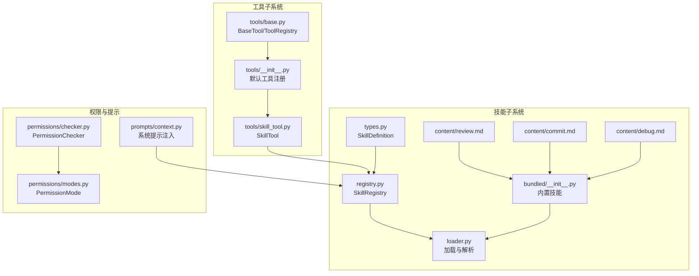
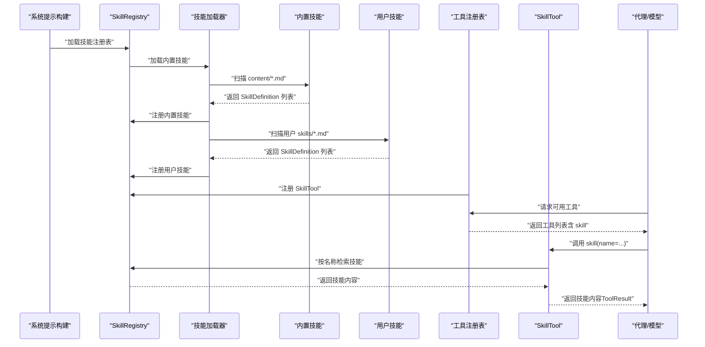
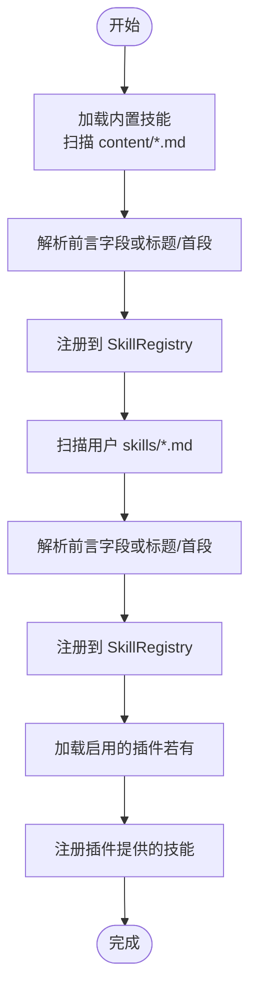
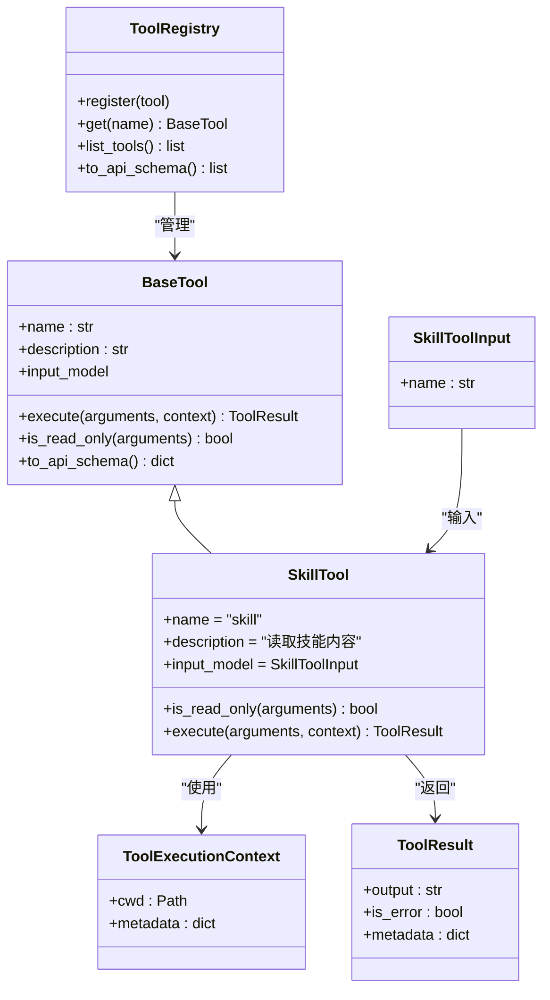
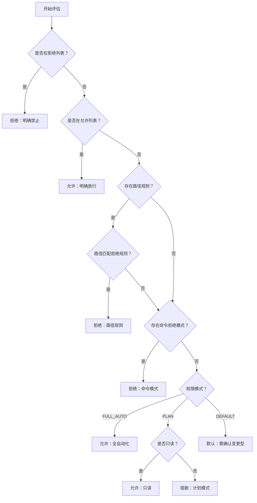
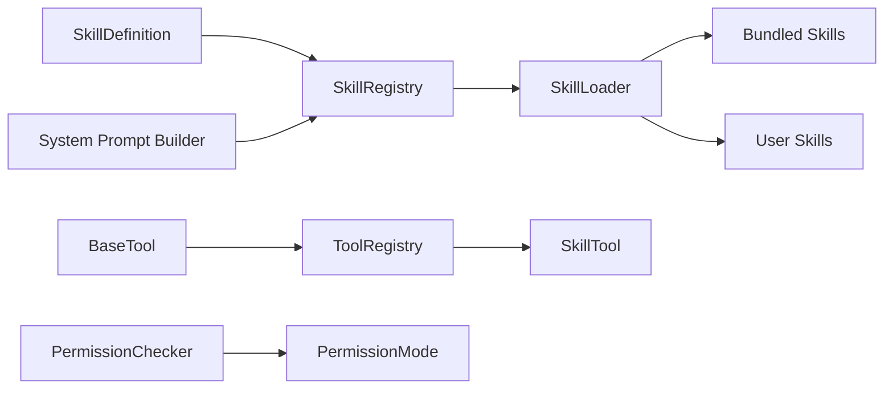

# 技能集成与使用

<cite>
**本文引用的文件**
- [skills/__init__.py](file://src/openharness/skills/__init__.py)
- [skills/loader.py](file://src/openharness/skills/loader.py)
- [skills/registry.py](file://src/openharness/skills/registry.py)
- [skills/types.py](file://src/openharness/skills/types.py)
- [skills/bundled/__init__.py](file://src/openharness/skills/bundled/__init__.py)
- [skills/bundled/content/review.md](file://src/openharness/skills/bundled/content/review.md)
- [skills/bundled/content/commit.md](file://src/openharness/skills/bundled/content/commit.md)
- [skills/bundled/content/debug.md](file://src/openharness/skills/bundled/content/debug.md)
- [tools/skill_tool.py](file://src/openharness/tools/skill_tool.py)
- [tools/base.py](file://src/openharness/tools/base.py)
- [tools/__init__.py](file://src/openharness/tools/__init__.py)
- [permissions/checker.py](file://src/openharness/permissions/checker.py)
- [permissions/modes.py](file://src/openharness/permissions/modes.py)
- [prompts/context.py](file://src/openharness/prompts/context.py)
- [tests/test_skills/test_loader.py](file://tests/test_skills/test_loader.py)
- [tests/test_tools/test_integration_flows.py](file://tests/test_tools/test_integration_flows.py)
- [scripts/test_harness_features.py](file://scripts/test_harness_features.py)
- [scripts/test_real_skills_plugins.py](file://scripts/test_real_skills_plugins.py)
</cite>

## 目录
1. [简介](#简介)
2. [项目结构](#项目结构)
3. [核心组件](#核心组件)
4. [架构总览](#架构总览)
5. [详细组件分析](#详细组件分析)
6. [依赖关系分析](#依赖关系分析)
7. [性能考虑](#性能考虑)
8. [故障排查指南](#故障排查指南)
9. [结论](#结论)
10. [附录](#附录)

## 简介
本文件面向使用者与开发者，系统性阐述 OpenHarness 中“技能（Skill）”的加载、注册、调用与权限控制机制，并说明技能如何与工具系统（Tools）协同工作，以在代理循环中触发与执行复杂任务。文档覆盖以下主题：
- 技能在代理循环中的触发与执行路径
- 通过 skill_tool 调用技能的流程与参数传递
- 权限检查与安全策略
- 技能与工具系统的集成方式（组合多个工具）
- 常见使用案例：代码审查、提交信息生成、调试辅助等
- 结果处理与日志记录建议
- 性能优化与资源控制策略
- 技能选择与配置最佳实践

## 项目结构
围绕“技能”的关键目录与文件如下：
- 技能定义与加载：skills/types.py、skills/registry.py、skills/loader.py、skills/bundled/__init__.py
- 技能内容来源：skills/bundled/content/*.md（内置技能）、用户自定义 *.md（位于配置目录下的 skills 子目录）
- 工具系统：tools/base.py、tools/__init__.py、tools/skill_tool.py
- 权限控制：permissions/checker.py、permissions/modes.py
- 系统提示注入：prompts/context.py（将可用技能列表注入到系统提示）

图表来源
- [skills/types.py:8-17](file://src/openharness/skills/types.py#L8-L17)
- [skills/registry.py:8-25](file://src/openharness/skills/registry.py#L8-L25)
- [skills/loader.py:21-37](file://src/openharness/skills/loader.py#L21-L37)
- [skills/bundled/__init__.py:12-29](file://src/openharness/skills/bundled/__init__.py#L12-L29)
- [tools/base.py:30-76](file://src/openharness/tools/base.py#L30-L76)
- [tools/__init__.py:45-92](file://src/openharness/tools/__init__.py#L45-L92)
- [tools/skill_tool.py:17-33](file://src/openharness/tools/skill_tool.py#L17-L33)
- [permissions/checker.py:30-99](file://src/openharness/permissions/checker.py#L30-L99)
- [permissions/modes.py:8-14](file://src/openharness/permissions/modes.py#L8-L14)
- [prompts/context.py:15-31](file://src/openharness/prompts/context.py#L15-L31)

章节来源
- [skills/__init__.py:14-30](file://src/openharness/skills/__init__.py#L14-L30)
- [skills/loader.py:21-37](file://src/openharness/skills/loader.py#L21-L37)
- [skills/bundled/__init__.py:12-29](file://src/openharness/skills/bundled/__init__.py#L12-L29)
- [tools/__init__.py:45-92](file://src/openharness/tools/__init__.py#L45-L92)
- [prompts/context.py:15-31](file://src/openharness/prompts/context.py#L15-L31)

## 核心组件
- 技能数据模型：SkillDefinition（名称、描述、内容、来源、路径）
- 技能注册表：SkillRegistry（按名称注册与检索）
- 技能加载器：加载内置与用户自定义技能，解析 Markdown 前言字段
- 工具基类与注册表：BaseTool、ToolRegistry、ToolExecutionContext、ToolResult
- 技能工具：SkillTool（读取技能内容），作为工具被代理调用
- 权限检查器：PermissionChecker（基于模式与规则评估工具执行许可）
- 系统提示注入：将可用技能清单与调用指引写入系统提示

章节来源
- [skills/types.py:8-17](file://src/openharness/skills/types.py#L8-L17)
- [skills/registry.py:8-25](file://src/openharness/skills/registry.py#L8-L25)
- [skills/loader.py:21-37](file://src/openharness/skills/loader.py#L21-L37)
- [tools/base.py:30-76](file://src/openharness/tools/base.py#L30-L76)
- [tools/skill_tool.py:17-33](file://src/openharness/tools/skill_tool.py#L17-L33)
- [permissions/checker.py:30-99](file://src/openharness/permissions/checker.py#L30-L99)
- [prompts/context.py:15-31](file://src/openharness/prompts/context.py#L15-L31)

## 架构总览
下图展示了从系统提示构建、技能加载、工具注册到代理调用 SkillTool 的整体流程。

图表来源
- [prompts/context.py:15-31](file://src/openharness/prompts/context.py#L15-L31)
- [skills/loader.py:21-37](file://src/openharness/skills/loader.py#L21-L37)
- [skills/bundled/__init__.py:12-29](file://src/openharness/skills/bundled/__init__.py#L12-L29)
- [tools/__init__.py:45-92](file://src/openharness/tools/__init__.py#L45-L92)
- [tools/skill_tool.py:28-33](file://src/openharness/tools/skill_tool.py#L28-L33)

## 详细组件分析

### 技能加载与注册
- 加载顺序：先内置，后用户，再插件（若启用）
- 解析规则：优先解析 YAML 前言字段（name/description），否则回退到首行标题与首段文本
- 注册行为：按技能名称存入注册表，名称大小写不敏感匹配（查询时尝试原名、小写、首字母大写）
- 用户技能目录：位于配置目录下的 skills 子目录，首次访问会自动创建

图表来源
- [skills/loader.py:21-37](file://src/openharness/skills/loader.py#L21-L37)
- [skills/bundled/__init__.py:12-29](file://src/openharness/skills/bundled/__init__.py#L12-L29)
- [skills/loader.py:40-55](file://src/openharness/skills/loader.py#L40-L55)

章节来源
- [skills/loader.py:21-37](file://src/openharness/skills/loader.py#L21-L37)
- [skills/bundled/__init__.py:12-29](file://src/openharness/skills/bundled/__init__.py#L12-L29)
- [skills/loader.py:40-55](file://src/openharness/skills/loader.py#L40-L55)

### 工具系统与 SkillTool
- 工具注册：默认注册大量内置工具，包括 SkillTool；可选注册 MCP 相关工具
- SkillTool 输入：name（技能名称）
- 执行逻辑：根据 cwd 加载技能注册表，按名称检索技能；若未找到，返回错误结果；否则返回技能内容
- 只读属性：is_read_only 返回 True，便于权限检查器识别

图表来源
- [tools/base.py:30-76](file://src/openharness/tools/base.py#L30-L76)
- [tools/skill_tool.py:17-33](file://src/openharness/tools/skill_tool.py#L17-L33)

章节来源
- [tools/__init__.py:45-92](file://src/openharness/tools/__init__.py#L45-L92)
- [tools/skill_tool.py:17-33](file://src/openharness/tools/skill_tool.py#L17-L33)
- [tools/base.py:30-76](file://src/openharness/tools/base.py#L30-L76)

### 权限检查与安全策略
- 模式支持：默认、计划模式（PLAN）、全自动化（FULL_AUTO）
- 评估维度：显式允许/拒绝列表、路径规则（glob 匹配）、命令模式匹配
- 行为规则：
  - 显式拒绝优先
  - 显式允许直接放行
  - 路径规则匹配拒绝
  - 命令模式匹配拒绝
  - 全自动模式放行所有
  - 只读工具直接放行
  - 计划模式阻断变更型工具
  - 默认模式对变更型工具要求确认

图表来源
- [permissions/checker.py:43-99](file://src/openharness/permissions/checker.py#L43-L99)
- [permissions/modes.py:8-14](file://src/openharness/permissions/modes.py#L8-L14)

章节来源
- [permissions/checker.py:30-99](file://src/openharness/permissions/checker.py#L30-L99)
- [permissions/modes.py:8-14](file://src/openharness/permissions/modes.py#L8-L14)

### 系统提示中的技能注入
- 在构建运行时系统提示时，会加载技能注册表并生成“可用技能”列表
- 提示中包含技能名称与简要描述，并指导用户通过 skill(name="...") 调用技能
- 这使得代理在对话中能主动选择合适的技能进行深度执行

章节来源
- [prompts/context.py:15-31](file://src/openharness/prompts/context.py#L15-L31)

### 代理循环中的触发与执行机制
- 工具暴露：工具注册表向代理公开所有可用工具（含 skill）
- 选择与调用：代理根据上下文选择 skill 工具并传入技能名称
- 执行与返回：SkillTool 读取技能内容并返回 ToolResult
- 后续步骤：代理可将技能内容作为上下文继续调用其他工具（如文件读取、搜索、编辑、任务管理等）完成复杂任务

章节来源
- [tools/__init__.py:45-92](file://src/openharness/tools/__init__.py#L45-L92)
- [tools/skill_tool.py:28-33](file://src/openharness/tools/skill_tool.py#L28-L33)

### 参数传递与结果处理
- 参数模型：SkillToolInput（name 字段）
- 上下文：ToolExecutionContext（cwd、metadata），用于加载技能注册表
- 结果模型：ToolResult（output、is_error、metadata）
- 处理建议：
  - 对 is_error=True 的结果进行分支处理
  - 将技能内容作为后续工具调用的上下文输入
  - 在 metadata 中记录技能来源（bundled/user/plugin）以便审计

章节来源
- [tools/skill_tool.py:11-15](file://src/openharness/tools/skill_tool.py#L11-L15)
- [tools/base.py:21-28](file://src/openharness/tools/base.py#L21-L28)
- [tools/skill_tool.py:28-33](file://src/openharness/tools/skill_tool.py#L28-L33)

### 技能与工具系统的组合使用
- 典型流程：代理调用 skill 获取技能内容 → 依据技能工作流调用文件读取/搜索/编辑/任务管理等工具 → 输出最终结果
- 示例场景（概念性说明）：
  - 代码审查：先 skill(review)，再结合文件读取与 grep 搜索定位问题，最后生成评审意见
  - 提交信息生成：先 skill(commit)，再执行 git status/diff，生成符合规范的提交信息
  - 调试辅助：先 skill(debug)，再结合文件读取与搜索定位根因，必要时进行最小修复

章节来源
- [skills/bundled/content/review.md:1-27](file://src/openharness/skills/bundled/content/review.md#L1-L27)
- [skills/bundled/content/commit.md:1-26](file://src/openharness/skills/bundled/content/commit.md#L1-L26)
- [skills/bundled/content/debug.md:1-26](file://src/openharness/skills/bundled/content/debug.md#L1-L26)

### 实际使用案例
- 代码审查：通过 review 技能工作流，结合文件读取与搜索工具，输出结构化反馈
- 提交信息生成：通过 commit 技能工作流，结合 git 工具，生成清晰的提交信息
- 调试辅助：通过 debug 技能工作流，结合文件读取与搜索工具，定位并修复问题
- 集成测试验证：测试覆盖了技能与配置工具在工具注册表中的协同调用

章节来源
- [skills/bundled/content/review.md:1-27](file://src/openharness/skills/bundled/content/review.md#L1-L27)
- [skills/bundled/content/commit.md:1-26](file://src/openharness/skills/bundled/content/commit.md#L1-L26)
- [skills/bundled/content/debug.md:1-26](file://src/openharness/skills/bundled/content/debug.md#L1-L26)
- [tests/test_tools/test_integration_flows.py:100-127](file://tests/test_tools/test_integration_flows.py#L100-L127)

## 依赖关系分析
- 技能子系统内部：类型 → 注册表 → 加载器 → 内置技能 → 用户技能
- 工具子系统：基类与注册表 → 默认注册 → SkillTool
- 权限子系统：检查器 → 模式枚举
- 系统提示：提示构建 → 技能注册表 → 注入可用技能

图表来源
- [skills/types.py:8-17](file://src/openharness/skills/types.py#L8-L17)
- [skills/registry.py:8-25](file://src/openharness/skills/registry.py#L8-L25)
- [skills/loader.py:21-37](file://src/openharness/skills/loader.py#L21-L37)
- [tools/base.py:30-76](file://src/openharness/tools/base.py#L30-L76)
- [tools/__init__.py:45-92](file://src/openharness/tools/__init__.py#L45-L92)
- [tools/skill_tool.py:17-33](file://src/openharness/tools/skill_tool.py#L17-L33)
- [permissions/checker.py:30-99](file://src/openharness/permissions/checker.py#L30-L99)
- [permissions/modes.py:8-14](file://src/openharness/permissions/modes.py#L8-L14)
- [prompts/context.py:15-31](file://src/openharness/prompts/context.py#L15-L31)

章节来源
- [skills/types.py:8-17](file://src/openharness/skills/types.py#L8-L17)
- [skills/registry.py:8-25](file://src/openharness/skills/registry.py#L8-L25)
- [skills/loader.py:21-37](file://src/openharness/skills/loader.py#L21-L37)
- [tools/base.py:30-76](file://src/openharness/tools/base.py#L30-L76)
- [tools/__init__.py:45-92](file://src/openharness/tools/__init__.py#L45-L92)
- [tools/skill_tool.py:17-33](file://src/openharness/tools/skill_tool.py#L17-L33)
- [permissions/checker.py:30-99](file://src/openharness/permissions/checker.py#L30-L99)
- [permissions/modes.py:8-14](file://src/openharness/permissions/modes.py#L8-L14)
- [prompts/context.py:15-31](file://src/openharness/prompts/context.py#L15-L31)

## 性能考虑
- 技能加载缓存：在进程生命周期内复用已加载的技能注册表，避免重复扫描与解析
- 工具调用开销：SkillTool 为只读工具，适合频繁调用；对变更型工具应减少不必要的重复调用
- 权限检查：在高频调用场景下，尽量减少权限决策的重复计算，必要时在上层缓存决策结果
- I/O 优化：用户技能目录与内置技能目录的文件读取应合并为一次性加载，避免多次磁盘访问
- 并发控制：在多线程或多协程环境中，确保技能注册表与工具注册表的并发安全

## 故障排查指南
- 技能未找到：检查技能名称大小写与拼写；确认技能存在于内置、用户或插件来源；查看 ToolResult.is_error 标记
- 权限被拒绝：检查权限模式与规则配置；确认工具是否在允许列表；核对路径规则与命令模式
- 系统提示未包含技能：确认技能已成功加载并注册；检查系统提示构建逻辑
- 集成测试参考：可通过测试用例验证技能与配置工具在工具注册表中的协同行为

章节来源
- [tools/skill_tool.py:28-33](file://src/openharness/tools/skill_tool.py#L28-L33)
- [permissions/checker.py:43-99](file://src/openharness/permissions/checker.py#L43-L99)
- [prompts/context.py:15-31](file://src/openharness/prompts/context.py#L15-L31)
- [tests/test_skills/test_loader.py:10-29](file://tests/test_skills/test_loader.py#L10-L29)
- [tests/test_tools/test_integration_flows.py:100-127](file://tests/test_tools/test_integration_flows.py#L100-L127)

## 结论
OpenHarness 的技能体系通过“技能定义—注册表—加载器”的分层设计，实现了内置与用户自定义技能的统一管理；借助 SkillTool 与工具注册表，代理可在循环中便捷地触发与执行技能，并结合多种工具完成复杂任务。配合权限检查器与系统提示注入，既能保证安全性，又能提升交互体验。建议在实际使用中遵循最佳实践，关注性能与可观测性，持续优化技能与工具的组合策略。

## 附录
- 最佳实践
  - 为技能编写清晰的 YAML 前言字段（name/description），便于系统提示与检索
  - 将常用技能置于用户目录，便于快速迭代与共享
  - 使用只读工具（如 skill）进行前置上下文准备，再调用变更型工具
  - 在权限模式下合理配置允许/拒绝列表与路径规则，平衡安全与效率
  - 在系统提示中明确技能调用方式，降低代理误用风险

- 参考实现路径
  - 技能加载与解析：[skills/loader.py:21-55](file://src/openharness/skills/loader.py#L21-L55)
  - 技能注册表：[skills/registry.py:8-25](file://src/openharness/skills/registry.py#L8-L25)
  - 工具注册与 SkillTool：[tools/__init__.py:45-92](file://src/openharness/tools/__init__.py#L45-L92)、[tools/skill_tool.py:17-33](file://src/openharness/tools/skill_tool.py#L17-L33)
  - 权限检查：[permissions/checker.py:30-99](file://src/openharness/permissions/checker.py#L30-L99)
  - 系统提示注入：[prompts/context.py:15-31](file://src/openharness/prompts/context.py#L15-L31)
  - 测试验证：[tests/test_skills/test_loader.py:10-29](file://tests/test_skills/test_loader.py#L10-L29)、[tests/test_tools/test_integration_flows.py:100-127](file://tests/test_tools/test_integration_flows.py#L100-L127)