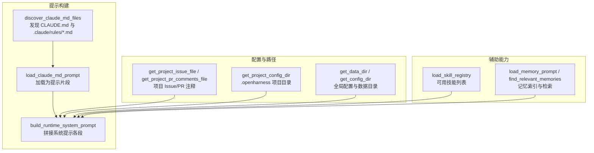
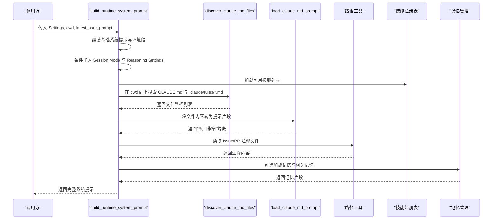
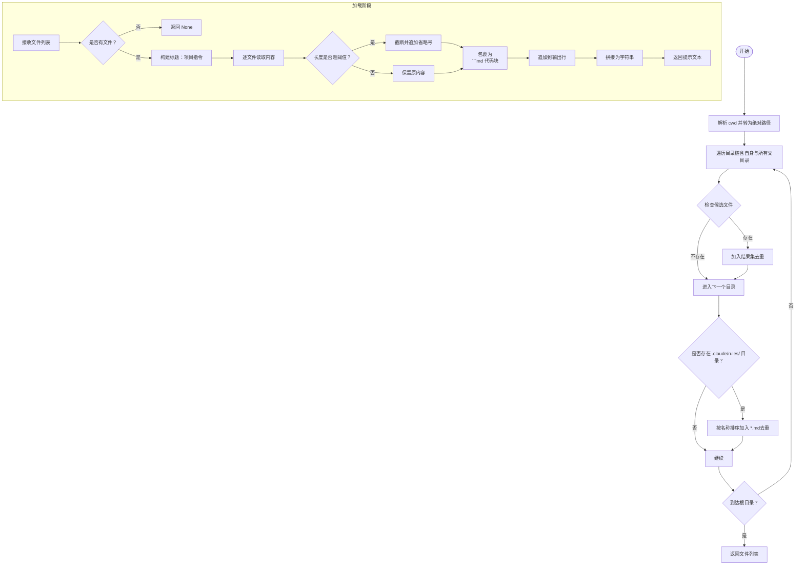
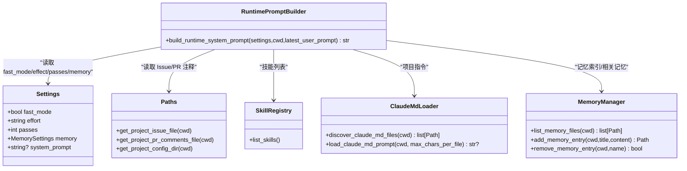
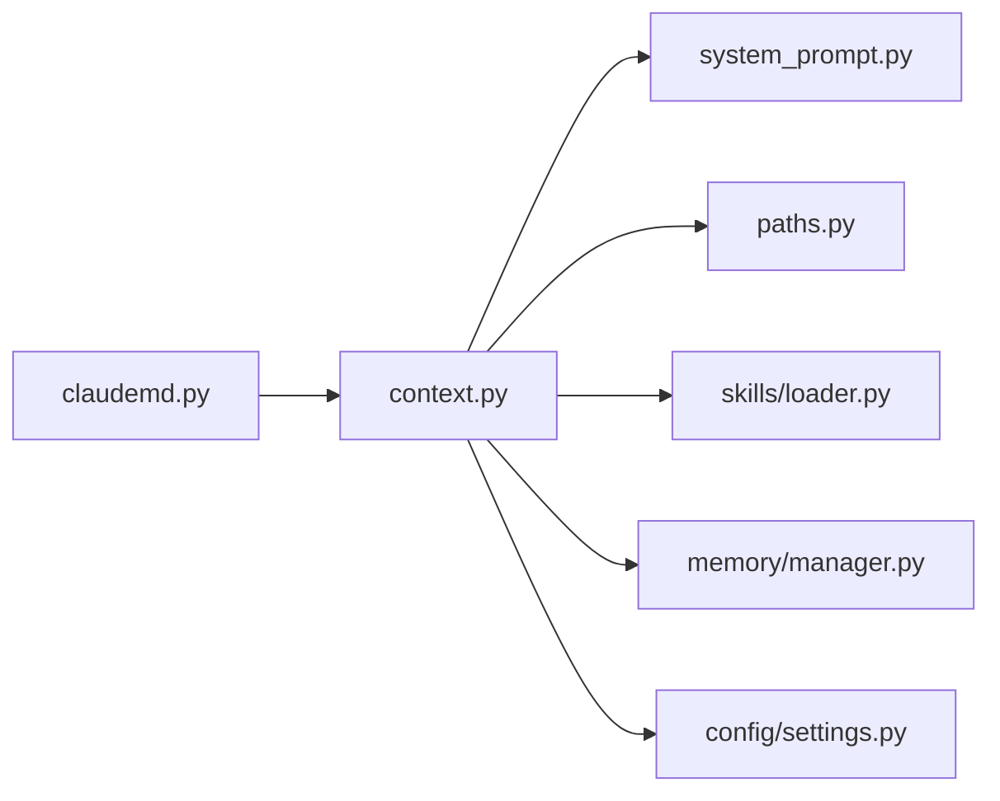

# CLAUDE.md 处理

<cite>
**本文引用的文件**
- [src/openharness/prompts/claudemd.py](file://src/openharness/prompts/claudemd.py)
- [src/openharness/prompts/context.py](file://src/openharness/prompts/context.py)
- [src/openharness/prompts/system_prompt.py](file://src/openharness/prompts/system_prompt.py)
- [src/openharness/config/paths.py](file://src/openharness/config/paths.py)
- [src/openharness/config/settings.py](file://src/openharness/config/settings.py)
- [src/openharness/skills/loader.py](file://src/openharness/skills/loader.py)
- [src/openharness/memory/manager.py](file://src/openharness/memory/manager.py)
- [src/openharness/memory/types.py](file://src/openharness/memory/types.py)
- [tests/test_prompts/test_claudemd.py](file://tests/test_prompts/test_claudemd.py)
- [src/openharness/skills/bundled/content/commit.md](file://src/openharness/skills/bundled/content/commit.md)
- [src/openharness/skills/bundled/content/debug.md](file://src/openharness/skills/bundled/content/debug.md)
- [src/openharness/skills/bundled/content/plan.md](file://src/openharness/skills/bundled/content/plan.md)
- [src/openharness/skills/bundled/content/review.md](file://src/openharness/skills/bundled/content/review.md)
- [src/openharness/skills/bundled/content/simplify.md](file://src/openharness/skills/bundled/content/simplify.md)
- [src/openharness/skills/bundled/content/test.md](file://src/openharness/skills/bundled/content/test.md)
</cite>

## 目录
1. [简介](#简介)
2. [项目结构](#项目结构)
3. [核心组件](#核心组件)
4. [架构总览](#架构总览)
5. [详细组件分析](#详细组件分析)
6. [依赖关系分析](#依赖关系分析)
7. [性能考量](#性能考量)
8. [故障排查指南](#故障排查指南)
9. [结论](#结论)
10. [附录：CLAUDE.md 编写指南与示例](#附录claude.md-编写指南与示例)

## 简介
本文件面向 OpenHarness 中的 CLAUDE.md 处理系统，系统性说明 CLAUDE.md 文件的发现与加载机制、内容格式与解析规则、在系统提示中的集成方式（上下文注入、优先级与冲突处理）、以及编写 CLAUDE.md 的最佳实践与示例。读者无需深入源码即可理解如何在项目中组织与使用 CLAUDE.md 指令，使其成为系统提示的一部分并指导智能体行为。

## 项目结构
围绕 CLAUDE.md 的处理，涉及以下关键模块：
- 发现与加载：从工作目录向上搜索 CLAUDE.md 及 .claude/rules 下的规则文件
- 提示组装：将 CLAUDE.md 内容整合进运行时系统提示
- 配置与路径：项目级配置目录、数据目录、会话与任务目录等
- 技能与记忆：与可用技能列表、项目 Issue/PR 注释、记忆文件共同构成系统提示的多段落结构

图表来源
- [src/openharness/prompts/claudemd.py:8-48](file://src/openharness/prompts/claudemd.py#L8-L48)
- [src/openharness/prompts/context.py:34-101](file://src/openharness/prompts/context.py#L34-L101)
- [src/openharness/config/paths.py:102-116](file://src/openharness/config/paths.py#L102-L116)

章节来源
- [src/openharness/prompts/claudemd.py:1-49](file://src/openharness/prompts/claudemd.py#L1-L49)
- [src/openharness/prompts/context.py:1-102](file://src/openharness/prompts/context.py#L1-L102)
- [src/openharness/config/paths.py:1-117](file://src/openharness/config/paths.py#L1-L117)

## 核心组件
- CLAUDE.md 发现与加载器：负责在当前工作目录及其父目录链上查找 CLAUDE.md 与 .claude/rules/*.md，并按顺序合并为一个“项目指令”提示段
- 运行时系统提示构建器：将基础系统提示、环境信息、会话模式、推理设置、可用技能、项目指令、Issue/PR 注释、记忆等段落拼接为最终提示
- 配置与路径：提供项目级配置目录、Issue/PR 注释文件路径等，支撑上下文注入
- 设置模型：提供 fast_mode、effort、passes 等影响提示构建的参数

章节来源
- [src/openharness/prompts/claudemd.py:8-48](file://src/openharness/prompts/claudemd.py#L8-L48)
- [src/openharness/prompts/context.py:34-101](file://src/openharness/prompts/context.py#L34-L101)
- [src/openharness/config/paths.py:102-116](file://src/openharness/config/paths.py#L102-L116)
- [src/openharness/config/settings.py:49-75](file://src/openharness/config/settings.py#L49-L75)

## 架构总览
CLAUDE.md 的处理流程贯穿“发现 → 加载 → 组装”的主干路径，并与系统提示的其他段落协同工作：

图表来源
- [src/openharness/prompts/context.py:34-101](file://src/openharness/prompts/context.py#L34-L101)
- [src/openharness/prompts/claudemd.py:8-48](file://src/openharness/prompts/claudemd.py#L8-L48)
- [src/openharness/config/paths.py:109-116](file://src/openharness/config/paths.py#L109-L116)
- [src/openharness/skills/loader.py:21-37](file://src/openharness/skills/loader.py#L21-L37)
- [src/openharness/memory/manager.py:11-29](file://src/openharness/memory/manager.py#L11-L29)

## 详细组件分析

### 组件一：CLAUDE.md 发现与加载
- 发现策略
  - 从 cwd 开始向上遍历父目录链，对每个目录检查两类候选：
    - 直接文件：CLAUDE.md 或 .claude/CLAUDE.md
    - 规则文件：.claude/rules/*.md（按文件名排序）
  - 使用集合去重，避免重复收录同一路径
- 加载策略
  - 若未发现任何文件，返回空值
  - 否则生成标题为“项目指令”的提示段，逐个文件包裹为 Markdown 代码块，并标注文件路径
  - 单文件长度超过阈值（默认 12000 字符）时进行截断并追加省略号
- 作用域
  - 该提示段作为“项目指令”被拼接到系统提示中，供模型在执行任务时参考

图表来源
- [src/openharness/prompts/claudemd.py](file://src/openharness/prompts/claudemd.py#L8-L48)

章节来源
- [src/openharness/prompts/claudemd.py](file://src/openharness/prompts/claudemd.py#L8-L48)

### 组件二：系统提示的组装与集成
- 组成段落
  - 基础系统提示（可由自定义覆盖）
  - 环境信息段
  - 会话模式（fast_mode 时启用）
  - 推理设置（effort/passes）
  - 可用技能列表（来自技能注册表）
  - 项目指令（CLAUDE.md 加载结果）
  - Issue 上下文与 Pull Request 注释
  - 记忆索引与相关记忆（可选）
- 优先级与顺序
  - 固定顺序：基础提示 → 环境 → 会话模式 → 推理设置 → 技能 → 项目指令 → Issue/PR → 记忆
  - 仅当对应内容存在且非空时才加入
- 冲突处理
  - 文件去重：发现阶段通过集合避免重复
  - 截断策略：单文件超长自动截断，避免超出上下文限制
  - 可选段落：如 fast_mode 关闭、记忆禁用，则不插入对应段落

图表来源
- [src/openharness/prompts/context.py](file://src/openharness/prompts/context.py#L34-L101)
- [src/openharness/config/settings.py](file://src/openharness/config/settings.py#L49-L75)
- [src/openharness/config/paths.py](file://src/openharness/config/paths.py#L109-L116)
- [src/openharness/skills/loader.py](file://src/openharness/skills/loader.py#L21-L37)
- [src/openharness/memory/manager.py](file://src/openharness/memory/manager.py#L11-L29)
- [src/openharness/prompts/claudemd.py](file://src/openharness/prompts/claudemd.py#L8-L48)

章节来源
- [src/openharness/prompts/context.py](file://src/openharness/prompts/context.py#L34-L101)
- [src/openharness/config/settings.py](file://src/openharness/config/settings.py#L49-L75)
- [src/openharness/config/paths.py](file://src/openharness/config/paths.py#L109-L116)
- [src/openharness/skills/loader.py](file://src/openharness/skills/loader.py#L21-L37)
- [src/openharness/memory/manager.py](file://src/openharness/memory/manager.py#L11-L29)

### 组件三：技能与 CLAUDE.md 的协同
- 技能注册表会列出所有可用技能，供模型在匹配用户请求时调用
- CLAUDE.md 则提供项目层面的行为准则与工作流，二者共同决定模型在具体任务中的表现
- 当用户请求与某个技能匹配时，可通过工具调用加载该技能的详细说明；而 CLAUDE.md 则提供更广泛的项目约束与风格指导

章节来源
- [src/openharness/skills/loader.py](file://src/openharness/skills/loader.py#L14-L97)
- [src/openharness/prompts/context.py](file://src/openharness/prompts/context.py#L15-L31)

## 依赖关系分析
- 模块耦合
  - CLAUDE.md 发现与加载器独立于系统提示构建器，仅通过函数接口交互
  - 系统提示构建器依赖多个子系统：配置、路径、技能、记忆、CLAUDE.md 加载器
- 外部依赖
  - 路径解析依赖操作系统文件系统
  - 设置模型支持环境变量覆盖，便于在不同环境中调整行为
- 潜在循环依赖
  - 未见直接循环导入；各模块职责清晰，通过函数调用解耦

图表来源
- [src/openharness/prompts/claudemd.py:1-49](file://src/openharness/prompts/claudemd.py#L1-L49)
- [src/openharness/prompts/context.py:1-102](file://src/openharness/prompts/context.py#L1-L102)
- [src/openharness/prompts/system_prompt.py:1-63](file://src/openharness/prompts/system_prompt.py#L1-L63)
- [src/openharness/config/paths.py:1-117](file://src/openharness/config/paths.py#L1-L117)
- [src/openharness/config/settings.py:1-161](file://src/openharness/config/settings.py#L1-L161)
- [src/openharness/skills/loader.py:1-97](file://src/openharness/skills/loader.py#L1-L97)
- [src/openharness/memory/manager.py:1-51](file://src/openharness/memory/manager.py#L1-L51)

章节来源
- [src/openharness/prompts/claudemd.py:1-49](file://src/openharness/prompts/claudemd.py#L1-L49)
- [src/openharness/prompts/context.py:1-102](file://src/openharness/prompts/context.py#L1-L102)
- [src/openharness/config/paths.py:1-117](file://src/openharness/config/paths.py#L1-L117)
- [src/openharness/config/settings.py:1-161](file://src/openharness/config/settings.py#L1-L161)
- [src/openharness/skills/loader.py:1-97](file://src/openharness/skills/loader.py#L1-L97)
- [src/openharness/memory/manager.py:1-51](file://src/openharness/memory/manager.py#L1-L51)

## 性能考量
- 文件扫描复杂度
  - 对于深度为 d 的目录链，每层最多检查 2 个固定候选 + 规则目录下的若干文件，整体近似 O(d + n)，n 为规则文件数量
- 文本处理复杂度
  - 读取与拼接为线性复杂度，截断操作为 O(k)，k 为阈值
- 内存占用
  - 采用分段拼接，避免一次性加载全部内容；截断后仍保持提示结构完整
- 实践建议
  - 控制单个 CLAUDE.md 文件大小，避免超过阈值导致截断
  - 合理组织 .claude/rules 子文件，按主题拆分，减少单文件长度
  - 在 fast_mode 下，适当降低截断阈值以提升响应速度

## 故障排查指南
- 未发现任何 CLAUDE.md
  - 检查工作目录是否正确，确认 .claude/rules 是否存在且包含 .md 文件
  - 确认文件权限允许读取
- 提示为空或不完整
  - 确认 Settings.fast_mode、memory.enabled 等开关状态
  - 检查 Issue/PR 注释文件是否存在且非空
- 内容被截断
  - 单文件超过阈值会被截断；建议拆分内容或精简描述
- 与其他段落冲突
  - 不同段落按固定顺序拼接；若出现重复信息，优先保证项目指令的权威性

章节来源
- [tests/test_prompts/test_claudemd.py:12-70](file://tests/test_prompts/test_claudemd.py#L12-L70)
- [src/openharness/prompts/claudemd.py:36-48](file://src/openharness/prompts/claudemd.py#L36-L48)
- [src/openharness/prompts/context.py:63-101](file://src/openharness/prompts/context.py#L63-L101)

## 结论
CLAUDE.md 处理系统通过“发现 → 加载 → 组装”的清晰流程，将项目指令无缝注入到系统提示中。其设计兼顾了灵活性与可控性：既支持多层级目录的指令聚合，又提供了截断与去重等保护机制；在系统提示的多段落结构中，CLAUDE.md 作为权威的项目约束与工作流参考，与技能、记忆、Issue/PR 注释等共同构成完整的上下文。

## 附录：CLAUDE.md 编写指南与示例

### CLAUDE.md 文件格式规范
- 文件位置
  - 支持两种位置：
    - 项目根目录：CLAUDE.md
    - 隐藏目录：.claude/CLAUDE.md
  - 规则文件：.claude/rules/*.md，按文件名排序合并
- 内容结构
  - 建议包含：背景说明、工作流、规则清单、注意事项等
  - 使用 Markdown 标题与列表组织内容，便于模型解析
- 截断与长度
  - 单文件超过阈值（默认 12000 字符）会被截断；建议将长内容拆分为多个规则文件

章节来源
- [src/openharness/prompts/claudemd.py:8-48](file://src/openharness/prompts/claudemd.py#L8-L48)

### 与系统提示的集成方式
- 上下文注入
  - 项目指令作为“项目指令”段落被拼接到系统提示中，位于技能列表之后、Issue/PR 之前
- 优先级处理
  - 固定顺序：基础提示 → 环境 → 会话模式 → 推理设置 → 技能 → 项目指令 → Issue/PR → 记忆
- 冲突解决
  - 文件去重：同一路径不会重复收录
  - 截断策略：超长自动截断，不影响整体结构

章节来源
- [src/openharness/prompts/context.py:34-101](file://src/openharness/prompts/context.py#L34-L101)

### 编写最佳实践
- 明确目标
  - 清晰界定适用场景与边界，避免与技能定义重复
- 结构化表达
  - 使用标题层级与有序/无序列表，便于模型快速定位要点
- 可操作性
  - 提供可执行的工作流与规则清单，减少歧义
- 版本与维护
  - 将长内容拆分为多个规则文件，便于维护与增量更新

### 示例文件与处理效果对比
- 示例文件（技能工作流）
  - 提交工作流：[commit.md:1-26](file://src/openharness/skills/bundled/content/commit.md#L1-L26)
  - 调试工作流：[debug.md:1-26](file://src/openharness/skills/bundled/content/debug.md#L1-L26)
  - 计划工作流：[plan.md:1-35](file://src/openharness/skills/bundled/content/plan.md#L1-L35)
  - 评审工作流：[review.md:1-27](file://src/openharness/skills/bundled/content/review.md#L1-L27)
  - 简化工作流：[simplify.md:1-27](file://src/openharness/skills/bundled/content/simplify.md#L1-L27)
  - 测试工作流：[test.md:1-32](file://src/openharness/skills/bundled/content/test.md#L1-L32)
- 处理效果
  - 发现与加载：上述文件均会被识别并合并为“项目指令”段落
  - 截断策略：若内容过长，将按阈值截断并追加省略号
  - 组装顺序：在系统提示中位于技能列表之后、Issue/PR 之前

章节来源
- [src/openharness/prompts/claudemd.py:36-48](file://src/openharness/prompts/claudemd.py#L36-L48)
- [src/openharness/prompts/context.py:59-70](file://src/openharness/prompts/context.py#L59-L70)
- [src/openharness/skills/bundled/content/commit.md:1-26](file://src/openharness/skills/bundled/content/commit.md#L1-L26)
- [src/openharness/skills/bundled/content/debug.md:1-26](file://src/openharness/skills/bundled/content/debug.md#L1-L26)
- [src/openharness/skills/bundled/content/plan.md:1-35](file://src/openharness/skills/bundled/content/plan.md#L1-L35)
- [src/openharness/skills/bundled/content/review.md:1-27](file://src/openharness/skills/bundled/content/review.md#L1-L27)
- [src/openharness/skills/bundled/content/simplify.md:1-27](file://src/openharness/skills/bundled/content/simplify.md#L1-L27)
- [src/openharness/skills/bundled/content/test.md:1-32](file://src/openharness/skills/bundled/content/test.md#L1-L32)