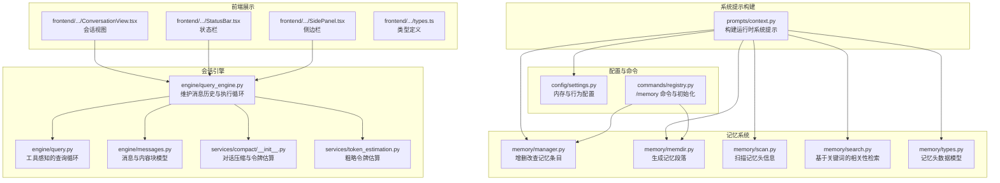
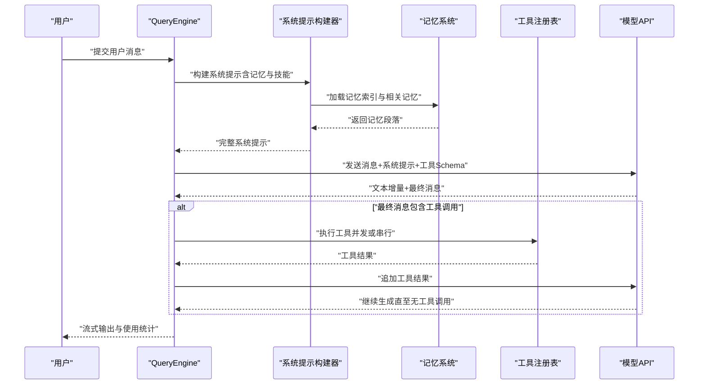
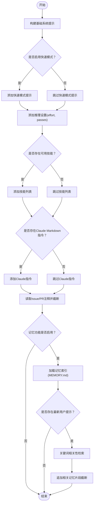
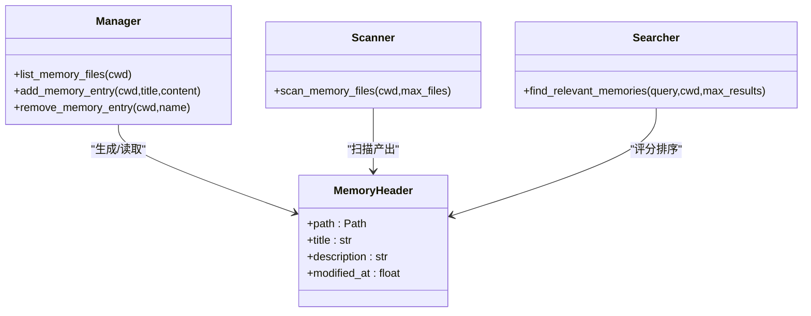
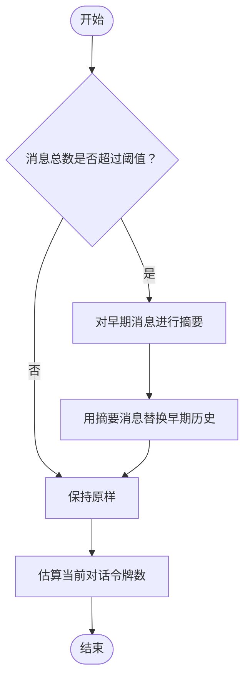
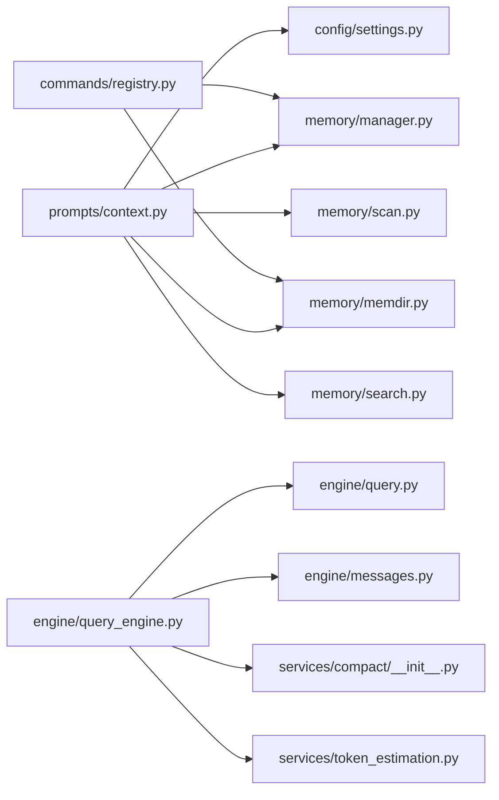

# 上下文管理

<cite>
**本文引用的文件**
- [src/openharness/prompts/context.py](file://src/openharness/prompts/context.py)
- [src/openharness/memory/manager.py](file://src/openharness/memory/manager.py)
- [src/openharness/memory/memdir.py](file://src/openharness/memory/memdir.py)
- [src/openharness/memory/scan.py](file://src/openharness/memory/scan.py)
- [src/openharness/memory/search.py](file://src/openharness/memory/search.py)
- [src/openharness/memory/types.py](file://src/openharness/memory/types.py)
- [src/openharness/engine/query_engine.py](file://src/openharness/engine/query_engine.py)
- [src/openharness/engine/query.py](file://src/openharness/engine/query.py)
- [src/openharness/engine/messages.py](file://src/openharness/engine/messages.py)
- [src/openharness/services/compact/__init__.py](file://src/openharness/services/compact/__init__.py)
- [src/openharness/services/token_estimation.py](file://src/openharness/services/token_estimation.py)
- [src/openharness/config/settings.py](file://src/openharness/config/settings.py)
- [src/openharness/tools/base.py](file://src/openharness/tools/base.py)
- [src/openharness/commands/registry.py](file://src/openharness/commands/registry.py)
- [src/openharness/services/session_storage.py](file://src/openharness/services/session_storage.py)
- [frontend/terminal/src/components/ConversationView.tsx](file://frontend/terminal/src/components/ConversationView.tsx)
- [frontend/terminal/src/components/StatusBar.tsx](file://frontend/terminal/src/components/StatusBar.tsx)
- [frontend/terminal/src/components/SidePanel.tsx](file://frontend/terminal/src/components/SidePanel.tsx)
- [frontend/terminal/src/types.ts](file://frontend/terminal/src/types.ts)
</cite>

## 目录
1. [引言](#引言)
2. [项目结构](#项目结构)
3. [核心组件](#核心组件)
4. [架构总览](#架构总览)
5. [详细组件分析](#详细组件分析)
6. [依赖分析](#依赖分析)
7. [性能考量](#性能考量)
8. [故障排查指南](#故障排查指南)
9. [结论](#结论)
10. [附录](#附录)

## 引言
本文件系统化阐述 OpenHarness 的上下文管理系统：如何在提示工程中组织与优化上下文，涵盖上下文窗口管理、信息压缩、相关性排序、对话历史与持久化、文件内容与环境信息整合、技能知识注入、以及可配置的窗口大小、压缩算法与缓存策略。文档同时提供实际应用示例与性能优化建议，帮助开发者与使用者高效利用上下文能力。

## 项目结构
OpenHarness 将“上下文”拆分为多个层面：
- 系统提示构建层：拼装系统提示、推理设置、可用技能、项目 Issue/PR 注释、持久化记忆等。
- 记忆系统层：项目级持久化记忆目录、索引文件、检索与展示。
- 会话引擎层：维护对话历史、工具调用循环、流式事件、令牌估算与压缩。
- 前端展示层：会话视图、状态栏、侧边栏等，用于观察上下文规模与运行状态。



图表来源
- [src/openharness/prompts/context.py:34-101](file://src/openharness/prompts/context.py#L34-L101)
- [src/openharness/memory/manager.py:11-50](file://src/openharness/memory/manager.py#L11-L50)
- [src/openharness/memory/memdir.py:10-34](file://src/openharness/memory/memdir.py#L10-L34)
- [src/openharness/memory/scan.py:11-38](file://src/openharness/memory/scan.py#L11-L38)
- [src/openharness/memory/search.py:12-30](file://src/openharness/memory/search.py#L12-L30)
- [src/openharness/engine/query_engine.py:18-101](file://src/openharness/engine/query_engine.py#L18-L101)
- [src/openharness/engine/query.py:53-212](file://src/openharness/engine/query.py#L53-L212)
- [src/openharness/services/compact/__init__.py:9-57](file://src/openharness/services/compact/__init__.py#L9-L57)
- [src/openharness/services/token_estimation.py:6-15](file://src/openharness/services/token_estimation.py#L6-L15)
- [src/openharness/config/settings.py:41-74](file://src/openharness/config/settings.py#L41-L74)
- [src/openharness/commands/registry.py:336-357](file://src/openharness/commands/registry.py#L336-L357)

章节来源
- [src/openharness/prompts/context.py:34-101](file://src/openharness/prompts/context.py#L34-L101)
- [src/openharness/config/settings.py:41-74](file://src/openharness/config/settings.py#L41-L74)

## 核心组件
- 系统提示构建器：按优先级拼接系统提示、推理设置、可用技能、Claude Markdown 指令、Issue/PR 注释、项目记忆索引与相关记忆片段。
- 记忆系统：提供记忆目录、索引文件（MEMORY.md）的读写、扫描记忆头、基于关键词的相关性检索与展示。
- 会话引擎：维护对话历史、工具调用循环、流式事件、令牌估算与对话压缩。
- 配置与命令：通过 Settings 控制记忆开关、最大文件数、入口行数；/memory 命令进行记忆条目的增删查。

章节来源
- [src/openharness/prompts/context.py:34-101](file://src/openharness/prompts/context.py#L34-L101)
- [src/openharness/memory/manager.py:11-50](file://src/openharness/memory/manager.py#L11-L50)
- [src/openharness/memory/scan.py:11-38](file://src/openharness/memory/scan.py#L11-L38)
- [src/openharness/memory/search.py:12-30](file://src/openharness/memory/search.py#L12-L30)
- [src/openharness/engine/query_engine.py:18-101](file://src/openharness/engine/query_engine.py#L18-L101)
- [src/openharness/config/settings.py:41-74](file://src/openharness/config/settings.py#L41-L74)
- [src/openharness/commands/registry.py:336-357](file://src/openharness/commands/registry.py#L336-L357)

## 架构总览
OpenHarness 的上下文管理以“系统提示构建器”为核心枢纽，将来自多源的信息整合进模型输入。记忆系统提供长期与短期上下文的补充；会话引擎负责控制对话历史与工具调用，结合令牌估算与压缩策略维持窗口可控；前端展示层提供上下文规模与运行状态的可视化反馈。



图表来源
- [src/openharness/engine/query_engine.py:81-101](file://src/openharness/engine/query_engine.py#L81-L101)
- [src/openharness/engine/query.py:53-122](file://src/openharness/engine/query.py#L53-L122)
- [src/openharness/prompts/context.py:34-101](file://src/openharness/prompts/context.py#L34-L101)
- [src/openharness/memory/search.py:12-30](file://src/openharness/memory/search.py#L12-L30)

## 详细组件分析

### 组件一：系统提示构建与上下文组装
- 职责：将系统提示、推理设置、可用技能、Claude Markdown 指令、Issue/PR 注释、项目记忆索引与相关记忆片段拼接为最终系统提示。
- 关键点：
  - 推理设置：effort/passes 控制深度与迭代次数。
  - 技能注入：从技能注册表读取技能清单，按名称与描述生成提示。
  - 记忆注入：根据配置加载记忆索引与相关记忆片段，并对内容做截断。
  - Issue/PR 注释：从项目文件读取并截断，避免超长上下文。
- 复杂度：线性扫描与拼接，受记忆数量与截断参数影响。



图表来源
- [src/openharness/prompts/context.py:34-101](file://src/openharness/prompts/context.py#L34-L101)

章节来源
- [src/openharness/prompts/context.py:34-101](file://src/openharness/prompts/context.py#L34-L101)

### 组件二：记忆系统（收集、组织与检索）
- 收集与组织：
  - 项目记忆目录：每个项目一个目录，入口文件为 MEMORY.md。
  - 新增记忆：根据标题生成 slug 文件名，写入内容并在索引中追加条目。
  - 删除记忆：删除对应文件并从索引中移除条目。
  - 扫描记忆：读取若干首行作为描述，提取修改时间，按时间倒序。
- 相关性排序：
  - 基于查询词的关键词匹配，计算标题与描述的重叠得分，按得分与修改时间排序，返回前 N 个。
- 截断与展示：
  - 入口文件行数上限与单条记忆内容上限由配置控制。



图表来源
- [src/openharness/memory/types.py:9-16](file://src/openharness/memory/types.py#L9-L16)
- [src/openharness/memory/manager.py:11-50](file://src/openharness/memory/manager.py#L11-L50)
- [src/openharness/memory/scan.py:11-38](file://src/openharness/memory/scan.py#L11-L38)
- [src/openharness/memory/search.py:12-30](file://src/openharness/memory/search.py#L12-L30)

章节来源
- [src/openharness/memory/manager.py:11-50](file://src/openharness/memory/manager.py#L11-L50)
- [src/openharness/memory/scan.py:11-38](file://src/openharness/memory/scan.py#L11-L38)
- [src/openharness/memory/search.py:12-30](file://src/openharness/memory/search.py#L12-L30)
- [src/openharness/memory/types.py:9-16](file://src/openharness/memory/types.py#L9-L16)

### 组件三：会话引擎与对话历史管理
- 对话历史：QueryEngine 维护 ConversationMessage 列表，支持清空、替换、更新系统提示与模型。
- 工具调用循环：run_query 负责流式请求模型、解析文本增量、处理工具调用（串行或并发），并将工具结果回传给模型。
- 使用统计：每轮事件携带 UsageSnapshot，QueryEngine 累计成本。
- 令牌估算：提供简单字符启发式估算，用于监控上下文规模。

```mermaid
sequenceDiagram
participant Engine as "QueryEngine"
participant Loop as "run_query"
participant API as "模型API"
participant Tools as "工具注册表"
Engine->>Loop : "构造QueryContext与消息列表"
Loop->>API : "stream_message(系统提示+消息+工具Schema)"
API-->>Loop : "文本增量"
Loop-->>Engine : "AssistantTextDelta"
API-->>Loop : "最终消息(可能含工具调用)"
alt "存在工具调用"
Loop->>Tools : "执行工具(并发/串行)"
Tools-->>Loop : "工具结果"
Loop->>API : "追加工具结果"
end
Loop-->>Engine : "AssistantTurnComplete(含Usage)"
```

图表来源
- [src/openharness/engine/query_engine.py:81-101](file://src/openharness/engine/query_engine.py#L81-L101)
- [src/openharness/engine/query.py:53-122](file://src/openharness/engine/query.py#L53-L122)
- [src/openharness/engine/messages.py:39-109](file://src/openharness/engine/messages.py#L39-L109)

章节来源
- [src/openharness/engine/query_engine.py:18-101](file://src/openharness/engine/query_engine.py#L18-L101)
- [src/openharness/engine/query.py:53-122](file://src/openharness/engine/query.py#L53-L122)
- [src/openharness/engine/messages.py:39-109](file://src/openharness/engine/messages.py#L39-L109)
- [src/openharness/services/token_estimation.py:6-15](file://src/openharness/services/token_estimation.py#L6-L15)

### 组件四：对话压缩与窗口管理
- 压缩策略：将较早的历史消息汇总为一条“对话摘要”，保留最近若干条消息，减少上下文长度。
- 令牌估算：对消息文本进行粗略估算，辅助判断是否需要压缩。
- 动态调整：结合 max_tokens 与估算值，在提交请求前决定是否压缩。



图表来源
- [src/openharness/services/compact/__init__.py:9-57](file://src/openharness/services/compact/__init__.py#L9-L57)
- [src/openharness/services/token_estimation.py:6-15](file://src/openharness/services/token_estimation.py#L6-L15)

章节来源
- [src/openharness/services/compact/__init__.py:9-57](file://src/openharness/services/compact/__init__.py#L9-L57)
- [src/openharness/services/token_estimation.py:6-15](file://src/openharness/services/token_estimation.py#L6-L15)

### 组件五：配置与命令（上下文管理的可调参数）
- 内存配置（MemorySettings）：
  - enabled：是否启用记忆功能
  - max_files：相关记忆返回的最大文件数
  - max_entrypoint_lines：记忆索引展示的最大行数
- 行为配置（Settings）：
  - effort：推理努力程度
  - passes：推理迭代次数
  - fast_mode：快速模式开关
  - max_tokens：模型最大输出令牌数
- /memory 命令：支持列出、查看、新增、删除记忆条目。

章节来源
- [src/openharness/config/settings.py:41-74](file://src/openharness/config/settings.py#L41-L74)
- [src/openharness/commands/registry.py:336-357](file://src/openharness/commands/registry.py#L336-L357)

### 组件六：前端上下文可视化
- 会话视图：仅渲染最近若干条消息，便于终端显示。
- 状态栏：展示模型、令牌用量、权限模式、任务与 MCP 连接数等。
- 侧边栏：展示工作目录、Vim/语音模式、快速模式、努力程度、迭代次数等。

章节来源
- [frontend/terminal/src/components/ConversationView.tsx:8-36](file://frontend/terminal/src/components/ConversationView.tsx#L8-L36)
- [frontend/terminal/src/components/StatusBar.tsx:8-46](file://frontend/terminal/src/components/StatusBar.tsx#L8-L46)
- [frontend/terminal/src/components/SidePanel.tsx:41-102](file://frontend/terminal/src/components/SidePanel.tsx#L41-L102)
- [frontend/terminal/src/types.ts:6-12](file://frontend/terminal/src/types.ts#L6-L12)

## 依赖分析
- 组件耦合：
  - 系统提示构建器依赖配置、记忆模块与技能注册表。
  - 会话引擎依赖工具注册表、权限检查器、钩子执行器与消息模型。
  - 记忆系统内部通过路径与类型模块解耦。
- 外部依赖：
  - 模型 API 客户端接口（SupportsStreamingMessages）。
  - 工具注册表与工具基类。
- 可能的循环依赖：未发现直接循环依赖。



图表来源
- [src/openharness/prompts/context.py:34-101](file://src/openharness/prompts/context.py#L34-L101)
- [src/openharness/engine/query_engine.py:18-101](file://src/openharness/engine/query_engine.py#L18-L101)
- [src/openharness/engine/query.py:53-122](file://src/openharness/engine/query.py#L53-L122)
- [src/openharness/services/compact/__init__.py:9-57](file://src/openharness/services/compact/__init__.py#L9-L57)
- [src/openharness/services/token_estimation.py:6-15](file://src/openharness/services/token_estimation.py#L6-L15)
- [src/openharness/commands/registry.py:336-357](file://src/openharness/commands/registry.py#L336-L357)

章节来源
- [src/openharness/prompts/context.py:34-101](file://src/openharness/prompts/context.py#L34-L101)
- [src/openharness/engine/query_engine.py:18-101](file://src/openharness/engine/query_engine.py#L18-L101)
- [src/openharness/engine/query.py:53-122](file://src/openharness/engine/query.py#L53-L122)
- [src/openharness/services/compact/__init__.py:9-57](file://src/openharness/services/compact/__init__.py#L9-L57)
- [src/openharness/services/token_estimation.py:6-15](file://src/openharness/services/token_estimation.py#L6-L15)
- [src/openharness/commands/registry.py:336-357](file://src/openharness/commands/registry.py#L336-L357)

## 性能考量
- 令牌估算与压缩：
  - 使用粗略字符启发式估算消息长度，避免昂贵的分词器开销。
  - 在提交请求前进行对话压缩，确保不超过模型上下文窗口。
- 相关性检索剪枝：
  - 限制扫描文件数量与返回结果数量，降低 IO 与 CPU 开销。
  - 仅对长度≥3的词进行匹配，减少无效计算。
- 并发工具执行：
  - 当存在多个工具调用时并行执行，缩短整体等待时间。
- 前端渲染优化：
  - 仅渲染最近若干条消息，避免大屏卡顿。

章节来源
- [src/openharness/services/token_estimation.py:6-15](file://src/openharness/services/token_estimation.py#L6-L15)
- [src/openharness/services/compact/__init__.py:9-57](file://src/openharness/services/compact/__init__.py#L9-L57)
- [src/openharness/memory/scan.py:11-38](file://src/openharness/memory/scan.py#L11-L38)
- [src/openharness/memory/search.py:12-30](file://src/openharness/memory/search.py#L12-L30)
- [src/openharness/engine/query.py:101-118](file://src/openharness/engine/query.py#L101-L118)
- [frontend/terminal/src/components/ConversationView.tsx:17-26](file://frontend/terminal/src/components/ConversationView.tsx#L17-L26)

## 故障排查指南
- 记忆条目无法显示或删除失败：
  - 检查项目记忆目录与 MEMORY.md 是否存在且可读写。
  - 确认条目名称与文件名一致，删除后索引是否同步更新。
- 相关记忆未返回：
  - 确认查询词长度≥3，且与标题/描述有关键词重叠。
  - 检查 max_files 与 max_results 设置是否过小。
- 上下文过长导致报错：
  - 启用对话压缩，适当减少保留的近期消息数量。
  - 降低记忆索引与相关记忆的内容截断上限。
- 工具调用被拒绝：
  - 检查权限模式与路径规则，必要时开启交互确认流程。
- 令牌用量异常：
  - 使用状态栏与使用统计核对输入/输出令牌，关注压缩效果与消息长度。

章节来源
- [src/openharness/memory/manager.py:32-50](file://src/openharness/memory/manager.py#L32-L50)
- [src/openharness/memory/search.py:18-30](file://src/openharness/memory/search.py#L18-L30)
- [src/openharness/services/compact/__init__.py:25-45](file://src/openharness/services/compact/__init__.py#L25-L45)
- [src/openharness/engine/query.py:162-182](file://src/openharness/engine/query.py#L162-L182)
- [frontend/terminal/src/components/StatusBar.tsx:8-46](file://frontend/terminal/src/components/StatusBar.tsx#L8-L46)

## 结论
OpenHarness 的上下文管理系统通过“系统提示构建器 + 记忆系统 + 会话引擎 + 前端可视化”的协同，实现了对对话历史、项目知识、技能与环境信息的统一管理。借助令牌估算与对话压缩，系统能够在保证质量的同时控制上下文规模；通过可配置的记忆策略与相关性检索，实现知识的动态注入与降噪。配合 /memory 命令与会话持久化，用户可以持续积累与复用项目上下文，提升长期任务的效率与一致性。

## 附录
- 实际应用示例（步骤说明）：
  - 初始化项目记忆目录与示例文件：使用 /memory add 添加项目规则、最佳实践等知识条目。
  - 查看与引用记忆：使用 /memory list 与 /memory show 查阅索引与具体内容。
  - 触发相关记忆：在任务中提出与记忆关键词相关的请求，系统将自动检索并注入相关内容。
  - 调整上下文规模：在 fast_mode 下减少工具使用与回复长度；必要时降低记忆索引行数与相关记忆数量。
  - 监控令牌用量：通过状态栏与使用统计观察输入/输出令牌，结合压缩策略优化成本。
- 性能优化建议：
  - 优先使用简洁标题与摘要，减少索引与内容长度。
  - 合理设置 effort 与 passes，避免过度迭代。
  - 对高频检索场景，预热常用记忆条目，减少扫描范围。
  - 在长对话中定期清理无关历史，保持摘要消息的时效性。