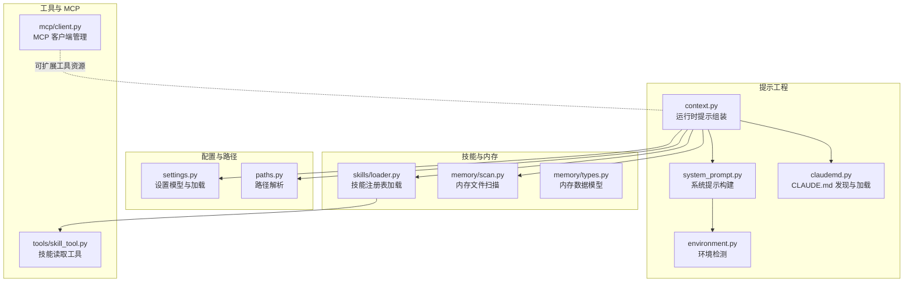
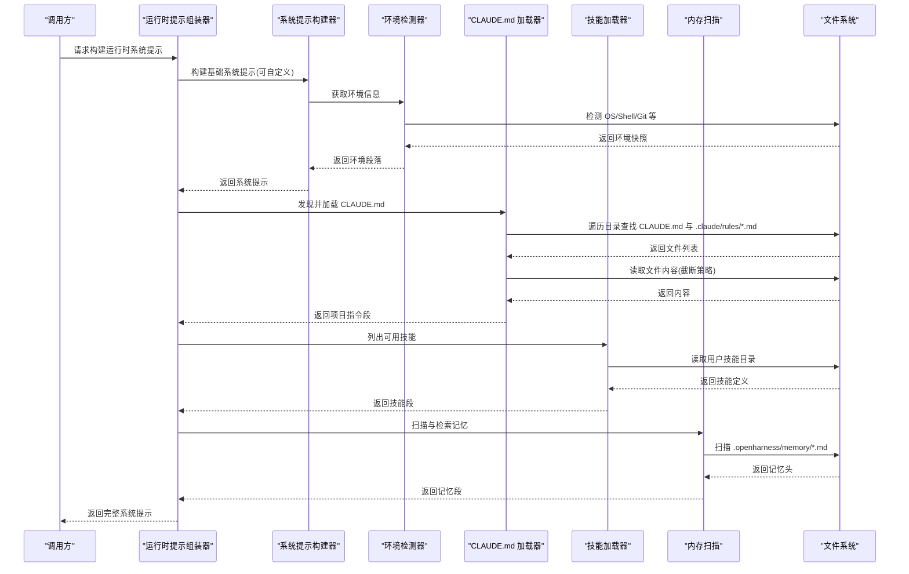
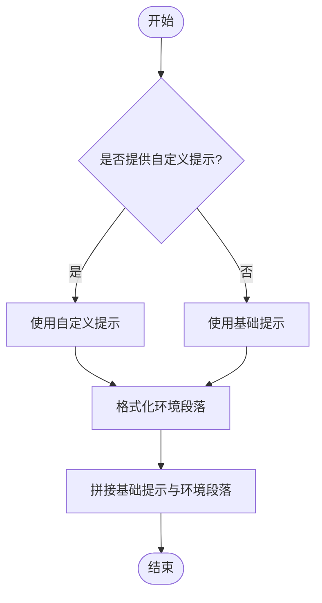
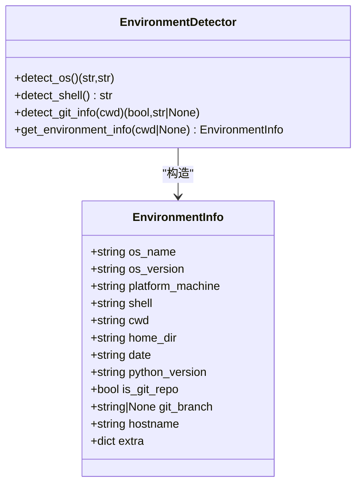
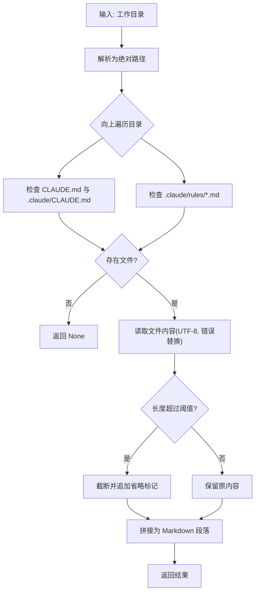
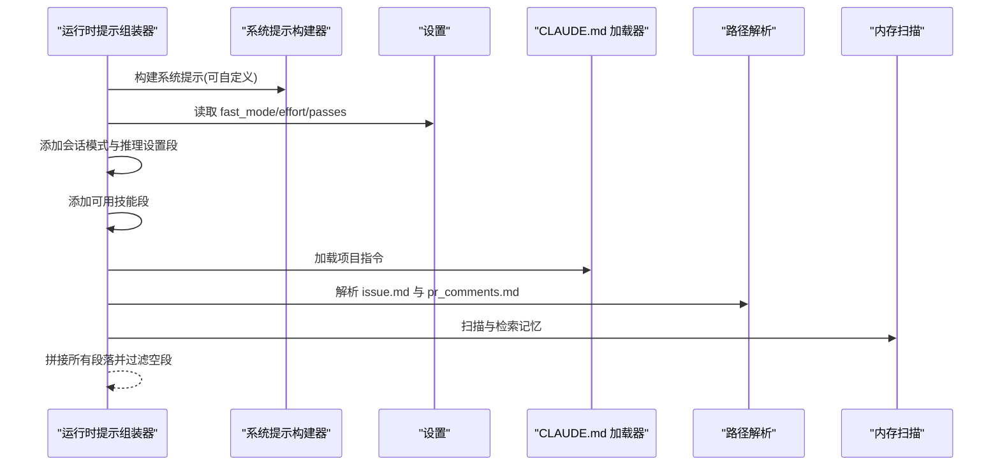
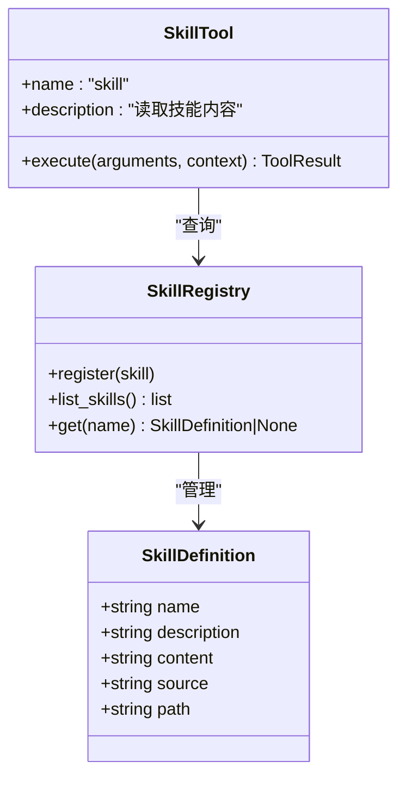
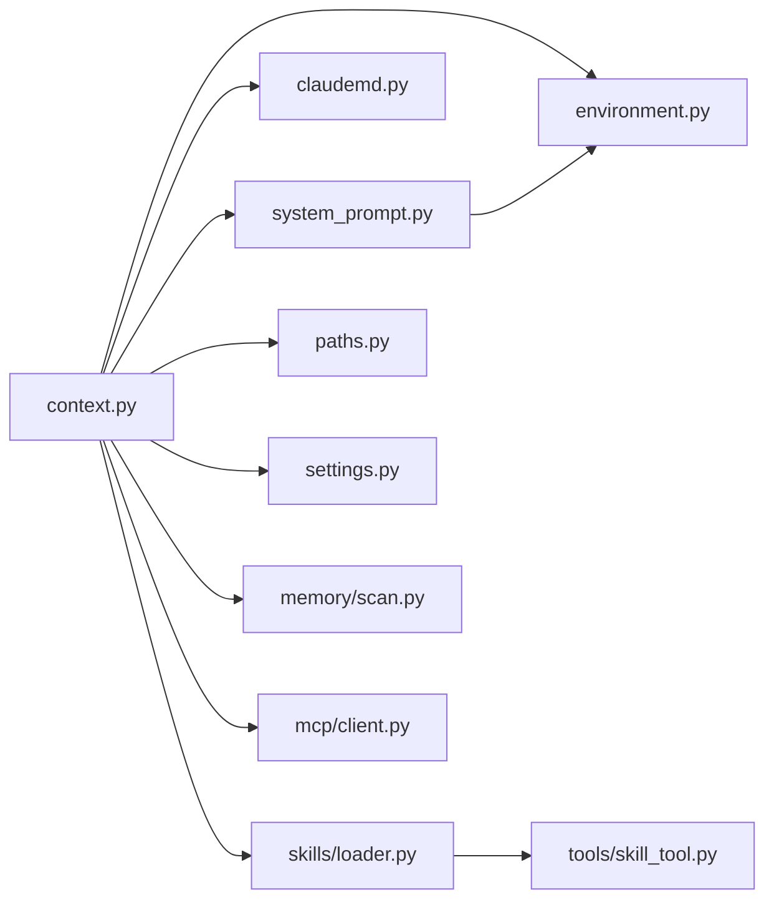

# 提示工程

<cite>
**本文引用的文件**
- [src/openharness/prompts/system_prompt.py](file://src/openharness/prompts/system_prompt.py)
- [src/openharness/prompts/environment.py](file://src/openharness/prompts/environment.py)
- [src/openharness/prompts/claudemd.py](file://src/openharness/prompts/claudemd.py)
- [src/openharness/prompts/context.py](file://src/openharness/prompts/context.py)
- [src/openharness/config/settings.py](file://src/openharness/config/settings.py)
- [src/openharness/config/paths.py](file://src/openharness/config/paths.py)
- [src/openharness/skills/loader.py](file://src/openharness/skills/loader.py)
- [src/openharness/memory/scan.py](file://src/openharness/memory/scan.py)
- [src/openharness/memory/types.py](file://src/openharness/memory/types.py)
- [src/openharness/tools/skill_tool.py](file://src/openharness/tools/skill_tool.py)
- [src/openharness/mcp/client.py](file://src/openharness/mcp/client.py)
- [tests/test_prompts/test_system_prompt.py](file://tests/test_prompts/test_system_prompt.py)
- [tests/test_prompts/test_claudemd.py](file://tests/test_prompts/test_claudemd.py)
- [tests/test_prompts/test_environment.py](file://tests/test_prompts/test_environment.py)
</cite>

## 目录
1. [简介](#简介)
2. [项目结构](#项目结构)
3. [核心组件](#核心组件)
4. [架构总览](#架构总览)
5. [组件详解](#组件详解)
6. [依赖关系分析](#依赖关系分析)
7. [性能考量](#性能考量)
8. [故障排查指南](#故障排查指南)
9. [结论](#结论)
10. [附录](#附录)

## 简介
本文件面向 OpenHarness 的提示工程系统，系统性阐述“系统提示”的构建原理与最佳实践，涵盖以下主题：
- 上下文组装：角色定义、指令优化、环境上下文整合
- 环境上下文处理：操作系统、Shell、工作目录、日期、Python 版本、Git 仓库与分支等
- CLAUDE.md 处理机制：技能文件解析、内容提取、动态注入
- 提示优化最佳实践：上下文压缩、噪声过滤、相关性排序
- 开发指南：模板设计、动态内容生成、效果评估
- 实际示例与性能优化建议

## 项目结构
提示工程相关代码主要位于 prompts 子模块，并与配置、路径、技能加载、内存扫描等模块协同工作。

图表来源
- [src/openharness/prompts/context.py:1-102](file://src/openharness/prompts/context.py#L1-L102)
- [src/openharness/prompts/system_prompt.py:1-63](file://src/openharness/prompts/system_prompt.py#L1-L63)
- [src/openharness/prompts/environment.py:1-121](file://src/openharness/prompts/environment.py#L1-L121)
- [src/openharness/prompts/claudemd.py:1-49](file://src/openharness/prompts/claudemd.py#L1-L49)
- [src/openharness/config/settings.py:1-161](file://src/openharness/config/settings.py#L1-L161)
- [src/openharness/config/paths.py:1-117](file://src/openharness/config/paths.py#L1-L117)
- [src/openharness/skills/loader.py:1-97](file://src/openharness/skills/loader.py#L1-L97)
- [src/openharness/memory/scan.py:1-39](file://src/openharness/memory/scan.py#L1-L39)
- [src/openharness/memory/types.py:1-17](file://src/openharness/memory/types.py#L1-L17)
- [src/openharness/tools/skill_tool.py:1-34](file://src/openharness/tools/skill_tool.py#L1-L34)
- [src/openharness/mcp/client.py:1-175](file://src/openharness/mcp/client.py#L1-L175)

章节来源
- [src/openharness/prompts/context.py:1-102](file://src/openharness/prompts/context.py#L1-L102)
- [src/openharness/prompts/system_prompt.py:1-63](file://src/openharness/prompts/system_prompt.py#L1-L63)
- [src/openharness/prompts/environment.py:1-121](file://src/openharness/prompts/environment.py#L1-L121)
- [src/openharness/prompts/claudemd.py:1-49](file://src/openharness/prompts/claudemd.py#L1-L49)
- [src/openharness/config/settings.py:1-161](file://src/openharness/config/settings.py#L1-L161)
- [src/openharness/config/paths.py:1-117](file://src/openharness/config/paths.py#L1-L117)
- [src/openharness/skills/loader.py:1-97](file://src/openharness/skills/loader.py#L1-L97)
- [src/openharness/memory/scan.py:1-39](file://src/openharness/memory/scan.py#L1-L39)
- [src/openharness/memory/types.py:1-17](file://src/openharness/memory/types.py#L1-L17)
- [src/openharness/tools/skill_tool.py:1-34](file://src/openharness/tools/skill_tool.py#L1-L34)
- [src/openharness/mcp/client.py:1-175](file://src/openharness/mcp/client.py#L1-L175)

## 核心组件
- 系统提示构建器：负责拼接基础角色、行为约束与环境信息，支持自定义覆盖。
- 环境检测器：采集 OS、Shell、平台、工作目录、日期、Python 版本、Git 状态等。
- CLAUDE.md 加载器：向上级目录发现并聚合项目指令，形成“项目指令”段落。
- 运行时提示组装器：在系统提示基础上叠加“会话模式”“推理设置”“可用技能”“项目指令”“问题/PR 上下文”“记忆”等多段内容。
- 设置与路径：提供设置模型、优先级解析、路径解析（含项目级上下文文件）。
- 技能加载与工具：加载内置/用户/插件技能，暴露“skill”只读工具以按需读取技能内容。
- 内存扫描：扫描项目内可检索的记忆文件，用于上下文增强。
- MCP 客户端：连接外部 MCP 服务器，暴露工具与资源，作为可扩展能力注入。

章节来源
- [src/openharness/prompts/system_prompt.py:11-62](file://src/openharness/prompts/system_prompt.py#L11-L62)
- [src/openharness/prompts/environment.py:17-120](file://src/openharness/prompts/environment.py#L17-L120)
- [src/openharness/prompts/claudemd.py:8-48](file://src/openharness/prompts/claudemd.py#L8-L48)
- [src/openharness/prompts/context.py:34-101](file://src/openharness/prompts/context.py#L34-L101)
- [src/openharness/config/settings.py:49-96](file://src/openharness/config/settings.py#L49-L96)
- [src/openharness/config/paths.py:102-116](file://src/openharness/config/paths.py#L102-L116)
- [src/openharness/skills/loader.py:21-55](file://src/openharness/skills/loader.py#L21-L55)
- [src/openharness/tools/skill_tool.py:28-33](file://src/openharness/tools/skill_tool.py#L28-L33)
- [src/openharness/memory/scan.py:11-38](file://src/openharness/memory/scan.py#L11-L38)

## 架构总览
系统提示的最终形态由“基础系统提示 + 环境信息 + 会话模式 + 推理设置 + 可用技能 + 项目指令 + 问题/PR 上下文 + 记忆”等多段内容拼接而成。环境信息通过环境检测器自动采集；项目指令来自 CLAUDE.md 及其规则集；记忆通过扫描与检索增强；技能通过注册表与工具读取。

图表来源
- [src/openharness/prompts/context.py:34-101](file://src/openharness/prompts/context.py#L34-L101)
- [src/openharness/prompts/system_prompt.py:41-62](file://src/openharness/prompts/system_prompt.py#L41-L62)
- [src/openharness/prompts/environment.py:99-120](file://src/openharness/prompts/environment.py#L99-L120)
- [src/openharness/prompts/claudemd.py:8-48](file://src/openharness/prompts/claudemd.py#L8-L48)
- [src/openharness/skills/loader.py:21-55](file://src/openharness/skills/loader.py#L21-L55)
- [src/openharness/memory/scan.py:11-38](file://src/openharness/memory/scan.py#L11-L38)

## 组件详解

### 系统提示构建器（system_prompt）
- 角色与行为：提供基础系统提示，强调简洁直接、Markdown 格式化。
- 环境段落格式化：将 OS、架构、Shell、工作目录、日期、Python 版本、Git 状态等组织为结构化文本。
- 自定义覆盖：支持传入自定义提示完全替换默认基础提示。
- 工作流要点：当未显式提供环境信息时，自动调用环境检测器；最终将基础提示与环境段落拼接返回。

图表来源
- [src/openharness/prompts/system_prompt.py:41-62](file://src/openharness/prompts/system_prompt.py#L41-L62)

章节来源
- [src/openharness/prompts/system_prompt.py:11-62](file://src/openharness/prompts/system_prompt.py#L11-L62)

### 环境检测器（environment）
- 数据结构：EnvironmentInfo 包含 OS 名称/版本、平台机器类型、Shell、工作目录、主目录、日期、Python 版本、Git 状态、主机名等。
- OS 检测：区分 Linux/macOS/Windows 并尝试获取版本信息。
- Shell 检测：优先从环境变量解析，否则在 PATH 中回退查找常见 Shell。
- Git 检测：通过子进程调用 git 命令判断是否为仓库及当前分支，带超时保护。
- 环境快照：统一采集并返回 EnvironmentInfo。

图表来源
- [src/openharness/prompts/environment.py:17-120](file://src/openharness/prompts/environment.py#L17-L120)

章节来源
- [src/openharness/prompts/environment.py:17-120](file://src/openharness/prompts/environment.py#L17-L120)

### CLAUDE.md 处理机制（claudemd）
- 发现策略：从当前工作目录向上遍历，优先查找根目录下的 CLAUDE.md 与 .claude/CLAUDE.md；同时扫描 .claude/rules/*.md 并去重。
- 聚合与注入：将发现的文件内容按标题与代码块形式拼接为“项目指令”段落；对单文件长度进行截断，避免超出上下文限制。
- 返回值：若未发现任何文件则返回空；否则返回包含标题与多段内容的字符串。

图表来源
- [src/openharness/prompts/claudemd.py:8-48](file://src/openharness/prompts/claudemd.py#L8-L48)

章节来源
- [src/openharness/prompts/claudemd.py:8-48](file://src/openharness/prompts/claudemd.py#L8-L48)

### 运行时提示组装器（context）
- 组装顺序：系统提示 → 会话模式（可选）→ 推理设置 → 可用技能 → 项目指令（CLAUDE.md）→ 问题上下文（issue/pr_comments）→ 记忆（可选）。
- 会话模式：fast_mode 时追加“快速模式”提示，引导更简洁、更快的交互。
- 推理设置：根据 effort/passes 输出推理深度与迭代次数建议。
- 技能段：列出可用技能名称与描述，指导工具调用。
- 项目指令：加载 CLAUDE.md 及规则集。
- 问题/PR 上下文：读取项目级 issue.md 与 pr_comments.md（存在且非空时）。
- 记忆：启用后加载入口摘要与相关记忆文件片段。

图表来源
- [src/openharness/prompts/context.py:34-101](file://src/openharness/prompts/context.py#L34-L101)

章节来源
- [src/openharness/prompts/context.py:34-101](file://src/openharness/prompts/context.py#L34-L101)

### 设置与路径（settings/paths）
- 设置模型：集中定义 API、行为、UI、权限、内存、MCP 等配置项，并提供环境变量覆盖与保存/加载逻辑。
- 路径解析：提供配置目录、数据目录、日志目录、会话/任务/反馈目录以及项目级 .openharness 目录与 issue/pr_comments 文件路径。

章节来源
- [src/openharness/config/settings.py:49-161](file://src/openharness/config/settings.py#L49-L161)
- [src/openharness/config/paths.py:102-116](file://src/openharness/config/paths.py#L102-L116)

### 技能加载与工具（skills/loader 与 tools/skill_tool）
- 技能注册表：合并内置、用户与插件技能，统一注册与查询。
- 技能解析：支持 YAML frontmatter 与标题/段落回退解析，提取名称与描述。
- 技能工具：提供只读工具“skill”，按名称精确或大小写不敏感匹配，返回技能全文内容。

图表来源
- [src/openharness/skills/loader.py:21-97](file://src/openharness/skills/loader.py#L21-L97)
- [src/openharness/tools/skill_tool.py:17-33](file://src/openharness/tools/skill_tool.py#L17-L33)

章节来源
- [src/openharness/skills/loader.py:21-97](file://src/openharness/skills/loader.py#L21-L97)
- [src/openharness/tools/skill_tool.py:17-33](file://src/openharness/tools/skill_tool.py#L17-L33)

### 内存扫描与数据模型（memory/scan 与 memory/types）
- 内存头：记录每个记忆文件的路径、标题、描述与修改时间。
- 扫描策略：遍历项目内存目录，忽略特定入口文件，取前若干行作为描述，按修改时间倒序返回。

章节来源
- [src/openharness/memory/types.py:9-17](file://src/openharness/memory/types.py#L9-L17)
- [src/openharness/memory/scan.py:11-38](file://src/openharness/memory/scan.py#L11-L38)

### MCP 客户端（mcp/client）
- 连接管理：支持 stdio 传输的 MCP 服务器连接、重连、状态跟踪。
- 工具与资源：初始化后枚举工具与资源，暴露调用工具与读取资源的能力。
- 结果处理：将异步响应内容序列化为字符串输出。

章节来源
- [src/openharness/mcp/client.py:20-175](file://src/openharness/mcp/client.py#L20-L175)

## 依赖关系分析
- 组织耦合：运行时提示组装器是中枢，依赖系统提示构建器、环境检测器、CLAUDE.md 加载器、技能加载器、路径解析与内存扫描。
- 配置耦合：设置模型影响会话模式、推理设置、内存开关与最大文件数等；路径解析决定项目级上下文文件位置。
- 外部依赖：Git 子进程调用用于检测仓库与分支；文件系统读写用于技能、记忆与项目指令；MCP 客户端用于外部能力接入。

图表来源
- [src/openharness/prompts/context.py:1-102](file://src/openharness/prompts/context.py#L1-L102)
- [src/openharness/prompts/system_prompt.py:1-63](file://src/openharness/prompts/system_prompt.py#L1-L63)
- [src/openharness/prompts/environment.py:1-121](file://src/openharness/prompts/environment.py#L1-L121)
- [src/openharness/prompts/claudemd.py:1-49](file://src/openharness/prompts/claudemd.py#L1-L49)
- [src/openharness/skills/loader.py:1-97](file://src/openharness/skills/loader.py#L1-L97)
- [src/openharness/tools/skill_tool.py:1-34](file://src/openharness/tools/skill_tool.py#L1-L34)
- [src/openharness/memory/scan.py:1-39](file://src/openharness/memory/scan.py#L1-L39)
- [src/openharness/mcp/client.py:1-175](file://src/openharness/mcp/client.py#L1-L175)

章节来源
- [src/openharness/prompts/context.py:1-102](file://src/openharness/prompts/context.py#L1-L102)
- [src/openharness/prompts/system_prompt.py:1-63](file://src/openharness/prompts/system_prompt.py#L1-L63)
- [src/openharness/prompts/environment.py:1-121](file://src/openharness/prompts/environment.py#L1-L121)
- [src/openharness/prompts/claudemd.py:1-49](file://src/openharness/prompts/claudemd.py#L1-L49)
- [src/openharness/skills/loader.py:1-97](file://src/openharness/skills/loader.py#L1-L97)
- [src/openharness/tools/skill_tool.py:1-34](file://src/openharness/tools/skill_tool.py#L1-L34)
- [src/openharness/memory/scan.py:1-39](file://src/openharness/memory/scan.py#L1-L39)
- [src/openharness/mcp/client.py:1-175](file://src/openharness/mcp/client.py#L1-L175)

## 性能考量
- 上下文压缩
  - 截断策略：CLAUDE.md 单文件内容设定字符上限并追加省略标记，避免超限。
  - 截断长度：项目上下文与记忆片段均有限制，确保整体提示在模型上下文范围内。
- 噪声过滤
  - 去重发现：同一路径仅收录一次，避免重复内容。
  - 条件注入：仅在文件存在且非空时才加入相应段落。
- 相关性排序
  - 最新优先：记忆扫描按修改时间倒序，优先纳入最新上下文。
  - 选择性加载：仅在开启内存功能时加载入口摘要与相关记忆。
- I/O 与超时
  - Git 检测设置超时，防止阻塞；失败时降级为空信息。
- 工具与 MCP
  - MCP 工具调用与资源读取统一序列化为字符串，避免复杂结构导致上下文膨胀。

章节来源
- [src/openharness/prompts/claudemd.py:36-48](file://src/openharness/prompts/claudemd.py#L36-L48)
- [src/openharness/memory/scan.py:11-38](file://src/openharness/memory/scan.py#L11-L38)
- [src/openharness/prompts/environment.py:67-96](file://src/openharness/prompts/environment.py#L67-L96)
- [src/openharness/config/settings.py:41-47](file://src/openharness/config/settings.py#L41-L47)

## 故障排查指南
- 系统提示未包含预期环境信息
  - 检查环境变量 SHELL 是否正确；确认工作目录有效；验证 Git 命令可用且仓库存在。
- CLAUDE.md 未被加载
  - 确认文件位于项目根或 .claude 目录；检查文件编码与权限；确认未被去重跳过。
- 技能工具返回“未找到”
  - 使用大小写不敏感匹配；确认技能名称与已注册名称一致；检查用户技能目录是否存在。
- 记忆未生效
  - 确认已启用内存功能；检查项目内存目录与文件命名；确认文件可读且非空。
- Git 分支显示异常
  - 检查 git 命令可用性与超时设置；空仓库可能无分支名属正常。

章节来源
- [tests/test_prompts/test_system_prompt.py:27-64](file://tests/test_prompts/test_system_prompt.py#L27-L64)
- [tests/test_prompts/test_claudemd.py:12-70](file://tests/test_prompts/test_claudemd.py#L12-L70)
- [tests/test_prompts/test_environment.py:41-68](file://tests/test_prompts/test_environment.py#L41-L68)
- [src/openharness/tools/skill_tool.py:28-33](file://src/openharness/tools/skill_tool.py#L28-L33)

## 结论
OpenHarness 的提示工程体系通过“系统提示 + 环境上下文 + 项目指令 + 技能 + 记忆 + 会话模式”的分层组装，实现了高可定制、可扩展且具备性能保障的提示构建流程。结合 CLAUDE.md 的动态注入与 Git/Shell 等环境信息，系统能够在不同项目与场景中稳定地提供高质量的上下文。建议在实际使用中遵循“最小必要上下文、明确角色与目标、可验证的效果评估”原则，持续优化提示质量与成本表现。

## 附录

### 提示优化最佳实践清单
- 上下文压缩
  - 对长文本采用分段与摘要策略；对项目指令与记忆片段设置合理上限。
- 噪声过滤
  - 去重与条件注入；排除无关文件与空段落。
- 相关性排序
  - 基于时间与任务相关度排序；优先展示最新与最相关的内容。
- 角色与指令
  - 明确角色定位与行为边界；指令简洁、可执行、可验证。
- 动态内容生成
  - 依据设置与环境动态调整；在 fast_mode 下减少工具与回复长度。
- 效果评估
  - 建立指标（完成率、耗时、错误率）与 A/B 测试流程；定期回顾与迭代。

### 开发指南
- 模板设计
  - 将系统提示拆分为“角色/职责”“行为约束/风格”“环境/上下文”“会话模式/推理设置”“可用能力/技能”“项目指令/上下文”“记忆”等段落模板。
- 动态内容生成
  - 使用设置与路径解析控制段落开关与长度；在运行时按需注入。
- 效果评估
  - 设计基准用例与回归测试；利用现有测试用例作为参考。

章节来源
- [src/openharness/prompts/context.py:34-101](file://src/openharness/prompts/context.py#L34-L101)
- [src/openharness/config/settings.py:49-75](file://src/openharness/config/settings.py#L49-L75)