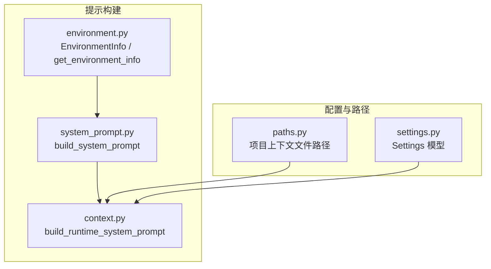
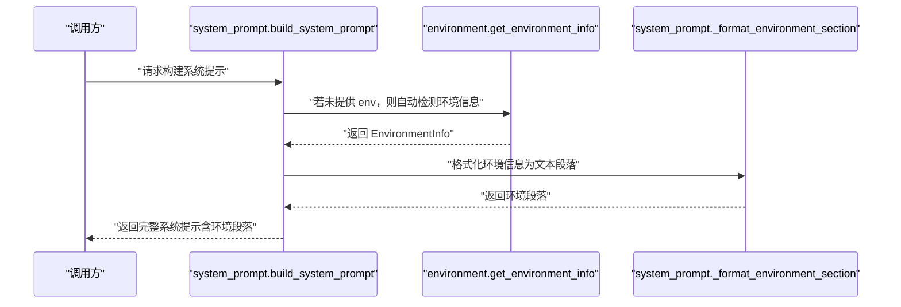
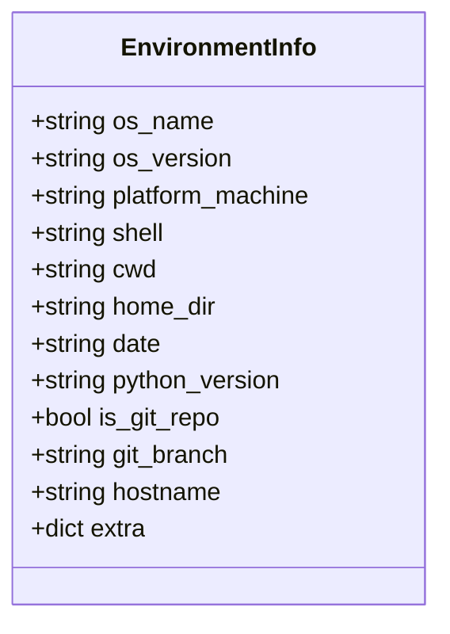
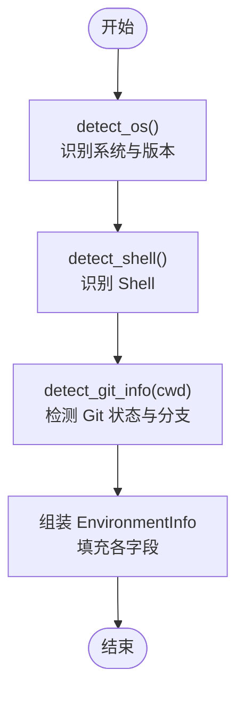
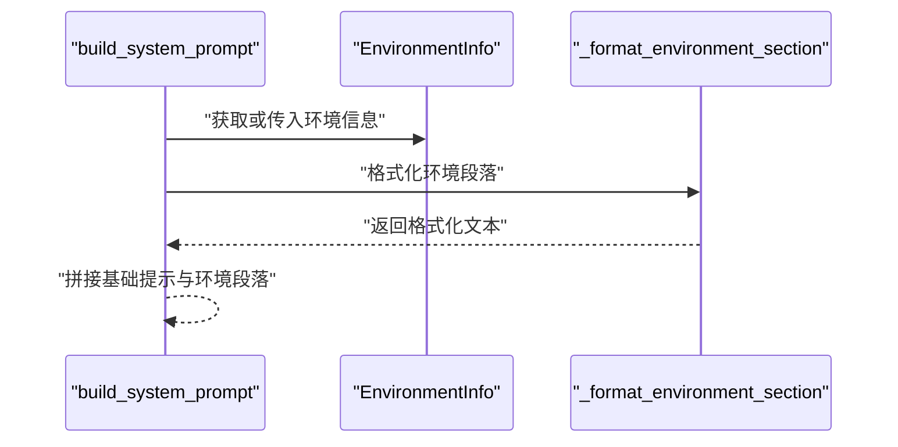
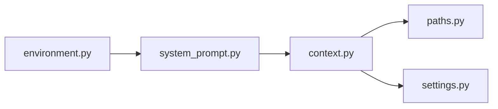

# 环境上下文处理

<cite>
**本文引用的文件列表**
- [environment.py](file://src/openharness/prompts/environment.py)
- [system_prompt.py](file://src/openharness/prompts/system_prompt.py)
- [context.py](file://src/openharness/prompts/context.py)
- [test_environment.py](file://tests/test_prompts/test_environment.py)
- [test_system_prompt.py](file://tests/test_prompts/test_system_prompt.py)
- [paths.py](file://src/openharness/config/paths.py)
- [settings.py](file://src/openharness/config/settings.py)
- [README.md](file://README.md)
</cite>

## 目录
1. [简介](#简介)
2. [项目结构](#项目结构)
3. [核心组件](#核心组件)
4. [架构总览](#架构总览)
5. [详细组件分析](#详细组件分析)
6. [依赖关系分析](#依赖关系分析)
7. [性能考量](#性能考量)
8. [故障排除指南](#故障排除指南)
9. [结论](#结论)
10. [附录](#附录)

## 简介
本文件聚焦 OpenHarness 的“环境上下文处理”子系统，围绕 EnvironmentInfo 数据模型与 get_environment_info 函数展开，解释其字段含义、实现原理、在系统提示构建中的作用与重要性，并提供扩展方法（新增环境变量、自定义检测逻辑、性能优化）以及实际示例与故障排除建议。该子系统通过自动采集运行时环境信息（操作系统、平台架构、Shell、工作目录、日期时间、Python 版本、Git 状态等），将其注入到系统提示中，帮助 AI 在不同环境下做出更贴合实际的响应与行为模式。

## 项目结构
与环境上下文处理直接相关的模块位于 prompts 子系统，同时涉及配置路径解析与设置加载：
- prompts/environment.py：环境信息采集与数据模型
- prompts/system_prompt.py：系统提示组装器，将环境信息格式化并拼接到系统提示中
- prompts/context.py：运行时系统提示构建（整合项目上下文、记忆、技能等）
- config/paths.py：项目级配置与上下文文件路径解析
- config/settings.py：全局设置模型（影响系统提示构建流程）
- tests/test_prompts/test_environment.py 与 tests/test_prompts/test_system_prompt.py：对环境信息与系统提示构建的测试用例

图表来源
- [environment.py:1-121](file://src/openharness/prompts/environment.py#L1-L121)
- [system_prompt.py:1-63](file://src/openharness/prompts/system_prompt.py#L1-L63)
- [context.py:1-102](file://src/openharness/prompts/context.py#L1-L102)
- [paths.py:1-117](file://src/openharness/config/paths.py#L1-L117)
- [settings.py:1-161](file://src/openharness/config/settings.py#L1-L161)

章节来源
- [environment.py:1-121](file://src/openharness/prompts/environment.py#L1-L121)
- [system_prompt.py:1-63](file://src/openharness/prompts/system_prompt.py#L1-L63)
- [context.py:1-102](file://src/openharness/prompts/context.py#L1-L102)
- [paths.py:1-117](file://src/openharness/config/paths.py#L1-L117)
- [settings.py:1-161](file://src/openharness/config/settings.py#L1-L161)

## 核心组件
- EnvironmentInfo 数据模型：封装当前运行时环境快照，包含操作系统、版本、平台机器类型、Shell、工作目录、主目录、日期、Python 版本、是否 Git 仓库、分支名、主机名及可扩展的额外键值对。
- detect_os/detect_shell/detect_git_info：分别负责操作系统与版本检测、Shell 探测、Git 仓库状态与分支检测。
- get_environment_info：聚合上述检测结果，生成 EnvironmentInfo 实例。
- build_system_prompt：将 EnvironmentInfo 格式化为系统提示的一部分；build_runtime_system_prompt：在系统提示基础上叠加项目上下文、记忆、技能等。

章节来源
- [environment.py:17-33](file://src/openharness/prompts/environment.py#L17-L33)
- [environment.py:35-96](file://src/openharness/prompts/environment.py#L35-L96)
- [environment.py:99-121](file://src/openharness/prompts/environment.py#L99-L121)
- [system_prompt.py:20-38](file://src/openharness/prompts/system_prompt.py#L20-L38)
- [system_prompt.py:41-62](file://src/openharness/prompts/system_prompt.py#L41-L62)
- [context.py:34-101](file://src/openharness/prompts/context.py#L34-L101)

## 架构总览
环境上下文处理在系统提示构建中的位置如下：
- 系统提示构建入口 build_system_prompt 调用 get_environment_info 自动采集环境信息，或接收外部传入的 EnvironmentInfo。
- 运行时系统提示构建 build_runtime_system_prompt 在基础系统提示之上，叠加项目 Issue/Pull Request 上下文、内存、技能等。
- 配置层 settings 提供系统提示定制项（如 system_prompt 自定义），paths 提供项目上下文文件路径。

图表来源
- [system_prompt.py:41-62](file://src/openharness/prompts/system_prompt.py#L41-L62)
- [environment.py:99-121](file://src/openharness/prompts/environment.py#L99-L121)
- [system_prompt.py:20-38](file://src/openharness/prompts/system_prompt.py#L20-L38)

## 详细组件分析

### EnvironmentInfo 数据模型
- 字段设计与语义
  - os_name/os_version：操作系统名称与版本，用于提示 AI 识别宿主平台差异。
  - platform_machine：平台机器类型（如 x86_64、arm64），影响工具可用性与命令行为。
  - shell：当前用户 Shell 名称，影响命令构造与路径分隔符等细节。
  - cwd/home_dir：工作目录与主目录，便于 AI 在提示中定位文件与执行上下文。
  - date：UTC 日期字符串（YYYY-MM-DD），用于时间敏感场景与日志关联。
  - python_version：Python 版本，影响可用库与语法特性。
  - is_git_repo/git_branch：Git 仓库状态与分支名，影响 AI 对版本控制的假设与建议。
  - hostname：主机名，辅助跨主机调试与定位。
  - extra：扩展字段，允许注入自定义键值对（例如 CI 环境变量、容器标识等）。
- 复杂度与性能
  - EnvironmentInfo 为轻量数据类，仅承载字段，不包含计算逻辑，读取与序列化开销极低。
  - 字段数量有限且均为标量或简单字符串，内存占用与拷贝成本可忽略。

图表来源
- [environment.py:17-33](file://src/openharness/prompts/environment.py#L17-L33)

章节来源
- [environment.py:17-33](file://src/openharness/prompts/environment.py#L17-L33)

### 环境信息采集函数族
- detect_os
  - 平台识别：Linux/macOS/Windows 分别采用不同策略；Linux 尝试使用 distro 获取详细版本，回退至 platform.release。
  - 返回值：(os_name, os_version)，保证非空字符串。
- detect_shell
  - 优先从环境变量 SHELL 解析 Shell 名称；若不存在则在 PATH 中探测常见 Shell（bash、zsh、fish、sh）之一。
  - 返回值：Shell 名称或 unknown。
- detect_git_info
  - 使用 subprocess 调用 git 命令检测是否在工作树内，并尝试获取当前分支名。
  - 超时控制与异常处理：捕获 FileNotFoundError 与 TimeoutExpired，避免阻塞。
  - 返回值：(is_git_repo, branch_name 或 None)。
- get_environment_info
  - 统一入口：收集 os、shell、git 信息，结合 platform、pathlib、datetime 等标准库生成 EnvironmentInfo。
  - 支持 cwd 覆盖，便于在特定项目目录下检测。

图表来源
- [environment.py:35-96](file://src/openharness/prompts/environment.py#L35-L96)
- [environment.py:99-121](file://src/openharness/prompts/environment.py#L99-L121)

章节来源
- [environment.py:35-96](file://src/openharness/prompts/environment.py#L35-L96)
- [environment.py:99-121](file://src/openharness/prompts/environment.py#L99-L121)

### 系统提示中的环境信息
- build_system_prompt
  - 若未提供 env，则自动调用 get_environment_info。
  - 将环境段落拼接在基础系统提示之后，作为系统提示的一部分。
- _format_environment_section
  - 将 EnvironmentInfo 的关键字段格式化为结构化文本，包含 OS、架构、Shell、工作目录、日期、Python 版本、Git 状态（含分支）。
- build_runtime_system_prompt
  - 在系统提示基础上，叠加项目 Issue/Pull Request 上下文、内存、技能等，形成最终运行时提示。

图表来源
- [system_prompt.py:41-62](file://src/openharness/prompts/system_prompt.py#L41-L62)
- [system_prompt.py:20-38](file://src/openharness/prompts/system_prompt.py#L20-L38)

章节来源
- [system_prompt.py:20-38](file://src/openharness/prompts/system_prompt.py#L20-L38)
- [system_prompt.py:41-62](file://src/openharness/prompts/system_prompt.py#L41-L62)
- [context.py:34-101](file://src/openharness/prompts/context.py#L34-L101)

### 测试验证
- 环境检测测试
  - detect_os 返回非空字符串元组。
  - detect_shell 优先从 SHELL 解析，回退时仍返回字符串。
  - detect_git_info 在仓库与非仓库场景分别返回正确布尔值与分支名（可能为 None）。
  - get_environment_info 返回 EnvironmentInfo 实例，字段齐全且符合预期格式。
- 系统提示测试
  - build_system_prompt 包含环境段落，且在 Git 无分支时不会显示分支信息。

章节来源
- [test_environment.py:17-69](file://tests/test_prompts/test_environment.py#L17-L69)
- [test_system_prompt.py:9-46](file://tests/test_prompts/test_system_prompt.py#L9-L46)

## 依赖关系分析
- 内部依赖
  - system_prompt 依赖 environment 提供 EnvironmentInfo 与 get_environment_info。
  - context 依赖 system_prompt 生成的基础系统提示，并在其上叠加项目上下文与记忆。
  - context 依赖 config.paths 提供项目上下文文件路径。
- 外部依赖
  - platform、distro（可选）、subprocess、shutil、pathlib、datetime 等标准库。
- 可能的循环依赖
  - 当前模块间为单向依赖（environment → system_prompt → context），无循环。

图表来源
- [environment.py:8-14](file://src/openharness/prompts/environment.py#L8-L14)
- [system_prompt.py:8](file://src/openharness/prompts/system_prompt.py#L8)
- [context.py:7-12](file://src/openharness/prompts/context.py#L7-L12)

章节来源
- [environment.py:8-14](file://src/openharness/prompts/environment.py#L8-L14)
- [system_prompt.py:8](file://src/openharness/prompts/system_prompt.py#L8)
- [context.py:7-12](file://src/openharness/prompts/context.py#L7-L12)

## 性能考量
- 检测成本
  - detect_os：Linux 优先 distro，失败回退 platform.release；成本低。
  - detect_shell：优先读取 SHELL，其次 PATH 探测，成本低。
  - detect_git_info：调用 git 子进程，带超时保护；在非仓库或无 git 时快速返回，成本可控。
- 时间复杂度
  - 所有检测函数均为 O(1) 或 O(k)（k 为 PATH 中候选数），整体常数时间。
- I/O 与外部进程
  - get_environment_info 仅使用标准库与一次可选的 subprocess 调用，I/O 成本极低。
- 优化建议
  - 缓存：若在同一会话中多次调用，可缓存 EnvironmentInfo 实例，避免重复检测。
  - 超时参数：detect_git_info 已内置超时，建议保持默认值以避免阻塞。
  - 条件检测：在已知环境稳定的场景，可跳过部分检测（如 Git 分支）以减少开销。
  - 扩展字段：通过 EnvironmentInfo.extra 注入必要信息，避免重复计算。

[本节为通用性能讨论，无需具体文件分析]

## 故障排除指南
- 无法检测到 Git 分支
  - 现象：git_branch 为 None。
  - 可能原因：不在 Git 仓库、仓库为空、git 命令不可用或超时。
  - 处理：确认当前目录为有效 Git 仓库，确保 git 可执行，检查 PATH 与权限。
- SHELL 环境变量缺失
  - 现象：detect_shell 返回 unknown。
  - 可能原因：SHELL 未设置或不可用。
  - 处理：在交互环境中设置 SHELL，或确保 PATH 中存在常用 Shell。
- distro 模块缺失（Linux）
  - 现象：Linux 版本显示 platform.release。
  - 处理：安装 distro 包以获取更精确的发行版版本信息。
- 系统提示中缺少环境段落
  - 现象：build_system_prompt 输出不含 Environment 部分。
  - 可能原因：custom_prompt 被覆盖为 None，或传入了自定义提示。
  - 处理：检查调用参数，确保未显式覆盖 system_prompt。
- 日期格式异常
  - 现象：date 非 YYYY-MM-DD。
  - 处理：确认时区设置与 datetime 行为，确保使用 UTC。

章节来源
- [environment.py:35-96](file://src/openharness/prompts/environment.py#L35-L96)
- [system_prompt.py:41-62](file://src/openharness/prompts/system_prompt.py#L41-L62)
- [test_environment.py:17-69](file://tests/test_prompts/test_environment.py#L17-L69)
- [test_system_prompt.py:27-46](file://tests/test_prompts/test_system_prompt.py#L27-L46)

## 结论
OpenHarness 的环境上下文处理通过轻量的数据模型与稳健的检测函数，将运行时环境信息无缝注入系统提示，从而提升 AI 在不同平台、Shell、Python 版本与 Git 状态下的适配能力与输出质量。通过合理的扩展点（extra 字段、自定义检测逻辑）与性能优化（缓存、条件检测），可在保证准确性的同时降低开销。测试用例覆盖了关键路径，确保功能稳定可靠。

[本节为总结性内容，无需具体文件分析]

## 附录

### 环境信息在提示构建中的作用与重要性
- 影响 AI 的行为模式
  - 不同 OS/Shell/Python 版本会影响命令可用性与路径分隔符，提示中明确这些信息有助于 AI 选择更合适的工具与命令。
  - Git 状态与分支信息可帮助 AI 判断是否需要考虑版本控制操作（如切换分支、提交变更）。
- 提升输出质量
  - 明确的工作目录与主机信息有助于 AI 更准确地定位文件与执行上下文，减少歧义。
  - UTC 日期可用于时间敏感任务的参考，避免跨时区误解。

[本节为概念性说明，无需具体文件分析]

### 实际环境信息示例
以下示例展示系统提示中环境段落的典型呈现方式（字段对应关系见数据模型）：
- OS: Linux 5.15.0
- Architecture: x86_64
- Shell: bash
- Working directory: /home/user/project
- Date: 2026-04-01
- Python: 3.10.17
- Git: yes (branch: main)

章节来源
- [test_system_prompt.py:27-46](file://tests/test_prompts/test_system_prompt.py#L27-L46)

### 扩展方法
- 添加新的环境变量
  - 在 EnvironmentInfo.extra 中注入键值对，例如 CI 环境变量、容器 ID、集群信息等。
  - 在 get_environment_info 中补充检测逻辑，将新变量写入 extra。
- 自定义检测逻辑
  - 重写 detect_os/detect_shell/detect_git_info，或在 get_environment_info 中合并自定义逻辑。
  - 注意保持超时与异常处理，避免阻塞。
- 性能优化
  - 同一会话内复用 EnvironmentInfo 实例，避免重复检测。
  - 在已知稳定环境（CI、容器）中跳过部分检测，或缓存结果。
- 与系统提示集成
  - 在 build_system_prompt 中扩展格式化逻辑，将 extra 字段纳入环境段落。
  - 在 build_runtime_system_prompt 中结合项目上下文与记忆，形成更丰富的运行时提示。

[本节为通用扩展指导，无需具体文件分析]