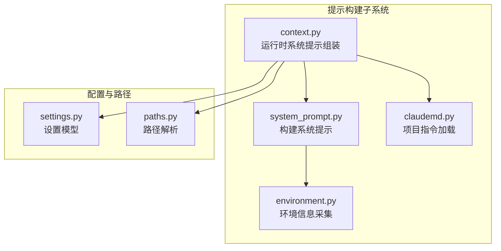
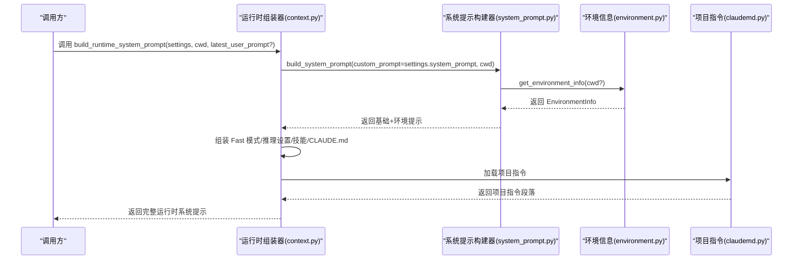
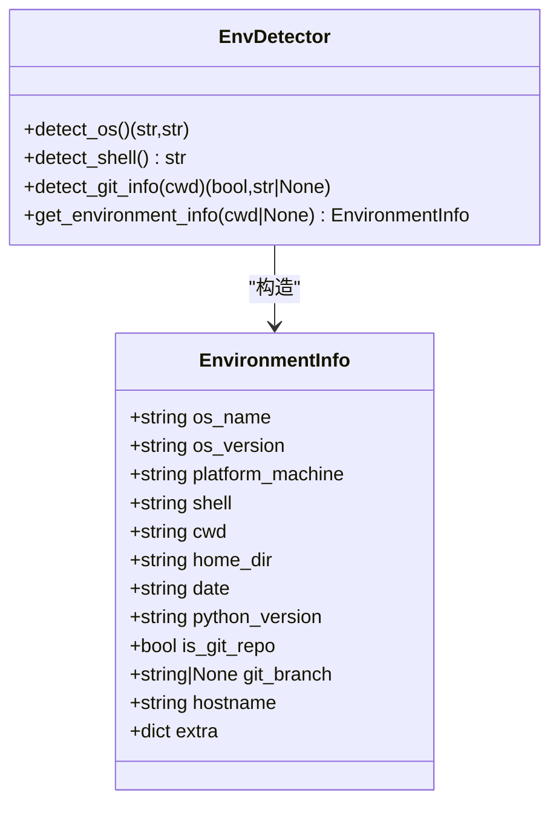
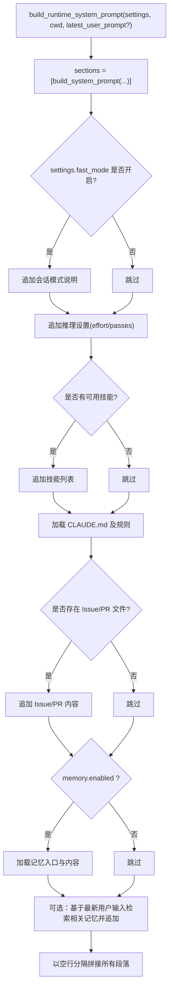
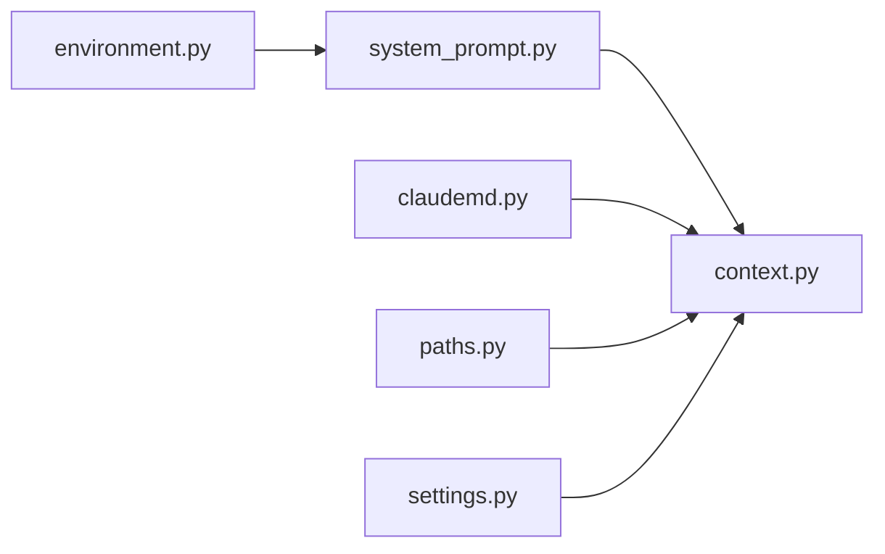

# 系统提示构建器

<cite>
**本文引用的文件**
- [system_prompt.py](file://src/openharness/prompts/system_prompt.py)
- [environment.py](file://src/openharness/prompts/environment.py)
- [context.py](file://src/openharness/prompts/context.py)
- [claudemd.py](file://src/openharness/prompts/claudemd.py)
- [settings.py](file://src/openharness/config/settings.py)
- [paths.py](file://src/openharness/config/paths.py)
- [test_system_prompt.py](file://tests/test_prompts/test_system_prompt.py)
- [test_environment.py](file://tests/test_prompts/test_environment.py)
- [test_claudemd.py](file://tests/test_prompts/test_claudemd.py)
- [manager.py](file://src/openharness/memory/manager.py)
- [loader.py](file://src/openharness/skills/loader.py)
</cite>

## 目录
1. [简介](#简介)
2. [项目结构](#项目结构)
3. [核心组件](#核心组件)
4. [架构总览](#架构总览)
5. [详细组件分析](#详细组件分析)
6. [依赖关系分析](#依赖关系分析)
7. [性能考量](#性能考量)
8. [故障排查指南](#故障排查指南)
9. [结论](#结论)
10. [附录：使用示例与配置项](#附录使用示例与配置项)

## 简介
本文件面向 OpenHarness 的“系统提示构建器”，系统性阐述其构建原理与架构，重点覆盖：
- 基础提示模板的设计与作用
- 环境信息的采集与格式化策略
- 自定义提示的覆盖机制
- build_system_prompt 的完整工作流程（参数处理、环境信息获取、提示拼接）
- _format_environment_section 的格式化细节（操作系统、架构、Shell、工作目录、日期、Python 版本、Git 信息等）
- 最佳实践（模板设计、环境信息优化、性能考虑）
- 实际使用示例与配置项说明

## 项目结构
系统提示构建器位于 prompts 子模块中，围绕以下文件协同工作：
- system_prompt.py：系统提示组装的核心逻辑
- environment.py：环境信息采集与数据模型
- context.py：运行时系统提示的高层组装（结合项目上下文、记忆、技能等）
- claudemd.py：项目级指令文件（CLAUDE.md）发现与加载
- settings.py 与 paths.py：设置与路径解析，影响系统提示的来源与行为
- 测试文件：验证构建器的行为与边界条件



图表来源
- [system_prompt.py:1-63](file://src/openharness/prompts/system_prompt.py#L1-L63)
- [environment.py:1-121](file://src/openharness/prompts/environment.py#L1-L121)
- [context.py:1-102](file://src/openharness/prompts/context.py#L1-L102)
- [claudemd.py:1-49](file://src/openharness/prompts/claudemd.py#L1-L49)
- [settings.py:1-161](file://src/openharness/config/settings.py#L1-L161)
- [paths.py:1-117](file://src/openharness/config/paths.py#L1-L117)

章节来源
- [system_prompt.py:1-63](file://src/openharness/prompts/system_prompt.py#L1-L63)
- [environment.py:1-121](file://src/openharness/prompts/environment.py#L1-L121)
- [context.py:1-102](file://src/openharness/prompts/context.py#L1-L102)
- [claudemd.py:1-49](file://src/openharness/prompts/claudemd.py#L1-L49)
- [settings.py:1-161](file://src/openharness/config/settings.py#L1-L161)
- [paths.py:1-117](file://src/openharness/config/paths.py#L1-L117)

## 核心组件
- 系统提示构建器（system_prompt.py）
  - 提供基础提示模板与环境信息格式化函数，并通过 build_system_prompt 组装最终提示
- 环境信息采集器（environment.py）
  - 定义 EnvironmentInfo 数据模型，提供 detect_os、detect_shell、detect_git_info、get_environment_info 等能力
- 运行时系统提示组装器（context.py）
  - 在基础系统提示之上，叠加会话模式、推理设置、可用技能列表、项目指令（CLAUDE.md）、Issue/PR 上下文、以及可选的记忆片段
- 项目指令加载器（claudemd.py）
  - 发现并加载 CLAUDE.md 及 .claude/rules 下的规则文件，形成“项目指令”段落
- 设置与路径（settings.py、paths.py）
  - Settings 提供 system_prompt、fast_mode、effort、passes 等关键字段；paths 提供项目上下文文件路径解析

章节来源
- [system_prompt.py:11-62](file://src/openharness/prompts/system_prompt.py#L11-L62)
- [environment.py:17-120](file://src/openharness/prompts/environment.py#L17-L120)
- [context.py:34-101](file://src/openharness/prompts/context.py#L34-L101)
- [claudemd.py:8-48](file://src/openharness/prompts/claudemd.py#L8-L48)
- [settings.py:49-74](file://src/openharness/config/settings.py#L49-L74)
- [paths.py:102-116](file://src/openharness/config/paths.py#L102-L116)

## 架构总览
系统提示构建器采用“分层组装”的架构：
- 底层：基础提示模板（固定职责与风格）
- 中层：环境信息（动态上下文，随运行时变化）
- 上层：运行时上下文（会话模式、推理设置、技能、项目指令、Issue/PR、记忆）



图表来源
- [context.py:34-101](file://src/openharness/prompts/context.py#L34-L101)
- [system_prompt.py:41-62](file://src/openharness/prompts/system_prompt.py#L41-L62)
- [environment.py:99-120](file://src/openharness/prompts/environment.py#L99-L120)
- [claudemd.py:36-48](file://src/openharness/prompts/claudemd.py#L36-L48)

## 详细组件分析

### 组件一：系统提示构建器（system_prompt.py）
- 基础提示模板
  - 用于定义 AI 助手的角色定位、任务范围与输出风格
- 环境信息格式化函数
  - 将 EnvironmentInfo 的字段格式化为“# Environment”段落，包含操作系统、版本、架构、Shell、工作目录、日期、Python 版本、Git 仓库状态与分支（若存在）
- build_system_prompt
  - 参数处理：支持 custom_prompt（完全替换基础模板）、env（预构建环境信息）、cwd（仅在 env 未提供时使用）
  - 环境信息获取：当 env 为空时自动调用 get_environment_info(cwd)
  - 提示拼接：将基础模板与环境段落以空行分隔合并

```mermaid
flowchart TD
Start(["进入 build_system_prompt"]) --> CheckEnv{"是否提供 env?"}
CheckEnv --> |是| UseProvidedEnv["使用传入的 EnvironmentInfo"]
CheckEnv --> |否| DetectEnv["调用 get_environment_info(cwd?)"]
DetectEnv --> BuildBase{"是否提供 custom_prompt?"}
UseProvidedEnv --> BuildBase
BuildBase --> |是| Base = Custom["base = custom_prompt"]
BuildBase --> |否| Base = Default["_BASE_SYSTEM_PROMPT"]
Base --> FormatEnv["_format_environment_section(env)"]
FormatEnv --> Join["拼接 base 与环境段落"]
Join --> End(["返回完整系统提示"])
```

图表来源
- [system_prompt.py:41-62](file://src/openharness/prompts/system_prompt.py#L41-L62)
- [system_prompt.py:20-38](file://src/openharness/prompts/system_prompt.py#L20-L38)
- [environment.py:99-120](file://src/openharness/prompts/environment.py#L99-L120)

章节来源
- [system_prompt.py:11-62](file://src/openharness/prompts/system_prompt.py#L11-L62)
- [test_system_prompt.py:27-64](file://tests/test_prompts/test_system_prompt.py#L27-L64)

### 组件二：环境信息采集器（environment.py）
- 数据模型 EnvironmentInfo
  - 字段涵盖操作系统名称与版本、平台机器类型、Shell 名称、当前工作目录、用户主目录、UTC 日期、Python 版本、是否为 Git 仓库、Git 分支名、主机名、额外键值对
- detect_os/detect_shell/detect_git_info
  - detect_os：根据平台系统识别 Linux/macOS/Windows 并尝试读取更详细的版本信息
  - detect_shell：优先从环境变量提取，否则在 PATH 中回退查找常见 Shell
  - detect_git_info：通过 git 子进程检测是否为工作树、并尝试读取当前分支名，带超时保护
- get_environment_info
  - 聚合上述信息，生成 EnvironmentInfo 快照，时间戳为 UTC 日期字符串



图表来源
- [environment.py:17-120](file://src/openharness/prompts/environment.py#L17-L120)

章节来源
- [environment.py:17-120](file://src/openharness/prompts/environment.py#L17-L120)
- [test_environment.py:17-68](file://tests/test_prompts/test_environment.py#L17-L68)

### 组件三：运行时系统提示组装器（context.py）
- build_runtime_system_prompt
  - 基于 Settings 与 cwd 组装完整系统提示
  - 固定顺序：基础系统提示（可被自定义覆盖）→ Fast 模式说明（若启用）→ 推理设置（effort/passes）→ 技能列表（若有）→ 项目指令（CLAUDE.md 及规则）→ Issue/PR 上下文（若存在）→ 记忆片段（若启用）
  - 支持根据最新用户输入检索相关记忆并追加“相关记忆”段落



图表来源
- [context.py:34-101](file://src/openharness/prompts/context.py#L34-L101)
- [claudemd.py:36-48](file://src/openharness/prompts/claudemd.py#L36-L48)
- [paths.py:109-116](file://src/openharness/config/paths.py#L109-L116)
- [settings.py:41-47](file://src/openharness/config/settings.py#L41-L47)

章节来源
- [context.py:34-101](file://src/openharness/prompts/context.py#L34-L101)
- [test_claudemd.py:39-69](file://tests/test_prompts/test_claudemd.py#L39-L69)

### 组件四：项目指令加载器（claudemd.py）
- discover_claude_md_files
  - 从 cwd 向上遍历，收集 CLAUDE.md 与 .claude/rules 下的规则文件，避免重复
- load_claude_md_prompt
  - 将发现的文件内容加载为“# Project Instructions”段落，支持每文件最大字符截断

章节来源
- [claudemd.py:8-48](file://src/openharness/prompts/claudemd.py#L8-L48)
- [test_claudemd.py:12-36](file://tests/test_prompts/test_claudemd.py#L12-L36)

### 组件五：设置与路径（settings.py、paths.py）
- Settings
  - system_prompt：可覆盖基础系统提示
  - fast_mode、effort、passes：控制推理深度与迭代次数
  - memory：控制记忆系统的启用与检索上限
- paths
  - 提供项目级 issue.md、pr_comments.md 的路径解析，用于注入上下文

章节来源
- [settings.py:49-74](file://src/openharness/config/settings.py#L49-L74)
- [paths.py:109-116](file://src/openharness/config/paths.py#L109-L116)

## 依赖关系分析
- system_prompt.py 依赖 environment.py 提供的 EnvironmentInfo 与 get_environment_info
- context.py 依赖 system_prompt.py 产出的基础系统提示，并进一步叠加 CLAUDE.md、技能、Issue/PR、记忆等
- claudemd.py 与 paths.py 为 context.py 提供项目指令与上下文文件路径
- settings.py 为 context.py 提供 fast_mode、effort、passes、memory 等配置



图表来源
- [system_prompt.py:8](file://src/openharness/prompts/system_prompt.py#L8)
- [environment.py:12](file://src/openharness/prompts/environment.py#L12)
- [context.py:7-12](file://src/openharness/prompts/context.py#L7-L12)
- [claudemd.py:5](file://src/openharness/prompts/claudemd.py#L5)
- [paths.py:7-8](file://src/openharness/config/paths.py#L7-L8)
- [settings.py:8](file://src/openharness/config/settings.py#L8)

章节来源
- [system_prompt.py:8](file://src/openharness/prompts/system_prompt.py#L8)
- [environment.py:12](file://src/openharness/prompts/environment.py#L12)
- [context.py:7-12](file://src/openharness/prompts/context.py#L7-L12)
- [claudemd.py:5](file://src/openharness/prompts/claudemd.py#L5)
- [paths.py:7-8](file://src/openharness/config/paths.py#L7-L8)
- [settings.py:8](file://src/openharness/config/settings.py#L8)

## 性能考量
- 环境信息采集
  - detect_os：Linux/macOS/Windows 分支处理，Linux 优先尝试 distro 获取详细版本，失败回退 platform.release
  - detect_shell：优先读取 SHELL，否则在 PATH 中查找 bash/zsh/fish/sh，避免昂贵的外部调用
  - detect_git_info：使用 subprocess 调用 git，设置超时，遇到 FileNotFoundError 或超时直接返回非仓库状态
- 系统提示构建
  - build_system_prompt：仅进行字符串拼接，复杂度 O(n)，n 为提示长度
  - _format_environment_section：固定行数拼接，O(1) 额外开销
- 运行时组装
  - context.py：按需加载 CLAUDE.md、Issue/PR、记忆，避免不必要的 IO
  - memory.enabled 控制是否加载与检索记忆，减少磁盘访问
- 建议
  - 尽量复用已构建的 EnvironmentInfo，避免重复调用 get_environment_info
  - 在 CI 或批量场景中，可通过 custom_prompt 覆盖基础模板，减少拼接成本
  - 合理设置 memory.max_files 与 max_entrypoint_lines，避免大文本注入导致提示膨胀

[本节为通用性能建议，不直接分析具体文件]

## 故障排查指南
- 环境信息缺失或异常
  - 现象：提示中缺少某些环境字段
  - 排查：确认 detect_os/detect_shell/detect_git_info 的返回值；检查 PATH 与 SHELL 环境变量；确认 git 可执行文件可达且工作树有效
- Git 信息未显示
  - 现象：提示中无 Git: yes 或 branch: ...
  - 排查：detect_git_info 对未仓库或超时返回 False/None；确认工作目录正确、git 命令可用、分支名可读
- 自定义提示未生效
  - 现象：基础模板仍出现
  - 排查：确认 custom_prompt 已传入且非 None；build_system_prompt 的 custom_prompt 分支逻辑
- 项目指令未注入
  - 现象：提示中无 Project Instructions
  - 排查：确认 CLAUDE.md 或 .claude/rules 存在且可读；discover_claude_md_files 路径解析正确
- 记忆未注入
  - 现象：提示中无 Memory 或 Relevant Memories
  - 排查：确认 memory.enabled 为 True；检查记忆入口与相关文件存在且可读；确认 latest_user_prompt 存在以触发相关记忆检索

章节来源
- [test_system_prompt.py:27-64](file://tests/test_prompts/test_system_prompt.py#L27-L64)
- [test_environment.py:41-53](file://tests/test_prompts/test_environment.py#L41-L53)
- [test_claudemd.py:12-36](file://tests/test_prompts/test_claudemd.py#L12-L36)

## 结论
系统提示构建器通过“基础模板 + 动态环境信息 + 运行时上下文”的分层设计，实现了可定制、可扩展、可维护的系统提示生成。其关键优势在于：
- 明确的覆盖机制：custom_prompt 可完全替换基础模板
- 精准的环境信息：自动采集 OS、Shell、Git 等关键上下文
- 渐进式上下文叠加：运行时按需注入技能、项目指令、Issue/PR、记忆等
- 良好的性能与健壮性：外部依赖（git）超时保护，IO 按需触发

[本节为总结性内容，不直接分析具体文件]

## 附录：使用示例与配置项

### 使用示例
- 仅使用默认基础模板与自动环境信息
  - 调用 build_system_prompt(env=None, cwd=工作目录)
- 使用自定义系统提示覆盖基础模板
  - 调用 build_system_prompt(custom_prompt="你的自定义提示", env=环境信息)
- 运行时系统提示（推荐）
  - 调用 build_runtime_system_prompt(settings, cwd=工作目录, latest_user_prompt=最新用户输入)

章节来源
- [system_prompt.py:41-62](file://src/openharness/prompts/system_prompt.py#L41-L62)
- [context.py:34-101](file://src/openharness/prompts/context.py#L34-L101)

### 配置项说明
- Settings.system_prompt
  - 类型：字符串或 None
  - 作用：覆盖基础系统提示模板
- Settings.fast_mode
  - 类型：布尔
  - 作用：启用后在系统提示中加入“快速模式”说明，指导模型偏好简洁回复与较少工具使用
- Settings.effort
  - 类型：字符串
  - 作用：在系统提示中声明推理努力级别，影响模型思考深度
- Settings.passes
  - 类型：整数
  - 作用：在系统提示中声明迭代次数，影响模型探索广度
- Settings.memory.enabled/max_files/max_entrypoint_lines
  - 类型：布尔/整数
  - 作用：控制是否启用记忆、最多检索文件数量、入口文件最大行数
- Paths.issue/pr_comments 文件
  - 作用：注入项目 Issue 与 PR 评论上下文到系统提示

章节来源
- [settings.py:49-74](file://src/openharness/config/settings.py#L49-L74)
- [paths.py:109-116](file://src/openharness/config/paths.py#L109-L116)