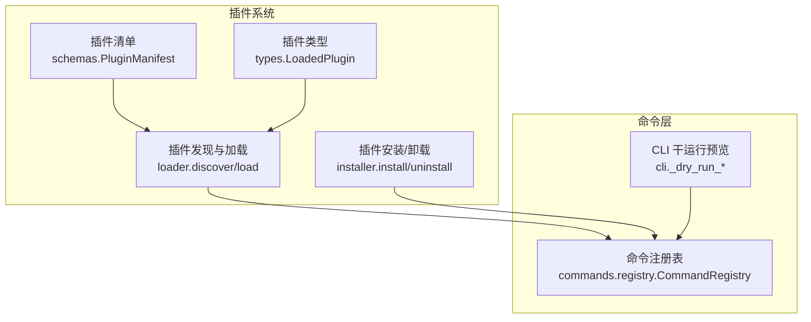
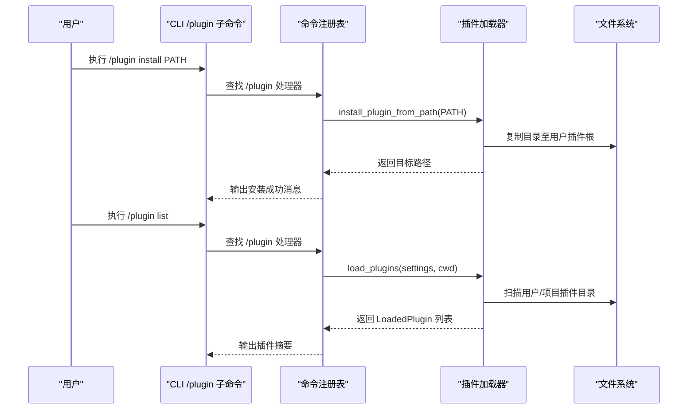
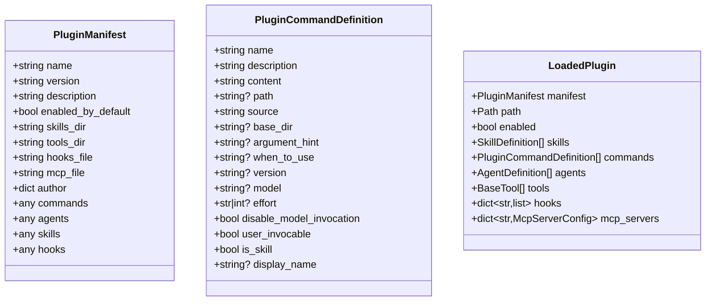
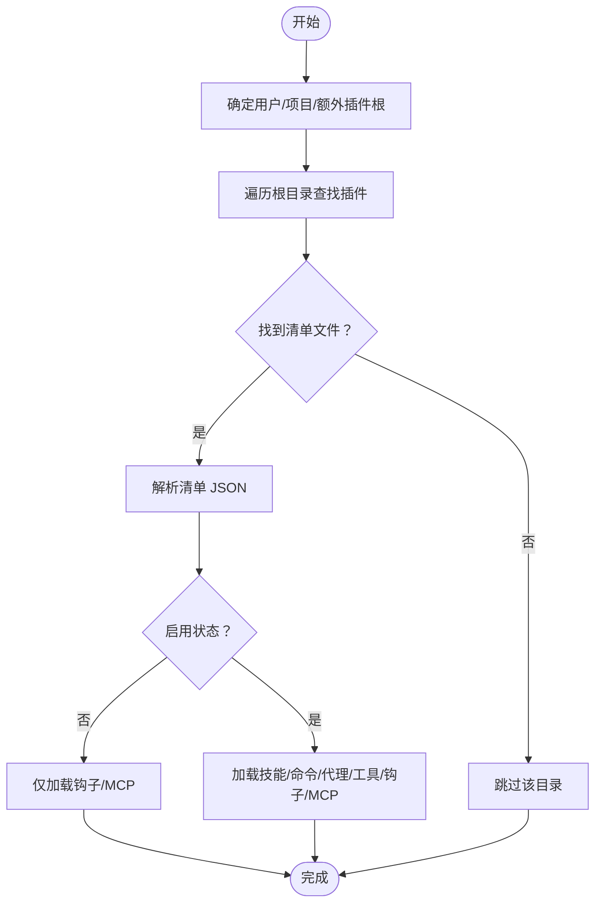
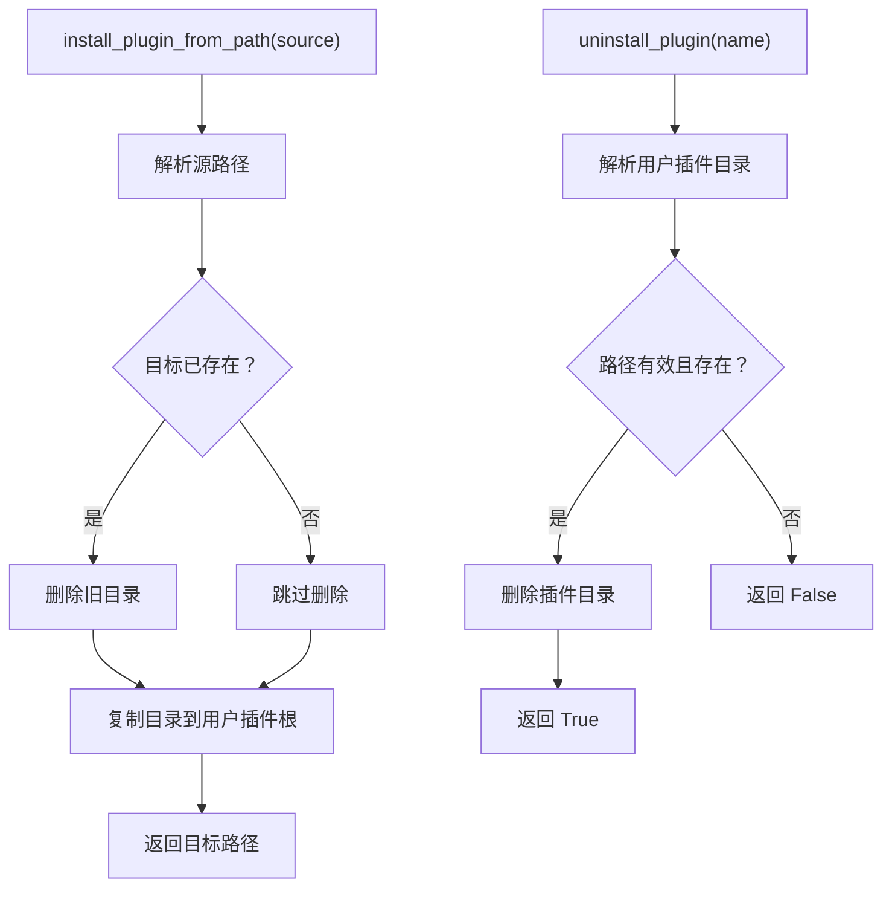
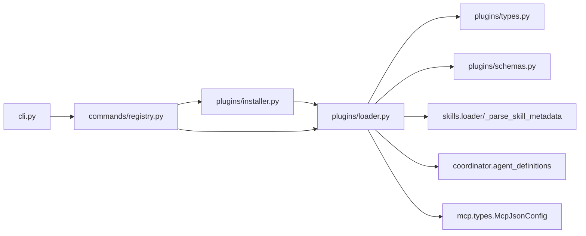

# 插件兼容性与迁移

<cite>
**本文引用的文件**
- [README.md](file://README.md)
- [SHOWCASE.md](file://docs/SHOWCASE.md)
- [plugins/__init__.py](file://src/openharness/plugins/__init__.py)
- [plugins/loader.py](file://src/openharness/plugins/loader.py)
- [plugins/schemas.py](file://src/openharness/plugins/schemas.py)
- [plugins/types.py](file://src/openharness/plugins/types.py)
- [plugins/installer.py](file://src/openharness/plugins/installer.py)
- [commands/registry.py](file://src/openharness/commands/registry.py)
- [cli.py](file://src/openharness/cli.py)
- [.claude/skills/harness-eval/SKILL.md](file://.claude/skills/harness-eval/SKILL.md)
- [.claude/skills/pr-merge/SKILL.md](file://.claude/skills/pr-merge/SKILL.md)
- [memory/migrate.py](file://src/openharness/memory/migrate.py)
- [scripts/migrate_memory.py](file://scripts/migrate_memory.py)
- [auth/external.py](file://src/openharness/auth/external.py)
- [autopilot/service.py](file://src/openharness/autopilot/service.py)
</cite>

## 目录
1. [简介](#简介)
2. [项目结构](#项目结构)
3. [核心组件](#核心组件)
4. [架构总览](#架构总览)
5. [详细组件分析](#详细组件分析)
6. [依赖关系分析](#依赖关系分析)
7. [性能考量](#性能考量)
8. [故障排查指南](#故障排查指南)
9. [结论](#结论)
10. [附录](#附录)

## 简介
本文件面向从 Claude Code 插件体系迁移到 OpenHarness 插件体系的用户，提供兼容性说明、差异对比、迁移步骤、版本与兼容性检查策略、常见问题诊断与修复建议，以及可复用的迁移脚本与工具使用方法。OpenHarness 明确声明对 claude-code 插件与 anthropics/skills 的兼容，并在插件清单、目录布局、命令与技能加载、钩子与 MCP 配置等方面保持一致或等价实现，便于平滑迁移。

## 项目结构
围绕插件兼容性与迁移的关键模块包括：
- 插件发现与加载：扫描用户与项目级插件目录，解析清单与贡献内容（技能、命令、代理、工具、钩子、MCP）
- 插件清单与类型：定义插件清单字段与运行时装载结果的数据结构
- 插件安装与卸载：将外部插件复制到用户插件目录，支持按名称卸载
- 命令注册表：提供 /plugin 子命令以列出、启用/禁用、安装、卸载插件
- 兼容性与生态：README 中明确“兼容 claude-code 插件”，并提供示例与工作流

图表来源
- [plugins/schemas.py:8-25](file://src/openharness/plugins/schemas.py#L8-L25)
- [plugins/types.py:18-60](file://src/openharness/plugins/types.py#L18-L60)
- [plugins/loader.py:107-163](file://src/openharness/plugins/loader.py#L107-L163)
- [plugins/installer.py:23-40](file://src/openharness/plugins/installer.py#L23-L40)
- [commands/registry.py:1463-1473](file://src/openharness/commands/registry.py#L1463-L1473)
- [cli.py:124-200](file://src/openharness/cli.py#L124-L200)

章节来源
- [README.md:586-605](file://README.md#L586-L605)
- [plugins/__init__.py:11-54](file://src/openharness/plugins/__init__.py#L11-L54)
- [plugins/loader.py:61-124](file://src/openharness/plugins/loader.py#L61-L124)
- [plugins/installer.py:23-40](file://src/openharness/plugins/installer.py#L23-L40)
- [commands/registry.py:1463-1473](file://src/openharness/commands/registry.py#L1463-L1473)

## 核心组件
- 插件清单（PluginManifest）：描述插件名称、版本、默认启用状态、技能/工具/钩子/MCP 目录位置及扩展字段
- 已装载插件（LoadedPlugin）：封装清单、路径、启用状态与贡献的技能、命令、代理、工具、钩子、MCP 服务器
- 插件发现与加载：扫描用户与项目插件根目录，解析 plugin.json 或 .claude-plugin/plugin.json，按清单加载各贡献项
- 插件安装/卸载：将外部插件目录复制到用户插件目录；按名称删除用户插件目录
- 命令注册表中的 /plugin 子命令：提供 list、enable、disable、install、uninstall 能力
- 干运行预览：CLI 对干运行输出进行“只读/有状态”分类，辅助迁移前评估

章节来源
- [plugins/schemas.py:8-25](file://src/openharness/plugins/schemas.py#L8-L25)
- [plugins/types.py:18-60](file://src/openharness/plugins/types.py#L18-L60)
- [plugins/loader.py:61-163](file://src/openharness/plugins/loader.py#L61-L163)
- [plugins/installer.py:23-40](file://src/openharness/plugins/installer.py#L23-L40)
- [commands/registry.py:1463-1473](file://src/openharness/commands/registry.py#L1463-L1473)
- [cli.py:124-200](file://src/openharness/cli.py#L124-L200)

## 架构总览
OpenHarness 插件系统在加载阶段即与 Claude Code 插件布局兼容，通过标准清单与目录约定实现无缝对接。下图展示从磁盘到命令注册表的整体流程：

图表来源
- [commands/registry.py:1463-1473](file://src/openharness/commands/registry.py#L1463-L1473)
- [plugins/installer.py:23-40](file://src/openharness/plugins/installer.py#L23-L40)
- [plugins/loader.py:107-124](file://src/openharness/plugins/loader.py#L107-L124)

## 详细组件分析

### 组件一：插件清单与类型
- 清单字段覆盖名称、版本、描述、默认启用、技能/工具/钩子/MCP 目录名，以及可选扩展字段（作者、commands、agents、skills、hooks）
- 运行时装载结果包含清单、路径、启用状态与贡献项集合，便于后续注册与使用

图表来源
- [plugins/schemas.py:8-25](file://src/openharness/plugins/schemas.py#L8-L25)
- [plugins/types.py:18-60](file://src/openharness/plugins/types.py#L18-L60)

章节来源
- [plugins/schemas.py:8-25](file://src/openharness/plugins/schemas.py#L8-L25)
- [plugins/types.py:18-60](file://src/openharness/plugins/types.py#L18-L60)

### 组件二：插件发现与加载
- 发现范围：用户插件根与项目插件根，支持额外根目录；可按设置决定是否允许项目本地插件
- 清单解析：优先 .claude-plugin/plugin.json，其次 plugin.json；失败则跳过该插件
- 贡献项加载：技能（SKILL.md）、命令（commands/*.md）、代理（agents/*.md）、工具（tools/*.py）、钩子（hooks.json 或 hooks 目录结构化格式）、MCP（mcp.json 或 .mcp.json）

图表来源
- [plugins/loader.py:61-124](file://src/openharness/plugins/loader.py#L61-L124)
- [plugins/loader.py:126-163](file://src/openharness/plugins/loader.py#L126-L163)

章节来源
- [plugins/loader.py:61-124](file://src/openharness/plugins/loader.py#L61-L124)
- [plugins/loader.py:126-163](file://src/openharness/plugins/loader.py#L126-L163)

### 组件三：插件安装与卸载
- 安装：校验源路径存在且为目录，复制到用户插件根，同名覆盖
- 卸载：按名称解析到用户插件根的直接子目录，存在则删除

图表来源
- [plugins/installer.py:23-40](file://src/openharness/plugins/installer.py#L23-L40)

章节来源
- [plugins/installer.py:23-40](file://src/openharness/plugins/installer.py#L23-L40)

### 组件四：命令注册表中的 /plugin 子命令
- 支持 list、enable、disable、install、uninstall
- 安装后可立即启用；禁用会写入设置中的 enabled_plugins；卸载会删除目录
- 提供插件摘要输出，便于确认装载情况

章节来源
- [commands/registry.py:1463-1473](file://src/openharness/commands/registry.py#L1463-L1473)

### 组件五：干运行预览与兼容性检查
- CLI 将干运行输出分为“只读”“有状态”两类，辅助判断迁移后命令行为
- README 明确“兼容 claude-code 插件”，并提供示例与工作流

章节来源
- [cli.py:124-200](file://src/openharness/cli.py#L124-L200)
- [README.md:586-605](file://README.md#L586-L605)

## 依赖关系分析
- 插件系统依赖配置路径（用户插件根）、技能加载器（用于解析 SKILL.md）、代理定义（用于解析 agents/*.md）、MCP 类型（用于解析 mcp.json/.mcp.json）
- 命令注册表依赖插件加载器与安装器，提供统一的 /plugin 子命令入口
- 干运行预览依赖 CLI 的命令行为分类逻辑

图表来源
- [plugins/loader.py:28-31](file://src/openharness/plugins/loader.py#L28-L31)
- [plugins/types.py:9-12](file://src/openharness/plugins/types.py#L9-L12)
- [plugins/schemas.py:8-25](file://src/openharness/plugins/schemas.py#L8-L25)
- [commands/registry.py:66-68](file://src/openharness/commands/registry.py#L66-L68)
- [cli.py:124-200](file://src/openharness/cli.py#L124-L200)

章节来源
- [plugins/loader.py:28-31](file://src/openharness/plugins/loader.py#L28-L31)
- [plugins/types.py:9-12](file://src/openharness/plugins/types.py#L9-L12)
- [plugins/schemas.py:8-25](file://src/openharness/plugins/schemas.py#L8-L25)
- [commands/registry.py:66-68](file://src/openharness/commands/registry.py#L66-L68)
- [cli.py:124-200](file://src/openharness/cli.py#L124-L200)

## 性能考量
- 插件发现采用遍历扫描，建议控制插件数量与层级深度，避免过多 I/O
- 工具模块动态导入时可能产生冷启动开销，可通过缓存或延迟加载优化
- 干运行预览不调用模型与工具执行，适合在迁移前后快速评估影响面

## 故障排查指南
- 插件未被识别
  - 检查是否存在 plugin.json 或 .claude-plugin/plugin.json
  - 确认清单字段完整且 JSON 可解析
- 报错“无效插件名称”
  - 卸载时传入的名称需为纯目录名且不包含路径分隔符
- 插件已安装但未启用
  - 使用 /plugin enable 启用；或在设置中配置 enabled_plugins
- 项目本地插件未加载
  - 检查 allow_project_plugins 设置；必要时显式开启
- MCP 配置错误
  - 使用干运行预览查看 MCP 传输类型与目标；验证命令/URL 是否正确
- 订阅凭证与外部集成
  - 若涉及 Claude Code/Claude 订阅，参考外部认证集成模块与会话标识生成逻辑

章节来源
- [plugins/loader.py:126-136](file://src/openharness/plugins/loader.py#L126-L136)
- [plugins/installer.py:11-20](file://src/openharness/plugins/installer.py#L11-L20)
- [commands/registry.py:1463-1473](file://src/openharness/commands/registry.py#L1463-L1473)
- [cli.py:89-122](file://src/openharness/cli.py#L89-L122)
- [auth/external.py:356-410](file://src/openharness/auth/external.py#L356-L410)

## 结论
OpenHarness 在插件层面与 Claude Code 生态保持高度兼容，通过标准清单与目录约定实现平滑迁移。结合命令注册表提供的 /plugin 子命令、干运行预览与 README 的兼容性声明，用户可以系统地完成从 claude-code 插件到 OpenHarness 插件的迁移与验证。

## 附录

### 从 Claude Code 插件迁移到 OpenHarness 插件的步骤
- 准备阶段
  - 确认当前工作区已安装 OpenHarness，并完成 provider 与认证配置
  - 使用 README 的兼容性说明核对目标插件是否属于 claude-code 插件生态
- 插件安装
  - 使用 /plugin install <插件源目录路径> 安装插件
  - 如需临时禁用，使用 /plugin disable <插件名>
- 加载与验证
  - 使用 /plugin list 查看已装载插件摘要
  - 使用干运行预览（--dry-run）评估命令行为类别（只读/有状态）
- 迁移后回归
  - 运行真实场景测试（如 harness-eval），确保工具链、钩子、技能与代理在新环境中正常工作
  - 参考 pr-merge 技能模板，验证与外部贡献流程的衔接

章节来源
- [README.md:586-605](file://README.md#L586-L605)
- [commands/registry.py:1463-1473](file://src/openharness/commands/registry.py#L1463-L1473)
- [.claude/skills/harness-eval/SKILL.md:1-194](file://.claude/skills/harness-eval/SKILL.md#L1-L194)
- [.claude/skills/pr-merge/SKILL.md:1-100](file://.claude/skills/pr-merge/SKILL.md#L1-L100)

### 版本管理与兼容性检查策略
- 版本字段：插件清单包含 version 字段，迁移时可据此记录与回溯
- 兼容性检查：README 明确“兼容 claude-code 插件”，并提供示例与工作流
- 干运行预览：CLI 对命令进行“只读/有状态”分类，辅助迁移前风险评估

章节来源
- [plugins/schemas.py:11-12](file://src/openharness/plugins/schemas.py#L11-L12)
- [README.md:586-605](file://README.md#L586-L605)
- [cli.py:124-200](file://src/openharness/cli.py#L124-L200)

### 常见兼容性问题与解决方案
- 插件未被识别：检查清单文件与路径
- 插件未启用：使用 /plugin enable 启用
- 项目本地插件未加载：调整 allow_project_plugins 设置
- MCP 配置错误：使用干运行预览定位传输类型与目标问题
- 外部订阅凭证：若涉及 Claude Code/Claude 订阅，参考外部认证模块

章节来源
- [plugins/loader.py:126-136](file://src/openharness/plugins/loader.py#L126-L136)
- [commands/registry.py:1463-1473](file://src/openharness/commands/registry.py#L1463-L1473)
- [cli.py:89-122](file://src/openharness/cli.py#L89-L122)
- [auth/external.py:356-410](file://src/openharness/auth/external.py#L356-L410)

### 插件转换工具与自动化迁移脚本
- 插件安装/卸载
  - 使用 /plugin install 与 /plugin uninstall 完成插件生命周期管理
- 内存迁移脚本
  - 提供内存 schema 迁移脚本与入口，可用于历史数据迁移与备份
  - 脚本入口位于 scripts/migrate_memory.py，实际迁移逻辑在 src/openharness/memory/migrate.py

章节来源
- [commands/registry.py:1463-1473](file://src/openharness/commands/registry.py#L1463-L1473)
- [scripts/migrate_memory.py:1-15](file://scripts/migrate_memory.py#L1-L15)
- [memory/migrate.py:96-138](file://src/openharness/memory/migrate.py#L96-L138)

### 插件生态演进与未来规划
- README 展示了 OpenHarness 在多提供商兼容、MCP 协议增强、多代理协作等方面的持续演进
- 展示页（SHOWCASE.md）提供了基于 OpenHarness 的多种实践场景，便于迁移后扩展应用

章节来源
- [README.md:154-194](file://README.md#L154-L194)
- [docs/SHOWCASE.md:1-81](file://docs/SHOWCASE.md#L1-L81)