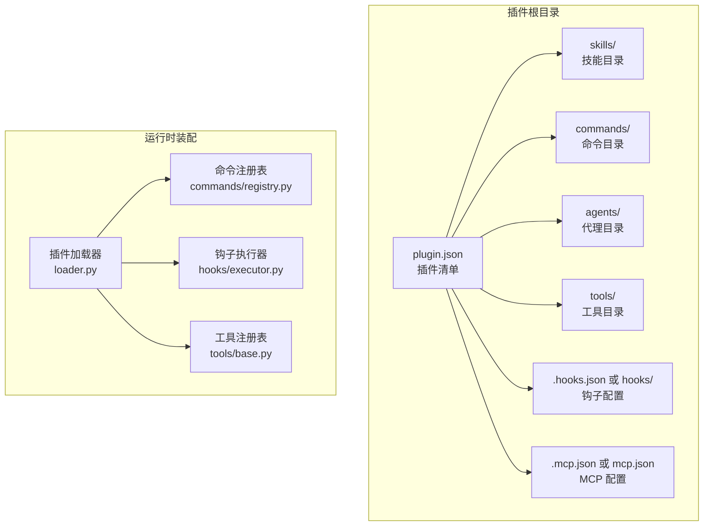
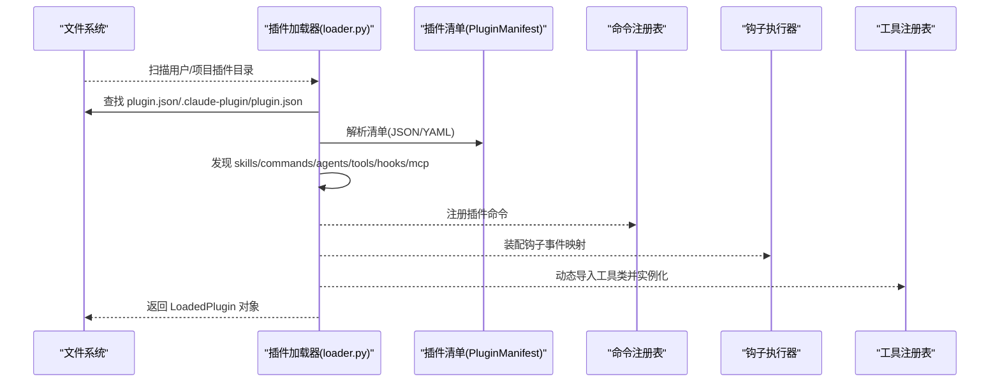
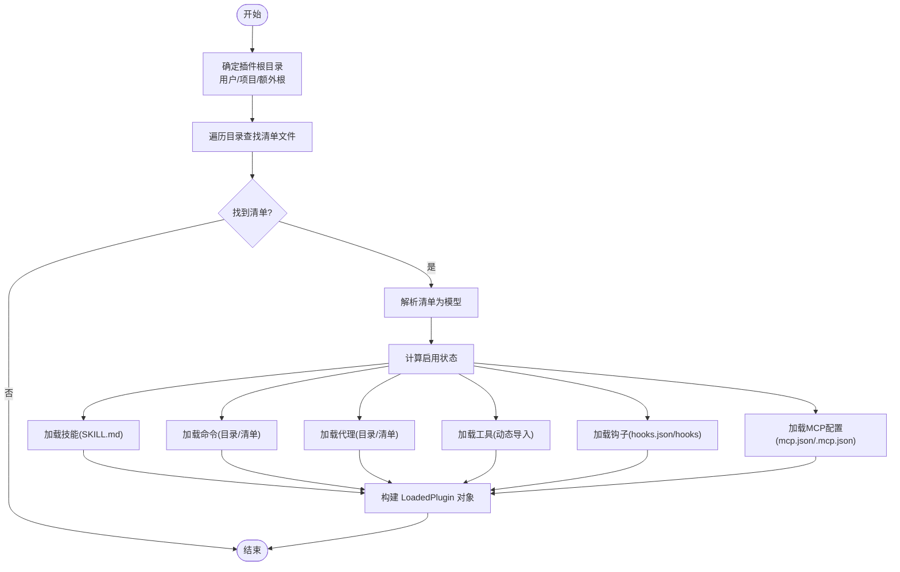
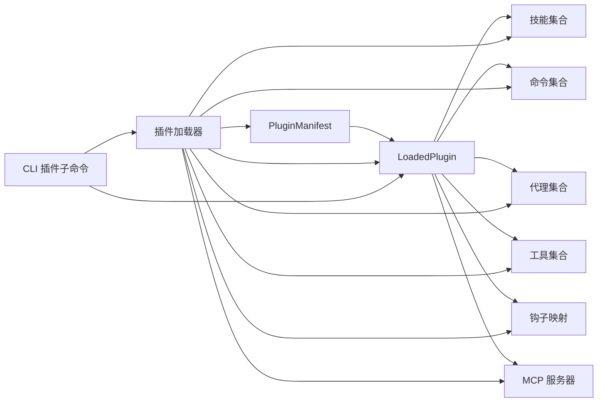

# 插件开发指南

<cite>
**本文引用的文件**
- [schemas.py](file://src/openharness/plugins/schemas.py)
- [types.py](file://src/openharness/plugins/types.py)
- [loader.py](file://src/openharness/plugins/loader.py)
- [installer.py](file://src/openharness/plugins/installer.py)
- [__init__.py](file://src/openharness/plugins/__init__.py)
- [cli.py](file://src/openharness/cli.py)
- [schemas.py](file://src/openharness/hooks/schemas.py)
- [base.py](file://src/openharness/tools/base.py)
- [types.py](file://src/openharness/skills/types.py)
- [SKILL.md](file://.claude/skills/harness-eval/SKILL.md)
- [SKILL.md](file://.claude/skills/pr-merge/SKILL.md)
- [test_loader.py](file://tests/test_plugins/test_loader.py)
- [e2e_smoke.py](file://scripts/e2e_smoke.py)
</cite>

## 目录
1. [简介](#简介)
2. [项目结构](#项目结构)
3. [核心组件](#核心组件)
4. [架构总览](#架构总览)
5. [详细组件分析](#详细组件分析)
6. [依赖关系分析](#依赖关系分析)
7. [性能考量](#性能考量)
8. [故障排查指南](#故障排查指南)
9. [结论](#结论)
10. [附录](#附录)

## 简介
本指南面向希望在 OpenHarness 中开发与集成插件的开发者，提供从零到一的完整流程：插件目录结构、清单文件编写、不同类型插件组件（技能、命令、代理、工具、钩子）的实现方式、调试与常见问题处理，以及打包与分发建议。内容基于仓库中的插件加载器、类型定义、钩子与工具抽象、CLI 插件子命令等实现进行提炼与总结。

## 项目结构
OpenHarness 的插件系统围绕“清单文件 + 贡献资源目录”的约定工作，支持用户级与项目级插件目录，并通过加载器自动发现与装配插件贡献的技能、命令、代理、工具、钩子与 MCP 服务器配置。

图表来源
- [loader.py:107-162](file://src/openharness/plugins/loader.py#L107-L162)
- [schemas.py:8-25](file://src/openharness/plugins/schemas.py#L8-L25)

章节来源
- [loader.py:36-78](file://src/openharness/plugins/loader.py#L36-L78)
- [schemas.py:8-25](file://src/openharness/plugins/schemas.py#L8-L25)

## 核心组件
- 插件清单模型：定义插件元数据与贡献资源路径约定
- 插件运行时对象：封装已加载插件及其贡献的技能、命令、代理、工具、钩子、MCP 服务器
- 插件加载器：扫描目录、解析清单、发现并装配各类贡献资源
- 安装器：提供安装/卸载用户插件的能力
- CLI 插件子命令：提供插件列表、安装、卸载等管理能力

章节来源
- [schemas.py:8-25](file://src/openharness/plugins/schemas.py#L8-L25)
- [types.py:18-60](file://src/openharness/plugins/types.py#L18-L60)
- [loader.py:107-162](file://src/openharness/plugins/loader.py#L107-L162)
- [installer.py:11-40](file://src/openharness/plugins/installer.py#L11-L40)
- [cli.py:767-800](file://src/openharness/cli.py#L767-L800)

## 架构总览
下图展示插件从磁盘到运行时的装配流程，以及与命令注册表、钩子执行器、工具系统的交互。

图表来源
- [loader.py:107-162](file://src/openharness/plugins/loader.py#L107-L162)
- [schemas.py:8-25](file://src/openharness/plugins/schemas.py#L8-L25)

章节来源
- [loader.py:107-162](file://src/openharness/plugins/loader.py#L107-L162)

## 详细组件分析

### 插件清单文件（plugin.json）
- 必需字段
  - name：插件名称（字符串）
  - version：版本号（字符串，默认值存在）
- 可选字段
  - description：描述（字符串）
  - enabled_by_default：是否默认启用（布尔）
  - skills_dir：技能目录名（默认 "skills"）
  - tools_dir：工具目录名（默认 "tools"）
  - hooks_file：钩子配置文件名（默认 "hooks.json"）
  - mcp_file：MCP 配置文件名（默认 "mcp.json"）
  - author：作者信息（字典或 null）
  - commands：命令来源（字符串/列表/字典或 null）
  - agents：代理来源（字符串/列表或 null）
  - skills：技能来源（字符串/列表或 null）
  - hooks：钩子来源（字符串/字典/列表或 null）

清单字段解析与默认值由清单模型统一约束，加载器据此定位各资源目录与文件。

章节来源
- [schemas.py:8-25](file://src/openharness/plugins/schemas.py#L8-L25)

### 插件运行时对象（LoadedPlugin）
- 字段概览
  - manifest：插件清单
  - path：插件根目录路径
  - enabled：是否启用
  - skills：技能定义列表
  - commands：插件命令定义列表
  - agents：代理定义列表
  - tools：工具实例列表
  - hooks：事件到钩子定义的映射
  - mcp_servers：MCP 服务器配置字典

该对象是插件装配后的统一承载容器，供后续命令注册、钩子执行、工具使用等环节消费。

章节来源
- [types.py:40-60](file://src/openharness/plugins/types.py#L40-L60)

### 插件加载器（loader.py）
- 目录发现
  - 用户插件目录：用户配置目录下的 plugins 子目录
  - 项目插件目录：当前工作目录下的 .openharness/plugins 子目录
  - 支持额外根目录参数
- 清单解析
  - 支持标准 plugin.json 与 .claude-plugin/plugin.json 两种位置
  - 使用清单模型进行校验与反序列化
- 资源装配
  - 技能：按目录结构读取 SKILL.md，解析前言块与正文，生成技能定义
  - 命令：支持 commands 目录与清单中 commands 字段两种来源；支持单文件与目录批量加载
  - 代理：支持 agents 目录与清单中 agents 字段两种来源；解析代理前言块
  - 工具：动态导入 tools/*.py 中的工具类，实例化为工具实例
  - 钩子：支持 hooks.json 与 hooks/hooks.json 两种格式
  - MCP：支持 mcp.json 与 .mcp.json 两种格式
- 权限与安全
  - 受设置项控制是否允许项目本地插件
  - 按清单中的 enabled_by_default 与用户显式配置决定启用状态

图表来源
- [loader.py:107-162](file://src/openharness/plugins/loader.py#L107-L162)
- [loader.py:251-307](file://src/openharness/plugins/loader.py#L251-L307)
- [loader.py:320-390](file://src/openharness/plugins/loader.py#L320-L390)
- [loader.py:479-492](file://src/openharness/plugins/loader.py#L479-L492)
- [loader.py:691-730](file://src/openharness/plugins/loader.py#L691-L730)
- [loader.py:621-646](file://src/openharness/plugins/loader.py#L621-L646)
- [loader.py:680-688](file://src/openharness/plugins/loader.py#L680-L688)

章节来源
- [loader.py:107-162](file://src/openharness/plugins/loader.py#L107-L162)
- [loader.py:251-307](file://src/openharness/plugins/loader.py#L251-L307)
- [loader.py:320-390](file://src/openharness/plugins/loader.py#L320-L390)
- [loader.py:479-492](file://src/openharness/plugins/loader.py#L479-L492)
- [loader.py:621-646](file://src/openharness/plugins/loader.py#L621-L646)
- [loader.py:680-688](file://src/openharness/plugins/loader.py#L680-L688)
- [loader.py:691-730](file://src/openharness/plugins/loader.py#L691-L730)

### 插件安装器（installer.py）
- 将插件目录复制到用户插件根目录
- 卸载时删除对应目录
- 提供名称合法性检查与路径解析

章节来源
- [installer.py:11-40](file://src/openharness/plugins/installer.py#L11-L40)

### CLI 插件子命令（cli.py）
- 子命令组：oh plugin
- 主要命令
  - list：列出已发现插件
  - install：从路径安装插件
  - uninstall：卸载插件
- 在干跑预览中会汇总插件贡献的技能、命令、代理、MCP 服务器数量，便于验证

章节来源
- [cli.py:767-800](file://src/openharness/cli.py#L767-L800)
- [cli.py:840-867](file://src/openharness/cli.py#L840-L867)
- [cli.py:573-588](file://src/openharness/cli.py#L573-L588)

### 钩子（hooks）
- 钩子类型
  - command：执行 shell 命令
  - prompt：提示模型进行条件验证
  - http：向 HTTP 端点发送事件负载
  - agent：更深层的模型验证
- 配置字段
  - type：钩子类型
  - 其他字段如 command/url/prompt、timeout_seconds、matcher、block_on_failure 等

章节来源
- [schemas.py:10-58](file://src/openharness/hooks/schemas.py#L10-L58)

### 工具（tools）
- 抽象基类
  - BaseTool：定义工具名称、描述、输入模型与异步执行接口
  - ToolResult：标准化工具输出结果
  - ToolExecutionContext：共享执行上下文（cwd、metadata、hook_executor）
  - ToolRegistry：工具注册与导出 API Schema
- 开发要点
  - 工具类需继承 BaseTool 并实现 execute
  - 输入模型使用 Pydantic BaseModel，确保与 API Schema 一致
  - 工具文件位于 tools/*.py，加载器动态导入并实例化

章节来源
- [base.py:17-81](file://src/openharness/tools/base.py#L17-L81)

### 技能（skills）
- 技能文件
  - 采用 SKILL.md 文件，支持 YAML 前言块与正文内容
  - 加载器解析前言块中的元数据（如 name/description/version 等）与正文
- 示例参考
  - harness-eval：端到端功能验证技能
  - pr-merge：PR 合并工作流技能

章节来源
- [loader.py:251-307](file://src/openharness/plugins/loader.py#L251-L307)
- [types.py:8-25](file://src/openharness/skills/types.py#L8-L25)
- [SKILL.md:1-194](file://.claude/skills/harness-eval/SKILL.md#L1-L194)
- [SKILL.md:1-100](file://.claude/skills/pr-merge/SKILL.md#L1-L100)

### 命令（commands）
- 来源
  - commands 目录下的 .md 文件（支持命名空间层级）
  - 清单中的 commands 字段（字符串/列表/字典）
- 命名规则
  - 自动生成插件前缀与相对路径命名空间
  - 特殊处理 SKILL.md 文件作为技能命令
- 前言块元数据
  - 支持 description、argument-hint、model、user-invocable 等字段

章节来源
- [loader.py:320-390](file://src/openharness/plugins/loader.py#L320-L390)
- [loader.py:393-422](file://src/openharness/plugins/loader.py#L393-L422)
- [loader.py:425-476](file://src/openharness/plugins/loader.py#L425-L476)

### 代理（agents）
- 来源
  - agents 目录下的 .md 文件（支持命名空间层级）
  - 清单中的 agents 字段（字符串/列表）
- 前言块元数据
  - 支持 tools/disallowed_tools/model/effort/memory/isolation/max_turns/permission_mode/initial_prompt/critical_system_reminder/required_mcp_servers/permissions 等

章节来源
- [loader.py:479-492](file://src/openharness/plugins/loader.py#L479-L492)
- [loader.py:495-514](file://src/openharness/plugins/loader.py#L495-L514)
- [loader.py:517-618](file://src/openharness/plugins/loader.py#L517-L618)

### MCP（MCP 服务器）
- 配置来源
  - mcp.json 或 .mcp.json
  - 加载器解析为 McpServerConfig 并注入插件可用的 MCP 服务器集合
- 干跑预览中会对 MCP 配置进行基础校验（传输类型、URL/命令存在性等）

章节来源
- [loader.py:680-688](file://src/openharness/plugins/loader.py#L680-L688)
- [cli.py:89-121](file://src/openharness/cli.py#L89-L121)

## 依赖关系分析
- 插件清单模型与运行时对象
  - 清单模型用于约束清单字段与默认值
  - 运行时对象承载所有贡献资源
- 加载器对各子系统的依赖
  - 技能：skills/loader 的元数据解析
  - 命令：commands/registry 的命令注册
  - 代理：coordinator.agent_definitions 的前言块解析
  - 钩子：hooks/schemas 的钩子定义模型
  - 工具：tools/base 的工具抽象
  - MCP：mcp/types 的配置模型
- CLI 对加载器与注册表的依赖
  - 列出插件、汇总命令/技能/MCP 数量等

图表来源
- [schemas.py:8-25](file://src/openharness/plugins/schemas.py#L8-L25)
- [types.py:40-60](file://src/openharness/plugins/types.py#L40-L60)
- [loader.py:107-162](file://src/openharness/plugins/loader.py#L107-L162)
- [cli.py:767-800](file://src/openharness/cli.py#L767-L800)

章节来源
- [__init__.py:23-53](file://src/openharness/plugins/__init__.py#L23-L53)
- [loader.py:107-162](file://src/openharness/plugins/loader.py#L107-L162)

## 性能考量
- 插件发现与加载
  - 仅在启动或重载时扫描目录并解析清单，避免频繁 IO
  - 工具动态导入仅在启用插件时进行，减少不必要的模块加载
- 资源装配
  - 技能与命令的前言块解析与正文提取为 O(n) 文本处理，建议保持 SKILL.md 结构简洁
  - 钩子与 MCP 配置在加载后即固化，运行期仅做事件派发与调用
- CLI 预览
  - 干跑预览会汇总插件贡献的技能/命令/MCP 数量，便于快速评估影响面

[本节为通用指导，不直接分析具体文件]

## 故障排查指南
- 插件未被发现
  - 确认清单文件位于 plugin.json 或 .claude-plugin/plugin.json
  - 确认插件目录存在于用户或项目插件根目录
  - 若项目插件被禁用，请在设置中开启允许项目插件
- 清单解析失败
  - 检查 JSON 格式与字段类型
  - 确保清单字段符合模型定义（如 version 默认值、目录名默认值）
- 命令/技能/代理未生效
  - 检查命令文件命名与前言块元数据
  - 确认 enabled_by_default 与用户启用状态
- 工具加载异常
  - 确认 tools/*.py 中的类继承自 BaseTool，且具备 name/description/input_model
  - 检查模块导入错误日志
- 钩子配置无效
  - 确认 hooks.json 或 hooks/hooks.json 格式正确
  - 检查钩子类型与必要字段
- MCP 配置错误
  - 干跑预览会显示 MCP 配置问题（如命令不存在、URL 不合法）
  - 修复后重新加载插件

章节来源
- [loader.py:131-136](file://src/openharness/plugins/loader.py#L131-L136)
- [loader.py:621-646](file://src/openharness/plugins/loader.py#L621-L646)
- [loader.py:680-688](file://src/openharness/plugins/loader.py#L680-L688)
- [cli.py:89-121](file://src/openharness/cli.py#L89-L121)

## 结论
OpenHarness 的插件体系以清单为中心，通过约定的目录与文件结构实现技能、命令、代理、工具、钩子与 MCP 的自动化装配。借助加载器与 CLI 子命令，开发者可以高效地开发、调试、安装与管理插件。遵循本文档的目录结构与清单字段规范，结合示例与测试用例，可快速构建高质量的插件。

[本节为总结，不直接分析具体文件]

## 附录

### 插件开发模板与示例
- 最小清单（最小化字段）
  - name、version、description（可选）
  - enabled_by_default（可选）
- 目录结构示例
  - plugin.json
  - skills/
  - commands/
  - agents/
  - tools/
  - hooks.json 或 hooks/
  - mcp.json 或 .mcp.json
- 示例参考
  - 测试用例中写入的工具插件示例
  - 端到端脚本中写入的插件与 MCP 配置示例

章节来源
- [test_loader.py:74-86](file://tests/test_plugins/test_loader.py#L74-L86)
- [e2e_smoke.py:170-188](file://scripts/e2e_smoke.py#L170-L188)

### 不同类型插件组件开发要点
- 技能（skills）
  - 使用 SKILL.md，前言块包含 name/description/version 等
  - 内容为正文，可包含工作流、注意事项等
- 命令（commands）
  - 放置于 commands/ 目录或通过清单 commands 字段指定
  - 前言块支持 description、argument-hint、model、user-invocable 等
- 代理（agents）
  - 放置于 agents/ 目录或通过清单 agents 字段指定
  - 前言块支持 tools、model、effort、memory、isolation、permission_mode、initial_prompt、critical_system_reminder、required_mcp_servers、permissions 等
- 工具（tools）
  - 实现 BaseTool，定义 name/description/input_model/execute
  - 放置于 tools/*.py，加载器动态导入
- 钩子（hooks）
  - hooks.json 或 hooks/hooks.json，支持 command/prompt/http/agent 四种类型
- MCP（mcp.json/.mcp.json）
  - 配置传输类型（stdio/http/ws）与目标（命令/URL）

章节来源
- [loader.py:251-307](file://src/openharness/plugins/loader.py#L251-L307)
- [loader.py:320-390](file://src/openharness/plugins/loader.py#L320-L390)
- [loader.py:479-492](file://src/openharness/plugins/loader.py#L479-L492)
- [loader.py:621-646](file://src/openharness/plugins/loader.py#L621-L646)
- [loader.py:680-688](file://src/openharness/plugins/loader.py#L680-L688)
- [base.py:35-58](file://src/openharness/tools/base.py#L35-L58)

### 插件调试技巧
- 使用 oh plugin list 查看已发现插件
- 使用 oh plugin install/uninstall 管理插件
- 使用干跑预览（dry-run）查看插件贡献的技能/命令/MCP 数量与系统提示词预览
- 关注加载器日志，定位清单解析、工具导入、钩子与 MCP 配置问题

章节来源
- [cli.py:840-867](file://src/openharness/cli.py#L840-L867)
- [cli.py:573-588](file://src/openharness/cli.py#L573-L588)
- [cli.py:396-597](file://src/openharness/cli.py#L396-L597)

### 插件打包与分发
- 推荐做法
  - 将插件目录发布为独立仓库，包含完整的 plugin.json 与资源目录
  - 在 README 中说明清单字段与资源布局
  - 提供最小可运行示例（如 SKILL.md、hooks.json、mcp.json）
- 分发渠道
  - 用户可通过 oh plugin install 从本地路径安装
  - 项目插件放置于 .openharness/plugins 下即可被识别（受设置控制）

章节来源
- [installer.py:23-30](file://src/openharness/plugins/installer.py#L23-L30)
- [loader.py:107-123](file://src/openharness/plugins/loader.py#L107-L123)