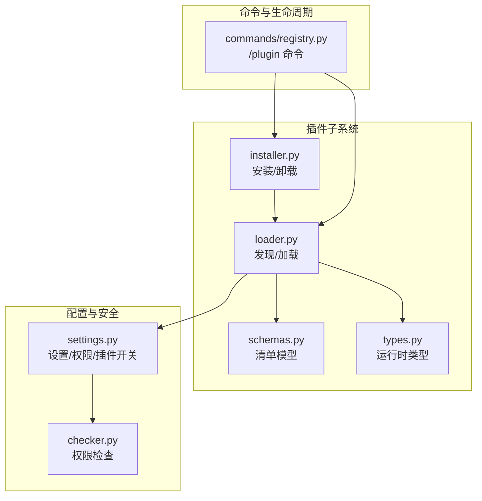
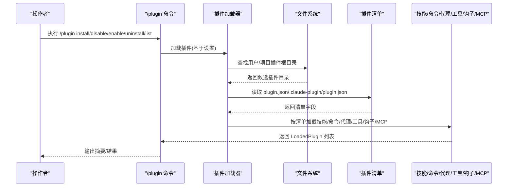
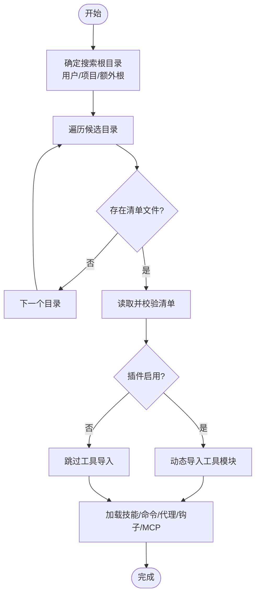
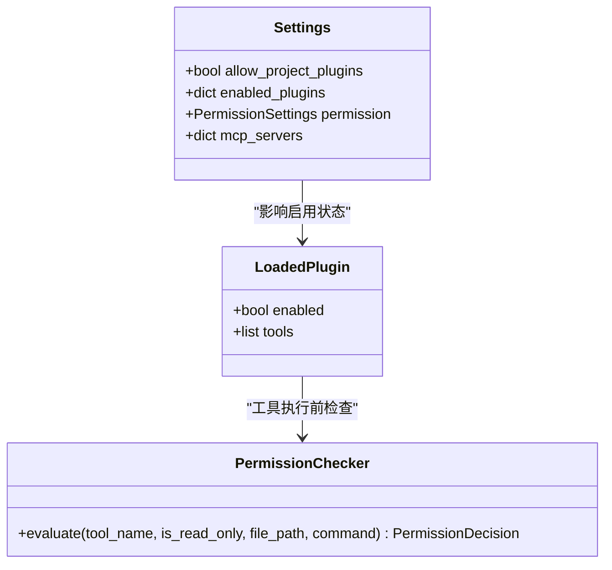
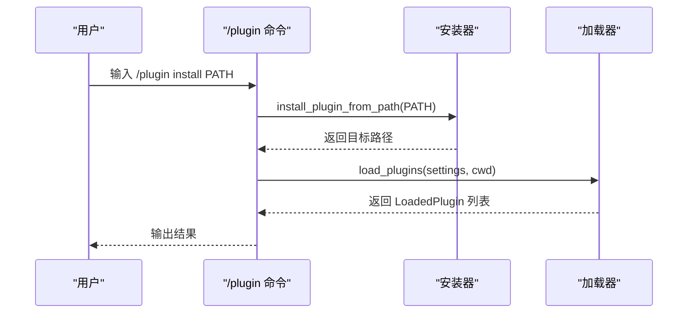

# 插件架构设计

<cite>
**本文引用的文件**
- [src/openharness/plugins/__init__.py](file://src/openharness/plugins/__init__.py)
- [src/openharness/plugins/loader.py](file://src/openharness/plugins/loader.py)
- [src/openharness/plugins/schemas.py](file://src/openharness/plugins/schemas.py)
- [src/openharness/plugins/types.py](file://src/openharness/plugins/types.py)
- [src/openharness/plugins/installer.py](file://src/openharness/plugins/installer.py)
- [src/openharness/config/settings.py](file://src/openharness/config/settings.py)
- [src/openharness/permissions/checker.py](file://src/openharness/permissions/checker.py)
- [src/openharness/commands/registry.py](file://src/openharness/commands/registry.py)
- [tests/test_plugins/test_loader.py](file://tests/test_plugins/test_loader.py)
- [tests/test_commands/test_command_flows.py](file://tests/test_commands/test_command_flows.py)
- [tests/test_ui/test_project_plugin_security.py](file://tests/test_ui/test_project_plugin_security.py)
</cite>

## 目录
1. [简介](#简介)
2. [项目结构](#项目结构)
3. [核心组件](#核心组件)
4. [架构总览](#架构总览)
5. [详细组件分析](#详细组件分析)
6. [依赖与冲突处理](#依赖与冲突处理)
7. [性能考量](#性能考量)
8. [故障排查指南](#故障排查指南)
9. [结论](#结论)
10. [附录](#附录)

## 简介
本文件系统性阐述 OpenHarness 插件架构的设计理念、实现方式与运行机制，覆盖插件发现、加载、生命周期管理、清单文件结构、目录规范、启用/禁用与权限控制、以及插件间依赖与冲突的处理策略。目标是帮助开发者与运营人员快速理解并正确扩展 OpenHarness 的插件生态。

## 项目结构
OpenHarness 将插件能力集中在 openharness.plugins 子模块中，并通过配置与命令系统进行集成：
- 插件发现与加载：位于 openharness.plugins.loader
- 清单模型与运行时类型：位于 openharness.plugins.schemas 与 openharness.plugins.types
- 安装与卸载：位于 openharness.plugins.install
- 配置与权限：位于 openharness.config.settings 与 openharness.permissions.checker
- 命令入口与生命周期：位于 openharness.commands.registry

**图表来源**
- [src/openharness/plugins/loader.py:107-124](file://src/openharness/plugins/loader.py#L107-L124)
- [src/openharness/plugins/schemas.py:8-25](file://src/openharness/plugins/schemas.py#L8-L25)
- [src/openharness/plugins/types.py:18-60](file://src/openharness/plugins/types.py#L18-L60)
- [src/openharness/plugins/installer.py:23-40](file://src/openharness/plugins/installer.py#L23-L40)
- [src/openharness/config/settings.py:534-580](file://src/openharness/config/settings.py#L534-L580)
- [src/openharness/permissions/checker.py:57-157](file://src/openharness/permissions/checker.py#L57-L157)
- [src/openharness/commands/registry.py:1463-1473](file://src/openharness/commands/registry.py#L1463-L1473)

**章节来源**
- [src/openharness/plugins/__init__.py:11-53](file://src/openharness/plugins/__init__.py#L11-L53)
- [src/openharness/plugins/loader.py:36-47](file://src/openharness/plugins/loader.py#L36-L47)
- [src/openharness/config/settings.py:534-580](file://src/openharness/config/settings.py#L534-L580)

## 核心组件
- 插件清单模型（PluginManifest）
  - 字段：name、version、description、enabled_by_default、skills_dir、tools_dir、hooks_file、mcp_file，以及可选的 author、commands、agents、skills、hooks
- 运行时插件对象（LoadedPlugin）
  - 包含已解析的清单、路径、启用状态，以及贡献的技能、命令、代理、工具、钩子、MCP 服务器
- 插件命令定义（PluginCommandDefinition）
  - 描述插件提供的 slash 命令，支持参数提示、版本、模型、努力级别、是否允许模型调用等
- 发现与加载器（loader）
  - 用户插件目录与项目插件目录的发现；按清单加载技能、命令、代理、工具、钩子、MCP
- 安装器（installer）
  - 将插件从源路径复制到用户插件目录，或删除指定插件目录

**章节来源**
- [src/openharness/plugins/schemas.py:8-25](file://src/openharness/plugins/schemas.py#L8-L25)
- [src/openharness/plugins/types.py:18-60](file://src/openharness/plugins/types.py#L18-L60)
- [src/openharness/plugins/loader.py:107-162](file://src/openharness/plugins/loader.py#L107-L162)
- [src/openharness/plugins/installer.py:23-40](file://src/openharness/plugins/installer.py#L23-L40)

## 架构总览
OpenHarness 插件系统采用“清单驱动 + 多源发现 + 条件加载”的架构模式：
- 清单驱动：每个插件以 plugin.json 或 .claude-plugin/plugin.json 作为根标识
- 多源发现：优先扫描用户插件目录，再根据设置决定是否扫描项目插件目录
- 条件加载：受设置中的 allow_project_plugins、enabled_plugins 控制；工具仅在插件启用时导入
- 资源聚合：技能、命令、代理、钩子、MCP 服务器统一注入到系统注册表

**图表来源**
- [src/openharness/commands/registry.py:1463-1473](file://src/openharness/commands/registry.py#L1463-L1473)
- [src/openharness/plugins/loader.py:61-124](file://src/openharness/plugins/loader.py#L61-L124)
- [src/openharness/plugins/loader.py:126-162](file://src/openharness/plugins/loader.py#L126-L162)

## 详细组件分析

### 插件发现与加载流程
- 目录发现
  - 用户插件目录：~/.openharness/plugins
  - 项目插件目录：工作区/.openharness/plugins
  - 可额外指定 extra_roots
- 清单定位
  - 支持标准 plugin.json 与 .claude-plugin/plugin.json 两种位置
- 条件加载
  - 若未开启 allow_project_plugins，则项目插件默认不加载并发出警告
  - 工具仅在插件 enabled_by_default 且 settings.enabled_plugins[name]==True 时导入
- 资源加载
  - 技能：按 skills_dir 解析 SKILL.md，支持直接目录与嵌套目录两种布局
  - 命令：commands 目录与 manifest.commands 合并，支持目录与单文件
  - 代理：agents 目录递归解析 .md，支持命名空间拼接
  - 钩子：hooks.json 或 hooks/hooks.json 结构化格式
  - MCP：mcp.json 或 .mcp.json
  - 工具：tools/*.py 中继承 BaseTool 的类实例化

**图表来源**
- [src/openharness/plugins/loader.py:61-124](file://src/openharness/plugins/loader.py#L61-L124)
- [src/openharness/plugins/loader.py:126-162](file://src/openharness/plugins/loader.py#L126-L162)
- [src/openharness/plugins/loader.py:691-731](file://src/openharness/plugins/loader.py#L691-L731)

**章节来源**
- [src/openharness/plugins/loader.py:36-47](file://src/openharness/plugins/loader.py#L36-L47)
- [src/openharness/plugins/loader.py:50-58](file://src/openharness/plugins/loader.py#L50-L58)
- [src/openharness/plugins/loader.py:107-124](file://src/openharness/plugins/loader.py#L107-L124)
- [src/openharness/plugins/loader.py:251-307](file://src/openharness/plugins/loader.py#L251-L307)
- [src/openharness/plugins/loader.py:320-391](file://src/openharness/plugins/loader.py#L320-L391)
- [src/openharness/plugins/loader.py:479-618](file://src/openharness/plugins/loader.py#L479-L618)
- [src/openharness/plugins/loader.py:621-677](file://src/openharness/plugins/loader.py#L621-L677)
- [src/openharness/plugins/loader.py:680-689](file://src/openharness/plugins/loader.py#L680-L689)
- [src/openharness/plugins/loader.py:691-731](file://src/openharness/plugins/loader.py#L691-L731)

### 插件清单文件（plugin.json）结构与作用
- 必填字段
  - name：插件名称
- 可选字段
  - version、description、enabled_by_default、skills_dir、tools_dir、hooks_file、mcp_file
  - author、commands、agents、skills、hooks
- 作用
  - 作为插件根标识与元数据来源
  - 控制资源目录名与默认启用状态
  - 通过 manifest.commands/agents/skills/hooks 提供显式声明

**章节来源**
- [src/openharness/plugins/schemas.py:8-25](file://src/openharness/plugins/schemas.py#L8-L25)

### 插件目录结构规范
- 根目录要求：存在 plugin.json 或 .claude-plugin/plugin.json
- 常用子目录
  - skills：技能定义（SKILL.md），支持直接目录与嵌套目录
  - commands：命令定义（.md），支持目录与 manifest.commands 显式声明
  - agents：代理定义（.md），支持命名空间层级
  - tools：Python 工具模块（*.py），需继承 BaseTool 并具备 name/description
  - hooks.json 或 hooks/hooks.json：事件钩子配置
  - mcp.json 或 .mcp.json：MCP 服务器配置
- 其他约定
  - 命令文件命名：SKILL.md 表示技能命令；其他 .md 文件按目录结构生成命令名
  - 命令命名：plugin_name[:namespace][:basename]，namespace 由相对路径组成

**章节来源**
- [src/openharness/plugins/loader.py:138-142](file://src/openharness/plugins/loader.py#L138-L142)
- [src/openharness/plugins/loader.py:251-307](file://src/openharness/plugins/loader.py#L251-L307)
- [src/openharness/plugins/loader.py:320-391](file://src/openharness/plugins/loader.py#L320-L391)
- [src/openharness/plugins/loader.py:479-618](file://src/openharness/plugins/loader.py#L479-L618)
- [src/openharness/plugins/loader.py:621-677](file://src/openharness/plugins/loader.py#L621-L677)
- [src/openharness/plugins/loader.py:680-689](file://src/openharness/plugins/loader.py#L680-L689)
- [src/openharness/plugins/loader.py:691-731](file://src/openharness/plugins/loader.py#L691-L731)

### 启用/禁用机制与权限控制
- 启用/禁用
  - 默认启用：enabled_by_default
  - 运行时启用：settings.enabled_plugins[plugin_name] 决定最终状态
  - 工具导入：仅当插件 enabled=True 时才执行工具模块的动态导入
- 项目插件开关
  - 默认关闭：allow_project_plugins=false
  - 开启后：仅项目插件被发现与加载
- 权限控制
  - 工具执行前经 PermissionChecker 评估
  - 敏感路径保护：内置敏感路径模式，不可绕过
  - 模式与规则：支持 FULL_AUTO、PLAN、DEFAULT 三种模式，结合路径规则与命令模式匹配

**图表来源**
- [src/openharness/config/settings.py:534-580](file://src/openharness/config/settings.py#L534-L580)
- [src/openharness/permissions/checker.py:57-157](file://src/openharness/permissions/checker.py#L57-L157)
- [src/openharness/plugins/types.py:40-60](file://src/openharness/plugins/types.py#L40-L60)

**章节来源**
- [src/openharness/plugins/loader.py:136-142](file://src/openharness/plugins/loader.py#L136-L142)
- [src/openharness/plugins/loader.py:109-118](file://src/openharness/plugins/loader.py#L109-L118)
- [src/openharness/config/settings.py:557-558](file://src/openharness/config/settings.py#L557-L558)
- [src/openharness/permissions/checker.py:18-37](file://src/openharness/permissions/checker.py#L18-L37)

### 生命周期管理与命令入口
- 命令入口
  - /plugin list：列出当前可用插件
  - /plugin enable/disable NAME：切换插件启用状态
  - /plugin install PATH：安装插件至用户目录
  - /plugin uninstall NAME：卸载插件
- 生命周期要点
  - 安装/卸载：通过安装器对用户插件目录进行复制/删除
  - 重载：/reload-plugins 触发重新加载插件注册表
  - 安全：卸载时对路径进行校验，拒绝越界名称

**图表来源**
- [src/openharness/commands/registry.py:1463-1473](file://src/openharness/commands/registry.py#L1463-L1473)
- [src/openharness/plugins/installer.py:23-40](file://src/openharness/plugins/installer.py#L23-L40)
- [src/openharness/plugins/loader.py:107-124](file://src/openharness/plugins/loader.py#L107-L124)

**章节来源**
- [src/openharness/commands/registry.py:1463-1473](file://src/openharness/commands/registry.py#L1463-L1473)
- [src/openharness/plugins/installer.py:11-40](file://src/openharness/plugins/installer.py#L11-L40)
- [tests/test_commands/test_command_flows.py:132-159](file://tests/test_commands/test_command_flows.py#L132-L159)
- [tests/test_plugins/test_lifecycle_flow.py:76-109](file://tests/test_plugins/test_lifecycle_flow.py#L76-L109)

## 依赖与冲突处理
- 依赖关系
  - 插件通过 manifest.commands/agents/skills/hooks/mcp_file 声明其依赖的资源与外部服务
  - 代理可声明 requiredMcpServers，确保对应 MCP 服务器存在
- 冲突解决策略
  - 命名冲突：命令名采用 plugin_name:namespace:basename 的命名空间拼接，降低冲突概率
  - 资源覆盖：同一清单字段（如 commands）支持目录与显式声明合并，后者可覆盖前者行为
  - 安全冲突：项目插件默认禁用，避免未经信任的代码进入工作区；MCP 服务器同样需要显式允许

**章节来源**
- [src/openharness/plugins/loader.py:332-370](file://src/openharness/plugins/loader.py#L332-L370)
- [src/openharness/plugins/loader.py:583-585](file://src/openharness/plugins/loader.py#L583-L585)
- [src/openharness/plugins/loader.py:109-118](file://src/openharness/plugins/loader.py#L109-L118)
- [tests/test_ui/test_project_plugin_security.py:49-61](file://tests/test_ui/test_project_plugin_security.py#L49-L61)

## 性能考量
- 动态导入工具模块：仅在插件启用时执行，减少不必要的模块加载开销
- 目录遍历与去重：发现阶段使用集合去重，避免重复处理同一插件目录
- 清单校验与早失败：读取清单失败或未找到清单时立即返回，避免后续无效工作
- 建议
  - 合理拆分插件目录，避免单个插件目录过大
  - 使用 manifest.commands 显式声明而非全目录扫描，提升加载效率

[本节为通用建议，无需特定文件引用]

## 故障排查指南
- 问题：项目插件未加载
  - 检查设置 allow_project_plugins 是否为 true
  - 日志会提示“项目本地插件”并建议开启
- 问题：工具未出现
  - 检查插件 enabled_by_default 与 settings.enabled_plugins[name]
  - 确认 tools/*.py 符合 BaseTool 接口
- 问题：卸载失败或路径异常
  - 卸载命令对插件名进行路径校验，拒绝越界名称
- 问题：MCP 服务器未生效
  - 项目插件 MCP 需要显式开启 allow_project_plugins

**章节来源**
- [src/openharness/plugins/loader.py:109-118](file://src/openharness/plugins/loader.py#L109-L118)
- [src/openharness/plugins/loader.py:136-142](file://src/openharness/plugins/loader.py#L136-L142)
- [src/openharness/plugins/installer.py:11-20](file://src/openharness/plugins/installer.py#L11-L20)
- [tests/test_ui/test_project_plugin_security.py:49-61](file://tests/test_ui/test_project_plugin_security.py#L49-L61)

## 结论
OpenHarness 插件系统以清单为中心，结合多源发现与条件加载，实现了安全可控、可扩展的插件生态。通过明确的目录规范、严格的启用/禁用与权限控制，以及清晰的生命周期命令，系统既便于开发者扩展，也保障了运营安全与可维护性。

## 附录
- 测试参考
  - 插件加载与资源聚合：见测试用例
  - 启用/禁用与工具导入：见测试用例
  - 项目插件安全策略：见测试用例

**章节来源**
- [tests/test_plugins/test_loader.py:106-152](file://tests/test_plugins/test_loader.py#L106-L152)
- [tests/test_plugins/test_loader.py:185-221](file://tests/test_plugins/test_loader.py#L185-L221)
- [tests/test_commands/test_command_flows.py:132-159](file://tests/test_commands/test_command_flows.py#L132-L159)
- [tests/test_ui/test_project_plugin_security.py:49-61](file://tests/test_ui/test_project_plugin_security.py#L49-L61)