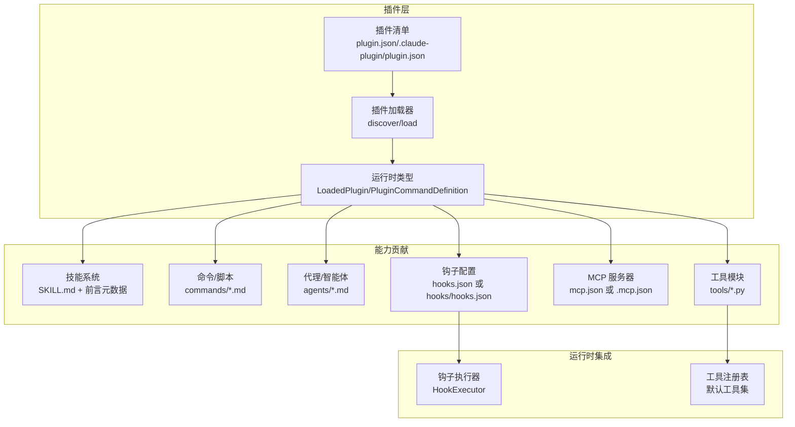
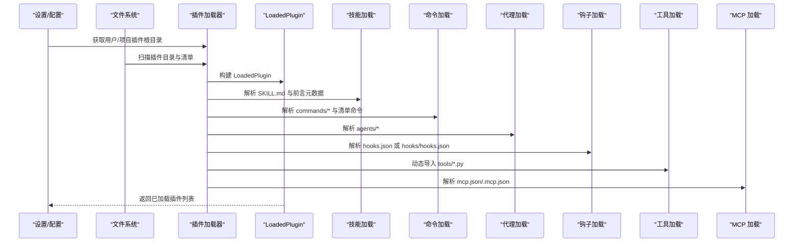
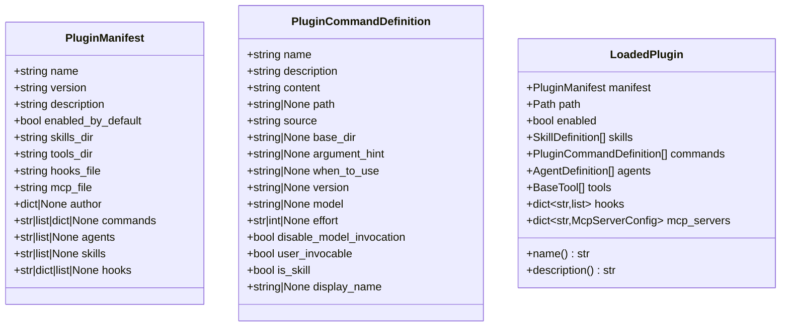
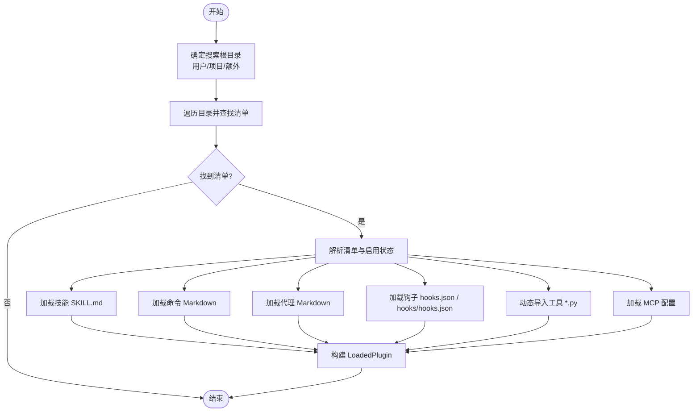
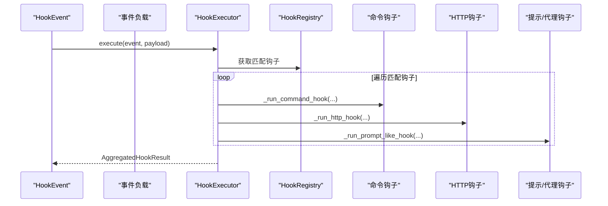
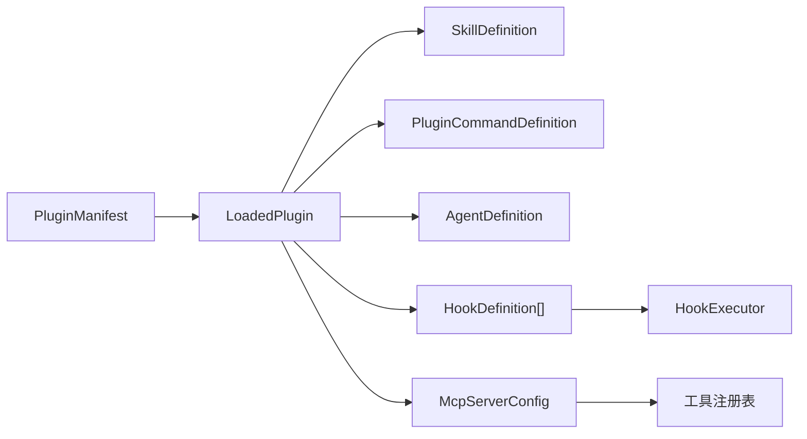
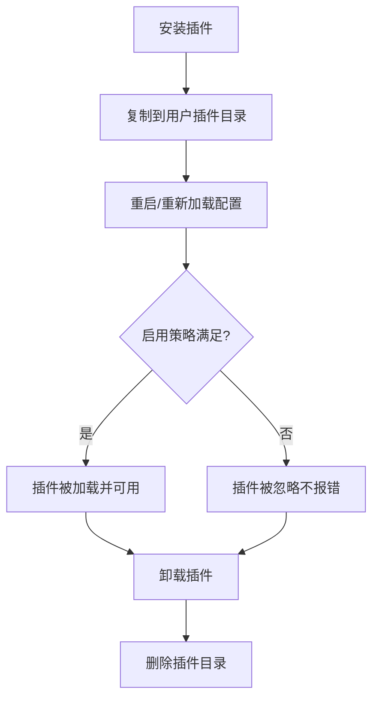

# 插件生态系统

<cite>
**本文引用的文件**
- [src/openharness/plugins/__init__.py](file://src/openharness/plugins/__init__.py)
- [src/openharness/plugins/types.py](file://src/openharness/plugins/types.py)
- [src/openharness/plugins/schemas.py](file://src/openharness/plugins/schemas.py)
- [src/openharness/plugins/loader.py](file://src/openharness/plugins/loader.py)
- [src/openharness/plugins/installer.py](file://src/openharness/plugins/installer.py)
- [src/openharness/hooks/__init__.py](file://src/openharness/hooks/__init__.py)
- [src/openharness/hooks/types.py](file://src/openharness/hooks/types.py)
- [src/openharness/hooks/schemas.py](file://src/openharness/hooks/schemas.py)
- [src/openharness/hooks/executor.py](file://src/openharness/hooks/executor.py)
- [src/openharness/skills/__init__.py](file://src/openharness/skills/__init__.py)
- [.claude/skills/harness-eval/SKILL.md](file://.claude/skills/harness-eval/SKILL.md)
- [.claude/skills/pr-merge/SKILL.md](file://.claude/skills/pr-merge/SKILL.md)
- [tests/test_plugins/test_loader.py](file://tests/test_plugins/test_loader.py)
- [tests/test_plugins/test_lifecycle_flow.py](file://tests/test_plugins/test_lifecycle_flow.py)
</cite>

## 目录
1. [简介](#简介)
2. [项目结构](#项目结构)
3. [核心组件](#核心组件)
4. [架构总览](#架构总览)
5. [详细组件分析](#详细组件分析)
6. [依赖关系分析](#依赖关系分析)
7. [性能考量](#性能考量)
8. [故障排查指南](#故障排查指南)
9. [结论](#结论)
10. [附录](#附录)

## 简介
本文件系统化阐述 OpenHarness 插件生态的设计理念与实现机制，覆盖插件发现、加载、生命周期管理、安装/启用/卸载流程，以及与 claude-code 风格技能的兼容与迁移路径。文档同时提供技能插件、工具插件、钩子插件、代理插件（MCP）等类型的实际开发指南与最佳实践，并通过图示与测试用例路径帮助读者快速上手。

## 项目结构
OpenHarness 将“插件”作为可扩展能力的最小单元，围绕以下模块组织：
- 插件核心：声明式清单、运行时类型、发现与加载器、安装器
- 钩子系统：事件驱动的前置/后置校验与执行
- 技能系统：以 Markdown 前言元数据定义的可复用工作流
- 工具系统：动态导入 Python 工具类，形成可被模型调用的能力
- MCP 代理：外部资源服务对接

图表来源
- [src/openharness/plugins/loader.py:107-162](file://src/openharness/plugins/loader.py#L107-L162)
- [src/openharness/plugins/schemas.py:8-25](file://src/openharness/plugins/schemas.py#L8-L25)
- [src/openharness/plugins/types.py:40-60](file://src/openharness/plugins/types.py#L40-L60)
- [src/openharness/hooks/executor.py:41-79](file://src/openharness/hooks/executor.py#L41-L79)

章节来源
- [src/openharness/plugins/__init__.py:11-54](file://src/openharness/plugins/__init__.py#L11-L54)
- [src/openharness/plugins/loader.py:61-123](file://src/openharness/plugins/loader.py#L61-L123)

## 核心组件
- 插件清单与类型
  - 清单字段：名称、版本、描述、默认启用、目录映射（技能/工具/钩子/MCP）、扩展字段（作者、命令、代理、技能、钩子）
  - 运行时类型：LoadedPlugin 聚合清单、路径、启用状态与贡献项（技能、命令、代理、工具、钩子、MCP 服务器）
- 发现与加载
  - 用户插件目录与项目插件目录双轨发现；支持额外根目录
  - 支持 .claude-plugin/plugin.json 与 plugin.json 双位置
  - 按清单解析技能、命令、代理、工具、钩子、MCP
- 安装与卸载
  - 安装：复制到用户插件目录
  - 卸载：按名称安全删除

章节来源
- [src/openharness/plugins/schemas.py:8-25](file://src/openharness/plugins/schemas.py#L8-L25)
- [src/openharness/plugins/types.py:18-60](file://src/openharness/plugins/types.py#L18-L60)
- [src/openharness/plugins/loader.py:36-162](file://src/openharness/plugins/loader.py#L36-L162)
- [src/openharness/plugins/installer.py:11-40](file://src/openharness/plugins/installer.py#L11-L40)

## 架构总览
插件系统采用“清单驱动 + 动态发现”的架构。加载阶段将插件目录中的多种资源统一为运行时对象，随后在不同子系统中被消费：
- 技能系统：从 SKILL.md 解析前言元数据与正文内容，生成 SkillDefinition
- 命令系统：从 commands 目录或清单指定路径解析 Markdown，生成 PluginCommandDefinition
- 代理系统：从 agents 目录解析智能体定义
- 钩子系统：从 hooks.json 或 hooks/hooks.json 解析事件钩子
- 工具系统：动态导入 tools/*.py 中的 BaseTool 子类实例
- MCP 系统：从 mcp.json 或 .mcp.json 解析服务器配置

图表来源
- [src/openharness/plugins/loader.py:107-162](file://src/openharness/plugins/loader.py#L107-L162)
- [src/openharness/plugins/loader.py:251-307](file://src/openharness/plugins/loader.py#L251-L307)
- [src/openharness/plugins/loader.py:320-476](file://src/openharness/plugins/loader.py#L320-L476)
- [src/openharness/plugins/loader.py:479-618](file://src/openharness/plugins/loader.py#L479-L618)
- [src/openharness/plugins/loader.py:621-677](file://src/openharness/plugins/loader.py#L621-L677)
- [src/openharness/plugins/loader.py:691-730](file://src/openharness/plugins/loader.py#L691-L730)
- [src/openharness/plugins/loader.py:680-688](file://src/openharness/plugins/loader.py#L680-L688)

## 详细组件分析

### 插件清单与运行时类型
- 清单字段
  - 必填：name
  - 可选：version/description/enabled_by_default
  - 目录映射：skills_dir/tools_dir/hooks_file/mcp_file
  - 扩展：author/commands/agents/skills/hooks
- 运行时聚合
  - LoadedPlugin 聚合清单、路径、启用状态与各贡献集合
  - PluginCommandDefinition 表达命令/技能条目，支持前端展示与模型调用控制

图表来源
- [src/openharness/plugins/schemas.py:8-25](file://src/openharness/plugins/schemas.py#L8-L25)
- [src/openharness/plugins/types.py:18-60](file://src/openharness/plugins/types.py#L18-L60)

章节来源
- [src/openharness/plugins/schemas.py:8-25](file://src/openharness/plugins/schemas.py#L8-L25)
- [src/openharness/plugins/types.py:18-60](file://src/openharness/plugins/types.py#L18-L60)

### 插件发现与加载流程
- 目录定位
  - 用户插件：配置目录下的 plugins
  - 项目插件：工作区 .openharness/plugins
  - 允许通过额外根目录扩展
- 清单解析
  - 支持 plugin.json 与 .claude-plugin/plugin.json
  - 合并 enabled_by_default 与用户设置
- 能力解析
  - 技能：SKILL.md + 前言元数据
  - 命令：commands/* 或清单指定路径
  - 代理：agents/*，支持命名空间拼接
  - 钩子：hooks.json 或 hooks/hooks.json（结构化格式）
  - 工具：tools/*.py，动态导入 BaseTool 子类
  - MCP：mcp.json 或 .mcp.json

图表来源
- [src/openharness/plugins/loader.py:61-123](file://src/openharness/plugins/loader.py#L61-L123)
- [src/openharness/plugins/loader.py:126-162](file://src/openharness/plugins/loader.py#L126-L162)
- [src/openharness/plugins/loader.py:251-307](file://src/openharness/plugins/loader.py#L251-L307)
- [src/openharness/plugins/loader.py:320-476](file://src/openharness/plugins/loader.py#L320-L476)
- [src/openharness/plugins/loader.py:479-618](file://src/openharness/plugins/loader.py#L479-L618)
- [src/openharness/plugins/loader.py:621-677](file://src/openharness/plugins/loader.py#L621-L677)
- [src/openharness/plugins/loader.py:691-730](file://src/openharness/plugins/loader.py#L691-L730)

章节来源
- [src/openharness/plugins/loader.py:61-123](file://src/openharness/plugins/loader.py#L61-L123)
- [src/openharness/plugins/loader.py:126-162](file://src/openharness/plugins/loader.py#L126-L162)

### 钩子系统（Hook）
- 类型与模式
  - 命令钩子：执行 shell 命令，支持超时与阻断策略
  - 提示钩子：基于模型判断是否允许事件继续
  - HTTP 钩子：向远端上报事件负载
  - 代理钩子：更深入的模型验证
- 执行器
  - 匹配器：基于 payload 的工具名/提示/事件进行通配匹配
  - 上下文注入：事件名与序列化负载注入环境变量
  - 结果聚合：统一返回 HookResult 列表，支持阻断与原因提取

图表来源
- [src/openharness/hooks/executor.py:64-79](file://src/openharness/hooks/executor.py#L64-L79)
- [src/openharness/hooks/executor.py:80-136](file://src/openharness/hooks/executor.py#L80-L136)
- [src/openharness/hooks/executor.py:138-167](file://src/openharness/hooks/executor.py#L138-L167)
- [src/openharness/hooks/executor.py:169-212](file://src/openharness/hooks/executor.py#L169-L212)

章节来源
- [src/openharness/hooks/schemas.py:10-58](file://src/openharness/hooks/schemas.py#L10-L58)
- [src/openharness/hooks/types.py:9-39](file://src/openharness/hooks/types.py#L9-L39)
- [src/openharness/hooks/executor.py:41-243](file://src/openharness/hooks/executor.py#L41-L243)

### 技能插件（Skill Plugin）
- 设计要点
  - 使用 SKILL.md + 前言元数据定义技能名称、描述、参数提示、模型偏好、是否允许模型调用等
  - 支持直接在 skills 目录放置 SKILL.md，或按子目录分组
- 兼容性与迁移
  - 与 claude-code 的 SKILL.md 布局一致，便于迁移
  - 建议保留前言元数据中的 name/description/argument-hint 等字段

章节来源
- [src/openharness/plugins/loader.py:251-307](file://src/openharness/plugins/loader.py#L251-L307)
- [.claude/skills/harness-eval/SKILL.md:1-194](file://.claude/skills/harness-eval/SKILL.md#L1-L194)
- [.claude/skills/pr-merge/SKILL.md:1-100](file://.claude/skills/pr-merge/SKILL.md#L1-L100)

### 工具插件（Tool Plugin）
- 开发步骤
  - 在 tools 目录编写 Python 文件，导出继承自 BaseTool 的类
  - 类需具备 name/description/input_model 等属性
  - 插件启用时动态导入并实例化
- 安全与隔离
  - 工具仅在插件启用时加载，避免不必要的模块导入
  - 建议在工具内部处理权限与沙箱约束

章节来源
- [src/openharness/plugins/loader.py:691-730](file://src/openharness/plugins/loader.py#L691-L730)
- [tests/test_plugins/test_loader.py:74-103](file://tests/test_plugins/test_loader.py#L74-L103)

### 钩子插件（Hook Plugin）
- 配置方式
  - hooks.json：扁平事件到钩子数组
  - hooks/hooks.json：结构化格式，支持 matcher 与命令模板中的根路径替换
- 使用场景
  - 会话开始前的安全检查
  - 工具调用前的二次确认
  - 失败时的上报与阻断

章节来源
- [src/openharness/plugins/loader.py:621-677](file://src/openharness/plugins/loader.py#L621-L677)
- [src/openharness/hooks/schemas.py:10-58](file://src/openharness/hooks/schemas.py#L10-L58)

### 代理插件（MCP Plugin）
- 配置方式
  - mcp.json 或 .mcp.json，使用 McpJsonConfig 解析
  - 插件可贡献多个 MCP 服务器，供工具注册表使用
- 生命周期
  - 插件加载时收集 MCP 配置
  - 运行时由 McpClientManager 统一连接与管理

章节来源
- [src/openharness/plugins/loader.py:680-688](file://src/openharness/plugins/loader.py#L680-L688)
- [tests/test_plugins/test_lifecycle_flow.py:20-52](file://tests/test_plugins/test_lifecycle_flow.py#L20-L52)

### 命令/脚本插件（Command Plugin）
- 文件布局
  - commands 目录下可按层级组织 Markdown 文件
  - 支持在清单中直接声明命令来源或内容
- 命名规则
  - 自动生成命令名：plugin_name[:namespace][:basename]
  - SKILL.md 特殊标记为 is_skill

章节来源
- [src/openharness/plugins/loader.py:320-476](file://src/openharness/plugins/loader.py#L320-L476)

### 代理插件（Agent Plugin）
- 文件布局
  - agents 目录下可按层级组织 Markdown 文件
  - 支持在清单中直接声明代理来源
- 元数据解析
  - 支持 tools/disallowed_tools、model、effort、permission_mode、max_turns、skills、color、memory、isolation、initial_prompt、critical_system_reminder、required_mcp_servers、permissions 等

章节来源
- [src/openharness/plugins/loader.py:479-618](file://src/openharness/plugins/loader.py#L479-L618)

## 依赖关系分析
- 插件加载对其他子系统的耦合点
  - 技能：依赖 skills.loader 的元数据解析
  - 代理：依赖 coordinator 的 AgentDefinition 解析
  - 钩子：依赖 hooks.schemas 的定义
  - 工具：依赖 tools.base 的基类约定
  - MCP：依赖 mcp.types 的配置模型
- 关键依赖链
  - 插件清单 → LoadedPlugin → 各子系统注册/消费
  - 钩子配置 → HookExecutor → 事件阻断/放行

图表来源
- [src/openharness/plugins/schemas.py:8-25](file://src/openharness/plugins/schemas.py#L8-L25)
- [src/openharness/plugins/types.py:40-60](file://src/openharness/plugins/types.py#L40-L60)
- [src/openharness/hooks/schemas.py:53-58](file://src/openharness/hooks/schemas.py#L53-L58)
- [src/openharness/hooks/executor.py:41-79](file://src/openharness/hooks/executor.py#L41-L79)

章节来源
- [src/openharness/plugins/loader.py:107-162](file://src/openharness/plugins/loader.py#L107-L162)

## 性能考量
- 动态导入工具的成本
  - 工具仅在插件启用时导入，避免无谓开销
  - 建议将重型初始化逻辑延迟至首次执行
- 钩子执行的异步与超时
  - 命令钩子与 HTTP 钩子均设置超时，防止阻塞主流程
  - 提示/代理钩子通过模型推理，建议合理设置 max_tokens 与系统提示
- 插件发现的扫描范围
  - 优先限制额外根目录数量，减少 IO 压力
  - 项目插件默认禁用，避免在不受信任工作区加载

## 故障排查指南
- 插件未加载
  - 检查是否存在 plugin.json 或 .claude-plugin/plugin.json
  - 确认 enabled_by_default 与用户设置 allow_project_plugins
  - 查看日志警告信息
- 工具未生效
  - 确认插件处于启用状态
  - 检查 tools/*.py 是否符合 BaseTool 接口
- 钩子不生效
  - 检查 hooks.json/hooks/hooks.json 格式与事件名
  - 确认 matcher 与 payload 字段匹配
- MCP 无法连接
  - 检查 mcp.json/.mcp.json 的服务器配置
  - 确认 McpClientManager 已正确加载并连接

章节来源
- [src/openharness/plugins/loader.py:107-123](file://src/openharness/plugins/loader.py#L107-L123)
- [src/openharness/plugins/loader.py:691-730](file://src/openharness/plugins/loader.py#L691-L730)
- [src/openharness/hooks/executor.py:80-136](file://src/openharness/hooks/executor.py#L80-L136)
- [src/openharness/hooks/executor.py:138-167](file://src/openharness/hooks/executor.py#L138-L167)

## 结论
OpenHarness 插件生态以“清单 + 多源资源”的方式实现高度可扩展的能力组合。通过清晰的运行时类型、严格的启用策略与灵活的钩子机制，系统在保证安全性的同时提供了强大的扩展性。迁移 claude-code 技能与构建自定义工具/钩子/代理插件均具备明确路径与最佳实践。

## 附录

### 插件开发指南（步骤与规范）
- 目录结构
  - plugin.json：必填，定义基础元信息与目录映射
  - skills/：可选，存放 SKILL.md
  - commands/：可选，存放命令 Markdown
  - agents/：可选，存放代理 Markdown
  - hooks.json 或 hooks/hooks.json：可选，事件钩子配置
  - mcp.json 或 .mcp.json：可选，MCP 服务器配置
  - tools/：可选，Python 工具模块
- 清单字段建议
  - name/version/description/enabled_by_default
  - 目录映射按需调整
  - 扩展字段用于作者与元数据
- 命名与可见性
  - 命令名自动拼接命名空间，避免冲突
  - 技能/命令可通过 frontmatter 控制是否允许模型调用与用户触发
- 安全与权限
  - 工具仅在启用时加载
  - 钩子可阻断失败事件，必要时上报
  - MCP 服务器应遵循最小权限原则

章节来源
- [src/openharness/plugins/schemas.py:8-25](file://src/openharness/plugins/schemas.py#L8-L25)
- [src/openharness/plugins/loader.py:320-476](file://src/openharness/plugins/loader.py#L320-L476)
- [src/openharness/plugins/loader.py:479-618](file://src/openharness/plugins/loader.py#L479-L618)
- [src/openharness/plugins/loader.py:621-677](file://src/openharness/plugins/loader.py#L621-L677)
- [src/openharness/plugins/loader.py:680-688](file://src/openharness/plugins/loader.py#L680-L688)
- [src/openharness/plugins/loader.py:691-730](file://src/openharness/plugins/loader.py#L691-L730)

### 安装、启用、卸载流程
- 安装
  - 将插件目录复制到用户插件根目录
- 启用
  - 设置 allow_project_plugins=true（若需要项目插件）
  - 在插件清单中启用或通过用户设置覆盖
- 卸载
  - 通过名称安全删除插件目录

图表来源
- [src/openharness/plugins/installer.py:23-40](file://src/openharness/plugins/installer.py#L23-L40)
- [src/openharness/plugins/loader.py:107-123](file://src/openharness/plugins/loader.py#L107-L123)

章节来源
- [src/openharness/plugins/installer.py:23-40](file://src/openharness/plugins/installer.py#L23-L40)
- [tests/test_plugins/test_lifecycle_flow.py:55-110](file://tests/test_plugins/test_lifecycle_flow.py#L55-L110)

### 与 claude-code 技能的兼容与迁移
- 兼容点
  - 技能文件统一使用 SKILL.md 与前言元数据
  - 命令命名与命名空间拼接规则一致
- 迁移建议
  - 将现有 SKILL.md 移入 skills 目录
  - 在 plugin.json 中声明 skills_dir/tools_dir 等目录映射
  - 将命令与代理文件迁移到 commands/agents 目录
  - 将钩子与 MCP 配置分别放入 hooks.json/.mcp.json

章节来源
- [src/openharness/plugins/loader.py:251-307](file://src/openharness/plugins/loader.py#L251-L307)
- [src/openharness/plugins/loader.py:320-476](file://src/openharness/plugins/loader.py#L320-L476)
- [src/openharness/plugins/loader.py:479-618](file://src/openharness/plugins/loader.py#L479-L618)
- [src/openharness/plugins/loader.py:680-688](file://src/openharness/plugins/loader.py#L680-L688)
- [.claude/skills/harness-eval/SKILL.md:1-194](file://.claude/skills/harness-eval/SKILL.md#L1-L194)
- [.claude/skills/pr-merge/SKILL.md:1-100](file://.claude/skills/pr-merge/SKILL.md#L1-L100)

### 示例与最佳实践
- 示例参考
  - 测试用例展示了插件目录结构、命令/代理/钩子/MCP 的组合加载
  - 工具插件示例演示了 BaseTool 的实现与动态导入
- 最佳实践
  - 将复杂初始化逻辑延迟到工具首次执行
  - 为钩子设置合理的超时与阻断策略
  - 使用前言元数据明确技能/命令的交互约束
  - 保持插件目录简洁，按功能拆分子目录

章节来源
- [tests/test_plugins/test_loader.py:16-72](file://tests/test_plugins/test_loader.py#L16-L72)
- [tests/test_plugins/test_loader.py:74-103](file://tests/test_plugins/test_loader.py#L74-L103)
- [tests/test_plugins/test_lifecycle_flow.py:20-52](file://tests/test_plugins/test_lifecycle_flow.py#L20-L52)