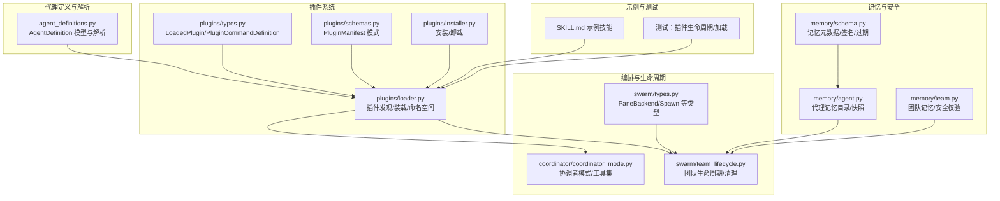
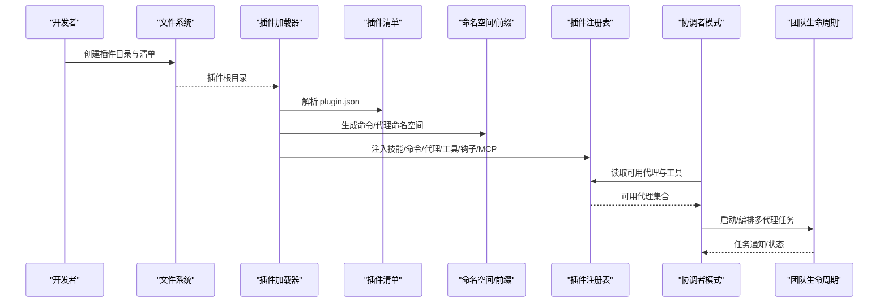
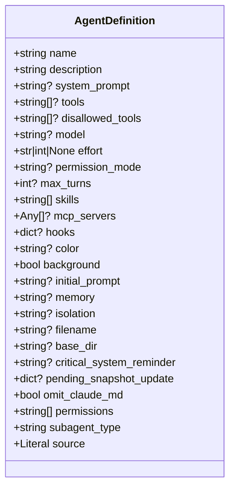
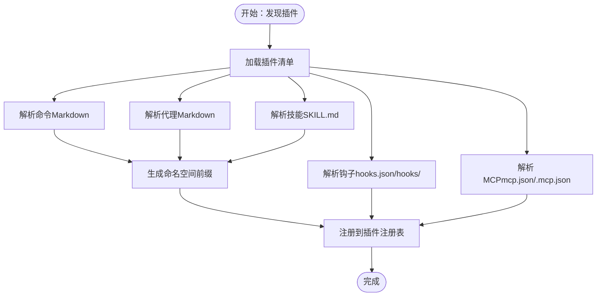
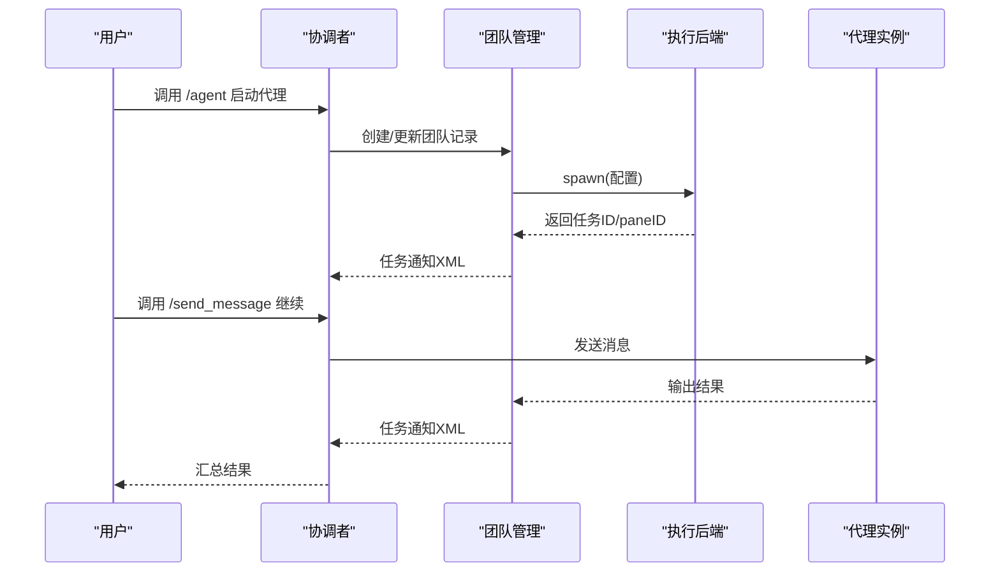
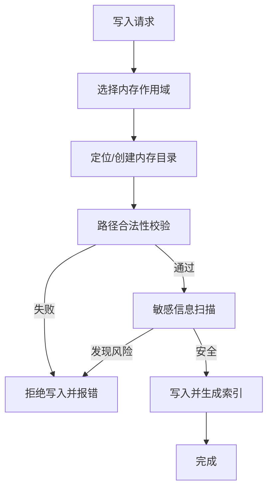
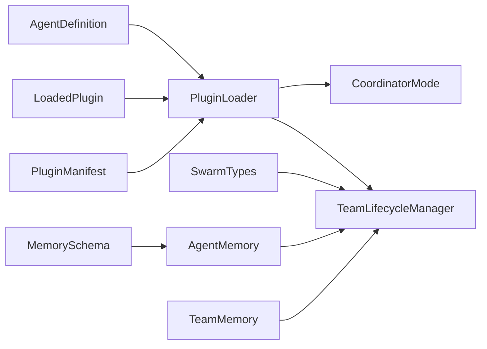

# 代理插件

<cite>
**本文引用的文件**
- [agent_definitions.py](file://src/openharness/coordinator/agent_definitions.py)
- [types.py（插件类型）](file://src/openharness/plugins/types.py)
- [loader.py（插件加载器）](file://src/openharness/plugins/loader.py)
- [schemas.py（插件清单模式）](file://src/openharness/plugins/schemas.py)
- [installer.py（插件安装器）](file://src/openharness/plugins/installer.py)
- [coordinator_mode.py（协调者模式）](file://src/openharness/coordinator/coordinator_mode.py)
- [team_lifecycle.py（团队生命周期）](file://src/openharness/swarm/team_lifecycle.py)
- [types.py（Swarm 类型）](file://src/openharness/swarm/types.py)
- [agent.py（代理记忆）](file://src/openharness/memory/agent.py)
- [team.py（团队记忆）](file://src/openharness/memory/team.py)
- [schema.py（记忆结构化模式）](file://src/openharness/memory/schema.py)
- [test_lifecycle_flow.py（插件生命周期测试）](file://tests/test_plugins/test_lifecycle_flow.py)
- [test_loader.py（插件加载测试）](file://tests/test_plugins/test_loader.py)
- [SKILL.md（示例技能）](file://src/openharness/skills/bundled/content/skill-creator.md)
- [SKILL.md（PR 合并技能）](file://.claude/skills/pr-merge/SKILL.md)
- [SKILL.md（Harness 验证技能）](file://.claude/skills/harness-eval/SKILL.md)
</cite>

## 目录
1. [引言](#引言)
2. [项目结构](#项目结构)
3. [核心组件](#核心组件)
4. [架构总览](#架构总览)
5. [详细组件分析](#详细组件分析)
6. [依赖关系分析](#依赖关系分析)
7. [性能考量](#性能考量)
8. [故障排查指南](#故障排查指南)
9. [结论](#结论)
10. [附录](#附录)

## 引言
本文件系统性阐述 OpenHarness 的“代理插件”体系：如何以可复用的方式定义智能代理的行为与配置；如何通过插件机制扩展代理能力；以及在多代理协作、团队编排、生命周期管理等复杂场景下的最佳实践。内容覆盖代理定义的完整配置项（工具列表、权限模式、努力级别、内存范围、隔离模式等）、命名空间与继承规则、配置优先级策略、性能优化与安全注意事项，并提供调试方法与常见问题排查路径。

## 项目结构
围绕代理插件的关键模块与文件如下：
- 代理定义与解析：coordinator/agent_definitions.py
- 插件类型与装载：plugins/types.py、plugins/loader.py、plugins/schemas.py、plugins/installer.py
- 协调者模式与多代理编排：coordinator/coordinator_mode.py、swarm/team_lifecycle.py、swarm/types.py
- 记忆与安全：memory/agent.py、memory/team.py、memory/schema.py
- 示例与测试：.claude/skills/*、tests/test_plugins/*

图表来源
- [agent_definitions.py:60-135](file://src/openharness/coordinator/agent_definitions.py#L60-L135)
- [types.py（插件类型）:18-60](file://src/openharness/plugins/types.py#L18-L60)
- [loader.py（插件加载器）:107-163](file://src/openharness/plugins/loader.py#L107-L163)
- [schemas.py（插件清单模式）:8-25](file://src/openharness/plugins/schemas.py#L8-L25)
- [installer.py（插件安装器）:23-40](file://src/openharness/plugins/installer.py#L23-L40)
- [coordinator_mode.py（协调者模式）:186-250](file://src/openharness/coordinator/coordinator_mode.py#L186-L250)
- [team_lifecycle.py（团队生命周期）:780-800](file://src/openharness/swarm/team_lifecycle.py#L780-L800)
- [types.py（Swarm 类型）:237-314](file://src/openharness/swarm/types.py#L237-L314)
- [agent.py（代理记忆）:25-56](file://src/openharness/memory/agent.py#L25-L56)
- [team.py（团队记忆）:34-48](file://src/openharness/memory/team.py#L34-L48)
- [schema.py（记忆结构化模式）:103-134](file://src/openharness/memory/schema.py#L103-L134)

章节来源
- [agent_definitions.py:60-135](file://src/openharness/coordinator/agent_definitions.py#L60-L135)
- [loader.py（插件加载器）:107-163](file://src/openharness/plugins/loader.py#L107-L163)

## 核心组件
- 代理定义模型（AgentDefinition）
  - 字段涵盖：名称、描述、系统提示词、工具白名单/黑名单、模型与努力级别、权限模式、最大轮次、技能/MCP 列表、钩子、UI 颜色、后台运行、初始提示、内存范围、隔离模式、关键系统提醒、所需 MCP 服务器、权限扩展、子代理类型、来源等。
  - 支持从 Markdown 前言块解析配置，兼容多种字段别名（如 permissionMode 与 permission_mode）。
- 插件装载（LoadedPlugin）
  - 聚合插件清单、贡献的技能、命令、代理、工具、钩子、MCP 服务器等。
- 插件清单（PluginManifest）
  - 定义插件元信息与资源目录映射（skills、tools、hooks、mcp 等）。
- 插件加载器（PluginLoader）
  - 发现用户/项目插件根目录，按清单与约定解析命令、代理、技能、工具、钩子、MCP 配置。
- 协调者模式（CoordinatorMode）
  - 提供在会话中以“协调者”身份注入系统提示词与工具上下文，支持并行工作流与任务通知格式。
- 团队生命周期（TeamLifecycleManager）
  - 团队持久化、成员管理、会话清理、工作树销毁、pane 后端清理等。

章节来源
- [agent_definitions.py:60-135](file://src/openharness/coordinator/agent_definitions.py#L60-L135)
- [types.py（插件类型）:18-60](file://src/openharness/plugins/types.py#L18-L60)
- [schemas.py（插件清单模式）:8-25](file://src/openharness/plugins/schemas.py#L8-L25)
- [loader.py（插件加载器）:107-163](file://src/openharness/plugins/loader.py#L107-L163)
- [coordinator_mode.py（协调者模式）:186-250](file://src/openharness/coordinator/coordinator_mode.py#L186-L250)
- [team_lifecycle.py（团队生命周期）:780-800](file://src/openharness/swarm/team_lifecycle.py#L780-L800)

## 架构总览
下图展示代理插件从“发现—装载—命名空间—编排—生命周期”的整体流程。

图表来源
- [loader.py（插件加载器）:107-163](file://src/openharness/plugins/loader.py#L107-L163)
- [schemas.py（插件清单模式）:8-25](file://src/openharness/plugins/schemas.py#L8-L25)
- [coordinator_mode.py（协调者模式）:252-498](file://src/openharness/coordinator/coordinator_mode.py#L252-L498)
- [team_lifecycle.py（团队生命周期）:780-800](file://src/openharness/swarm/team_lifecycle.py#L780-L800)

## 详细组件分析

### 组件一：代理定义模型与配置项详解
- 字段与含义
  - 名称与描述：用于识别与展示
  - 系统提示词：可选，未提供时由加载器回退到正文
  - 工具与禁用工具：支持全量或白名单/黑名单组合
  - 模型与努力级别：字符串（低/中/高）或正整数
  - 权限模式：默认/接受编辑/绕过权限/计划/不询问
  - 最大轮次：限制代理循环次数
  - 技能与 MCP：技能列表与 MCP 服务器配置
  - 钩子：会话作用域钩子
  - UI 颜色：预设颜色集合
  - 生命周期：后台运行、初始提示、内存范围、隔离模式
  - 元数据：文件名、基础目录、关键系统提醒、快照更新标记、是否省略 CLAUDE.md 注入、省略 CLAUDE.md 标记、权限扩展、子代理类型、来源
- 解析与验证
  - 前言块解析、字段别名兼容、正整数与枚举值校验、无效值记录日志
- 内置代理
  - 包含通用代理、状态行设置、Claude 指南、探索、规划、工作者、验证等内置代理定义

图表来源
- [agent_definitions.py:60-135](file://src/openharness/coordinator/agent_definitions.py#L60-L135)

章节来源
- [agent_definitions.py:60-135](file://src/openharness/coordinator/agent_definitions.py#L60-L135)
- [agent_definitions.py:695-727](file://src/openharness/coordinator/agent_definitions.py#L695-L727)
- [agent_definitions.py:728-842](file://src/openharness/coordinator/agent_definitions.py#L728-L842)

### 组件二：插件装载与命名空间规则
- 插件发现
  - 用户插件目录与项目插件目录（受设置控制）
  - 支持标准 plugin.json 与 .claude-plugin/plugin.json
- 装载内容
  - 技能（SKILL.md）、命令（Markdown 文件）、代理（Markdown 文件）、工具（Python 模块）、钩子（hooks.json 或 hooks/ 结构化）、MCP 配置（mcp.json 或 .mcp.json）
- 命名空间与继承
  - 命名空间：以“插件名:子目录:文件名”形式生成命令/代理名，避免冲突
  - 继承：代理定义中的 tools/disallowed_tools/skills 等字段可叠加
- 配置优先级
  - 插件内 frontmatter 优先于默认值；manifest 中的 enabled_by_default 控制启用状态；项目插件默认关闭需显式允许

图表来源
- [loader.py（插件加载器）:107-163](file://src/openharness/plugins/loader.py#L107-L163)
- [loader.py（插件加载器）:479-618](file://src/openharness/plugins/loader.py#L479-L618)
- [schemas.py（插件清单模式）:8-25](file://src/openharness/plugins/schemas.py#L8-L25)

章节来源
- [loader.py（插件加载器）:107-163](file://src/openharness/plugins/loader.py#L107-L163)
- [loader.py（插件加载器）:479-618](file://src/openharness/plugins/loader.py#L479-L618)
- [schemas.py（插件清单模式）:8-25](file://src/openharness/plugins/schemas.py#L8-L25)

### 组件三：多代理协作与团队编排
- 协调者模式
  - 注入系统提示词与工具上下文，提供 agent/send_message/task_stop 等工具
  - 任务通知采用 XML 格式，便于解析与处理
- 团队生命周期
  - 团队持久化为 JSON，成员管理、权限模式同步、活动状态切换
  - 会话清理：pane 后端进程清理、工作树销毁、团队目录删除
- 多后端支持
  - subprocess、in_process、tmux、iterm2 等后端抽象，统一 spawn/send_message/shutdown 接口

图表来源
- [coordinator_mode.py（协调者模式）:252-498](file://src/openharness/coordinator/coordinator_mode.py#L252-L498)
- [team_lifecycle.py（团队生命周期）:780-800](file://src/openharness/swarm/team_lifecycle.py#L780-L800)
- [types.py（Swarm 类型）:357-388](file://src/openharness/swarm/types.py#L357-L388)

章节来源
- [coordinator_mode.py（协调者模式）:186-250](file://src/openharness/coordinator/coordinator_mode.py#L186-L250)
- [team_lifecycle.py（团队生命周期）:671-693](file://src/openharness/swarm/team_lifecycle.py#L671-L693)
- [types.py（Swarm 类型）:237-314](file://src/openharness/swarm/types.py#L237-L314)

### 组件四：记忆与安全
- 代理记忆
  - 支持用户/项目/本地三种作用域，自动创建入口文件，支持从项目快照初始化
- 团队记忆
  - 共享知识库，路径合法性检查与符号链接逃逸防护，敏感信息扫描与拦截
- 记忆结构化
  - frontmatter 元数据解析、类型/范围标准化、内容签名、过期 TTL、截断与警告

图表来源
- [agent.py（代理记忆）:25-56](file://src/openharness/memory/agent.py#L25-L56)
- [team.py（团队记忆）:51-67](file://src/openharness/memory/team.py#L51-L67)
- [schema.py（记忆结构化模式）:103-134](file://src/openharness/memory/schema.py#L103-L134)

章节来源
- [agent.py（代理记忆）:25-56](file://src/openharness/memory/agent.py#L25-L56)
- [team.py（团队记忆）:51-67](file://src/openharness/memory/team.py#L51-L67)
- [schema.py（记忆结构化模式）:234-261](file://src/openharness/memory/schema.py#L234-L261)

## 依赖关系分析
- 组件耦合
  - AgentDefinition 与插件装载器强关联：前者作为插件贡献的代理来源
  - LoadedPlugin 聚合多类资源，向注册表暴露统一接口
  - 协调者模式依赖 LoadedPlugin 提供的代理与工具集合
  - 团队生命周期依赖 Swarm 类型与后端注册表
- 外部依赖
  - YAML/JSON 解析、文件系统访问、进程与终端后端（tmux/iterm2）
- 循环依赖
  - 未见直接循环；Swarm 与 Coordinator 通过接口解耦

图表来源
- [agent_definitions.py:60-135](file://src/openharness/coordinator/agent_definitions.py#L60-L135)
- [types.py（插件类型）:18-60](file://src/openharness/plugins/types.py#L18-L60)
- [loader.py（插件加载器）:107-163](file://src/openharness/plugins/loader.py#L107-L163)
- [coordinator_mode.py（协调者模式）:186-250](file://src/openharness/coordinator/coordinator_mode.py#L186-L250)
- [team_lifecycle.py（团队生命周期）:780-800](file://src/openharness/swarm/team_lifecycle.py#L780-L800)
- [types.py（Swarm 类型）:237-314](file://src/openharness/swarm/types.py#L237-L314)
- [agent.py（代理记忆）:25-56](file://src/openharness/memory/agent.py#L25-L56)
- [team.py（团队记忆）:34-48](file://src/openharness/memory/team.py#L34-L48)
- [schema.py（记忆结构化模式）:103-134](file://src/openharness/memory/schema.py#L103-L134)

章节来源
- [loader.py（插件加载器）:107-163](file://src/openharness/plugins/loader.py#L107-L163)
- [team_lifecycle.py（团队生命周期）:780-800](file://src/openharness/swarm/team_lifecycle.py#L780-L800)

## 性能考量
- 并发与批处理
  - 协调者模式鼓励并行启动多个代理，减少串行等待
  - Swarm 支持 pane 后端布局均衡与隐藏/显示 pane，提升交互效率
- I/O 与缓存
  - 代理/团队记忆目录懒创建与索引文件存在性检查，避免重复初始化
  - 任务通知采用异步写入与原子替换，降低竞态风险
- 资源隔离
  - 隔离模式（worktree/remote）与工作树销毁，避免跨任务污染
- 日志与可观测
  - 无效配置字段记录调试日志，便于快速定位问题

## 故障排查指南
- 插件未生效
  - 检查插件清单是否存在、enabled_by_default 是否为真、项目插件是否被允许
  - 使用测试用例验证插件安装/加载/卸载流程
- 命名空间冲突
  - 确认命令/代理命名是否包含插件名与子目录前缀
- 代理无法启动
  - 校验工具/技能/MCP 依赖是否满足；检查权限模式与 required_mcp_servers
- 团队清理异常
  - 确认 pane 后端可用性与外部会话标志；查看清理会话函数是否被调用
- 记忆写入失败
  - 检查路径是否逃逸团队目录、是否包含潜在敏感信息

章节来源
- [test_lifecycle_flow.py（插件生命周期测试）:55-77](file://tests/test_plugins/test_lifecycle_flow.py#L55-L77)
- [test_loader.py（插件加载测试）:115-148](file://tests/test_plugins/test_loader.py#L115-L148)
- [team_lifecycle.py（团队生命周期）:627-669](file://src/openharness/swarm/team_lifecycle.py#L627-L669)
- [team.py（团队记忆）:51-67](file://src/openharness/memory/team.py#L51-L67)

## 结论
OpenHarness 的代理插件体系通过“可复用的代理定义 + 插件装载 + 命名空间与继承 + 协调者模式 + 团队生命周期 + 记忆与安全”形成闭环：既能快速扩展代理能力，又能保证在复杂协作场景下的可控性与安全性。遵循本文的配置项、命名空间规则、配置优先级与最佳实践，可高效构建稳定、可维护的多代理系统。

## 附录
- 示例技能参考
  - 技能创建、PR 合并、Harness 验证等示例技能文件，可作为代理行为与提示词设计的参考模板
- 测试参考
  - 插件生命周期与加载测试用例，演示真实安装/加载/卸载流程与断言

章节来源
- [SKILL.md（示例技能）](file://src/openharness/skills/bundled/content/skill-creator.md)
- [SKILL.md（PR 合并技能）:1-100](file://.claude/skills/pr-merge/SKILL.md#L1-L100)
- [SKILL.md（Harness 验证技能）:1-194](file://.claude/skills/harness-eval/SKILL.md#L1-L194)
- [test_lifecycle_flow.py（插件生命周期测试）:55-77](file://tests/test_plugins/test_lifecycle_flow.py#L55-L77)
- [test_loader.py（插件加载测试）:115-148](file://tests/test_plugins/test_loader.py#L115-L148)