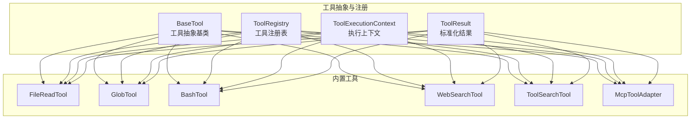
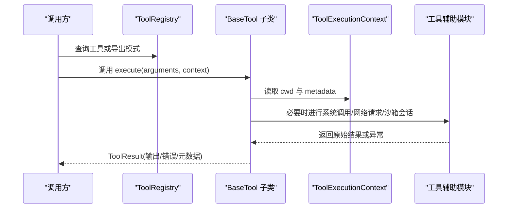
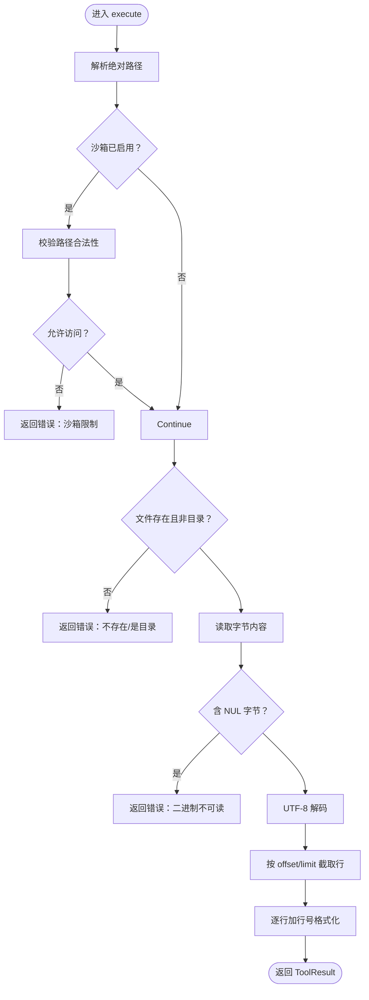
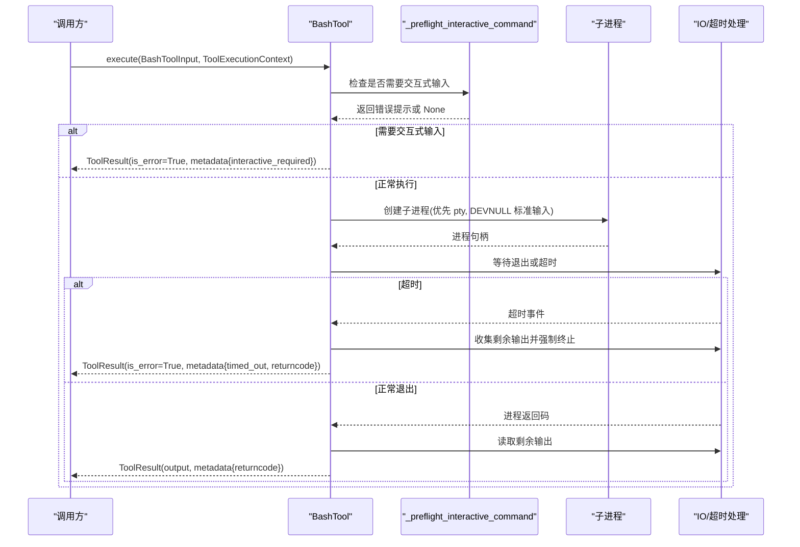
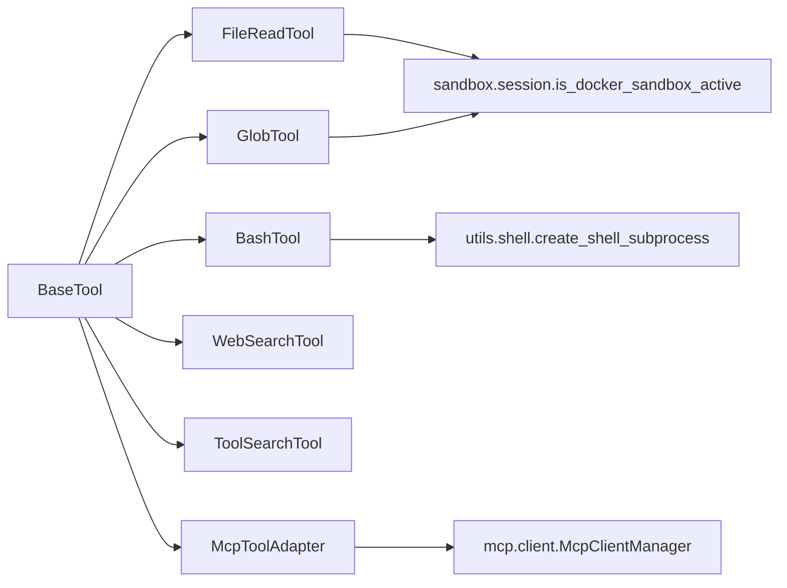

# 工具插件

<cite>
**本文引用的文件**
- [src/openharness/tools/base.py](file://src/openharness/tools/base.py)
- [src/openharness/tools/__init__.py](file://src/openharness/tools/__init__.py)
- [src/openharness/tools/bash_tool.py](file://src/openharness/tools/bash_tool.py)
- [src/openharness/tools/file_read_tool.py](file://src/openharness/tools/file_read_tool.py)
- [src/openharness/tools/glob_tool.py](file://src/openharness/tools/glob_tool.py)
- [src/openharness/tools/web_search_tool.py](file://src/openharness/tools/web_search_tool.py)
- [src/openharness/tools/mcp_tool.py](file://src/openharness/tools/mcp_tool.py)
- [src/openharness/tools/tool_search_tool.py](file://src/openharness/tools/tool_search_tool.py)
- [src/openharness/utils/shell.py](file://src/openharness/utils/shell.py)
- [src/openharness/sandbox/session.py](file://src/openharness/sandbox/session.py)
- [tests/test_tools/test_bash_tool.py](file://tests/test_tools/test_bash_tool.py)
- [tests/test_tools/test_core_tools.py](file://tests/test_tools/test_core_tools.py)
- [CONTRIBUTING.md](file://CONTRIBUTING.md)
</cite>

## 目录
1. [简介](#简介)
2. [项目结构](#项目结构)
3. [核心组件](#核心组件)
4. [架构总览](#架构总览)
5. [详细组件分析](#详细组件分析)
6. [依赖分析](#依赖分析)
7. [性能考虑](#性能考虑)
8. [故障排查指南](#故障排查指南)
9. [结论](#结论)
10. [附录](#附录)

## 简介
本指南面向希望在 OpenHarness 中开发“工具插件”的工程师与技术作者。文档围绕以下目标展开：
- 设计原理：基于 BaseTool 抽象基类构建自定义工具
- 标准接口规范：name、description、input_model、execute 的实现要求
- 实战示例：文件操作工具、Shell 命令工具、网络搜索工具等
- 高级特性：参数校验（Pydantic）、错误处理、超时与异步执行、交互式命令预检
- 测试与调试：单元测试模式、断言要点、调试技巧
- 性能优化：输出截断、流式读取、进程终止策略、路径解析与沙箱集成

## 项目结构
OpenHarness 将“工具”作为可注册、可发现、可序列化的功能单元。工具插件通过统一的抽象层与运行时集成，并由工具注册表集中管理。

图表来源
- [src/openharness/tools/base.py:35-81](file://src/openharness/tools/base.py#L35-L81)
- [src/openharness/tools/__init__.py:48-98](file://src/openharness/tools/__init__.py#L48-L98)

章节来源
- [src/openharness/tools/base.py:17-81](file://src/openharness/tools/base.py#L17-L81)
- [src/openharness/tools/__init__.py:1-108](file://src/openharness/tools/__init__.py#L1-L108)

## 核心组件
- BaseTool：定义工具的统一接口与可选能力（只读标记、API 模式导出）
- ToolExecutionContext：封装工作目录、元数据、钩子执行器等上下文
- ToolResult：标准化输出文本、错误标志、附加元数据
- ToolRegistry：工具名到实例的映射、批量导出 API 模式

关键点
- 所有工具必须提供 name、description、input_model，并实现异步 execute
- 可覆盖 is_read_only 以声明是否为只读调用
- to_api_schema 将工具输入模型转换为 API 可消费的 JSON Schema

章节来源
- [src/openharness/tools/base.py:35-81](file://src/openharness/tools/base.py#L35-L81)

## 架构总览
工具插件的生命周期从“注册—调用—执行—返回结果”。运行时通过 ToolRegistry 提供工具清单，工具在执行时使用 ToolExecutionContext 获取工作目录与上下文元数据，最终以 ToolResult 返回。

图表来源
- [src/openharness/tools/base.py:35-81](file://src/openharness/tools/base.py#L35-L81)
- [src/openharness/tools/__init__.py:48-98](file://src/openharness/tools/__init__.py#L48-L98)

## 详细组件分析

### 文件读取工具：FileReadTool
职责：按行号读取本地 UTF-8 文本文件，支持偏移与限制；在沙箱环境下进行路径合法性检查；拒绝二进制文件。

要点
- 输入模型包含 path、offset、limit 字段，使用 Pydantic 进行类型与范围约束
- is_read_only 默认返回 True，表明该工具不修改文件
- 路径解析与安全检查：在启用 Docker 沙箱时，对相对路径进行白名单校验
- 输出格式化：带行号的文本块，空范围返回提示性消息

图表来源
- [src/openharness/tools/file_read_tool.py:20-73](file://src/openharness/tools/file_read_tool.py#L20-L73)

章节来源
- [src/openharness/tools/file_read_tool.py:12-73](file://src/openharness/tools/file_read_tool.py#L12-L73)

### Shell 命令工具：BashTool
职责：在本地或沙箱中执行 shell 命令，捕获标准输出/合并错误输出，支持超时、交互式命令预检、进程终止与输出截断。

要点
- 输入模型包含 command、cwd、timeout_seconds，字段具备最小/最大值约束
- 交互式命令预检：识别 scaffolding 类命令且未显式提供非交互标志时，提前短路并提示改用非交互参数
- 超时处理：等待进程退出时若超时，收集剩余输出并强制终止，返回部分输出与元数据
- 平台与沙箱：根据平台选择最佳 shell，必要时通过 Docker 沙箱执行
- 输出格式：UTF-8 解码、换行规范化、超长截断

图表来源
- [src/openharness/tools/bash_tool.py:27-86](file://src/openharness/tools/bash_tool.py#L27-L86)
- [src/openharness/utils/shell.py:51-105](file://src/openharness/utils/shell.py#L51-L105)

章节来源
- [src/openharness/tools/bash_tool.py:19-219](file://src/openharness/tools/bash_tool.py#L19-L219)
- [src/openharness/utils/shell.py:17-148](file://src/openharness/utils/shell.py#L17-L148)

### 全局搜索工具：GlobTool
职责：基于 glob 模式列出匹配文件，支持根目录与限制数量；优先使用 ripgrep（若可用）以提升性能并尊重 .gitignore。

要点
- 输入模型包含 pattern/path 别名、root、limit
- 路径解析：自动区分绝对/相对模式，定位真实搜索根
- Git 仓库启发式：在代码库中包含隐藏路径，在普通目录中避免爆炸式搜索
- 性能：优先使用 ripgrep 的文件枚举，超时后优雅终止；回退到 Python 的 Path.glob

章节来源
- [src/openharness/tools/glob_tool.py:14-176](file://src/openharness/tools/glob_tool.py#L14-L176)

### 网络搜索工具：WebSearchTool
职责：调用公共 HTML 搜索端点，解析标题/链接/摘要，返回紧凑结果列表。

要点
- 输入模型包含 query、max_results、search_url（可选）
- 使用网络防护模块与超时控制，失败时返回错误结果
- HTML 解析：正则提取结果片段与锚点，URL 规范化（如 DuckDuckGo 外链跳转）

章节来源
- [src/openharness/tools/web_search_tool.py:17-120](file://src/openharness/tools/web_search_tool.py#L17-L120)

### 工具检索工具：ToolSearchTool
职责：在运行时提供的工具注册表中按名称/描述进行子串匹配。

要点
- 输入模型包含 query
- 通过 context.metadata 获取注册表，遍历工具并过滤匹配项

章节来源
- [src/openharness/tools/tool_search_tool.py:10-39](file://src/openharness/tools/tool_search_tool.py#L10-L39)

### MCP 工具适配器：McpToolAdapter
职责：将外部 MCP 服务器的工具暴露为 OpenHarness 工具，动态生成输入模型。

要点
- 从 MCP 工具信息构造 name/description/input_model
- 执行时调用 MCP 客户端管理器，捕获连接异常并返回错误结果

章节来源
- [src/openharness/tools/mcp_tool.py:14-73](file://src/openharness/tools/mcp_tool.py#L14-L73)

### 工具注册与默认集合
- 工具注册表集中管理工具实例，支持导出 API 模式
- 默认注册器创建内置工具集合，按需注入 MCP 工具

章节来源
- [src/openharness/tools/__init__.py:48-98](file://src/openharness/tools/__init__.py#L48-L98)

## 依赖分析
工具插件之间的耦合度低，主要依赖关系如下：

图表来源
- [src/openharness/tools/bash_tool.py:13-13](file://src/openharness/tools/bash_tool.py#L13-L13)
- [src/openharness/tools/file_read_tool.py:38-45](file://src/openharness/tools/file_read_tool.py#L38-L45)
- [src/openharness/tools/glob_tool.py:117-133](file://src/openharness/tools/glob_tool.py#L117-L133)
- [src/openharness/tools/mcp_tool.py:9-11](file://src/openharness/tools/mcp_tool.py#L9-L11)

章节来源
- [src/openharness/tools/base.py:35-81](file://src/openharness/tools/base.py#L35-L81)
- [src/openharness/sandbox/session.py:24-26](file://src/openharness/sandbox/session.py#L24-L26)

## 性能考虑
- 输出截断与超长保护：对大文本进行截断，避免传输与渲染开销
- 流式读取与超时：在超时场景下尽力收集剩余输出，避免阻塞
- 进程终止策略：先尝试优雅终止，超时后强制 kill，确保资源回收
- 路径扫描优化：优先使用 ripgrep 并尊重 .gitignore，减少 IO 开销
- 平台与 pty：在支持的平台上使用 pty 以提升交互式命令兼容性
- 沙箱集成：在 Docker 沙箱中复用会话执行命令，减少启动成本

章节来源
- [src/openharness/tools/bash_tool.py:135-152](file://src/openharness/tools/bash_tool.py#L135-L152)
- [src/openharness/tools/bash_tool.py:88-101](file://src/openharness/tools/bash_tool.py#L88-L101)
- [src/openharness/tools/glob_tool.py:98-169](file://src/openharness/tools/glob_tool.py#L98-L169)
- [src/openharness/utils/shell.py:51-105](file://src/openharness/utils/shell.py#L51-L105)

## 故障排查指南
- 交互式命令被拒绝
  - 现象：返回错误并标记 metadata.interactive_required 或 timed_out
  - 建议：为 scaffolding 命令添加非交互标志（如 --yes、--non-interactive），或在外部终端先行执行
  - 参考测试：断言包含“无法回答安装器/脚手架提示”“请改用非交互标志”
- 超时与部分输出
  - 现象：返回 metadata.timed_out，输出包含“部分输出”提示
  - 建议：缩短命令、拆分任务、增加超时阈值或改为批处理
- 沙箱不可用
  - 现象：抛出 SandboxUnavailableError 或返回错误结果
  - 建议：检查 Docker 后端状态或关闭 fail_if_unavailable
- 路径越权
  - 现象：沙箱路径校验失败
  - 建议：仅访问允许的相对路径，避免越界访问
- 网络受限
  - 现象：网络防护错误导致搜索失败
  - 建议：配置代理或使用受控搜索端点

章节来源
- [tests/test_tools/test_bash_tool.py:76-119](file://tests/test_tools/test_bash_tool.py#L76-L119)
- [tests/test_tools/test_bash_tool.py:122-142](file://tests/test_tools/test_bash_tool.py#L122-L142)
- [src/openharness/tools/bash_tool.py:53-58](file://src/openharness/tools/bash_tool.py#L53-L58)
- [src/openharness/tools/file_read_tool.py:40-45](file://src/openharness/tools/file_read_tool.py#L40-L45)
- [src/openharness/sandbox/session.py:29-47](file://src/openharness/sandbox/session.py#L29-L47)

## 结论
通过 BaseTool 抽象与 ToolRegistry 管线，OpenHarness 提供了统一、可扩展、可测试的工具插件体系。遵循本文档的接口规范、参数校验、错误处理与性能优化建议，可以快速开发高质量的工具插件，并与内置工具及 MCP 生态无缝集成。

## 附录

### 开发步骤速览
- 继承 BaseTool，设置 name/description/input_model
- 实现异步 execute，使用 ToolExecutionContext 获取 cwd 与 metadata
- 在工具内部完成参数校验、系统调用、网络请求与结果格式化
- 将工具注册到 ToolRegistry，或通过默认注册器纳入全局工具集

章节来源
- [src/openharness/tools/base.py:35-81](file://src/openharness/tools/base.py#L35-L81)
- [src/openharness/tools/__init__.py:48-98](file://src/openharness/tools/__init__.py#L48-L98)

### 测试与调试建议
- 单元测试：参考现有测试用例，模拟子进程、超时、交互式命令等边界场景
- 断言要点：输出文本、is_error 标志、metadata 字段（如 timed_out、interactive_required、returncode）
- 调试技巧：在工具内打印关键参数与中间结果，结合日志与最小可复现命令

章节来源
- [tests/test_tools/test_bash_tool.py:75-216](file://tests/test_tools/test_bash_tool.py#L75-L216)
- [tests/test_tools/test_core_tools.py:33-426](file://tests/test_tools/test_core_tools.py#L33-L426)
- [CONTRIBUTING.md:29-44](file://CONTRIBUTING.md#L29-L44)