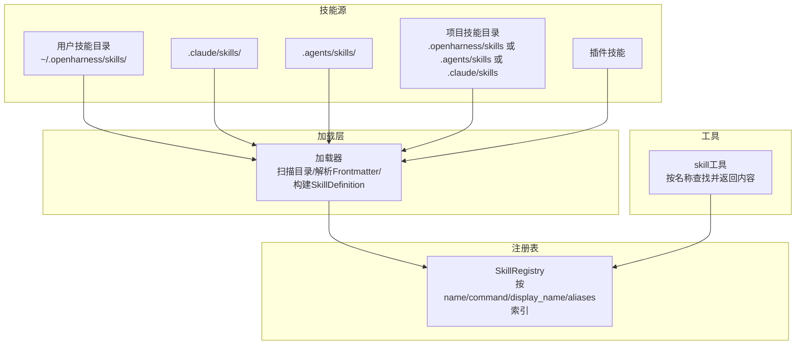
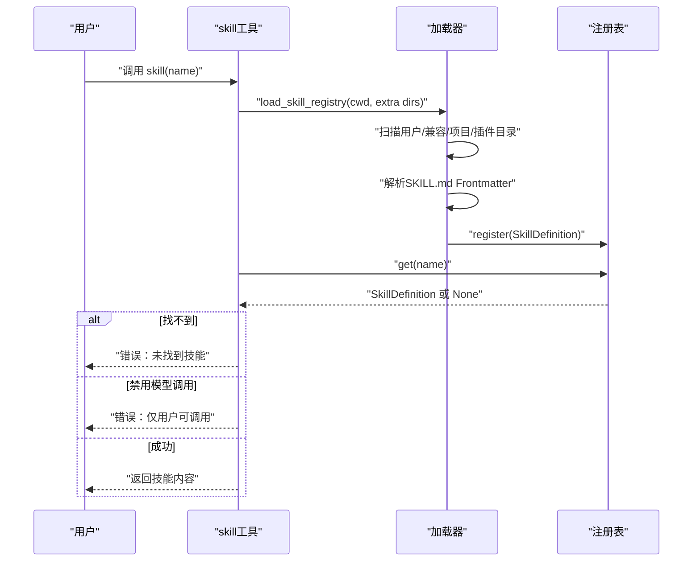
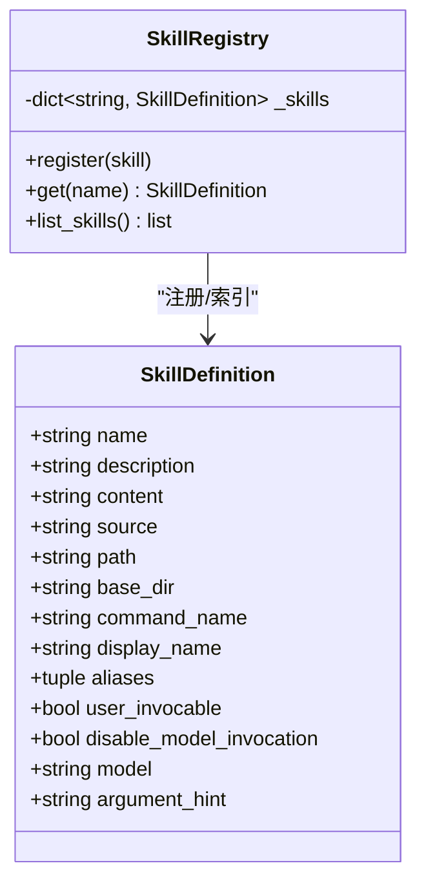
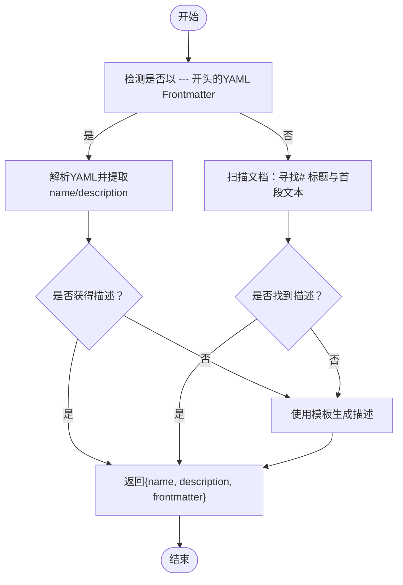
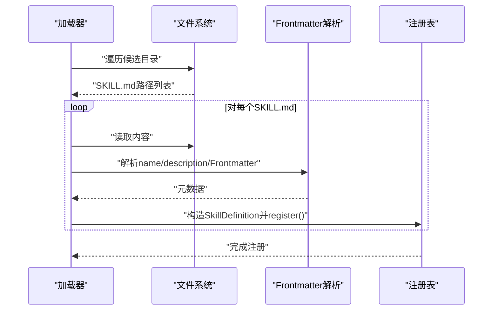
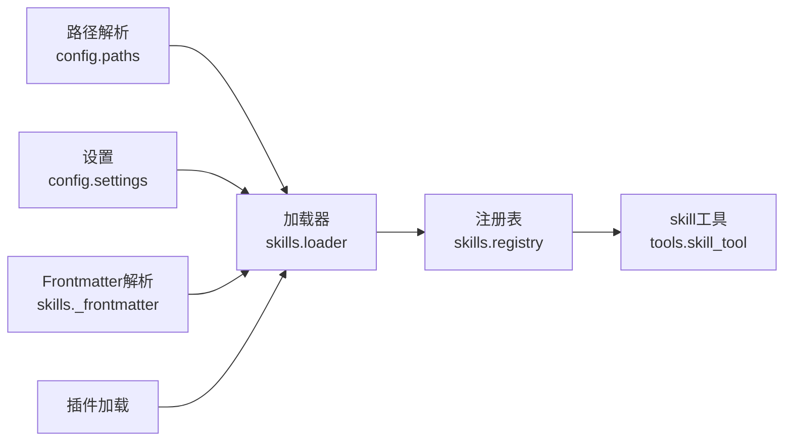

# 技能插件

<cite>
**本文引用的文件**
- [src/openharness/skills/__init__.py](file://src/openharness/skills/__init__.py)
- [src/openharness/skills/_frontmatter.py](file://src/openharness/skills/_frontmatter.py)
- [src/openharness/skills/loader.py](file://src/openharness/skills/loader.py)
- [src/openharness/skills/registry.py](file://src/openharness/skills/registry.py)
- [src/openharness/skills/types.py](file://src/openharness/skills/types.py)
- [src/openharness/tools/skill_tool.py](file://src/openharness/tools/skill_tool.py)
- [.claude/skills/harness-eval/SKILL.md](file://.claude/skills/harness-eval/SKILL.md)
- [.claude/skills/pr-merge/SKILL.md](file://.claude/skills/pr-merge/SKILL.md)
- [src/openharness/skills/bundled/content/skill-creator.md](file://src/openharness/skills/bundled/content/skill-creator.md)
- [src/openharness/skills/bundled/content/commit.md](file://src/openharness/skills/bundled/content/commit.md)
- [src/openharness/skills/bundled/content/review.md](file://src/openharness/skills/bundled/content/review.md)
- [src/openharness/skills/bundled/content/test.md](file://src/openharness/skills/bundled/content/test.md)
- [src/openharness/config/settings.py](file://src/openharness/config/settings.py)
- [src/openharness/config/paths.py](file://src/openharness/config/paths.py)
</cite>

## 目录
1. [简介](#简介)
2. [项目结构](#项目结构)
3. [核心组件](#核心组件)
4. [架构总览](#架构总览)
5. [详细组件分析](#详细组件分析)
6. [依赖关系分析](#依赖关系分析)
7. [性能考量](#性能考量)
8. [故障排查指南](#故障排查指南)
9. [结论](#结论)
10. [附录](#附录)

## 简介
本文件系统化阐述“技能插件”的设计与使用方法，目标是将知识与工作流封装为可重用、可发现、可调用的技能单元。技能以目录化的 SKILL.md 文档形式存在，通过 YAML Frontmatter 提供元数据（名称、描述、是否允许用户直接调用、是否禁用模型调用、默认模型、参数提示等），并由加载器扫描用户、项目、插件等多来源目录，注册到技能注册表中，最终供工具链按需检索与执行。

## 项目结构
技能系统围绕以下关键模块组织：
- 加载与解析：负责扫描目录、解析 Frontmatter、构建技能定义
- 注册表：维护技能名称到技能定义的映射
- 工具：对外暴露“按名称读取技能内容”的能力
- 配置：控制项目技能目录、是否允许项目技能、默认项目技能目录等

图表来源
- [src/openharness/skills/loader.py:42-75](file://src/openharness/skills/loader.py#L42-L75)
- [src/openharness/skills/registry.py:8-29](file://src/openharness/skills/registry.py#L8-L29)
- [src/openharness/tools/skill_tool.py:28-43](file://src/openharness/tools/skill_tool.py#L28-L43)

章节来源
- [src/openharness/skills/loader.py:23-75](file://src/openharness/skills/loader.py#L23-L75)
- [src/openharness/skills/registry.py:8-29](file://src/openharness/skills/registry.py#L8-L29)
- [src/openharness/tools/skill_tool.py:17-43](file://src/openharness/tools/skill_tool.py#L17-L43)

## 核心组件
- 技能定义模型：包含技能名称、描述、内容、来源、路径、命令名、显示名、别名、用户可调用性、禁用模型调用、默认模型、参数提示等字段
- 前言元数据解析：支持 YAML Frontmatter，回退到标题与首段作为描述
- 加载器：扫描用户/兼容/项目/插件目录，构建技能列表并注册
- 注册表：以多种键名索引技能，便于按名称或命令名检索
- 技能工具：根据名称从注册表获取技能，处理“仅用户可调用”的限制

章节来源
- [src/openharness/skills/types.py:8-25](file://src/openharness/skills/types.py#L8-L25)
- [src/openharness/skills/_frontmatter.py:34-97](file://src/openharness/skills/_frontmatter.py#L34-L97)
- [src/openharness/skills/loader.py:153-229](file://src/openharness/skills/loader.py#L153-L229)
- [src/openharness/skills/registry.py:14-29](file://src/openharness/skills/registry.py#L14-L29)
- [src/openharness/tools/skill_tool.py:28-43](file://src/openharness/tools/skill_tool.py#L28-L43)

## 架构总览
技能加载与使用的端到端流程如下：

图表来源
- [src/openharness/tools/skill_tool.py:28-43](file://src/openharness/tools/skill_tool.py#L28-L43)
- [src/openharness/skills/loader.py:42-75](file://src/openharness/skills/loader.py#L42-L75)
- [src/openharness/skills/registry.py:20-22](file://src/openharness/skills/registry.py#L20-L22)

## 详细组件分析

### 技能文件与Frontmatter规范
- 文件位置：每个技能以独立目录存放，入口文件为 SKILL.md
- Frontmatter 元数据（示例字段）：
  - name：技能唯一标识（用于注册表索引）
  - description：触发提示与用途说明（用于UI展示与匹配）
  - version：版本号（可选）
  - user-invocable：布尔值，是否允许用户通过命令直接调用
  - disable-model-invocation：布尔值，是否禁止模型自动调用该技能
  - model：默认模型名（可选）
  - argument-hint：参数提示（可选）
- 回退策略：若无可用 Frontmatter，则回退到“# 标题 + 首段文本”；仍无则使用模板生成描述

章节来源
- [.claude/skills/harness-eval/SKILL.md:1-5](file://.claude/skills/harness-eval/SKILL.md#L1-L5)
- [.claude/skills/pr-merge/SKILL.md:1-5](file://.claude/skills/pr-merge/SKILL.md#L1-L5)
- [src/openharness/skills/_frontmatter.py:34-97](file://src/openharness/skills/_frontmatter.py#L34-L97)

### 加载机制与命名空间规则
- 用户技能目录：
  - 默认：~/.openharness/skills/
  - 兼容：~/.claude/skills、~/.agents/skills
- 项目技能目录（默认）：.openharness/skills、.agents/skills、.claude/skills
- 插件技能：来自已启用插件提供的技能集合
- 命名空间与覆盖顺序：
  - 按“从不具体到更具体”的顺序扫描项目目录树（Git根或用户主目录边界）
  - 后注册项可覆盖更广泛的技能定义，确保确定性覆盖
- 注册键：
  - 使用技能 name、command_name、display_name 及 aliases 作为索引键

章节来源
- [src/openharness/skills/loader.py:23-27](file://src/openharness/skills/loader.py#L23-L27)
- [src/openharness/skills/loader.py:83-123](file://src/openharness/skills/loader.py#L83-L123)
- [src/openharness/skills/registry.py:14-18](file://src/openharness/skills/registry.py#L14-L18)

### 技能工具与用户可调用性
- 工具名称：skill
- 输入：name（技能名称）
- 行为：
  - 加载技能注册表（考虑 cwd、额外技能目录、插件根）
  - 按名称检索（大小写不敏感尝试）
  - 若技能被标记为“禁用模型调用”，则仅允许用户通过命令行方式触发，并返回提示信息
  - 返回技能完整内容

章节来源
- [src/openharness/tools/skill_tool.py:17-43](file://src/openharness/tools/skill_tool.py#L17-L43)

### 内置技能示例分析
- skill-creator：指导如何创建/改进/验证技能，强调目录化结构、触发词、工作流步骤与资源组织
- commit/review/test：演示了简洁的技能结构：目的、何时使用、工作流、规则
- harness-eval/pr-merge：展示了复杂场景下的技能，包含原则、工作流、检查清单、常见陷阱与参考资源

章节来源
- [src/openharness/skills/bundled/content/skill-creator.md:1-176](file://src/openharness/skills/bundled/content/skill-creator.md#L1-L176)
- [src/openharness/skills/bundled/content/commit.md:1-26](file://src/openharness/skills/bundled/content/commit.md#L1-L26)
- [src/openharness/skills/bundled/content/review.md:1-27](file://src/openharness/skills/bundled/content/review.md#L1-L27)
- [src/openharness/skills/bundled/content/test.md:1-32](file://src/openharness/skills/bundled/content/test.md#L1-L32)
- [.claude/skills/harness-eval/SKILL.md:1-194](file://.claude/skills/harness-eval/SKILL.md#L1-L194)
- [.claude/skills/pr-merge/SKILL.md:1-100](file://.claude/skills/pr-merge/SKILL.md#L1-L100)

### 开发示例与最佳实践
- 文件结构建议
  - 目录化：每个技能一个目录，入口为 SKILL.md，可选包含 scripts/、references/、assets/
- Frontmatter 元数据
  - 必填：name、description
  - 推荐：version
  - 可选：user-invocable、disable-model-invocation、model、argument-hint
- 触发词与描述
  - 在 description 中明确“何时使用”“应触发的语境”
  - 避免模糊描述，优先具体、略带断言性的表达
- 工作流与规则
  - 采用“原则—工作流—规则”的结构，必要时将长文档拆分至 references/
- 资源组织
  - 将重复使用的脚本/模板放入 scripts/、assets/，减少模型重复生成
- 加载与验证
  - 使用内置加载器进行本地验证，确保技能被正确发现与注册
- 安全与边界
  - 不隐藏行为、不绕过权限、不泄露数据、不鼓励越权访问
  - 保持名称与路径的可预测性，优先使用小写连字符命名

章节来源
- [src/openharness/skills/bundled/content/skill-creator.md:37-176](file://src/openharness/skills/bundled/content/skill-creator.md#L37-L176)

### 类图：技能数据模型与注册表

图表来源
- [src/openharness/skills/types.py:8-25](file://src/openharness/skills/types.py#L8-L25)
- [src/openharness/skills/registry.py:8-29](file://src/openharness/skills/registry.py#L8-L29)

### 流程图：Frontmatter 解析与回退策略

图表来源
- [src/openharness/skills/_frontmatter.py:34-97](file://src/openharness/skills/_frontmatter.py#L34-L97)

### 序列图：加载与注册流程

图表来源
- [src/openharness/skills/loader.py:153-206](file://src/openharness/skills/loader.py#L153-L206)
- [src/openharness/skills/_frontmatter.py:34-97](file://src/openharness/skills/_frontmatter.py#L34-L97)

## 依赖关系分析
- 加载器依赖：
  - 配置路径解析（获取用户配置目录）
  - 设置（读取项目技能开关与默认目录）
  - 前言解析（YAML与回退策略）
  - 插件加载（可选）
- 注册表依赖：技能定义模型
- 工具依赖：加载器与注册表

图表来源
- [src/openharness/skills/loader.py:9-19](file://src/openharness/skills/loader.py#L9-L19)
- [src/openharness/config/paths.py:15-29](file://src/openharness/config/paths.py#L15-L29)
- [src/openharness/config/settings.py:558-562](file://src/openharness/config/settings.py#L558-L562)
- [src/openharness/tools/skill_tool.py:7-33](file://src/openharness/tools/skill_tool.py#L7-L33)

章节来源
- [src/openharness/skills/loader.py:9-19](file://src/openharness/skills/loader.py#L9-L19)
- [src/openharness/config/paths.py:15-29](file://src/openharness/config/paths.py#L15-L29)
- [src/openharness/config/settings.py:558-562](file://src/openharness/config/settings.py#L558-L562)
- [src/openharness/tools/skill_tool.py:7-33](file://src/openharness/tools/skill_tool.py#L7-L33)

## 性能考量
- 目录扫描与文件读取：在大型仓库中，项目技能目录扫描可能成为瓶颈。建议：
  - 控制项目技能目录数量与层级
  - 合理利用默认安全过滤（仅扫描相对安全的子目录）
- 注册表查询：字典索引为 O(1)，性能开销极低
- Frontmatter 解析：YAML 解析成本与文档长度线性相关，建议将长文档拆分至 references/ 并在技能中引用

## 故障排查指南
- 技能未被发现
  - 检查是否位于正确的目录结构（目录内含 SKILL.md）
  - 确认 Frontmatter 是否有效（YAML 语法错误会导致回退策略）
  - 验证项目技能开关与默认目录设置
- 无法通过模型调用
  - 检查 Frontmatter 中是否设置了禁用模型调用
  - 仅用户可调用的技能需通过命令行方式触发
- 名称不匹配
  - 注册表会按 name、command_name、display_name、aliases 查找，注意大小写与别名设置

章节来源
- [src/openharness/skills/loader.py:153-206](file://src/openharness/skills/loader.py#L153-L206)
- [src/openharness/skills/_frontmatter.py:66-67](file://src/openharness/skills/_frontmatter.py#L66-L67)
- [src/openharness/skills/registry.py:14-18](file://src/openharness/skills/registry.py#L14-L18)
- [src/openharness/tools/skill_tool.py:34-42](file://src/openharness/tools/skill_tool.py#L34-L42)

## 结论
技能插件体系通过“目录化 + Frontmatter + 多源加载 + 注册表索引”的组合，实现了可扩展、可发现、可控制的技能生态。遵循本文的文件结构与元数据规范，结合内置示例与最佳实践，即可高效创建高质量的技能，满足从简单任务到复杂工程验证的多样化需求。

## 附录
- 目录与路径
  - 用户技能目录：~/.openharness/skills/
  - 兼容目录：~/.claude/skills、~/.agents/skills
  - 项目技能默认目录：.openharness/skills、.agents/skills、.claude/skills
- 关键配置项
  - allow_project_skills：是否允许加载项目技能
  - project_skill_dirs：项目技能目录列表
- 内置技能参考
  - skill-creator：技能创作指南
  - commit/review/test：基础工作流技能
  - harness-eval/pr-merge：复杂场景技能

章节来源
- [src/openharness/config/settings.py:558-562](file://src/openharness/config/settings.py#L558-L562)
- [src/openharness/skills/bundled/content/skill-creator.md:25-36](file://src/openharness/skills/bundled/content/skill-creator.md#L25-L36)
- [src/openharness/skills/bundled/content/commit.md:1-26](file://src/openharness/skills/bundled/content/commit.md#L1-L26)
- [src/openharness/skills/bundled/content/review.md:1-27](file://src/openharness/skills/bundled/content/review.md#L1-L27)
- [src/openharness/skills/bundled/content/test.md:1-32](file://src/openharness/skills/bundled/content/test.md#L1-L32)