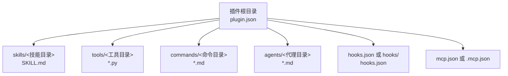
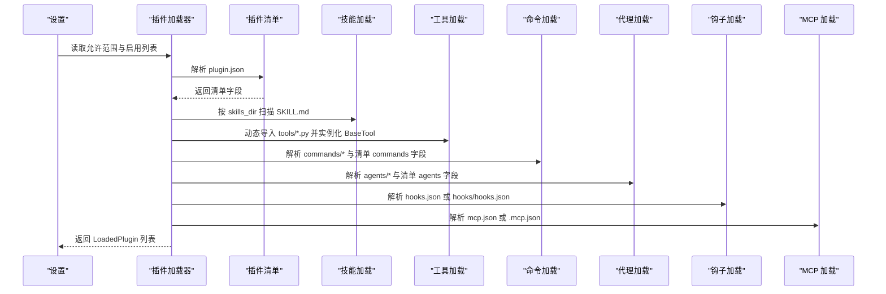
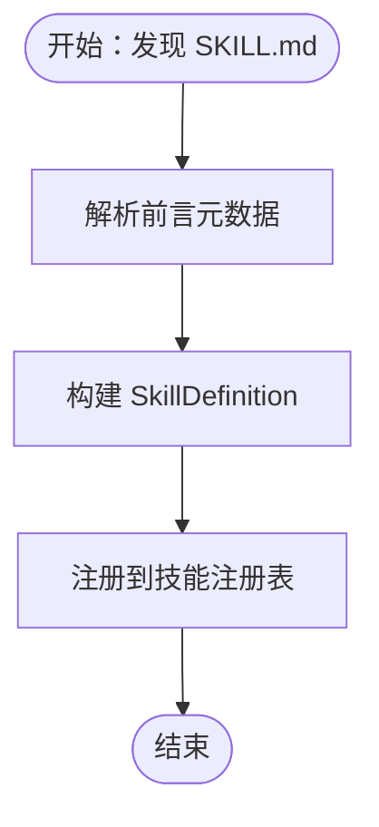
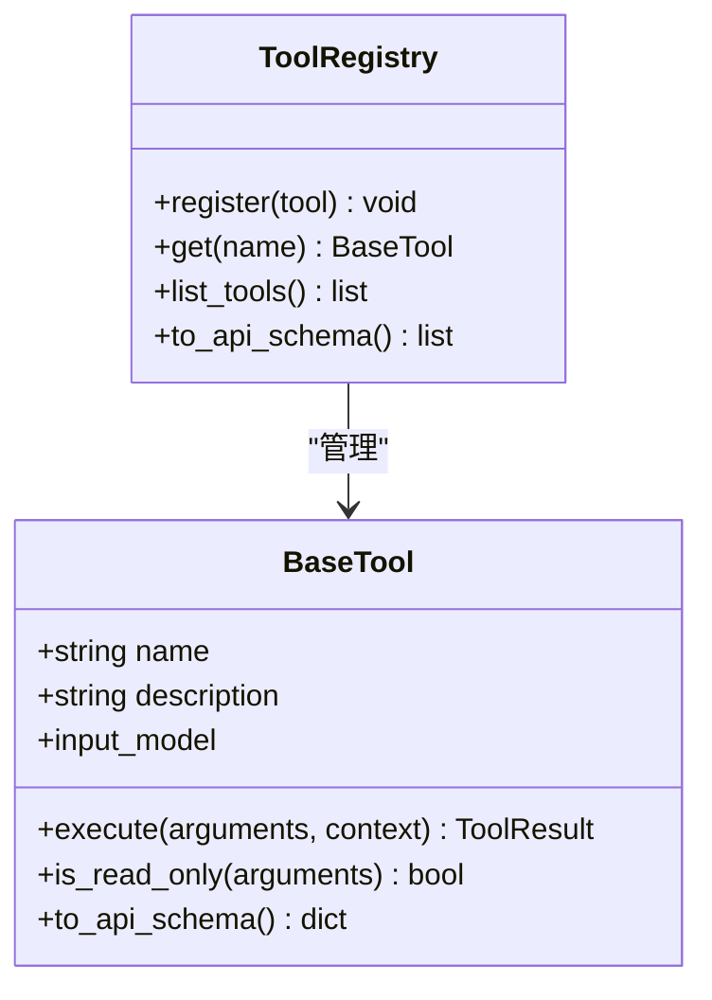
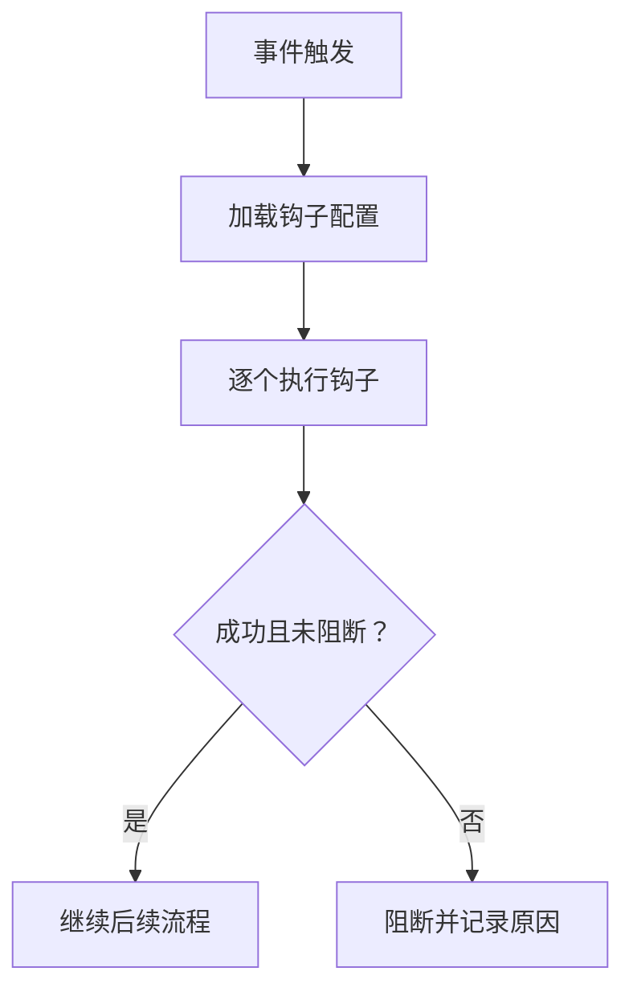
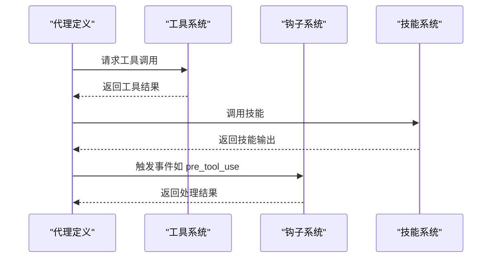
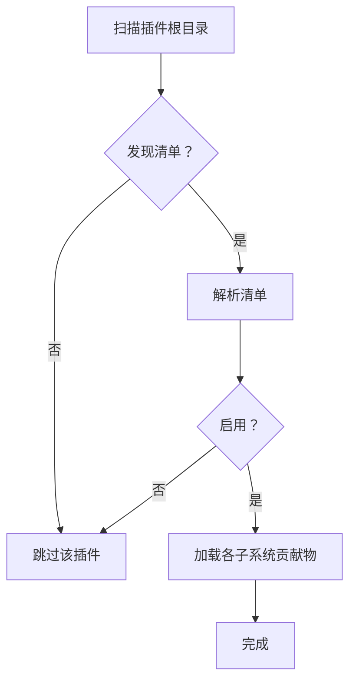
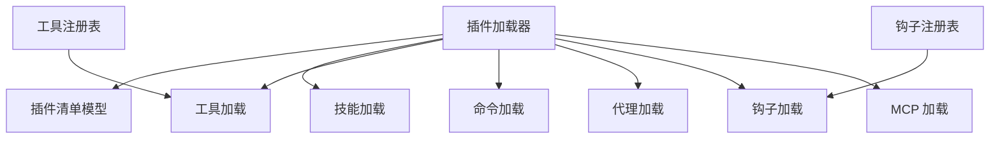

# 插件类型详解

<cite>
**本文引用的文件**
- [src/openharness/plugins/types.py](file://src/openharness/plugins/types.py)
- [src/openharness/plugins/schemas.py](file://src/openharness/plugins/schemas.py)
- [src/openharness/plugins/loader.py](file://src/openharness/plugins/loader.py)
- [src/openharness/hooks/types.py](file://src/openharness/hooks/types.py)
- [src/openharness/hooks/schemas.py](file://src/openharness/hooks/schemas.py)
- [src/openharness/hooks/loader.py](file://src/openharness/hooks/loader.py)
- [src/openharness/skills/types.py](file://src/openharness/skills/types.py)
- [src/openharness/tools/base.py](file://src/openharness/tools/base.py)
- [tests/test_plugins/test_loader.py](file://tests/test_plugins/test_loader.py)
- [.claude/skills/harness-eval/SKILL.md](file://.claude/skills/harness-eval/SKILL.md)
- [.claude/skills/pr-merge/SKILL.md](file://.claude/skills/pr-merge/SKILL.md)
</cite>

## 目录
1. [引言](#引言)
2. [项目结构](#项目结构)
3. [核心组件](#核心组件)
4. [架构总览](#架构总览)
5. [详细组件分析](#详细组件分析)
6. [依赖关系分析](#依赖关系分析)
7. [性能考量](#性能考量)
8. [故障排查指南](#故障排查指南)
9. [结论](#结论)
10. [附录](#附录)

## 引言
本文件面向 OpenHarness 的插件体系，系统性梳理与说明四大插件类型及其在系统中的角色、加载机制、配置项与使用场景，并给出开发与集成建议。重点包括：
- 技能插件：封装知识与工作流，便于模型调用与复用
- 工具插件：扩展工具系统，提供可被引擎调用的具体能力
- 钩子插件：事件监听与处理，支持命令、提示词、HTTP、智能体四类钩子
- 代理插件：通过“代理定义”参与多代理编排与协作

同时，文档提供各类型插件的开发步骤、配置要点、示例路径与实现细节，以及插件间交互与组合使用的模式，并总结性能优化与安全注意事项。

## 项目结构
OpenHarness 将插件视为“可发现、可加载、可启用”的功能包，插件目录下通常包含以下约定式结构（由清单文件控制）：
- plugin.json：插件清单，声明名称、版本、默认启用状态及各子系统入口位置
- skills/：技能目录，按 SKILL.md 组织，描述可被模型调用的工作流
- tools/：工具目录，Python 模块导出 BaseTool 子类实例
- commands/：命令目录，Markdown 文件描述命令与其元数据
- agents/：代理定义，Markdown 文件描述代理参数与行为
- hooks.json 或 hooks/：钩子配置，定义事件触发时的行为
- mcp.json 或 .mcp.json：MCP 服务器配置

**图表来源**
- [src/openharness/plugins/schemas.py:8-25](file://src/openharness/plugins/schemas.py#L8-L25)
- [src/openharness/plugins/loader.py:138-162](file://src/openharness/plugins/loader.py#L138-L162)

**章节来源**
- [src/openharness/plugins/schemas.py:8-25](file://src/openharness/plugins/schemas.py#L8-L25)
- [src/openharness/plugins/loader.py:50-78](file://src/openharness/plugins/loader.py#L50-L78)

## 核心组件
- 插件清单与运行时类型
  - 清单字段：name、version、description、enabled_by_default、skills_dir、tools_dir、hooks_file、mcp_file、commands、agents、skills 等
  - 运行时聚合：LoadedPlugin 聚合技能、命令、代理、工具、钩子、MCP 服务器等贡献物
- 插件加载器
  - 发现与加载：从用户与项目插件根目录扫描，解析清单，按清单字段加载各子系统贡献物
  - 安全与权限：受设置控制是否允许项目级插件，默认禁用项目插件以降低风险
- 钩子系统
  - 类型：命令、提示词、HTTP、智能体四类
  - 结果：单钩子执行结果与事件聚合结果，支持阻断与原因说明
- 技能与工具
  - 技能：以 SKILL.md 描述，含元数据与内容，可被模型调用
  - 工具：继承 BaseTool，统一输入模型、执行上下文与结果格式

**章节来源**
- [src/openharness/plugins/schemas.py:8-25](file://src/openharness/plugins/schemas.py#L8-L25)
- [src/openharness/plugins/types.py:18-60](file://src/openharness/plugins/types.py#L18-L60)
- [src/openharness/plugins/loader.py:107-123](file://src/openharness/plugins/loader.py#L107-L123)
- [src/openharness/hooks/schemas.py:10-58](file://src/openharness/hooks/schemas.py#L10-L58)
- [src/openharness/hooks/types.py:9-39](file://src/openharness/hooks/types.py#L9-L39)
- [src/openharness/skills/types.py:8-25](file://src/openharness/skills/types.py#L8-L25)
- [src/openharness/tools/base.py:35-81](file://src/openharness/tools/base.py#L35-L81)

## 架构总览
插件体系围绕“发现—加载—注册—执行”闭环工作，如下图所示：

**图表来源**
- [src/openharness/plugins/loader.py:107-162](file://src/openharness/plugins/loader.py#L107-L162)
- [src/openharness/plugins/schemas.py:8-25](file://src/openharness/plugins/schemas.py#L8-L25)

## 详细组件分析

### 技能插件（Skill Plugin）
- 角色与特性
  - 将知识与工作流封装为可被模型调用的技能单元
  - 通过 SKILL.md 提供名称、描述、元数据与正文内容
  - 支持用户可调用、禁用模型直接调用、指定模型与参数提示
- 开发方法
  - 在插件根目录下创建 skills/ 目录
  - 每个技能一个子目录或直接在 skills/ 下放置 SKILL.md
  - 使用 YAML 前言元数据声明技能属性（如 user_invocable、disable_model_invocation、model、argument_hint 等）
- 配置选项（清单与前言）
  - 清单字段：skills_dir（默认 skills）
  - 前言字段：name、description、version、user-invocable、disable-model-invocation、model、argument-hint、when_to_use、effort 等
- 使用场景
  - 自动化测试验证、PR 合并流程、端到端功能校验等
- 示例与实现细节
  - 示例技能：harness-eval、pr-merge
  - 实现要点：加载器会解析 SKILL.md，提取元数据与正文，生成 SkillDefinition 并注入命令名与显示名
- 插件间交互
  - 技能可作为命令被调用，也可被代理直接引用
  - 可与钩子配合，在工具调用前后进行拦截与增强

**图表来源**
- [src/openharness/plugins/loader.py:251-307](file://src/openharness/plugins/loader.py#L251-L307)
- [src/openharness/skills/types.py:8-25](file://src/openharness/skills/types.py#L8-L25)

**章节来源**
- [src/openharness/plugins/loader.py:251-307](file://src/openharness/plugins/loader.py#L251-L307)
- [src/openharness/skills/types.py:8-25](file://src/openharness/skills/types.py#L8-L25)
- [.claude/skills/harness-eval/SKILL.md:1-194](file://.claude/skills/harness-eval/SKILL.md#L1-L194)
- [.claude/skills/pr-merge/SKILL.md:1-100](file://.claude/skills/pr-merge/SKILL.md#L1-L100)

### 工具插件（Tool Plugin）
- 角色与特性
  - 扩展工具系统，提供具体可执行能力
  - 通过 tools/*.py 导出 BaseTool 子类实例，统一输入模型与执行接口
- 开发方法
  - 在插件根目录下创建 tools/ 目录
  - 编写 Python 模块，导出继承自 BaseTool 的类，实现 execute 方法
  - 工具加载器动态导入模块并实例化工具
- 配置选项
  - 清单字段：tools_dir（默认 tools）
- 使用场景
  - 文件操作、网络请求、任务管理、消息发送、MCP 认证与资源访问等
- 示例与实现细节
  - 工具基类提供输入模型、执行上下文、只读判定与 API Schema 输出
  - 工具注册表负责命名映射与 API 模式导出
- 插件间交互
  - 工具可被代理直接调用，亦可被钩子在预/后置阶段触发
  - 可与 MCP 服务协同，通过认证与资源工具扩展外部能力

**图表来源**
- [src/openharness/tools/base.py:35-81](file://src/openharness/tools/base.py#L35-L81)

**章节来源**
- [src/openharness/plugins/loader.py:691-731](file://src/openharness/plugins/loader.py#L691-L731)
- [src/openharness/tools/base.py:35-81](file://src/openharness/tools/base.py#L35-L81)

### 钩子插件（Hook Plugin）
- 角色与特性
  - 对系统事件进行监听与处理，支持四类钩子：命令、提示词、HTTP、智能体
  - 支持匹配器、超时、阻断策略与聚合结果
- 开发方法
  - 在插件根目录下提供 hooks.json 或 hooks/hooks.json
  - 清单字段：hooks_file（默认 hooks.json），或在 hooks/ 目录中提供结构化配置
- 配置选项（四类钩子）
  - 命令钩子：command、timeout_seconds、matcher、block_on_failure
  - 提示词钩子：prompt、model、timeout_seconds、matcher、block_on_failure
  - HTTP 钩子：url、headers、timeout_seconds、matcher、block_on_failure
  - 智能体钩子：prompt、model、timeout_seconds、matcher、block_on_failure
- 使用场景
  - 预工具调用阻断与恢复、后工具调用通知、外部系统回调、模型驱动的二次校验
- 示例与实现细节
  - 钩子加载器将插件提供的钩子合并到全局注册表，按事件分组
  - 执行结果以 HookResult 与聚合结果 AggregatedHookResult 表达，支持阻断与原因
- 插件间交互
  - 多个钩子可对同一事件生效，按顺序执行并可被任一钩子阻断
  - 可与技能、工具、代理协作，形成“策略—执行—反馈”的闭环

**图表来源**
- [src/openharness/hooks/schemas.py:10-58](file://src/openharness/hooks/schemas.py#L10-L58)
- [src/openharness/hooks/types.py:9-39](file://src/openharness/hooks/types.py#L9-L39)
- [src/openharness/hooks/loader.py:40-61](file://src/openharness/hooks/loader.py#L40-L61)

**章节来源**
- [src/openharness/plugins/loader.py:621-677](file://src/openharness/plugins/loader.py#L621-L677)
- [src/openharness/hooks/schemas.py:10-58](file://src/openharness/hooks/schemas.py#L10-L58)
- [src/openharness/hooks/types.py:9-39](file://src/openharness/hooks/types.py#L9-L39)
- [src/openharness/hooks/loader.py:40-61](file://src/openharness/hooks/loader.py#L40-L61)

### 代理插件（Agent Plugin）
- 角色与特性
  - 通过代理定义参与多代理编排，支持工具白/黑名单、权限模式、记忆域、隔离模式、最大轮次等
- 开发方法
  - 在插件根目录下创建 agents/ 目录
  - 编写 Markdown 文件，使用前言元数据声明代理参数（tools、disallowed_tools、model、effort、permission_mode、max_turns、skills、color、memory、isolation、initial_prompt、critical_system_reminder、required_mcp_servers、permissions 等）
- 配置选项
  - 清单字段：agents（可为字符串、数组或字典）
- 使用场景
  - 多角色协作、跨任务编排、权限与资源隔离、长对话与记忆管理
- 示例与实现细节
  - 加载器解析代理文件，生成 AgentDefinition，命名空间由目录层级决定
  - 支持 MCP 服务器要求与权限声明
- 插件间交互
  - 代理可调用工具与技能，亦可触发钩子事件
  - 可与其他代理协作，形成团队生命周期管理

**图表来源**
- [src/openharness/plugins/loader.py:479-618](file://src/openharness/plugins/loader.py#L479-L618)

**章节来源**
- [src/openharness/plugins/loader.py:479-618](file://src/openharness/plugins/loader.py#L479-L618)

### 插件加载与安全控制
- 插件发现与加载
  - 用户插件根目录与项目插件根目录均可发现，优先从设置中读取允许范围
  - 未找到清单文件则跳过；清单解析失败也跳过
- 启用策略
  - 受 enabled_by_default 与设置中的 enabled_plugins 控制
  - 默认禁用项目级插件，除非显式允许
- 测试验证
  - 单元测试覆盖插件发现、合并、项目插件禁用与警告等场景

**图表来源**
- [src/openharness/plugins/loader.py:107-162](file://src/openharness/plugins/loader.py#L107-L162)
- [tests/test_plugins/test_loader.py:126-184](file://tests/test_plugins/test_loader.py#L126-L184)

**章节来源**
- [src/openharness/plugins/loader.py:107-162](file://src/openharness/plugins/loader.py#L107-L162)
- [tests/test_plugins/test_loader.py:126-184](file://tests/test_plugins/test_loader.py#L126-L184)

## 依赖关系分析
- 组件耦合
  - 插件加载器依赖清单模型、技能加载器、代理加载器、钩子加载器、MCP 加载器与工具动态导入
  - 钩子系统独立于插件，但通过注册表合并插件钩子
  - 工具系统与插件工具解耦，通过命名注册表对接
- 外部依赖
  - YAML 解析（技能与代理前言）、JSON 解析（清单与钩子）、动态模块导入（工具）

**图表来源**
- [src/openharness/plugins/loader.py:126-162](file://src/openharness/plugins/loader.py#L126-L162)
- [src/openharness/hooks/loader.py:40-61](file://src/openharness/hooks/loader.py#L40-L61)
- [src/openharness/tools/base.py:60-81](file://src/openharness/tools/base.py#L60-L81)

**章节来源**
- [src/openharness/plugins/loader.py:126-162](file://src/openharness/plugins/loader.py#L126-L162)
- [src/openharness/hooks/loader.py:40-61](file://src/openharness/hooks/loader.py#L40-L61)
- [src/openharness/tools/base.py:60-81](file://src/openharness/tools/base.py#L60-L81)

## 性能考量
- 加载性能
  - 插件发现采用集合去重，避免重复扫描
  - 工具动态导入仅在启用插件时进行，减少不必要的模块加载
- 执行性能
  - 钩子超时限制（1–600 秒）防止阻塞
  - 工具只读判定可减少副作用开销
- 资源管理
  - 代理的最大轮次与权限模式有助于控制资源占用
  - MCP 服务器按需加载，避免无谓连接

[本节为通用指导，无需特定文件来源]

## 故障排查指南
- 插件未加载
  - 检查是否存在 plugin.json 或 .claude-plugin/plugin.json
  - 确认 enabled_by_default 或设置中的 enabled_plugins
  - 若为项目级插件，默认禁用，需设置 allow_project_plugins=true
- 技能/命令/代理未出现
  - 检查对应目录与文件命名（SKILL.md、commands/*、agents/*）
  - 确认前言元数据格式正确（YAML）
- 钩子不生效
  - 检查 hooks.json 或 hooks/hooks.json 格式与事件名
  - 确认匹配器与超时设置合理
- 工具异常
  - 检查 tools/*.py 是否导出符合规范的 BaseTool 子类
  - 查看日志中动态导入与实例化的错误信息

**章节来源**
- [src/openharness/plugins/loader.py:126-162](file://src/openharness/plugins/loader.py#L126-L162)
- [src/openharness/plugins/loader.py:621-677](file://src/openharness/plugins/loader.py#L621-L677)
- [src/openharness/plugins/loader.py:691-731](file://src/openharness/plugins/loader.py#L691-L731)

## 结论
OpenHarness 的插件体系以清单驱动、约定式目录与动态加载为核心，将技能、工具、钩子与代理有机整合，既保证了灵活性，又提供了安全与性能上的控制点。通过清晰的开发范式与配置选项，开发者可以快速构建可复用的功能模块，并在多代理编排与事件驱动场景中发挥协同效应。

[本节为总结，无需特定文件来源]

## 附录
- 示例参考
  - 技能示例：harness-eval、pr-merge 的 SKILL.md
  - 插件加载测试：覆盖发现、合并、项目插件禁用与警告等场景
- 关键实现路径
  - 插件类型与运行时聚合：[src/openharness/plugins/types.py](file://src/openharness/plugins/types.py)
  - 插件清单模型：[src/openharness/plugins/schemas.py](file://src/openharness/plugins/schemas.py)
  - 插件加载器：[src/openharness/plugins/loader.py](file://src/openharness/plugins/loader.py)
  - 钩子类型与注册表：[src/openharness/hooks/schemas.py](file://src/openharness/hooks/schemas.py)、[src/openharness/hooks/loader.py](file://src/openharness/hooks/loader.py)
  - 技能类型：[src/openharness/skills/types.py](file://src/openharness/skills/types.py)
  - 工具基类与注册表：[src/openharness/tools/base.py](file://src/openharness/tools/base.py)
  - 插件加载测试：[tests/test_plugins/test_loader.py](file://tests/test_plugins/test_loader.py)

**章节来源**
- [.claude/skills/harness-eval/SKILL.md:1-194](file://.claude/skills/harness-eval/SKILL.md#L1-L194)
- [.claude/skills/pr-merge/SKILL.md:1-100](file://.claude/skills/pr-merge/SKILL.md#L1-L100)
- [tests/test_plugins/test_loader.py:16-184](file://tests/test_plugins/test_loader.py#L16-L184)