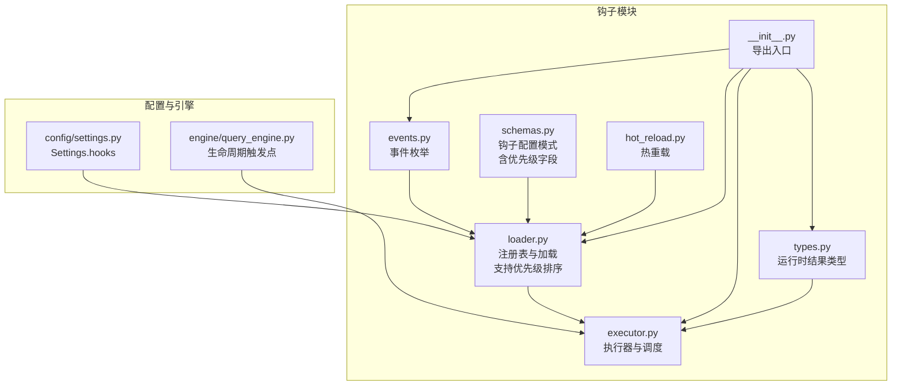
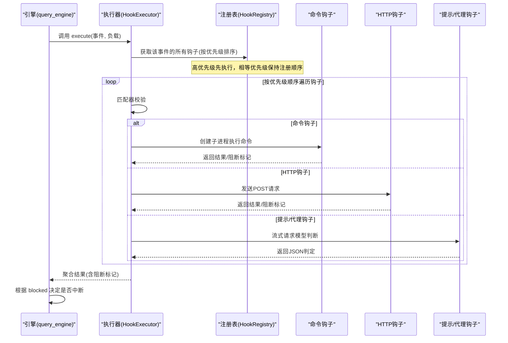
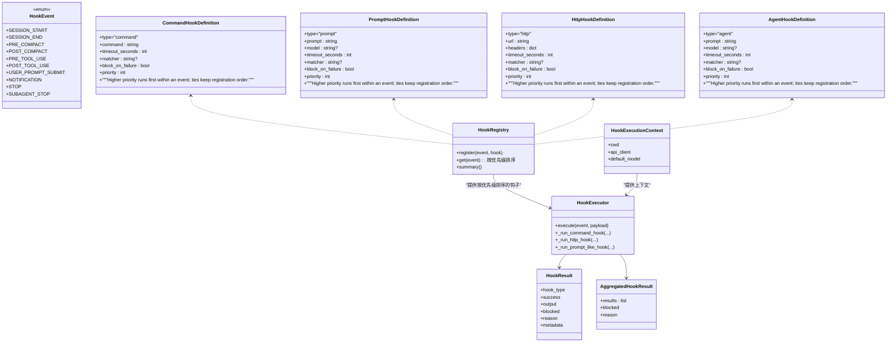
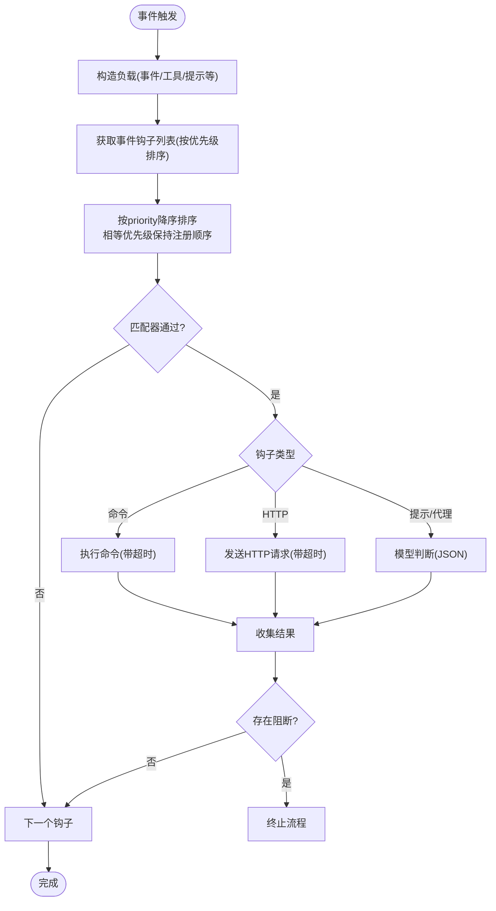
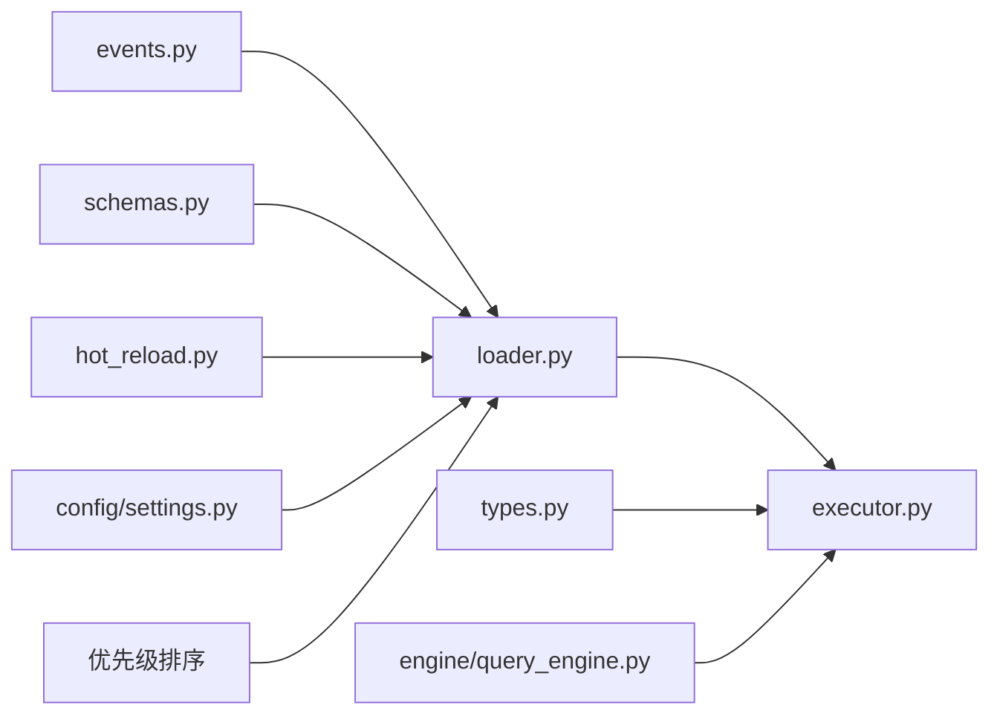

# 钩子插件

<cite>
**本文档引用的文件**
- [src/openharness/hooks/__init__.py](file://src/openharness/hooks/__init__.py)
- [src/openharness/hooks/events.py](file://src/openharness/hooks/events.py)
- [src/openharness/hooks/executor.py](file://src/openharness/hooks/executor.py)
- [src/openharness/hooks/loader.py](file://src/openharness/hooks/loader.py)
- [src/openharness/hooks/schemas.py](file://src/openharness/hooks/schemas.py)
- [src/openharness/hooks/types.py](file://src/openharness/hooks/types.py)
- [src/openharness/hooks/hot_reload.py](file://src/openharness/hooks/hot_reload.py)
- [src/openharness/config/settings.py](file://src/openharness/config/settings.py)
- [src/openharness/engine/query_engine.py](file://src/openharness/engine/query_engine.py)
- [tests/test_hooks/test_executor.py](file://tests/test_hooks/test_executor.py)
- [tests/test_hooks/test_priority.py](file://tests/test_hooks/test_priority.py)
</cite>

## 更新摘要
**所做更改**
- 新增钩子优先级系统章节，详细说明优先级排序机制
- 更新执行顺序章节，反映按优先级执行的新架构
- 新增优先级配置示例和最佳实践
- 更新类图和执行流程图以体现优先级排序

## 目录
1. [简介](#简介)
2. [项目结构](#项目结构)
3. [核心组件](#核心组件)
4. [架构总览](#架构总览)
5. [详细组件分析](#详细组件分析)
6. [依赖关系分析](#依赖关系分析)
7. [性能考量](#性能考量)
8. [故障排查指南](#故障排查指南)
9. [结论](#结论)
10. [附录](#附录)

## 简介
本文件面向开发者与运维人员，系统化阐述 OpenHarness 的钩子插件体系：如何基于生命周期事件驱动自定义逻辑，如何配置与加载钩子，以及不同类型的钩子（命令钩子、提示钩子、HTTP 钩子、代理钩子）在真实场景中的使用方法与注意事项。文档同时覆盖执行顺序、错误处理、性能影响与最佳实践，并给出 hooks.json 的配置要点与事件匹配器、超时设置等关键参数说明。

**更新** 新增钩子优先级系统，支持按优先级排序执行，改进生命周期钩子架构。

## 项目结构
钩子相关代码集中在 src/openharness/hooks 目录，围绕"事件枚举、配置模式、注册表、执行器、结果聚合"构建；配置模型在 config/settings.py 中声明 hooks 字段；引擎在关键生命周期节点调用钩子执行器。

**图示来源**
- [src/openharness/hooks/events.py:8-21](file://src/openharness/hooks/events.py#L8-L21)
- [src/openharness/hooks/schemas.py:10-58](file://src/openharness/hooks/schemas.py#L10-L58)
- [src/openharness/hooks/loader.py:10-60](file://src/openharness/hooks/loader.py#L10-L60)
- [src/openharness/hooks/executor.py:41-78](file://src/openharness/hooks/executor.py#L41-L78)
- [src/openharness/hooks/types.py:9-39](file://src/openharness/hooks/types.py#L9-L39)
- [src/openharness/hooks/hot_reload.py:11-31](file://src/openharness/hooks/hot_reload.py#L11-L31)
- [src/openharness/config/settings.py:554-554](file://src/openharness/config/settings.py#L554-L554)
- [src/openharness/engine/query_engine.py:227-246](file://src/openharness/engine/query_engine.py#L227-L246)

**章节来源**
- [src/openharness/hooks/__init__.py:13-21](file://src/openharness/hooks/__init__.py#L13-L21)
- [src/openharness/hooks/events.py:8-21](file://src/openharness/hooks/events.py#L8-L21)
- [src/openharness/hooks/schemas.py:10-58](file://src/openharness/hooks/schemas.py#L10-L58)
- [src/openharness/hooks/loader.py:10-60](file://src/openharness/hooks/loader.py#L10-L60)
- [src/openharness/hooks/executor.py:41-78](file://src/openharness/hooks/executor.py#L41-L78)
- [src/openharness/hooks/types.py:9-39](file://src/openharness/hooks/types.py#L9-L39)
- [src/openharness/hooks/hot_reload.py:11-31](file://src/openharness/hooks/hot_reload.py#L11-L31)
- [src/openharness/config/settings.py:554-554](file://src/openharness/config/settings.py#L554-L554)
- [src/openharness/engine/query_engine.py:227-246](file://src/openharness/engine/query_engine.py#L227-L246)

## 核心组件
- 事件枚举：定义所有可触发钩子的生命周期事件，如会话开始/结束、工具使用前后、用户提交提示、通知、停止等。
- 配置模式：定义四类钩子的字段与约束（类型、命令/提示、超时、匹配器、失败阻断策略、优先级）。
- 注册表：按事件分组存储钩子，支持按优先级排序与汇总展示。
- 执行器：根据事件与负载匹配钩子，按优先级顺序执行并聚合结果，支持命令、HTTP、提示/代理三类执行路径。
- 结果类型：单钩子与聚合结果，包含成功与否、阻断标记、原因、元数据等。
- 热重载：监听配置文件变更，动态重建注册表。
- 引擎集成：在关键生命周期节点调用钩子执行器，传递标准化负载。

**更新** 新增优先级字段，支持钩子间的执行顺序控制。

**章节来源**
- [src/openharness/hooks/events.py:8-21](file://src/openharness/hooks/events.py#L8-L21)
- [src/openharness/hooks/schemas.py:10-58](file://src/openharness/hooks/schemas.py#L10-L58)
- [src/openharness/hooks/loader.py:10-38](file://src/openharness/hooks/loader.py#L10-L38)
- [src/openharness/hooks/executor.py:41-78](file://src/openharness/hooks/executor.py#L41-L78)
- [src/openharness/hooks/types.py:9-39](file://src/openharness/hooks/types.py#L9-L39)
- [src/openharness/hooks/hot_reload.py:11-31](file://src/openharness/hooks/hot_reload.py#L11-L31)
- [src/openharness/engine/query_engine.py:227-246](file://src/openharness/engine/query_engine.py#L227-L246)

## 架构总览
钩子系统采用"事件驱动 + 配置驱动"的设计：配置文件中声明 hooks 映射（事件到钩子列表），执行器在对应生命周期事件发生时，按优先级顺序遍历匹配钩子并执行，最终返回聚合结果，供上层决定是否继续后续流程。

**更新** 执行器现在按优先级降序执行钩子，确保高优先级钩子先执行。

**图示来源**
- [src/openharness/engine/query_engine.py:227-246](file://src/openharness/engine/query_engine.py#L227-L246)
- [src/openharness/hooks/executor.py:64-78](file://src/openharness/hooks/executor.py#L64-L78)
- [src/openharness/hooks/loader.py:20-28](file://src/openharness/hooks/loader.py#L20-L28)

## 详细组件分析

### 事件驱动机制与生命周期
- 事件由 HookEvent 枚举定义，覆盖会话、压缩、工具使用、用户输入、通知、停止等关键节点。
- 引擎在合适时机构造负载并调用执行器，例如用户提交提示、工具使用前后、内存压缩前/后等。
- 匹配器通过通配符对负载中的工具名、提示文本或事件名进行过滤，确保只对目标场景生效。

**章节来源**
- [src/openharness/hooks/events.py:8-21](file://src/openharness/hooks/events.py#L8-L21)
- [src/openharness/engine/query_engine.py:227-246](file://src/openharness/engine/query_engine.py#L227-L246)
- [src/openharness/hooks/executor.py:215-220](file://src/openharness/hooks/executor.py#L215-L220)

### 四种钩子类型与使用场景
- 命令钩子(command)
  - 功能：在沙箱环境中执行任意命令，适合本地审计、告警、资源清理、环境初始化等。
  - 关键字段：type、command、timeout_seconds、matcher、block_on_failure、priority。
  - 安全性：自动对传入参数进行 shell 转义，避免注入风险。
  - 典型场景：工具调用前检查权限、记录日志、清理临时文件。
- 提示钩子(prompt)
  - 功能：通过模型判断是否允许继续，适合策略校验、合规检查。
  - 关键字段：type、prompt、model、timeout_seconds、matcher、block_on_failure、priority。
  - 行为：要求模型返回严格 JSON，包含 ok 与可选 reason。
  - 典型场景：禁止危险命令、限制访问敏感路径。
- HTTP 钩子(http)
  - 功能：向外部服务上报事件与负载，适合集中审计、远程决策、联动其他系统。
  - 关键字段：type、url、headers、timeout_seconds、matcher、block_on_failure、priority。
  - 行为：POST 请求，成功与否依据状态码与响应内容。
  - 典型场景：安全平台联动、工单系统触发。
- 代理钩子(agent)
  - 功能：更深入的模型判断，适合复杂推理与上下文评估。
  - 关键字段：type、prompt、model、timeout_seconds、matcher、block_on_failure、priority。
  - 行为：与提示钩子类似，但系统前缀强调更全面的推理。
  - 典型场景：复杂策略审批、多轮对话上下文评估。

**更新** 所有钩子类型现在都支持 priority 字段，默认优先级为 0。

**章节来源**
- [src/openharness/hooks/schemas.py:10-58](file://src/openharness/hooks/schemas.py#L10-L58)
- [src/openharness/hooks/executor.py:80-167](file://src/openharness/hooks/executor.py#L80-L167)
- [src/openharness/hooks/executor.py:169-212](file://src/openharness/hooks/executor.py#L169-L212)

### 钩子优先级系统
- 优先级定义：priority 字段为整数，默认值为 0。数值越大，钩子执行优先级越高。
- 排序规则：注册表按优先级降序排列，相等优先级的钩子保持注册时的相对顺序。
- 执行顺序：执行器按排序后的钩子列表依次执行，确保高优先级钩子先于低优先级钩子执行。
- 负优先级：负数优先级的钩子会在正优先级钩子之后执行，适合清理类钩子。
- 默认行为：未指定 priority 的钩子默认优先级为 0，与其他显式设置为 0 的钩子一起按注册顺序执行。

**新增** 详细的优先级系统说明和使用指导。

**章节来源**
- [src/openharness/hooks/schemas.py:18-19](file://src/openharness/hooks/schemas.py#L18-L19)
- [src/openharness/hooks/schemas.py:31-32](file://src/openharness/hooks/schemas.py#L31-L32)
- [src/openharness/hooks/schemas.py:44-45](file://src/openharness/hooks/schemas.py#L44-L45)
- [src/openharness/hooks/schemas.py:57-58](file://src/openharness/hooks/schemas.py#L57-L58)
- [src/openharness/hooks/loader.py:20-28](file://src/openharness/hooks/loader.py#L20-L28)
- [tests/test_hooks/test_priority.py:32-100](file://tests/test_hooks/test_priority.py#L32-L100)

### 配置与加载：hooks.json 与 Settings
- 配置位置：Settings.hooks 是一个字典，键为事件字符串（必须是 HookEvent 的值），值为钩子定义数组。
- 加载流程：HookRegistry.register 按事件收集钩子；load_hook_registry 合并 settings 与插件提供的钩子。
- 插件钩子：插件启用时，其 hooks 字典同样被合并进注册表。
- 热重载：HookReloader 监控配置文件修改时间，变更时重新加载并更新注册表。
- 优先级处理：注册表在获取钩子时自动按优先级排序，确保执行顺序正确。

**更新** 注册表现在在获取钩子时自动应用优先级排序。

**章节来源**
- [src/openharness/config/settings.py:554-554](file://src/openharness/config/settings.py#L554-L554)
- [src/openharness/hooks/loader.py:40-60](file://src/openharness/hooks/loader.py#L40-L60)
- [src/openharness/hooks/hot_reload.py:19-31](file://src/openharness/hooks/hot_reload.py#L19-L31)

### 执行顺序、匹配器与超时
- 执行顺序：同一事件下，执行器按注册表返回的优先级顺序依次执行，不保证并发；每个钩子独立超时控制。
- 优先级排序：注册表按 priority 字段降序排列，相等优先级保持注册顺序。
- 匹配器：支持通配符匹配，缺省表示匹配所有；常用于按工具名或提示片段筛选。
- 超时：命令钩子与 HTTP 钩子各自有超时秒数；提示/代理钩子受模型流式响应限制与最大令牌约束。
- 阻断策略：block_on_failure 为真时，任一失败将阻止后续流程；默认提示钩子与代理钩子开启阻断。

**更新** 执行顺序现在受优先级影响，高优先级钩子先执行。

**章节来源**
- [src/openharness/hooks/executor.py:64-78](file://src/openharness/hooks/executor.py#L64-L78)
- [src/openharness/hooks/executor.py:215-220](file://src/openharness/hooks/executor.py#L215-L220)
- [src/openharness/hooks/schemas.py:15-17](file://src/openharness/hooks/schemas.py#L15-L17)
- [src/openharness/hooks/schemas.py:26-28](file://src/openharness/hooks/schemas.py#L26-L28)
- [src/openharness/hooks/schemas.py:37-39](file://src/openharness/hooks/schemas.py#L37-L39)
- [src/openharness/hooks/schemas.py:48-50](file://src/openharness/hooks/schemas.py#L48-L50)

### 错误处理与安全
- 命令钩子
  - 子进程超时：捕获超时并终止进程，返回失败与阻断标记（若配置为阻断）。
  - 沙箱不可用：捕获 SandboxUnavailableError 并返回失败。
  - 输出：合并 stdout/stderr，提取返回码作为元数据。
- HTTP 钩子
  - 异常：网络/解析异常统一转为失败，保留阻断标记。
  - 成功：依据状态码是否成功，输出响应文本与状态码元数据。
- 提示/代理钩子
  - JSON 解析：严格要求返回 {"ok": true/false, "reason"?: string}；否则视为拒绝。
  - 失败阻断：根据 block_on_failure 决定是否阻断。
- 安全
  - 命令参数注入防护：对命令模板中的 $ARGUMENTS 进行 shell 转义。
  - 环境变量：向子进程注入 OPENHARNESS_HOOK_EVENT 与 OPENHARNESS_HOOK_PAYLOAD，便于脚本侧调试与审计。

**章节来源**
- [src/openharness/hooks/executor.py:80-136](file://src/openharness/hooks/executor.py#L80-L136)
- [src/openharness/hooks/executor.py:138-167](file://src/openharness/hooks/executor.py#L138-L167)
- [src/openharness/hooks/executor.py:169-212](file://src/openharness/hooks/executor.py#L169-L212)
- [src/openharness/hooks/executor.py:223-229](file://src/openharness/hooks/executor.py#L223-L229)
- [tests/test_hooks/test_executor.py:81-95](file://tests/test_hooks/test_executor.py#L81-L95)
- [tests/test_hooks/test_executor.py:98-121](file://tests/test_hooks/test_executor.py#L98-L121)

### 类图：钩子类型与执行器

**图示来源**
- [src/openharness/hooks/events.py:8-21](file://src/openharness/hooks/events.py#L8-L21)
- [src/openharness/hooks/schemas.py:10-58](file://src/openharness/hooks/schemas.py#L10-L58)
- [src/openharness/hooks/loader.py:10-38](file://src/openharness/hooks/loader.py#L10-L38)
- [src/openharness/hooks/executor.py:32-63](file://src/openharness/hooks/executor.py#L32-L63)
- [src/openharness/hooks/types.py:9-39](file://src/openharness/hooks/types.py#L9-L39)

### 执行流程与决策

**更新** 执行流程现在包含优先级排序步骤。

**图示来源**
- [src/openharness/hooks/executor.py:64-78](file://src/openharness/hooks/executor.py#L64-L78)
- [src/openharness/hooks/executor.py:80-167](file://src/openharness/hooks/executor.py#L80-L167)
- [src/openharness/hooks/executor.py:169-212](file://src/openharness/hooks/executor.py#L169-L212)
- [src/openharness/hooks/loader.py:20-28](file://src/openharness/hooks/loader.py#L20-L28)

## 依赖关系分析
- 组件耦合
  - 执行器依赖注册表与事件枚举；依赖配置模式定义的钩子结构。
  - 注册表与加载器解耦于具体执行细节，便于扩展新钩子类型。
  - 热重载仅依赖配置加载与注册表重建，不影响执行器。
- 外部依赖
  - 命令钩子依赖沙箱子进程创建与超时控制。
  - HTTP 钩子依赖异步 HTTP 客户端。
  - 提示/代理钩子依赖消息流式接口与模型 API。
- 循环依赖
  - 未发现循环导入；模块职责清晰，按功能分层。

**图示来源**
- [src/openharness/hooks/events.py:8-21](file://src/openharness/hooks/events.py#L8-L21)
- [src/openharness/hooks/schemas.py:10-58](file://src/openharness/hooks/schemas.py#L10-L58)
- [src/openharness/hooks/loader.py:40-60](file://src/openharness/hooks/loader.py#L40-L60)
- [src/openharness/hooks/executor.py:41-78](file://src/openharness/hooks/executor.py#L41-L78)
- [src/openharness/hooks/types.py:9-39](file://src/openharness/hooks/types.py#L9-L39)
- [src/openharness/hooks/hot_reload.py:19-31](file://src/openharness/hooks/hot_reload.py#L19-L31)
- [src/openharness/config/settings.py:554-554](file://src/openharness/config/settings.py#L554-L554)
- [src/openharness/engine/query_engine.py:227-246](file://src/openharness/engine/query_engine.py#L227-L246)

**章节来源**
- [src/openharness/hooks/loader.py:10-38](file://src/openharness/hooks/loader.py#L10-L38)
- [src/openharness/hooks/executor.py:41-78](file://src/openharness/hooks/executor.py#L41-L78)
- [src/openharness/hooks/hot_reload.py:19-31](file://src/openharness/hooks/hot_reload.py#L19-L31)
- [src/openharness/engine/query_engine.py:227-246](file://src/openharness/engine/query_engine.py#L227-L246)

## 性能考量
- 执行开销
  - 命令钩子：子进程创建与 IO 开销，建议合理设置超时，避免长时间阻塞。
  - HTTP 钩子：网络往返与序列化成本，建议短路径快速返回，必要时异步上报。
  - 提示/代理钩子：模型调用成本较高，注意最大令牌与流式响应处理。
- 并发与顺序
  - 当前实现逐个执行钩子，避免并发竞争；如需并行，可在上层批量触发或拆分事件。
  - 优先级排序不影响执行顺序，仍按顺序执行，但高优先级钩子先执行。
- 资源限制
  - 超时与阻断策略应结合业务 SLA 设定；对高风险操作优先阻断。
- 缓存与去重
  - 对重复事件与相同负载可考虑上层缓存，减少重复调用。

**更新** 优先级排序不影响执行顺序，仍按顺序执行，但高优先级钩子先执行。

## 故障排查指南
- 命令钩子失败
  - 检查超时与返回码；确认命令模板中 $ARGUMENTS 是否正确转义。
  - 查看阻断标记与原因输出，定位失败根因。
- HTTP 钩子失败
  - 检查网络连通性、URL 与头部；关注状态码与响应体。
- 提示/代理钩子失败
  - 确认模型返回严格 JSON；若返回非标准格式，将被视为拒绝。
- 配置未生效
  - 确认事件名称在 HookEvent 中存在；检查匹配器是否正确。
  - 使用热重载功能或重启应用以应用最新配置。
- 权限与沙箱
  - 若提示沙箱不可用，检查运行环境与权限配置。
- 优先级问题
  - 检查钩子的 priority 字段是否正确设置。
  - 确认相等优先级的钩子是否按预期保持注册顺序。

**更新** 新增优先级相关故障排查指导。

**章节来源**
- [src/openharness/hooks/executor.py:80-136](file://src/openharness/hooks/executor.py#L80-L136)
- [src/openharness/hooks/executor.py:138-167](file://src/openharness/hooks/executor.py#L138-L167)
- [src/openharness/hooks/executor.py:169-212](file://src/openharness/hooks/executor.py#L169-L212)
- [src/openharness/hooks/hot_reload.py:19-31](file://src/openharness/hooks/hot_reload.py#L19-L31)
- [tests/test_hooks/test_executor.py:81-121](file://tests/test_hooks/test_executor.py#L81-L121)
- [tests/test_hooks/test_priority.py:32-100](file://tests/test_hooks/test_priority.py#L32-L100)

## 结论
钩子插件为 OpenHarness 提供了强大的事件驱动扩展能力。通过统一的配置模型与执行器抽象，开发者可以灵活地在关键生命周期节点插入自定义逻辑。新增的优先级系统使得钩子间的执行顺序更加可控，支持复杂的业务流程编排。

**更新** 新增优先级系统显著增强了钩子插件的灵活性和可控性。

建议在生产中谨慎设置超时与阻断策略，优先使用提示/代理钩子进行策略校验，并配合 HTTP 钩子实现集中化审计与联动。热重载机制使得配置变更无需重启即可生效，提升运维效率。合理利用优先级系统，可以实现更精细的业务控制和更可靠的执行顺序。

## 附录

### hooks.json 配置要点
- 结构
  - 键：事件字符串（必须为 HookEvent 的值）
  - 值：钩子定义数组（可混合多种类型）
- 通用字段
  - type：命令/提示/HTTP/代理
  - timeout_seconds：超时秒数（命令与 HTTP 钩子）
  - matcher：通配符匹配器（可选）
  - block_on_failure：失败时是否阻断（可选）
  - priority：钩子优先级（整数，默认 0）
- 命令钩子
  - command：命令模板，支持 $ARGUMENTS 注入
- 提示/代理钩子
  - prompt：判断提示词
  - model：可选，缺省使用默认模型
- HTTP 钩子
  - url：目标地址
  - headers：请求头（可选）

**更新** 新增 priority 字段说明。

**章节来源**
- [src/openharness/config/settings.py:554-554](file://src/openharness/config/settings.py#L554-L554)
- [src/openharness/hooks/schemas.py:10-58](file://src/openharness/hooks/schemas.py#L10-L58)

### 生命周期事件与典型用法
- SESSION_START/SESSION_END：会话级审计、初始化/收尾脚本
- PRE_TOOL_USE/POST_TOOL_USE：工具调用前/后策略校验与审计
- PRE_COMPACT/POST_COMPACT：内存压缩前后通知与清理
- USER_PROMPT_SUBMIT：用户输入前策略拦截
- NOTIFICATION/STOP/SUBAGENT_STOP：通知与停止事件联动

**章节来源**
- [src/openharness/hooks/events.py:8-21](file://src/openharness/hooks/events.py#L8-L21)
- [src/openharness/engine/query_engine.py:227-246](file://src/openharness/engine/query_engine.py#L227-L246)

### 钩子优先级最佳实践
- 高优先级策略钩子：设置较高的 priority 值，确保在执行前进行策略检查。
- 低优先级审计钩子：设置较低的 priority 值，确保在执行后进行审计记录。
- 清理类钩子：设置负数 priority 值，确保在所有其他钩子执行完毕后进行清理。
- 相同优先级：多个钩子设置相同的 priority 值时，将保持注册时的相对顺序执行。
- 默认行为：未指定 priority 的钩子默认优先级为 0，与其他显式设置为 0 的钩子一起按注册顺序执行。

**新增** 钩子优先级的最佳实践指导。

**章节来源**
- [src/openharness/hooks/schemas.py:18-19](file://src/openharness/hooks/schemas.py#L18-L19)
- [src/openharness/hooks/schemas.py:31-32](file://src/openharness/hooks/schemas.py#L31-L32)
- [src/openharness/hooks/schemas.py:44-45](file://src/openharness/hooks/schemas.py#L44-L45)
- [src/openharness/hooks/schemas.py:57-58](file://src/openharness/hooks/schemas.py#L57-L58)
- [tests/test_hooks/test_priority.py:32-100](file://tests/test_hooks/test_priority.py#L32-L100)

### 实际测试参考
- 命令钩子执行与输出验证
- 提示钩子阻断行为与匹配器
- 参数注入与 shell 转义安全性
- 钩子优先级排序测试

**更新** 新增钩子优先级排序测试参考。

**章节来源**
- [tests/test_hooks/test_executor.py:33-49](file://tests/test_hooks/test_executor.py#L33-L49)
- [tests/test_hooks/test_executor.py:51-73](file://tests/test_hooks/test_executor.py#L51-L73)
- [tests/test_hooks/test_executor.py:81-121](file://tests/test_hooks/test_executor.py#L81-L121)
- [tests/test_hooks/test_priority.py:32-100](file://tests/test_hooks/test_priority.py#L32-L100)