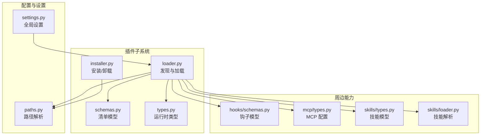
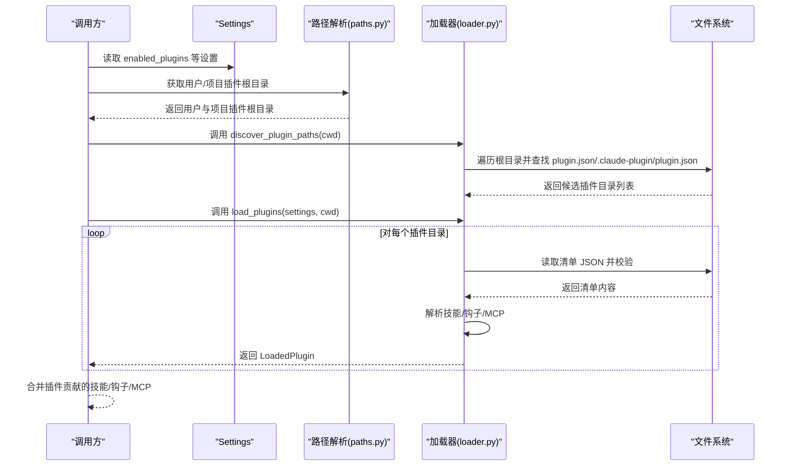
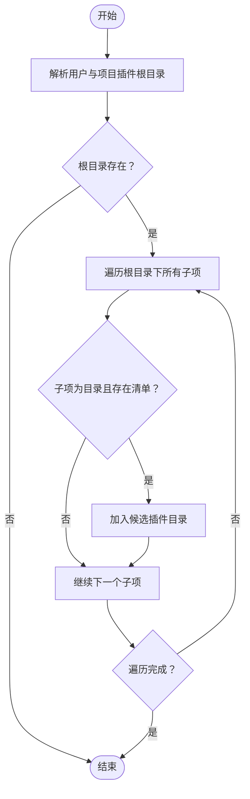
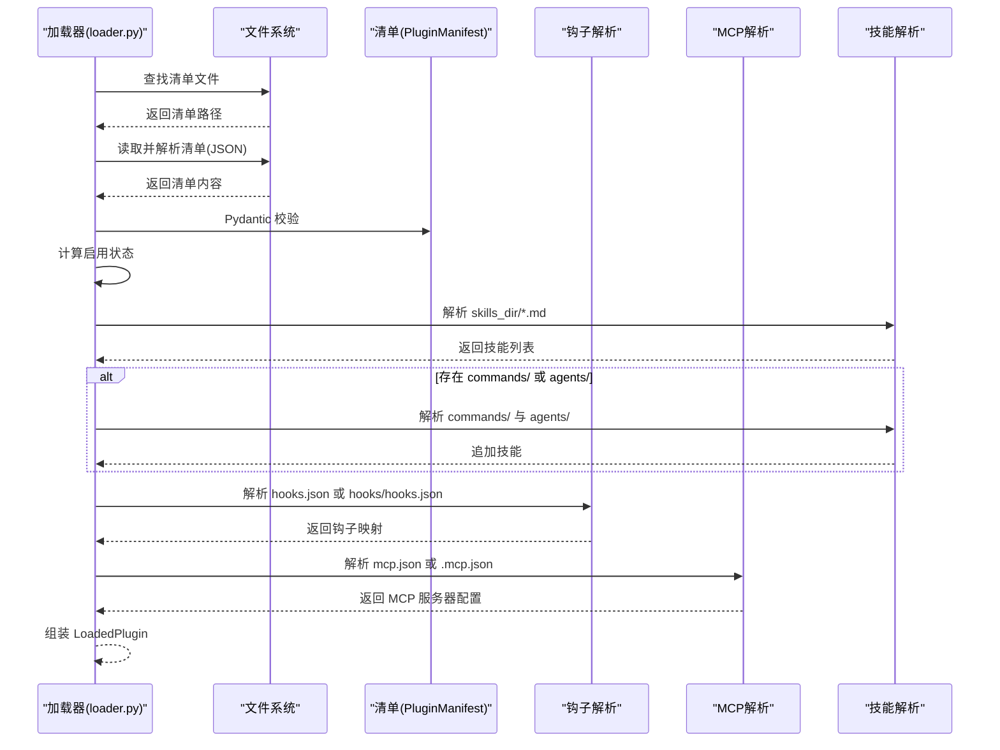
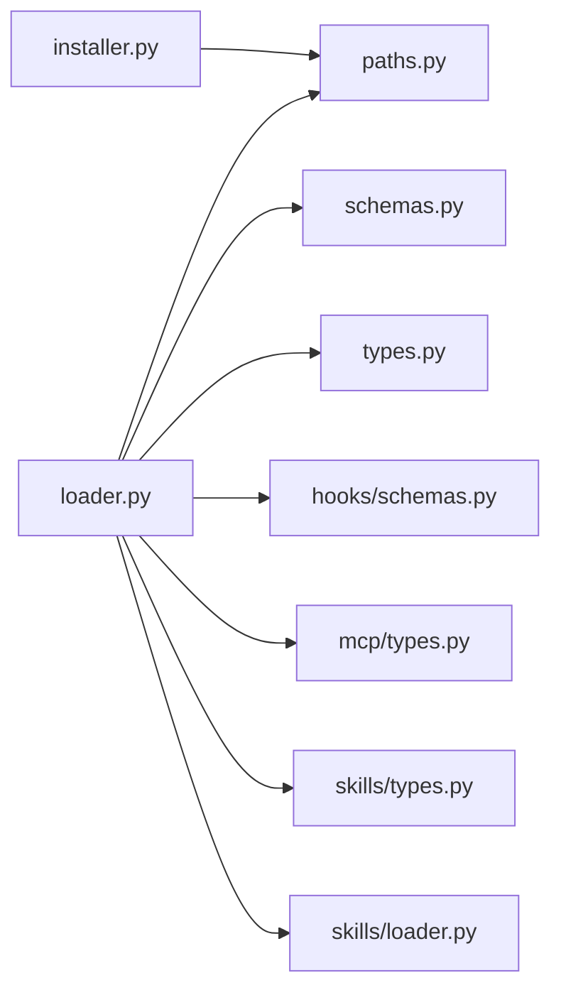

# 插件发现与加载

<cite>
**本文引用的文件**
- [src/openharness/plugins/__init__.py](file://src/openharness/plugins/__init__.py)
- [src/openharness/plugins/loader.py](file://src/openharness/plugins/loader.py)
- [src/openharness/plugins/schemas.py](file://src/openharness/plugins/schemas.py)
- [src/openharness/plugins/types.py](file://src/openharness/plugins/types.py)
- [src/openharness/plugins/installer.py](file://src/openharness/plugins/installer.py)
- [src/openharness/config/paths.py](file://src/openharness/config/paths.py)
- [src/openharness/config/settings.py](file://src/openharness/config/settings.py)
- [src/openharness/hooks/schemas.py](file://src/openharness/hooks/schemas.py)
- [src/openharness/mcp/types.py](file://src/openharness/mcp/types.py)
- [src/openharness/skills/types.py](file://src/openharness/skills/types.py)
- [src/openharness/skills/loader.py](file://src/openharness/skills/loader.py)
- [tests/test_plugins/test_loader.py](file://tests/test_plugins/test_loader.py)
- [tests/test_plugins/test_lifecycle_flow.py](file://tests/test_plugins/test_lifecycle_flow.py)
</cite>

## 目录
1. [引言](#引言)
2. [项目结构](#项目结构)
3. [核心组件](#核心组件)
4. [架构总览](#架构总览)
5. [详细组件分析](#详细组件分析)
6. [依赖分析](#依赖分析)
7. [性能考虑](#性能考虑)
8. [故障排除指南](#故障排除指南)
9. [结论](#结论)
10. [附录](#附录)

## 引言
本文件系统化阐述 OpenHarness 的插件发现与加载机制，覆盖以下主题：
- 插件目录结构与发现算法：用户级与项目级插件目录的查找规则、清单文件 plugin.json 的格式与作用
- 插件加载流程：从磁盘扫描到内存实例化的完整过程
- 依赖解析与版本兼容性：当前实现中的兼容性策略与建议
- 错误处理：加载失败时的行为与可诊断点
- 调试与故障排除：结合测试用例给出可操作的排查步骤

## 项目结构
OpenHarness 将插件系统置于 src/openharness/plugins 下，围绕“清单（plugin.json）+ 资源目录（skills/commands/agents/hooks/mcp）”组织插件内容；同时通过配置路径模块确定用户与项目级插件根目录。

图表来源
- [src/openharness/plugins/loader.py:1-195](file://src/openharness/plugins/loader.py#L1-L195)
- [src/openharness/plugins/schemas.py:1-24](file://src/openharness/plugins/schemas.py#L1-L24)
- [src/openharness/plugins/types.py:1-33](file://src/openharness/plugins/types.py#L1-L33)
- [src/openharness/plugins/installer.py:1-28](file://src/openharness/plugins/installer.py#L1-L28)
- [src/openharness/config/paths.py:1-117](file://src/openharness/config/paths.py#L1-L117)
- [src/openharness/config/settings.py:1-161](file://src/openharness/config/settings.py#L1-L161)
- [src/openharness/hooks/schemas.py:1-59](file://src/openharness/hooks/schemas.py#L1-L59)
- [src/openharness/mcp/types.py:1-77](file://src/openharness/mcp/types.py#L1-L77)
- [src/openharness/skills/types.py:1-17](file://src/openharness/skills/types.py#L1-L17)
- [src/openharness/skills/loader.py](file://src/openharness/skills/loader.py)

章节来源
- [src/openharness/plugins/__init__.py:1-54](file://src/openharness/plugins/__init__.py#L1-L54)
- [src/openharness/plugins/loader.py:1-195](file://src/openharness/plugins/loader.py#L1-L195)
- [src/openharness/config/paths.py:1-117](file://src/openharness/config/paths.py#L1-L117)

## 核心组件
- 插件清单模型：定义插件元数据、默认启用状态、资源目录与文件名等字段
- 运行时插件对象：封装已加载插件的清单、路径、启用状态及贡献的技能、钩子、MCP 服务器等
- 发现与加载器：负责定位插件目录、读取清单、解析技能/钩子/MCP 并构建运行时对象
- 安装器：将外部插件目录复制到用户级插件根目录，或删除用户级插件

章节来源
- [src/openharness/plugins/schemas.py:8-24](file://src/openharness/plugins/schemas.py#L8-L24)
- [src/openharness/plugins/types.py:14-33](file://src/openharness/plugins/types.py#L14-L33)
- [src/openharness/plugins/loader.py:40-106](file://src/openharness/plugins/loader.py#L40-L106)
- [src/openharness/plugins/installer.py:11-28](file://src/openharness/plugins/installer.py#L11-L28)

## 架构总览
下图展示插件发现与加载的整体流程：从配置路径解析出用户与项目插件根目录，扫描有效插件目录，读取清单并解析多类资源，最终生成 LoadedPlugin 列表供后续系统使用。

图表来源
- [src/openharness/plugins/loader.py:40-106](file://src/openharness/plugins/loader.py#L40-L106)
- [src/openharness/config/paths.py:15-29](file://src/openharness/config/paths.py#L15-L29)
- [src/openharness/config/settings.py:49-64](file://src/openharness/config/settings.py#L49-L64)

## 详细组件分析

### 插件目录结构与发现算法
- 用户级插件目录：位于用户配置目录下的 plugins 子目录，路径由配置模块解析
- 项目级插件目录：位于项目根目录的 .openharness/plugins 子目录
- 插件目录识别：在上述两个根目录下，仅当某个子目录包含清单文件（plugin.json 或 .claude-plugin/plugin.json）时，才视为有效插件目录
- 扫描顺序：先用户级后项目级；对每个根目录内的子目录进行遍历，过滤出包含有效清单的目录

图表来源
- [src/openharness/plugins/loader.py:40-50](file://src/openharness/plugins/loader.py#L40-L50)
- [src/openharness/config/paths.py:15-29](file://src/openharness/config/paths.py#L15-L29)

章节来源
- [src/openharness/plugins/loader.py:15-26](file://src/openharness/plugins/loader.py#L15-L26)
- [src/openharness/plugins/loader.py:29-37](file://src/openharness/plugins/loader.py#L29-L37)
- [src/openharness/plugins/loader.py:40-50](file://src/openharness/plugins/loader.py#L40-L50)

### plugin.json 清单文件格式与作用
- 必填字段：name
- 常用字段：version、description、enabled_by_default、skills_dir、hooks_file、mcp_file
- 扩展字段：author、commands、agents、skills、hooks 等（作为扩展用途）
- 作用：
  - 标识插件名称与默认启用状态
  - 指定技能、钩子、MCP 配置的相对路径
  - 作为插件有效性判定的关键依据

章节来源
- [src/openharness/plugins/schemas.py:8-24](file://src/openharness/plugins/schemas.py#L8-L24)

### 插件加载流程（磁盘到内存）
- 发现阶段：调用 discover_plugin_paths 获取候选插件目录
- 加载阶段：对每个候选目录执行 load_plugin
  - 定位清单文件（支持标准位置与 .claude-plugin 子目录）
  - 读取并验证清单（JSON 解析与 Pydantic 校验）
  - 计算启用状态：优先使用 settings.enabled_plugins 中的显式配置，否则回退到清单的 enabled_by_default
  - 技能发现：从 skills_dir 指向的目录加载 *.md 技能文件；若存在 commands/ 与 agents/ 目录，也一并合并
  - 钩子发现：优先读取 manifest.hooks_file 指向的 hooks.json；若存在 hooks/ 目录下的 hooks.json，则采用结构化格式解析（含变量替换）
  - MCP 发现：优先读取 manifest.mcp_file 指向的 mcp.json；若存在同名隐藏文件 .mcp.json，也支持
  - 构建 LoadedPlugin：包含清单、路径、启用状态、技能、钩子、MCP 服务器与命令集合（命令来源于技能中标识为“来自插件”的条目）

图表来源
- [src/openharness/plugins/loader.py:63-106](file://src/openharness/plugins/loader.py#L63-L106)
- [src/openharness/plugins/loader.py:109-125](file://src/openharness/plugins/loader.py#L109-L125)
- [src/openharness/plugins/loader.py:128-152](file://src/openharness/plugins/loader.py#L128-L152)
- [src/openharness/plugins/loader.py:155-184](file://src/openharness/plugins/loader.py#L155-L184)
- [src/openharness/plugins/loader.py:187-194](file://src/openharness/plugins/loader.py#L187-L194)

章节来源
- [src/openharness/plugins/loader.py:53-106](file://src/openharness/plugins/loader.py#L53-L106)

### 依赖解析与版本兼容性
- 当前实现要点
  - 插件启用状态：优先使用 settings.enabled_plugins 显式配置；否则回退到清单的 enabled_by_default
  - 清单字段兼容：未在清单中声明的字段不会导致加载失败，但也不会被系统使用
  - 资源目录兼容：skills_dir、hooks_file、mcp_file 可自定义，默认值来自清单模型
- 版本兼容性建议
  - 在插件清单中维护 version 字段，便于上层系统进行兼容性判断与提示
  - 若未来引入更强的版本约束，可在加载器中增加对清单版本字段的校验逻辑

章节来源
- [src/openharness/plugins/loader.py:72-72](file://src/openharness/plugins/loader.py#L72-L72)
- [src/openharness/plugins/schemas.py:11-17](file://src/openharness/plugins/schemas.py#L11-L17)

### 错误处理机制
- 清单缺失：若候选目录不存在清单文件，则跳过该目录
- 清单解析失败：JSON 解析异常或 Pydantic 校验失败时，返回空结果以避免污染后续流程
- 资源目录不存在：技能/钩子/MCP 目录不存在时，按需跳过对应资源
- 安装/卸载失败：安装时若目标已存在则先删除再复制；卸载时若目录不存在则返回 False

章节来源
- [src/openharness/plugins/loader.py:66-71](file://src/openharness/plugins/loader.py#L66-L71)
- [src/openharness/plugins/loader.py:109-111](file://src/openharness/plugins/loader.py#L109-L111)
- [src/openharness/plugins/installer.py:15-17](file://src/openharness/plugins/installer.py#L15-L17)
- [src/openharness/plugins/installer.py:24-27](file://src/openharness/plugins/installer.py#L24-L27)

### 插件生命周期与集成测试
- 安装：install_plugin_from_path 将外部插件目录复制到用户级插件根目录
- 加载：load_plugins 会发现并加载插件，合并其贡献的技能、钩子与 MCP 服务器
- 卸载：uninstall_plugin 删除用户级插件目录，重新加载后应不再出现
- 测试验证：集成测试覆盖了安装、加载、连接 MCP、执行工具与卸载的完整流程

章节来源
- [tests/test_plugins/test_lifecycle_flow.py:54-94](file://tests/test_plugins/test_lifecycle_flow.py#L54-L94)
- [src/openharness/plugins/installer.py:11-28](file://src/openharness/plugins/installer.py#L11-L28)
- [src/openharness/plugins/loader.py:53-60](file://src/openharness/plugins/loader.py#L53-L60)

## 依赖分析
- 插件子系统内部耦合度低，职责清晰：loader 负责发现与装配，schemas/types 提供数据契约，installer 提供文件层面的操作
- 外部依赖
  - 配置路径模块：提供用户与项目级根目录
  - 钩子模型：用于解析 hooks.json
  - MCP 类型：用于解析 mcp.json
  - 技能类型：用于承载技能内容
  - 技能解析函数：从 Markdown 内容提取技能元信息

图表来源
- [src/openharness/plugins/loader.py:1-13](file://src/openharness/plugins/loader.py#L1-L13)
- [src/openharness/plugins/installer.py:1-9](file://src/openharness/plugins/installer.py#L1-L9)
- [src/openharness/config/paths.py:1-117](file://src/openharness/config/paths.py#L1-L117)
- [src/openharness/hooks/schemas.py:1-59](file://src/openharness/hooks/schemas.py#L1-L59)
- [src/openharness/mcp/types.py:1-77](file://src/openharness/mcp/types.py#L1-L77)
- [src/openharness/skills/types.py:1-17](file://src/openharness/skills/types.py#L1-L17)
- [src/openharness/skills/loader.py](file://src/openharness/skills/loader.py)

章节来源
- [src/openharness/plugins/loader.py:1-13](file://src/openharness/plugins/loader.py#L1-L13)
- [src/openharness/plugins/installer.py:1-9](file://src/openharness/plugins/installer.py#L1-L9)

## 性能考虑
- 目录扫描：仅在用户与项目插件根目录下进行浅层遍历，复杂度近似 O(N)，N 为候选插件数量
- 文件读取：清单与资源文件按需读取，避免不必要的 IO
- 缓存建议：在高频场景下可对已加载的插件进行缓存，减少重复解析成本
- 并发优化：若需要大规模并发加载，可在上层引入异步/并发策略，但需注意文件系统与锁竞争

## 故障排除指南
- 插件未被发现
  - 检查插件目录是否包含清单文件（plugin.json 或 .claude-plugin/plugin.json）
  - 确认插件目录位于用户或项目插件根目录下
  - 使用测试用例风格的最小化插件结构进行对比
- 清单解析失败
  - 确认清单 JSON 语法正确
  - 确保必填字段齐全，字段类型符合预期
- 技能未加载
  - 检查 skills_dir 指向的目录是否存在
  - 确认技能文件为 *.md 且内容可被解析
- 钩子未生效
  - 确认 hooks.json 或 hooks/hooks.json 存在且格式正确
  - 若使用结构化 hooks.json，确认变量替换逻辑满足预期
- MCP 未连接
  - 确认 mcp.json 或 .mcp.json 存在且格式正确
  - 检查 MCP 服务可访问性与认证配置
- 安装/卸载异常
  - 安装前目标目录可能被清理
  - 卸载后需重新加载以刷新插件列表

章节来源
- [tests/test_plugins/test_loader.py:14-51](file://tests/test_plugins/test_loader.py#L14-L51)
- [tests/test_plugins/test_loader.py:53-83](file://tests/test_plugins/test_loader.py#L53-L83)
- [tests/test_plugins/test_lifecycle_flow.py:20-51](file://tests/test_plugins/test_lifecycle_flow.py#L20-L51)

## 结论
OpenHarness 的插件系统以清单驱动、目录约定为核心，实现了清晰的发现与加载流程。通过用户级与项目级插件根目录的双轨设计，兼顾了通用性与项目定制性。当前实现强调易用性与兼容性，未来可在版本约束、依赖声明与更细粒度的错误反馈方面进一步增强。

## 附录

### 配置文件模板与示例
- settings.json（部分关键字段）
  - enabled_plugins：键为插件名，值为布尔，用于显式控制启用状态
  - 其他字段参见设置模型定义

章节来源
- [src/openharness/config/settings.py:49-64](file://src/openharness/config/settings.py#L49-L64)

### 插件清单字段参考
- name：插件名称（必填）
- version：版本号
- description：描述
- enabled_by_default：默认启用状态
- skills_dir：技能目录名
- hooks_file：钩子文件名
- mcp_file：MCP 配置文件名
- 扩展字段：author、commands、agents、skills、hooks 等

章节来源
- [src/openharness/plugins/schemas.py:8-24](file://src/openharness/plugins/schemas.py#L8-L24)

### 关键 API 一览
- 发现与加载
  - get_user_plugins_dir：获取用户插件根目录
  - get_project_plugins_dir：获取项目插件根目录
  - discover_plugin_paths：发现插件目录
  - load_plugins：加载插件
  - load_plugin：加载单个插件
- 安装与卸载
  - install_plugin_from_path：从本地路径安装插件
  - uninstall_plugin：卸载用户插件

章节来源
- [src/openharness/plugins/__init__.py:11-20](file://src/openharness/plugins/__init__.py#L11-L20)
- [src/openharness/plugins/loader.py:15-19](file://src/openharness/plugins/loader.py#L15-L19)
- [src/openharness/plugins/loader.py:22-26](file://src/openharness/plugins/loader.py#L22-L26)
- [src/openharness/plugins/loader.py:40-60](file://src/openharness/plugins/loader.py#L40-L60)
- [src/openharness/plugins/installer.py:11-28](file://src/openharness/plugins/installer.py#L11-L28)