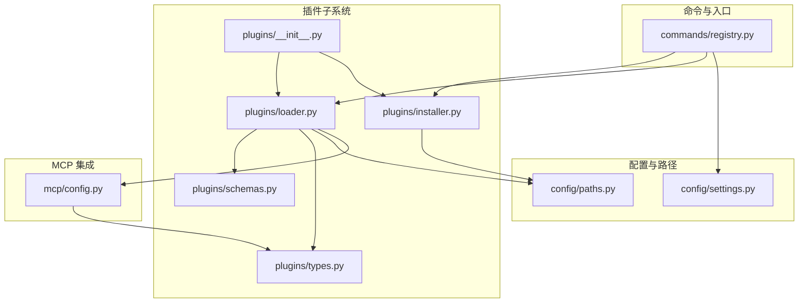
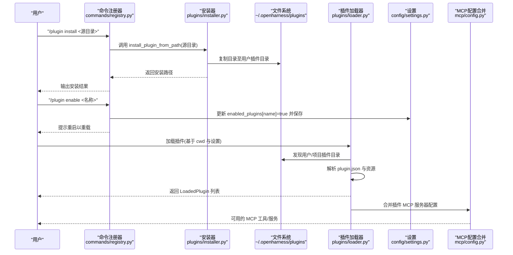
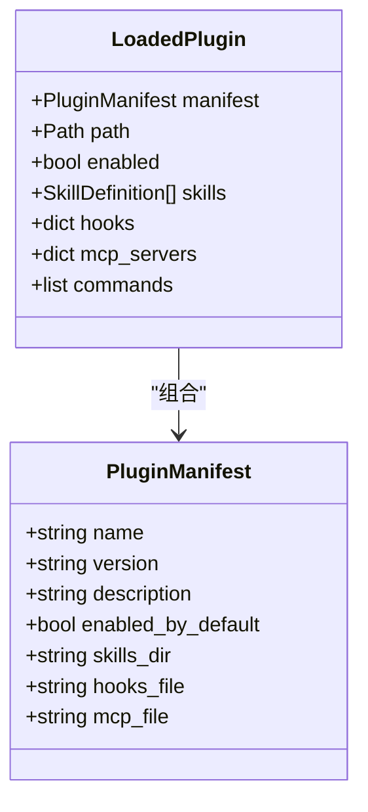
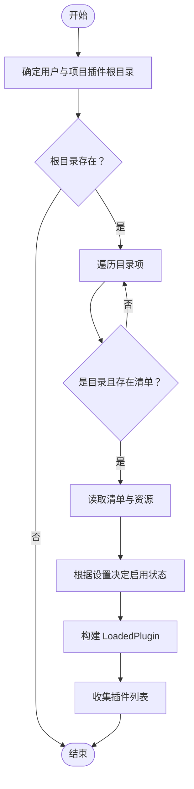
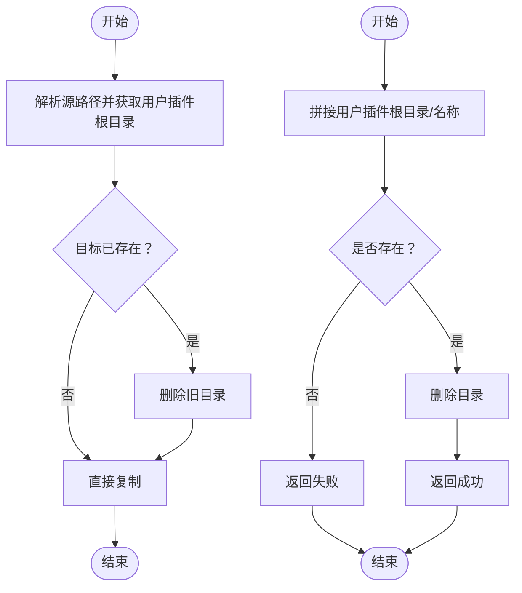
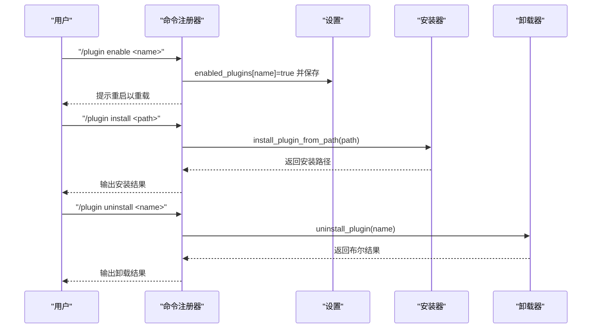
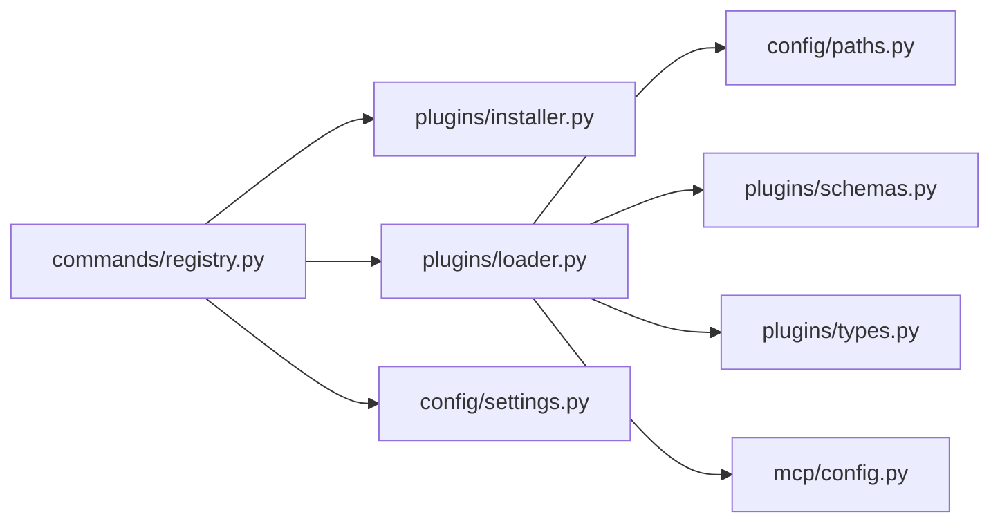

# 插件安装与管理

<cite>
**本文引用的文件**
- [src/openharness/plugins/__init__.py](file://src/openharness/plugins/__init__.py)
- [src/openharness/plugins/installer.py](file://src/openharness/plugins/installer.py)
- [src/openharness/plugins/loader.py](file://src/openharness/plugins/loader.py)
- [src/openharness/plugins/schemas.py](file://src/openharness/plugins/schemas.py)
- [src/openharness/plugins/types.py](file://src/openharness/plugins/types.py)
- [src/openharness/config/settings.py](file://src/openharness/config/settings.py)
- [src/openharness/config/paths.py](file://src/openharness/config/paths.py)
- [src/openharness/commands/registry.py](file://src/openharness/commands/registry.py)
- [src/openharness/mcp/config.py](file://src/openharness/mcp/config.py)
- [tests/test_plugins/test_loader.py](file://tests/test_plugins/test_loader.py)
- [tests/test_plugins/test_lifecycle_flow.py](file://tests/test_plugins/test_lifecycle_flow.py)
- [tests/test_commands/test_command_flows.py](file://tests/test_commands/test_command_flows.py)
- [README.md](file://README.md)
</cite>

## 目录
1. [简介](#简介)
2. [项目结构](#项目结构)
3. [核心组件](#核心组件)
4. [架构总览](#架构总览)
5. [详细组件分析](#详细组件分析)
6. [依赖分析](#依赖分析)
7. [性能考虑](#性能考虑)
8. [故障排查指南](#故障排查指南)
9. [结论](#结论)
10. [附录](#附录)

## 简介
本指南面向使用者与维护者，系统讲解 OpenHarness 的插件安装、启用/禁用、加载、卸载与更新流程，覆盖配置文件中的插件管理、版本与兼容性检查、最佳实践与安全建议，并提供常见问题与解决方案。读者可据此完成从安装到日常管理的全流程操作。

## 项目结构
OpenHarness 将插件能力集中在 plugins 子系统中，配合配置系统与命令系统实现“发现—加载—启用/禁用—运行”的闭环；同时 MCP 配置与工具注册器共同支持插件贡献的 MCP 服务与技能工具。

图表来源
- [src/openharness/plugins/__init__.py:11-20](file://src/openharness/plugins/__init__.py#L11-L20)
- [src/openharness/plugins/loader.py:15-26](file://src/openharness/plugins/loader.py#L15-L26)
- [src/openharness/plugins/installer.py:11-18](file://src/openharness/plugins/installer.py#L11-L18)
- [src/openharness/config/paths.py:15-34](file://src/openharness/config/paths.py#L15-L34)
- [src/openharness/config/settings.py:49-64](file://src/openharness/config/settings.py#L49-L64)
- [src/openharness/commands/registry.py:900-922](file://src/openharness/commands/registry.py#L900-L922)
- [src/openharness/mcp/config.py:8-16](file://src/openharness/mcp/config.py#L8-L16)

章节来源
- [src/openharness/plugins/__init__.py:11-20](file://src/openharness/plugins/__init__.py#L11-L20)
- [src/openharness/plugins/loader.py:15-26](file://src/openharness/plugins/loader.py#L15-L26)
- [src/openharness/plugins/installer.py:11-18](file://src/openharness/plugins/installer.py#L11-L18)
- [src/openharness/config/paths.py:15-34](file://src/openharness/config/paths.py#L15-L34)
- [src/openharness/config/settings.py:49-64](file://src/openharness/config/settings.py#L49-L64)
- [src/openharness/commands/registry.py:900-922](file://src/openharness/commands/registry.py#L900-L922)
- [src/openharness/mcp/config.py:8-16](file://src/openharness/mcp/config.py#L8-L16)

## 核心组件
- 插件清单模型：定义插件元数据与默认行为（名称、版本、是否默认启用、资源目录等）。
- 已加载插件类型：封装清单、路径、启用状态及贡献的技能、钩子、MCP 服务器等。
- 插件发现与加载：扫描用户与项目插件目录，解析清单与资源，构建 LoadedPlugin。
- 安装与卸载：将插件目录复制到用户插件目录或删除，支持通过命令行进行安装/卸载。
- 命令行插件管理：提供 list、enable、disable、install、uninstall 子命令。
- 设置与持久化：通过 settings.json 管理 enabled_plugins 字典，重启后生效。
- MCP 配置合并：将设置与插件贡献的 MCP 服务器配置合并，命名空间避免冲突。

章节来源
- [src/openharness/plugins/schemas.py:8-24](file://src/openharness/plugins/schemas.py#L8-L24)
- [src/openharness/plugins/types.py:14-33](file://src/openharness/plugins/types.py#L14-L33)
- [src/openharness/plugins/loader.py:40-60](file://src/openharness/plugins/loader.py#L40-L60)
- [src/openharness/plugins/installer.py:11-27](file://src/openharness/plugins/installer.py#L11-L27)
- [src/openharness/commands/registry.py:900-922](file://src/openharness/commands/registry.py#L900-L922)
- [src/openharness/config/settings.py:49-64](file://src/openharness/config/settings.py#L49-L64)
- [src/openharness/mcp/config.py:8-16](file://src/openharness/mcp/config.py#L8-L16)

## 架构总览
下图展示插件从安装到运行的关键交互：命令入口触发安装/卸载，随后在会话加载阶段按设置决定启用与否，最终将插件贡献的 MCP 服务与技能工具纳入系统。

图表来源
- [src/openharness/commands/registry.py:900-922](file://src/openharness/commands/registry.py#L900-L922)
- [src/openharness/plugins/installer.py:11-18](file://src/openharness/plugins/installer.py#L11-L18)
- [src/openharness/plugins/loader.py:40-60](file://src/openharness/plugins/loader.py#L40-L60)
- [src/openharness/config/settings.py:49-64](file://src/openharness/config/settings.py#L49-L64)
- [src/openharness/mcp/config.py:8-16](file://src/openharness/mcp/config.py#L8-L16)

## 详细组件分析

### 插件清单与类型
- 清单字段：包含名称、版本、描述、默认启用开关、资源目录名等；支持扩展字段。
- 已加载插件：封装清单、路径、启用状态、技能、钩子、MCP 服务器与命令集合。

图表来源
- [src/openharness/plugins/schemas.py:8-24](file://src/openharness/plugins/schemas.py#L8-L24)
- [src/openharness/plugins/types.py:14-33](file://src/openharness/plugins/types.py#L14-L33)

章节来源
- [src/openharness/plugins/schemas.py:8-24](file://src/openharness/plugins/schemas.py#L8-L24)
- [src/openharness/plugins/types.py:14-33](file://src/openharness/plugins/types.py#L14-L33)

### 插件发现与加载
- 用户插件目录：位于配置根目录下的 plugins 子目录，不存在则创建。
- 项目插件目录：位于工作目录的 .openharness/plugins 子目录，不存在则创建。
- 发现规则：遍历两个根目录，仅当存在标准或隐藏清单路径时视为有效插件。
- 加载逻辑：解析清单、读取技能、钩子与 MCP 配置，结合设置决定启用状态。

图表来源
- [src/openharness/plugins/loader.py:15-26](file://src/openharness/plugins/loader.py#L15-L26)
- [src/openharness/plugins/loader.py:40-60](file://src/openharness/plugins/loader.py#L40-L60)
- [src/openharness/plugins/loader.py:63-106](file://src/openharness/plugins/loader.py#L63-L106)

章节来源
- [src/openharness/plugins/loader.py:15-26](file://src/openharness/plugins/loader.py#L15-L26)
- [src/openharness/plugins/loader.py:40-60](file://src/openharness/plugins/loader.py#L40-L60)
- [src/openharness/plugins/loader.py:63-106](file://src/openharness/plugins/loader.py#L63-L106)

### 安装与卸载
- 安装：将源插件目录复制到用户插件根目录，若目标已存在则先删除再复制。
- 卸载：按名称定位用户插件目录并删除，返回是否成功。

图表来源
- [src/openharness/plugins/installer.py:11-18](file://src/openharness/plugins/installer.py#L11-L18)
- [src/openharness/plugins/installer.py:21-27](file://src/openharness/plugins/installer.py#L21-L27)

章节来源
- [src/openharness/plugins/installer.py:11-18](file://src/openharness/plugins/installer.py#L11-L18)
- [src/openharness/plugins/installer.py:21-27](file://src/openharness/plugins/installer.py#L21-L27)

### 命令行插件管理
- 支持子命令：list、enable、disable、install、uninstall。
- enable/disable：写入 settings.json 中的 enabled_plugins 字典并保存。
- install/uninstall：调用安装器与卸载器执行文件系统操作。
- 使用提示：未带参数时输出当前插件摘要；错误时输出使用说明。

图表来源
- [src/openharness/commands/registry.py:900-922](file://src/openharness/commands/registry.py#L900-L922)

章节来源
- [src/openharness/commands/registry.py:900-922](file://src/openharness/commands/registry.py#L900-L922)

### 配置文件中的插件管理
- settings.json 中的 enabled_plugins 字典用于控制插件启用状态。
- 加载插件时，若未显式配置，则采用清单中的默认启用值。
- 修改后需重启会话以重新加载插件。

章节来源
- [src/openharness/config/settings.py:49-64](file://src/openharness/config/settings.py#L49-L64)
- [src/openharness/plugins/loader.py:63-72](file://src/openharness/plugins/loader.py#L63-L72)

### 版本管理与兼容性检查
- 清单包含 version 字段，便于识别插件版本。
- 当前加载逻辑未内置版本兼容性校验；如需严格兼容，可在业务层扩展校验策略（例如在加载前比对最小/最大兼容版本）。

章节来源
- [src/openharness/plugins/schemas.py:11-12](file://src/openharness/plugins/schemas.py#L11-L12)

### 卸载与更新流程
- 卸载：通过命令卸载指定名称的插件，确保其不再被发现与加载。
- 更新：推荐先卸载旧版本，再安装新版本；或在安装时覆盖同名目录以达到更新目的。

章节来源
- [src/openharness/plugins/installer.py:21-27](file://src/openharness/plugins/installer.py#L21-L27)
- [src/openharness/commands/registry.py:912-918](file://src/openharness/commands/registry.py#L912-L918)

### MCP 与插件集成
- 插件可提供 MCP 服务器配置；加载器支持从清单或隐藏配置文件读取。
- 系统将设置与插件 MCP 配置合并，命名空间避免冲突，供工具注册器使用。

章节来源
- [src/openharness/plugins/loader.py:93-96](file://src/openharness/plugins/loader.py#L93-L96)
- [src/openharness/mcp/config.py:8-16](file://src/openharness/mcp/config.py#L8-L16)

## 依赖分析
- 插件子系统依赖配置路径解析与设置模型。
- 命令注册器依赖安装器与加载器，并与设置持久化协作。
- MCP 配置合并依赖 LoadedPlugin 的 MCP 服务器字典。

图表来源
- [src/openharness/commands/registry.py:900-922](file://src/openharness/commands/registry.py#L900-L922)
- [src/openharness/plugins/installer.py:11-18](file://src/openharness/plugins/installer.py#L11-L18)
- [src/openharness/plugins/loader.py:15-26](file://src/openharness/plugins/loader.py#L15-L26)
- [src/openharness/config/settings.py:49-64](file://src/openharness/config/settings.py#L49-L64)
- [src/openharness/mcp/config.py:8-16](file://src/openharness/mcp/config.py#L8-L16)

章节来源
- [src/openharness/commands/registry.py:900-922](file://src/openharness/commands/registry.py#L900-L922)
- [src/openharness/plugins/loader.py:15-26](file://src/openharness/plugins/loader.py#L15-L26)
- [src/openharness/plugins/installer.py:11-18](file://src/openharness/plugins/installer.py#L11-L18)
- [src/openharness/config/settings.py:49-64](file://src/openharness/config/settings.py#L49-L64)
- [src/openharness/mcp/config.py:8-16](file://src/openharness/mcp/config.py#L8-L16)

## 性能考虑
- 插件发现与加载在会话启动时执行，建议控制插件数量与资源规模，避免过多大文件导致加载时间增加。
- 技能与钩子的解析为一次性操作，通常开销较小；但应避免在 hooks 中执行耗时任务。
- MCP 服务器连接延迟与并发请求数量会影响整体响应，建议合理配置 MCP 服务器数量与超时参数。

## 故障排查指南
- 插件未被发现
  - 检查清单文件是否存在（标准或隐藏位置），确认清单字段完整。
  - 确认插件目录位于用户或项目插件根目录。
- 插件已发现但未启用
  - 检查 settings.json 中 enabled_plugins 是否包含该插件名称；修改后需重启会话。
- 安装/卸载失败
  - 确认源路径正确且具有读权限；目标目录写权限正常。
  - 卸载前确认插件名称与实际一致。
- MCP 服务不可用
  - 检查插件提供的 MCP 配置是否正确；确认合并后的命名空间未冲突。
- 测试参考
  - 插件生命周期端到端测试展示了安装、加载、MCP 连接与卸载的完整流程。
  - 命令流测试验证了 enable/disable/install/uninstall 的行为与设置持久化。

章节来源
- [tests/test_plugins/test_lifecycle_flow.py:54-94](file://tests/test_plugins/test_lifecycle_flow.py#L54-L94)
- [tests/test_commands/test_command_flows.py:131-152](file://tests/test_commands/test_command_flows.py#L131-L152)

## 结论
OpenHarness 的插件体系以清单驱动、目录约定与设置持久化为核心，提供清晰的安装、启用/禁用、加载与卸载流程。通过命令行即可完成全生命周期管理；结合 settings.json 与 MCP 配置，可灵活扩展技能与外部服务。建议在生产环境中遵循最佳实践与安全建议，确保插件来源可信、版本可控、权限明确。

## 附录

### 快速操作清单
- 查看插件：/plugin list
- 启用插件：/plugin enable <名称>
- 禁用插件：/plugin disable <名称>
- 安装插件：/plugin install <本地源目录>
- 卸载插件：/plugin uninstall <名称>

章节来源
- [src/openharness/commands/registry.py:900-922](file://src/openharness/commands/registry.py#L900-L922)
- [README.md:226-231](file://README.md#L226-L231)

### 最佳实践与安全建议
- 来源可信：仅安装来自可信来源的插件，避免执行不受信任脚本。
- 权限最小化：通过权限模式与路径规则限制插件的文件与命令访问范围。
- 版本管理：在 settings.json 中记录插件版本，升级前做好备份与回归测试。
- 资源隔离：将插件目录置于独立磁盘分区，防止过度占用与误删。
- 日志审计：关注插件钩子与 MCP 交互日志，及时发现异常行为。

### 兼容性与版本检查建议
- 在加载前增加版本兼容性校验（如最小/最大版本），并在 settings.json 中记录当前使用的插件版本。
- 对于 MCP 服务器，建议在插件清单中声明兼容的 MCP 规范版本。