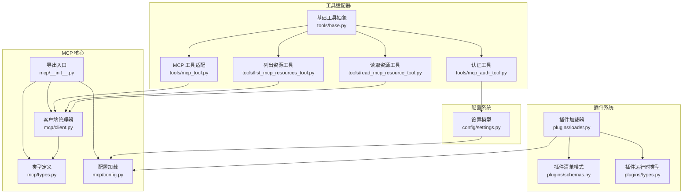
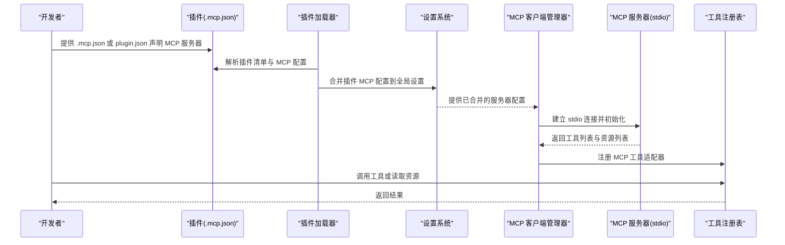
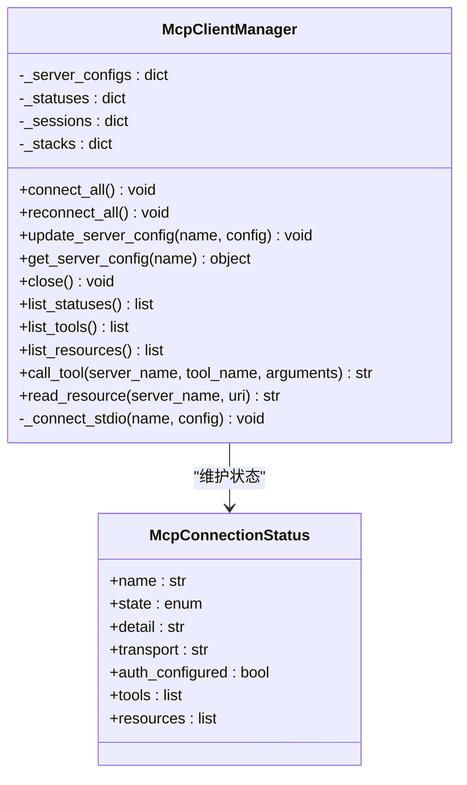
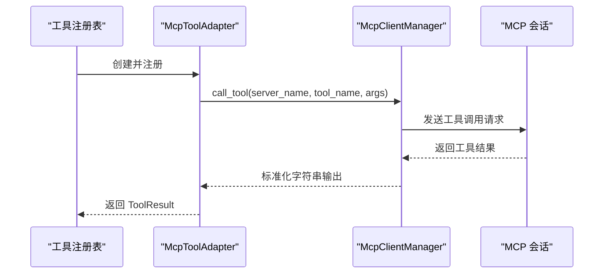
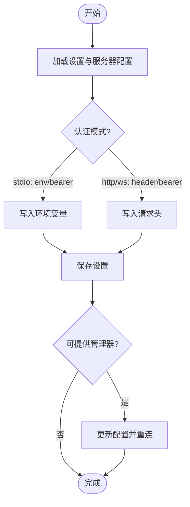
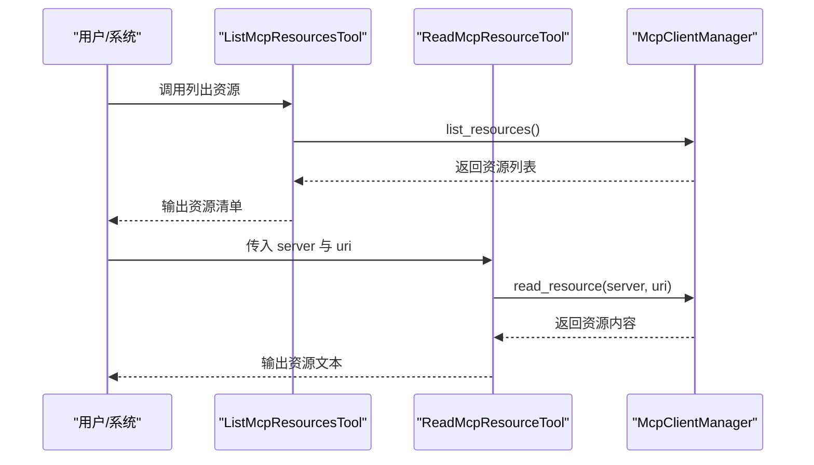
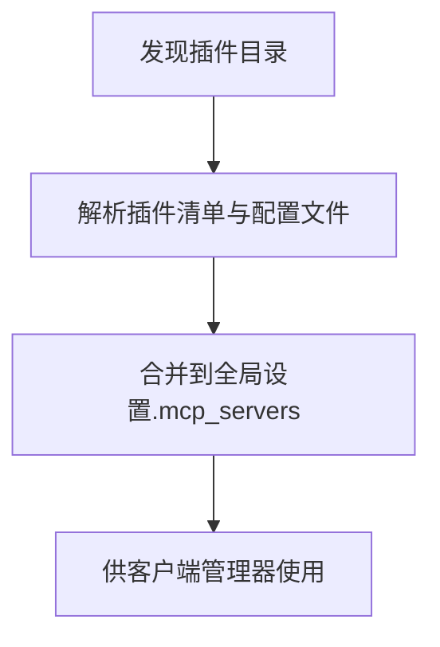
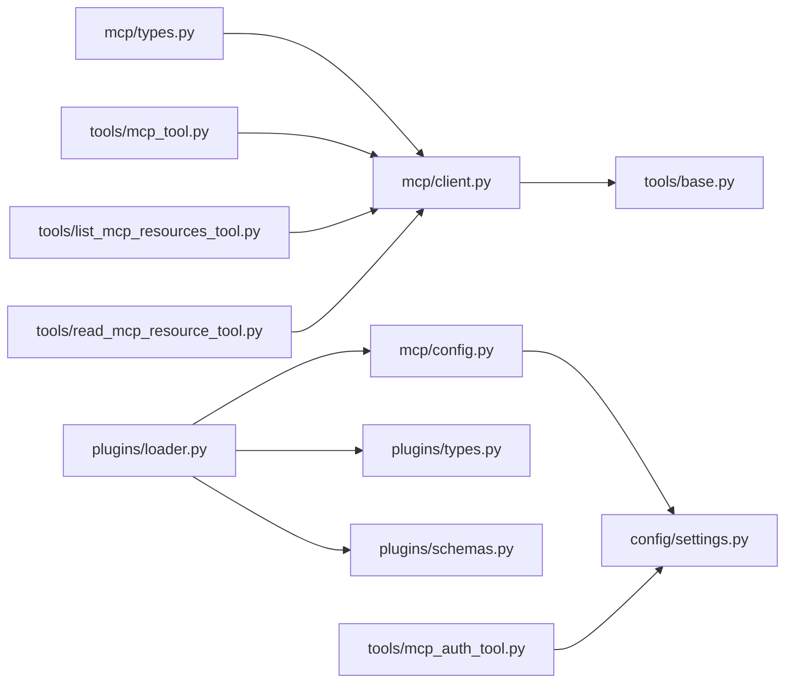

# MCP 服务器插件开发

<cite>
**本文档引用的文件**
- [mcp/__init__.py](file://src/openharness/mcp/__init__.py)
- [mcp/client.py](file://src/openharness/mcp/client.py)
- [mcp/config.py](file://src/openharness/mcp/config.py)
- [mcp/types.py](file://src/openharness/mcp/types.py)
- [tools/mcp_tool.py](file://src/openharness/tools/mcp_tool.py)
- [tools/mcp_auth_tool.py](file://src/openharness/tools/mcp_auth_tool.py)
- [tools/list_mcp_resources_tool.py](file://src/openharness/tools/list_mcp_resources_tool.py)
- [tools/read_mcp_resource_tool.py](file://src/openharness/tools/read_mcp_resource_tool.py)
- [plugins/loader.py](file://src/openharness/plugins/loader.py)
- [plugins/schemas.py](file://src/openharness/plugins/schemas.py)
- [plugins/types.py](file://src/openharness/plugins/types.py)
- [config/settings.py](file://src/openharness/config/settings.py)
- [tools/base.py](file://src/openharness/tools/base.py)
- [tests/fixtures/fake_mcp_server.py](file://tests/fixtures/fake_mcp_server.py)
- [tests/test_mcp/test_integration.py](file://tests/test_mcp/test_integration.py)
</cite>

## 目录
1. [简介](#简介)
2. [项目结构](#项目结构)
3. [核心组件](#核心组件)
4. [架构总览](#架构总览)
5. [详细组件分析](#详细组件分析)
6. [依赖关系分析](#依赖关系分析)
7. [性能考虑](#性能考虑)
8. [故障排除指南](#故障排除指南)
9. [结论](#结论)
10. [附录](#附录)

## 简介
本指南面向希望在 OpenHarness 中开发和集成 MCP（Model Context Protocol）服务器插件的开发者。文档从协议与架构入手，系统讲解 MCP 配置、连接管理、工具封装与调用、认证与授权、资源发现与访问，并提供部署与测试流程、实际开发示例与最佳实践，以及与主系统的集成方式。

## 项目结构
OpenHarness 将 MCP 相关能力集中在 `src/openharness/mcp` 子模块中，配合工具层适配器、插件加载器与配置系统，形成“配置 → 连接 → 工具/资源暴露 → 主系统集成”的完整链路。

**图表来源**
- [mcp/__init__.py:1-75](file://src/openharness/mcp/__init__.py#L1-L75)
- [mcp/client.py:1-175](file://src/openharness/mcp/client.py#L1-L175)
- [mcp/types.py:1-77](file://src/openharness/mcp/types.py#L1-L77)
- [mcp/config.py:1-17](file://src/openharness/mcp/config.py#L1-L17)
- [tools/mcp_tool.py:1-56](file://src/openharness/tools/mcp_tool.py#L1-L56)
- [tools/list_mcp_resources_tool.py:1-37](file://src/openharness/tools/list_mcp_resources_tool.py#L1-L37)
- [tools/read_mcp_resource_tool.py:1-36](file://src/openharness/tools/read_mcp_resource_tool.py#L1-L36)
- [tools/mcp_auth_tool.py:1-72](file://src/openharness/tools/mcp_auth_tool.py#L1-L72)
- [tools/base.py:1-76](file://src/openharness/tools/base.py#L1-L76)
- [plugins/loader.py:1-195](file://src/openharness/plugins/loader.py#L1-L195)
- [plugins/schemas.py:1-24](file://src/openharness/plugins/schemas.py#L1-L24)
- [plugins/types.py:1-33](file://src/openharness/plugins/types.py#L1-L33)
- [config/settings.py:1-161](file://src/openharness/config/settings.py#L1-L161)

**章节来源**
- [mcp/__init__.py:1-75](file://src/openharness/mcp/__init__.py#L1-L75)
- [mcp/client.py:1-175](file://src/openharness/mcp/client.py#L1-L175)
- [mcp/types.py:1-77](file://src/openharness/mcp/types.py#L1-L77)
- [mcp/config.py:1-17](file://src/openharness/mcp/config.py#L1-L17)
- [tools/base.py:1-76](file://src/openharness/tools/base.py#L1-L76)
- [plugins/loader.py:1-195](file://src/openharness/plugins/loader.py#L1-L195)
- [plugins/schemas.py:1-24](file://src/openharness/plugins/schemas.py#L1-L24)
- [plugins/types.py:1-33](file://src/openharness/plugins/types.py#L1-L33)
- [config/settings.py:1-161](file://src/openharness/config/settings.py#L1-L161)

## 核心组件
- 类型与配置：定义 MCP 服务器配置（stdio/http/ws）、JSON 配置格式、工具与资源元数据、连接状态等。
- 客户端管理器：负责连接 MCP 服务器、维护会话、列举工具与资源、执行工具调用与资源读取。
- 工具适配器：将 MCP 工具包装为主系统可用的工具，自动根据输入模式生成输入模型。
- 认证工具：支持为不同传输类型的 MCP 服务器持久化认证信息并尝试重连。
- 资源工具：提供列出与读取 MCP 资源的能力。
- 插件加载器：从插件目录加载 .mcp.json 或 plugin.json 中声明的 MCP 服务器配置。
- 设置系统：集中管理 MCP 服务器配置项，支持保存与加载。

**章节来源**
- [mcp/types.py:11-77](file://src/openharness/mcp/types.py#L11-L77)
- [mcp/client.py:20-175](file://src/openharness/mcp/client.py#L20-L175)
- [tools/mcp_tool.py:14-56](file://src/openharness/tools/mcp_tool.py#L14-L56)
- [tools/mcp_auth_tool.py:21-72](file://src/openharness/tools/mcp_auth_tool.py#L21-L72)
- [tools/list_mcp_resources_tool.py:15-37](file://src/openharness/tools/list_mcp_resources_tool.py#L15-L37)
- [tools/read_mcp_resource_tool.py:18-36](file://src/openharness/tools/read_mcp_resource_tool.py#L18-L36)
- [plugins/loader.py:93-195](file://src/openharness/plugins/loader.py#L93-L195)
- [config/settings.py:49-64](file://src/openharness/config/settings.py#L49-L64)

## 架构总览
下图展示了 MCP 服务器插件从配置到工具/资源使用的整体流程，以及与主系统的集成点。

**图表来源**
- [plugins/loader.py:93-195](file://src/openharness/plugins/loader.py#L93-L195)
- [mcp/config.py:8-17](file://src/openharness/mcp/config.py#L8-L17)
- [mcp/client.py:36-175](file://src/openharness/mcp/client.py#L36-L175)
- [tools/mcp_tool.py:14-34](file://src/openharness/tools/mcp_tool.py#L14-L34)
- [tools/list_mcp_resources_tool.py:15-37](file://src/openharness/tools/list_mcp_resources_tool.py#L15-L37)
- [tools/read_mcp_resource_tool.py:18-36](file://src/openharness/tools/read_mcp_resource_tool.py#L18-L36)

## 详细组件分析

### MCP 客户端管理器（McpClientManager）
职责与行为
- 维护服务器配置字典与连接状态映射。
- 支持连接所有服务器、重连、关闭、查询状态、列举工具与资源。
- 通过 stdio 连接 MCP 服务器，初始化会话后拉取工具与资源清单，填充状态。
- 提供工具调用与资源读取的统一接口，将结果标准化为字符串输出。

**图表来源**
- [mcp/client.py:20-175](file://src/openharness/mcp/client.py#L20-L175)
- [mcp/types.py:66-77](file://src/openharness/mcp/types.py#L66-L77)

**章节来源**
- [mcp/client.py:20-175](file://src/openharness/mcp/client.py#L20-L175)
- [mcp/types.py:66-77](file://src/openharness/mcp/types.py#L66-L77)

### MCP 工具适配器（McpToolAdapter）
职责与行为
- 将单个 MCP 工具包装为主系统工具，自动生成输入模型（基于 JSON Schema），保证参数校验与 API 兼容。
- 执行时将参数序列化为 JSON 并调用客户端管理器的工具调用接口，返回标准化结果。

**图表来源**
- [tools/mcp_tool.py:14-34](file://src/openharness/tools/mcp_tool.py#L14-L34)
- [mcp/client.py:92-106](file://src/openharness/mcp/client.py#L92-L106)

**章节来源**
- [tools/mcp_tool.py:14-56](file://src/openharness/tools/mcp_tool.py#L14-L56)
- [mcp/client.py:92-106](file://src/openharness/mcp/client.py#L92-L106)

### MCP 认证与授权工具（McpAuthTool）
职责与行为
- 支持三种认证模式：bearer、header、env；根据服务器类型（stdio/http/ws）选择合适的注入方式。
- 持久化更新设置中的认证配置，并尝试更新内存配置与重连所有服务器。
- 对不支持的服务器类型或模式进行错误提示。

**图表来源**
- [tools/mcp_auth_tool.py:28-72](file://src/openharness/tools/mcp_auth_tool.py#L28-L72)
- [mcp/types.py:11-35](file://src/openharness/mcp/types.py#L11-L35)

**章节来源**
- [tools/mcp_auth_tool.py:21-72](file://src/openharness/tools/mcp_auth_tool.py#L21-L72)
- [mcp/types.py:11-35](file://src/openharness/mcp/types.py#L11-L35)

### MCP 资源工具（ListMcpResourcesTool / ReadMcpResourceTool）
职责与行为
- 列出所有已连接服务器暴露的资源，按服务器名与 URI 展示描述信息。
- 读取指定服务器的资源内容，返回字符串化结果。

**图表来源**
- [tools/list_mcp_resources_tool.py:15-37](file://src/openharness/tools/list_mcp_resources_tool.py#L15-L37)
- [tools/read_mcp_resource_tool.py:18-36](file://src/openharness/tools/read_mcp_resource_tool.py#L18-L36)
- [mcp/client.py:85-119](file://src/openharness/mcp/client.py#L85-L119)

**章节来源**
- [tools/list_mcp_resources_tool.py:15-37](file://src/openharness/tools/list_mcp_resources_tool.py#L15-L37)
- [tools/read_mcp_resource_tool.py:18-36](file://src/openharness/tools/read_mcp_resource_tool.py#L18-L36)
- [mcp/client.py:85-119](file://src/openharness/mcp/client.py#L85-L119)

### 插件系统与 MCP 配置加载
职责与行为
- 插件加载器从用户与项目目录发现插件，解析清单与多处配置文件位置，提取 MCP 服务器配置。
- 支持 .mcp.json 与 plugin.json 中的 mcpServers 字段；插件配置键名采用“插件名:服务器名”避免冲突。
- 设置系统提供 mcp_servers 字段，用于集中存储与持久化。

**图表来源**
- [plugins/loader.py:40-106](file://src/openharness/plugins/loader.py#L40-L106)
- [plugins/loader.py:187-195](file://src/openharness/plugins/loader.py#L187-L195)
- [mcp/config.py:8-17](file://src/openharness/mcp/config.py#L8-L17)
- [config/settings.py:49-64](file://src/openharness/config/settings.py#L49-L64)

**章节来源**
- [plugins/loader.py:40-106](file://src/openharness/plugins/loader.py#L40-L106)
- [plugins/loader.py:187-195](file://src/openharness/plugins/loader.py#L187-L195)
- [mcp/config.py:8-17](file://src/openharness/mcp/config.py#L8-L17)
- [config/settings.py:49-64](file://src/openharness/config/settings.py#L49-L64)

## 依赖关系分析
- 模块内聚性高：MCP 子模块内部通过类型与客户端管理器解耦，便于扩展新传输类型。
- 外部依赖：依赖 mcp 库提供的 ClientSession、stdio 客户端与类型。
- 与工具系统耦合：工具适配器依赖基础工具抽象，统一输出格式与只读语义。
- 与插件系统耦合：插件加载器负责把插件声明的 MCP 配置注入到全局设置。

**图表来源**
- [mcp/types.py:1-77](file://src/openharness/mcp/types.py#L1-L77)
- [mcp/client.py:1-175](file://src/openharness/mcp/client.py#L1-L175)
- [mcp/config.py:1-17](file://src/openharness/mcp/config.py#L1-L17)
- [config/settings.py:1-161](file://src/openharness/config/settings.py#L1-L161)
- [plugins/loader.py:1-195](file://src/openharness/plugins/loader.py#L1-L195)
- [plugins/types.py:1-33](file://src/openharness/plugins/types.py#L1-L33)
- [plugins/schemas.py:1-24](file://src/openharness/plugins/schemas.py#L1-L24)
- [tools/base.py:1-76](file://src/openharness/tools/base.py#L1-L76)
- [tools/mcp_tool.py:1-56](file://src/openharness/tools/mcp_tool.py#L1-L56)
- [tools/list_mcp_resources_tool.py:1-37](file://src/openharness/tools/list_mcp_resources_tool.py#L1-L37)
- [tools/read_mcp_resource_tool.py:1-36](file://src/openharness/tools/read_mcp_resource_tool.py#L1-L36)
- [tools/mcp_auth_tool.py:1-72](file://src/openharness/tools/mcp_auth_tool.py#L1-L72)

**章节来源**
- [mcp/types.py:1-77](file://src/openharness/mcp/types.py#L1-L77)
- [mcp/client.py:1-175](file://src/openharness/mcp/client.py#L1-L175)
- [mcp/config.py:1-17](file://src/openharness/mcp/config.py#L1-L17)
- [config/settings.py:1-161](file://src/openharness/config/settings.py#L1-L161)
- [plugins/loader.py:1-195](file://src/openharness/plugins/loader.py#L1-L195)
- [plugins/types.py:1-33](file://src/openharness/plugins/types.py#L1-L33)
- [plugins/schemas.py:1-24](file://src/openharness/plugins/schemas.py#L1-L24)
- [tools/base.py:1-76](file://src/openharness/tools/base.py#L1-L76)
- [tools/mcp_tool.py:1-56](file://src/openharness/tools/mcp_tool.py#L1-L56)
- [tools/list_mcp_resources_tool.py:1-37](file://src/openharness/tools/list_mcp_resources_tool.py#L1-L37)
- [tools/read_mcp_resource_tool.py:1-36](file://src/openharness/tools/read_mcp_resource_tool.py#L1-L36)
- [tools/mcp_auth_tool.py:1-72](file://src/openharness/tools/mcp_auth_tool.py#L1-L72)

## 性能考虑
- 连接复用：客户端管理器为每个服务器维护独立会话与生命周期，避免重复握手开销。
- 异步 I/O：通过异步上下文栈管理流式读写，减少阻塞。
- 结果最小化：工具调用与资源读取统一返回字符串，降低序列化成本。
- 批量操作：列举工具与资源在连接建立时一次性获取，后续查询仅做本地聚合。

[本节为通用指导，无需特定文件来源]

## 故障排除指南
常见问题与处理
- 连接失败：检查服务器命令路径、工作目录与环境变量是否正确；查看连接状态详情字段。
- 不支持的传输类型：当前构建仅支持 stdio；http/ws 需要相应传输支持。
- 认证失败：确认认证模式与目标键名匹配服务器要求；使用认证工具更新设置并重连。
- 工具/资源不可见：确保服务器初始化成功且工具/资源清单非空；检查名称与 URI 的拼写。

定位参考
- 连接与状态：客户端管理器的状态维护与异常捕获。
- 配置合并：插件配置与设置的合并逻辑。
- 认证更新：认证工具对不同传输类型的处理分支。

**章节来源**
- [mcp/client.py:36-175](file://src/openharness/mcp/client.py#L36-L175)
- [mcp/config.py:8-17](file://src/openharness/mcp/config.py#L8-L17)
- [tools/mcp_auth_tool.py:28-72](file://src/openharness/tools/mcp_auth_tool.py#L28-L72)

## 结论
OpenHarness 的 MCP 插件体系以清晰的类型定义、可扩展的客户端管理器与工具适配器为核心，结合插件系统与设置持久化，实现了从配置到工具/资源使用的完整闭环。开发者可通过标准流程快速接入 MCP 服务器，同时借助认证工具与资源工具提升安全性与可用性。

[本节为总结，无需特定文件来源]

## 附录

### MCP 协议与服务器架构要点
- 传输类型：当前支持 stdio；http/ws 在类型定义中预留。
- 初始化流程：建立连接 → 初始化会话 → 拉取工具与资源清单 → 更新状态。
- 工具调用：参数基于 JSON Schema 自动生成输入模型，执行后统一字符串化输出。
- 资源访问：按服务器名与 URI 读取资源内容，支持文本与二进制 blob。

**章节来源**
- [mcp/types.py:11-37](file://src/openharness/mcp/types.py#L11-L37)
- [mcp/client.py:121-175](file://src/openharness/mcp/client.py#L121-L175)
- [tools/mcp_tool.py:36-46](file://src/openharness/tools/mcp_tool.py#L36-L46)
- [tools/read_mcp_resource_tool.py:18-36](file://src/openharness/tools/read_mcp_resource_tool.py#L18-L36)

### 开发 MCP 服务器插件步骤
- 准备 MCP 服务器：实现 stdio 传输（参考测试夹具）。
- 编写插件配置：在插件根目录提供 .mcp.json 或在 plugin.json 中声明 mcpServers。
- 集成到系统：确保插件启用，启动时由插件加载器合并配置，客户端管理器自动连接。
- 验证功能：使用列出与读取资源工具验证资源可见性；调用工具适配器验证参数与输出。

**章节来源**
- [plugins/loader.py:93-195](file://src/openharness/plugins/loader.py#L93-L195)
- [tests/fixtures/fake_mcp_server.py:1-22](file://tests/fixtures/fake_mcp_server.py#L1-L22)
- [tests/test_mcp/test_integration.py:35-80](file://tests/test_mcp/test_integration.py#L35-L80)

### MCP 认证与授权实现方法
- stdio：支持 env 与 bearer 模式，写入环境变量。
- http/ws：支持 header 与 bearer 模式，写入 Authorization 或自定义头部。
- 持久化：通过认证工具更新设置并保存；必要时触发重连。

**章节来源**
- [tools/mcp_auth_tool.py:28-72](file://src/openharness/tools/mcp_auth_tool.py#L28-L72)
- [mcp/types.py:11-35](file://src/openharness/mcp/types.py#L11-L35)

### MCP 资源的发现与访问
- 发现：连接后自动列举工具与资源，状态中包含工具输入模式与资源 URI。
- 访问：使用列出工具查看资源清单；使用读取工具按服务器与 URI 获取内容。

**章节来源**
- [mcp/client.py:136-155](file://src/openharness/mcp/client.py#L136-L155)
- [tools/list_mcp_resources_tool.py:15-37](file://src/openharness/tools/list_mcp_resources_tool.py#L15-L37)
- [tools/read_mcp_resource_tool.py:18-36](file://src/openharness/tools/read_mcp_resource_tool.py#L18-L36)

### 部署与测试流程
- 部署：将 MCP 服务器作为外部进程，配置 stdio 命令与参数；通过插件或设置提供配置。
- 测试：运行集成测试验证配置合并、工具注册与资源访问；使用测试夹具模拟 MCP 服务器。

**章节来源**
- [tests/test_mcp/test_integration.py:35-80](file://tests/test_mcp/test_integration.py#L35-L80)
- [tests/fixtures/fake_mcp_server.py:1-22](file://tests/fixtures/fake_mcp_server.py#L1-L22)

### 实际插件开发示例与最佳实践
- 示例：参考测试夹具实现一个简单的 stdio MCP 服务器，暴露工具与资源。
- 最佳实践：
  - 使用 JSON Schema 明确工具输入参数；
  - 为资源提供清晰的 URI 与描述；
  - 在插件中集中管理 MCP 配置，避免硬编码；
  - 使用认证工具统一处理密钥轮换与重连。

**章节来源**
- [tests/fixtures/fake_mcp_server.py:1-22](file://tests/fixtures/fake_mcp_server.py#L1-L22)
- [tools/mcp_tool.py:36-46](file://src/openharness/tools/mcp_tool.py#L36-L46)
- [plugins/loader.py:93-195](file://src/openharness/plugins/loader.py#L93-L195)

### MCP 插件与主系统的集成方式
- 配置注入：插件加载器将插件 MCP 配置合并到全局设置，供客户端管理器使用。
- 工具注册：客户端管理器将工具元数据转换为工具适配器并注册到工具注册表。
- 运行时交互：工具调用与资源读取通过统一接口完成，输出标准化为字符串。

**章节来源**
- [mcp/config.py:8-17](file://src/openharness/mcp/config.py#L8-L17)
- [mcp/client.py:136-155](file://src/openharness/mcp/client.py#L136-L155)
- [tools/mcp_tool.py:14-34](file://src/openharness/tools/mcp_tool.py#L14-L34)
- [tools/base.py:55-76](file://src/openharness/tools/base.py#L55-L76)