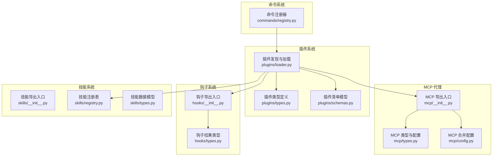
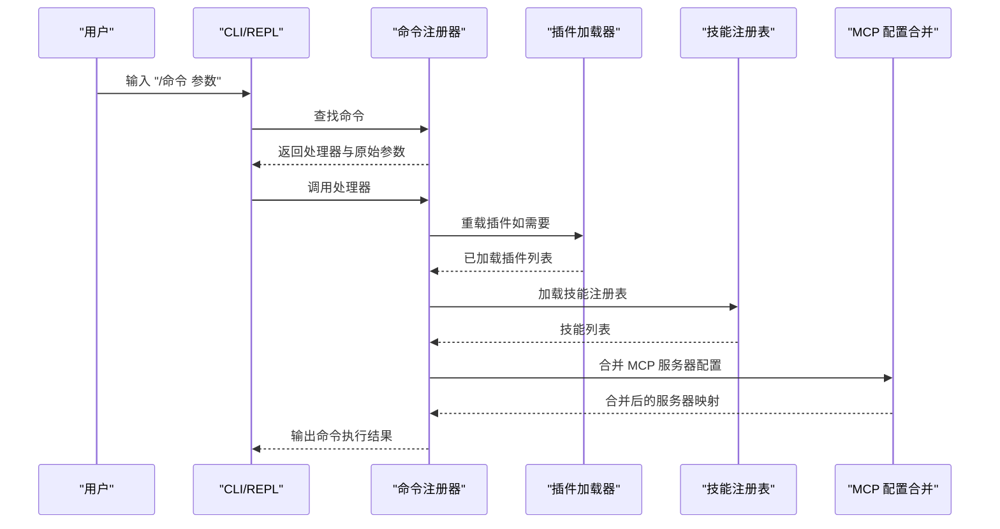
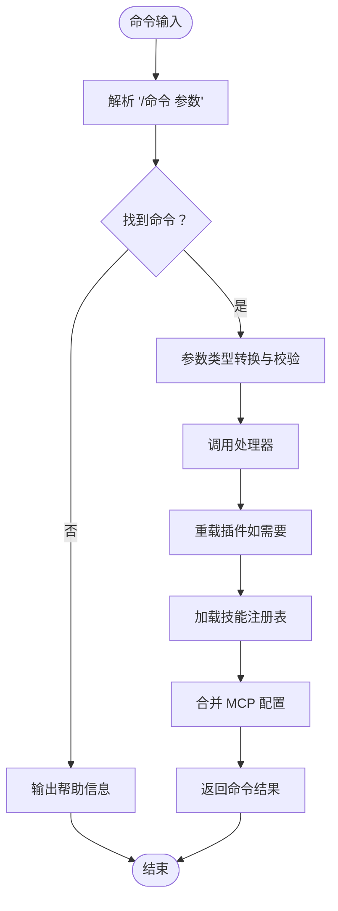
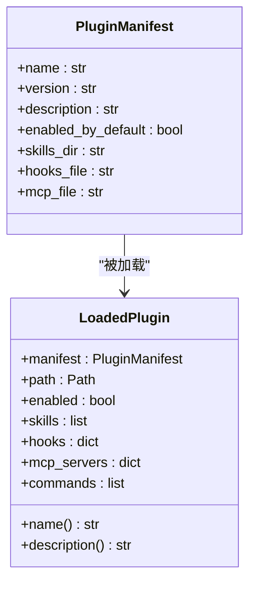
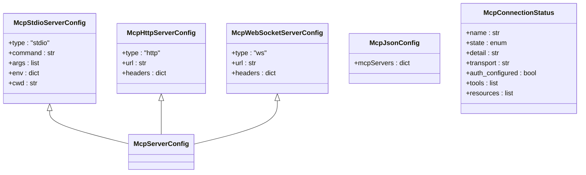
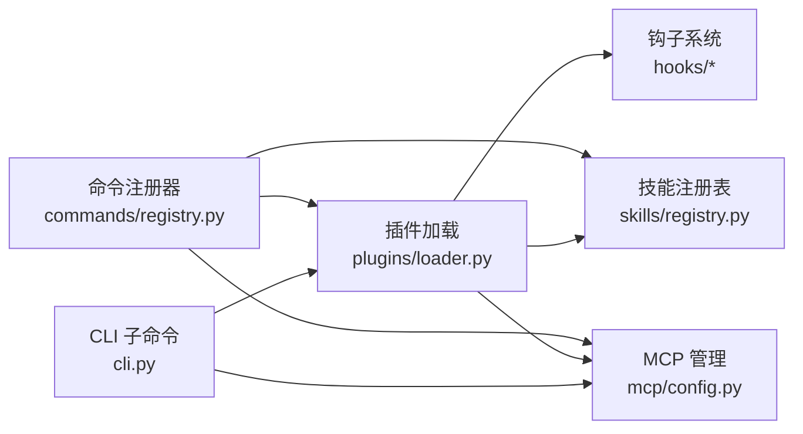

# 命令与代理插件开发

<cite>
**本文引用的文件**
- [src/openharness/plugins/__init__.py](file://src/openharness/plugins/__init__.py)
- [src/openharness/plugins/types.py](file://src/openharness/plugins/types.py)
- [src/openharness/plugins/loader.py](file://src/openharness/plugins/loader.py)
- [src/openharness/plugins/schemas.py](file://src/openharness/plugins/schemas.py)
- [src/openharness/commands/registry.py](file://src/openharness/commands/registry.py)
- [src/openharness/mcp/__init__.py](file://src/openharness/mcp/__init__.py)
- [src/openharness/mcp/types.py](file://src/openharness/mcp/types.py)
- [src/openharness/mcp/config.py](file://src/openharness/mcp/config.py)
- [src/openharness/hooks/__init__.py](file://src/openharness/hooks/__init__.py)
- [src/openharness/hooks/types.py](file://src/openharness/hooks/types.py)
- [src/openharness/skills/__init__.py](file://src/openharness/skills/__init__.py)
- [src/openharness/skills/registry.py](file://src/openharness/skills/registry.py)
- [src/openharness/skills/types.py](file://src/openharness/skills/types.py)
- [src/openharness/cli.py](file://src/openharness/cli.py)
- [tests/test_plugins/test_loader.py](file://tests/test_plugins/test_loader.py)
- [tests/test_commands/test_registry.py](file://tests/test_commands/test_registry.py)
</cite>

## 目录
1. [引言](#引言)
2. [项目结构](#项目结构)
3. [核心组件](#核心组件)
4. [架构总览](#架构总览)
5. [详细组件分析](#详细组件分析)
6. [依赖分析](#依赖分析)
7. [性能考虑](#性能考虑)
8. [故障排查指南](#故障排查指南)
9. [结论](#结论)
10. [附录：开发示例与最佳实践](#附录开发示例与最佳实践)

## 引言
本指南面向希望在 OpenHarness 中开发“命令插件”和“代理插件（MCP）”的开发者。内容涵盖：
- 命令插件的开发方法：命令注册、参数解析与处理、与系统组件的集成。
- 代理插件（MCP）的架构与实现：服务器配置、连接状态、工具与资源发现。
- 完整开发示例：从插件目录结构到命令注册与调用流程。
- 配置与管理机制：插件安装、卸载、启用/禁用、重载。
- 生命周期管理：插件发现、加载、合并贡献项（技能、命令、代理、钩子）。
- 测试与调试：单元测试与端到端行为验证。
- 最佳实践与常见问题排查。

## 项目结构
OpenHarness 将“命令”和“插件”作为两大扩展点：
- 命令系统位于 commands/registry.py，提供内置命令注册器与命令上下文。
- 插件系统位于 plugins/，负责插件发现、加载与贡献项合并。
- MCP 代理能力由 mcp/ 提供，支持 HTTP/WS/STDIO 三种传输，并可从设置与插件中合并配置。
- 钩子（hooks）用于事件驱动扩展，插件可贡献钩子以参与会话生命周期。

**图表来源**
- [src/openharness/commands/registry.py:94-124](file://src/openharness/commands/registry.py#L94-L124)
- [src/openharness/plugins/loader.py:53-106](file://src/openharness/plugins/loader.py#L53-L106)
- [src/openharness/plugins/types.py:14-33](file://src/openharness/plugins/types.py#L14-L33)
- [src/openharness/plugins/schemas.py:8-24](file://src/openharness/plugins/schemas.py#L8-L24)
- [src/openharness/mcp/__init__.py:34-75](file://src/openharness/mcp/__init__.py#L34-L75)
- [src/openharness/mcp/types.py:40-77](file://src/openharness/mcp/types.py#L40-L77)
- [src/openharness/mcp/config.py:8-17](file://src/openharness/mcp/config.py#L8-L17)
- [src/openharness/hooks/__init__.py:24-51](file://src/openharness/hooks/__init__.py#L24-L51)
- [src/openharness/hooks/types.py:9-39](file://src/openharness/hooks/types.py#L9-L39)
- [src/openharness/skills/registry.py:8-25](file://src/openharness/skills/registry.py#L8-L25)
- [src/openharness/skills/types.py:8-17](file://src/openharness/skills/types.py#L8-L17)

**章节来源**
- [src/openharness/plugins/__init__.py:23-53](file://src/openharness/plugins/__init__.py#L23-L53)
- [src/openharness/plugins/loader.py:40-106](file://src/openharness/plugins/loader.py#L40-L106)
- [src/openharness/mcp/__init__.py:34-75](file://src/openharness/mcp/__init__.py#L34-L75)
- [src/openharness/hooks/__init__.py:24-51](file://src/openharness/hooks/__init__.py#L24-L51)
- [src/openharness/skills/__init__.py:14-31](file://src/openharness/skills/__init__.py#L14-L31)

## 核心组件
- 命令注册器与命令上下文：提供命令注册、查找、帮助信息生成以及默认命令集合。
- 插件加载器：扫描用户与项目插件目录，读取 plugin.json，合并技能、命令、代理、钩子等贡献。
- 插件类型与清单：LoadedPlugin 表示已加载插件及其贡献；PluginManifest 描述插件元数据。
- MCP 系统：McpClientManager、McpServerConfig、McpJsonConfig 等，支持多传输协议与配置合并。
- 钩子系统：HookEvent、HookExecutor、HookRegistry 与 HookResult/AggregatedHookResult。
- 技能系统：SkillDefinition、SkillRegistry，统一管理技能来源（内置、用户、插件）。

**章节来源**
- [src/openharness/commands/registry.py:94-124](file://src/openharness/commands/registry.py#L94-L124)
- [src/openharness/plugins/loader.py:53-106](file://src/openharness/plugins/loader.py#L53-L106)
- [src/openharness/plugins/types.py:14-33](file://src/openharness/plugins/types.py#L14-L33)
- [src/openharness/plugins/schemas.py:8-24](file://src/openharness/plugins/schemas.py#L8-L24)
- [src/openharness/mcp/types.py:40-77](file://src/openharness/mcp/types.py#L40-L77)
- [src/openharness/hooks/types.py:9-39](file://src/openharness/hooks/types.py#L9-L39)
- [src/openharness/skills/registry.py:8-25](file://src/openharness/skills/registry.py#L8-L25)
- [src/openharness/skills/types.py:8-17](file://src/openharness/skills/types.py#L8-L17)

## 架构总览
下图展示了命令插件与代理插件在系统中的位置与交互：

**图表来源**
- [src/openharness/commands/registry.py:202-654](file://src/openharness/commands/registry.py#L202-L654)
- [src/openharness/plugins/loader.py:53-106](file://src/openharness/plugins/loader.py#L53-L106)
- [src/openharness/mcp/config.py:8-17](file://src/openharness/mcp/config.py#L8-L17)

## 详细组件分析

### 命令插件开发与使用
- 命令注册与查找
  - 注册器维护命令名到处理器的映射，支持帮助文本生成与命令列表输出。
  - 解析输入时按“/命令 参数”切分，返回处理器与原始参数字符串。
- 参数处理
  - 处理器接收原始参数字符串，内部进行参数校验与类型转换（如布尔、整数、字面量枚举）。
  - 可访问上下文对象，包含引擎、工具注册表、应用状态、工作目录等。
- 内置命令示例
  - 状态查询、版本、摘要、紧凑化、用量统计、成本估算、会话管理、记忆体、代理桥接、权限与模式切换、MCP 认证、Git 状态等。
- 与系统集成
  - 命令可读写设置、操作会话存储、调用任务管理器、访问内存目录、与 MCP 服务器交互。

**图表来源**
- [src/openharness/commands/registry.py:104-124](file://src/openharness/commands/registry.py#L104-L124)
- [src/openharness/commands/registry.py:178-200](file://src/openharness/commands/registry.py#L178-L200)
- [src/openharness/commands/registry.py:645-654](file://src/openharness/commands/registry.py#L645-L654)

**章节来源**
- [src/openharness/commands/registry.py:94-124](file://src/openharness/commands/registry.py#L94-L124)
- [src/openharness/commands/registry.py:178-200](file://src/openharness/commands/registry.py#L178-L200)
- [src/openharness/commands/registry.py:202-800](file://src/openharness/commands/registry.py#L202-L800)

### 插件系统与生命周期
- 插件发现
  - 用户插件目录：配置目录下的 plugins 子目录。
  - 项目插件目录：项目根目录下的 .openharness/plugins 子目录。
  - 在上述路径中递归查找包含 plugin.json 或 .claude-plugin/plugin.json 的目录。
- 插件加载
  - 读取 plugin.json 并反序列化为 PluginManifest。
  - 启用状态优先取设置中的 enabled_plugins，否则使用 manifest.enabled_by_default。
  - 自动发现并加载以下贡献：
    - 技能：skills/ 目录下的 *.md。
    - 命令：commands/ 目录下的 *.md（作为插件命令）。
    - 代理：mcp.json 或 .mcp.json。
    - 钩子：hooks.json 或 hooks/ 目录下的 hooks.json。
- 贡献项合并
  - LoadedPlugin 统一承载 manifest、路径、启用状态、技能、钩子、MCP 服务器、命令列表。
  - 命令列表由所有 source 为 plugin 的技能筛选得到。

**图表来源**
- [src/openharness/plugins/schemas.py:8-24](file://src/openharness/plugins/schemas.py#L8-L24)
- [src/openharness/plugins/types.py:14-33](file://src/openharness/plugins/types.py#L14-L33)

**章节来源**
- [src/openharness/plugins/loader.py:40-106](file://src/openharness/plugins/loader.py#L40-L106)
- [src/openharness/plugins/types.py:14-33](file://src/openharness/plugins/types.py#L14-L33)
- [src/openharness/plugins/schemas.py:8-24](file://src/openharness/plugins/schemas.py#L8-L24)

### 代理插件（MCP）架构与实现
- 配置模型
  - 支持 STDIO、HTTP、WebSocket 三种传输类型的服务器配置。
  - 支持 mcp.json 与 .mcp.json 两种格式，统一通过 McpJsonConfig 反序列化。
- 运行时状态
  - McpConnectionStatus 提供连接状态、传输类型、认证配置、可用工具与资源列表。
- 配置合并
  - load_mcp_server_configs 将设置中的 mcp_servers 与插件贡献的服务器合并，插件服务器键名采用“插件名:服务器名”的命名空间避免冲突。
- 导出入口
  - mcp/__init__.py 暴露 McpClientManager、McpServerConfig、McpJsonConfig 等类型与加载函数。

**图表来源**
- [src/openharness/mcp/types.py:11-77](file://src/openharness/mcp/types.py#L11-L77)

**章节来源**
- [src/openharness/mcp/__init__.py:34-75](file://src/openharness/mcp/__init__.py#L34-L75)
- [src/openharness/mcp/types.py:11-77](file://src/openharness/mcp/types.py#L11-L77)
- [src/openharness/mcp/config.py:8-17](file://src/openharness/mcp/config.py#L8-L17)

### 钩子系统与技能贡献
- 钩子类型
  - HookResult/AggregatedHookResult 提供单次与聚合的钩子执行结果，支持阻断与原因说明。
- 技能贡献
  - 插件可通过 skills/ 与 commands/ 目录贡献技能与命令，技能内容以 Markdown 文件形式存在。
  - 技能注册表统一管理技能来源与内容，便于命令与工具使用。

**章节来源**
- [src/openharness/hooks/types.py:9-39](file://src/openharness/hooks/types.py#L9-L39)
- [src/openharness/skills/registry.py:8-25](file://src/openharness/skills/registry.py#L8-L25)
- [src/openharness/skills/types.py:8-17](file://src/openharness/skills/types.py#L8-L17)

## 依赖分析
- 命令系统依赖插件加载器以获取最新插件贡献（技能、命令、代理），并通过技能注册表统一管理。
- 插件系统依赖技能、钩子与 MCP 模块，将各贡献项合并到 LoadedPlugin。
- MCP 配置合并依赖设置与插件贡献，形成最终服务器映射。
- CLI 子命令提供插件与 MCP 的管理入口，便于安装、卸载、列出与增删配置。

**图表来源**
- [src/openharness/cli.py:94-132](file://src/openharness/cli.py#L94-L132)
- [src/openharness/plugins/loader.py:53-106](file://src/openharness/plugins/loader.py#L53-L106)
- [src/openharness/mcp/config.py:8-17](file://src/openharness/mcp/config.py#L8-L17)
- [src/openharness/commands/registry.py:645-654](file://src/openharness/commands/registry.py#L645-L654)

**章节来源**
- [src/openharness/cli.py:94-132](file://src/openharness/cli.py#L94-L132)
- [src/openharness/plugins/loader.py:53-106](file://src/openharness/plugins/loader.py#L53-L106)
- [src/openharness/mcp/config.py:8-17](file://src/openharness/mcp/config.py#L8-L17)

## 性能考虑
- 插件发现与加载
  - 仅在必要时触发重载插件流程（如 /reload-plugins），避免频繁 IO。
  - 合并贡献项时注意键名冲突（MCP 服务器采用“插件名:服务器名”命名空间）。
- 命令处理
  - 对参数进行快速类型转换与校验，减少无效调用。
  - 使用会话快照与紧凑化命令降低消息规模，提升响应速度。
- MCP 连接
  - 合并配置后按需建立连接，避免不必要的握手与认证开销。

## 故障排查指南
- 插件未被发现
  - 确认 plugin.json 或 .claude-plugin/plugin.json 存在且可读。
  - 检查用户或项目插件目录是否正确创建。
- 插件未启用
  - 检查设置中的 enabled_plugins 是否覆盖默认值。
- 命令不生效
  - 使用 /help 查看命令列表与描述。
  - 使用 /doctor 检查上下文与环境状态。
- MCP 服务器无法连接
  - 使用 /mcp auth 为 HTTP/STDIO 服务器配置认证头或环境变量。
  - 使用 mcp list/list 与 mcp add/remove 管理服务器配置。
- 测试与调试
  - 单元测试覆盖插件加载、命令行为、MCP 认证与 Git 状态等场景。
  - 使用 CLI 子命令进行端到端验证。

**章节来源**
- [tests/test_plugins/test_loader.py:53-83](file://tests/test_plugins/test_loader.py#L53-L83)
- [tests/test_commands/test_registry.py:64-496](file://tests/test_commands/test_registry.py#L64-L496)
- [src/openharness/cli.py:39-92](file://src/openharness/cli.py#L39-L92)

## 结论
OpenHarness 通过命令注册器与插件系统实现了强大的扩展能力。命令插件以技能/命令的形式贡献到系统，代理插件则通过 MCP 配置与运行时状态实现远程能力接入。借助钩子与技能系统，插件可以深度参与会话生命周期与工具链。配合 CLI 子命令与测试用例，开发者可以高效地完成插件的开发、安装、调试与发布。

## 附录：开发示例与最佳实践

### 命令插件开发步骤
- 创建插件目录与清单
  - 在用户或项目插件目录下创建插件根目录，并放置 plugin.json。
  - 在 skills/ 目录下添加 Markdown 技能文件，或在 commands/ 目录下添加命令 Markdown 文件。
- 编写命令处理器
  - 在命令注册器中注册新命令，或通过插件贡献命令 Markdown 文件。
  - 处理器中解析参数、访问上下文、调用引擎或工具，并返回 CommandResult。
- 验证与测试
  - 使用 /reload-plugins 重载插件，确认命令出现在帮助列表。
  - 编写单元测试覆盖命令行为与边界条件。

**章节来源**
- [src/openharness/plugins/loader.py:77-86](file://src/openharness/plugins/loader.py#L77-L86)
- [src/openharness/commands/registry.py:202-800](file://src/openharness/commands/registry.py#L202-L800)
- [tests/test_plugins/test_loader.py:14-83](file://tests/test_plugins/test_loader.py#L14-L83)

### 代理插件（MCP）配置与管理
- 配置文件
  - 在插件根目录下提供 mcp.json 或 .mcp.json，定义服务器名称与传输配置。
- 管理命令
  - 使用 mcp list 列出服务器，mcp add 添加，mcp remove 删除。
  - 使用 /mcp auth 为 HTTP/STDIO 服务器配置认证。
- 运行时状态
  - 通过命令注册器上下文中的 MCP 摘要了解可用工具与资源。

**章节来源**
- [src/openharness/mcp/config.py:8-17](file://src/openharness/mcp/config.py#L8-L17)
- [src/openharness/cli.py:39-92](file://src/openharness/cli.py#L39-L92)
- [src/openharness/commands/registry.py:591-643](file://src/openharness/commands/registry.py#L591-L643)

### 生命周期管理
- 发现与加载
  - 自动扫描用户与项目插件目录，读取清单并加载贡献项。
- 启用/禁用
  - 设置中的 enabled_plugins 控制插件启用状态，未显式指定时使用清单默认值。
- 重载
  - /reload-plugins 命令可重新加载插件并更新上下文。

**章节来源**
- [src/openharness/plugins/loader.py:53-106](file://src/openharness/plugins/loader.py#L53-L106)
- [src/openharness/commands/registry.py:645-654](file://src/openharness/commands/registry.py#L645-L654)

### 测试与调试方法
- 单元测试
  - 插件加载测试：验证插件发现、技能与钩子合并、MCP 服务器加载。
  - 命令注册测试：验证命令解析、参数转换、持久化设置与状态更新。
- 端到端验证
  - 使用 CLI 子命令进行安装、卸载、列出与增删 MCP 服务器。
  - 使用命令进行会话管理、记忆体操作、权限与模式切换、MCP 认证与 Git 状态检查。

**章节来源**
- [tests/test_plugins/test_loader.py:53-83](file://tests/test_plugins/test_loader.py#L53-L83)
- [tests/test_commands/test_registry.py:64-496](file://tests/test_commands/test_registry.py#L64-L496)
- [src/openharness/cli.py:94-132](file://src/openharness/cli.py#L94-L132)