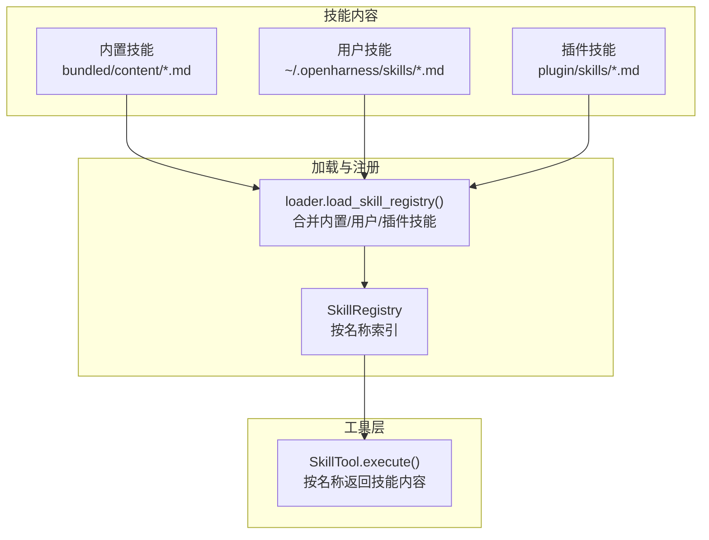
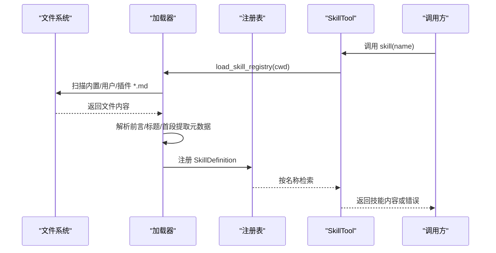
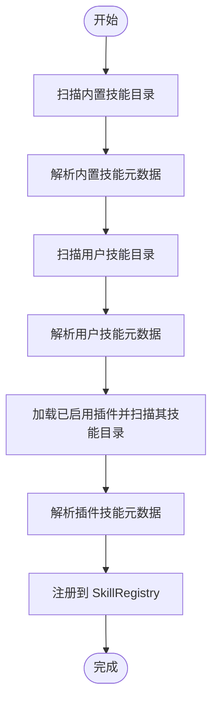
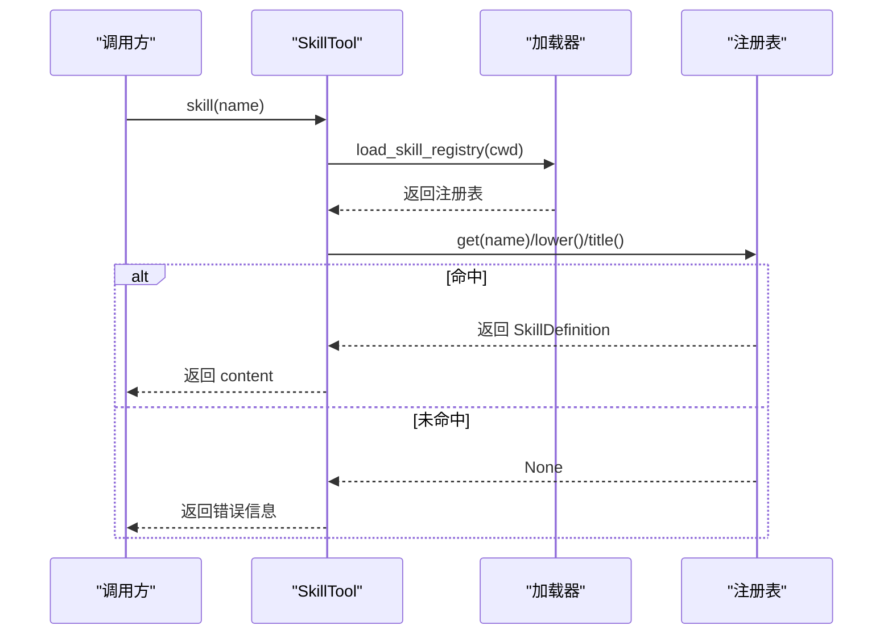
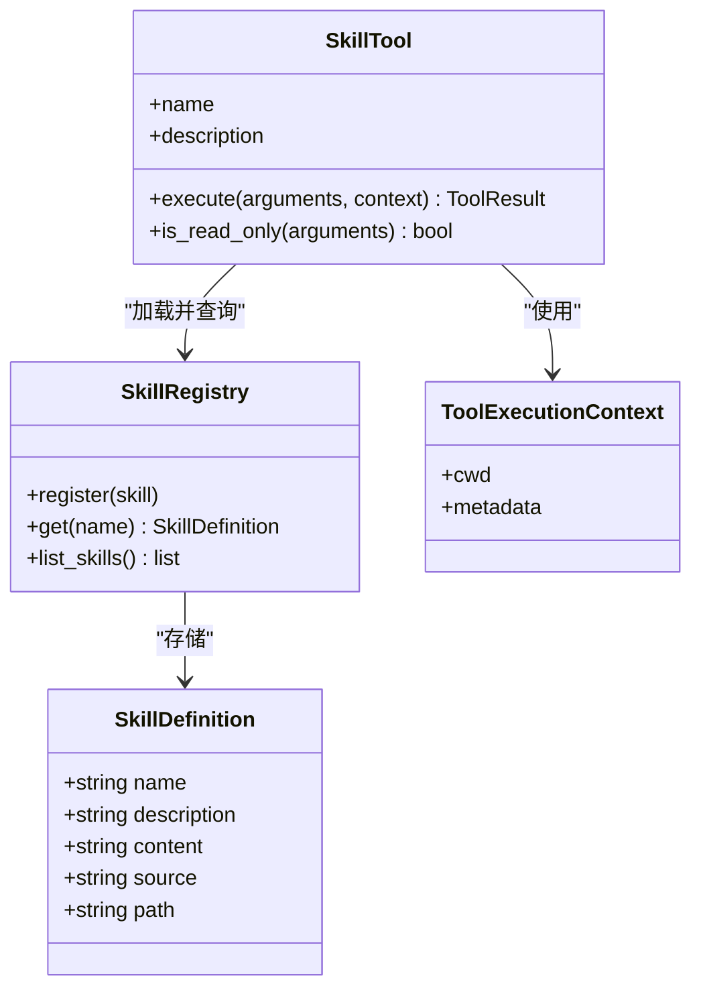
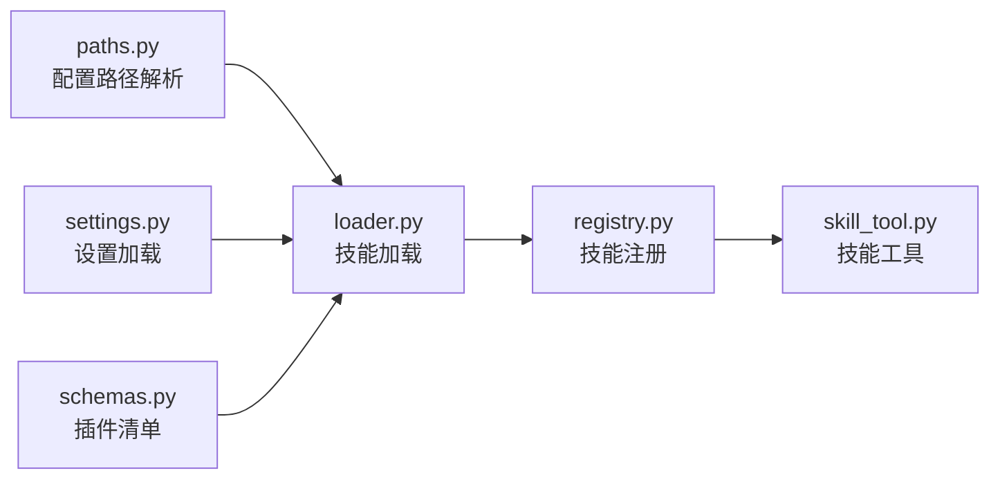

# 技能文件开发

<cite>
**本文引用的文件**
- [commit.md](file://src/openharness/skills/bundled/content/commit.md)
- [debug.md](file://src/openharness/skills/bundled/content/debug.md)
- [plan.md](file://src/openharness/skills/bundled/content/plan.md)
- [review.md](file://src/openharness/skills/bundled/content/review.md)
- [loader.py](file://src/openharness/skills/loader.py)
- [types.py](file://src/openharness/skills/types.py)
- [registry.py](file://src/openharness/skills/registry.py)
- [__init__.py（技能导出）](file://src/openharness/skills/__init__.py)
- [skill_tool.py](file://src/openharness/tools/skill_tool.py)
- [base.py（工具基类）](file://src/openharness/tools/base.py)
- [paths.py（路径解析）](file://src/openharness/config/paths.py)
- [settings.py（设置加载）](file://src/openharness/config/settings.py)
- [schemas.py（插件清单）](file://src/openharness/plugins/schemas.py)
- [test_loader.py](file://tests/test_skills/test_loader.py)
- [test_real_skills_plugins.py](file://scripts/test_real_skills_plugins.py)
</cite>

## 目录
1. [简介](#简介)
2. [项目结构](#项目结构)
3. [核心组件](#核心组件)
4. [架构总览](#架构总览)
5. [详细组件分析](#详细组件分析)
6. [依赖分析](#依赖分析)
7. [性能考虑](#性能考虑)
8. [故障排查指南](#故障排查指南)
9. [结论](#结论)
10. [附录](#附录)

## 简介
本指南面向希望开发“技能文件”的用户与贡献者，系统讲解技能文件的 .md 格式规范、元数据结构、最佳实践、复杂技能设计、与工具系统的集成方式，并提供可复用的编写模板与测试验证方法。技能文件是 OpenHarness 的知识与工作流载体，通过统一的加载与注册机制被系统识别与调用。

## 项目结构
技能系统由“内容文件（.md）”、“加载器（loader）”、“类型定义（types）”、“注册表（registry）”以及“工具（SkillTool）”构成，形成从磁盘到内存再到工具调用的完整链路。用户自定义技能位于用户配置目录下的 skills 子目录，系统同时加载内置技能与插件技能。

**图表来源**
- [loader.py:21-37](file://src/openharness/skills/loader.py#L21-L37)
- [registry.py:8-24](file://src/openharness/skills/registry.py#L8-L24)
- [skill_tool.py:28-33](file://src/openharness/tools/skill_tool.py#L28-L33)

**章节来源**
- [loader.py:14-55](file://src/openharness/skills/loader.py#L14-L55)
- [paths.py:15-29](file://src/openharness/config/paths.py#L15-L29)

## 核心组件
- 技能定义模型：封装技能的名称、描述、内容、来源与路径。
- 技能加载器：扫描内置、用户与插件目录，解析 YAML 前言或标题/段落提取元数据。
- 技能注册表：以名称为键存储技能定义，支持大小写不敏感的查找。
- 技能工具：对外暴露“按名称读取技能内容”的只读工具接口。

**章节来源**
- [types.py:8-17](file://src/openharness/skills/types.py#L8-L17)
- [loader.py:58-96](file://src/openharness/skills/loader.py#L58-L96)
- [registry.py:8-24](file://src/openharness/skills/registry.py#L8-L24)
- [skill_tool.py:17-33](file://src/openharness/tools/skill_tool.py#L17-L33)

## 架构总览
技能文件在系统中的生命周期如下：磁盘上的 .md 文件 → 加载器解析元数据与正文 → 注册表建立索引 → 工具按名称查询并返回内容。

**图表来源**
- [loader.py:21-37](file://src/openharness/skills/loader.py#L21-L37)
- [registry.py:14-20](file://src/openharness/skills/registry.py#L14-L20)
- [skill_tool.py:28-33](file://src/openharness/tools/skill_tool.py#L28-L33)

## 详细组件分析

### 技能文件格式规范与元数据结构
- 文件扩展名：.md
- 编码：UTF-8
- 元数据来源与优先级：
  1) YAML 前言（三横线包裹）：支持 name、description 字段
  2) 标题与首段回退：若未提供前言，则使用首行标题作为名称，第一段文本作为描述（限制长度）
- 内容组织建议：
  - 使用清晰的标题层级（如二级标题分隔“何时使用”“工作流”“规则”等）
  - 工作流建议采用有序列表，规则建议采用要点列表
  - 避免冗长，保持可读性与可执行性

示例参考：
- 提交信息生成技能：[commit.md:1-26](file://src/openharness/skills/bundled/content/commit.md#L1-L26)
- 调试诊断技能：[debug.md:1-26](file://src/openharness/skills/bundled/content/debug.md#L1-L26)
- 计划设计技能：[plan.md:1-35](file://src/openharness/skills/bundled/content/plan.md#L1-L35)
- 代码评审技能：[review.md:1-27](file://src/openharness/skills/bundled/content/review.md#L1-L27)

**章节来源**
- [loader.py:58-96](file://src/openharness/skills/loader.py#L58-L96)
- [commit.md:1-26](file://src/openharness/skills/bundled/content/commit.md#L1-L26)
- [debug.md:1-26](file://src/openharness/skills/bundled/content/debug.md#L1-L26)
- [plan.md:1-35](file://src/openharness/skills/bundled/content/plan.md#L1-L35)
- [review.md:1-27](file://src/openharness/skills/bundled/content/review.md#L1-L27)

### 技能加载与注册流程
- 用户技能目录：默认位于用户配置根目录下的 skills 子目录；可通过环境变量覆盖配置根目录。
- 加载顺序：内置 → 用户 → 插件（当启用插件时），最终统一注册到注册表。
- 注册表行为：以技能名称为键，大小写不敏感匹配；支持列出全部技能。

**图表来源**
- [loader.py:21-37](file://src/openharness/skills/loader.py#L21-L37)
- [paths.py:15-29](file://src/openharness/config/paths.py#L15-L29)

**章节来源**
- [loader.py:14-55](file://src/openharness/skills/loader.py#L14-L55)
- [registry.py:14-24](file://src/openharness/skills/registry.py#L14-L24)
- [paths.py:15-29](file://src/openharness/config/paths.py#L15-L29)

### 技能工具与调用
- 工具名称：skill
- 输入参数：name（技能名称）
- 行为：按名称在注册表中查找，支持大小写不敏感；返回技能内容或错误信息
- 权限：只读工具

**图表来源**
- [skill_tool.py:28-33](file://src/openharness/tools/skill_tool.py#L28-L33)
- [loader.py:21-37](file://src/openharness/skills/loader.py#L21-L37)
- [registry.py:18-20](file://src/openharness/skills/registry.py#L18-L20)

**章节来源**
- [skill_tool.py:17-33](file://src/openharness/tools/skill_tool.py#L17-L33)
- [base.py:30-44](file://src/openharness/tools/base.py#L30-L44)

### 复杂技能设计：多步骤与条件逻辑
- 多步骤指令：使用有序列表清晰拆分任务，每步明确输入、操作与输出。
- 条件逻辑：在“何时使用”“规则”等部分以要点形式表达前置条件与边界约束。
- 可组合性：复杂任务可拆分为多个独立技能，通过工具调用或人工选择组合使用。

参考内置技能的结构组织：
- 提交流程与规则：[commit.md:9-26](file://src/openharness/skills/bundled/content/commit.md#L9-L26)
- 调试流程与规则：[debug.md:9-26](file://src/openharness/skills/bundled/content/debug.md#L9-L26)
- 计划流程与规则：[plan.md:9-35](file://src/openharness/skills/bundled/content/plan.md#L9-L35)
- 评审维度与优先级：[review.md:9-27](file://src/openharness/skills/bundled/content/review.md#L9-L27)

**章节来源**
- [commit.md:9-26](file://src/openharness/skills/bundled/content/commit.md#L9-L26)
- [debug.md:9-26](file://src/openharness/skills/bundled/content/debug.md#L9-L26)
- [plan.md:9-35](file://src/openharness/skills/bundled/content/plan.md#L9-L35)
- [review.md:9-27](file://src/openharness/skills/bundled/content/review.md#L9-L27)

### 与工具系统的集成
- 技能工具：通过工具接口按名称读取技能内容，便于在对话或工作流中引用。
- 设置与路径：技能目录遵循配置路径解析规则，支持环境变量覆盖。
- 插件扩展：插件可通过清单声明 skills 字段，系统自动加载其技能目录。

**图表来源**
- [types.py:8-17](file://src/openharness/skills/types.py#L8-L17)
- [registry.py:8-24](file://src/openharness/skills/registry.py#L8-L24)
- [skill_tool.py:17-33](file://src/openharness/tools/skill_tool.py#L17-L33)
- [base.py:13-28](file://src/openharness/tools/base.py#L13-L28)

**章节来源**
- [skill_tool.py:17-33](file://src/openharness/tools/skill_tool.py#L17-L33)
- [base.py:55-76](file://src/openharness/tools/base.py#L55-L76)
- [paths.py:15-29](file://src/openharness/config/paths.py#L15-L29)
- [schemas.py:8-24](file://src/openharness/plugins/schemas.py#L8-L24)

### 最佳实践与编写模板
- 元数据优先：使用 YAML 前言提供稳定、可读的 name 与 description。
- 结构化内容：使用“何时使用”“工作流”“规则”等小节组织，提升可维护性。
- 可执行性：步骤尽量具体、可验证；必要时给出检查点。
- 一致性：命名风格统一，避免歧义；规则条目简洁明确。
- 示例参考：内置技能文件提供了良好的范式，可直接对照修改。

参考文件：
- [commit.md:1-26](file://src/openharness/skills/bundled/content/commit.md#L1-L26)
- [debug.md:1-26](file://src/openharness/skills/bundled/content/debug.md#L1-L26)
- [plan.md:1-35](file://src/openharness/skills/bundled/content/plan.md#L1-L35)
- [review.md:1-27](file://src/openharness/skills/bundled/content/review.md#L1-L27)

**章节来源**
- [loader.py:58-96](file://src/openharness/skills/loader.py#L58-L96)
- [commit.md:1-26](file://src/openharness/skills/bundled/content/commit.md#L1-L26)
- [debug.md:1-26](file://src/openharness/skills/bundled/content/debug.md#L1-L26)
- [plan.md:1-35](file://src/openharness/skills/bundled/content/plan.md#L1-L35)
- [review.md:1-27](file://src/openharness/skills/bundled/content/review.md#L1-L27)

### 实际示例：提交信息生成技能
- 目标：指导用户生成清晰、结构化的 Git 提交信息。
- 关键点：变更分析、消息格式、阶段化提交、配对编程标注等。
- 使用场景：PR 准备、代码审查前整理、版本控制规范化。

参考文件：
- [commit.md:1-26](file://src/openharness/skills/bundled/content/commit.md#L1-L26)

**章节来源**
- [commit.md:1-26](file://src/openharness/skills/bundled/content/commit.md#L1-L26)

### 测试与验证方法
- 单元测试：验证内置与用户技能是否正确加载、名称与描述提取是否符合预期。
- 端到端测试：验证 SkillTool 能正确返回技能内容且长度合理。
- 质量检查：确保用户技能具备足够的内容与描述，避免空壳技能。

参考测试：
- [test_loader.py:10-29](file://tests/test_skills/test_loader.py#L10-L29)
- [test_real_skills_plugins.py:103-136](file://scripts/test_real_skills_plugins.py#L103-L136)

**章节来源**
- [test_loader.py:10-29](file://tests/test_skills/test_loader.py#L10-L29)
- [test_real_skills_plugins.py:103-136](file://scripts/test_real_skills_plugins.py#L103-L136)

## 依赖分析
- 技能加载依赖于配置路径解析与设置加载，确保用户技能目录位置正确。
- 插件系统通过清单声明技能目录，系统在加载插件时自动纳入技能注册。
- 工具层依赖技能注册表进行名称解析，注册表再依赖技能定义模型。

**图表来源**
- [paths.py:15-29](file://src/openharness/config/paths.py#L15-L29)
- [settings.py:123-141](file://src/openharness/config/settings.py#L123-L141)
- [loader.py:21-37](file://src/openharness/skills/loader.py#L21-L37)
- [registry.py:14-20](file://src/openharness/skills/registry.py#L14-L20)
- [skill_tool.py:28-33](file://src/openharness/tools/skill_tool.py#L28-L33)
- [schemas.py:8-24](file://src/openharness/plugins/schemas.py#L8-L24)

**章节来源**
- [paths.py:15-29](file://src/openharness/config/paths.py#L15-L29)
- [settings.py:123-141](file://src/openharness/config/settings.py#L123-L141)
- [loader.py:21-37](file://src/openharness/skills/loader.py#L21-L37)
- [schemas.py:8-24](file://src/openharness/plugins/schemas.py#L8-L24)

## 性能考虑
- 文件扫描：用户技能目录仅在启动或需要时加载，避免频繁 IO。
- 内存占用：技能内容以字符串形式保存，建议保持单个技能内容适中，避免过大文件影响传输与渲染。
- 查找效率：注册表使用字典按名称索引，查询为 O(1)，满足高频调用需求。

## 故障排查指南
- 技能未显示：确认技能文件位于用户技能目录（默认 ~/.openharness/skills），文件名为 .md，且包含有效元数据。
- 名称不匹配：工具按名称查找支持大小写不敏感，若仍失败，检查是否包含特殊字符或空格。
- 内容为空：检查技能文件是否包含足够内容与描述，避免过短导致质量检查失败。
- 插件技能未加载：确认插件已启用且清单中声明了 skills 字段。

**章节来源**
- [loader.py:40-55](file://src/openharness/skills/loader.py#L40-L55)
- [skill_tool.py:28-33](file://src/openharness/tools/skill_tool.py#L28-L33)
- [test_loader.py:19-29](file://tests/test_skills/test_loader.py#L19-L29)
- [test_real_skills_plugins.py:103-136](file://scripts/test_real_skills_plugins.py#L103-L136)

## 结论
技能文件是 OpenHarness 的知识与工作流基础。通过标准化的 .md 格式、可靠的加载与注册机制以及工具层的统一访问，开发者可以快速构建高质量、可维护的技能。建议优先使用 YAML 前言提供稳定的元数据，采用模块化与可组合的设计思路，并结合测试与质量检查保障交付质量。

## 附录
- 相关内置技能文件可直接参考学习：
  - [commit.md:1-26](file://src/openharness/skills/bundled/content/commit.md#L1-L26)
  - [debug.md:1-26](file://src/openharness/skills/bundled/content/debug.md#L1-L26)
  - [plan.md:1-35](file://src/openharness/skills/bundled/content/plan.md#L1-L35)
  - [review.md:1-27](file://src/openharness/skills/bundled/content/review.md#L1-L27)