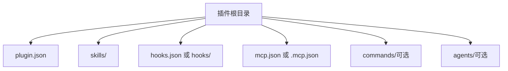
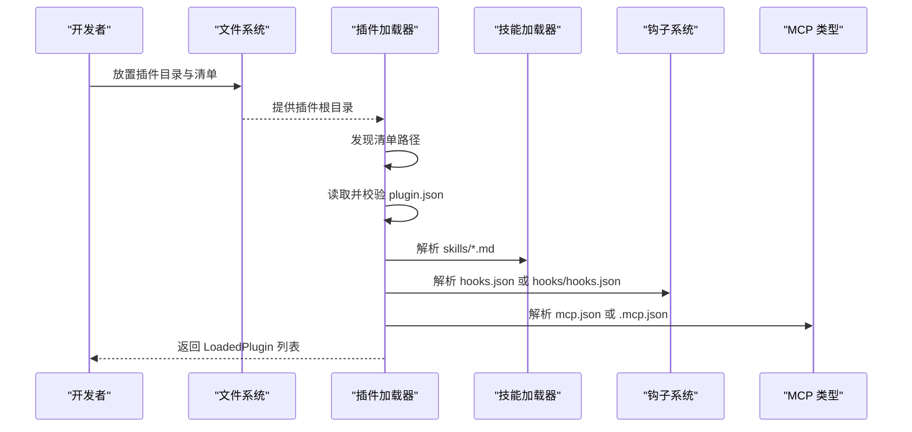
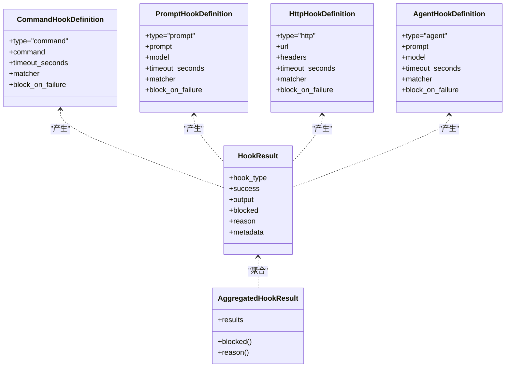
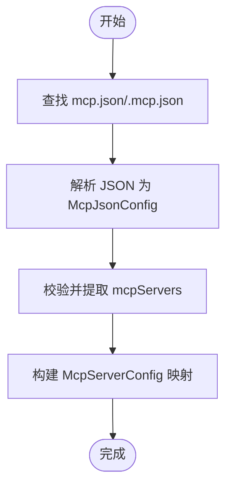
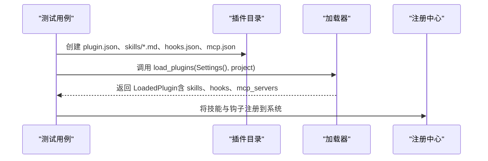
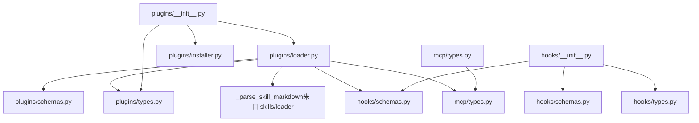

# 插件开发指南

<cite>
**本文引用的文件**
- [src/openharness/plugins/__init__.py](file://src/openharness/plugins/__init__.py)
- [src/openharness/plugins/schemas.py](file://src/openharness/plugins/schemas.py)
- [src/openharness/plugins/types.py](file://src/openharness/plugins/types.py)
- [src/openharness/plugins/loader.py](file://src/openharness/plugins/loader.py)
- [src/openharness/plugins/installer.py](file://src/openharness/plugins/installer.py)
- [src/openharness/hooks/__init__.py](file://src/openharness/hooks/__init__.py)
- [src/openharness/hooks/schemas.py](file://src/openharness/hooks/schemas.py)
- [src/openharness/hooks/types.py](file://src/openharness/hooks/types.py)
- [src/openharness/mcp/types.py](file://src/openharness/mcp/types.py)
- [src/openharness/skills/types.py](file://src/openharness/skills/types.py)
- [src/openharness/skills/bundled/content/commit.md](file://src/openharness/skills/bundled/content/commit.md)
- [tests/test_plugins/test_loader.py](file://tests/test_plugins/test_loader.py)
- [tests/fixtures/fake_mcp_server.py](file://tests/fixtures/fake_mcp_server.py)
</cite>

## 目录
1. [简介](#简介)
2. [项目结构](#项目结构)
3. [核心组件](#核心组件)
4. [架构总览](#架构总览)
5. [详细组件分析](#详细组件分析)
6. [依赖分析](#依赖分析)
7. [性能考虑](#性能考虑)
8. [故障排查指南](#故障排查指南)
9. [结论](#结论)
10. [附录](#附录)

## 简介
本指南面向希望在 OpenHarness 平台上开发插件的开发者，覆盖从项目结构模板、清单文件编写、技能文件规范、钩子系统、MCP 服务器集成，到命令与代理插件示例、测试与发布全流程。内容基于仓库中的插件加载器、钩子系统、MCP 类型与技能类型等实现进行提炼，确保可操作性与一致性。

## 项目结构
一个标准的插件目录应包含以下关键元素（以用户插件目录为例）：
- plugin.json：插件清单，声明名称、版本、默认启用状态、技能目录、钩子文件、MCP 配置等
- skills/：存放技能 Markdown 文件（.md），每个文件对应一个技能
- hooks.json 或 hooks/ 目录：钩子定义，支持命令、提示词、HTTP、代理四类钩子
- mcp.json 或 .mcp.json：MCP 服务器配置，支持 http、ws、stdio 三种传输
- commands/、agents/：可选，分别用于命令型技能与代理型技能的额外技能文件

**章节来源**
- [src/openharness/plugins/loader.py:40-50](file://src/openharness/plugins/loader.py#L40-L50)
- [src/openharness/plugins/loader.py:63-106](file://src/openharness/plugins/loader.py#L63-L106)

## 核心组件
- 插件清单模型：定义插件元数据与可选扩展字段
- 已加载插件模型：聚合清单、路径、启用状态、技能、钩子、MCP 服务器与命令集合
- 插件加载器：发现与加载插件，解析技能、钩子、MCP 配置
- 安装器：将插件从源路径复制到用户插件目录或卸载
- 钩子系统：定义四类钩子的模式与运行时结果聚合
- MCP 类型：定义 stdio/http/ws 三类服务器配置及工具/资源信息
- 技能类型：统一技能的数据结构

**章节来源**
- [src/openharness/plugins/schemas.py:8-24](file://src/openharness/plugins/schemas.py#L8-L24)
- [src/openharness/plugins/types.py:14-33](file://src/openharness/plugins/types.py#L14-L33)
- [src/openharness/plugins/loader.py:53-106](file://src/openharness/plugins/loader.py#L53-L106)
- [src/openharness/plugins/installer.py:11-27](file://src/openharness/plugins/installer.py#L11-L27)
- [src/openharness/hooks/schemas.py:10-58](file://src/openharness/hooks/schemas.py#L10-L58)
- [src/openharness/hooks/types.py:9-39](file://src/openharness/hooks/types.py#L9-L39)
- [src/openharness/mcp/types.py:11-77](file://src/openharness/mcp/types.py#L11-L77)
- [src/openharness/skills/types.py:8-17](file://src/openharness/skills/types.py#L8-L17)

## 架构总览
下图展示了插件生命周期的关键步骤：发现插件目录 → 读取清单 → 解析技能/钩子/MCP → 聚合为 LoadedPlugin → 注册到系统。

**图表来源**
- [src/openharness/plugins/loader.py:29-37](file://src/openharness/plugins/loader.py#L29-L37)
- [src/openharness/plugins/loader.py:69-72](file://src/openharness/plugins/loader.py#L69-L72)
- [src/openharness/plugins/loader.py:109-125](file://src/openharness/plugins/loader.py#L109-L125)
- [src/openharness/plugins/loader.py:128-152](file://src/openharness/plugins/loader.py#L128-L152)
- [src/openharness/plugins/loader.py:187-194](file://src/openharness/plugins/loader.py#L187-L194)

**章节来源**
- [src/openharness/plugins/loader.py:40-106](file://src/openharness/plugins/loader.py#L40-L106)

## 详细组件分析

### 插件清单（plugin.json）编写规范
- 必填字段：name、version（默认值）、description（默认值）
- 启用控制：enabled_by_default（默认启用）
- 目录与文件名约定：skills_dir（默认 skills）、hooks_file（默认 hooks.json）、mcp_file（默认 mcp.json）
- 扩展字段：author、commands、agents、skills、hooks（可选）

清单字段与默认值由模型定义，加载器通过 Pydantic 校验后使用。

**章节来源**
- [src/openharness/plugins/schemas.py:8-24](file://src/openharness/plugins/schemas.py#L8-L24)
- [src/openharness/plugins/loader.py:69-72](file://src/openharness/plugins/loader.py#L69-L72)

### 技能文件（.md）编写规范
- 每个 Markdown 文件代表一个技能
- 文件名即技能名（去扩展名）
- 内容结构建议包含：标题、用途说明、工作流步骤、规则约束等
- 加载器会读取文件内容并注册为技能，source 标记为 plugin

参考内置示例文件以了解常见结构与风格。

**章节来源**
- [src/openharness/plugins/loader.py:109-125](file://src/openharness/plugins/loader.py#L109-L125)
- [src/openharness/skills/types.py:8-17](file://src/openharness/skills/types.py#L8-L17)
- [src/openharness/skills/bundled/content/commit.md:1-26](file://src/openharness/skills/bundled/content/commit.md#L1-L26)

### 钩子系统开发方法
钩子用于在特定事件发生时执行动作，支持四类钩子：
- 命令钩子：执行 shell 命令，可设置超时、匹配器、失败阻断策略
- 提示词钩子：向模型提问以验证条件，可指定模型、超时、匹配器、失败阻断策略
- HTTP 钩子：将事件负载 POST 至 HTTP 端点，可设置请求头、超时、匹配器、失败阻断策略
- 代理钩子：更深层的模型驱动验证，可指定模型、超时、匹配器、失败阻断策略

钩子可通过两种方式定义：
- hooks.json：顶层键为事件名，值为钩子数组；每条钩子含 type 字段
- hooks/hooks.json：结构化格式，支持 matcher 与命令中的变量替换（如 ${CLAUDE_PLUGIN_ROOT}）

运行时结果聚合：
- 单钩子结果包含类型、成功与否、输出、是否阻断、原因与元数据
- 事件级聚合结果包含所有钩子结果，提供是否阻断与首个阻断原因

**图表来源**
- [src/openharness/hooks/schemas.py:10-58](file://src/openharness/hooks/schemas.py#L10-L58)
- [src/openharness/hooks/types.py:9-39](file://src/openharness/hooks/types.py#L9-L39)

**章节来源**
- [src/openharness/hooks/schemas.py:10-58](file://src/openharness/hooks/schemas.py#L10-L58)
- [src/openharness/hooks/types.py:9-39](file://src/openharness/hooks/types.py#L9-L39)
- [src/openharness/plugins/loader.py:128-152](file://src/openharness/plugins/loader.py#L128-L152)
- [src/openharness/plugins/loader.py:155-184](file://src/openharness/plugins/loader.py#L155-L184)

### MCP 服务器插件开发流程与配置
- 配置文件：mcp.json 或 .mcp.json，顶层键为 mcpServers，值为服务器映射
- 服务器类型：
  - stdio：通过命令与参数启动本地进程
  - http：通过固定 URL 访问 HTTP 接口
  - ws：通过 WebSocket 连接
- 加载逻辑：加载器读取配置并转换为 McpServerConfig 映射
- 工具与资源：系统维护工具与资源元信息，便于 UI 展示与调用

**图表来源**
- [src/openharness/plugins/loader.py:187-194](file://src/openharness/plugins/loader.py#L187-L194)
- [src/openharness/mcp/types.py:40-77](file://src/openharness/mcp/types.py#L40-L77)

**章节来源**
- [src/openharness/mcp/types.py:11-77](file://src/openharness/mcp/types.py#L11-L77)
- [src/openharness/plugins/loader.py:93-96](file://src/openharness/plugins/loader.py#L93-L96)

### 命令插件与代理插件示例
- 命令插件：在 commands/ 目录下放置技能 Markdown 文件，加载器会将其识别为命令型技能
- 代理插件：在 agents/ 目录下放置技能 Markdown 文件，加载器会将其识别为代理型技能
- 示例参考：测试用例展示了如何在插件中放置技能、钩子与 MCP 配置，并通过加载器正确识别

**图表来源**
- [tests/test_plugins/test_loader.py:14-51](file://tests/test_plugins/test_loader.py#L14-L51)
- [tests/test_plugins/test_loader.py:53-83](file://tests/test_plugins/test_loader.py#L53-L83)

**章节来源**
- [src/openharness/plugins/loader.py:77-85](file://src/openharness/plugins/loader.py#L77-L85)
- [tests/test_plugins/test_loader.py:53-83](file://tests/test_plugins/test_loader.py#L53-L83)

## 依赖分析
插件系统内部模块之间的依赖关系如下：

**图表来源**
- [src/openharness/plugins/loader.py:8-12](file://src/openharness/plugins/loader.py#L8-L12)
- [src/openharness/plugins/__init__.py:23-52](file://src/openharness/plugins/__init__.py#L23-L52)
- [src/openharness/hooks/__init__.py:24-50](file://src/openharness/hooks/__init__.py#L24-L50)

**章节来源**
- [src/openharness/plugins/loader.py:8-12](file://src/openharness/plugins/loader.py#L8-L12)
- [src/openharness/plugins/__init__.py:23-52](file://src/openharness/plugins/__init__.py#L23-L52)
- [src/openharness/hooks/__init__.py:24-50](file://src/openharness/hooks/__init__.py#L24-L50)

## 性能考虑
- 插件发现与加载：按需扫描用户与项目插件目录，仅在存在清单时加载，避免不必要的 IO
- 技能解析：按文件名排序遍历，逐个解析 Markdown 内容，复杂度与技能数量线性相关
- 钩子执行：命令/HTTP/代理钩子均支持超时控制，建议合理设置以避免阻塞
- MCP 服务器：stdio 进程启动成本较高，建议复用连接或使用 http/ws 以降低开销

## 故障排查指南
- 清单校验失败：检查 plugin.json 的字段与类型，确保符合模型定义
- 技能未出现：确认 skills/ 目录存在且包含 .md 文件，文件名即技能名
- 钩子不生效：确认 hooks.json 或 hooks/hooks.json 结构正确，type 字段与钩子类型一致
- MCP 无法连接：核对 mcp.json 中的服务器类型与参数，确保端点可达
- 安装/卸载问题：使用安装器提供的接口，确保目标目录权限正确

**章节来源**
- [src/openharness/plugins/loader.py:69-72](file://src/openharness/plugins/loader.py#L69-L72)
- [src/openharness/plugins/loader.py:128-152](file://src/openharness/plugins/loader.py#L128-L152)
- [src/openharness/plugins/loader.py:187-194](file://src/openharness/plugins/loader.py#L187-L194)
- [src/openharness/plugins/installer.py:11-27](file://src/openharness/plugins/installer.py#L11-L27)

## 结论
通过遵循本指南的结构与规范，开发者可以快速搭建功能完备的插件：以 plugin.json 作为入口，以技能 Markdown 丰富能力，以钩子系统实现事件驱动，以 MCP 服务器扩展外部能力，并借助安装器与测试用例保障质量与可维护性。

## 附录

### 插件目录模板与字段对照
- 目录模板
  - plugin.json：必填
  - skills/：技能 Markdown 文件集合
  - hooks.json 或 hooks/hooks.json：钩子定义
  - mcp.json 或 .mcp.json：MCP 服务器配置
  - commands/（可选）：命令型技能
  - agents/（可选）：代理型技能

- 字段对照（plugin.json）
  - name、version、description、enabled_by_default、skills_dir、hooks_file、mcp_file
  - author、commands、agents、skills、hooks（可选）

**章节来源**
- [src/openharness/plugins/schemas.py:8-24](file://src/openharness/plugins/schemas.py#L8-L24)
- [src/openharness/plugins/loader.py:63-106](file://src/openharness/plugins/loader.py#L63-L106)

### 测试与调试建议
- 使用测试用例中的插件生成逻辑在临时目录构造最小可用插件
- 通过加载器输出的 LoadedPlugin 验证技能、钩子与 MCP 是否被正确识别
- 对于 MCP：可参考测试夹具中的 stdio 服务器示例进行联调

**章节来源**
- [tests/test_plugins/test_loader.py:14-51](file://tests/test_plugins/test_loader.py#L14-L51)
- [tests/fixtures/fake_mcp_server.py:10-21](file://tests/fixtures/fake_mcp_server.py#L10-L21)