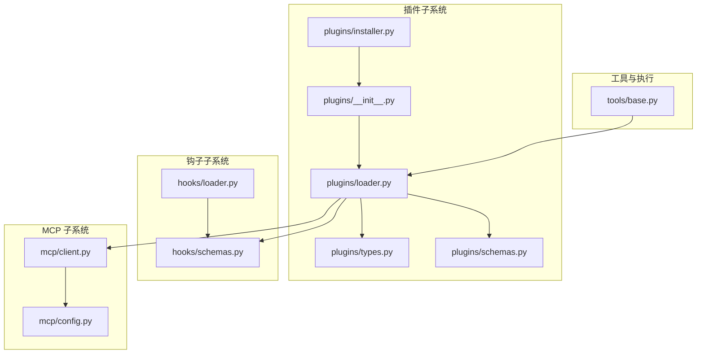
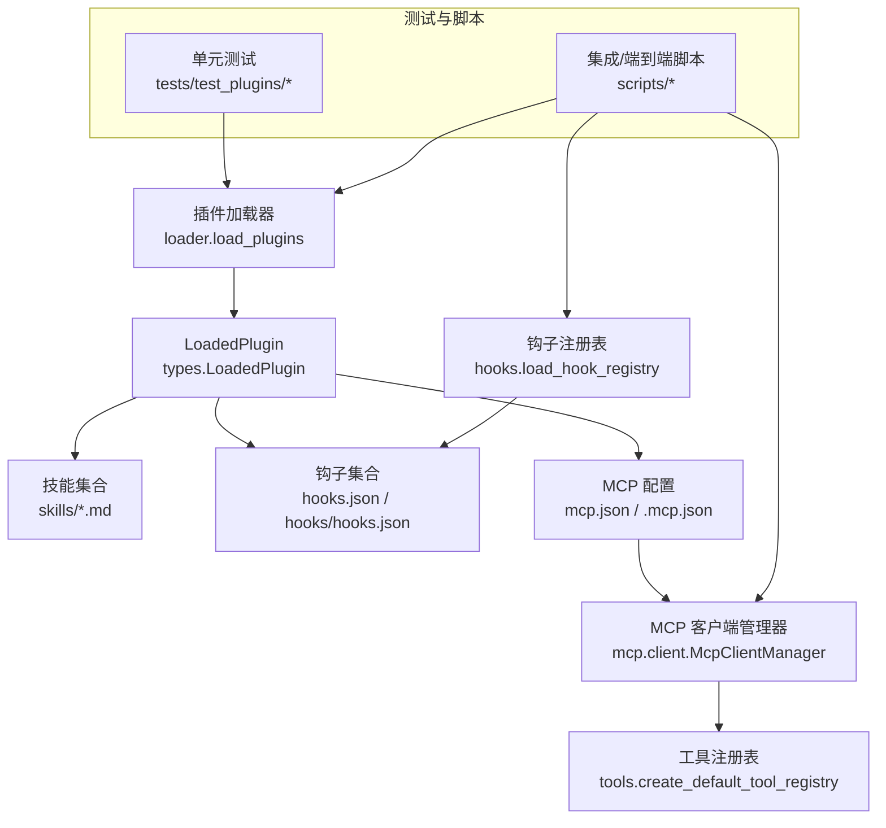
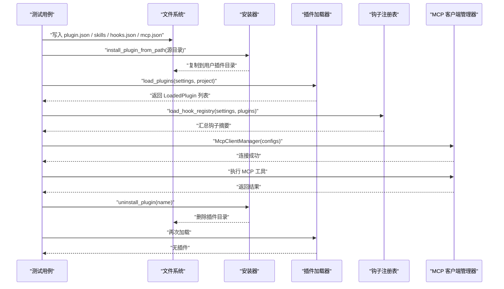
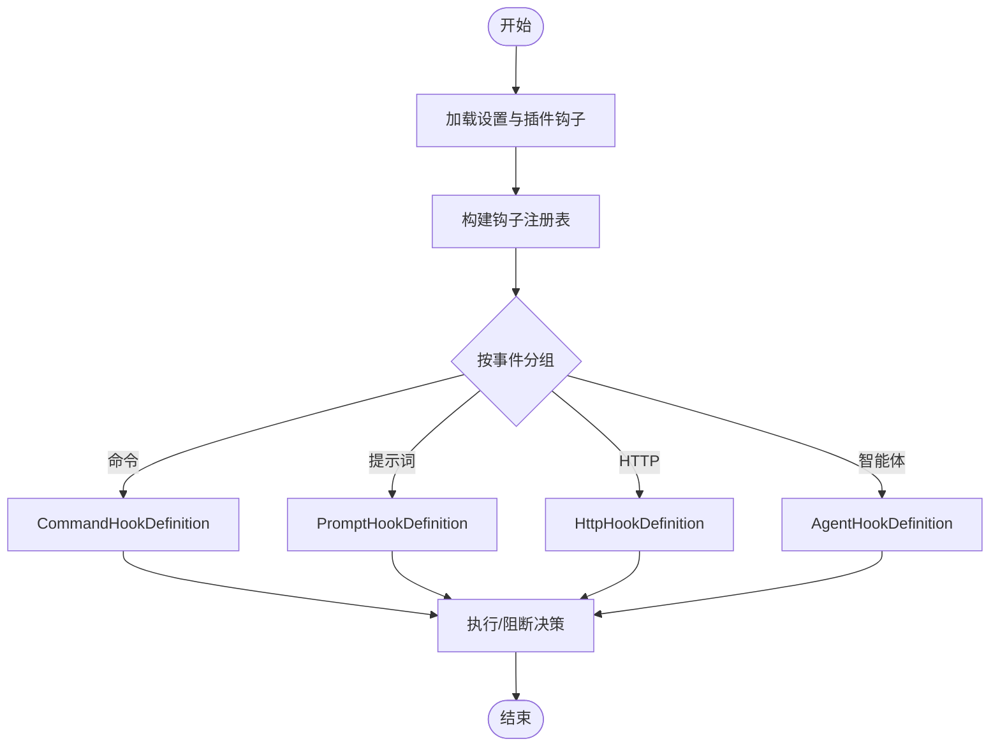
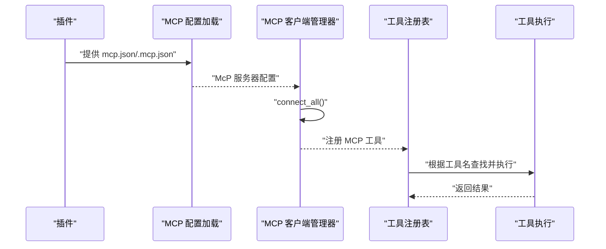
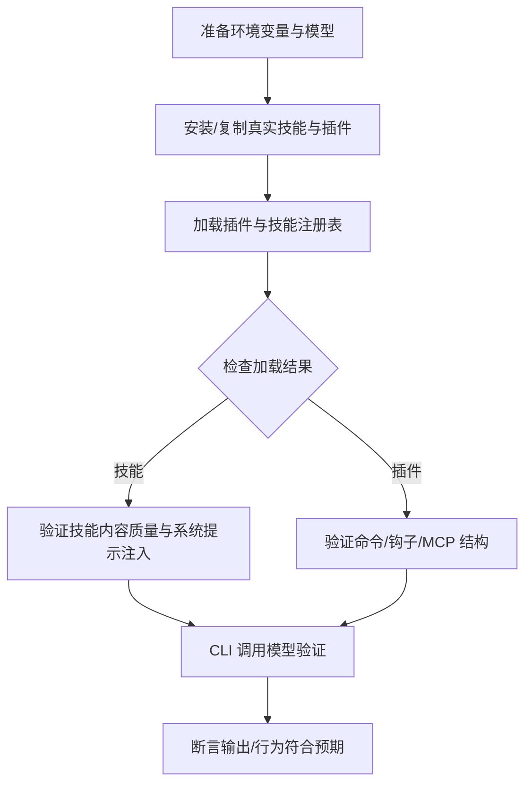
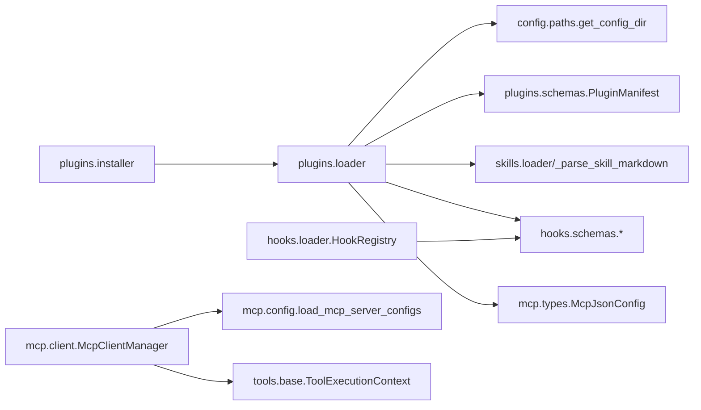

# 插件测试与调试

<cite>
**本文引用的文件**
- [README.md](file://README.md)
- [pyproject.toml](file://pyproject.toml)
- [src/openharness/plugins/__init__.py](file://src/openharness/plugins/__init__.py)
- [src/openharness/plugins/loader.py](file://src/openharness/plugins/loader.py)
- [src/openharness/plugins/types.py](file://src/openharness/plugins/types.py)
- [src/openharness/plugins/schemas.py](file://src/openharness/plugins/schemas.py)
- [src/openharness/plugins/installer.py](file://src/openharness/plugins/installer.py)
- [src/openharness/hooks/schemas.py](file://src/openharness/hooks/schemas.py)
- [src/openharness/hooks/loader.py](file://src/openharness/hooks/loader.py)
- [src/openharness/mcp/client.py](file://src/openharness/mcp/client.py)
- [src/openharness/mcp/config.py](file://src/openharness/mcp/config.py)
- [src/openharness/tools/base.py](file://src/openharness/tools/base.py)
- [tests/test_plugins/test_loader.py](file://tests/test_plugins/test_loader.py)
- [tests/test_plugins/test_lifecycle_flow.py](file://tests/test_plugins/test_lifecycle_flow.py)
- [tests/fixtures/fake_mcp_server.py](file://tests/fixtures/fake_mcp_server.py)
- [scripts/test_real_skills_plugins.py](file://scripts/test_real_skills_plugins.py)
- [scripts/test_harness_features.py](file://scripts/test_harness_features.py)
- [scripts/e2e_smoke.py](file://scripts/e2e_smoke.py)
- [scripts/local_system_scenarios.py](file://scripts/local_system_scenarios.py)
</cite>

## 目录
1. [简介](#简介)
2. [项目结构](#项目结构)
3. [核心组件](#核心组件)
4. [架构总览](#架构总览)
5. [详细组件分析](#详细组件分析)
6. [依赖关系分析](#依赖关系分析)
7. [性能考虑](#性能考虑)
8. [故障排查指南](#故障排查指南)
9. [结论](#结论)
10. [附录](#附录)

## 简介
本指南面向希望为 OpenHarness 插件体系编写测试与进行调试的开发者，系统阐述以下内容：
- 插件测试策略：单元测试、集成测试与端到端测试的实施要点
- 测试框架使用与测试用例编写规范（pytest、异步测试）
- 插件调试工具与技术（日志、断点、最小可复现样例）
- 插件生命周期测试方法（安装、加载、启用/禁用、卸载、MCP 集成）
- 常见问题诊断与解决思路
- 测试自动化与持续集成配置建议
- 性能测试与压力测试方法

## 项目结构
OpenHarness 的插件子系统由“清单解析、发现与加载、类型定义、安装器、钩子与 MCP 集成”等模块组成，并配套多套测试脚本覆盖单元、集成与端到端场景。

图表来源
- [src/openharness/plugins/__init__.py:1-54](file://src/openharness/plugins/__init__.py#L1-L54)
- [src/openharness/plugins/loader.py:1-195](file://src/openharness/plugins/loader.py#L1-L195)
- [src/openharness/plugins/types.py:1-33](file://src/openharness/plugins/types.py#L1-L33)
- [src/openharness/plugins/schemas.py:1-24](file://src/openharness/plugins/schemas.py#L1-L24)
- [src/openharness/plugins/installer.py:1-28](file://src/openharness/plugins/installer.py#L1-L28)
- [src/openharness/hooks/schemas.py:1-59](file://src/openharness/hooks/schemas.py#L1-L59)
- [src/openharness/hooks/loader.py:1-61](file://src/openharness/hooks/loader.py#L1-L61)
- [src/openharness/mcp/client.py](file://src/openharness/mcp/client.py)
- [src/openharness/mcp/config.py](file://src/openharness/mcp/config.py)
- [src/openharness/tools/base.py](file://src/openharness/tools/base.py)

章节来源
- [README.md: 插件兼容性与测试概览:213-232](file://README.md#L213-L232)
- [README.md: 测试结果与运行方式:282-298](file://README.md#L282-L298)

## 核心组件
- 插件清单与类型
  - 清单模型用于解析 plugin.json/.claude-plugin/plugin.json，字段包括名称、版本、描述、默认启用状态、技能/钩子/MCP 文件路径等。
  - 运行时 LoadedPlugin 聚合清单、路径、启用状态以及从插件贡献的技能、钩子、MCP 服务器与命令列表。
- 插件发现与加载
  - 用户与项目级插件目录发现；清单定位；技能、命令、代理、钩子、MCP 配置的加载与合并。
- 安装与卸载
  - 将源插件目录复制到用户插件目录；卸载删除对应目录。
- 钩子与 MCP 集成
  - 钩子定义支持命令、提示词、HTTP、智能体四类；钩子注册表按事件分组管理；MCP 客户端管理器负责连接与工具生成。

章节来源
- [src/openharness/plugins/schemas.py: 插件清单模型:8-24](file://src/openharness/plugins/schemas.py#L8-L24)
- [src/openharness/plugins/types.py: 运行时插件类型:14-33](file://src/openharness/plugins/types.py#L14-L33)
- [src/openharness/plugins/loader.py: 发现与加载逻辑:40-106](file://src/openharness/plugins/loader.py#L40-L106)
- [src/openharness/plugins/installer.py: 安装与卸载:11-28](file://src/openharness/plugins/installer.py#L11-L28)
- [src/openharness/hooks/schemas.py: 钩子定义模型:10-58](file://src/openharness/hooks/schemas.py#L10-L58)
- [src/openharness/hooks/loader.py: 钩子注册表:10-61](file://src/openharness/hooks/loader.py#L10-L61)
- [src/openharness/mcp/client.py: MCP 客户端管理](file://src/openharness/mcp/client.py)
- [src/openharness/mcp/config.py: MCP 配置加载](file://src/openharness/mcp/config.py)

## 架构总览
下图展示插件在系统中的位置与交互关系：插件通过 loader 加载，贡献技能、钩子与 MCP 服务器；钩子注册表统一管理；MCP 客户端管理器连接外部 MCP 服务；工具执行上下文贯穿生命周期。

图表来源
- [src/openharness/plugins/loader.py:53-106](file://src/openharness/plugins/loader.py#L53-L106)
- [src/openharness/hooks/loader.py:40-61](file://src/openharness/hooks/loader.py#L40-L61)
- [src/openharness/mcp/client.py](file://src/openharness/mcp/client.py)
- [tests/test_plugins/test_loader.py:14-83](file://tests/test_plugins/test_loader.py#L14-L83)
- [tests/test_plugins/test_lifecycle_flow.py:20-94](file://tests/test_plugins/test_lifecycle_flow.py#L20-L94)

## 详细组件分析

### 插件加载器与生命周期测试
- 单元测试要点
  - 在临时目录模拟插件树形结构，写入 plugin.json、技能 Markdown、hooks.json、mcp.json。
  - 断言：插件被发现与加载、技能与钩子被正确合并、MCP 服务器配置可用。
- 生命周期集成测试要点
  - 安装插件目录至用户插件区，加载后验证技能与 MCP 工具存在。
  - 启动 MCP 客户端管理器连接插件 MCP 服务，执行工具验证输出。
  - 卸载插件后确认不再加载。

图表来源
- [tests/test_plugins/test_loader.py:53-83](file://tests/test_plugins/test_loader.py#L53-L83)
- [tests/test_plugins/test_lifecycle_flow.py:54-94](file://tests/test_plugins/test_lifecycle_flow.py#L54-L94)
- [src/openharness/plugins/installer.py:11-28](file://src/openharness/plugins/installer.py#L11-L28)
- [src/openharness/plugins/loader.py:53-106](file://src/openharness/plugins/loader.py#L53-L106)
- [src/openharness/hooks/loader.py:40-61](file://src/openharness/hooks/loader.py#L40-L61)
- [src/openharness/mcp/client.py](file://src/openharness/mcp/client.py)

章节来源
- [tests/test_plugins/test_loader.py: 插件加载与合并测试:53-83](file://tests/test_plugins/test_loader.py#L53-L83)
- [tests/test_plugins/test_lifecycle_flow.py: 安装/加载/卸载与 MCP 集成:54-94](file://tests/test_plugins/test_lifecycle_flow.py#L54-L94)
- [tests/fixtures/fake_mcp_server.py: MCP 服务示例:10-21](file://tests/fixtures/fake_mcp_server.py#L10-L21)

### 钩子系统与安全钩子验证
- 钩子类型
  - 命令型：执行 shell 命令，支持超时与失败阻断。
  - 提示词型：请求模型校验条件，支持超时与失败阻断。
  - HTTP 型：向指定地址 POST 事件负载。
  - 智能体型：基于模型的深度校验。
- 注册与合并
  - settings 中的钩子与插件钩子共同注册到注册表，按事件分组。
- 实战验证
  - 使用真实插件（如 security-guidance）验证 PreToolUse 钩子结构与匹配器。

图表来源
- [src/openharness/hooks/schemas.py:10-58](file://src/openharness/hooks/schemas.py#L10-L58)
- [src/openharness/hooks/loader.py:40-61](file://src/openharness/hooks/loader.py#L40-L61)

章节来源
- [src/openharness/hooks/schemas.py: 钩子定义模型:10-58](file://src/openharness/hooks/schemas.py#L10-L58)
- [src/openharness/hooks/loader.py: 钩子注册与合并:40-61](file://src/openharness/hooks/loader.py#L40-L61)
- [scripts/test_real_skills_plugins.py: 钩子结构验证:241-264](file://scripts/test_real_skills_plugins.py#L241-L264)

### MCP 集成与工具调用
- MCP 配置加载
  - 从插件目录读取 mcp.json 或 .mcp.json，解析为 McpServerConfig 并注入工具注册表。
- 客户端管理
  - 创建 MCP 客户端管理器，建立连接，生成工具名（如 mcp__<plugin>_<server>_<method>），执行并返回结果。
- 测试要点
  - 使用小型 stdio MCP 服务作为桩，验证工具命名与输出一致性。

图表来源
- [src/openharness/plugins/loader.py:93-106](file://src/openharness/plugins/loader.py#L93-L106)
- [src/openharness/mcp/config.py](file://src/openharness/mcp/config.py)
- [src/openharness/mcp/client.py](file://src/openharness/mcp/client.py)
- [tests/test_plugins/test_lifecycle_flow.py:71-90](file://tests/test_plugins/test_lifecycle_flow.py#L71-L90)

章节来源
- [src/openharness/plugins/loader.py: MCP 配置加载:187-195](file://src/openharness/plugins/loader.py#L187-L195)
- [src/openharness/mcp/config.py: 配置接口](file://src/openharness/mcp/config.py)
- [src/openharness/mcp/client.py: 客户端接口](file://src/openharness/mcp/client.py)
- [tests/test_plugins/test_lifecycle_flow.py: MCP 工具执行:82-88](file://tests/test_plugins/test_lifecycle_flow.py#L82-L88)

### 端到端测试与真实插件/技能
- 真实技能与插件测试
  - 将官方 skills 仓库与 compatible 插件仓库复制到 OpenHarness 用户目录或项目插件目录，验证加载、命令发现、钩子结构、模型调用等。
- 系统特性端到端
  - 包含 API 重试、并行工具执行路径、路径权限与命令拒绝模式等真实场景验证。

图表来源
- [scripts/test_real_skills_plugins.py:50-302](file://scripts/test_real_skills_plugins.py#L50-L302)
- [scripts/test_harness_features.py:42-217](file://scripts/test_harness_features.py#L42-L217)

章节来源
- [scripts/test_real_skills_plugins.py: 真实技能与插件端到端:50-302](file://scripts/test_real_skills_plugins.py#L50-L302)
- [scripts/test_harness_features.py: 系统特性端到端:42-217](file://scripts/test_harness_features.py#L42-L217)

## 依赖关系分析
- 组件耦合
  - 插件加载器依赖配置路径、清单模型、技能解析器、钩子与 MCP 解析器。
  - 钩子注册表依赖钩子定义模型与事件枚举。
  - MCP 客户端管理器依赖 MCP 配置加载与工具注册表。
- 外部依赖
  - Pydantic 用于模型校验；pytest 及其 asyncio 插件用于测试；mcp 库用于 MCP 通信。

图表来源
- [src/openharness/plugins/loader.py:8-10](file://src/openharness/plugins/loader.py#L8-L10)
- [src/openharness/plugins/schemas.py:8-24](file://src/openharness/plugins/schemas.py#L8-L24)
- [src/openharness/hooks/loader.py:10-19](file://src/openharness/hooks/loader.py#L10-L19)
- [src/openharness/hooks/schemas.py:10-58](file://src/openharness/hooks/schemas.py#L10-L58)
- [src/openharness/mcp/client.py](file://src/openharness/mcp/client.py)
- [src/openharness/mcp/config.py](file://src/openharness/mcp/config.py)
- [src/openharness/tools/base.py](file://src/openharness/tools/base.py)

章节来源
- [pyproject.toml: 依赖与开发依赖:15-38](file://pyproject.toml#L15-L38)

## 性能考虑
- 插件发现与加载
  - 插件目录遍历与 JSON 解析次数较多，建议在 CI 中缓存用户插件目录，减少重复扫描。
- 钩子执行
  - 命令型与提示词型钩子可能引入延迟，应合理设置超时与阻断策略，避免影响主流程。
- MCP 连接
  - 多服务器连接与并发工具调用需注意资源占用，建议在测试中限制并发度并监控内存与 CPU。
- 端到端测试
  - 真实模型调用成本高，建议在本地快速测试后，再在 CI 中运行少量代表性用例。

## 故障排查指南
- 插件未被发现
  - 确认清单文件路径：plugin.json 或 .claude-plugin/plugin.json 是否存在。
  - 确认插件目录结构：skills、commands、agents、hooks、mcp.json 是否按约定放置。
- 钩子不生效
  - 检查 hooks.json 或 hooks/hooks.json 的结构是否符合钩子定义模型。
  - 确认事件名称与匹配器是否正确。
- MCP 工具不可用
  - 检查 mcp.json/.mcp.json 的语法与服务器配置。
  - 确保 MCP 服务可启动且工具方法名与签名一致。
- 权限导致工具失败
  - 检查路径规则与命令拒绝列表，必要时调整权限模式。
- 真实插件/技能测试失败
  - 确认环境变量（如模型、鉴权）已正确设置。
  - 检查网络连通性与速率限制。

章节来源
- [src/openharness/plugins/loader.py: 清单与目录发现:29-50](file://src/openharness/plugins/loader.py#L29-L50)
- [src/openharness/hooks/schemas.py: 钩子定义字段约束:10-58](file://src/openharness/hooks/schemas.py#L10-L58)
- [src/openharness/mcp/config.py: 配置加载入口](file://src/openharness/mcp/config.py)
- [scripts/test_real_skills_plugins.py: 环境与断言:30-35](file://scripts/test_real_skills_plugins.py#L30-L35)

## 结论
通过单元测试确保插件发现与加载的正确性，借助生命周期集成测试覆盖安装/加载/卸载与 MCP 集成，再以端到端脚本验证真实技能与插件在系统中的表现，可形成完整的插件测试闭环。配合合理的性能与故障排查策略，能够稳定地扩展与维护插件生态。

## 附录

### 测试框架与用例编写规范
- 测试运行
  - 使用 pytest 与 asyncio 模式运行异步测试。
- 用例组织
  - 单元测试：针对 loader、schemas、installer 等模块的边界行为。
  - 集成测试：组合插件生命周期与 MCP 工具执行。
  - 端到端：真实技能与插件加载、系统提示注入、模型调用。
- 断言建议
  - 对清单字段、技能数量与内容长度、钩子事件与匹配器、MCP 工具输出进行断言。
- 异常处理
  - 对 JSON 解析错误、文件不存在、MCP 连接失败等情况进行捕获与断言。

章节来源
- [pyproject.toml: pytest 配置:47-49](file://pyproject.toml#L47-L49)
- [tests/test_plugins/test_loader.py: 断言示例:60-83](file://tests/test_plugins/test_loader.py#L60-L83)
- [tests/test_plugins/test_lifecycle_flow.py: 异步断言示例:66-94](file://tests/test_plugins/test_lifecycle_flow.py#L66-L94)

### 测试自动化与持续集成配置示例
- 基本步骤
  - 安装依赖与开发依赖。
  - 运行 pytest 执行单元与集成测试。
  - 运行端到端脚本（可选）。
- CI 建议
  - 分阶段执行：先单元/集成，再端到端；端到端仅在受控环境下运行。
  - 缓存用户插件目录与技能目录，减少重复下载。
  - 为真实模型调用设置环境变量与速率限制。

章节来源
- [README.md: 测试运行命令:293-298](file://README.md#L293-L298)
- [pyproject.toml: 开发依赖:30-38](file://pyproject.toml#L30-L38)

### 性能测试与压力测试方法
- 插件数量与加载时间
  - 在临时目录批量创建插件，记录加载耗时，评估线性复杂度。
- 并发工具调用
  - 使用工具注册表并发执行多个 MCP 工具，观察响应时间与资源占用。
- 端到端压力
  - 以短时循环调用 CLI 触发模型推理，统计成功率与平均耗时。

章节来源
- [scripts/test_harness_features.py: 并行工具路径验证:140-152](file://scripts/test_harness_features.py#L140-L152)
- [scripts/e2e_smoke.py: 端到端场景:166-312](file://scripts/e2e_smoke.py#L166-L312)