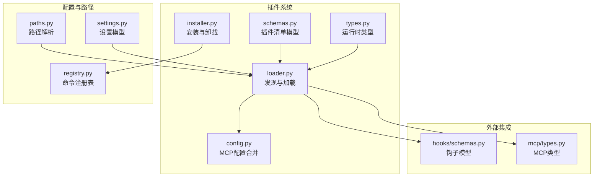
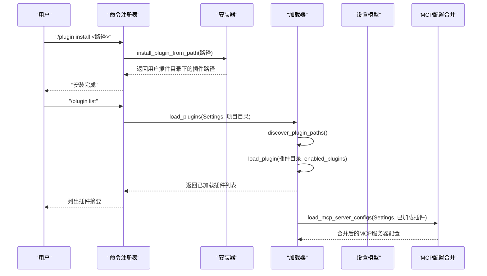
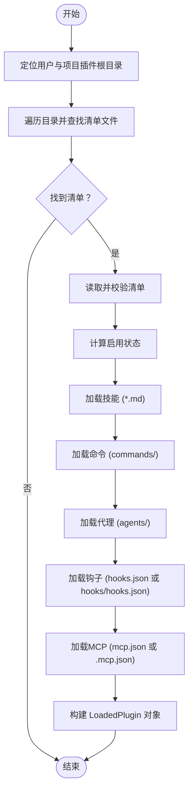
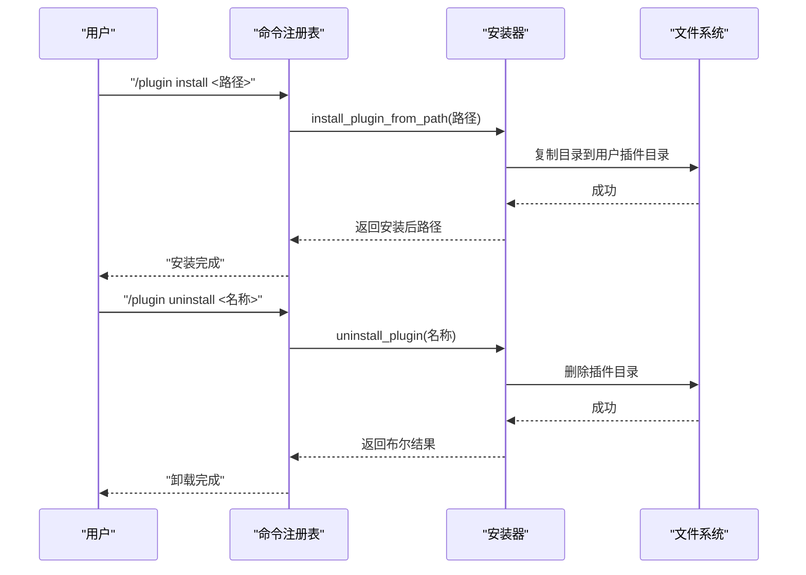
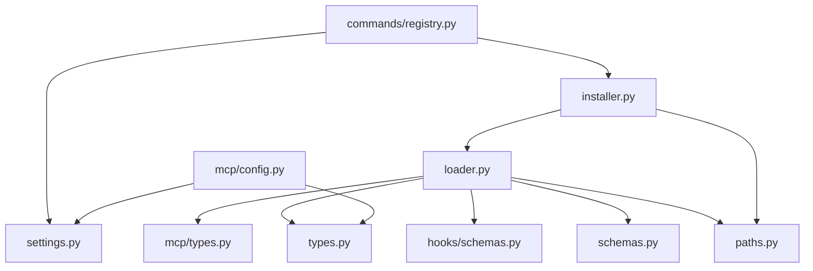

# 插件项目结构与配置

<cite>
**本文档引用的文件**
- [schemas.py](file://src/openharness/plugins/schemas.py)
- [types.py](file://src/openharness/plugins/types.py)
- [loader.py](file://src/openharness/plugins/loader.py)
- [installer.py](file://src/openharness/plugins/installer.py)
- [paths.py](file://src/openharness/config/paths.py)
- [settings.py](file://src/openharness/config/settings.py)
- [registry.py](file://src/openharness/commands/registry.py)
- [config.py](file://src/openharness/mcp/config.py)
- [types.py](file://src/openharness/mcp/types.py)
- [schemas.py](file://src/openharness/hooks/schemas.py)
- [test_loader.py](file://tests/test_plugins/test_loader.py)
- [test_lifecycle_flow.py](file://tests/test_plugins/test_lifecycle_flow.py)
- [README.md](file://README.md)
</cite>

## 目录
1. [简介](#简介)
2. [项目结构](#项目结构)
3. [核心组件](#核心组件)
4. [架构总览](#架构总览)
5. [详细组件分析](#详细组件分析)
6. [依赖关系分析](#依赖关系分析)
7. [性能考虑](#性能考虑)
8. [故障排除指南](#故障排除指南)
9. [结论](#结论)
10. [附录](#附录)

## 简介
本指南面向希望在 OpenHarness 中开发、安装与管理插件的开发者，系统讲解插件项目结构、清单文件 plugin.json 的字段定义与配置选项、安装与发现机制、以及版本管理与兼容性策略。文档基于仓库中实际实现进行说明，并提供可操作的最佳实践。

## 项目结构
OpenHarness 的插件系统位于 src/openharness/plugins 目录下，核心由以下模块组成：
- 清单模型：定义插件清单的字段与默认值
- 运行时类型：封装已加载插件及其贡献内容
- 发现与加载：扫描用户与项目级插件目录，解析清单与资源
- 安装与卸载：将插件目录复制到用户插件目录或移除
- 配置与路径：确定配置目录、数据目录与插件目录位置
- 设置模型：支持通过设置文件控制插件启用状态与 MCP 配置
- 命令注册表：提供 /plugin 子命令用于列表、启用、禁用、安装、卸载插件
- MCP 配置合并：将设置与插件提供的 MCP 配置合并为运行时配置

图表来源
- [schemas.py:8-24](file://src/openharness/plugins/schemas.py#L8-L24)
- [types.py:14-33](file://src/openharness/plugins/types.py#L14-L33)
- [loader.py:15-50](file://src/openharness/plugins/loader.py#L15-L50)
- [installer.py:11-27](file://src/openharness/plugins/installer.py#L11-L27)
- [paths.py:15-35](file://src/openharness/config/paths.py#L15-L35)
- [settings.py:49-64](file://src/openharness/config/settings.py#L49-L64)
- [registry.py:902-922](file://src/openharness/commands/registry.py#L902-L922)
- [config.py:8-16](file://src/openharness/mcp/config.py#L8-L16)
- [schemas.py:10-58](file://src/openharness/hooks/schemas.py#L10-L58)
- [types.py:40-44](file://src/openharness/mcp/types.py#L40-L44)

章节来源
- [schemas.py:1-24](file://src/openharness/plugins/schemas.py#L1-L24)
- [types.py:1-33](file://src/openharness/plugins/types.py#L1-L33)
- [loader.py:1-195](file://src/openharness/plugins/loader.py#L1-L195)
- [installer.py:1-28](file://src/openharness/plugins/installer.py#L1-L28)
- [paths.py:1-117](file://src/openharness/config/paths.py#L1-L117)
- [settings.py:1-161](file://src/openharness/config/settings.py#L1-L161)
- [registry.py:902-922](file://src/openharness/commands/registry.py#L902-L922)
- [config.py:1-16](file://src/openharness/mcp/config.py#L1-L16)
- [schemas.py:1-59](file://src/openharness/hooks/schemas.py#L1-L59)
- [types.py:1-77](file://src/openharness/mcp/types.py#L1-L77)

## 核心组件
本节聚焦插件清单模型与运行时类型，解释各字段的含义、默认值与作用范围。

- 插件清单模型（PluginManifest）
  - 字段与默认值
    - name: 插件名称，必填
    - version: 版本，默认 "0.0.0"
    - description: 描述，默认 ""
    - enabled_by_default: 是否默认启用，默认 True
    - skills_dir: 技能目录名，默认 "skills"
    - hooks_file: 钩子配置文件名，默认 "hooks.json"
    - mcp_file: MCP 配置文件名，默认 "mcp.json"
    - 扩展字段（可选）：author、commands、agents、skills、hooks
  - 用途：作为插件清单的结构化定义，用于校验与序列化

- 运行时类型（LoadedPlugin）
  - 封装已加载插件与其贡献内容
  - 包含字段：manifest、path、enabled、skills、hooks、mcp_servers、commands
  - 属性：name、description 来源于 manifest

章节来源
- [schemas.py:8-24](file://src/openharness/plugins/schemas.py#L8-L24)
- [types.py:14-33](file://src/openharness/plugins/types.py#L14-L33)

## 架构总览
OpenHarness 的插件系统遵循“清单驱动 + 资源发现”的模式：
- 清单文件 plugin.json 决定插件的基本元信息与资源定位
- 加载器从用户与项目目录发现插件，读取清单并解析技能、钩子、MCP 配置
- 设置模型控制插件启用状态与 MCP 服务器配置
- 命令注册表提供插件生命周期管理命令

图表来源
- [registry.py:902-922](file://src/openharness/commands/registry.py#L902-L922)
- [installer.py:11-18](file://src/openharness/plugins/installer.py#L11-L18)
- [loader.py:53-106](file://src/openharness/plugins/loader.py#L53-L106)
- [config.py:8-16](file://src/openharness/mcp/config.py#L8-L16)

## 详细组件分析

### 插件清单文件 plugin.json 字段详解
- name
  - 类型：字符串
  - 必填：是
  - 作用：唯一标识插件，影响工具命名与 MCP 命名空间
- version
  - 类型：字符串
  - 默认值："0.0.0"
  - 作用：版本号，便于兼容性判断与更新提示
- description
  - 类型：字符串
  - 默认值：""
  - 作用：插件功能简述，用于 UI 展示与帮助
- enabled_by_default
  - 类型：布尔
  - 默认值：True
  - 作用：控制插件是否在未显式配置时自动启用
- skills_dir
  - 类型：字符串
  - 默认值："skills"
  - 作用：插件技能 Markdown 文件所在目录名
- hooks_file
  - 类型：字符串
  - 默认值："hooks.json"
  - 作用：插件钩子配置文件名；若存在 hooks/hooks.json 结构化格式则优先使用
- mcp_file
  - 类型：字符串
  - 默认值："mcp.json"
  - 作用：插件 MCP 服务器配置文件名；若存在 .mcp.json 则优先使用
- author、commands、agents、skills、hooks
  - 类型：可选对象/数组/字符串
  - 作用：扩展字段，用于声明作者信息、命令、代理、技能与钩子等

章节来源
- [schemas.py:8-24](file://src/openharness/plugins/schemas.py#L8-L24)

### 插件发现与加载流程
- 插件目录定位
  - 用户插件目录：配置目录下的 plugins 子目录
  - 项目插件目录：项目根目录下的 .openharness/plugins 子目录
- 清单文件查找
  - 支持两种位置：plugin.json 或 .claude-plugin/plugin.json
- 资源加载
  - 技能：从 skills_dir 下的 *.md 文件加载
  - 命令：从 commands/ 目录加载（若存在）
  - 代理：从 agents/ 目录加载（若存在）
  - 钩子：优先从 hooks_file 指定的 hooks.json 加载；若不存在，则尝试 hooks/hooks.json 结构化格式
  - MCP：优先从 mcp_file 指定的 mcp.json 加载；若不存在，则尝试 .mcp.json
- 插件启用状态
  - 以设置中的 enabled_plugins 为准；若未配置，则采用清单中的 enabled_by_default

图表来源
- [loader.py:40-106](file://src/openharness/plugins/loader.py#L40-L106)
- [loader.py:29-37](file://src/openharness/plugins/loader.py#L29-L37)
- [loader.py:63-106](file://src/openharness/plugins/loader.py#L63-L106)

章节来源
- [loader.py:15-50](file://src/openharness/plugins/loader.py#L15-L50)
- [loader.py:29-37](file://src/openharness/plugins/loader.py#L29-L37)
- [loader.py:63-106](file://src/openharness/plugins/loader.py#L63-L106)

### 插件安装与卸载机制
- 安装
  - 将源插件目录复制到用户插件目录，目标名为源目录名
  - 若目标已存在则先删除再复制
- 卸载
  - 删除用户插件目录下的对应插件目录
- 命令行支持
  - /plugin install <路径>：安装插件
  - /plugin uninstall <名称>：卸载插件
  - /plugin enable/disable <名称>：启用/禁用插件（需重启会话生效）

图表来源
- [registry.py:902-922](file://src/openharness/commands/registry.py#L902-L922)
- [installer.py:11-27](file://src/openharness/plugins/installer.py#L11-L27)

章节来源
- [installer.py:1-28](file://src/openharness/plugins/installer.py#L1-L28)
- [registry.py:902-922](file://src/openharness/commands/registry.py#L902-L922)

### 配置与路径解析
- 配置目录
  - 默认：~/.openharness/
  - 可通过环境变量覆盖
- 数据目录、日志目录、任务输出目录等均基于配置目录派生
- 插件目录
  - 用户插件：配置目录/plugins
  - 项目插件：项目/.openharness/plugins

章节来源
- [paths.py:15-35](file://src/openharness/config/paths.py#L15-L35)
- [paths.py:37-117](file://src/openharness/config/paths.py#L37-L117)

### 设置模型与插件启用控制
- enabled_plugins
  - 类型：字典，键为插件名，值为布尔
  - 作用：持久化控制插件启用状态
- mcp_servers
  - 类型：字典，键为服务器名，值为 MCP 配置
  - 作用：全局 MCP 服务器配置
- 加载插件时，若设置中存在该插件名，则以其为准；否则采用清单中的 enabled_by_default

章节来源
- [settings.py:49-64](file://src/openharness/config/settings.py#L49-L64)
- [loader.py:63-72](file://src/openharness/plugins/loader.py#L63-L72)

### MCP 配置合并
- 将设置中的 mcp_servers 与插件提供的 MCP 配置合并
- 插件 MCP 服务器命名空间为：{插件名}:{服务器名}
- 仅对启用的插件生效

章节来源
- [config.py:8-16](file://src/openharness/mcp/config.py#L8-L16)

### 钩子与技能加载
- 钩子
  - 支持 hooks.json 与 hooks/hooks.json 两种格式
  - 结构化格式中可使用 ${CLAUDE_PLUGIN_ROOT} 占位符替换为插件根路径
- 技能
  - 从 skills_dir 下的 *.md 文件加载，解析标题与内容生成技能定义
  - 命令与代理目录（commands、agents）下的 *.md 文件也会被识别为技能

章节来源
- [loader.py:87-125](file://src/openharness/plugins/loader.py#L87-L125)
- [loader.py:128-184](file://src/openharness/plugins/loader.py#L128-L184)
- [schemas.py:10-58](file://src/openharness/hooks/schemas.py#L10-L58)

## 依赖关系分析
- 组件耦合
  - 加载器依赖路径解析、清单模型、运行时类型、钩子与 MCP 类型
  - 安装器依赖路径解析与文件系统操作
  - 命令注册表依赖安装器与设置模型
  - MCP 配置合并依赖设置模型与运行时类型
- 外部依赖
  - Pydantic 用于数据校验与序列化
  - 标准库 pathlib、json、shutil 等

图表来源
- [loader.py:8-12](file://src/openharness/plugins/loader.py#L8-L12)
- [installer.py:8-8](file://src/openharness/plugins/installer.py#L8-L8)
- [registry.py:902-922](file://src/openharness/commands/registry.py#L902-L922)
- [config.py:5-15](file://src/openharness/mcp/config.py#L5-L15)

章节来源
- [loader.py:1-195](file://src/openharness/plugins/loader.py#L1-L195)
- [installer.py:1-28](file://src/openharness/plugins/installer.py#L1-L28)
- [registry.py:902-922](file://src/openharness/commands/registry.py#L902-L922)
- [config.py:1-16](file://src/openharness/mcp/config.py#L1-L16)

## 性能考虑
- 插件发现与加载
  - 仅在启动或命令触发时执行，避免频繁 IO
  - 使用迭代器与 glob 匹配，按序处理，减少内存占用
- 资源解析
  - 技能与钩子按需解析，避免不必要的计算
- MCP 合并
  - 仅合并启用插件的配置，降低运行时开销

## 故障排除指南
- 插件未被发现
  - 确认清单文件位于 plugin.json 或 .claude-plugin/plugin.json
  - 确认插件目录为可读且包含清单文件
- 插件未启用
  - 检查设置文件中的 enabled_plugins 是否包含该插件名
  - 若未设置，确认清单中的 enabled_by_default 是否为期望值
- 钩子不生效
  - 确认 hooks.json 或 hooks/hooks.json 格式正确
  - 若使用结构化格式，检查 ${CLAUDE_PLUGIN_ROOT} 替换逻辑
- MCP 服务器不可用
  - 检查 mcp.json 或 .mcp.json 格式与字段
  - 确认 MCP 配置合并后命名空间正确
- 安装/卸载失败
  - 检查用户插件目录权限
  - 确认目标插件目录是否存在冲突

章节来源
- [loader.py:29-37](file://src/openharness/plugins/loader.py#L29-L37)
- [loader.py:63-72](file://src/openharness/plugins/loader.py#L63-L72)
- [loader.py:128-184](file://src/openharness/plugins/loader.py#L128-L184)
- [installer.py:11-27](file://src/openharness/plugins/installer.py#L11-L27)

## 结论
OpenHarness 的插件系统以清单驱动为核心，结合灵活的资源发现与配置合并机制，实现了对命令、钩子、代理与 MCP 服务器的统一管理。通过明确的目录约定与默认值，开发者可以快速构建兼容的插件项目，并借助命令行工具完成安装、启用与卸载的全生命周期管理。

## 附录

### 插件项目结构模板
- 插件根目录
  - plugin.json：插件清单
  - skills/：技能 Markdown 文件（默认目录名可配置）
  - hooks.json：钩子配置（默认文件名可配置）
  - hooks/：结构化钩子配置（可选）
  - mcp.json：MCP 服务器配置（默认文件名可配置）
  - .mcp.json：备用 MCP 配置（可选）
  - commands/：命令技能（可选）
  - agents/：代理技能（可选）

章节来源
- [loader.py:74-96](file://src/openharness/plugins/loader.py#L74-L96)
- [schemas.py:15-17](file://src/openharness/plugins/schemas.py#L15-L17)

### 完整 plugin.json 字段说明与默认值
- name：字符串，必填
- version：字符串，默认 "0.0.0"
- description：字符串，默认 ""
- enabled_by_default：布尔，默认 True
- skills_dir：字符串，默认 "skills"
- hooks_file：字符串，默认 "hooks.json"
- mcp_file：字符串，默认 "mcp.json"
- author、commands、agents、skills、hooks：可选扩展字段

章节来源
- [schemas.py:11-24](file://src/openharness/plugins/schemas.py#L11-L24)

### 插件安装与发现机制
- 本地安装
  - 使用 /plugin install <路径> 将插件复制到用户插件目录
- 远程安装
  - 先克隆/下载插件到本地，再使用上述命令安装
- 发现顺序
  - 用户插件目录优先于项目插件目录
  - 清单文件优先级：plugin.json > .claude-plugin/plugin.json

章节来源
- [registry.py:912-914](file://src/openharness/commands/registry.py#L912-L914)
- [loader.py:40-50](file://src/openharness/plugins/loader.py#L40-L50)
- [loader.py:29-37](file://src/openharness/plugins/loader.py#L29-L37)

### 版本管理与兼容性建议
- 版本号
  - 使用语义化版本（如 MAJOR.MINOR.PATCH），便于兼容性判断
- 兼容性处理
  - 通过设置文件覆盖插件启用状态，避免破坏性变更影响全局
  - 在钩子与 MCP 配置中使用稳定的命名空间，避免冲突
- 最佳实践
  - 提供清晰的 description 与 author 信息
  - 将资源文件组织在默认目录内，减少自定义路径带来的复杂度
  - 在 hooks/hooks.json 中使用 ${CLAUDE_PLUGIN_ROOT} 占位符，提升可移植性

章节来源
- [settings.py:63-64](file://src/openharness/config/settings.py#L63-L64)
- [loader.py:175-177](file://src/openharness/plugins/loader.py#L175-L177)
- [README.md:343-356](file://README.md#L343-L356)