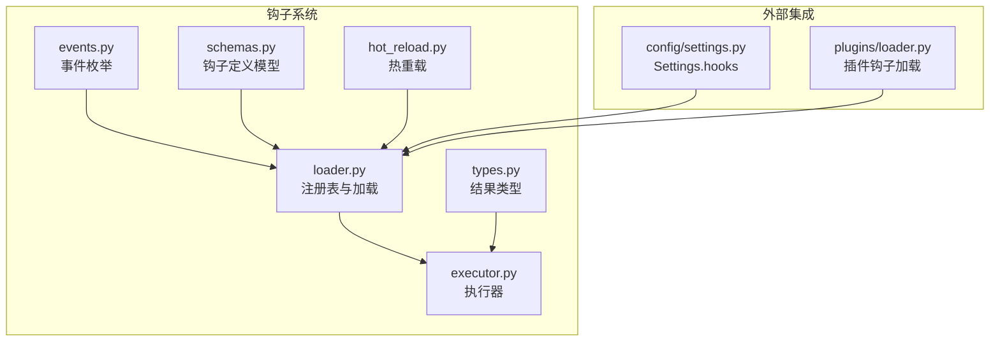
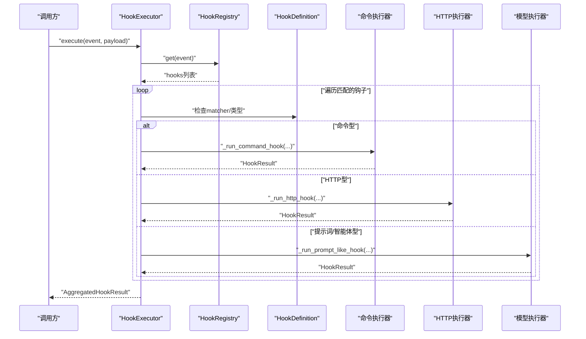
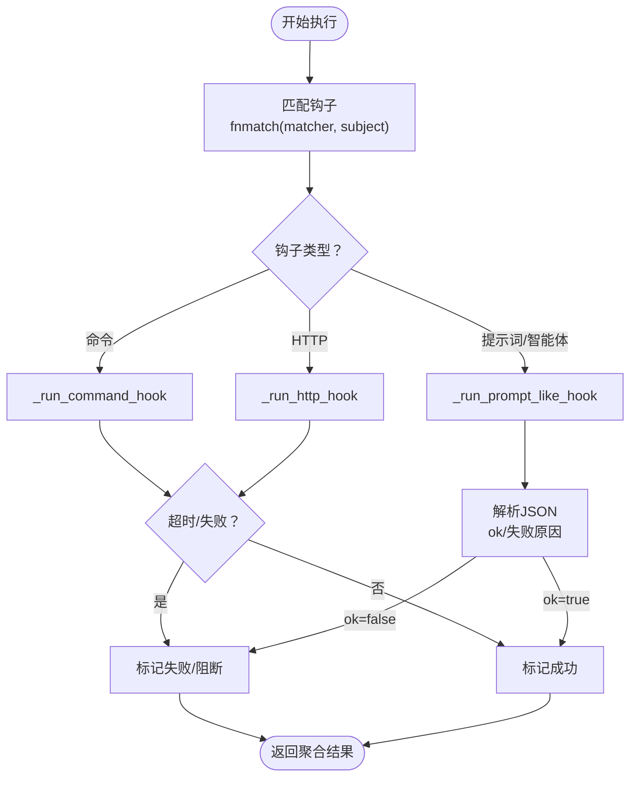
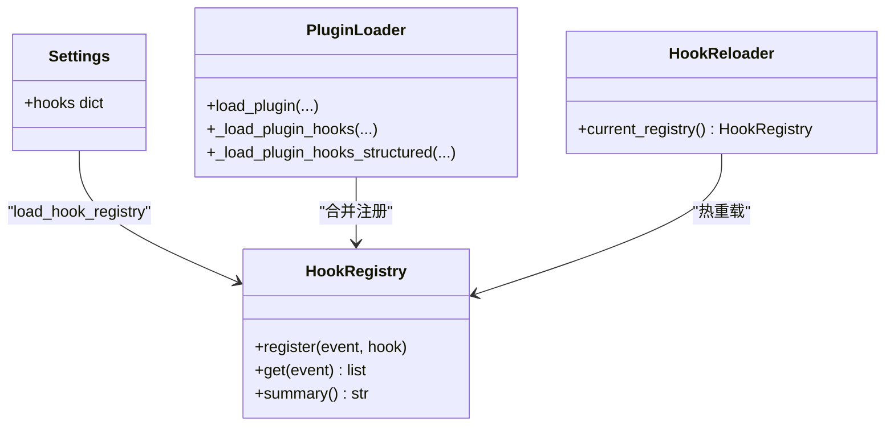
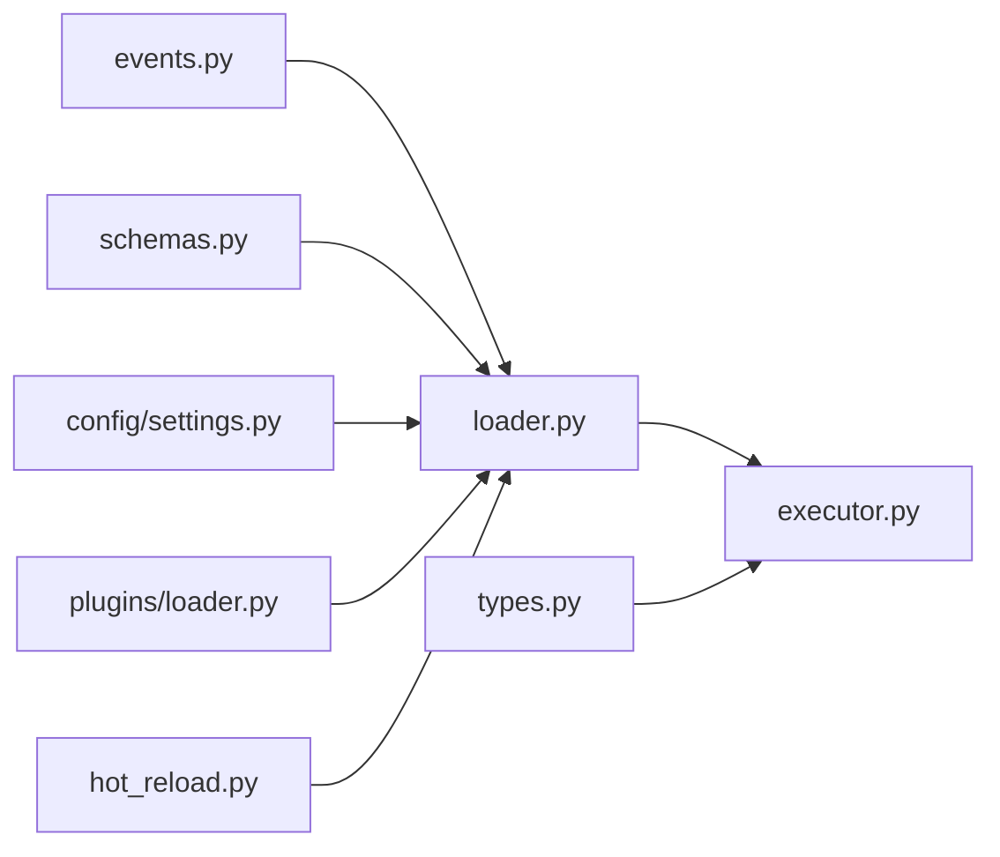

# 钩子系统开发

<cite>
**本文引用的文件**
- [src/openharness/hooks/__init__.py](file://src/openharness/hooks/__init__.py)
- [src/openharness/hooks/events.py](file://src/openharness/hooks/events.py)
- [src/openharness/hooks/executor.py](file://src/openharness/hooks/executor.py)
- [src/openharness/hooks/loader.py](file://src/openharness/hooks/loader.py)
- [src/openharness/hooks/types.py](file://src/openharness/hooks/types.py)
- [src/openharness/hooks/schemas.py](file://src/openharness/hooks/schemas.py)
- [src/openharness/hooks/hot_reload.py](file://src/openharness/hooks/hot_reload.py)
- [src/openharness/plugins/loader.py](file://src/openharness/plugins/loader.py)
- [src/openharness/config/settings.py](file://src/openharness/config/settings.py)
- [tests/test_hooks/test_executor.py](file://tests/test_hooks/test_executor.py)
</cite>

## 目录
1. [简介](#简介)
2. [项目结构](#项目结构)
3. [核心组件](#核心组件)
4. [架构总览](#架构总览)
5. [详细组件分析](#详细组件分析)
6. [依赖分析](#依赖分析)
7. [性能考虑](#性能考虑)
8. [故障排查指南](#故障排查指南)
9. [结论](#结论)
10. [附录](#附录)

## 简介
本指南面向希望在 OpenHarness 中开发与集成钩子（Hooks）的开发者。文档从系统工作原理与生命周期出发，系统讲解事件钩子与执行钩子的类型与用途，给出钩子函数编写规范与参数约定，阐明注册与加载机制、执行顺序与优先级控制策略，并提供可操作的开发示例、调试与测试方法，以及与插件系统的集成方式。

## 项目结构
钩子系统位于 src/openharness/hooks 目录，围绕“事件枚举、定义模型、注册表、执行器、结果类型、热重载”等模块协同工作；同时通过配置与插件系统实现“从设置文件与插件目录加载钩子”的能力。

图表来源
- [src/openharness/hooks/events.py:1-15](file://src/openharness/hooks/events.py#L1-L15)
- [src/openharness/hooks/schemas.py:1-59](file://src/openharness/hooks/schemas.py#L1-L59)
- [src/openharness/hooks/loader.py:1-61](file://src/openharness/hooks/loader.py#L1-L61)
- [src/openharness/hooks/executor.py:1-217](file://src/openharness/hooks/executor.py#L1-L217)
- [src/openharness/hooks/types.py:1-39](file://src/openharness/hooks/types.py#L1-L39)
- [src/openharness/hooks/hot_reload.py:1-32](file://src/openharness/hooks/hot_reload.py#L1-L32)
- [src/openharness/config/settings.py:1-161](file://src/openharness/config/settings.py#L1-L161)
- [src/openharness/plugins/loader.py:1-195](file://src/openharness/plugins/loader.py#L1-L195)

章节来源
- [src/openharness/hooks/__init__.py:1-51](file://src/openharness/hooks/__init__.py#L1-L51)
- [src/openharness/hooks/events.py:1-15](file://src/openharness/hooks/events.py#L1-L15)
- [src/openharness/hooks/schemas.py:1-59](file://src/openharness/hooks/schemas.py#L1-L59)
- [src/openharness/hooks/loader.py:1-61](file://src/openharness/hooks/loader.py#L1-L61)
- [src/openharness/hooks/executor.py:1-217](file://src/openharness/hooks/executor.py#L1-L217)
- [src/openharness/hooks/types.py:1-39](file://src/openharness/hooks/types.py#L1-L39)
- [src/openharness/hooks/hot_reload.py:1-32](file://src/openharness/hooks/hot_reload.py#L1-L32)
- [src/openharness/config/settings.py:1-161](file://src/openharness/config/settings.py#L1-L161)
- [src/openharness/plugins/loader.py:1-195](file://src/openharness/plugins/loader.py#L1-L195)

## 核心组件
- 事件枚举：定义可触发钩子的生命周期事件集合。
- 定义模型：描述不同类型的钩子（命令、HTTP、提示词、智能体）及其字段约束。
- 注册表：按事件分组存储钩子列表，支持汇总与查询。
- 执行器：根据事件与负载匹配钩子，异步执行并聚合结果。
- 结果类型：单次与聚合结果的数据结构，含是否阻断、原因、元数据。
- 热重载：基于设置文件时间戳变更自动重新加载钩子注册表。
- 加载入口：从 Settings 与插件中合并加载钩子定义。

章节来源
- [src/openharness/hooks/events.py:8-15](file://src/openharness/hooks/events.py#L8-L15)
- [src/openharness/hooks/schemas.py:10-58](file://src/openharness/hooks/schemas.py#L10-L58)
- [src/openharness/hooks/loader.py:10-38](file://src/openharness/hooks/loader.py#L10-L38)
- [src/openharness/hooks/executor.py:29-64](file://src/openharness/hooks/executor.py#L29-L64)
- [src/openharness/hooks/types.py:9-39](file://src/openharness/hooks/types.py#L9-L39)
- [src/openharness/hooks/hot_reload.py:11-32](file://src/openharness/hooks/hot_reload.py#L11-L32)
- [src/openharness/hooks/loader.py:40-60](file://src/openharness/hooks/loader.py#L40-L60)

## 架构总览
钩子系统采用“事件驱动 + 多类型执行器”的设计：事件由上层业务触发，执行器按事件查找注册表中的钩子，逐个执行并收集结果；结果中可指示是否阻断后续流程。

图表来源
- [src/openharness/hooks/executor.py:49-63](file://src/openharness/hooks/executor.py#L49-L63)
- [src/openharness/hooks/loader.py:20-22](file://src/openharness/hooks/loader.py#L20-L22)
- [src/openharness/hooks/executor.py:65-115](file://src/openharness/hooks/executor.py#L65-L115)
- [src/openharness/hooks/executor.py:117-146](file://src/openharness/hooks/executor.py#L117-L146)
- [src/openharness/hooks/executor.py:148-191](file://src/openharness/hooks/executor.py#L148-L191)

## 详细组件分析

### 事件与生命周期
- 支持事件：会话开始、会话结束、工具使用前、工具使用后。
- 触发时机：由上层业务在相应生命周期节点调用执行器。
- 命名约定：事件值为小写字符串，便于与配置键一致。

章节来源
- [src/openharness/hooks/events.py:8-15](file://src/openharness/hooks/events.py#L8-L15)

### 钩子类型与用途
- 命令型钩子：在受控环境中执行 shell 命令，适合审计日志、环境准备、告警通知等。
- HTTP 型钩子：向远端服务上报事件与负载，适合安全审计、外部联动。
- 提示词型钩子：通过模型判断是否允许继续，适合策略校验与合规检查。
- 智能体型钩子：更深入地推理与决策，适合复杂规则与上下文理解。

章节来源
- [src/openharness/hooks/schemas.py:10-58](file://src/openharness/hooks/schemas.py#L10-L58)

### 钩子定义模型与字段约束
- 公共字段：type、matcher、block_on_failure、timeout_seconds。
- 命令型：command 必填；支持超时与失败阻断。
- HTTP 型：url、headers 必填；支持超时与失败阻断。
- 提示词/智能体型：prompt、model 可选；默认超时更高；默认失败阻断。
- 匹配器：支持通配符匹配，用于按工具名或提示词筛选钩子。

章节来源
- [src/openharness/hooks/schemas.py:10-58](file://src/openharness/hooks/schemas.py#L10-L58)
- [src/openharness/hooks/executor.py:194-199](file://src/openharness/hooks/executor.py#L194-L199)

### 执行上下文与系统状态访问
- 执行上下文包含：当前工作目录、消息流客户端、默认模型。
- 在提示词/智能体型钩子中，可通过系统提示与请求参数访问上下文信息。
- 在命令型钩子中，可通过环境变量传递事件与负载。

章节来源
- [src/openharness/hooks/executor.py:29-36](file://src/openharness/hooks/executor.py#L29-L36)
- [src/openharness/hooks/executor.py:79-83](file://src/openharness/hooks/executor.py#L79-L83)

### 执行器与执行逻辑
- 匹配阶段：根据 payload 的工具名/提示词/事件进行通配符匹配。
- 超时控制：命令与 HTTP 均有超时限制；模型调用受请求超时控制。
- 失败阻断：当 block_on_failure 为真且钩子判定失败时，聚合结果标记 blocked。
- 输出解析：提示词/智能体型钩子需返回严格 JSON，包含 ok 字段；若为布尔/肯定短语则视为通过。

图表来源
- [src/openharness/hooks/executor.py:49-63](file://src/openharness/hooks/executor.py#L49-L63)
- [src/openharness/hooks/executor.py:65-115](file://src/openharness/hooks/executor.py#L65-L115)
- [src/openharness/hooks/executor.py:117-146](file://src/openharness/hooks/executor.py#L117-L146)
- [src/openharness/hooks/executor.py:148-191](file://src/openharness/hooks/executor.py#L148-L191)
- [src/openharness/hooks/executor.py:194-199](file://src/openharness/hooks/executor.py#L194-L199)
- [src/openharness/hooks/executor.py:206-216](file://src/openharness/hooks/executor.py#L206-L216)

章节来源
- [src/openharness/hooks/executor.py:49-63](file://src/openharness/hooks/executor.py#L49-L63)
- [src/openharness/hooks/executor.py:194-216](file://src/openharness/hooks/executor.py#L194-L216)

### 注册与加载机制
- 设置加载：Settings.hooks 以事件名为键，值为钩子定义数组。
- 插件加载：插件目录下 hooks.json 或 hooks/ 目录中的 hooks.json 合并到注册表。
- 注册表：按事件维护钩子列表，支持摘要输出与查询。
- 热重载：监听设置文件修改时间，变更时重新加载注册表。

图表来源
- [src/openharness/hooks/loader.py:10-38](file://src/openharness/hooks/loader.py#L10-L38)
- [src/openharness/config/settings.py:49-64](file://src/openharness/config/settings.py#L49-L64)
- [src/openharness/plugins/loader.py:53-106](file://src/openharness/plugins/loader.py#L53-L106)
- [src/openharness/plugins/loader.py:128-184](file://src/openharness/plugins/loader.py#L128-L184)
- [src/openharness/hooks/hot_reload.py:11-32](file://src/openharness/hooks/hot_reload.py#L11-L32)

章节来源
- [src/openharness/hooks/loader.py:40-60](file://src/openharness/hooks/loader.py#L40-L60)
- [src/openharness/config/settings.py:49-64](file://src/openharness/config/settings.py#L49-L64)
- [src/openharness/plugins/loader.py:53-106](file://src/openharness/plugins/loader.py#L53-L106)
- [src/openharness/plugins/loader.py:128-184](file://src/openharness/plugins/loader.py#L128-L184)
- [src/openharness/hooks/hot_reload.py:19-31](file://src/openharness/hooks/hot_reload.py#L19-L31)

### 执行顺序与优先级控制
- 顺序：执行器按注册表中事件对应的钩子列表顺序依次执行。
- 优先级：当前未提供显式优先级字段；如需排序，请在配置层面调整钩子顺序或在插件中组织钩子列表。
- 阻断：任一钩子的 block_on_failure 为真且判定失败，将导致聚合结果被阻断。

章节来源
- [src/openharness/hooks/executor.py:49-63](file://src/openharness/hooks/executor.py#L49-L63)
- [src/openharness/hooks/types.py:27-39](file://src/openharness/hooks/types.py#L27-L39)

### 编写规范与参数要求
- 命令型钩子
  - 命令模板支持注入完整 payload，使用占位符替换。
  - 通过环境变量传递事件名与负载，便于脚本侧读取。
  - 注意超时与失败阻断策略。
- HTTP 型钩子
  - 请求体包含事件名与负载；可设置自定义头部。
  - 关注超时与异常处理。
- 提示词/智能体型钩子
  - 返回严格 JSON，包含 ok 字段；可选 reason 字段说明拒绝原因。
  - 模型超时与最大令牌数由执行上下文与请求控制。
- 匹配器
  - 使用通配符表达式对工具名/提示词/事件进行筛选。

章节来源
- [src/openharness/hooks/executor.py:79-83](file://src/openharness/hooks/executor.py#L79-L83)
- [src/openharness/hooks/executor.py:202-203](file://src/openharness/hooks/executor.py#L202-L203)
- [src/openharness/hooks/executor.py:206-216](file://src/openharness/hooks/executor.py#L206-L216)
- [src/openharness/hooks/executor.py:194-199](file://src/openharness/hooks/executor.py#L194-L199)

### 实际开发示例（步骤说明）
以下示例不包含具体代码内容，仅提供路径与要点，便于对照源码实现。

- 示例一：命令型钩子（会话启动）
  - 在设置中添加事件为“会话开始”的命令型钩子，命令为打印启动信息。
  - 参考路径：[src/openharness/config/settings.py:61](file://src/openharness/config/settings.py#L61)，[src/openharness/hooks/schemas.py:10-18](file://src/openharness/hooks/schemas.py#L10-L18)
  - 执行验证：参考测试用例路径：[tests/test_hooks/test_executor.py:32-48](file://tests/test_hooks/test_executor.py#L32-L48)

- 示例二：提示词型钩子（工具使用前）
  - 添加事件为“工具使用前”的提示词型钩子，匹配特定工具名，返回拒绝原因。
  - 参考路径：[src/openharness/hooks/schemas.py:20-29](file://src/openharness/hooks/schemas.py#L20-L29)，[tests/test_hooks/test_executor.py:50-72](file://tests/test_hooks/test_executor.py#L50-L72)

- 示例三：HTTP 型钩子（上报事件）
  - 添加事件为“会话结束”的 HTTP 型钩子，POST 到指定地址。
  - 参考路径：[src/openharness/hooks/schemas.py:31-40](file://src/openharness/hooks/schemas.py#L31-L40)

- 示例四：智能体型钩子（复杂策略）
  - 添加事件为“工具使用前”的智能体型钩子，结合上下文进行深度推理。
  - 参考路径：[src/openharness/hooks/schemas.py:42-51](file://src/openharness/hooks/schemas.py#L42-L51)

- 示例五：插件钩子
  - 在插件目录下提供 hooks.json 或 hooks/ 目录，声明钩子。
  - 参考路径：[src/openharness/plugins/loader.py:87-92](file://src/openharness/plugins/loader.py#L87-L92)，[src/openharness/plugins/loader.py:128-184](file://src/openharness/plugins/loader.py#L128-L184)

章节来源
- [src/openharness/config/settings.py:61](file://src/openharness/config/settings.py#L61)
- [src/openharness/hooks/schemas.py:10-51](file://src/openharness/hooks/schemas.py#L10-L51)
- [tests/test_hooks/test_executor.py:32-72](file://tests/test_hooks/test_executor.py#L32-L72)
- [src/openharness/plugins/loader.py:87-184](file://src/openharness/plugins/loader.py#L87-L184)

### 调试与测试方法
- 单元测试
  - 命令型钩子执行与输出断言：[tests/test_hooks/test_executor.py:32-48](file://tests/test_hooks/test_executor.py#L32-L48)
  - 提示词型钩子阻断行为断言：[tests/test_hooks/test_executor.py:50-72](file://tests/test_hooks/test_executor.py#L50-L72)
- 执行器行为验证
  - 使用假的流式消息客户端，模拟模型响应文本，验证 JSON 解析与阻断逻辑。
- 日志与摘要
  - 使用注册表摘要功能快速查看已加载钩子与匹配器。

章节来源
- [tests/test_hooks/test_executor.py:17-29](file://tests/test_hooks/test_executor.py#L17-L29)
- [tests/test_hooks/test_executor.py:32-72](file://tests/test_hooks/test_executor.py#L32-L72)
- [src/openharness/hooks/loader.py:24-37](file://src/openharness/hooks/loader.py#L24-L37)

### 与插件系统的集成
- 插件发现与加载：插件目录下支持 hooks.json 或 hooks/ 目录。
- 结构化钩子：支持在 hooks.json 中以“事件 -> 钩子条目列表”的形式组织，条目可包含匹配器与多个钩子。
- 变量替换：命令型钩子支持将插件根路径变量替换为实际路径。
- 合并策略：插件启用时，其钩子与设置中的钩子共同注册到同一注册表。

章节来源
- [src/openharness/plugins/loader.py:53-106](file://src/openharness/plugins/loader.py#L53-L106)
- [src/openharness/plugins/loader.py:128-184](file://src/openharness/plugins/loader.py#L128-L184)
- [src/openharness/hooks/loader.py:50-60](file://src/openharness/hooks/loader.py#L50-L60)

## 依赖分析
- 组件内聚与耦合
  - 执行器依赖注册表与定义模型；结果类型独立，低耦合。
  - 加载器负责从设置与插件合并钩子，职责清晰。
  - 热重载仅依赖设置文件与加载器，避免对执行器影响。
- 外部依赖
  - 异步 HTTP 客户端、文件系统、进程管理、模型消息流接口。

图表来源
- [src/openharness/hooks/events.py:1-15](file://src/openharness/hooks/events.py#L1-L15)
- [src/openharness/hooks/schemas.py:1-59](file://src/openharness/hooks/schemas.py#L1-L59)
- [src/openharness/hooks/loader.py:1-61](file://src/openharness/hooks/loader.py#L1-L61)
- [src/openharness/hooks/executor.py:1-217](file://src/openharness/hooks/executor.py#L1-L217)
- [src/openharness/hooks/types.py:1-39](file://src/openharness/hooks/types.py#L1-L39)
- [src/openharness/config/settings.py:1-161](file://src/openharness/config/settings.py#L1-L161)
- [src/openharness/plugins/loader.py:1-195](file://src/openharness/plugins/loader.py#L1-L195)
- [src/openharness/hooks/hot_reload.py:1-32](file://src/openharness/hooks/hot_reload.py#L1-L32)

章节来源
- [src/openharness/hooks/executor.py:15-26](file://src/openharness/hooks/executor.py#L15-L26)
- [src/openharness/hooks/loader.py:40-60](file://src/openharness/hooks/loader.py#L40-L60)

## 性能考虑
- 并发与超时
  - 命令与 HTTP 均有超时控制，避免阻塞主流程。
  - 模型调用通过流式接口逐步累积文本，减少一次性内存压力。
- 匹配成本
  - 通配符匹配为 O(n) 检查，建议合理使用匹配器缩小范围。
- 聚合结果
  - 聚合器仅检查是否存在阻断项，避免额外开销。

## 故障排查指南
- 命令型钩子失败
  - 检查命令是否可执行、工作目录是否正确、环境变量是否注入。
  - 关注超时与退出码，必要时增加超时或细化命令。
- HTTP 型钩子失败
  - 检查目标地址可达性、认证头、请求体格式。
- 提示词/智能体型钩子被拒
  - 确保返回严格 JSON，包含 ok 字段；必要时提供 reason。
  - 调整提示词与系统提示，提升判定准确性。
- 匹配器不生效
  - 确认 payload 中的工具名/提示词/事件键与匹配器一致。
- 热重载未生效
  - 确认设置文件存在且修改时间确有变化。

章节来源
- [src/openharness/hooks/executor.py:91-99](file://src/openharness/hooks/executor.py#L91-L99)
- [src/openharness/hooks/executor.py:140-146](file://src/openharness/hooks/executor.py#L140-L146)
- [src/openharness/hooks/executor.py:182-191](file://src/openharness/hooks/executor.py#L182-L191)
- [src/openharness/hooks/executor.py:194-199](file://src/openharness/hooks/executor.py#L194-L199)
- [src/openharness/hooks/hot_reload.py:21-31](file://src/openharness/hooks/hot_reload.py#L21-L31)

## 结论
OpenHarness 的钩子系统以事件驱动为核心，通过统一的定义模型与执行器，支持命令、HTTP、提示词与智能体四种钩子类型。配合设置与插件加载机制，可在不同生命周期灵活扩展系统行为。建议在实际开发中明确阻断策略、合理使用匹配器、关注超时与错误处理，并通过单元测试与摘要输出保障稳定性。

## 附录
- 导出入口：钩子系统对外导出事件、执行上下文、执行器、注册表与结果类型，便于上层直接使用。
- 入口文件：[src/openharness/hooks/__init__.py:13-21](file://src/openharness/hooks/__init__.py#L13-L21)

章节来源
- [src/openharness/hooks/__init__.py:13-21](file://src/openharness/hooks/__init__.py#L13-L21)