# 插件架构设计

<cite>
**本文档引用的文件**
- [src/openharness/plugins/__init__.py](file://src/openharness/plugins/__init__.py)
- [src/openharness/plugins/types.py](file://src/openharness/plugins/types.py)
- [src/openharness/plugins/schemas.py](file://src/openharness/plugins/schemas.py)
- [src/openharness/plugins/loader.py](file://src/openharness/plugins/loader.py)
- [src/openharness/plugins/installer.py](file://src/openharness/plugins/installer.py)
- [src/openharness/hooks/types.py](file://src/openharness/hooks/types.py)
- [src/openharness/hooks/schemas.py](file://src/openharness/hooks/schemas.py)
- [src/openharness/mcp/types.py](file://src/openharness/mcp/types.py)
- [src/openharness/mcp/config.py](file://src/openharness/mcp/config.py)
- [src/openharness/skills/types.py](file://src/openharness/skills/types.py)
- [src/openharness/skills/bundled/__init__.py](file://src/openharness/skills/bundled/__init__.py)
- [src/openharness/tools/base.py](file://src/openharness/tools/base.py)
- [src/openharness/permissions/checker.py](file://src/openharness/permissions/checker.py)
- [src/openharness/config/settings.py](file://src/openharness/config/settings.py)
- [tests/test_plugins/test_lifecycle_flow.py](file://tests/test_plugins/test_lifecycle_flow.py)
- [tests/test_plugins/test_loader.py](file://tests/test_plugins/test_loader.py)
</cite>

## 目录
1. [简介](#简介)
2. [项目结构](#项目结构)
3. [核心组件](#核心组件)
4. [架构总览](#架构总览)
5. [详细组件分析](#详细组件分析)
6. [依赖关系分析](#依赖关系分析)
7. [性能考量](#性能考量)
8. [故障排除指南](#故障排除指南)
9. [结论](#结论)

## 简介
本文件系统化阐述 OpenHarness 插件架构的设计理念与实现细节，重点覆盖以下方面：
- 插件系统的核心设计理念与架构模式
- 与 claude-code/plugins 的兼容性设计（通过标准清单与目录约定）
- 插件类型分类体系：命令插件、钩子插件、代理插件、MCP 服务器插件等
- 插件生命周期管理：发现、加载、启用的完整流程
- 插件配置模型与数据结构设计
- 插件隔离机制与安全考虑
- 提供架构图与组件关系图，帮助开发者快速理解整体设计

## 项目结构
OpenHarness 将插件能力以模块化方式组织在 plugins 子系统中，并与钩子、MCP、技能、权限等子系统协同工作。关键目录与文件如下：
- 插件核心：loader、schemas、types、installer、__init__
- 钩子系统：hooks/schemas、hooks/types
- MCP 系统：mcp/types、mcp/config
- 技能系统：skills/types、skills/bundled
- 权限系统：permissions/checker
- 设置系统：config/settings
- 工具抽象：tools/base

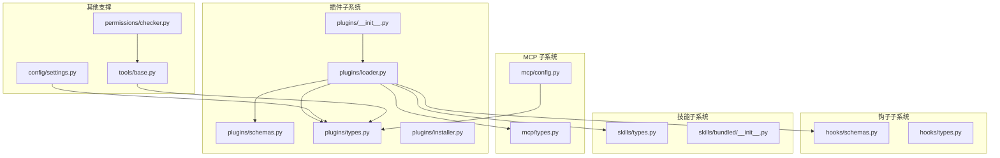

图表来源
- [src/openharness/plugins/loader.py:1-195](file://src/openharness/plugins/loader.py#L1-L195)
- [src/openharness/plugins/schemas.py:1-24](file://src/openharness/plugins/schemas.py#L1-L24)
- [src/openharness/plugins/types.py:1-33](file://src/openharness/plugins/types.py#L1-L33)
- [src/openharness/hooks/schemas.py:1-59](file://src/openharness/hooks/schemas.py#L1-L59)
- [src/openharness/mcp/types.py:1-77](file://src/openharness/mcp/types.py#L1-L77)
- [src/openharness/mcp/config.py:1-17](file://src/openharness/mcp/config.py#L1-L17)
- [src/openharness/skills/types.py:1-17](file://src/openharness/skills/types.py#L1-L17)
- [src/openharness/skills/bundled/__init__.py:1-45](file://src/openharness/skills/bundled/__init__.py#L1-L45)
- [src/openharness/config/settings.py:1-161](file://src/openharness/config/settings.py#L1-L161)
- [src/openharness/tools/base.py:1-76](file://src/openharness/tools/base.py#L1-L76)
- [src/openharness/permissions/checker.py:1-100](file://src/openharness/permissions/checker.py#L1-L100)

章节来源
- [src/openharness/plugins/__init__.py:1-54](file://src/openharness/plugins/__init__.py#L1-L54)
- [src/openharness/plugins/loader.py:1-195](file://src/openharness/plugins/loader.py#L1-L195)
- [src/openharness/config/settings.py:1-161](file://src/openharness/config/settings.py#L1-L161)

## 核心组件
本节聚焦插件系统的关键数据结构与运行时对象，它们共同构成插件的“身份”“贡献物”“状态”与“可执行性”。

- 插件清单（PluginManifest）：描述插件的基本元信息与资源定位字段，支持与 claude-code/plugins 兼容的清单位置与字段。
- 已加载插件（LoadedPlugin）：封装已加载插件与其贡献的技能、钩子、MCP 服务器、命令等。
- 钩子定义（HookDefinition）：统一的钩子类型集合，涵盖命令、提示词、HTTP、智能体四类。
- MCP 服务器配置（McpServerConfig）：支持 stdio/http/ws 三种传输方式。
- 技能定义（SkillDefinition）：统一的技能数据结构，便于注册与调用。

章节来源
- [src/openharness/plugins/schemas.py:1-24](file://src/openharness/plugins/schemas.py#L1-L24)
- [src/openharness/plugins/types.py:1-33](file://src/openharness/plugins/types.py#L1-L33)
- [src/openharness/hooks/schemas.py:1-59](file://src/openharness/hooks/schemas.py#L1-L59)
- [src/openharness/mcp/types.py:1-77](file://src/openharness/mcp/types.py#L1-L77)
- [src/openharness/skills/types.py:1-17](file://src/openharness/skills/types.py#L1-L17)

## 架构总览
OpenHarness 插件系统采用“清单驱动 + 多源贡献”的架构模式：
- 清单发现：优先在插件根目录与 .claude-plugin 目录查找 plugin.json
- 资源贡献：插件可提供技能（skills）、命令（commands）、代理（agents）、钩子（hooks）、MCP 服务器（mcp）
- 生命周期：发现 → 加载 → 启用（受设置控制）
- 安全与隔离：通过权限检查、只读工具判定、路径规则与命令模式限制实现

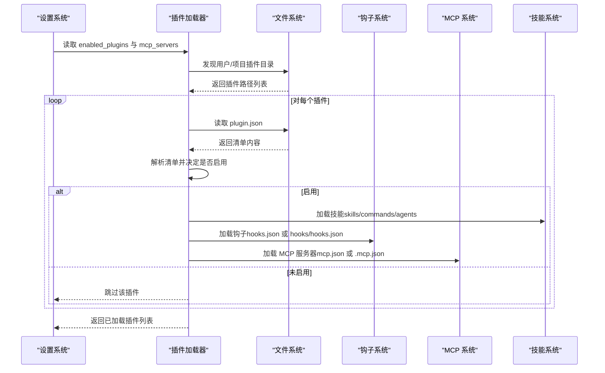

图表来源
- [src/openharness/plugins/loader.py:40-106](file://src/openharness/plugins/loader.py#L40-L106)
- [src/openharness/config/settings.py:49-64](file://src/openharness/config/settings.py#L49-L64)

## 详细组件分析

### 插件清单与类型模型
- 清单字段：名称、版本、描述、默认启用、资源目录/文件名等；扩展字段支持作者、命令、代理、技能、钩子等
- 运行时模型：LoadedPlugin 统一封装清单、路径、启用状态以及贡献的技能、钩子、MCP 服务器、命令

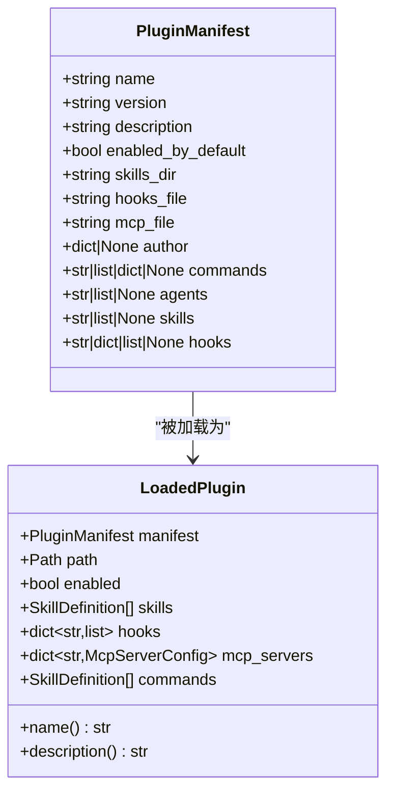

图表来源
- [src/openharness/plugins/schemas.py:8-24](file://src/openharness/plugins/schemas.py#L8-L24)
- [src/openharness/plugins/types.py:14-33](file://src/openharness/plugins/types.py#L14-L33)

章节来源
- [src/openharness/plugins/schemas.py:1-24](file://src/openharness/plugins/schemas.py#L1-L24)
- [src/openharness/plugins/types.py:1-33](file://src/openharness/plugins/types.py#L1-L33)

### 插件发现与加载流程
- 发现策略：用户级插件目录与项目级插件目录；支持标准 plugin.json 与 .claude-plugin/plugin.json
- 加载策略：按清单解析启用状态；扫描 skills/commands/agents 目录；合并 hooks.json 与 hooks/hooks.json；解析 mcp.json 与 .mcp.json
- 输出：LoadedPlugin 列表，供后续注册与使用

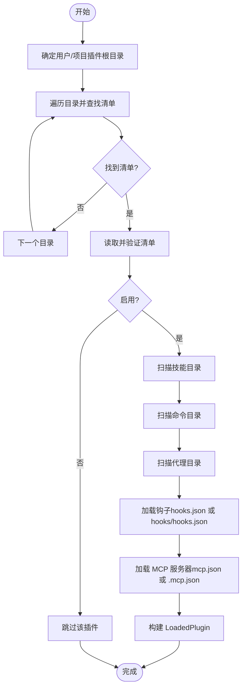

图表来源
- [src/openharness/plugins/loader.py:40-106](file://src/openharness/plugins/loader.py#L40-L106)

章节来源
- [src/openharness/plugins/loader.py:1-195](file://src/openharness/plugins/loader.py#L1-L195)

### 钩子插件架构
- 钩子类型：命令型、提示词型、HTTP 型、智能体型
- 运行时结果：单次钩子结果与聚合结果，支持阻断与原因说明
- 结合插件加载：钩子可来自 hooks.json 或 hooks/hooks.json，支持结构化格式与变量替换

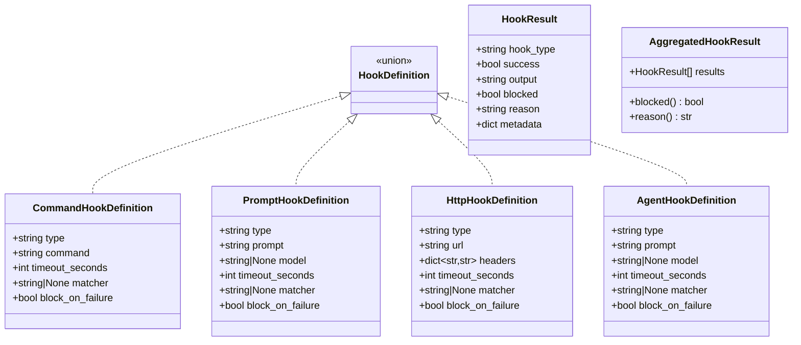

图表来源
- [src/openharness/hooks/schemas.py:10-58](file://src/openharness/hooks/schemas.py#L10-L58)
- [src/openharness/hooks/types.py:9-39](file://src/openharness/hooks/types.py#L9-L39)

章节来源
- [src/openharness/hooks/schemas.py:1-59](file://src/openharness/hooks/schemas.py#L1-L59)
- [src/openharness/hooks/types.py:1-39](file://src/openharness/hooks/types.py#L1-L39)
- [src/openharness/plugins/loader.py:128-184](file://src/openharness/plugins/loader.py#L128-L184)

### MCP 服务器插件架构
- 支持传输：stdio/http/ws
- 配置合并：插件 MCP 配置与设置中的 MCP 配置合并，插件前缀命名避免冲突
- 运行时状态：连接状态、传输类型、认证配置、可用工具与资源

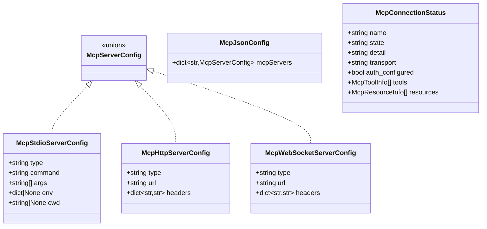

图表来源
- [src/openharness/mcp/types.py:11-77](file://src/openharness/mcp/types.py#L11-L77)

章节来源
- [src/openharness/mcp/types.py:1-77](file://src/openharness/mcp/types.py#L1-L77)
- [src/openharness/mcp/config.py:1-17](file://src/openharness/mcp/config.py#L1-L17)
- [src/openharness/plugins/loader.py:187-195](file://src/openharness/plugins/loader.py#L187-L195)

### 技能与命令插件
- 技能来源：插件技能目录、命令目录、代理目录
- 技能结构：统一的技能定义，包含名称、描述、内容、来源与路径
- 命令插件：作为技能的一种来源，最终通过工具注册暴露

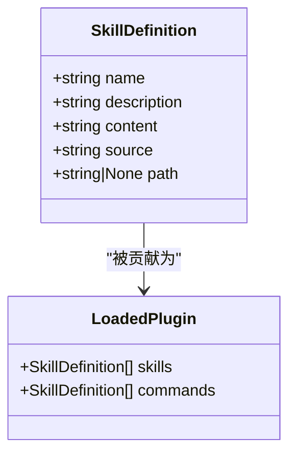

图表来源
- [src/openharness/skills/types.py:8-17](file://src/openharness/skills/types.py#L8-L17)
- [src/openharness/plugins/types.py:14-33](file://src/openharness/plugins/types.py#L14-L33)

章节来源
- [src/openharness/skills/types.py:1-17](file://src/openharness/skills/types.py#L1-L17)
- [src/openharness/skills/bundled/__init__.py:1-45](file://src/openharness/skills/bundled/__init__.py#L1-L45)
- [src/openharness/plugins/loader.py:109-125](file://src/openharness/plugins/loader.py#L109-L125)

### 插件安装与卸载
- 安装：将插件目录复制到用户插件目录，同名覆盖
- 卸载：删除用户插件目录下的对应子目录

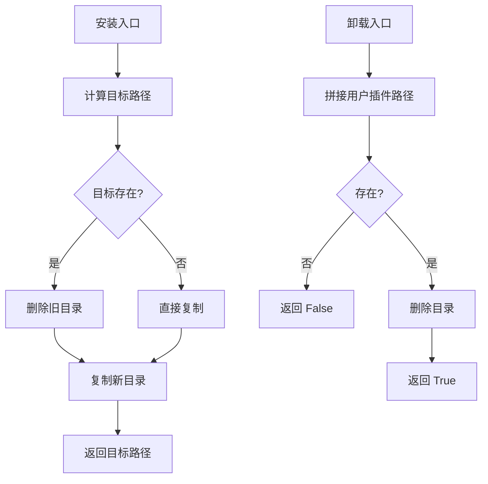

图表来源
- [src/openharness/plugins/installer.py:11-28](file://src/openharness/plugins/installer.py#L11-L28)

章节来源
- [src/openharness/plugins/installer.py:1-28](file://src/openharness/plugins/installer.py#L1-L28)

### 生命周期管理（发现 → 加载 → 启用）
- 发现阶段：扫描用户与项目插件目录，识别清单文件
- 加载阶段：解析清单、启用状态、贡献资源（技能、钩子、MCP）
- 启用阶段：受设置控制，支持按插件名显式启用/禁用

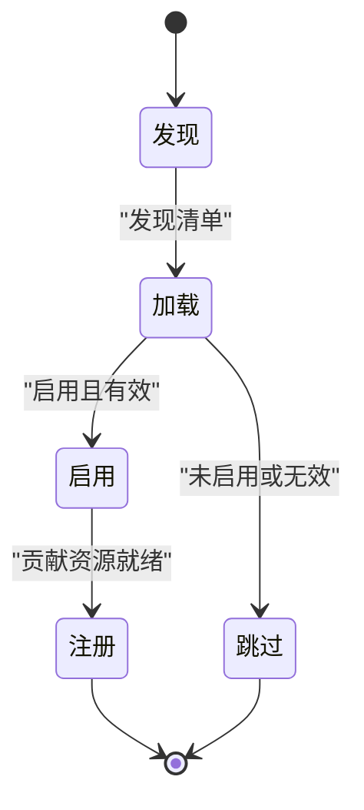

图表来源
- [src/openharness/plugins/loader.py:53-106](file://src/openharness/plugins/loader.py#L53-L106)
- [src/openharness/config/settings.py:63-64](file://src/openharness/config/settings.py#L63-L64)

章节来源
- [src/openharness/plugins/loader.py:1-195](file://src/openharness/plugins/loader.py#L1-L195)
- [src/openharness/config/settings.py:1-161](file://src/openharness/config/settings.py#L1-L161)

### 兼容性设计（与 claude-code/plugins）
- 清单位置兼容：支持 plugin.json 与 .claude-plugin/plugin.json
- 资源目录/文件名兼容：通过清单字段指定 skills_dir、hooks_file、mcp_file
- 扩展字段兼容：允许作者、命令、代理、技能、钩子等扩展字段

章节来源
- [src/openharness/plugins/loader.py:29-37](file://src/openharness/plugins/loader.py#L29-L37)
- [src/openharness/plugins/schemas.py:11-23](file://src/openharness/plugins/schemas.py#L11-L23)

### 安全与隔离机制
- 权限检查：基于工具白名单/黑名单、路径规则、命令模式匹配进行决策
- 只读判定：工具基类提供只读判定接口，用于放宽某些限制
- 运行时上下文：工具执行上下文包含工作目录与元数据，便于安全策略评估

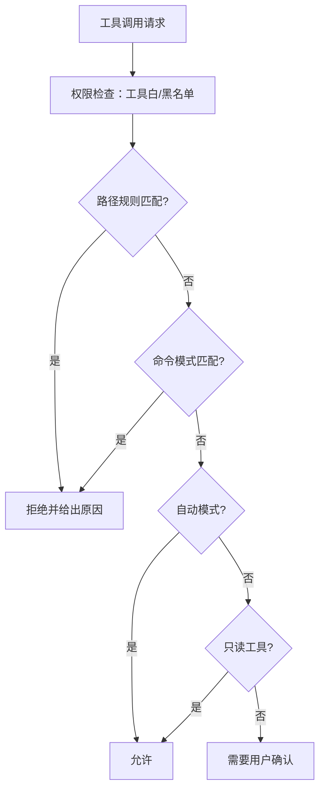

图表来源
- [src/openharness/permissions/checker.py:43-99](file://src/openharness/permissions/checker.py#L43-L99)
- [src/openharness/tools/base.py:41-44](file://src/openharness/tools/base.py#L41-L44)

章节来源
- [src/openharness/permissions/checker.py:1-100](file://src/openharness/permissions/checker.py#L1-L100)
- [src/openharness/tools/base.py:1-76](file://src/openharness/tools/base.py#L1-L76)

## 依赖关系分析
插件系统与其他子系统的耦合关系清晰，职责边界明确：
- 插件加载器依赖：清单校验、技能解析、钩子/技能/MCP 模型
- 设置系统提供：启用开关、MCP 配置、权限策略
- 工具系统提供：工具注册与执行框架
- 权限系统提供：执行前的许可判断

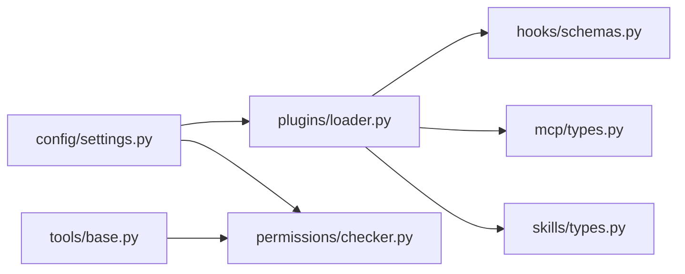

图表来源
- [src/openharness/plugins/loader.py:1-195](file://src/openharness/plugins/loader.py#L1-L195)
- [src/openharness/config/settings.py:1-161](file://src/openharness/config/settings.py#L1-L161)
- [src/openharness/tools/base.py:1-76](file://src/openharness/tools/base.py#L1-L76)
- [src/openharness/permissions/checker.py:1-100](file://src/openharness/permissions/checker.py#L1-L100)

章节来源
- [src/openharness/plugins/loader.py:1-195](file://src/openharness/plugins/loader.py#L1-L195)
- [src/openharness/config/settings.py:1-161](file://src/openharness/config/settings.py#L1-L161)

## 性能考量
- 插件发现与加载：I/O 密集，建议缓存已加载插件与清单解析结果
- 钩子执行：命令/HTTP/智能体钩子可能阻塞，需合理设置超时与并发控制
- MCP 连接：批量连接与重连策略，避免启动时阻塞
- 技能与工具注册：批量注册时注意去重与命名冲突

## 故障排除指南
- 清单解析失败：检查 plugin.json 格式与字段完整性
- 资源未加载：确认 skills/commands/agents/hooks/mcp 文件是否存在且可读
- 钩子不生效：检查 hooks.json 格式与类型字段，确认事件名一致
- MCP 连接失败：核对 mcp.json 配置与命令/URL 可达性
- 权限拒绝：检查权限设置、路径规则与命令模式

章节来源
- [tests/test_plugins/test_loader.py:1-83](file://tests/test_plugins/test_loader.py#L1-L83)
- [tests/test_plugins/test_lifecycle_flow.py:1-94](file://tests/test_plugins/test_lifecycle_flow.py#L1-L94)

## 结论
OpenHarness 插件系统以“清单驱动 + 多源贡献 + 可插拔集成”为核心设计思想，既满足与 claude-code/plugins 的兼容性，又通过严格的类型模型、清晰的生命周期与完善的安全机制，确保插件生态的可维护性与安全性。开发者可据此快速扩展命令、钩子、代理与 MCP 服务器等能力，同时借助权限与工具框架保障运行时安全。