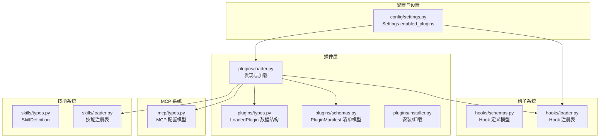
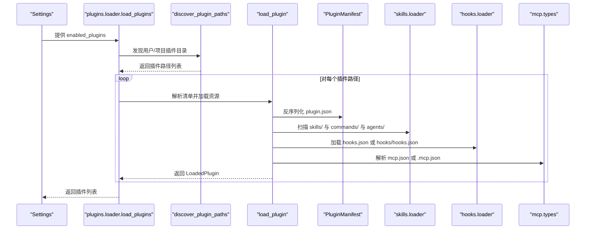
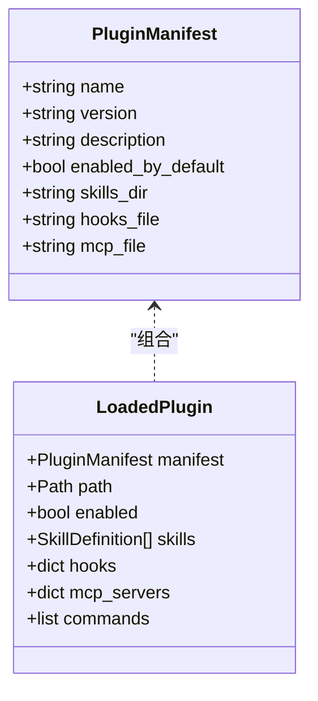
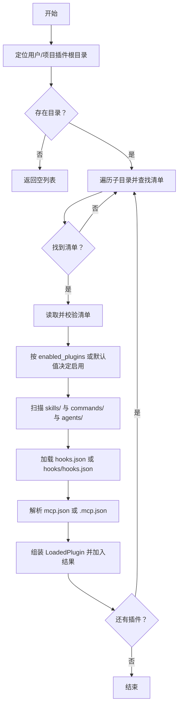
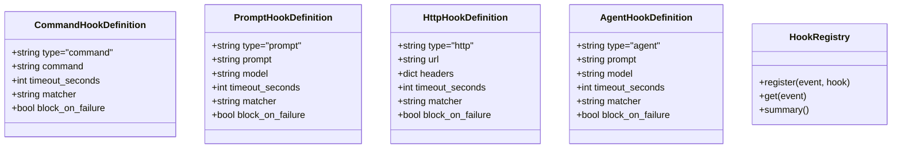
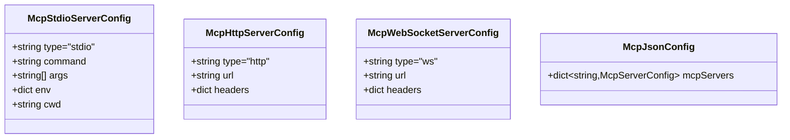
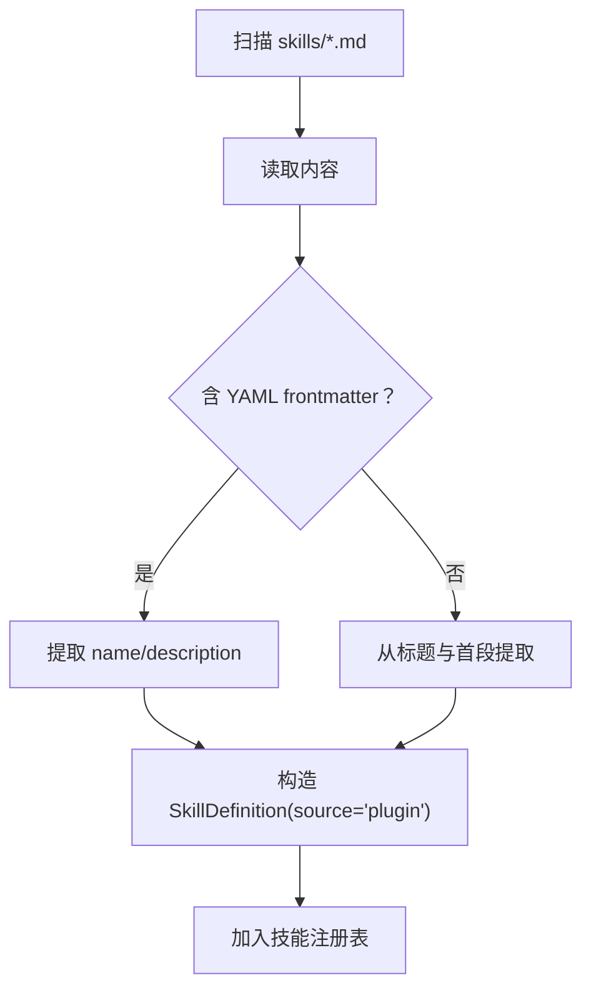
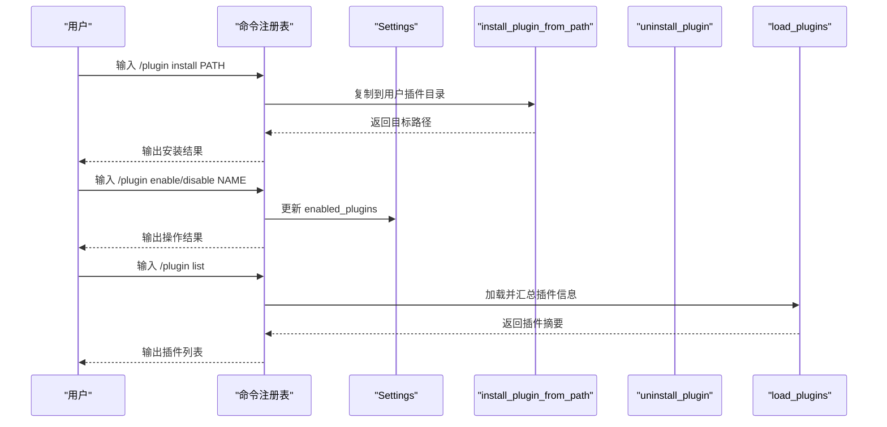
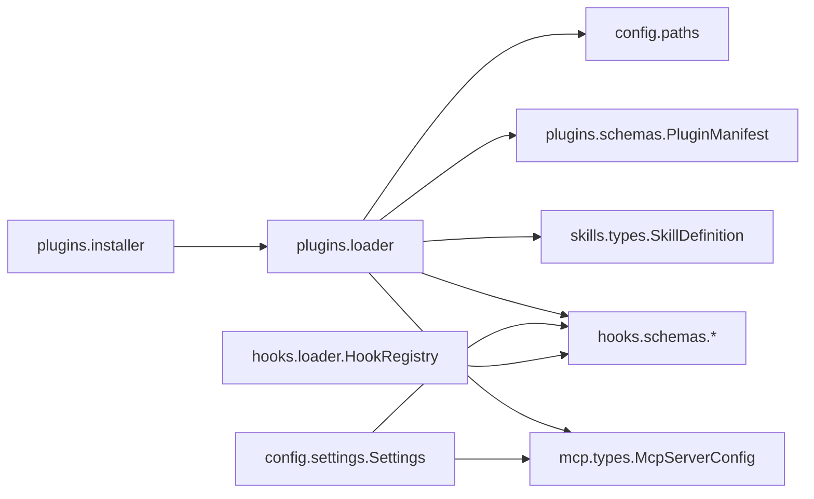

# 插件系统

<cite>
**本文引用的文件**
- [src/openharness/plugins/__init__.py](file://src/openharness/plugins/__init__.py)
- [src/openharness/plugins/loader.py](file://src/openharness/plugins/loader.py)
- [src/openharness/plugins/types.py](file://src/openharness/plugins/types.py)
- [src/openharness/plugins/schemas.py](file://src/openharness/plugins/schemas.py)
- [src/openharness/plugins/installer.py](file://src/openharness/plugins/installer.py)
- [src/openharness/hooks/schemas.py](file://src/openharness/hooks/schemas.py)
- [src/openharness/hooks/loader.py](file://src/openharness/hooks/loader.py)
- [src/openharness/mcp/types.py](file://src/openharness/mcp/types.py)
- [src/openharness/skills/types.py](file://src/openharness/skills/types.py)
- [src/openharness/skills/loader.py](file://src/openharness/skills/loader.py)
- [src/openharness/config/settings.py](file://src/openharness/config/settings.py)
- [src/openharness/commands/registry.py](file://src/openharness/commands/registry.py)
- [tests/test_plugins/test_loader.py](file://tests/test_plugins/test_loader.py)
- [tests/test_plugins/test_lifecycle_flow.py](file://tests/test_plugins/test_lifecycle_flow.py)
- [README.md](file://README.md)
</cite>

## 目录
1. [简介](#简介)
2. [项目结构](#项目结构)
3. [核心组件](#核心组件)
4. [架构总览](#架构总览)
5. [详细组件分析](#详细组件分析)
6. [依赖分析](#依赖分析)
7. [性能考虑](#性能考虑)
8. [故障排查指南](#故障排查指南)
9. [结论](#结论)
10. [附录：插件开发完整指南](#附录插件开发完整指南)

## 简介
本文件系统化阐述 OpenHarness 插件体系的设计理念与实现细节，重点覆盖以下方面：
- 与 claude-code/plugins 的兼容性与迁移路径
- 插件的安装、启用与管理流程
- 插件类型分类：命令插件、钩子插件、代理插件（MCP 服务器）、技能/代理贡献型插件
- 插件开发指南：目录结构、配置文件、生命周期钩子、工具集成
- 插件加载机制与依赖管理
- 实际开发示例与最佳实践
- 测试与调试方法
- 从入门到高级的完整开发教程

OpenHarness 明确支持 claude-code/plugins 生态，并在 README 中标注“与 claude-code/plugins 兼容”。插件系统通过统一的清单文件与约定目录，自动发现并加载插件贡献的技能、命令、钩子与 MCP 服务器配置。

章节来源
- [README.md: 51](file://README.md#L51)
- [README.md: 213–232:213-232](file://README.md#L213-L232)

## 项目结构
OpenHarness 将插件系统置于独立模块中，围绕“清单解析 + 资源发现 + 统一装载”的模式组织代码，同时与钩子、MCP、技能系统协同工作。

图表来源
- [src/openharness/plugins/loader.py: 40–106:40-106](file://src/openharness/plugins/loader.py#L40-L106)
- [src/openharness/plugins/types.py: 14–33:14-33](file://src/openharness/plugins/types.py#L14-L33)
- [src/openharness/plugins/schemas.py: 8–24:8-24](file://src/openharness/plugins/schemas.py#L8-L24)
- [src/openharness/plugins/installer.py: 11–28:11-28](file://src/openharness/plugins/installer.py#L11-L28)
- [src/openharness/hooks/schemas.py: 10–58:10-58](file://src/openharness/hooks/schemas.py#L10-L58)
- [src/openharness/hooks/loader.py: 40–61:40-61](file://src/openharness/hooks/loader.py#L40-L61)
- [src/openharness/mcp/types.py: 40–77:40-77](file://src/openharness/mcp/types.py#L40-L77)
- [src/openharness/skills/types.py: 8–17:8-17](file://src/openharness/skills/types.py#L8-L17)
- [src/openharness/skills/loader.py: 21–37:21-37](file://src/openharness/skills/loader.py#L21-L37)
- [src/openharness/config/settings.py: 49–64:49-64](file://src/openharness/config/settings.py#L49-L64)

章节来源
- [src/openharness/plugins/__init__.py: 11–20:11-20](file://src/openharness/plugins/__init__.py#L11-L20)
- [src/openharness/plugins/loader.py: 15–26:15-26](file://src/openharness/plugins/loader.py#L15-L26)

## 核心组件
- 插件清单模型：用于描述插件元数据与默认行为（名称、版本、是否默认启用、资源目录与文件名约定）
- 已加载插件对象：封装清单、路径、启用状态以及由插件贡献的技能、命令、钩子、MCP 服务器
- 插件加载器：负责发现用户与项目级插件目录、解析清单、扫描技能/命令/代理/钩子/MCP 配置
- 插件安装器：提供从本地路径复制安装与卸载能力
- 钩子系统：统一注册与执行事件钩子（命令、提示词、HTTP、代理）
- MCP 类型系统：标准化 stdio/http/ws 三类 MCP 服务器配置
- 技能系统：统一加载内置与用户/插件贡献的技能

章节来源
- [src/openharness/plugins/schemas.py: 8–24:8-24](file://src/openharness/plugins/schemas.py#L8-L24)
- [src/openharness/plugins/types.py: 14–33:14-33](file://src/openharness/plugins/types.py#L14-L33)
- [src/openharness/plugins/loader.py: 53–106:53-106](file://src/openharness/plugins/loader.py#L53-L106)
- [src/openharness/plugins/installer.py: 11–28:11-28](file://src/openharness/plugins/installer.py#L11-L28)
- [src/openharness/hooks/schemas.py: 10–58:10-58](file://src/openharness/hooks/schemas.py#L10-L58)
- [src/openharness/mcp/types.py: 11–37:11-37](file://src/openharness/mcp/types.py#L11-L37)
- [src/openharness/skills/types.py: 8–17:8-17](file://src/openharness/skills/types.py#L8-L17)

## 架构总览
下图展示插件系统在运行时的装配与交互关系：设置驱动加载，加载器解析清单并扫描资源，最终产出 LoadedPlugin；钩子与 MCP 系统分别消费插件贡献的事件与服务；技能系统合并插件贡献的技能。

图表来源
- [src/openharness/plugins/loader.py: 53–106:53-106](file://src/openharness/plugins/loader.py#L53-L106)
- [src/openharness/skills/loader.py: 21–37:21-37](file://src/openharness/skills/loader.py#L21-L37)
- [src/openharness/hooks/loader.py: 40–61:40-61](file://src/openharness/hooks/loader.py#L40-L61)
- [src/openharness/mcp/types.py: 40–44:40-44](file://src/openharness/mcp/types.py#L40-L44)

## 详细组件分析

### 插件清单与类型
- 清单字段：名称、版本、描述、默认启用开关、技能/钩子/MCP 文件与目录名约定；扩展字段支持作者、命令、代理、技能、钩子等声明
- 已加载插件：包含清单、路径、启用状态、技能列表、钩子映射、MCP 服务器字典、命令集合（筛选自技能）

图表来源
- [src/openharness/plugins/schemas.py: 8–24:8-24](file://src/openharness/plugins/schemas.py#L8-L24)
- [src/openharness/plugins/types.py: 14–33:14-33](file://src/openharness/plugins/types.py#L14-L33)

章节来源
- [src/openharness/plugins/schemas.py: 8–24:8-24](file://src/openharness/plugins/schemas.py#L8-L24)
- [src/openharness/plugins/types.py: 14–33:14-33](file://src/openharness/plugins/types.py#L14-L33)

### 插件发现与加载流程
- 用户插件目录：配置根目录下的 plugins 子目录
- 项目插件目录：当前工作目录下的 .openharness/plugins 子目录
- 清单查找：优先 plugin.json，其次 .claude-plugin/plugin.json
- 资源扫描：
  - 技能：skills/*.md，commands/*.md，agents/*.md
  - 钩子：hooks.json 或 hooks/hooks.json（支持结构化格式）
  - MCP：mcp.json 或 .mcp.json
- 启用策略：以 Settings.enabled_plugins 为准，未显式配置则采用清单默认值

图表来源
- [src/openharness/plugins/loader.py: 40–106:40-106](file://src/openharness/plugins/loader.py#L40-L106)

章节来源
- [src/openharness/plugins/loader.py: 15–26:15-26](file://src/openharness/plugins/loader.py#L15-L26)
- [src/openharness/plugins/loader.py: 29–50:29-50](file://src/openharness/plugins/loader.py#L29-L50)
- [src/openharness/plugins/loader.py: 63–106:63-106](file://src/openharness/plugins/loader.py#L63-L106)

### 钩子系统与插件钩子
- 钩子类型：命令钩子、提示词钩子、HTTP 钩子、代理钩子
- 结构化钩子：hooks/hooks.json 支持分组与匹配器，可替换占位符为插件根路径
- 钩子注册：从 Settings 与插件共同构建 HookRegistry，按事件分组

图表来源
- [src/openharness/hooks/schemas.py: 10–58:10-58](file://src/openharness/hooks/schemas.py#L10-L58)
- [src/openharness/hooks/loader.py: 10–38:10-38](file://src/openharness/hooks/loader.py#L10-L38)

章节来源
- [src/openharness/hooks/schemas.py: 10–58:10-58](file://src/openharness/hooks/schemas.py#L10-L58)
- [src/openharness/hooks/loader.py: 40–61:40-61](file://src/openharness/hooks/loader.py#L40-L61)
- [src/openharness/plugins/loader.py: 128–184:128-184](file://src/openharness/plugins/loader.py#L128-L184)

### MCP 服务器与插件集成
- 支持三种传输：stdio、http、ws
- 插件可通过 mcp.json/.mcp.json 声明多个服务器
- 运行时通过 McpClientManager 连接并生成工具入口

图表来源
- [src/openharness/mcp/types.py: 11–37:11-37](file://src/openharness/mcp/types.py#L11-L37)
- [src/openharness/mcp/types.py: 40–44:40-44](file://src/openharness/mcp/types.py#L40-L44)

章节来源
- [src/openharness/mcp/types.py: 11–37:11-37](file://src/openharness/mcp/types.py#L11-L37)
- [src/openharness/mcp/types.py: 40–77:40-77](file://src/openharness/mcp/types.py#L40-L77)
- [src/openharness/plugins/loader.py: 187–195:187-195](file://src/openharness/plugins/loader.py#L187-L195)

### 技能系统与插件技能
- 插件可提供技能文件（.md），解析标题与 YAML frontmatter 获取名称与描述
- 技能来源标记为“plugin”，便于区分内置与外部贡献

图表来源
- [src/openharness/skills/loader.py: 58–97:58-97](file://src/openharness/skills/loader.py#L58-L97)
- [src/openharness/skills/types.py: 8–17:8-17](file://src/openharness/skills/types.py#L8-L17)

章节来源
- [src/openharness/skills/loader.py: 21–37:21-37](file://src/openharness/skills/loader.py#L21-L37)
- [src/openharness/skills/loader.py: 109–125:109-125](file://src/openharness/skills/loader.py#L109-L125)

### 插件安装与管理命令
- 安装：将插件目录复制到用户插件根目录
- 卸载：删除用户插件根目录中的对应子目录
- 管理命令：/plugin list、/plugin enable NAME、/plugin disable NAME、/plugin install PATH、/plugin uninstall NAME

图表来源
- [src/openharness/plugins/installer.py: 11–28:11-28](file://src/openharness/plugins/installer.py#L11-L28)
- [src/openharness/commands/registry.py: 902–922:902-922](file://src/openharness/commands/registry.py#L902-L922)
- [src/openharness/config/settings.py: 63](file://src/openharness/config/settings.py#L63)

章节来源
- [src/openharness/plugins/installer.py: 11–28:11-28](file://src/openharness/plugins/installer.py#L11-L28)
- [src/openharness/commands/registry.py: 902–922:902-922](file://src/openharness/commands/registry.py#L902-L922)
- [src/openharness/config/settings.py: 49–64:49-64](file://src/openharness/config/settings.py#L49-L64)

## 依赖分析
- 插件加载器依赖：
  - 配置路径解析（获取用户配置目录）
  - 清单模型（Pydantic）
  - 技能解析（Markdown 解析）
  - 钩子模型（Pydantic）
  - MCP 模型（Pydantic）
- 钩子注册表依赖：
  - 钩子定义模型
  - 事件枚举
- 设置模型依赖：
  - 钩子与 MCP 配置类型
  - 权限模式

图表来源
- [src/openharness/plugins/loader.py: 8–12:8-12](file://src/openharness/plugins/loader.py#L8-L12)
- [src/openharness/config/settings.py: 19–21:19-21](file://src/openharness/config/settings.py#L19-L21)
- [src/openharness/hooks/loader.py: 6](file://src/openharness/hooks/loader.py#L6)

章节来源
- [src/openharness/plugins/loader.py: 8–12:8-12](file://src/openharness/plugins/loader.py#L8-L12)
- [src/openharness/config/settings.py: 19–21:19-21](file://src/openharness/config/settings.py#L19-L21)
- [src/openharness/hooks/loader.py: 6](file://src/openharness/hooks/loader.py#L6)

## 性能考虑
- 插件发现与加载为一次性过程，建议避免在热路径重复扫描
- 技能与钩子加载基于文件系统，注意目录层级与文件数量控制
- MCP 服务器连接应延迟初始化，仅在需要时建立连接
- 使用 Settings.enabled_plugins 控制启用范围，减少不必要的资源加载

## 故障排查指南
- 清单解析失败：检查 plugin.json 是否符合 PluginManifest 字段要求
- 资源未被识别：确认 skills/commands/agents/hooks/mcp 文件路径与命名符合约定
- 钩子不生效：核对 hooks.json 结构与类型字段，或使用 hooks/hooks.json 的结构化格式
- MCP 无法连接：验证 mcp.json 配置与服务器可用性
- 插件未启用：检查 Settings.enabled_plugins 中的键名与布尔值

章节来源
- [src/openharness/plugins/loader.py: 68–72:68-72](file://src/openharness/plugins/loader.py#L68-L72)
- [src/openharness/plugins/loader.py: 128–152:128-152](file://src/openharness/plugins/loader.py#L128-L152)
- [src/openharness/plugins/loader.py: 187–195:187-195](file://src/openharness/plugins/loader.py#L187-L195)

## 结论
OpenHarness 插件系统以“清单 + 约定目录”为核心，兼容 claude-code/plugins，提供命令、钩子、代理（MCP）与技能的统一装载与管理。通过 Settings.enabled_plugins 与命令行管理接口，用户可以灵活控制插件启停与安装卸载。结合钩子与 MCP 能力，插件可深度参与会话生命周期与外部服务集成，满足从入门到高级的多样化需求。

## 附录：插件开发完整指南

### 插件类型与贡献点
- 命令插件：在 commands/*.md 中提供命令说明与使用指南，系统将其作为技能来源之一
- 钩子插件：在 hooks.json 或 hooks/hooks.json 中声明事件钩子（命令/提示词/HTTP/代理）
- 代理插件（MCP）：在 mcp.json 或 .mcp.json 中声明 stdio/http/ws 服务器
- 技能/代理插件：在 skills/*.md 中提供知识内容，agents/*.md 提供多智能体协作模板

章节来源
- [src/openharness/plugins/loader.py: 77–96:77-96](file://src/openharness/plugins/loader.py#L77-L96)
- [src/openharness/plugins/loader.py: 128–184:128-184](file://src/openharness/plugins/loader.py#L128-L184)
- [src/openharness/plugins/loader.py: 187–195:187-195](file://src/openharness/plugins/loader.py#L187-L195)

### 插件目录结构与清单
- 推荐结构：
  - plugin.json（或 .claude-plugin/plugin.json）
  - skills/*.md
  - commands/*.md
  - agents/*.md
  - hooks.json 或 hooks/hooks.json
  - mcp.json 或 .mcp.json
- 清单字段参考：名称、版本、描述、默认启用、资源目录/文件名约定、扩展字段

章节来源
- [src/openharness/plugins/schemas.py: 8–24:8-24](file://src/openharness/plugins/schemas.py#L8-L24)
- [src/openharness/plugins/loader.py: 29–37:29-37](file://src/openharness/plugins/loader.py#L29-L37)

### 生命周期钩子使用
- 支持事件：如 session_start 等（具体事件名由钩子注册表接受的枚举决定）
- 钩子类型：命令、提示词、HTTP、代理
- 结构化钩子：hooks/hooks.json 支持分组与匹配器，可在命令中使用占位符替换为插件根路径

章节来源
- [src/openharness/hooks/schemas.py: 10–58:10-58](file://src/openharness/hooks/schemas.py#L10-L58)
- [src/openharness/hooks/loader.py: 24–37:24-37](file://src/openharness/hooks/loader.py#L24-L37)
- [src/openharness/plugins/loader.py: 155–184:155-184](file://src/openharness/plugins/loader.py#L155-L184)

### MCP 服务器集成
- 在 mcp.json/.mcp.json 中声明服务器，系统将解析为 McpServerConfig
- 运行时通过 McpClientManager 连接，生成工具入口供会话调用

章节来源
- [src/openharness/mcp/types.py: 40–77:40-77](file://src/openharness/mcp/types.py#L40-L77)
- [src/openharness/plugins/loader.py: 187–195:187-195](file://src/openharness/plugins/loader.py#L187-L195)

### 安装、启用与管理
- 安装：将插件目录复制到用户插件根目录
- 启用/禁用：通过 /plugin enable/disable 或直接编辑 Settings.enabled_plugins
- 列表：/plugin list 查看已发现插件
- 卸载：/plugin uninstall NAME 删除插件目录

章节来源
- [src/openharness/plugins/installer.py: 11–28:11-28](file://src/openharness/plugins/installer.py#L11-L28)
- [src/openharness/commands/registry.py: 902–922:902-922](file://src/openharness/commands/registry.py#L902-L922)
- [src/openharness/config/settings.py: 63](file://src/openharness/config/settings.py#L63)

### 开发示例与最佳实践
- 示例参考：
  - 插件加载与合并：见测试用例对技能与钩子的合并验证
  - 完整生命周期：安装 → 加载 → 连接 MCP → 执行工具 → 卸载
- 最佳实践：
  - 使用清晰的插件名称与描述，遵循默认目录/文件名约定
  - 钩子命令尽量短小、幂等、带超时与错误处理
  - MCP 服务器提供稳定输出与最小权限原则
  - 将复杂逻辑拆分为多个小钩子，便于组合与调试

章节来源
- [tests/test_plugins/test_loader.py: 14–83:14-83](file://tests/test_plugins/test_loader.py#L14-L83)
- [tests/test_plugins/test_lifecycle_flow.py: 20–94:20-94](file://tests/test_plugins/test_lifecycle_flow.py#L20-L94)

### 测试与调试
- 单元测试：验证插件发现、清单解析、资源合并、钩子注册
- 集成测试：验证安装/卸载、MCP 连接、工具调用链路
- 调试建议：
  - 打开详细日志与 verbose 模式
  - 分步验证清单、钩子、MCP 配置
  - 使用最小化插件进行回归测试

章节来源
- [tests/test_plugins/test_loader.py: 53–83:53-83](file://tests/test_plugins/test_loader.py#L53-L83)
- [tests/test_plugins/test_lifecycle_flow.py: 54–94:54-94](file://tests/test_plugins/test_lifecycle_flow.py#L54-L94)