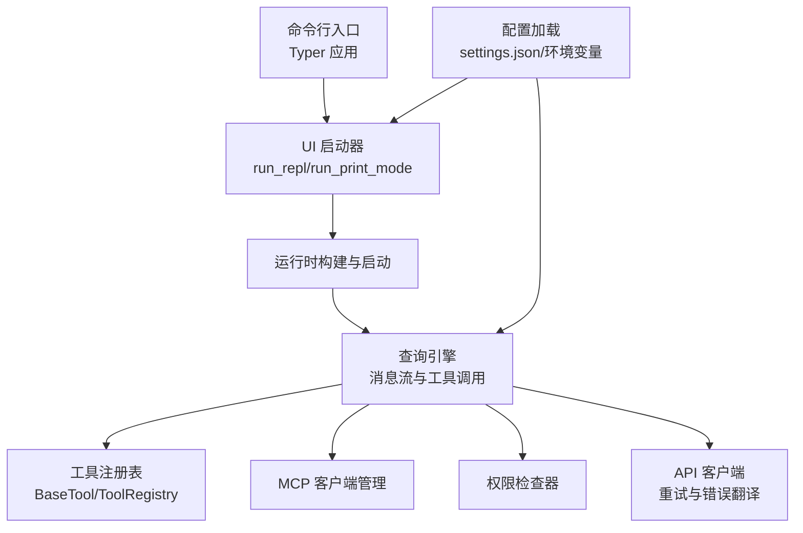
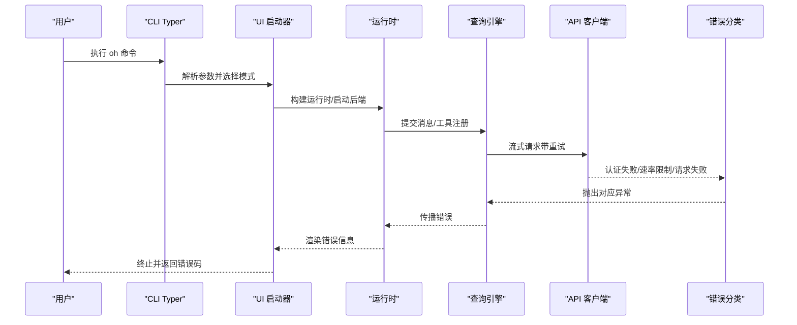

# 常见问题

<cite>
**本文引用的文件**
- [README.md](file://README.md)
- [pyproject.toml](file://pyproject.toml)
- [src/openharness/__main__.py](file://src/openharness/__main__.py)
- [src/openharness/cli.py](file://src/openharness/cli.py)
- [src/openharness/config/settings.py](file://src/openharness/config/settings.py)
- [src/openharness/config/paths.py](file://src/openharness/config/paths.py)
- [src/openharness/api/provider.py](file://src/openharness/api/provider.py)
- [src/openharness/api/client.py](file://src/openharness/api/client.py)
- [src/openharness/api/errors.py](file://src/openharness/api/errors.py)
- [src/openharness/permissions/checker.py](file://src/openharness/permissions/checker.py)
- [src/openharness/ui/app.py](file://src/openharness/ui/app.py)
- [src/openharness/mcp/client.py](file://src/openharness/mcp/client.py)
- [scripts/test_cli_flags.py](file://scripts/test_cli_flags.py)
- [scripts/e2e_smoke.py](file://scripts/e2e_smoke.py)
- [src/openharness/tools/base.py](file://src/openharness/tools/base.py)
</cite>

## 目录
1. [简介](#简介)
2. [项目结构](#项目结构)
3. [核心组件](#核心组件)
4. [架构总览](#架构总览)
5. [详细组件分析](#详细组件分析)
6. [依赖关系分析](#依赖关系分析)
7. [性能与稳定性考量](#性能与稳定性考量)
8. [故障排查指南](#故障排查指南)
9. [结论](#结论)
10. [附录：常见问题清单与解决方案](#附录常见问题清单与解决方案)

## 简介
本文件面向首次接触或正在使用 OpenHarness 的用户，系统梳理安装、配置、运行与排错过程中的常见问题，并提供分平台（Windows、macOS、Linux）的针对性建议。内容覆盖：
- 环境与依赖问题（Python 版本、uv、Node.js）
- API 密钥与认证配置错误
- 权限与路径规则导致的工具执行失败
- 命令行参数错误与输出格式问题
- 配置文件格式与位置问题
- 网络连接与上游服务异常
- 工具执行失败与 MCP 连接问题
- 预防措施与最佳实践

## 项目结构
OpenHarness 采用模块化设计，核心子系统包括引擎、工具、技能、插件、权限、钩子、命令、MCP、内存、任务、协调器、提示词、配置、UI 等。命令行入口通过 Typer 提供统一接口；交互式会话由 React TUI 驱动；非交互模式支持文本/JSON/流式 JSON 输出。

图表来源
- [src/openharness/cli.py:1-378](file://src/openharness/cli.py#L1-L378)
- [src/openharness/ui/app.py:1-149](file://src/openharness/ui/app.py#L1-L149)
- [src/openharness/config/settings.py:1-161](file://src/openharness/config/settings.py#L1-L161)
- [src/openharness/api/client.py:1-186](file://src/openharness/api/client.py#L1-L186)
- [src/openharness/tools/base.py:1-76](file://src/openharness/tools/base.py#L1-L76)

章节来源
- [README.md:82-125](file://README.md#L82-L125)
- [pyproject.toml:1-58](file://pyproject.toml#L1-L58)

## 核心组件
- 命令行与入口
  - 入口点通过脚本映射提供 oh 与 openharness 两个可执行名，实际调用 Typer 应用。
  - 支持子命令：mcp、plugin、auth；主命令支持会话控制、模型与输出格式、权限模式、系统上下文、高级选项等。
- 配置与路径
  - 默认配置文件位于用户主目录下的 .openharness/settings.json；支持环境变量覆盖。
  - 数据目录、日志目录、会话与任务输出目录均遵循 XDG 类约定，可通过环境变量定制。
- 认证与提供商
  - 自动推断提供商类型（如 Moonshot/Kimi、Bedrock、Vertex），并给出语音能力说明。
  - 认证状态基于是否配置了 API Key。
- 权限系统
  - 多级模式（默认、计划模式、全自动），支持工具白/黑名单、路径规则、命令模式匹配。
- API 客户端
  - 对上游 API 的流式消息进行封装，内置指数退避重试与错误分类（认证失败、速率限制、请求失败）。
- UI 与运行时
  - 交互式 TUI 与非交互打印模式；支持流式 JSON 输出与事件渲染。

章节来源
- [src/openharness/__main__.py:1-7](file://src/openharness/__main__.py#L1-L7)
- [src/openharness/cli.py:1-378](file://src/openharness/cli.py#L1-L378)
- [src/openharness/config/settings.py:1-161](file://src/openharness/config/settings.py#L1-L161)
- [src/openharness/config/paths.py:1-117](file://src/openharness/config/paths.py#L1-L117)
- [src/openharness/api/provider.py:1-66](file://src/openharness/api/provider.py#L1-L66)
- [src/openharness/api/client.py:1-186](file://src/openharness/api/client.py#L1-L186)
- [src/openharness/permissions/checker.py:1-100](file://src/openharness/permissions/checker.py#L1-L100)
- [src/openharness/ui/app.py:1-149](file://src/openharness/ui/app.py#L1-L149)

## 架构总览
下图展示从命令行到工具执行的关键流程与错误分类：

图表来源
- [src/openharness/cli.py:179-378](file://src/openharness/cli.py#L179-L378)
- [src/openharness/ui/app.py:15-149](file://src/openharness/ui/app.py#L15-L149)
- [src/openharness/api/client.py:98-186](file://src/openharness/api/client.py#L98-L186)
- [src/openharness/api/errors.py:1-19](file://src/openharness/api/errors.py#L1-L19)

## 详细组件分析

### 命令行与参数解析
- 常见问题
  - 缺少必需参数（如 -p 后未提供提示词）
  - 输出格式不被识别（仅 text/json/stream-json）
  - 权限模式与危险跳过标志冲突
  - 模型别名与真实模型 ID 不一致
- 排查要点
  - 使用 --help 查看完整帮助与分组
  - 非交互模式必须提供 -p 且值非空
  - 输出格式需与 --output-format 一致
  - 危险跳过会强制进入 full_auto 模式
- 参考实现
  - 参数定义与校验逻辑集中在主回调函数中
  - 子命令（mcp/plugin/auth）独立处理各自业务

章节来源
- [src/openharness/cli.py:179-378](file://src/openharness/cli.py#L179-L378)
- [scripts/test_cli_flags.py:40-154](file://scripts/test_cli_flags.py#L40-L154)

### 配置加载与路径解析
- 常见问题
  - 配置文件不存在或格式错误（非 JSON）
  - 路径变量设置不当导致数据/日志目录不可写
  - 环境变量覆盖顺序与预期不符
- 排查要点
  - 默认配置文件路径：~/.openharness/settings.json
  - 支持 OPENHARNESS_CONFIG_DIR、OPENHARNESS_DATA_DIR、OPENHARNESS_LOGS_DIR 等环境变量
  - 加载优先级：CLI > 环境变量 > 配置文件 > 默认值
- 参考实现
  - 配置加载与合并、保存逻辑
  - 路径解析与目录创建

章节来源
- [src/openharness/config/settings.py:123-161](file://src/openharness/config/settings.py#L123-L161)
- [src/openharness/config/paths.py:15-117](file://src/openharness/config/paths.py#L15-L117)

### 认证与提供商检测
- 常见问题
  - 未设置 ANTHROPIC_API_KEY 或配置文件中 api_key 为空
  - 使用 Moonshot/Kimi 但未正确设置兼容的 base_url/model
  - 认证状态显示“缺失”
- 排查要点
  - 通过 oh auth status 查看当前提供商与认证状态
  - 设置 ANTHROPIC_BASE_URL/ANTHROPIC_MODEL 或在配置文件中指定
  - 不同提供商对语音能力支持不同，需按提示调整

章节来源
- [src/openharness/config/settings.py:76-91](file://src/openharness/config/settings.py#L76-L91)
- [src/openharness/api/provider.py:20-66](file://src/openharness/api/provider.py#L20-L66)
- [src/openharness/cli.py:136-173](file://src/openharness/cli.py#L136-L173)

### 权限系统与路径规则
- 常见问题
  - 工具在默认模式下被要求确认，计划模式下禁止写操作
  - 路径规则拒绝访问敏感路径（如 /etc/*）
  - 命令模式匹配拒绝高危命令（如 rm -rf /）
- 排查要点
  - 切换权限模式：--permission-mode 或 --dangerously-skip-permissions
  - 在配置文件中添加允许/拒绝列表与路径规则
  - 读取工具为只读，不受默认模式限制
- 参考实现
  - 权限决策流程与规则匹配

章节来源
- [src/openharness/permissions/checker.py:30-100](file://src/openharness/permissions/checker.py#L30-L100)
- [src/openharness/config/settings.py:31-75](file://src/openharness/config/settings.py#L31-L75)

### API 客户端与错误分类
- 常见问题
  - 认证失败（401/403）
  - 速率限制（429）与上游服务超时/网络错误
  - 请求失败（连接/超时/OSError）
- 排查要点
  - 内置指数退避与抖动，最大重试次数有限
  - 认证失败不重试，直接抛出异常
  - 通过 --debug 开启调试日志定位问题
- 参考实现
  - 错误分类与重试策略

章节来源
- [src/openharness/api/client.py:67-186](file://src/openharness/api/client.py#L67-L186)
- [src/openharness/api/errors.py:1-19](file://src/openharness/api/errors.py#L1-L19)

### UI 与非交互模式
- 常见问题
  - 非交互模式未设置输出格式导致输出不符合预期
  - 交互式 TUI 启动失败（缺少 Node.js 或前端依赖）
- 排查要点
  - 非交互模式：-p 提示词，--output-format text/json/stream-json
  - 交互模式：确保 React TUI 依赖已安装，必要时使用 --backend-only 分离后端
- 参考实现
  - 运行时构建、事件渲染与输出格式处理

章节来源
- [src/openharness/ui/app.py:50-149](file://src/openharness/ui/app.py#L50-L149)
- [README.md:82-125](file://README.md#L82-L125)

### 工具与 MCP 集成
- 常见问题
  - 工具未注册或名称不匹配
  - MCP 服务器配置无效或连接失败
- 排查要点
  - 使用 oh mcp list 查看已配置服务器
  - 检查 MCP 服务器传输方式（stdio/socket）与鉴权配置
- 参考实现
  - MCP 客户端连接与状态记录

章节来源
- [src/openharness/mcp/client.py:129-174](file://src/openharness/mcp/client.py#L129-L174)
- [src/openharness/cli.py:39-92](file://src/openharness/cli.py#L39-L92)

## 依赖关系分析
- 运行时依赖
  - Python ≥ 3.10（项目声明），推荐 3.11+
  - uv 用于同步依赖
  - Node.js 18+（React TUI）
- 关键库
  - anthropic、rich、prompt-toolkit、textual、typer、pydantic、httpx/websockets、mcp、pyyaml、watchfiles
- 可选开发依赖
  - pytest、ruff、mypy 等

章节来源
- [pyproject.toml:10-28](file://pyproject.toml#L10-L28)
- [README.md:84-88](file://README.md#L84-L88)

## 性能与稳定性考量
- 重试策略
  - 对 429、500、502、503、529 状态码及网络错误进行指数退避重试，最大延迟受限
  - 认证失败不重试，避免无意义的资源消耗
- 输出模式
  - 非交互模式支持流式 JSON，便于程序化消费
- 并发与任务
  - 背景任务与定时任务在数据目录 tasks 下持久化输出，便于后续审计

章节来源
- [src/openharness/api/client.py:23-96](file://src/openharness/api/client.py#L23-L96)
- [src/openharness/ui/app.py:93-148](file://src/openharness/ui/app.py#L93-L148)
- [src/openharness/config/paths.py:78-82](file://src/openharness/config/paths.py#L78-L82)

## 故障排查指南

### 环境与依赖问题
- 症状
  - Python 报错版本过低
  - uv/Node.js 未安装或版本不满足要求
- 可能原因
  - 未使用 uv 同步依赖
  - 未安装 Node.js 18+
- 解决步骤
  - 使用 uv 安装开发依赖
  - 安装 Node.js 18+ 并确保 npm/yarn 可用
  - 在 CI 或容器环境中固定 Python 版本至 3.11+

章节来源
- [README.md:84-88](file://README.md#L84-L88)
- [pyproject.toml:10-10](file://pyproject.toml#L10-L10)

### API 密钥配置错误
- 症状
  - 启动时报“未找到 API Key”或认证状态为“缺失”
- 可能原因
  - 未设置 ANTHROPIC_API_KEY
  - 配置文件中 api_key 为空
- 解决步骤
  - 通过 oh auth login 交互式输入或 --api-key 指定
  - 或设置环境变量 ANTHROPIC_API_KEY
  - 使用 oh auth status 检查当前提供商与状态

章节来源
- [src/openharness/config/settings.py:76-91](file://src/openharness/config/settings.py#L76-L91)
- [src/openharness/cli.py:136-173](file://src/openharness/cli.py#L136-L173)
- [src/openharness/api/provider.py:60-66](file://src/openharness/api/provider.py#L60-L66)

### 权限拒绝与路径规则
- 症状
  - 工具执行前弹出确认对话；在计划模式下写操作被阻止
  - 访问特定路径被拒绝
- 可能原因
  - 默认模式要求对写操作进行确认
  - 路径规则或命令模式匹配导致拒绝
- 解决步骤
  - 使用 --permission-mode 切换到 full_auto（沙箱环境）
  - 在配置文件中添加允许/拒绝列表与路径规则
  - 将敏感命令加入 denied_commands

章节来源
- [src/openharness/permissions/checker.py:43-100](file://src/openharness/permissions/checker.py#L43-L100)
- [src/openharness/config/settings.py:31-75](file://src/openharness/config/settings.py#L31-L75)

### 工具执行失败
- 症状
  - 工具报错或返回 is_error=True
- 可能原因
  - 工具输入参数不合法（Pydantic 校验失败）
  - 工具未注册或名称不匹配
  - 工具执行过程中发生异常
- 解决步骤
  - 检查工具输入模式与字段类型
  - 确认工具已在注册表中
  - 查看运行时输出与日志，定位具体错误

章节来源
- [src/openharness/tools/base.py:21-76](file://src/openharness/tools/base.py#L21-L76)
- [src/openharness/ui/app.py:93-148](file://src/openharness/ui/app.py#L93-L148)

### MCP 服务器配置与连接问题
- 症状
  - oh mcp list 显示无服务器或连接失败
- 可能原因
  - 配置 JSON 无效或字段缺失
  - 传输方式（stdio/socket）不正确
  - 鉴权配置错误
- 解决步骤
  - 使用 oh mcp add 传入有效 JSON 字符串
  - 使用 oh mcp list 检查传输方式与鉴权状态
  - 如需鉴权，确保 MCP 服务器配置包含 env/cwd 等字段

章节来源
- [src/openharness/cli.py:57-92](file://src/openharness/cli.py#L57-L92)
- [src/openharness/mcp/client.py:129-174](file://src/openharness/mcp/client.py#L129-L174)

### 命令行参数错误
- 症状
  - -p 未提供值导致退出
  - 输出格式不被识别
- 可能原因
  - 忘记为 -p 提供提示词
  - --output-format 值不在 text/json/stream-json
- 解决步骤
  - 确保 -p 后跟随非空字符串
  - 使用 --output-format 指定合法值之一

章节来源
- [src/openharness/cli.py:346-365](file://src/openharness/cli.py#L346-L365)
- [scripts/test_cli_flags.py:71-98](file://scripts/test_cli_flags.py#L71-L98)

### 配置文件格式问题
- 症状
  - 配置加载失败或解析异常
- 可能原因
  - settings.json 非法 JSON
  - 字段类型不匹配（如 permission.mode 非法枚举）
- 解决步骤
  - 使用 JSON 校验工具检查配置文件
  - 参考默认设置结构，逐项核对字段类型

章节来源
- [src/openharness/config/settings.py:123-161](file://src/openharness/config/settings.py#L123-L161)

### 网络连接问题
- 症状
  - 上游服务返回 429、502、503 或网络超时
- 可能原因
  - 网络不稳定或代理阻断
  - 速率限制触发
- 解决步骤
  - 启用 --debug 观察重试日志
  - 降低并发与请求频率
  - 检查代理与防火墙设置

章节来源
- [src/openharness/api/client.py:67-136](file://src/openharness/api/client.py#L67-L136)

### 分平台特定问题
- Windows
  - 注意路径分隔符与大小写敏感性差异
  - 确保在终端中正确导出环境变量（PowerShell 使用 $env:NAME=...）
- macOS
  - 若使用 Homebrew 安装 Python，请确保 uv 与 Node.js 版本匹配
- Linux
  - 确保系统时间同步，避免 TLS 握手失败
  - 某些发行版需要额外安装 libsecret 等依赖以支持密钥环

章节来源
- [README.md:84-88](file://README.md#L84-L88)

## 结论
OpenHarness 的问题多源于环境依赖、配置文件、认证与权限设置以及网络状况。通过合理使用 oh 子命令（auth/status、mcp/list/add、plugin/list）、严格遵循配置文件格式、正确设置环境变量与权限模式，大多数问题可以快速定位与修复。建议在生产或自动化场景中开启 --debug 并结合流式 JSON 输出进行可观测性监控。

## 附录：常见问题清单与解决方案

- 症状：启动时报“未找到 API Key”
  - 可能原因：未设置 ANTHROPIC_API_KEY 或配置文件为空
  - 解决步骤：使用 oh auth login 输入密钥，或设置环境变量；使用 oh auth status 检查状态
  - 章节来源
    - [src/openharness/config/settings.py:76-91](file://src/openharness/config/settings.py#L76-L91)
    - [src/openharness/cli.py:136-173](file://src/openharness/cli.py#L136-L173)

- 症状：默认模式下写操作频繁弹确认
  - 可能原因：默认模式对写操作要求确认
  - 解决步骤：切换到 full_auto 模式或在配置文件中放宽规则
  - 章节来源
    - [src/openharness/permissions/checker.py:94-99](file://src/openharness/permissions/checker.py#L94-L99)

- 症状：访问 /etc/* 被拒绝
  - 可能原因：路径规则 deny
  - 解决步骤：在配置文件中添加允许规则或调整工作目录
  - 章节来源
    - [src/openharness/permissions/checker.py:60-69](file://src/openharness/permissions/checker.py#L60-L69)

- 症状：oh -p 无输出或报错
  - 可能原因：未提供提示词或输出格式非法
  - 解决步骤：确保 -p 后有非空提示词；使用 text/json/stream-json
  - 章节来源
    - [src/openharness/cli.py:346-365](file://src/openharness/cli.py#L346-L365)
    - [scripts/test_cli_flags.py:71-98](file://scripts/test_cli_flags.py#L71-L98)

- 症状：MCP 服务器无法连接
  - 可能原因：配置 JSON 无效或传输方式不正确
  - 解决步骤：使用 oh mcp add 添加有效 JSON；使用 oh mcp list 检查状态
  - 章节来源
    - [src/openharness/cli.py:57-92](file://src/openharness/cli.py#L57-L92)
    - [src/openharness/mcp/client.py:129-174](file://src/openharness/mcp/client.py#L129-L174)

- 症状：上游服务返回 429/502/503
  - 可能原因：网络波动或速率限制
  - 解决步骤：启用 --debug 观察重试；降低请求频率或更换可用区
  - 章节来源
    - [src/openharness/api/client.py:67-136](file://src/openharness/api/client.py#L67-L136)

- 症状：React TUI 启动失败
  - 可能原因：Node.js 未安装或前端依赖未构建
  - 解决步骤：安装 Node.js 18+；确保前端依赖已同步；必要时使用 --backend-only
  - 章节来源
    - [README.md:84-88](file://README.md#L84-L88)
    - [src/openharness/ui/app.py:27-48](file://src/openharness/ui/app.py#L27-L48)

- 症状：配置文件格式错误
  - 可能原因：非 JSON 或字段类型不匹配
  - 解决步骤：使用 JSON 校验工具；参考默认设置结构
  - 章节来源
    - [src/openharness/config/settings.py:123-161](file://src/openharness/config/settings.py#L123-L161)

- 症状：Windows 下路径相关错误
  - 可能原因：路径分隔符与大小写敏感性
  - 解决步骤：统一使用正斜杠；避免大小写混用；在 PowerShell 中正确导出环境变量
  - 章节来源
    - [src/openharness/config/paths.py:15-29](file://src/openharness/config/paths.py#L15-L29)

- 症状：macOS 下 Node.js 版本不匹配
  - 可能原因：系统自带 Node 与项目要求不一致
  - 解决步骤：使用 nvm/ volta 固定 Node.js 18+；重新安装依赖
  - 章节来源
    - [README.md:84-88](file://README.md#L84-L88)

- 症状：Linux 下 TLS 握手失败
  - 可能原因：系统时间不同步或证书链不完整
  - 解决步骤：同步时间；安装 ca-certificates；检查代理与防火墙
  - 章节来源
    - [src/openharness/api/client.py:107-136](file://src/openharness/api/client.py#L107-L136)

- 预防措施与最佳实践
  - 使用 oh auth status 定期检查认证状态
  - 在 CI 中固定 Python 与 Node.js 版本
  - 为敏感路径与命令配置明确的权限规则
  - 在非交互模式中统一输出格式，便于自动化集成
  - 启用 --debug 并收集日志，定期归档
  - 使用 oh mcp list 与 oh plugin list 持续验证外部集成状态

章节来源
- [src/openharness/cli.py:136-173](file://src/openharness/cli.py#L136-L173)
- [src/openharness/config/settings.py:123-161](file://src/openharness/config/settings.py#L123-L161)
- [src/openharness/api/client.py:107-136](file://src/openharness/api/client.py#L107-L136)
- [scripts/test_cli_flags.py:127-154](file://scripts/test_cli_flags.py#L127-L154)