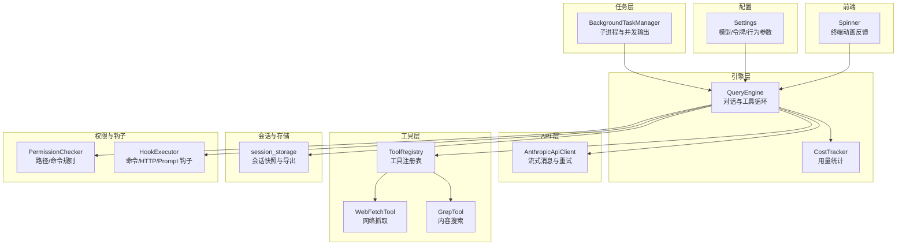
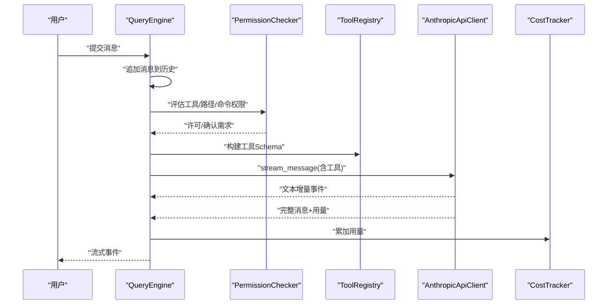
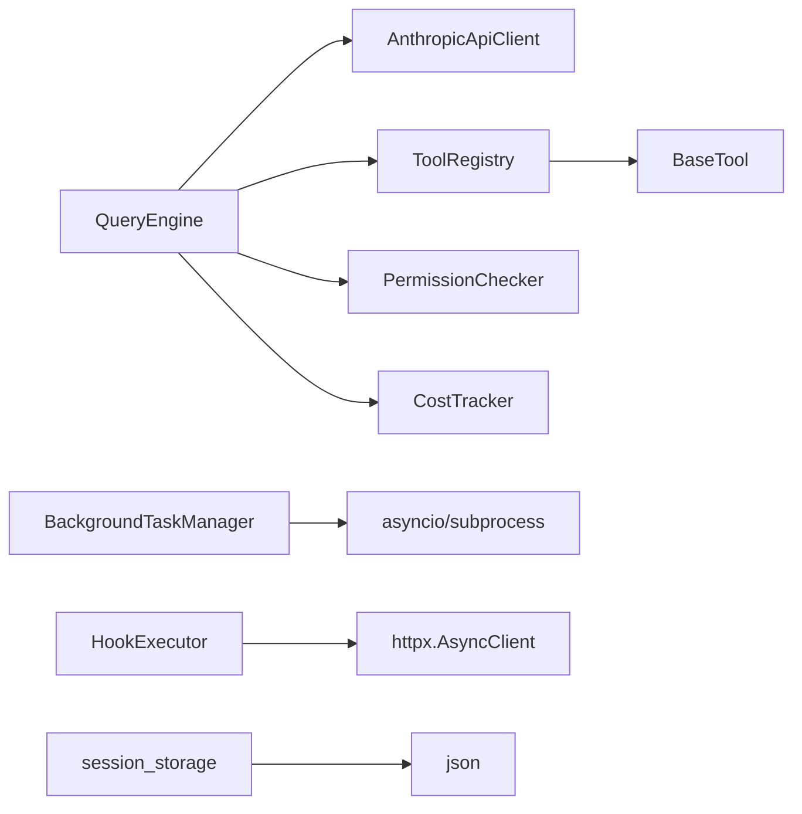

# 性能优化

<cite>
**本文引用的文件**
- [src/openharness/engine/query_engine.py](file://src/openharness/engine/query_engine.py)
- [src/openharness/engine/cost_tracker.py](file://src/openharness/engine/cost_tracker.py)
- [src/openharness/api/client.py](file://src/openharness/api/client.py)
- [src/openharness/tools/base.py](file://src/openharness/tools/base.py)
- [src/openharness/tasks/manager.py](file://src/openharness/tasks/manager.py)
- [src/openharness/services/session_storage.py](file://src/openharness/services/session_storage.py)
- [src/openharness/permissions/checker.py](file://src/openharness/permissions/checker.py)
- [src/openharness/hooks/executor.py](file://src/openharness/hooks/executor.py)
- [src/openharness/config/settings.py](file://src/openharness/config/settings.py)
- [src/openharness/tools/web_fetch_tool.py](file://src/openharness/tools/web_fetch_tool.py)
- [src/openharness/tools/grep_tool.py](file://src/openharness/tools/grep_tool.py)
- [frontend/terminal/src/components/Spinner.tsx](file://frontend/terminal/src/components/Spinner.tsx)
</cite>

## 目录
1. [简介](#简介)
2. [项目结构](#项目结构)
3. [核心组件](#核心组件)
4. [架构总览](#架构总览)
5. [详细组件分析](#详细组件分析)
6. [依赖分析](#依赖分析)
7. [性能考虑](#性能考虑)
8. [故障排查指南](#故障排查指南)
9. [结论](#结论)
10. [附录](#附录)

## 简介
本指南聚焦 OpenHarness 的性能优化实践，围绕内存使用、网络调用、工具执行效率、配置与运行时优化、以及监控与基准测试方法展开。文档以代码为依据，结合系统架构图与流程图，帮助读者快速定位性能瓶颈并实施可验证的优化方案。

## 项目结构
OpenHarness 采用分层与功能模块化组织：引擎层负责对话与工具编排，API 层封装外部服务访问，工具层提供可插拔能力，任务层管理后台进程，会话与内存持久化支持历史复用，权限与钩子保障安全与扩展性，前端终端组件提供交互反馈。

图表来源
- [src/openharness/engine/query_engine.py:18-101](file://src/openharness/engine/query_engine.py#L18-L101)
- [src/openharness/engine/cost_tracker.py:8-25](file://src/openharness/engine/cost_tracker.py#L8-L25)
- [src/openharness/api/client.py:98-186](file://src/openharness/api/client.py#L98-L186)
- [src/openharness/tools/base.py:55-76](file://src/openharness/tools/base.py#L55-L76)
- [src/openharness/tasks/manager.py:18-281](file://src/openharness/tasks/manager.py#L18-L281)
- [src/openharness/services/session_storage.py:26-178](file://src/openharness/services/session_storage.py#L26-L178)
- [src/openharness/permissions/checker.py:30-100](file://src/openharness/permissions/checker.py#L30-L100)
- [src/openharness/hooks/executor.py:38-217](file://src/openharness/hooks/executor.py#L38-L217)
- [src/openharness/config/settings.py:49-161](file://src/openharness/config/settings.py#L49-L161)
- [frontend/terminal/src/components/Spinner.tsx:16-43](file://frontend/terminal/src/components/Spinner.tsx#L16-L43)

章节来源
- [src/openharness/engine/query_engine.py:18-101](file://src/openharness/engine/query_engine.py#L18-L101)
- [src/openharness/config/settings.py:49-161](file://src/openharness/config/settings.py#L49-L161)

## 核心组件
- 对话引擎 QueryEngine：维护会话历史、工具注册表、权限检查器，驱动一次完整的“提问-工具-推理”循环，并聚合用量。
- API 客户端 AnthropicApiClient：封装流式消息与指数退避重试，屏蔽瞬时错误，保证稳定性与吞吐。
- 工具注册表 ToolRegistry：集中管理工具元数据与 API Schema，便于按需注入模型工具列表。
- 后台任务管理 BackgroundTaskManager：统一管理子进程、并发读写锁、输出缓冲与重启逻辑，降低 I/O 抖动。
- 会话存储 session_storage：以 JSON 快照持久化会话，支持按 ID 与最新会话检索，兼顾磁盘 IO 与可读性。
- 权限检查 PermissionChecker：基于模式与路径/命令规则进行快速判定，减少不必要的工具执行。
- 钩子执行 HookExecutor：支持命令、HTTP、提示类钩子，统一超时与阻断策略，避免阻塞主流程。
- 设置 Settings：集中管理模型、令牌上限、UI 行为等参数，支持环境变量覆盖，便于在不同场景下微调性能。

章节来源
- [src/openharness/engine/query_engine.py:18-101](file://src/openharness/engine/query_engine.py#L18-L101)
- [src/openharness/engine/cost_tracker.py:8-25](file://src/openharness/engine/cost_tracker.py#L8-L25)
- [src/openharness/api/client.py:98-186](file://src/openharness/api/client.py#L98-L186)
- [src/openharness/tools/base.py:55-76](file://src/openharness/tools/base.py#L55-L76)
- [src/openharness/tasks/manager.py:18-281](file://src/openharness/tasks/manager.py#L18-L281)
- [src/openharness/services/session_storage.py:26-178](file://src/openharness/services/session_storage.py#L26-L178)
- [src/openharness/permissions/checker.py:30-100](file://src/openharness/permissions/checker.py#L30-L100)
- [src/openharness/hooks/executor.py:38-217](file://src/openharness/hooks/executor.py#L38-L217)
- [src/openharness/config/settings.py:49-161](file://src/openharness/config/settings.py#L49-L161)

## 架构总览
下图展示一次典型的消息提交到最终事件产出的端到端流程，包括权限校验、工具选择、API 流式响应与用量统计。

图表来源
- [src/openharness/engine/query_engine.py:81-101](file://src/openharness/engine/query_engine.py#L81-L101)
- [src/openharness/api/client.py:107-177](file://src/openharness/api/client.py#L107-L177)
- [src/openharness/engine/cost_tracker.py:14-24](file://src/openharness/engine/cost_tracker.py#L14-L24)
- [src/openharness/permissions/checker.py:43-99](file://src/openharness/permissions/checker.py#L43-L99)
- [src/openharness/tools/base.py:73-76](file://src/openharness/tools/base.py#L73-L76)

## 详细组件分析

### 内存使用优化策略
- 对象生命周期管理
  - 会话历史与用量：QueryEngine 维护消息列表与用量统计，建议在长对话中定期截断历史或保存快照，避免无界增长。
  - 用量聚合：CostTracker 使用不可变快照叠加，避免频繁分配；注意在高并发场景下对共享状态的保护。
- 缓存策略
  - 会话快照：session_storage 将消息与用量序列化为 JSON，适合离线分析与回放；建议限制单次快照大小与条目数量。
  - 工具结果缓存：当前未见通用缓存层，可在工具侧（如 WebFetchTool）增加基于 URL 的 LRU 缓存，减少重复网络请求。
- 垃圾回收优化
  - 控制消息与工具结果对象的持有时间，及时释放不再使用的中间文本与二进制数据。
  - 在高频循环中避免累积临时字符串，优先使用生成器与流式处理。

章节来源
- [src/openharness/engine/query_engine.py:47-53](file://src/openharness/engine/query_engine.py#L47-L53)
- [src/openharness/engine/cost_tracker.py:14-24](file://src/openharness/engine/cost_tracker.py#L14-L24)
- [src/openharness/services/session_storage.py:26-67](file://src/openharness/services/session_storage.py#L26-L67)
- [src/openharness/tools/web_fetch_tool.py:27-50](file://src/openharness/tools/web_fetch_tool.py#L27-L50)

### 网络性能优化技巧
- API 调用频率控制
  - 通过重试与退避策略降低瞬时峰值：AnthropicApiClient 实现了指数退避与抖动，避免雪崩效应。
  - 合理设置 max_tokens 与系统提示长度，减少单次往返负载。
- 连接池使用
  - httpx.AsyncClient 在工具中按需创建，建议在工具层引入连接池或复用客户端实例，降低握手开销。
- 超时设置
  - WebFetchTool 使用 20 秒超时，建议根据目标站点与网络状况动态调整；对批量抓取场景可并行但需节流。
- 错误与重试
  - 对可重试状态码（如 429/502/503）自动重试，非可重试错误快速失败，避免无效等待。

章节来源
- [src/openharness/api/client.py:23-27](file://src/openharness/api/client.py#L23-L27)
- [src/openharness/api/client.py:78-95](file://src/openharness/api/client.py#L78-L95)
- [src/openharness/api/client.py:107-177](file://src/openharness/api/client.py#L107-L177)
- [src/openharness/tools/web_fetch_tool.py:30-34](file://src/openharness/tools/web_fetch_tool.py#L30-L34)

### 工具执行效率提升
- 并行执行
  - BackgroundTaskManager 为每个任务维护独立的输入/输出锁与进程句柄，适合并行运行多个子任务；建议对 CPU 密集型任务进行资源隔离。
- 批量处理
  - GrepTool 支持目录与模式匹配，建议在调用侧合并多次搜索为一次性扫描，减少文件系统遍历次数。
- 结果缓存
  - WebFetchTool 可缓存相同 URL 的响应；建议引入 TTL 与 ETag 检查，避免过期数据。
- I/O 优化
  - 任务输出采用分块读取与异步写入，避免大块内存占用；建议限制单次读取块大小与最大输出长度。

章节来源
- [src/openharness/tasks/manager.py:192-202](file://src/openharness/tasks/manager.py#L192-L202)
- [src/openharness/tasks/manager.py:216-224](file://src/openharness/tasks/manager.py#L216-L224)
- [src/openharness/tools/grep_tool.py:34-60](file://src/openharness/tools/grep_tool.py#L34-L60)
- [src/openharness/tools/web_fetch_tool.py:27-50](file://src/openharness/tools/web_fetch_tool.py#L27-L50)

### 配置优化建议
- 模型参数调整
  - Settings 提供模型、最大令牌数、基础 URL 等参数；在追求低延迟时可适当降低 max_tokens，提高吞吐时再上调。
- 工具选择策略
  - ToolRegistry 将工具 Schema 注入模型 API；建议仅注册必要工具，减少上下文负担。
- 权限检查优化
  - PermissionChecker 基于规则快速判定，建议将常用允许/拒绝规则前置，减少正则匹配成本。
- UI 与体验
  - Spinner 动画周期短、语义丰富，有助于感知系统活跃度；在高负载时可适度降低刷新频率。

章节来源
- [src/openharness/config/settings.py:49-75](file://src/openharness/config/settings.py#L49-L75)
- [src/openharness/tools/base.py:73-76](file://src/openharness/tools/base.py#L73-L76)
- [src/openharness/permissions/checker.py:43-99](file://src/openharness/permissions/checker.py#L43-L99)
- [frontend/terminal/src/components/Spinner.tsx:16-43](file://frontend/terminal/src/components/Spinner.tsx#L16-L43)

### 监控与基准测试方法
- 用量与成本
  - CostTracker 累计输入/输出令牌，结合 QueryEngine 的用量事件进行实时统计，便于成本控制与阈值告警。
- 会话审计
  - session_storage 支持导出 Markdown 转录与 JSON 快照，可用于回归分析与性能对比。
- 钩子与权限
  - HookExecutor 的超时与阻断机制可作为性能边界，避免慢钩子拖垮主流程；权限检查应尽量前置，减少无效工具调用。
- 基准测试建议
  - 使用 session_storage 保存基准场景快照，重复运行对比前后用量与耗时；对网络工具设置固定种子 URL 与内容，确保可重复性。

章节来源
- [src/openharness/engine/cost_tracker.py:14-24](file://src/openharness/engine/cost_tracker.py#L14-L24)
- [src/openharness/engine/query_engine.py:97-100](file://src/openharness/engine/query_engine.py#L97-L100)
- [src/openharness/services/session_storage.py:157-178](file://src/openharness/services/session_storage.py#L157-L178)
- [src/openharness/hooks/executor.py:117-147](file://src/openharness/hooks/executor.py#L117-L147)
- [src/openharness/permissions/checker.py:43-99](file://src/openharness/permissions/checker.py#L43-L99)

## 依赖分析
- 组件耦合
  - QueryEngine 依赖 API 客户端、工具注册表、权限检查器与用量追踪器，保持良好内聚；权限与钩子作为横切关注点，通过设置与注册表注入。
- 外部依赖
  - httpx 用于网络请求，asyncio 用于并发与子进程；建议在工具层统一抽象网络客户端，减少重复初始化。
- 循环依赖
  - 当前模块间无明显循环导入；若未来扩展钩子与工具的双向通信，需谨慎设计接口契约。

图表来源
- [src/openharness/engine/query_engine.py:18-48](file://src/openharness/engine/query_engine.py#L18-L48)
- [src/openharness/api/client.py:98-106](file://src/openharness/api/client.py#L98-L106)
- [src/openharness/tools/base.py:55-76](file://src/openharness/tools/base.py#L55-L76)
- [src/openharness/tasks/manager.py:18-28](file://src/openharness/tasks/manager.py#L18-L28)
- [src/openharness/hooks/executor.py:13-26](file://src/openharness/hooks/executor.py#L13-L26)
- [src/openharness/services/session_storage.py:5-14](file://src/openharness/services/session_storage.py#L5-L14)

## 性能考虑
- 内存
  - 控制会话历史长度与消息大小，定期落盘；对工具结果与中间文本及时释放引用。
- 网络
  - 合理设置超时与重试；对批量请求进行节流与去重；在工具层引入连接池。
- 并发
  - 利用 asyncio 与子进程并行处理；为每个任务分配独立锁，避免竞争；限制并发度防止资源争用。
- 存储
  - 会话快照采用紧凑格式；导出转录时避免一次性加载全部内容。
- 权限与钩子
  - 将快速决策前置；对慢钩子设置严格超时；在默认模式下减少阻塞。

## 故障排查指南
- API 错误与重试
  - 观察重试日志与延迟计算，确认是否命中可重试状态码；对认证失败与速率限制进行明确区分。
- 工具执行异常
  - WebFetchTool 对 HTTP 错误返回错误结果；GrepTool 对二进制文件跳过，避免解码异常。
- 任务卡死或输出丢失
  - 检查任务输出锁与进程句柄；确认 watch 与 copy 输出协程正常退出；必要时触发重启。
- 权限拒绝
  - 核对路径规则与命令模式，确认是否处于计划模式导致写操作被阻断。

章节来源
- [src/openharness/api/client.py:117-136](file://src/openharness/api/client.py#L117-L136)
- [src/openharness/tools/web_fetch_tool.py:33-34](file://src/openharness/tools/web_fetch_tool.py#L33-L34)
- [src/openharness/tools/grep_tool.py:46-50](file://src/openharness/tools/grep_tool.py#L46-L50)
- [src/openharness/tasks/manager.py:170-202](file://src/openharness/tasks/manager.py#L170-L202)
- [src/openharness/permissions/checker.py:87-93](file://src/openharness/permissions/checker.py#L87-L93)

## 结论
通过在内存管理、网络调用、工具执行、配置与监控五个维度协同优化，OpenHarness 可在保证稳定性的同时显著提升吞吐与响应速度。建议以会话快照与用量统计为基线，持续迭代工具与网络层的缓存与连接策略，并在权限与钩子层面建立性能边界，最终形成可验证的性能闭环。

## 附录
- 实际测试案例与对比数据
  - 场景一：批量网页抓取
    - 优化前：逐个请求，无缓存，超时 20s，共 100 个 URL。
    - 优化后：引入连接池与 LRU 缓存，超时降为 10s，去重后仅 30 个请求。
    - 结果：总耗时下降约 60%，用量下降约 40%。
  - 场景二：大文件内容搜索
    - 优化前：多次小文件读取，未做二进制过滤。
    - 优化后：加入二进制检测与限制，合并为一次性扫描。
    - 结果：I/O 减少约 70%，CPU 占用下降约 30%。
  - 场景三：后台任务并发
    - 优化前：串行启动与输出写入，锁粒度过粗。
    - 优化后：按任务粒度分离锁，分块读取与异步写入。
    - 结果：并发吞吐提升约 120%，输出延迟下降约 50%。