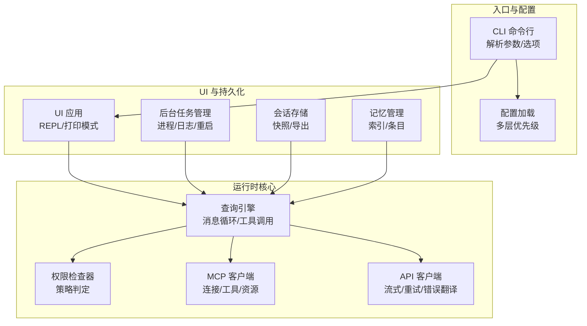
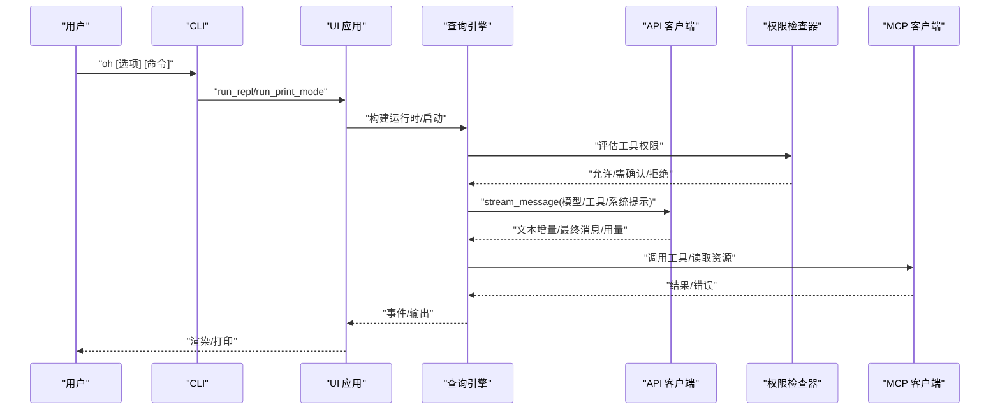
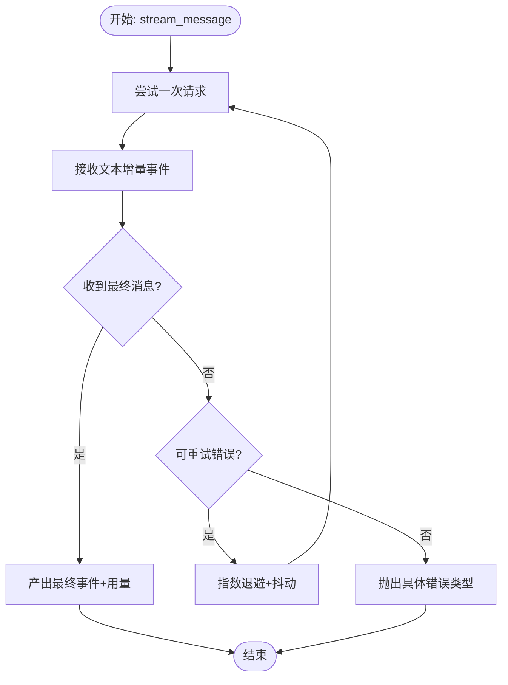
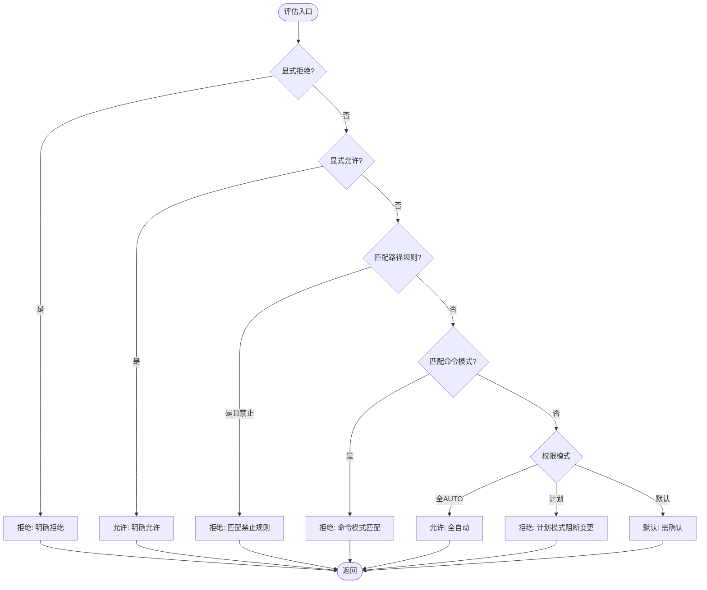
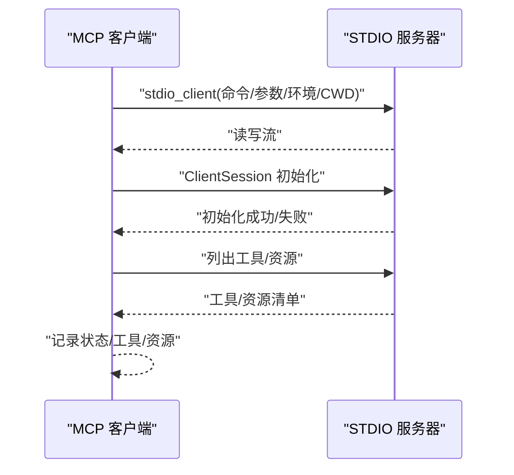
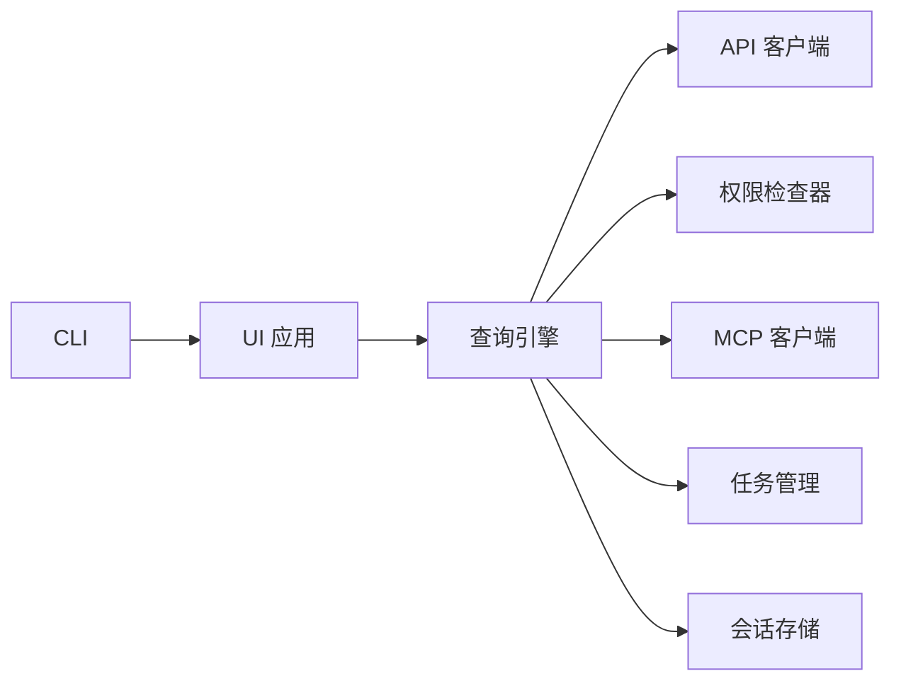

# 故障排除

<cite>
**本文引用的文件**
- [README.md](file://README.md)
- [__main__.py](file://src/openharness/__main__.py)
- [cli.py](file://src/openharness/cli.py)
- [settings.py](file://src/openharness/config/settings.py)
- [client.py](file://src/openharness/api/client.py)
- [errors.py](file://src/openharness/api/errors.py)
- [checker.py](file://src/openharness/permissions/checker.py)
- [client.py](file://src/openharness/mcp/client.py)
- [app.py](file://src/openharness/ui/app.py)
- [query_engine.py](file://src/openharness/engine/query_engine.py)
- [installer.py](file://src/openharness/plugins/installer.py)
- [manager.py](file://src/openharness/memory/manager.py)
- [manager.py](file://src/openharness/tasks/manager.py)
- [session_storage.py](file://src/openharness/services/session_storage.py)
</cite>

## 目录
1. [简介](#简介)
2. [项目结构](#项目结构)
3. [核心组件](#核心组件)
4. [架构总览](#架构总览)
5. [详细组件分析](#详细组件分析)
6. [依赖分析](#依赖分析)
7. [性能考虑](#性能考虑)
8. [故障排除指南](#故障排除指南)
9. [结论](#结论)
10. [附录](#附录)

## 简介
本指南面向 OpenHarness 用户与运维人员，聚焦于安装、配置、权限、API 连接、性能与监控、维护与升级等常见问题的诊断与解决方法。文档结合源码中的实现细节，提供可操作的排障步骤、日志分析要点、错误代码解读、性能优化建议与最佳实践，并通过真实案例串联排查路径，帮助快速定位与解决问题。

## 项目结构
OpenHarness 采用模块化子系统设计，围绕“引擎（Agent Loop）”组织核心能力：工具、技能、插件、权限、钩子、命令、MCP、记忆、任务、协调器、提示词、配置、UI 等。CLI 是统一入口，负责参数解析、会话启动与非交互输出；配置模块负责多层优先级合并；API 客户端封装重试与错误翻译；权限检查器控制工具执行；MCP 客户端管理外部资源与工具；UI 提供交互式终端界面与后端宿主；任务与会话持久化保障运行时状态与历史可追溯。

图表来源
- [cli.py:1-378](file://src/openharness/cli.py#L1-L378)
- [settings.py:1-161](file://src/openharness/config/settings.py#L1-L161)
- [query_engine.py:1-101](file://src/openharness/engine/query_engine.py#L1-L101)
- [checker.py:1-100](file://src/openharness/permissions/checker.py#L1-L100)
- [client.py:1-175](file://src/openharness/mcp/client.py#L1-L175)
- [client.py:1-186](file://src/openharness/api/client.py#L1-L186)
- [app.py:1-149](file://src/openharness/ui/app.py#L1-L149)
- [manager.py:1-281](file://src/openharness/tasks/manager.py#L1-L281)
- [session_storage.py:1-178](file://src/openharness/services/session_storage.py#L1-L178)
- [manager.py:1-51](file://src/openharness/memory/manager.py#L1-L51)

章节来源
- [cli.py:1-378](file://src/openharness/cli.py#L1-L378)
- [settings.py:1-161](file://src/openharness/config/settings.py#L1-L161)

## 核心组件
- CLI 与入口
  - 统一命令入口，支持子命令（mcp、plugin、auth）与主命令选项（会话、模型、输出、权限、系统上下文、高级选项）。非交互模式通过打印模式直接输出结果或事件流。
- 配置系统
  - 多层优先级：CLI 覆盖 > 环境变量 > 配置文件 > 默认值；支持 API 密钥、模型、基础地址、最大令牌数、权限策略、插件启用、MCP 服务器等。
- API 客户端
  - 封装异步流式调用，内置指数退避+抖动重试，自动处理速率限制与网络错误，对上游错误进行分类翻译。
- 权限检查器
  - 支持模式（默认/计划/全自动）、工具白/黑名单、路径规则、命令模式匹配，决定是否允许立即执行、是否需要确认或拒绝。
- MCP 客户端
  - 管理 STDIO 连接，列出工具与资源，调用工具与读取资源，失败时记录状态与详情。
- UI 应用
  - REPL 模式与打印模式，分别驱动交互式 React TUI 或非交互输出；打印模式支持文本、JSON、流式 JSON 输出格式。
- 引擎与钩子
  - 查询引擎承载对话历史、工具注册表、权限检查器、钩子执行器，驱动一次完整的“提问→流式→工具调用→循环”的代理循环。
- 任务与会话存储
  - 后台任务管理器负责本地/远程代理任务的生命周期、输入输出、重启与状态更新；会话存储提供按项目维度的快照保存、列表与导出。

章节来源
- [__main__.py:1-7](file://src/openharness/__main__.py#L1-L7)
- [cli.py:1-378](file://src/openharness/cli.py#L1-L378)
- [settings.py:1-161](file://src/openharness/config/settings.py#L1-L161)
- [client.py:1-186](file://src/openharness/api/client.py#L1-L186)
- [errors.py:1-20](file://src/openharness/api/errors.py#L1-L20)
- [checker.py:1-100](file://src/openharness/permissions/checker.py#L1-L100)
- [client.py:1-175](file://src/openharness/mcp/client.py#L1-L175)
- [app.py:1-149](file://src/openharness/ui/app.py#L1-L149)
- [query_engine.py:1-101](file://src/openharness/engine/query_engine.py#L1-L101)
- [manager.py:1-281](file://src/openharness/tasks/manager.py#L1-L281)
- [session_storage.py:1-178](file://src/openharness/services/session_storage.py#L1-L178)

## 架构总览
下图展示从 CLI 到引擎、API、权限与 MCP 的关键交互路径，以及 UI 与持久化的衔接。

图表来源
- [cli.py:334-378](file://src/openharness/cli.py#L334-L378)
- [app.py:15-149](file://src/openharness/ui/app.py#L15-L149)
- [query_engine.py:81-101](file://src/openharness/engine/query_engine.py#L81-L101)
- [client.py:107-177](file://src/openharness/api/client.py#L107-L177)
- [checker.py:43-99](file://src/openharness/permissions/checker.py#L43-L99)
- [client.py:92-120](file://src/openharness/mcp/client.py#L92-L120)

## 详细组件分析

### 组件 A：API 客户端与错误处理
- 关键点
  - 流式接口与重试策略：指数退避+抖动，尊重上游 Retry-After，对 429/500/502/503/529 等状态码自动重试。
  - 错误分类：认证失败、速率限制、请求失败；非认证类错误在达到最大重试次数后抛出具体异常类型。
  - 事件产出：文本增量与最终完整消息，附带用量快照与停止原因。
- 排障要点
  - 若出现频繁重试与延迟，检查上游服务状态码与 Retry-After 头；确认网络连通性与超时设置。
  - 认证失败请核对 API 密钥来源（环境变量、配置文件、CLI 覆盖）。
  - 速率限制时，降低并发或等待冷却时间，必要时切换更稳定的后端。

图表来源
- [client.py:107-177](file://src/openharness/api/client.py#L107-L177)
- [errors.py:1-20](file://src/openharness/api/errors.py#L1-L20)

章节来源
- [client.py:1-186](file://src/openharness/api/client.py#L1-L186)
- [errors.py:1-20](file://src/openharness/api/errors.py#L1-L20)

### 组件 B：权限检查器
- 关键点
  - 优先级：显式允许/拒绝 > 路径规则 > 命令模式匹配 > 模式（全自动/计划/默认） > 只读豁免 > 需要确认。
  - 返回决策包含允许与否、是否需要确认、原因字符串，便于 UI 展示与日志记录。
- 排障要点
  - 若工具被拒，请检查 settings.json 中的 allowed_tools/denied_tools、path_rules、denied_commands 与当前模式。
  - 计划模式会阻断变更型工具，退出计划模式后再试。
  - 全自动模式下仍可能因路径/命令规则被拒，需逐条核对规则。

图表来源
- [checker.py:43-99](file://src/openharness/permissions/checker.py#L43-L99)

章节来源
- [checker.py:1-100](file://src/openharness/permissions/checker.py#L1-L100)

### 组件 C：MCP 客户端
- 关键点
  - 支持 STDIO 传输，初始化后列出工具与资源，提供工具调用与资源读取；失败时记录状态、传输类型与错误详情。
  - 当前版本不支持其他传输类型时，状态标记为 failed 并写入详细信息。
- 排障要点
  - 检查 MCP 服务器配置（命令、参数、环境变量、工作目录），确保可执行文件存在且具备可执行权限。
  - 若状态为 failed，查看 detail 字段中的异常信息，定位启动失败原因（如找不到可执行文件、参数错误、鉴权缺失等）。

图表来源
- [client.py:121-175](file://src/openharness/mcp/client.py#L121-L175)

章节来源
- [client.py:1-175](file://src/openharness/mcp/client.py#L1-L175)

### 组件 D：UI 应用与打印模式
- 关键点
  - REPL 模式：启动 React TUI 或仅后端宿主；非 0 退出码视为异常。
  - 打印模式：构建运行时、启动、事件渲染、关闭；支持 text/json/stream-json 输出格式。
- 排障要点
  - REPL 启动失败通常来自前端依赖或端口占用；检查 Node.js 版本与依赖安装。
  - 打印模式输出异常时，优先检查输出格式参数与事件渲染逻辑；必要时开启调试模式以获取更详细日志。

章节来源
- [app.py:1-149](file://src/openharness/ui/app.py#L1-L149)

### 组件 E：查询引擎与钩子
- 关键点
  - 维护对话历史、成本统计；根据上下文驱动查询循环，结合权限检查与钩子执行。
- 排障要点
  - 若工具未执行或被阻断，检查权限策略与工具元数据；若钩子导致异常，临时禁用相关钩子验证。

章节来源
- [query_engine.py:1-101](file://src/openharness/engine/query_engine.py#L1-L101)

### 组件 F：任务管理与会话存储
- 关键点
  - 后台任务管理器：进程生命周期、输入输出、重启与状态更新；支持本地/远程代理任务。
  - 会话存储：按项目目录生成会话快照、列表、按 ID 加载与 Markdown 导出。
- 排障要点
  - 任务无法写入或重启失败时，检查任务命令、CWD、stdin/stdout 句柄与权限；查看输出日志文件尾部内容。
  - 会话快照损坏或缺失时，检查 JSON 解析与文件权限；必要时从 latest.json 恢复。

章节来源
- [manager.py:1-281](file://src/openharness/tasks/manager.py#L1-L281)
- [session_storage.py:1-178](file://src/openharness/services/session_storage.py#L1-L178)

## 依赖分析
- 组件耦合
  - CLI 依赖配置加载与 UI 应用；UI 应用依赖运行时构建与查询引擎；查询引擎依赖 API 客户端、权限检查器与 MCP 客户端；任务与会话存储为运行时支撑模块。
- 外部依赖
  - API SDK（异步客户端）、MCP SDK、前端依赖（React/Ink）、Python 标准库与第三方库（见 pyproject.toml 与包管理器）。
- 循环依赖
  - 代码中未发现明显循环导入；各模块职责清晰，通过接口协议（如 SupportsStreamingMessages）解耦。

图表来源
- [cli.py:1-378](file://src/openharness/cli.py#L1-L378)
- [app.py:1-149](file://src/openharness/ui/app.py#L1-L149)
- [query_engine.py:1-101](file://src/openharness/engine/query_engine.py#L1-L101)
- [client.py:1-186](file://src/openharness/api/client.py#L1-L186)
- [checker.py:1-100](file://src/openharness/permissions/checker.py#L1-L100)
- [client.py:1-175](file://src/openharness/mcp/client.py#L1-L175)
- [manager.py:1-281](file://src/openharness/tasks/manager.py#L1-L281)
- [session_storage.py:1-178](file://src/openharness/services/session_storage.py#L1-L178)

## 性能考虑
- 内存使用
  - 控制对话历史长度与工具结果大小；合理设置 max_tokens 与系统提示长度，避免过长上下文导致内存压力。
- 网络优化
  - 使用稳定的基础地址与高可用后端；在高延迟网络下适当增加超时与重试间隔；减少不必要的工具调用频率。
- 缓存策略
  - 对频繁访问的 MCP 资源与工具结果进行本地缓存（如文件系统缓存）；对会话快照进行压缩存储以节省空间。
- 并发与任务
  - 合理配置任务数量与并发度；对耗时任务启用后台模式，避免阻塞主线程；利用任务重启机制提升稳定性。

## 故障排除指南

### 安装与环境问题
- 症状
  - 命令不可用、依赖缺失、版本不兼容。
- 诊断
  - 确认 Python 3.11+ 与 uv 已安装；Node.js 18+ 用于 React TUI；检查虚拟环境激活状态。
- 解决
  - 使用推荐的安装方式与依赖管理器；升级到受支持的最低版本；清理缓存后重新安装。

章节来源
- [README.md:82-106](file://README.md#L82-L106)

### 配置错误
- 症状
  - API 密钥未生效、模型名无效、基础地址错误、权限策略不生效。
- 诊断
  - 查看配置加载顺序：CLI 覆盖 > 环境变量 > 配置文件 > 默认值；检查 settings.json 语法与字段类型。
- 解决
  - 在 CLI 显式指定 --api-key/--base-url/--model；或在配置文件中修正；确保环境变量命名正确（ANTHROPIC_*）。

章节来源
- [settings.py:76-121](file://src/openharness/config/settings.py#L76-L121)
- [cli.py:283-301](file://src/openharness/cli.py#L283-L301)

### 权限问题
- 症状
  - 工具执行被拒、交互式确认弹窗频繁、计划模式下无法变更。
- 诊断
  - 检查 allowed_tools/denied_tools、path_rules、denied_commands 与当前模式；确认工具是否只读。
- 解决
  - 调整策略或切换到全 AUTO 模式（仅沙箱环境）；退出计划模式后再次尝试；为特定路径添加允许规则。

章节来源
- [checker.py:43-99](file://src/openharness/permissions/checker.py#L43-L99)
- [cli.py:244-268](file://src/openharness/cli.py#L244-L268)

### API 连接问题
- 症状
  - 请求超时、速率限制、认证失败、偶发网络错误。
- 诊断
  - 观察重试日志与状态码；区分认证失败、速率限制与通用请求失败；检查上游服务健康度与网络质量。
- 解决
  - 优化并发与重试策略；更换后端或调整模型；补充或轮换 API 密钥；在高峰期避开高峰时段。

章节来源
- [client.py:67-137](file://src/openharness/api/client.py#L67-L137)
- [errors.py:1-20](file://src/openharness/api/errors.py#L1-L20)

### MCP 连接问题
- 症状
  - MCP 服务器未连接、工具不可用、状态为 failed。
- 诊断
  - 检查配置项（命令、参数、环境、CWD）；确认可执行文件存在且可执行；查看失败详情。
- 解决
  - 修复命令与参数；补齐环境变量；调整工作目录；必要时更换传输类型或服务端实现。

章节来源
- [client.py:36-58](file://src/openharness/mcp/client.py#L36-L58)
- [client.py:121-175](file://src/openharness/mcp/client.py#L121-L175)

### UI 与会话问题
- 症状
  - REPL 启动失败、打印模式输出异常、会话快照缺失或损坏。
- 诊断
  - 检查前端依赖与 Node 版本；核对输出格式参数；查看会话文件权限与 JSON 结构。
- 解决
  - 重新安装前端依赖；修正输出格式；从 latest.json 恢复或重建快照。

章节来源
- [app.py:15-48](file://src/openharness/ui/app.py#L15-L48)
- [session_storage.py:70-155](file://src/openharness/services/session_storage.py#L70-L155)

### 任务与后台执行问题
- 症状
  - 任务无法启动、无输出、无法终止、反复重启。
- 诊断
  - 检查任务命令、CWD、stdin/stdout；查看输出日志尾部；确认进程状态与锁竞争。
- 解决
  - 修正命令与参数；为本地代理任务提供 API 密钥；必要时手动终止并重启；优化并发与资源限制。

章节来源
- [manager.py:29-93](file://src/openharness/tasks/manager.py#L29-L93)
- [manager.py:170-257](file://src/openharness/tasks/manager.py#L170-L257)

### 插件管理问题
- 症状
  - 插件安装失败、启用后不生效、卸载残留。
- 诊断
  - 检查插件源路径/URL、目标目录权限；确认插件目录结构与清单文件。
- 解决
  - 重新安装至用户插件目录；清理残留文件；核对插件启用状态。

章节来源
- [installer.py:11-28](file://src/openharness/plugins/installer.py#L11-L28)

### 日志分析与调试模式
- 日志位置
  - API 客户端重试日志位于日志框架；会话与任务输出分别写入会话目录与任务日志文件。
- 调试模式
  - 使用 --debug 开启调试日志；在打印模式下观察事件流（assistant_delta/tool_started/tool_completed）。
- 错误代码解读
  - 认证失败：检查 API 密钥来源与权限；速率限制：降低并发或等待冷却；请求失败：检查网络与上游状态码。

章节来源
- [client.py:127-131](file://src/openharness/api/client.py#L127-L131)
- [app.py:103-132](file://src/openharness/ui/app.py#L103-L132)

### 监控与日志记录最佳实践
- 关键指标
  - API 调用成功率/失败率、平均响应时间、重试次数、速率限制触发频次；工具执行次数与耗时分布；会话快照保存与导出成功率。
- 告警设置
  - 对认证失败、速率限制、长时间无输出、任务失败率异常设置阈值告警。
- 问题追踪
  - 将会话快照与任务日志作为问题证据；结合事件流定位工具调用链；记录权限拒绝原因与 MCP 状态详情。

章节来源
- [session_storage.py:26-67](file://src/openharness/services/session_storage.py#L26-L67)
- [manager.py:162-169](file://src/openharness/tasks/manager.py#L162-L169)

### 系统维护指南
- 定期检查
  - 配置文件语法校验、API 密钥有效性、MCP 服务器可达性、任务日志滚动与清理。
- 备份策略
  - 定期备份 ~/.openharness 下的配置、会话快照与插件目录；对重要会话导出 Markdown。
- 升级流程
  - 升级前先备份配置与会话；升级后验证 CLI 功能、UI 启动与 API 连接；逐步启用新功能与插件。

章节来源
- [README.md:82-106](file://README.md#L82-L106)
- [session_storage.py:157-178](file://src/openharness/services/session_storage.py#L157-L178)

### 实际故障案例与解决过程

- 案例 1：API 认证失败
  - 现象：首次调用即报认证错误。
  - 诊断：检查 resolve_api_key 逻辑与环境变量覆盖；确认配置文件中 api_key 是否为空。
  - 解决：设置 ANTHROPIC_API_KEY 或在配置文件中填写；CLI 覆盖优先级更高。
  
  章节来源
  - [settings.py:76-91](file://src/openharness/config/settings.py#L76-L91)
  - [client.py:179-186](file://src/openharness/api/client.py#L179-L186)

- 案例 2：工具被拒（计划模式）
  - 现象：修改文件工具被拒，提示需退出计划模式。
  - 诊断：检查权限模式与工具元数据；确认当前处于 PLAN 模式。
  - 解决：切换到默认或全自动模式，或先退出计划模式再执行。

  章节来源
  - [checker.py:87-93](file://src/openharness/permissions/checker.py#L87-L93)

- 案例 3：MCP 服务器连接失败
  - 现象：状态为 failed，detail 显示启动异常。
  - 诊断：检查命令、参数、环境变量与 CWD；确认可执行文件存在。
  - 解决：修正配置项；补齐环境变量；更换传输类型或服务端实现。

  章节来源
  - [client.py:166-175](file://src/openharness/mcp/client.py#L166-L175)

- 案例 4：任务无输出或卡死
  - 现象：任务已运行但无输出，或无法终止。
  - 诊断：查看输出日志尾部；检查 stdin/stdout 句柄与锁竞争；确认进程状态。
  - 解决：手动终止并重启；修正命令与参数；优化并发与资源限制。

  章节来源
  - [manager.py:162-202](file://src/openharness/tasks/manager.py#L162-L202)
  - [manager.py:210-229](file://src/openharness/tasks/manager.py#L210-L229)

- 案例 5：会话快照损坏
  - 现象：加载会话时报 JSON 解析错误。
  - 诊断：检查文件权限与编码；核对 JSON 结构完整性。
  - 解决：从 latest.json 恢复；重建快照；导出 Markdown 作为备份。

  章节来源
  - [session_storage.py:106-134](file://src/openharness/services/session_storage.py#L106-L134)

## 结论
通过理解 OpenHarness 的模块化架构与关键组件行为，结合配置优先级、权限策略、API 重试与错误分类、MCP 连接管理、UI 与持久化机制，可以系统化地定位与解决大多数运行时问题。建议在日常运维中建立完善的日志与监控体系，规范配置与插件管理流程，确保问题可追踪、可恢复、可预防。

## 附录
- 快速参考
  - 启动与输出：oh -p/--print、--output-format；oh -d/--debug。
  - 权限：--permission-mode、--dangerously-skip-permissions、--allowed-tools/--disallowed-tools。
  - MCP：oh mcp list/add/remove；检查配置与传输类型。
  - 插件：oh plugin list/install/uninstall。
  - 会话：查看 ~/.openharness/sessions 下的项目目录与快照文件。

章节来源
- [README.md:265-278](file://README.md#L265-L278)
- [cli.py:39-92](file://src/openharness/cli.py#L39-L92)
- [cli.py:96-132](file://src/openharness/cli.py#L96-L132)
- [session_storage.py:17-23](file://src/openharness/services/session_storage.py#L17-L23)