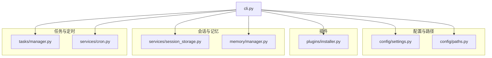
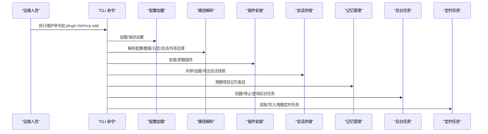
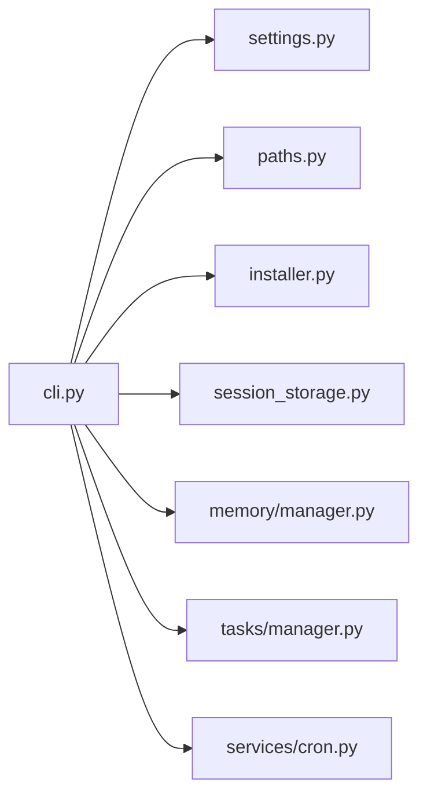

# 维护指南

<cite>
**本文引用的文件**
- [README.md](file://README.md)
- [pyproject.toml](file://pyproject.toml)
- [cli.py](file://src/openharness/cli.py)
- [settings.py](file://src/openharness/config/settings.py)
- [paths.py](file://src/openharness/config/paths.py)
- [installer.py](file://src/openharness/plugins/installer.py)
- [manager.py（内存）](file://src/openharness/memory/manager.py)
- [session_storage.py](file://src/openharness/services/session_storage.py)
- [manager.py（任务）](file://src/openharness/tasks/manager.py)
- [cron.py](file://src/openharness/services/cron.py)
- [test_harness_features.py](file://scripts/test_harness_features.py)
- [test_real_skills_plugins.py](file://scripts/test_real_skills_plugins.py)
</cite>

## 目录
1. [简介](#简介)
2. [项目结构](#项目结构)
3. [核心组件](#核心组件)
4. [架构总览](#架构总览)
5. [详细组件分析](#详细组件分析)
6. [依赖分析](#依赖分析)
7. [性能考虑](#性能考虑)
8. [故障排查指南](#故障排查指南)
9. [结论](#结论)
10. [附录](#附录)

## 简介
本指南面向 OpenHarness 的系统维护与运营人员，提供可操作的定期检查清单、备份策略、升级流程、清理与维护任务、故障恢复方法，以及维护计划模板与自动化脚本示例。内容基于仓库中的配置加载、路径解析、插件安装、会话与记忆持久化、后台任务与定时任务等模块进行梳理，并结合测试脚本对关键行为进行验证。

## 项目结构
OpenHarness 采用按子系统划分的模块化组织方式，核心目录与职责如下：
- config：设置模型与路径解析（settings、paths）
- plugins：插件安装与卸载（installer）
- memory：项目级记忆文件管理（manager）
- services：会话存储、定时任务等（session_storage、cron）
- tasks：后台任务管理（manager）
- cli：命令行入口与子命令（mcp、plugin、auth）
- scripts：端到端测试脚本（用于验证功能）

图表来源
- [cli.py:1-378](file://src/openharness/cli.py#L1-L378)
- [settings.py:1-161](file://src/openharness/config/settings.py#L1-L161)
- [paths.py:1-117](file://src/openharness/config/paths.py#L1-L117)
- [installer.py:1-28](file://src/openharness/plugins/installer.py#L1-L28)
- [session_storage.py:1-178](file://src/openharness/services/session_storage.py#L1-L178)
- [manager.py（内存）:1-51](file://src/openharness/memory/manager.py#L1-L51)
- [manager.py（任务）:1-281](file://src/openharness/tasks/manager.py#L1-L281)
- [cron.py:1-53](file://src/openharness/services/cron.py#L1-L53)

章节来源
- [README.md:127-147](file://README.md#L127-L147)
- [pyproject.toml:1-58](file://pyproject.toml#L1-L58)

## 核心组件
- 配置与环境变量优先级：CLI 参数 > 环境变量 > 用户配置文件 > 默认值
- 路径解析：遵循 XDG 类约定，支持通过环境变量覆盖配置、数据、日志、会话、任务等目录
- 插件安装：从本地路径复制到用户插件目录，支持卸载
- 会话持久化：按项目生成会话目录，保存最新快照与命名快照，支持导出 Markdown
- 记忆管理：项目级 Markdown 记忆文件索引与增删
- 后台任务：统一的任务生命周期管理、输出写入与重启机制
- 定时任务：本地注册表文件读写与增删改查

章节来源
- [settings.py:1-161](file://src/openharness/config/settings.py#L1-L161)
- [paths.py:1-117](file://src/openharness/config/paths.py#L1-L117)
- [installer.py:1-28](file://src/openharness/plugins/installer.py#L1-L28)
- [session_storage.py:1-178](file://src/openharness/services/session_storage.py#L1-L178)
- [manager.py（内存）:1-51](file://src/openharness/memory/manager.py#L1-L51)
- [manager.py（任务）:1-281](file://src/openharness/tasks/manager.py#L1-L281)
- [cron.py:1-53](file://src/openharness/services/cron.py#L1-L53)

## 架构总览
下图展示维护相关的关键交互：CLI 子命令调用配置加载、路径解析、插件安装、会话与记忆持久化、任务与定时任务等模块。

图表来源
- [cli.py:1-378](file://src/openharness/cli.py#L1-L378)
- [settings.py:1-161](file://src/openharness/config/settings.py#L1-L161)
- [paths.py:1-117](file://src/openharness/config/paths.py#L1-L117)
- [installer.py:1-28](file://src/openharness/plugins/installer.py#L1-L28)
- [session_storage.py:1-178](file://src/openharness/services/session_storage.py#L1-L178)
- [manager.py（内存）:1-51](file://src/openharness/memory/manager.py#L1-L51)
- [manager.py（任务）:1-281](file://src/openharness/tasks/manager.py#L1-L281)
- [cron.py:1-53](file://src/openharness/services/cron.py#L1-L53)

## 详细组件分析

### 配置与路径维护
- 配置文件位置与加载顺序：默认位于用户主目录下的配置目录，可通过环境变量覆盖
- 环境变量优先级：模型、基础地址、最大 Token 数、API 密钥等
- 数据目录：会话、任务、反馈、定时任务注册表等子目录均在数据目录下
- 日志目录：独立于配置目录，便于集中管理

建议检查项
- 配置文件存在且可读写
- 环境变量与配置文件冲突时的行为符合预期
- 数据/日志/会话/任务目录权限正确

章节来源
- [settings.py:76-161](file://src/openharness/config/settings.py#L76-L161)
- [paths.py:15-117](file://src/openharness/config/paths.py#L15-L117)

### 插件状态检查与维护
- 插件安装：从本地路径复制到用户插件目录，同名目录先删除再复制
- 插件卸载：删除用户插件目录中对应名称的目录
- 插件列表：通过 CLI 子命令查看已安装插件状态

建议检查项
- 插件目录存在且可写
- 插件清单与实际目录一致
- 卸载后残留文件清理干净

章节来源
- [installer.py:1-28](file://src/openharness/plugins/installer.py#L1-L28)
- [cli.py:96-132](file://src/openharness/cli.py#L96-L132)

### 会话与记忆备份
- 会话快照：按项目生成目录，保存最新快照与命名快照，支持导出 Markdown
- 记忆文件：项目级 Markdown 文件索引与增删，自动维护索引文件

建议检查项
- 会话目录存在且可读写
- 最新快照与命名快照一致性
- 记忆索引文件与实际文件匹配

章节来源
- [session_storage.py:17-178](file://src/openharness/services/session_storage.py#L17-L178)
- [manager.py（内存）:11-51](file://src/openharness/memory/manager.py#L11-L51)

### 后台任务与定时任务
- 后台任务：统一生命周期管理、输出写入锁、输入写入锁、进程监控与重启
- 定时任务：本地注册表文件读写，支持插入/替换、删除、查询

建议检查项
- 任务输出文件存在且可读
- 进程监控正常，任务状态与返回码正确
- 定时任务注册表格式正确

章节来源
- [manager.py（任务）:18-281](file://src/openharness/tasks/manager.py#L18-L281)
- [cron.py:12-53](file://src/openharness/services/cron.py#L12-L53)

### 工具可用性验证
- 使用测试脚本验证关键功能：API 重试、技能加载、并行工具执行、路径权限控制等
- 可通过非交互模式运行单次提示，验证输出格式与权限策略

建议检查项
- 测试脚本能正常运行并报告结果
- 非交互模式输出符合预期
- 权限策略生效（路径拒绝、命令拒绝）

章节来源
- [test_harness_features.py:1-241](file://scripts/test_harness_features.py#L1-L241)
- [test_real_skills_plugins.py:1-348](file://scripts/test_real_skills_plugins.py#L1-L348)
- [cli.py:344-378](file://src/openharness/cli.py#L344-L378)

## 依赖分析
- CLI 作为入口，依赖配置、路径、插件、会话、记忆、任务、定时任务等模块
- 配置与路径为基础设施层，被其他模块广泛使用
- 插件安装仅依赖路径解析与文件系统操作
- 会话与记忆、任务与定时任务分别提供持久化能力

图表来源
- [cli.py:1-378](file://src/openharness/cli.py#L1-L378)
- [settings.py:1-161](file://src/openharness/config/settings.py#L1-L161)
- [paths.py:1-117](file://src/openharness/config/paths.py#L1-L117)
- [installer.py:1-28](file://src/openharness/plugins/installer.py#L1-L28)
- [session_storage.py:1-178](file://src/openharness/services/session_storage.py#L1-L178)
- [manager.py（内存）:1-51](file://src/openharness/memory/manager.py#L1-L51)
- [manager.py（任务）:1-281](file://src/openharness/tasks/manager.py#L1-L281)
- [cron.py:1-53](file://src/openharness/services/cron.py#L1-L53)

## 性能考虑
- 会话与记忆文件数量与大小：合理限制记忆文件数量，避免索引文件过大
- 后台任务并发：注意输出与输入写入锁，避免竞争条件导致的阻塞
- 定时任务注册表：频繁增删时建议批处理，减少磁盘 IO
- 配置加载：尽量减少重复加载，必要时使用缓存键（如任务目录路径）

## 故障排查指南
常见问题与定位思路
- 配置文件无法加载或权限不足
  - 检查配置文件是否存在、可读写
  - 检查环境变量覆盖是否符合预期
- 插件安装失败或卸载不彻底
  - 检查目标目录权限
  - 确认同名目录已被完全删除
- 会话快照损坏或缺失
  - 检查项目会话目录权限
  - 对比“latest.json”与命名快照一致性
- 记忆索引不同步
  - 检查索引文件是否包含对应文件名
  - 确认删除记忆文件后索引已同步更新
- 后台任务卡死或输出异常
  - 查看任务输出文件尾部内容
  - 检查进程是否仍在运行，必要时终止并重启
- 定时任务未生效
  - 检查注册表文件格式与内容
  - 确认任务名称唯一性

章节来源
- [settings.py:123-161](file://src/openharness/config/settings.py#L123-L161)
- [paths.py:15-117](file://src/openharness/config/paths.py#L15-L117)
- [installer.py:11-28](file://src/openharness/plugins/installer.py#L11-L28)
- [session_storage.py:26-178](file://src/openharness/services/session_storage.py#L26-L178)
- [manager.py（内存）:17-51](file://src/openharness/memory/manager.py#L17-L51)
- [manager.py（任务）:170-281](file://src/openharness/tasks/manager.py#L170-L281)
- [cron.py:12-53](file://src/openharness/services/cron.py#L12-L53)

## 结论
通过规范的配置管理、路径解析、插件安装与卸载、会话与记忆持久化、后台任务与定时任务维护，可以有效保障 OpenHarness 的稳定运行。建议建立标准化的定期检查清单与自动化脚本，结合测试脚本验证关键功能，确保升级与变更过程可控、可回滚。

## 附录

### 维护检查清单（示例）
- 配置文件验证
  - 检查配置文件存在与可读写
  - 验证环境变量覆盖逻辑
- 插件状态检查
  - 列出已安装插件，确认启用状态
  - 验证插件目录权限
- 工具可用性验证
  - 运行非交互模式单次提示
  - 执行权限策略测试（路径/命令拒绝）
- 备份策略
  - 配置文件备份：settings.json
  - 技能文件备份：用户技能目录
  - 记忆数据备份：项目记忆目录
  - 会话快照备份：项目会话目录
  - 定时任务注册表备份：cron_jobs.json
- 清理与维护
  - 清理过期会话快照
  - 清理任务输出文件（保留最近一次）
  - 清理日志文件（按保留策略轮转）
  - 清理临时文件与缓存
- 升级流程
  - 版本兼容性检查（依赖版本）
  - 插件迁移：重新安装兼容版本
  - 配置文件更新：对比新增字段并迁移
  - 全量功能回归测试
- 故障恢复
  - 数据恢复：从备份恢复配置/技能/记忆/会话
  - 配置重置：删除配置文件，使用默认设置
  - 系统重建：重新安装依赖，恢复插件与配置

### 自动化脚本示例（概念）
- 备份脚本
  - 备份配置目录、数据目录、日志目录
  - 支持增量备份与压缩归档
- 清理脚本
  - 清理 N 天前的日志与会话快照
  - 清理超大任务输出文件尾部内容
- 升级脚本
  - 检查依赖版本，更新包
  - 迁移配置文件字段
  - 重新安装插件
  - 运行回归测试脚本