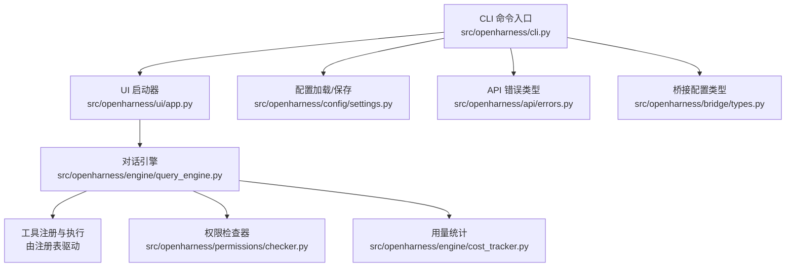
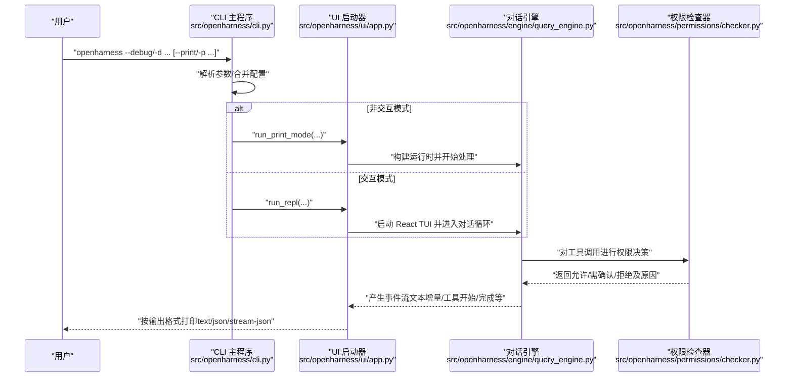
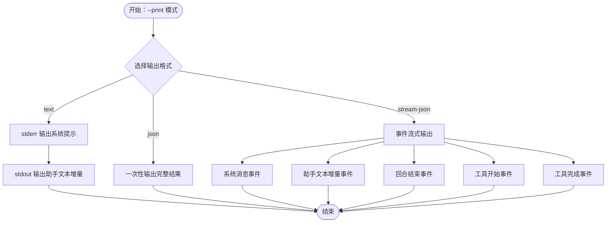
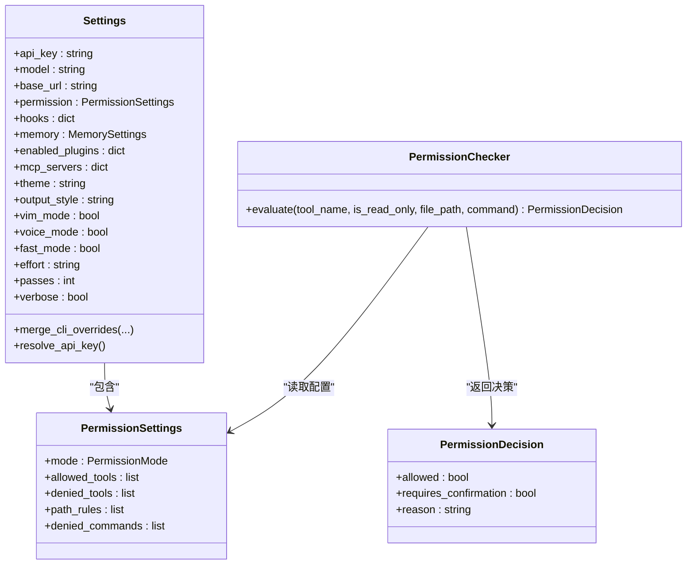
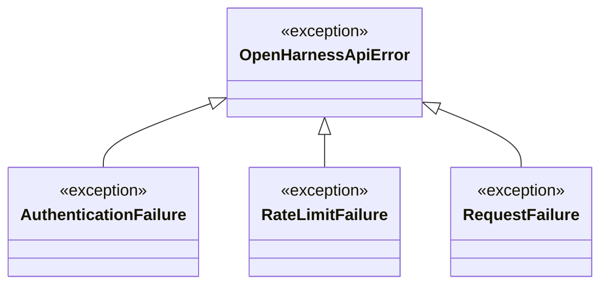
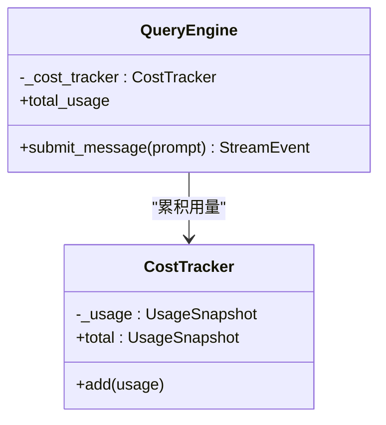
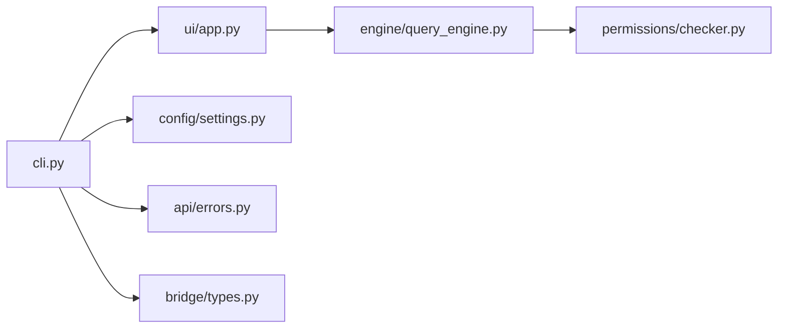

# 诊断工具

<cite>
**本文引用的文件**
- [cli.py](file://src/openharness/cli.py)
- [__main__.py](file://src/openharness/__main__.py)
- [app.py](file://src/openharness/ui/app.py)
- [settings.py](file://src/openharness/config/settings.py)
- [errors.py](file://src/openharness/api/errors.py)
- [checker.py](file://src/openharness/permissions/checker.py)
- [query_engine.py](file://src/openharness/engine/query_engine.py)
- [cost_tracker.py](file://src/openharness/engine/cost_tracker.py)
- [types.py](file://src/openharness/bridge/types.py)
- [debug.md](file://src/openharness/skills/bundled/content/debug.md)
- [test_cli_flags.py](file://scripts/test_cli_flags.py)
- [local_system_scenarios.py](file://scripts/local_system_scenarios.py)
</cite>

## 目录
1. [简介](#简介)
2. [项目结构](#项目结构)
3. [核心组件](#核心组件)
4. [架构总览](#架构总览)
5. [详细组件分析](#详细组件分析)
6. [依赖分析](#依赖分析)
7. [性能考量](#性能考量)
8. [故障排查指南](#故障排查指南)
9. [结论](#结论)
10. [附录](#附录)

## 简介
本文件系统化梳理 OpenHarness 的诊断工具与方法，重点覆盖以下方面：
- 如何使用内置调试模式（--debug 参数）获取详细运行信息与错误堆栈
- 如何通过日志输出与状态检查定位问题（含配置验证、工具可用性、权限状态）
- 错误类型与异常解读，帮助快速判断问题根因
- 性能监控要点：会话期间的令牌用量、调用次数与事件流式输出
- 实战脚本与测试用例中的诊断实践示例

## 项目结构
OpenHarness 的 CLI 入口位于命令行模块，负责解析参数、加载配置、启动交互或非交互模式；UI 层在交互模式下承载事件渲染与输出；引擎层负责对话循环、工具执行与用量统计；权限与错误类型为诊断与排障提供基础能力。

图表来源
- [cli.py:180-378](file://src/openharness/cli.py#L180-L378)
- [app.py:15-48](file://src/openharness/ui/app.py#L15-L48)
- [settings.py:123-161](file://src/openharness/config/settings.py#L123-L161)
- [query_engine.py:18-101](file://src/openharness/engine/query_engine.py#L18-L101)
- [checker.py:30-100](file://src/openharness/permissions/checker.py#L30-L100)
- [cost_tracker.py:8-24](file://src/openharness/engine/cost_tracker.py#L8-L24)
- [errors.py:6-20](file://src/openharness/api/errors.py#L6-L20)
- [types.py:30-37](file://src/openharness/bridge/types.py#L30-L37)

章节来源
- [cli.py:1-378](file://src/openharness/cli.py#L1-L378)
- [__main__.py:1-7](file://src/openharness/__main__.py#L1-L7)

## 核心组件
- 调试模式与日志输出
  - CLI 提供 --debug/-d 选项用于启用调试日志；结合 --print 模式可输出结构化事件流，便于分析。
  - 非交互模式支持多种输出格式（text/json/stream-json），便于自动化采集与分析。
- 配置与状态检查
  - 配置加载与保存遵循优先级策略；可通过子命令查看 MCP 服务器、插件安装状态、认证状态等。
- 权限与安全
  - 权限检查器根据模式与规则判定工具是否允许执行，并给出明确原因，有助于定位权限相关问题。
- 错误类型
  - 定义了通用上游 API 失败基类及认证失败、速率限制失败、请求失败等具体类型，便于区分异常场景。
- 性能监控
  - 引擎层聚合会话期间的输入/输出令牌用量，可用于成本控制与性能评估。

章节来源
- [cli.py:309-315](file://src/openharness/cli.py#L309-L315)
- [app.py:50-149](file://src/openharness/ui/app.py#L50-L149)
- [settings.py:49-96](file://src/openharness/config/settings.py#L49-L96)
- [checker.py:30-100](file://src/openharness/permissions/checker.py#L30-L100)
- [errors.py:6-20](file://src/openharness/api/errors.py#L6-L20)
- [query_engine.py:56-58](file://src/openharness/engine/query_engine.py#L56-L58)

## 架构总览
下图展示从 CLI 到 UI、引擎与权限检查的整体流程，以及调试模式与输出格式对诊断的影响。

图表来源
- [cli.py:334-378](file://src/openharness/cli.py#L334-L378)
- [app.py:50-149](file://src/openharness/ui/app.py#L50-L149)
- [query_engine.py:81-101](file://src/openharness/engine/query_engine.py#L81-L101)
- [checker.py:43-99](file://src/openharness/permissions/checker.py#L43-L99)

## 详细组件分析

### 调试模式与日志输出
- 启用调试
  - 使用 --debug/-d 开启调试日志，便于捕获更详细的运行信息与错误堆栈。
- 输出格式
  - --print 模式支持 text、json、stream-json 三种输出格式：
    - text：标准输出打印消息与增量文本，stderr 打印系统提示
    - json：一次性输出完整结果对象
    - stream-json：事件流式输出，包含系统消息、助手文本增量、回合结束、工具开始/完成等事件
- 事件流式分析
  - 在 stream-json 模式下，可基于事件类型（如系统消息、助手文本增量、工具执行开始/完成）进行问题定位与回放

图表来源
- [app.py:93-148](file://src/openharness/ui/app.py#L93-L148)

章节来源
- [cli.py:309-315](file://src/openharness/cli.py#L309-L315)
- [app.py:50-149](file://src/openharness/ui/app.py#L50-L149)

### 配置验证与状态检查
- 配置加载与合并
  - 支持从 CLI 参数、环境变量、配置文件到默认值的多级合并；提供保存配置的能力。
- 状态检查工具
  - 认证状态：显示当前检测到的提供商与认证状态
  - MCP 服务器：列出已配置的服务器及其传输方式
  - 插件管理：列出已安装插件的状态（启用/禁用）
- 权限状态查询
  - 权限检查器依据配置模式与规则，给出工具是否允许执行及原因，便于快速定位权限问题

图表来源
- [settings.py:49-96](file://src/openharness/config/settings.py#L49-L96)
- [checker.py:13-99](file://src/openharness/permissions/checker.py#L13-L99)

章节来源
- [settings.py:123-161](file://src/openharness/config/settings.py#L123-L161)
- [cli.py:136-173](file://src/openharness/cli.py#L136-L173)
- [cli.py:39-92](file://src/openharness/cli.py#L39-L92)
- [checker.py:30-100](file://src/openharness/permissions/checker.py#L30-L100)

### 错误类型与异常解读
- 基础异常类型
  - OpenHarnessApiError：上游 API 失败的基类
  - AuthenticationFailure：凭证被上游服务拒绝
  - RateLimitFailure：因速率限制被拒绝
  - RequestFailure：通用请求或传输失败
- 解读建议
  - 认证失败：检查 API 密钥来源（配置文件、环境变量、CLI 覆盖）
  - 速率限制：降低调用频率或等待配额恢复
  - 请求失败：关注网络连通性、代理设置与超时配置

图表来源
- [errors.py:6-20](file://src/openharness/api/errors.py#L6-L20)

章节来源
- [errors.py:6-20](file://src/openharness/api/errors.py#L6-L20)

### 性能监控与用量统计
- 令牌用量聚合
  - 引擎在每次对话轮次中收集用量快照并累加，提供会话总输入/输出令牌数
- 监控建议
  - 结合 --print 与 stream-json 观察事件节奏与工具调用频次
  - 关注工具执行开始/完成事件的分布，识别高开销操作
  - 对长会话进行分段记录，对比不同模型/系统提示下的用量差异

图表来源
- [query_engine.py:56-58](file://src/openharness/engine/query_engine.py#L56-L58)
- [query_engine.py:97-100](file://src/openharness/engine/query_engine.py#L97-L100)
- [cost_tracker.py:8-24](file://src/openharness/engine/cost_tracker.py#L8-L24)

章节来源
- [query_engine.py:56-58](file://src/openharness/engine/query_engine.py#L56-L58)
- [cost_tracker.py:8-24](file://src/openharness/engine/cost_tracker.py#L8-L24)

### 诊断工作流与最佳实践
- 系统化调试步骤
  - 再现问题：记录触发条件与最小复现步骤
  - 读取错误：关注错误码、堆栈与日志级别
  - 定位路径：结合工具/文件路径规则与事件流定位调用链
  - 假设与验证：添加最小日志或上下文读取验证假设
  - 修复与回归：修复根因并进行回归测试
- 规则要点
  - 先看错误消息再查代码
  - 不要重复同样无效尝试
  - 若多次尝试未果，记录已尝试内容并寻求协助

章节来源
- [debug.md:1-26](file://src/openharness/skills/bundled/content/debug.md#L1-L26)

## 依赖分析
- CLI 与 UI
  - CLI 负责参数解析与模式切换；UI 负责构建运行时、事件渲染与输出
- 引擎与权限
  - 引擎在每次查询中调用权限检查器，依据配置决定工具是否允许执行
- 配置与环境
  - 配置加载遵循 CLI > 环境变量 > 配置文件 > 默认值的优先级
- 诊断相关依赖
  - --debug 与 --print 输出格式影响可观测性
  - 权限检查器的决策原因直接指导权限问题定位

图表来源
- [cli.py:334-378](file://src/openharness/cli.py#L334-L378)
- [app.py:15-48](file://src/openharness/ui/app.py#L15-L48)
- [settings.py:123-161](file://src/openharness/config/settings.py#L123-L161)
- [query_engine.py:18-101](file://src/openharness/engine/query_engine.py#L18-L101)
- [checker.py:30-100](file://src/openharness/permissions/checker.py#L30-L100)
- [errors.py:6-20](file://src/openharness/api/errors.py#L6-L20)
- [types.py:30-37](file://src/openharness/bridge/types.py#L30-L37)

## 性能考量
- 事件流式输出
  - 使用 stream-json 可以实时观察工具调用与文本增量，便于发现卡顿点
- 用量统计
  - 通过总输入/输出令牌数评估模型成本与调用效率
- 模型与系统提示
  - 不同模型与系统提示组合会影响用量与响应时间，建议分组对比
- 交互与非交互模式
  - 非交互模式适合批处理与自动化采集；交互模式适合人工诊断与即时反馈

## 故障排查指南
- 常见问题与定位思路
  - 认证失败：检查 API 密钥来源与环境变量覆盖
  - 速率限制：降低频率或等待配额恢复
  - 权限阻断：查看权限检查器返回的原因，调整允许/禁止列表或路径规则
  - 工具执行异常：结合事件流中的工具开始/完成事件定位具体工具与输入
- 实战脚本与测试参考
  - CLI 标志测试：验证 --debug 与其他标志的行为一致性
  - 系统场景测试：覆盖 doctor 摘要、MCP/语音命令状态报告等 richer 状态输出

章节来源
- [test_cli_flags.py](file://scripts/test_cli_flags.py)
- [local_system_scenarios.py:204-218](file://scripts/local_system_scenarios.py#L204-L218)

## 结论
通过合理运用调试模式、事件流式输出与权限/配置状态检查，可以高效定位 OpenHarness 的运行问题。配合用量统计与系统化调试流程，能够在保证安全的前提下快速修复并优化性能表现。

## 附录
- 快速清单
  - 启用调试：openharness --debug
  - 非交互诊断：openharness -p '你的问题描述'
  - 查看认证状态：openharness auth status
  - 查看 MCP 列表：openharness mcp list
  - 查看插件列表：openharness plugin list
  - 权限问题：检查权限模式与路径/命令规则
  - 用量分析：关注输入/输出令牌累计与事件流节奏